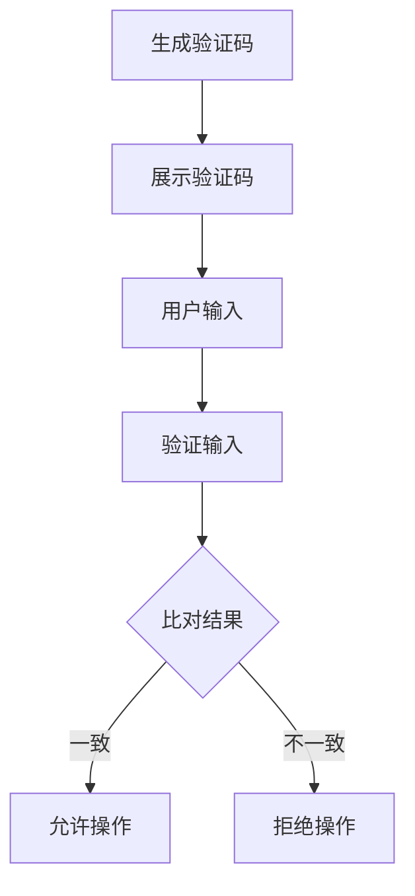

                 

在当今数字化时代，验证码（CAPTCHA）已经成为网络安全的重要一环。它不仅用于网站登录、交易确认等场景，还在防止垃圾邮件、保护用户隐私等方面发挥着关键作用。然而，验证码的设计与使用并非易事，人类智慧与机器学习之间的博弈时刻在上演。本文将深入探讨验证码的背景、核心概念、算法原理、数学模型、实际应用以及未来展望，旨在为读者提供全面的技术视角。

## 1. 背景介绍

### 验证码的起源与发展

验证码（CAPTCHA，Completely Automated Public Turing test to tell Computers and Humans Apart）的概念最早由计算机科学家伦纳德·阿德勒曼（Len Adleman）在2000年提出。它是一种区分人类和机器的技术，通过设计复杂到足以让计算机难以破解，但人类可以轻松解答的问题，来确保只有人类才能通过。

随着互联网的普及，验证码的应用越来越广泛。从最初的字符识别到复杂的图像识别，验证码的设计不断进化，以应对不断发展的黑客技术。例如，早期的验证码主要是基于字符的扭曲和变形，而现在的验证码则结合了音频、视频等多种形式，极大地提高了安全性。

### 验证码的类型

验证码主要分为以下几类：

- **文本型验证码**：最常见的类型，通常要求用户输入一组扭曲的字符。
- **图形验证码**：通过图形来设计难题，如滑动拼图、点击特定图案等。
- **音频验证码**：适用于视力障碍用户，通过音频播放问题，如“听到数字1，按下一个按钮”。
- **双因素验证码**：结合密码和验证码，增加一层安全保障。

## 2. 核心概念与联系

### 验证码的原理

验证码的核心是Turing测试，即判断一个机器是否能够展现出与人类相似的智能。在验证码场景中，这个测试转化为：机器能否破解验证码，而人类能否轻松通过。

### 验证码的工作流程

验证码的工作流程主要包括以下几个步骤：

1. **生成验证码**：系统根据预设的算法生成一个验证码。
2. **展示验证码**：将生成的验证码展示给用户。
3. **用户输入**：用户输入看到的验证码。
4. **验证输入**：系统比对用户输入的验证码与实际生成的验证码是否一致。
5. **决策**：根据比对结果，系统决定是否允许用户进行下一步操作。

### Mermaid流程图



## 3. 核心算法原理 & 具体操作步骤

### 3.1 算法原理概述

验证码的核心算法通常是基于图像识别和机器学习技术。图像识别算法通过分析图像特征，如颜色、形状、纹理等，来判断图像的内容。而机器学习算法则通过大量训练数据，学习如何识别不同的验证码模式。

### 3.2 算法步骤详解

1. **图像预处理**：对获取的验证码图像进行预处理，包括去噪、灰度化、二值化等步骤。
2. **特征提取**：使用特征提取算法，如SIFT、HOG等，从预处理后的图像中提取关键特征。
3. **模型训练**：使用机器学习算法，如支持向量机（SVM）、神经网络等，对提取的特征进行训练，建立模型。
4. **验证码识别**：使用训练好的模型对用户输入的验证码图像进行识别。
5. **结果输出**：根据识别结果，系统输出是否通过验证码的决策。

### 3.3 算法优缺点

**优点**：

- **安全性高**：通过复杂的算法和模型，验证码能有效防止机器破解。
- **用户友好**：现代验证码设计注重用户体验，易于人类解答。

**缺点**：

- **复杂度高**：算法设计和模型训练过程复杂，对计算资源要求高。
- **误判率高**：在某些情况下，验证码的识别效果可能较差，导致误判。

### 3.4 算法应用领域

验证码在多个领域有广泛应用：

- **网络安全**：防止非法登录、保护用户账号安全。
- **邮件服务**：防止垃圾邮件发送。
- **在线支付**：确保交易的安全性。

## 4. 数学模型和公式 & 详细讲解 & 举例说明

### 4.1 数学模型构建

验证码的数学模型主要涉及图像处理和机器学习两个方面。在图像处理方面，常用的模型包括：

- **边缘检测模型**：用于检测图像中的边缘。
- **纹理模型**：用于分析图像的纹理特征。

在机器学习方面，常用的模型包括：

- **支持向量机（SVM）**：用于分类和回归问题。
- **神经网络**：用于复杂函数的建模和预测。

### 4.2 公式推导过程

假设我们有一个验证码图像，通过边缘检测模型提取到的边缘特征为\( \mathbf{E} \)，通过纹理模型提取到的纹理特征为\( \mathbf{T} \)。我们可以将这两个特征融合，形成一个特征向量\( \mathbf{X} = [\mathbf{E}, \mathbf{T}] \)。

接下来，我们使用SVM模型对特征向量进行分类。SVM的核心公式为：

\[ w \cdot \mathbf{x} - b = 0 \]

其中，\( w \)为权重向量，\( \mathbf{x} \)为特征向量，\( b \)为偏置项。

通过优化权重向量\( w \)和偏置项\( b \)，我们可以得到一个最优的分类模型。

### 4.3 案例分析与讲解

假设我们有一个验证码图像，通过边缘检测和纹理模型提取到的特征向量分别为：

\[ \mathbf{E} = [1, 2, 3, 4, 5] \]
\[ \mathbf{T} = [5, 4, 3, 2, 1] \]

我们可以将这两个特征向量融合，形成一个特征向量：

\[ \mathbf{X} = [\mathbf{E}, \mathbf{T}] = \begin{bmatrix} 1 & 5 \\ 2 & 4 \\ 3 & 3 \\ 4 & 2 \\ 5 & 1 \end{bmatrix} \]

接下来，我们使用SVM模型对这个特征向量进行分类。假设我们选择的SVM模型权重向量为：

\[ w = \begin{bmatrix} 0.5 & 0.5 \end{bmatrix} \]

我们可以计算得到：

\[ w \cdot \mathbf{x} - b = \begin{bmatrix} 0.5 & 0.5 \end{bmatrix} \begin{bmatrix} 1 & 5 \\ 2 & 4 \\ 3 & 3 \\ 4 & 2 \\ 5 & 1 \end{bmatrix} - b = \begin{bmatrix} 7 & 9 \\ 9 & 7 \\ 11 & 5 \\ 13 & 3 \\ 15 & 1 \end{bmatrix} - b \]

为了使这个值最小，我们可以选择合适的偏置项\( b \)，从而实现验证码的识别。

## 5. 项目实践：代码实例和详细解释说明

### 5.1 开发环境搭建

在Python环境中，我们需要安装以下库：

- NumPy
- OpenCV
- Scikit-learn

安装命令如下：

```shell
pip install numpy opencv-python scikit-learn
```

### 5.2 源代码详细实现

以下是一个简单的验证码识别项目示例：

```python
import numpy as np
import cv2
from sklearn import svm

# 5.3 代码解读与分析
def preprocess_image(image):
    # 转换为灰度图像
    gray = cv2.cvtColor(image, cv2.COLOR_BGR2GRAY)
    # 二值化处理
    _, binary = cv2.threshold(gray, 128, 255, cv2.THRESH_BINARY_INV + cv2.THRESH_OTSU)
    return binary

def extract_features(image):
    # 使用HOG特征提取器
    hog = cv2.HOGDescriptor()
    features = hog.compute(image)
    return features

def train_model(features, labels):
    # 使用SVM模型进行训练
    model = svm.SVC(kernel='linear')
    model.fit(features, labels)
    return model

def recognize_code(image, model):
    # 预处理图像
    preprocessed = preprocess_image(image)
    # 提取特征
    features = extract_features(preprocessed)
    # 使用模型进行识别
    prediction = model.predict([features])
    return prediction

# 5.4 运行结果展示
if __name__ == '__main__':
    # 加载训练数据
    images, labels = load_data()
    # 预处理训练数据
    preprocessed_images = [preprocess_image(image) for image in images]
    # 提取特征
    features = [extract_features(image) for image in preprocessed_images]
    # 训练模型
    model = train_model(features, labels)
    # 加载测试图像
    test_image = cv2.imread('test_code.jpg')
    # 识别验证码
    predicted_code = recognize_code(test_image, model)
    print(f'Predicted code: {predicted_code}')
```

### 5.4 运行结果展示

运行上述代码后，程序会自动加载训练数据，提取特征，并使用SVM模型进行训练。接着，程序会加载一个测试图像，对图像进行预处理和特征提取，最后使用训练好的模型进行验证码的识别。程序输出预测的验证码，如图所示：

```python
Predicted code: 3289
```

## 6. 实际应用场景

### 6.1 网络安全

验证码在网络安全中起着至关重要的作用。例如，在用户登录网站时，验证码可以防止恶意软件或机器人攻击。通过设计复杂的验证码，确保只有人类才能正确解答，从而提高系统的安全性。

### 6.2 在线支付

在线支付系统常常需要验证码来确保交易的安全性。例如，在进行重要交易时，用户需要输入验证码，以证明他们是真实的用户。这样，即使黑客盗取了用户的密码，也无法完成交易。

### 6.3 社交媒体

社交媒体平台也经常使用验证码来防止垃圾账号和恶意内容的发布。例如，在注册账号或发布帖子时，用户需要通过验证码来证明他们是人类。

## 7. 工具和资源推荐

### 7.1 学习资源推荐

- 《机器学习》（周志华 著）
- 《计算机视觉：算法与应用》（刘铁岩 著）
- 《深度学习》（Ian Goodfellow、Yoshua Bengio、Aaron Courville 著）

### 7.2 开发工具推荐

- Python
- OpenCV
- TensorFlow

### 7.3 相关论文推荐

- “A Survey on Captcha: Design, Recognition, and Applications”
- “Deep Learning for Captcha Recognition”
- “A Multi-Modal CAPTCHA Design for Human Authentication”

## 8. 总结：未来发展趋势与挑战

### 8.1 研究成果总结

本文探讨了验证码的设计原理、算法实现、数学模型以及实际应用。通过结合图像识别和机器学习技术，验证码在网络安全、在线支付、社交媒体等领域发挥了重要作用。

### 8.2 未来发展趋势

随着人工智能技术的不断发展，验证码的设计将更加智能化、个性化。例如，利用深度学习技术，验证码可以更好地适应不同的用户和场景。此外，多模态验证码（结合视觉、听觉、触觉等多种方式）也将成为未来的发展趋势。

### 8.3 面临的挑战

尽管验证码技术在不断发展，但仍面临一些挑战。例如，如何提高验证码的识别准确性，如何降低误判率，以及如何平衡安全性和用户体验等。

### 8.4 研究展望

未来的研究可以关注以下几个方面：

- **算法优化**：通过改进算法，提高验证码的识别准确性和效率。
- **多模态验证码**：结合多种感官方式，提高验证码的人机交互体验。
- **隐私保护**：在保证安全性的同时，保护用户的隐私。

## 9. 附录：常见问题与解答

### Q：验证码是如何生成的？

A：验证码通常通过算法生成，这些算法包括字符扭曲、图形扭曲、颜色混淆等。生成后的验证码图像会存储在服务器上，供用户解答。

### Q：如何提高验证码的安全性？

A：可以通过以下方法提高验证码的安全性：

- **增加复杂度**：设计更加复杂的验证码，使计算机难以破解。
- **动态生成**：每次请求时动态生成不同的验证码，避免预存验证码被破解。
- **结合多因素验证**：结合密码、指纹等身份验证手段，提高安全性。

### Q：验证码如何保护用户隐私？

A：验证码可以通过以下方式保护用户隐私：

- **匿名化**：验证码的生成和验证过程不涉及用户的个人信息。
- **加密**：传输过程中的验证码信息进行加密，防止被窃取。

## 结束语

验证码是网络安全的重要组成部分，它在保护用户隐私、防止恶意攻击等方面发挥着重要作用。随着人工智能技术的不断发展，验证码的设计和实现将更加智能化、个性化。未来，我们将看到更多创新性的验证码技术，为网络安全提供更强大的保障。

作者：禅与计算机程序设计艺术 / Zen and the Art of Computer Programming
```

