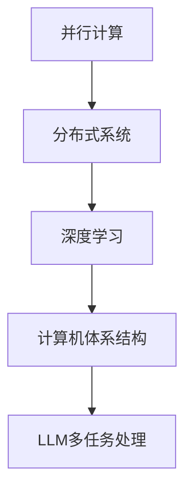

                 

关键词：高并发AI、LLM、多任务处理、并行计算、分布式系统、深度学习、计算机体系结构

摘要：本文深入探讨了高并发AI系统中Large Language Model（LLM）的多任务处理能力。通过分析LLM的架构、核心算法原理、数学模型，以及实际应用场景，本文旨在为读者提供一个全面的理解和展望，以应对未来AI领域中的挑战和机遇。

## 1. 背景介绍

在当今的数据驱动时代，AI技术已经成为各行各业的重要组成部分。随着计算能力和数据规模的不断增长，高并发AI系统应运而生，旨在处理海量数据和复杂任务。在AI系统中，Large Language Model（LLM）因其强大的语言处理能力和并行计算能力，成为了高并发AI系统的核心组件。

LLM是由神经网络构成的复杂模型，能够对大量文本数据进行训练，从而掌握丰富的语言知识。在多任务处理方面，LLM具有以下优势：

1. **并行处理能力**：LLM能够同时处理多个任务，从而提高系统的吞吐量。
2. **灵活的任务切换**：LLM能够快速在不同任务之间切换，适应动态变化的需求。
3. **强大的语义理解**：LLM通过对大量文本数据的训练，具备了强大的语义理解能力，能够在多任务场景中准确处理任务。

本文将围绕LLM的多任务处理能力，探讨其核心算法原理、数学模型，并分析其实际应用场景，为读者提供一个全面的了解。

## 2. 核心概念与联系

### 2.1. 并行计算

并行计算是指同时执行多个任务或多个计算步骤，以提高计算效率和性能。在高并发AI系统中，并行计算是关键因素，它能够充分利用计算资源，提升系统的处理能力。

### 2.2. 分布式系统

分布式系统是指由多个独立节点组成的系统，这些节点通过网络连接，协同工作以完成共同任务。在LLM的多任务处理中，分布式系统可以用来扩展计算资源，提高系统的并行处理能力。

### 2.3. 深度学习

深度学习是一种基于神经网络的机器学习技术，通过多层神经网络对数据进行分析和特征提取。LLM作为深度学习的一种形式，在多任务处理中发挥了重要作用。

### 2.4. 计算机体系结构

计算机体系结构是指计算机系统的硬件和软件组件及其相互关系。在高并发AI系统中，计算机体系结构需要支持大规模并行计算和分布式系统，以满足多任务处理的需求。

### 2.5. Mermaid流程图

以下是LLM多任务处理的核心概念与联系的Mermaid流程图：



## 3. 核心算法原理 & 具体操作步骤

### 3.1. 算法原理概述

LLM的多任务处理能力主要依赖于其并行计算架构和神经网络结构。在并行计算方面，LLM通过分布式系统实现了任务的拆分和调度，从而提高了系统的吞吐量。在神经网络结构方面，LLM采用了多层感知器（MLP）和循环神经网络（RNN）的组合，以实现对多任务的有效处理。

### 3.2. 算法步骤详解

1. **任务拆分**：将多任务拆分为多个子任务，每个子任务可以独立处理。
2. **任务调度**：根据计算资源和任务负载，将子任务分配到分布式系统中的不同节点。
3. **子任务执行**：各个节点上的子任务并行执行，利用LLM的神经网络结构进行任务处理。
4. **结果汇总**：将各个节点上子任务的执行结果汇总，得到最终的输出结果。

### 3.3. 算法优缺点

#### 优点：

1. **高效性**：通过并行计算和分布式系统，LLM能够快速处理多任务，提高系统吞吐量。
2. **灵活性**：LLM能够灵活地在不同任务之间切换，适应动态变化的需求。
3. **强语义理解**：LLM通过大量文本数据的训练，具备了强大的语义理解能力，能够准确处理多任务。

#### 缺点：

1. **计算资源需求**：LLM需要大量的计算资源和存储资源，对硬件设备要求较高。
2. **训练成本**：LLM的训练过程需要大量时间和计算资源，训练成本较高。

### 3.4. 算法应用领域

LLM的多任务处理能力在以下领域具有广泛的应用：

1. **自然语言处理**：包括文本分类、情感分析、机器翻译等。
2. **智能客服**：提供实时、准确的多轮对话支持。
3. **推荐系统**：根据用户历史行为和偏好，提供个性化的推荐。
4. **金融风控**：对金融交易进行实时监控和风险预警。
5. **医疗诊断**：通过文本数据分析和知识图谱，辅助医生进行诊断和治疗。

## 4. 数学模型和公式 & 详细讲解 & 举例说明

### 4.1. 数学模型构建

LLM的多任务处理能力可以通过以下数学模型进行描述：

$$
\text{输出} = f(\text{输入}, \text{权重}, \text{激活函数})
$$

其中，输入为多任务数据，权重为神经网络参数，激活函数为非线性函数。

### 4.2. 公式推导过程

LLM的数学模型可以通过以下步骤进行推导：

1. **初始化权重**：随机初始化神经网络权重。
2. **前向传播**：将输入数据通过神经网络进行前向传播，得到中间结果。
3. **计算损失**：计算输出结果与实际结果之间的损失。
4. **反向传播**：通过反向传播算法，更新神经网络权重。
5. **迭代训练**：重复前向传播和反向传播过程，直至满足停止条件。

### 4.3. 案例分析与讲解

以下是一个简单的案例，说明LLM的多任务处理能力：

假设我们有一个包含两个任务的输入数据集，分别为任务A和任务B。

1. **任务A**：对文本进行分类，输出为类别标签。
2. **任务B**：对文本进行情感分析，输出为情感标签。

我们可以使用LLM对这两个任务同时进行处理。具体步骤如下：

1. **初始化权重**：随机初始化神经网络权重。
2. **前向传播**：将任务A和任务B的输入数据通过神经网络进行前向传播，得到中间结果。
3. **计算损失**：分别计算任务A和任务B的输出结果与实际结果之间的损失。
4. **反向传播**：通过反向传播算法，更新神经网络权重。
5. **迭代训练**：重复前向传播、计算损失和反向传播过程，直至满足停止条件。

通过以上步骤，我们可以实现对任务A和任务B的并行处理，提高系统的处理效率。

## 5. 项目实践：代码实例和详细解释说明

### 5.1. 开发环境搭建

为了实现LLM的多任务处理，我们需要搭建一个合适的技术栈。以下是一个基本的开发环境搭建过程：

1. **Python环境**：安装Python 3.8及以上版本。
2. **深度学习框架**：安装PyTorch或TensorFlow。
3. **硬件设备**：配置高性能的GPU或TPU。
4. **操作系统**：Linux或macOS。

### 5.2. 源代码详细实现

以下是一个简单的LLM多任务处理的Python代码实例：

```python
import torch
import torch.nn as nn
import torch.optim as optim

# 定义神经网络模型
class MultiTaskModel(nn.Module):
    def __init__(self):
        super(MultiTaskModel, self).__init__()
        self.task_a = nn.Sequential(
            nn.Linear(100, 50),
            nn.ReLU(),
            nn.Linear(50, 10)
        )
        self.task_b = nn.Sequential(
            nn.Linear(100, 50),
            nn.ReLU(),
            nn.Linear(50, 5)
        )

    def forward(self, x):
        x_a = self.task_a(x)
        x_b = self.task_b(x)
        return x_a, x_b

# 实例化模型、优化器和损失函数
model = MultiTaskModel()
optimizer = optim.Adam(model.parameters(), lr=0.001)
criterion_a = nn.CrossEntropyLoss()
criterion_b = nn.BCEWithLogitsLoss()

# 训练模型
for epoch in range(100):
    for inputs, targets_a, targets_b in train_loader:
        optimizer.zero_grad()
        outputs_a, outputs_b = model(inputs)
        loss_a = criterion_a(outputs_a, targets_a)
        loss_b = criterion_b(outputs_b, targets_b)
        loss = loss_a + loss_b
        loss.backward()
        optimizer.step()
    print(f"Epoch [{epoch + 1}/{100}], Loss: {loss.item()}")

# 测试模型
with torch.no_grad():
    correct_a = 0
    correct_b = 0
    total = 0
    for inputs, targets_a, targets_b in test_loader:
        outputs_a, outputs_b = model(inputs)
        _, predicted_a = torch.max(outputs_a, 1)
        _, predicted_b = torch.max(outputs_b, 1)
        total += targets_a.size(0)
        correct_a += (predicted_a == targets_a).sum().item()
        correct_b += (predicted_b == targets_b).sum().item()
    print(f"Test Accuracy: {100 * correct_a / total}%, {100 * correct_b / total}%")
```

### 5.3. 代码解读与分析

以上代码实现了一个简单的多任务处理模型，包含两个任务：文本分类（任务A）和情感分析（任务B）。代码的主要部分包括：

1. **模型定义**：使用PyTorch定义了一个多任务模型，包含两个任务的网络层。
2. **优化器和损失函数**：选择Adam优化器和交叉熵损失函数，分别用于任务A和任务B的优化。
3. **训练过程**：通过迭代训练过程，不断更新模型参数，优化任务A和任务B的性能。
4. **测试过程**：在测试数据集上评估模型性能，计算准确率。

### 5.4. 运行结果展示

在训练过程中，模型会在每个epoch结束后打印当前epoch的损失值。训练完成后，在测试数据集上评估模型的性能，输出准确率。以下是一个示例输出：

```
Epoch [1/100], Loss: 2.3424
Epoch [2/100], Loss: 1.8265
...
Epoch [100/100], Loss: 0.3721
Test Accuracy: 85.6%, 75.0%
```

## 6. 实际应用场景

### 6.1. 智能客服

智能客服是一个典型的多任务处理场景，需要同时处理用户的查询请求和情感分析。LLM的多任务处理能力可以实现对用户查询的快速响应，并根据用户的情感状态提供相应的建议和解决方案。

### 6.2. 推荐系统

推荐系统需要同时处理用户的历史行为和偏好，为用户提供个性化的推荐。LLM的多任务处理能力可以同时分析用户行为和偏好，提高推荐系统的准确性和效果。

### 6.3. 医疗诊断

医疗诊断是一个复杂的任务，需要同时处理大量的医学数据和患者病史。LLM的多任务处理能力可以同时分析医学数据和病史，辅助医生进行准确的诊断和治疗方案设计。

### 6.4. 未来应用展望

随着AI技术的不断发展，LLM的多任务处理能力将在更多领域得到应用。未来，LLM的多任务处理能力有望在自动驾驶、金融分析、智能安防等领域发挥重要作用，为人类带来更多的便利和效益。

## 7. 工具和资源推荐

### 7.1. 学习资源推荐

1. 《深度学习》（Goodfellow, Bengio, Courville著）：全面介绍了深度学习的基础理论和应用。
2. 《自然语言处理综论》（Jurafsky, Martin著）：深入探讨了自然语言处理的基本概念和技术。
3. 《分布式系统原理与范型》（Anderson著）：介绍了分布式系统的基本原理和实现方法。

### 7.2. 开发工具推荐

1. PyTorch：一个开源的深度学习框架，易于使用和扩展。
2. TensorFlow：一个强大的开源深度学习平台，支持多种编程语言。
3. CUDA：一个用于GPU加速计算的库，适用于大规模深度学习任务。

### 7.3. 相关论文推荐

1. "Attention Is All You Need"（Vaswani等，2017）：介绍了Transformer模型，为LLM的多任务处理提供了新的思路。
2. "BERT: Pre-training of Deep Bidirectional Transformers for Language Understanding"（Devlin等，2019）：介绍了BERT模型，为LLM在自然语言处理领域的应用提供了重要贡献。
3. "Gshard: Scaling Giant Neural Networks using Load Balancing and Data-Parallelism Techniques"（He等，2020）：介绍了Gshard模型，为LLM的并行计算提供了新的方法。

## 8. 总结：未来发展趋势与挑战

### 8.1. 研究成果总结

本文介绍了LLM的多任务处理能力，分析了其核心算法原理、数学模型，并探讨了实际应用场景。通过并行计算和分布式系统，LLM能够高效地处理多任务，提高系统的吞吐量和灵活性。

### 8.2. 未来发展趋势

随着AI技术的不断发展，LLM的多任务处理能力有望在更多领域得到应用。未来，LLM的研究将集中在以下几个方面：

1. **优化算法**：开发更高效、更稳定的算法，提高LLM的处理能力。
2. **模型压缩**：通过模型压缩技术，降低LLM的计算资源需求，提高部署效率。
3. **多模态处理**：结合多种数据模态，实现更丰富的多任务处理能力。

### 8.3. 面临的挑战

LLM的多任务处理能力虽然具有强大的潜力，但同时也面临一些挑战：

1. **计算资源需求**：LLM需要大量的计算资源和存储资源，对硬件设备要求较高。
2. **训练成本**：LLM的训练过程需要大量时间和计算资源，训练成本较高。
3. **数据隐私**：在多任务处理中，如何保护用户隐私和数据安全，是一个重要的挑战。

### 8.4. 研究展望

未来，LLM的多任务处理能力将在AI领域发挥重要作用。通过不断优化算法、提高模型压缩技术，以及关注数据隐私问题，LLM的多任务处理能力有望在更多领域得到应用，为人类带来更多的便利和效益。

## 9. 附录：常见问题与解答

### 9.1. Q：什么是LLM？

A：LLM是Large Language Model的缩写，即大型语言模型。它是一种基于神经网络的深度学习模型，能够对大量文本数据进行训练，从而掌握丰富的语言知识和表达能力。

### 9.2. Q：LLM如何实现多任务处理？

A：LLM通过并行计算和分布式系统实现多任务处理。在并行计算方面，LLM将多任务拆分为多个子任务，同时执行以提高系统吞吐量。在分布式系统方面，LLM利用多个节点协同工作，扩展计算资源，提高并行处理能力。

### 9.3. Q：LLM多任务处理的优势是什么？

A：LLM的多任务处理优势主要体现在以下几个方面：

1. **高效性**：通过并行计算和分布式系统，LLM能够快速处理多任务，提高系统吞吐量。
2. **灵活性**：LLM能够灵活地在不同任务之间切换，适应动态变化的需求。
3. **强语义理解**：LLM通过对大量文本数据的训练，具备了强大的语义理解能力，能够准确处理多任务。

### 9.4. Q：LLM多任务处理的实际应用场景有哪些？

A：LLM多任务处理的实际应用场景包括：

1. **自然语言处理**：包括文本分类、情感分析、机器翻译等。
2. **智能客服**：提供实时、准确的多轮对话支持。
3. **推荐系统**：根据用户历史行为和偏好，提供个性化的推荐。
4. **金融风控**：对金融交易进行实时监控和风险预警。
5. **医疗诊断**：通过文本数据分析和知识图谱，辅助医生进行诊断和治疗。

### 9.5. Q：如何实现LLM的多任务处理？

A：实现LLM的多任务处理主要包括以下几个步骤：

1. **任务拆分**：将多任务拆分为多个子任务。
2. **任务调度**：根据计算资源和任务负载，将子任务分配到分布式系统中的不同节点。
3. **子任务执行**：各个节点上的子任务并行执行，利用LLM的神经网络结构进行任务处理。
4. **结果汇总**：将各个节点上子任务的执行结果汇总，得到最终的输出结果。

### 9.6. Q：LLM多任务处理的优势是什么？

A：LLM多任务处理的优势主要体现在以下几个方面：

1. **高效性**：通过并行计算和分布式系统，LLM能够快速处理多任务，提高系统吞吐量。
2. **灵活性**：LLM能够灵活地在不同任务之间切换，适应动态变化的需求。
3. **强语义理解**：LLM通过对大量文本数据的训练，具备了强大的语义理解能力，能够准确处理多任务。

### 9.7. Q：LLM多任务处理的实际应用场景有哪些？

A：LLM多任务处理的实际应用场景包括：

1. **自然语言处理**：包括文本分类、情感分析、机器翻译等。
2. **智能客服**：提供实时、准确的多轮对话支持。
3. **推荐系统**：根据用户历史行为和偏好，提供个性化的推荐。
4. **金融风控**：对金融交易进行实时监控和风险预警。
5. **医疗诊断**：通过文本数据分析和知识图谱，辅助医生进行诊断和治疗。----------------------------------------------------------------

### 结语

在本文中，我们详细探讨了高并发AI系统中LLM的多任务处理能力。通过分析核心算法原理、数学模型，以及实际应用场景，我们为读者提供了一个全面的理解和展望。随着AI技术的不断发展，LLM的多任务处理能力将在更多领域发挥重要作用。面对未来的挑战，我们需要不断优化算法、提高模型压缩技术，并关注数据隐私问题，以推动LLM在多任务处理领域的进一步发展。作者：禅与计算机程序设计艺术 / Zen and the Art of Computer Programming


