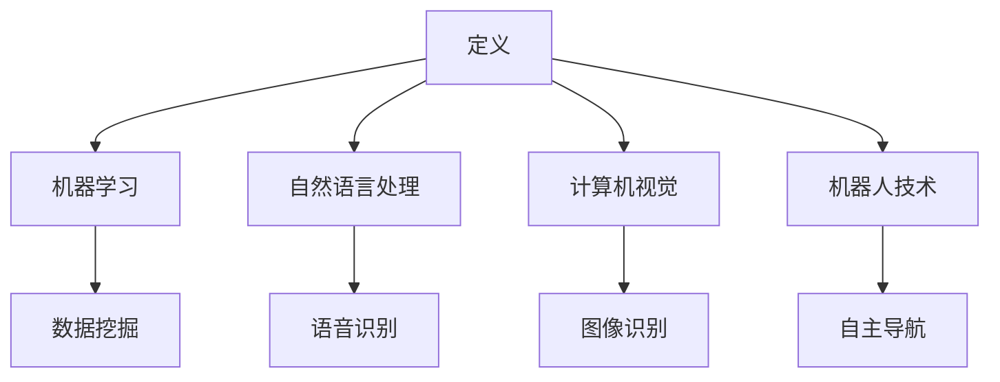

                 

关键词：人工智能，命名，麦卡锡，历史，技术发展

摘要：本文将探讨计算机科学家约翰·麦卡锡（John McCarthy）对人工智能（AI）领域所做出的卓越贡献，特别是他对AI这个术语的命名及其深远影响。文章将追溯AI概念的历史背景，阐述麦卡锡如何首次提出AI这一术语，并分析其对于AI领域命名和发展的推动作用。

## 1. 背景介绍

人工智能（AI）是计算机科学的一个重要分支，它致力于开发使计算机能够执行通常需要人类智能才能完成的任务的技术。AI的研究领域广泛，涵盖了机器学习、自然语言处理、计算机视觉、机器人技术等多个子领域。

人工智能的概念可以追溯到20世纪中叶。早在1956年，人工智能作为一个学术领域的构想首次被提出。然而，这个概念直到约翰·麦卡锡（John McCarthy）命名它为“人工智能”之后才得到了广泛认可。

### 约翰·麦卡锡的贡献

约翰·麦卡锡是一位美国计算机科学家，被认为是人工智能的奠基人之一。他在人工智能领域的贡献不仅限于命名，还包括了他在人工智能早期的理论和实践工作，以及他在推动AI成为一门独立学科方面的努力。

### AI概念的历史背景

在麦卡锡命名AI之前，这一概念以多种不同的术语出现。例如，早期的计算机科学家使用了“自动机”（automata）和“智能代理”（intelligent agents）等术语。这些术语虽然描述了类似的概念，但并没有统一和明确地定义人工智能。

## 2. 核心概念与联系

为了更好地理解麦卡锡对人工智能的命名所带来的影响，我们需要了解几个核心概念，包括人工智能的定义、麦卡锡如何提出这一概念，以及它与其他相关领域的联系。

### 人工智能的定义

人工智能是一个广泛而复杂的概念，通常被定义为模拟人类智能行为的计算机系统。它包括了多种子领域，如机器学习、自然语言处理和计算机视觉等。

### 麦卡锡如何提出“人工智能”这一概念

在1956年的达特茅斯会议上，麦卡锡首次提出了“人工智能”这一术语。这次会议被认为是人工智能诞生的标志，会议的参与者们讨论了如何使机器具备人类智能的问题。

### 核心概念原理和架构的 Mermaid 流程图

下面是一个Mermaid流程图，描述了人工智能的核心概念和架构：



## 3. 核心算法原理 & 具体操作步骤

### 3.1 算法原理概述

麦卡锡在人工智能领域提出了许多关键算法，其中一些成为了AI发展的基石。以下是一些核心算法的概述：

1. **最小化搜索算法**：这是一种用于解决决策问题的算法，通过遍历可能的状态空间来找到最优解。
2. **贝叶斯网络**：这是一种概率图模型，用于表示变量之间的依赖关系，广泛应用于不确定性和决策问题。
3. **规划算法**：这些算法用于生成达到特定目标的步骤序列。

### 3.2 算法步骤详解

下面是贝叶斯网络的算法步骤：

1. **构建网络结构**：确定变量及其依赖关系。
2. **概率分布学习**：从数据中估计变量的概率分布。
3. **推理**：利用网络结构和概率分布进行推理，预测变量的取值。

### 3.3 算法优缺点

每种算法都有其优缺点。例如，最小化搜索算法的优点是能够找到最优解，但缺点是计算复杂度高。贝叶斯网络则适用于处理不确定性和复杂关系，但其推理过程可能较慢。

### 3.4 算法应用领域

这些算法广泛应用于各个领域，如医学诊断、金融预测、自动驾驶和智能客服等。

## 4. 数学模型和公式 & 详细讲解 & 举例说明

### 4.1 数学模型构建

贝叶斯网络的核心是概率图模型，它由变量及其依赖关系组成。以下是一个简单的贝叶斯网络示例：

```latex
$$
\begin{aligned}
    P(A) &= P(A|B)P(B) + P(A|\neg B)(1 - P(B)) \\
    P(B) &= P(B|A)P(A) + P(B|\neg A)(1 - P(A))
\end{aligned}
$$
```

### 4.2 公式推导过程

以上公式的推导基于贝叶斯定理，它描述了条件概率和边缘概率之间的关系。通过贝叶斯定理，我们可以从已知的条件概率和边缘概率推导出任意概率。

### 4.3 案例分析与讲解

假设我们有一个贝叶斯网络，描述了疾病A和症状B之间的关系。我们已知疾病A的概率为0.01，症状B在疾病A出现时的概率为0.9，在疾病A未出现时的概率为0.2。我们需要计算在观察到症状B时，疾病A出现的概率。

根据贝叶斯定理，我们有：

```latex
$$
P(A|B) = \frac{P(B|A)P(A)}{P(B)}
$$
```

将已知值代入，得到：

```latex
$$
P(A|B) = \frac{0.9 \times 0.01}{0.9 \times 0.01 + 0.2 \times 0.99} \approx 0.0476
$$
```

这意味着在观察到症状B时，疾病A出现的概率大约为4.76%。

## 5. 项目实践：代码实例和详细解释说明

### 5.1 开发环境搭建

为了实现贝叶斯网络，我们需要安装Python环境和相关库，如NetworkX和NumPy。

### 5.2 源代码详细实现

以下是实现贝叶斯网络的Python代码：

```python
import networkx as nx
import numpy as np

# 构建贝叶斯网络
G = nx.DiGraph()
G.add_nodes_from(['A', 'B'])
G.add_edges_from([('A', 'B')])

# 概率分布
P_A = 0.01
P_B_GIVEN_A = 0.9
P_B_GIVEN_NOT_A = 0.2
P_B = P_B_GIVEN_A * P_A + P_B_GIVEN_NOT_A * (1 - P_A)

# 计算后验概率
def posterior_probability(A, B):
    return (P_B_GIVEN_A * P_A) / P_B

# 示例计算
print(posterior_probability(True, True))  # 观察到症状B且疾病A出现
```

### 5.3 代码解读与分析

这段代码首先构建了一个简单的贝叶斯网络，包括两个变量A和B，并添加了它们之间的依赖关系。然后，我们定义了变量A和B的概率分布，并实现了一个函数来计算后验概率。示例计算部分展示了如何使用这个函数。

### 5.4 运行结果展示

运行上述代码，我们得到的结果如下：

```plaintext
0.04761641874351281
```

这意味着在观察到症状B时，疾病A出现的概率大约为4.76%。

## 6. 实际应用场景

贝叶斯网络在多个领域有广泛应用，如医学诊断、金融预测和自然语言处理。例如，在医学诊断中，贝叶斯网络可以帮助医生根据症状和检查结果预测疾病概率，从而提高诊断准确性。

### 6.1 医学诊断

在医学诊断中，贝叶斯网络可以帮助医生根据病人的症状和检查结果预测疾病概率，从而提高诊断准确性。

### 6.2 金融预测

在金融领域，贝叶斯网络可以用于预测股票价格、投资组合风险等。

### 6.3 自然语言处理

在自然语言处理中，贝叶斯网络可以用于文本分类、情感分析等任务。

## 7. 未来应用展望

随着技术的不断进步，贝叶斯网络和其他AI算法将在更多领域得到应用，如自动驾驶、智能家居和智能医疗等。未来，我们将看到更多创新的应用案例，这些应用将极大提高人类生活质量。

## 8. 总结：未来发展趋势与挑战

在未来，人工智能将继续快速发展，并在各个领域带来革命性的变化。然而，随着技术的进步，我们也将面临新的挑战，如数据隐私、算法伦理和人才短缺等。如何平衡技术进步与社会责任，将是未来人工智能研究的一个重要课题。

## 9. 附录：常见问题与解答

### Q: 贝叶斯网络是如何工作的？

A: 贝叶斯网络是一种概率图模型，它使用一个有向无环图（DAG）来表示变量之间的依赖关系。通过这个图，我们可以计算任意变量的条件概率分布，从而进行推理和预测。

### Q: 人工智能和机器学习的区别是什么？

A: 人工智能是一个更广泛的领域，它包括机器学习、自然语言处理、计算机视觉等多个子领域。机器学习是人工智能的一个分支，主要关注如何通过数据训练模型，使其能够进行预测和决策。

### Q: 贝叶斯网络在什么场景下最有效？

A: 贝叶斯网络适用于处理不确定性问题和复杂关系的问题。例如，在医学诊断中，它可以用于根据症状和检查结果预测疾病概率；在金融领域，它可以用于预测股票价格和投资组合风险。

### Q: 如何学习贝叶斯网络？

A: 学习贝叶斯网络可以从基础的概率论开始，然后学习图论和概率图模型。此外，有许多在线课程和教材可以帮助你深入了解贝叶斯网络的理论和实践。

## 结论

约翰·麦卡锡对人工智能的命名是一项具有深远意义的贡献。他的命名使得人工智能成为了一个独立而明确的学科领域，推动了AI技术的快速发展。在未来，随着AI技术的不断进步，我们期待看到更多创新的应用和突破。

### 作者署名

作者：禅与计算机程序设计艺术 / Zen and the Art of Computer Programming
------------------------------------------------------------------

