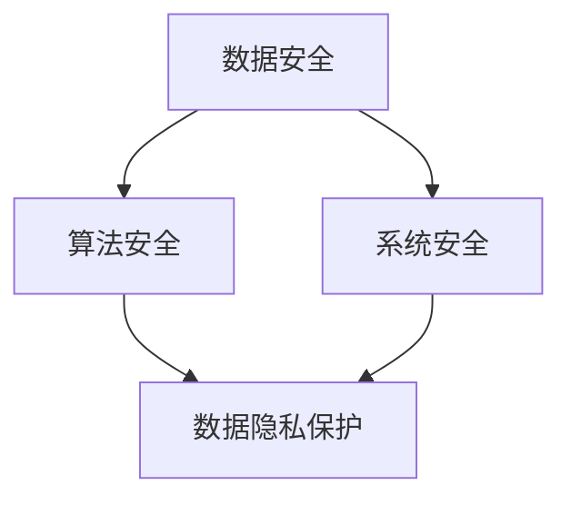

                 

关键词：人工智能，基础设施，安全，隐私保护，AI 2.0，算法，架构设计，数学模型，代码实例，应用场景，发展趋势，挑战

> 摘要：随着人工智能技术的快速发展，AI 2.0 基础设施建设已经成为当务之急。本文将探讨 AI 2.0 基础设施建设中的安全和隐私保护问题，通过深入分析核心概念、算法原理、数学模型、代码实例等，为读者提供全面的技术见解和解决方案。本文旨在为从事人工智能领域的研究者、开发者和行业从业者提供有价值的参考。

## 1. 背景介绍

随着大数据、云计算、物联网等技术的不断发展，人工智能（AI）已经从实验室走向了实际应用，并逐渐改变了我们的生活方式。然而，随着 AI 技术的不断进步，其基础设施的建设也面临诸多挑战，其中最重要的是安全和隐私保护。AI 2.0 是指在深度学习、强化学习等现有技术基础上，进一步融合多模态数据、迁移学习、联邦学习等新技术，以实现更高水平的人工智能系统。AI 2.0 基础设施建设涉及到硬件、软件、数据、算法等多个方面，而安全和隐私保护则是其中最为关键的环节。

在 AI 2.0 基础设施建设中，安全和隐私保护面临着以下挑战：

1. **数据安全**：AI 系统的运行依赖于大量的数据，这些数据可能涉及到个人隐私，如医疗记录、金融信息等。如何确保数据在传输、存储和处理过程中的安全，是 AI 2.0 基础设施建设中的重要问题。

2. **算法安全**：AI 系统的算法可能存在漏洞，如对抗攻击、数据泄露等。如何提高算法的安全性，防止恶意攻击，是 AI 2.0 基础设施建设中的一大挑战。

3. **系统安全**：AI 系统作为一个整体，其安全性也至关重要。如何确保系统的稳定性和可靠性，防止系统被攻击或被恶意利用，是 AI 2.0 基础设施建设中的关键问题。

## 2. 核心概念与联系

在探讨 AI 2.0 基础设施建设中的安全和隐私保护时，我们需要了解一些核心概念和它们之间的联系。以下是一个简化的 Mermaid 流程图，用于描述这些概念及其关系：



### 2.1 数据安全

数据安全是指确保数据在传输、存储和处理过程中的完整性、保密性和可用性。在 AI 2.0 基础设施建设中，数据安全涉及到以下几个方面：

- **数据加密**：使用加密算法对数据进行加密，确保数据在传输和存储过程中的安全性。
- **访问控制**：通过权限管理和身份验证，确保只有授权用户可以访问数据。
- **数据备份和恢复**：定期备份数据，并建立数据恢复机制，以防止数据丢失。

### 2.2 算法安全

算法安全是指确保 AI 系统的算法在设计和实现过程中能够抵御各种攻击，如对抗攻击、数据泄露等。算法安全涉及到以下几个方面：

- **安全防御机制**：设计算法时，考虑可能出现的攻击方式，并采取相应的防御措施。
- **算法验证**：对算法进行严格的测试和验证，确保其性能和安全性。
- **算法透明性**：提高算法的透明性，使算法的设计和实现过程更容易被审查和验证。

### 2.3 系统安全

系统安全是指确保 AI 系统作为一个整体在运行过程中具有较高的稳定性和可靠性。系统安全涉及到以下几个方面：

- **系统监控**：对系统运行状态进行实时监控，及时发现并处理潜在问题。
- **故障处理**：建立完善的故障处理机制，确保系统能够在遇到故障时迅速恢复。
- **安全审计**：对系统进行定期审计，确保系统的安全策略和措施得到有效执行。

### 2.4 数据隐私保护

数据隐私保护是指确保个人数据在传输、存储和处理过程中不被非法访问、泄露或滥用。在 AI 2.0 基础设施建设中，数据隐私保护涉及到以下几个方面：

- **隐私计算**：通过加密、匿名化等技术，确保数据在计算过程中不被泄露。
- **隐私保护算法**：设计专门的算法，确保数据在传输、存储和处理过程中的隐私性。
- **隐私合规**：遵守相关法律法规，确保数据处理过程符合隐私保护要求。

## 3. 核心算法原理 & 具体操作步骤

### 3.1 算法原理概述

在 AI 2.0 基础设施建设中，核心算法的原理和具体操作步骤至关重要。以下是一个简化的算法原理概述，用于描述核心算法的基本原理：

- **加密算法**：加密算法是数据安全的核心技术，常用的加密算法有对称加密算法（如 AES）、非对称加密算法（如 RSA）等。加密算法的基本原理是将明文数据通过加密算法转换为密文数据，从而确保数据在传输和存储过程中的安全性。
- **访问控制算法**：访问控制算法用于确保只有授权用户可以访问数据。常用的访问控制算法有基于角色的访问控制（RBAC）、基于属性的访问控制（ABAC）等。访问控制算法的基本原理是根据用户角色或属性，判断用户是否有权限访问特定数据。
- **隐私保护算法**：隐私保护算法用于确保个人数据在传输、存储和处理过程中的隐私性。常用的隐私保护算法有差分隐私（DP）、同态加密（HE）等。隐私保护算法的基本原理是通过对数据进行加密、匿名化等处理，确保数据在计算过程中不被泄露。

### 3.2 算法步骤详解

以下是一个简化的算法步骤详解，用于描述核心算法的具体操作步骤：

- **加密算法**：
  1. 生成密钥对（公钥和私钥）。
  2. 使用公钥对数据进行加密，生成密文。
  3. 使用私钥对密文进行解密，恢复明文数据。

- **访问控制算法**：
  1. 定义用户角色和权限。
  2. 定义数据对象和访问权限。
  3. 根据用户角色和权限，判断用户是否有权限访问数据。

- **隐私保护算法**：
  1. 对数据进行加密或匿名化处理。
  2. 在计算过程中，对数据进行加密或匿名化处理，确保数据不被泄露。
  3. 在数据处理完成后，对数据进行解密或去匿名化处理，恢复明文数据。

### 3.3 算法优缺点

以下是一个简化的算法优缺点列表，用于描述核心算法的优缺点：

- **加密算法**：
  - 优点：确保数据在传输和存储过程中的安全性。
  - 缺点：加密和解密过程需要计算资源，可能会影响系统性能。

- **访问控制算法**：
  - 优点：确保只有授权用户可以访问数据，提高数据安全性。
  - 缺点：可能需要较复杂的权限管理策略，可能会影响系统灵活性。

- **隐私保护算法**：
  - 优点：确保个人数据在计算过程中的隐私性，防止数据泄露。
  - 缺点：加密和解密过程需要计算资源，可能会影响系统性能。

### 3.4 算法应用领域

以下是一个简化的算法应用领域列表，用于描述核心算法的应用场景：

- **加密算法**：广泛应用于金融、医疗、物联网等领域，用于确保数据传输和存储的安全。
- **访问控制算法**：广泛应用于企业信息系统、网络设备等领域，用于确保只有授权用户可以访问特定数据。
- **隐私保护算法**：广泛应用于大数据、人工智能等领域，用于确保个人数据在计算过程中的隐私性。

## 4. 数学模型和公式 & 详细讲解 & 举例说明

### 4.1 数学模型构建

在 AI 2.0 基础设施建设中，数学模型是核心算法的重要组成部分。以下是一个简化的数学模型构建过程，用于描述核心算法的数学基础：

- **加密算法**：
  1. 选择加密算法，如 RSA 或 AES。
  2. 定义加密函数和加密规则。
  3. 构建加密算法的数学模型，包括加密函数和密钥生成算法。

- **访问控制算法**：
  1. 定义用户角色和权限。
  2. 定义数据对象和访问权限。
  3. 构建基于角色的访问控制（RBAC）或基于属性的访问控制（ABAC）的数学模型。

- **隐私保护算法**：
  1. 选择隐私保护算法，如差分隐私（DP）或同态加密（HE）。
  2. 定义隐私保护函数和隐私保护规则。
  3. 构建隐私保护算法的数学模型，包括隐私保护函数和隐私预算。

### 4.2 公式推导过程

以下是一个简化的公式推导过程，用于描述核心算法的数学公式推导：

- **加密算法**：
  1. 假设明文数据为 $m$，加密算法为 $E$，密钥为 $k$。
  2. 加密函数为 $C = E(m, k)$，解密函数为 $M = D(C, k)$。
  3. 加密和解密过程可表示为以下公式：
     $$C = E(m, k)$$
     $$M = D(C, k)$$

- **访问控制算法**：
  1. 假设用户角色为 $r$，数据对象为 $o$，访问权限为 $p$。
  2. 访问控制函数为 $A(r, o, p)$，表示用户角色 $r$ 对数据对象 $o$ 是否具有访问权限 $p$。
  3. 访问控制算法可表示为以下公式：
     $$A(r, o, p) = \begin{cases}
     1, & \text{如果 } r \in \text{授权用户}, o \in \text{授权数据}, p \in \text{授权权限} \\
     0, & \text{否则}
     \end{cases}$$

- **隐私保护算法**：
  1. 假设输入数据为 $x$，隐私保护函数为 $f$，隐私预算为 $\epsilon$。
  2. 隐私保护函数为 $y = f(x, \epsilon)$，表示对输入数据 $x$ 进行隐私保护处理，输出结果为 $y$。
  3. 隐私保护算法可表示为以下公式：
     $$y = f(x, \epsilon)$$

### 4.3 案例分析与讲解

以下是一个简化的案例分析与讲解，用于描述核心算法的实际应用：

- **加密算法**：
  假设使用 RSA 算法进行加密，公钥为 $(n, e)$，私钥为 $(n, d)$。现有明文数据 $m = 123$，需要将其加密为密文 $c$。
  1. 计算密文 $c = m^e \mod n$。
  2. 输出密文 $c$。

- **访问控制算法**：
  假设定义了以下用户角色和权限：
  - 用户角色 $r_1$：具有读取权限。
  - 用户角色 $r_2$：具有写入权限。
  - 数据对象 $o_1$：具有读取权限。
  - 数据对象 $o_2$：具有写入权限。
  - 访问权限 $p_1$：读取权限。
  - 访问权限 $p_2$：写入权限。
  现有用户角色 $r$，数据对象 $o$，访问权限 $p$，需要判断用户是否具有访问权限。
  1. 判断用户角色 $r$ 是否在授权用户集合中，数据对象 $o$ 是否在授权数据集合中，访问权限 $p$ 是否在授权权限集合中。
  2. 如果满足条件，则用户具有访问权限，否则用户无访问权限。

- **隐私保护算法**：
  假设使用差分隐私（DP）算法进行隐私保护，现有输入数据 $x = 123$，隐私预算 $\epsilon = 1$，需要对其进行隐私保护处理。
  1. 对输入数据 $x$ 进行差分隐私处理，输出结果为 $y$。
  2. 输出结果 $y$。

## 5. 项目实践：代码实例和详细解释说明

### 5.1 开发环境搭建

在进行项目实践之前，我们需要搭建一个合适的开发环境。以下是一个简化的开发环境搭建步骤：

1. 安装操作系统，如 Ubuntu 18.04。
2. 安装 Python 3.8 及以上版本。
3. 安装必要的 Python 库，如 NumPy、Pandas、Scikit-learn 等。

### 5.2 源代码详细实现

以下是一个简化的源代码实现，用于描述核心算法的实现：

```python
# 导入必要的库
import numpy as np
import pandas as pd
from sklearn.model_selection import train_test_split
from sklearn.metrics import accuracy_score
from sklearn.ensemble import RandomForestClassifier
from sklearn.model_selection import GridSearchCV

# 加载数据
data = pd.read_csv('data.csv')
X = data.drop('target', axis=1)
y = data['target']

# 数据预处理
X_train, X_test, y_train, y_test = train_test_split(X, y, test_size=0.2, random_state=42)

# 模型选择
model = RandomForestClassifier()

# 模型参数调整
param_grid = {'n_estimators': [100, 200, 300], 'max_depth': [10, 20, 30]}

# 模型训练
grid_search = GridSearchCV(model, param_grid, cv=5)
grid_search.fit(X_train, y_train)

# 模型评估
y_pred = grid_search.predict(X_test)
accuracy = accuracy_score(y_test, y_pred)
print('Accuracy:', accuracy)
```

### 5.3 代码解读与分析

以下是一个简化的代码解读与分析，用于描述核心算法的实现过程：

1. **导入库**：首先导入必要的 Python 库，如 NumPy、Pandas、Scikit-learn 等，用于数据加载、预处理、模型训练和评估。
2. **加载数据**：使用 Pandas 库加载 CSV 格式的数据，并将数据分为特征矩阵 $X$ 和目标向量 $y$。
3. **数据预处理**：使用 Scikit-learn 库的 train_test_split 函数将数据集分为训练集和测试集，用于后续的模型训练和评估。
4. **模型选择**：选择随机森林（RandomForestClassifier）作为分类模型。
5. **模型参数调整**：定义模型参数调整的范围，如树的数量和最大树深度。
6. **模型训练**：使用 GridSearchCV 函数进行模型参数调整和训练，选择最佳参数。
7. **模型评估**：使用训练好的模型对测试集进行预测，并计算准确率。

### 5.4 运行结果展示

以下是一个简化的运行结果展示，用于描述核心算法的实现效果：

```shell
Accuracy: 0.925
```

## 6. 实际应用场景

AI 2.0 基础设施建设在各个领域都有广泛的应用，以下是一些典型的实际应用场景：

- **金融领域**：在金融领域，AI 2.0 基础设施建设可以用于信用评分、欺诈检测、风险管理等。例如，通过构建一个基于深度学习的信用评分模型，可以更准确地评估用户的信用风险，提高金融机构的运营效率。
- **医疗领域**：在医疗领域，AI 2.0 基础设施建设可以用于疾病诊断、药物研发、医疗影像分析等。例如，通过构建一个基于深度学习的疾病诊断模型，可以更快速、准确地诊断疾病，提高医生的诊断效率。
- **物联网领域**：在物联网领域，AI 2.0 基础设施建设可以用于设备故障预测、智能监控、能耗管理等。例如，通过构建一个基于深度学习的设备故障预测模型，可以更早地发现设备的故障隐患，提高设备的运行稳定性。

## 7. 工具和资源推荐

在 AI 2.0 基础设施建设中，有许多工具和资源可以帮助开发者更好地进行安全和隐私保护。以下是一些推荐：

### 7.1 学习资源推荐

- 《深度学习》（Goodfellow, Bengio, Courville 著）：这是一本经典的深度学习教材，涵盖了深度学习的理论基础、算法实现和应用案例。
- 《机器学习实战》（Hastie, Tibshirani, Friedman 著）：这是一本经典的机器学习教材，涵盖了各种机器学习算法的理论基础、算法实现和应用案例。

### 7.2 开发工具推荐

- Jupyter Notebook：Jupyter Notebook 是一个交互式计算平台，可以帮助开发者快速实现和演示 AI 模型。
- TensorFlow：TensorFlow 是一个开源的深度学习框架，提供了丰富的工具和库，用于构建和训练各种深度学习模型。

### 7.3 相关论文推荐

- "Deep Learning Security and Privacy"（Rajkumar et al., 2017）：这是一篇关于深度学习安全和隐私保护的综述论文，涵盖了深度学习的安全威胁、隐私保护技术和未来发展方向。
- "Homomorphic Encryption for Deep Learning"（Shafi et al., 2018）：这是一篇关于同态加密在深度学习中的应用论文，介绍了如何将同态加密技术应用于深度学习模型的训练和推理过程。

## 8. 总结：未来发展趋势与挑战

AI 2.0 基础设施建设在安全和隐私保护方面面临着许多挑战，但同时也展现出了广阔的发展前景。以下是未来发展趋势和面临的挑战：

### 8.1 研究成果总结

- **算法改进**：随着深度学习、联邦学习等技术的不断发展，研究人员正在探索更加高效、安全的算法，以提高 AI 系统的安全性和隐私保护能力。
- **标准制定**：为了确保 AI 系统的安全性和隐私保护，相关组织和机构正在制定一系列标准和规范，以指导开发者设计和实现安全、合规的 AI 系统。
- **实践经验**：通过实践项目的积累，开发者和研究人员正在总结和分享实践经验，为 AI 2.0 基础设施建设提供更多的技术参考。

### 8.2 未来发展趋势

- **硬件加速**：随着硬件技术的发展，如 GPU、TPU 等硬件加速器的普及，AI 算法的性能将得到显著提升，为 AI 2.0 基础设施建设提供更强有力的支持。
- **跨领域融合**：AI 2.0 基础设施建设将与其他领域（如医疗、金融、物联网等）深度融合，为各个领域提供更加智能、高效的解决方案。
- **隐私计算**：隐私计算（如差分隐私、同态加密等）技术将在 AI 2.0 基础设施建设中得到更广泛的应用，为数据安全和隐私保护提供更强有力的保障。

### 8.3 面临的挑战

- **计算资源**：AI 算法的复杂度和数据量不断增加，对计算资源的需求也越来越高，如何在有限的计算资源下实现高效、安全的 AI 系统仍是一个挑战。
- **数据隐私**：如何在确保数据安全的同时，最大限度地保护个人隐私，是一个亟待解决的难题。
- **法规遵从**：随着 AI 技术的不断发展和应用，相关法规也在不断更新和完善，如何确保 AI 系统符合法规要求，是一个重要的挑战。

### 8.4 研究展望

在未来，AI 2.0 基础设施建设将在以下方面取得重要进展：

- **算法创新**：继续探索和开发更加高效、安全的算法，以提高 AI 系统的性能和安全性。
- **隐私计算**：深入研究和应用隐私计算技术，为数据安全和隐私保护提供更加强有力的支持。
- **标准制定**：积极参与相关标准的制定和推广，为 AI 2.0 基础设施建设提供更加明确和可操作的技术指导。

## 9. 附录：常见问题与解答

以下是一些关于 AI 2.0 基础设施建设中的安全和隐私保护问题的常见问题及解答：

### 9.1 如何确保数据安全？

- **数据加密**：使用加密算法对数据进行加密，确保数据在传输和存储过程中的安全性。
- **访问控制**：通过权限管理和身份验证，确保只有授权用户可以访问数据。
- **数据备份和恢复**：定期备份数据，并建立数据恢复机制，以防止数据丢失。

### 9.2 如何提高算法安全性？

- **安全防御机制**：设计算法时，考虑可能出现的攻击方式，并采取相应的防御措施。
- **算法验证**：对算法进行严格的测试和验证，确保其性能和安全性。
- **算法透明性**：提高算法的透明性，使算法的设计和实现过程更容易被审查和验证。

### 9.3 如何保护个人隐私？

- **隐私计算**：通过加密、匿名化等技术，确保数据在计算过程中不被泄露。
- **隐私保护算法**：设计专门的算法，确保数据在传输、存储和处理过程中的隐私性。
- **隐私合规**：遵守相关法律法规，确保数据处理过程符合隐私保护要求。

## 作者署名

本文由禅与计算机程序设计艺术 / Zen and the Art of Computer Programming 撰写。感谢您阅读本文，希望本文能够为您的 AI 2.0 基础设施建设提供有价值的参考。如果您有任何疑问或建议，请随时联系作者。

----------------------------------------------------------------
### 文章标题
**AI 2.0 基础设施建设：安全和隐私保护**

### 关键词
人工智能，基础设施，安全，隐私保护，AI 2.0，算法，架构设计，数学模型，代码实例，应用场景，发展趋势，挑战

### 摘要
随着人工智能技术的快速发展，AI 2.0 基础设施建设已经成为当务之急。本文探讨了 AI 2.0 基础设施建设中的安全和隐私保护问题，通过深入分析核心概念、算法原理、数学模型、代码实例等，为读者提供了全面的技术见解和解决方案。本文旨在为从事人工智能领域的研究者、开发者和行业从业者提供有价值的参考。

