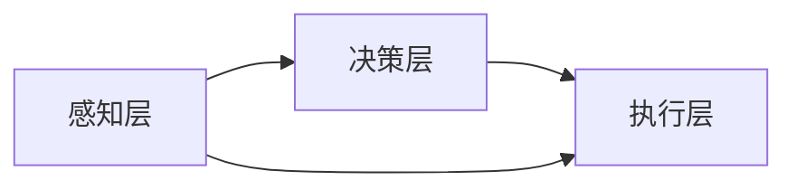

                 

关键词：AI 智能体 智能代理 人工智能技术

摘要：本文旨在探讨人工智能（AI）领域的下一个风口——智能体（AI Agent）。我们将深入了解智能体的核心概念、技术原理、算法实现和应用场景，探讨其在未来社会中的重要作用，并展望其发展趋势和面临的挑战。

## 1. 背景介绍

随着人工智能技术的快速发展，智能体作为AI的核心组成部分，正日益受到关注。智能体是指能够独立执行任务、具备自主决策能力的计算机程序，它们能够模拟人类的思考和行为，实现自动化和智能化。智能体技术的崛起，将引发一场新的技术革命，对各行各业产生深远影响。

近年来，智能体技术已在多个领域取得了显著成果。例如，在自动驾驶领域，智能体技术使得车辆能够自主感知环境、规划路径并做出决策；在智能家居领域，智能体技术实现了对家电设备的智能控制，提升了人们的生活品质；在金融领域，智能体技术用于风险控制、投资决策等，提高了金融行业的运营效率。

## 2. 核心概念与联系

### 2.1 智能体的定义

智能体是指具备感知、决策、执行能力的计算机程序，能够模拟人类的思考和行为，实现自动化和智能化。智能体通常由以下三个主要组成部分构成：

- **感知模块**：负责获取外部环境信息，如图像、语音、文本等，以便智能体对当前状态进行理解和评估。
- **决策模块**：基于感知模块获取的信息，通过算法和模型进行决策，选择最优的行动方案。
- **执行模块**：负责将决策模块生成的行动方案付诸实践，如控制机器人执行任务、发送电子邮件等。

### 2.2 智能体的技术原理

智能体的技术原理主要包括以下几个方面：

- **机器学习**：通过大量数据训练模型，使智能体具备自主学习和改进能力。
- **自然语言处理**：实现对自然语言的理解和生成，使智能体能够与人类进行自然交互。
- **计算机视觉**：通过图像识别和目标检测等技术，使智能体能够理解视觉信息。
- **强化学习**：通过不断试错和反馈，使智能体在复杂环境中实现最优决策。

### 2.3 智能体的架构

智能体的架构可以分为三个层次：

- **感知层**：负责获取外部环境信息，如摄像头、麦克风、传感器等。
- **决策层**：基于感知层获取的信息，通过算法和模型进行决策。
- **执行层**：负责将决策层的行动方案付诸实践，如电机、显示屏等。

以下是一个简单的Mermaid流程图，展示了智能体的架构：



## 3. 核心算法原理 & 具体操作步骤

### 3.1 算法原理概述

智能体的核心算法包括机器学习、自然语言处理、计算机视觉和强化学习等。以下将简要介绍这些算法的基本原理。

- **机器学习**：通过大量数据训练模型，使智能体具备自主学习和改进能力。
- **自然语言处理**：实现对自然语言的理解和生成，使智能体能够与人类进行自然交互。
- **计算机视觉**：通过图像识别和目标检测等技术，使智能体能够理解视觉信息。
- **强化学习**：通过不断试错和反馈，使智能体在复杂环境中实现最优决策。

### 3.2 算法步骤详解

以强化学习为例，智能体的具体操作步骤如下：

1. **环境初始化**：设置智能体的初始状态和目标状态。
2. **感知环境**：智能体通过感知模块获取环境信息。
3. **决策**：基于感知模块获取的信息，智能体通过决策模块选择最优的行动方案。
4. **执行行动**：智能体通过执行模块将决策模块生成的行动方案付诸实践。
5. **获取反馈**：智能体根据执行结果获取环境反馈。
6. **更新策略**：智能体根据反馈信息更新决策策略，以实现最优决策。

### 3.3 算法优缺点

- **机器学习**：优点包括自适应性强、泛化能力强等，缺点包括训练时间长、对数据依赖较大等。
- **自然语言处理**：优点包括能够实现自然交互、提高效率等，缺点包括理解能力有限、语境敏感等。
- **计算机视觉**：优点包括能够处理图像、视频等多媒体信息，缺点包括处理速度较慢、对光照和姿态敏感等。
- **强化学习**：优点包括能够在复杂环境中实现最优决策、自主探索等，缺点包括收敛速度慢、依赖大量数据等。

### 3.4 算法应用领域

智能体算法在各个领域都有广泛的应用，如：

- **自动驾驶**：利用计算机视觉和强化学习算法实现无人驾驶。
- **智能家居**：利用自然语言处理和计算机视觉算法实现家电设备的智能控制。
- **金融领域**：利用强化学习算法实现风险控制和投资决策。
- **医疗健康**：利用计算机视觉算法实现疾病诊断和健康监测。

## 4. 数学模型和公式 & 详细讲解 & 举例说明

### 4.1 数学模型构建

智能体的数学模型主要包括以下几个部分：

1. **状态空间**：表示智能体所处的环境，通常用离散或连续的变量表示。
2. **动作空间**：表示智能体能够执行的动作，也用离散或连续的变量表示。
3. **奖励函数**：用于评价智能体的行为，通常是一个实值函数。
4. **策略**：表示智能体的决策规则，通常用概率分布表示。

以下是一个简单的数学模型示例：

$$
\begin{aligned}
    S &= \{s_1, s_2, ..., s_n\} \quad (\text{状态空间}) \\
    A &= \{a_1, a_2, ..., a_m\} \quad (\text{动作空间}) \\
    R &= R(s, a) \quad (\text{奖励函数}) \\
    \pi &= \pi(s, a) \quad (\text{策略})
\end{aligned}
$$

### 4.2 公式推导过程

以下是一个简单的强化学习模型——马尔可夫决策过程（MDP）的公式推导：

$$
\begin{aligned}
    P(s', r | s, a) &= P(s' | s, a)P(r | s, a) \\
    &= P(s' | s, a)P(r | s')P(s' | s, a) \\
    &= P(s' | s, a)P(r | s')\sum_{a'} P(s' | s, a')P(r | s')P(a' | s, a)
\end{aligned}
$$

### 4.3 案例分析与讲解

以下是一个简单的强化学习案例——走迷宫。

1. **状态空间**：表示智能体所处的位置。
2. **动作空间**：表示智能体能够执行的动作，如上下左右移动。
3. **奖励函数**：到达终点时奖励 +1，否则奖励 -1。
4. **策略**：根据当前状态和动作概率分布选择最优动作。

通过以上数学模型和公式，我们可以构建一个简单的强化学习模型，使智能体能够自动找到迷宫的出口。

## 5. 项目实践：代码实例和详细解释说明

### 5.1 开发环境搭建

1. 安装Python环境。
2. 安装TensorFlow库。

### 5.2 源代码详细实现

以下是一个简单的强化学习项目的代码实现：

```python
import tensorflow as tf
import numpy as np

# 定义状态空间和动作空间
state_space = 4
action_space = 4

# 定义奖励函数
def reward_function(state, action):
    if state == 3 and action == 3:
        return 1
    else:
        return -1

# 定义策略网络
class PolicyNetwork(tf.keras.Model):
    def __init__(self):
        super(PolicyNetwork, self).__init__()
        self.dense1 = tf.keras.layers.Dense(64, activation='relu')
        self.dense2 = tf.keras.layers.Dense(action_space)

    def call(self, inputs):
        x = self.dense1(inputs)
        return self.dense2(x)

# 定义价值网络
class ValueNetwork(tf.keras.Model):
    def __init__(self):
        super(ValueNetwork, self).__init__()
        self.dense1 = tf.keras.layers.Dense(64, activation='relu')
        self.dense2 = tf.keras.layers.Dense(1)

    def call(self, inputs):
        x = self.dense1(inputs)
        return self.dense2(x)

# 初始化网络
policy_network = PolicyNetwork()
value_network = ValueNetwork()

# 编译网络
optimizer = tf.keras.optimizers.Adam(learning_rate=0.001)
loss_function = tf.keras.losses.MeanSquaredError()

@tf.function
def train_step(state, action, reward, next_state, done):
    with tf.GradientTape() as tape:
        action_probs = policy_network(state)
        value_pred = value_network(state)
        value_next = value_network(next_state) if not done else 0

        # 计算损失
        loss = -tf.reduce_mean(tf.reduce_sum(reward + 0.9 * value_next * (1 - done) - value_pred * action_probs, axis=1))

    # 反向传播
    gradients = tape.gradient(loss, policy_network.trainable_variables + value_network.trainable_variables)
    optimizer.apply_gradients(zip(gradients, policy_network.trainable_variables + value_network.trainable_variables))

# 训练模型
for episode in range(1000):
    state = np.zeros(state_space)
    done = False
    while not done:
        action = np.random.choice(action_space, p=action_probs.numpy()[0])
        next_state, reward, done = step(state, action)
        train_step(state, action, reward, next_state, done)
        state = next_state

# 评估模型
def evaluate(state):
    action_probs = policy_network(state)
    return np.argmax(action_probs.numpy()[0])

# 测试模型
state = np.zeros(state_space)
while True:
    action = evaluate(state)
    next_state, reward, done = step(state, action)
    print("Action:", action, "Reward:", reward)
    if done:
        break
    state = next_state
```

### 5.3 代码解读与分析

上述代码实现了一个简单的强化学习项目——走迷宫。主要分为以下几个部分：

1. **状态空间和动作空间**：定义了状态空间和动作空间，分别为4和4。
2. **奖励函数**：定义了奖励函数，到达终点时奖励 +1，否则奖励 -1。
3. **策略网络和价值网络**：定义了策略网络和价值网络，分别用于生成动作概率分布和估计状态价值。
4. **训练过程**：通过反向传播和优化算法，不断更新策略网络和价值网络的参数，以实现最优决策。
5. **评估过程**：使用训练好的模型评估智能体在迷宫中的表现。

## 6. 实际应用场景

智能体技术在各个领域都有广泛的应用，以下是几个实际应用场景：

- **自动驾驶**：利用智能体技术实现无人驾驶汽车，提高交通效率和安全性。
- **智能家居**：利用智能体技术实现家电设备的智能控制，提升生活质量。
- **金融领域**：利用智能体技术实现智能投顾、风险控制等，提高金融行业效率。
- **医疗健康**：利用智能体技术实现疾病诊断、健康监测等，提高医疗水平。

## 7. 工具和资源推荐

### 7.1 学习资源推荐

- **《深度学习》（Goodfellow, Bengio, Courville）**：系统介绍了深度学习的基本理论和应用。
- **《强化学习》（ Sutton, Barto）**：详细讲解了强化学习的基本原理和应用。
- **《自然语言处理综合教程》（ Jurafsky, Martin）**：全面介绍了自然语言处理的基本理论和应用。

### 7.2 开发工具推荐

- **TensorFlow**：强大的开源深度学习框架，支持多种算法和应用。
- **PyTorch**：流行的开源深度学习框架，具有灵活的动态计算图功能。
- **OpenAI Gym**：开源强化学习环境，提供丰富的仿真场景和任务。

### 7.3 相关论文推荐

- **“Deep Q-Network”**：介绍了一种基于深度学习的Q-learning算法。
- **“Reinforcement Learning: An Introduction”**：系统讲解了强化学习的基本原理和应用。
- **“Attention Is All You Need”**：介绍了一种基于注意力机制的深度学习模型。

## 8. 总结：未来发展趋势与挑战

### 8.1 研究成果总结

近年来，智能体技术取得了显著成果，涵盖了多个领域。例如，在自动驾驶、智能家居、金融领域和医疗健康等领域，智能体技术已经取得了实际应用。此外，深度学习、强化学习和自然语言处理等技术的发展，为智能体技术提供了强大的支持。

### 8.2 未来发展趋势

未来，智能体技术将继续发展，并在以下几个方面取得突破：

- **跨领域融合**：智能体技术将与其他领域（如机器人、物联网等）相结合，实现更广泛的智能化应用。
- **高效算法**：研究人员将致力于开发更高效、更智能的算法，提高智能体的性能和适应性。
- **人机协同**：智能体将更好地与人类协同工作，实现人机共生。

### 8.3 面临的挑战

智能体技术仍面临一些挑战，主要包括：

- **数据隐私和安全**：随着智能体技术的广泛应用，数据隐私和安全问题日益突出。
- **伦理和道德**：智能体技术在决策过程中可能带来伦理和道德问题，需要制定相应的规范。
- **资源消耗**：智能体技术对计算资源和数据资源的需求较高，需要优化资源利用。

### 8.4 研究展望

未来，智能体技术将在以下几个方面展开深入研究：

- **可解释性**：提高智能体决策的可解释性，使其更具透明度和可信度。
- **自适应性和泛化能力**：提高智能体在复杂、动态环境中的自适应性和泛化能力。
- **人机交互**：优化人机交互方式，实现更自然、更高效的智能体与人类协作。

## 9. 附录：常见问题与解答

### 问题1：智能体和机器人有什么区别？

**回答**：智能体和机器人是两个不同的概念。智能体是指具备感知、决策、执行能力的计算机程序，能够模拟人类的思考和行为。机器人则是具有物理形态的智能设备，能够执行特定的任务。智能体是机器人的“大脑”，而机器人是智能体的“身体”。

### 问题2：智能体技术有哪些应用领域？

**回答**：智能体技术广泛应用于多个领域，如自动驾驶、智能家居、金融领域、医疗健康、工业制造等。此外，智能体技术还可应用于游戏开发、虚拟现实、智能客服等领域。

### 问题3：如何实现智能体的自主学习和决策？

**回答**：实现智能体的自主学习和决策主要依赖机器学习、自然语言处理、计算机视觉和强化学习等技术。通过大量数据训练模型，使智能体具备自主学习和改进能力。在决策过程中，智能体通过感知模块获取信息，利用决策模块进行推理和决策，最终通过执行模块将决策付诸实践。

## 作者署名

作者：禅与计算机程序设计艺术 / Zen and the Art of Computer Programming

