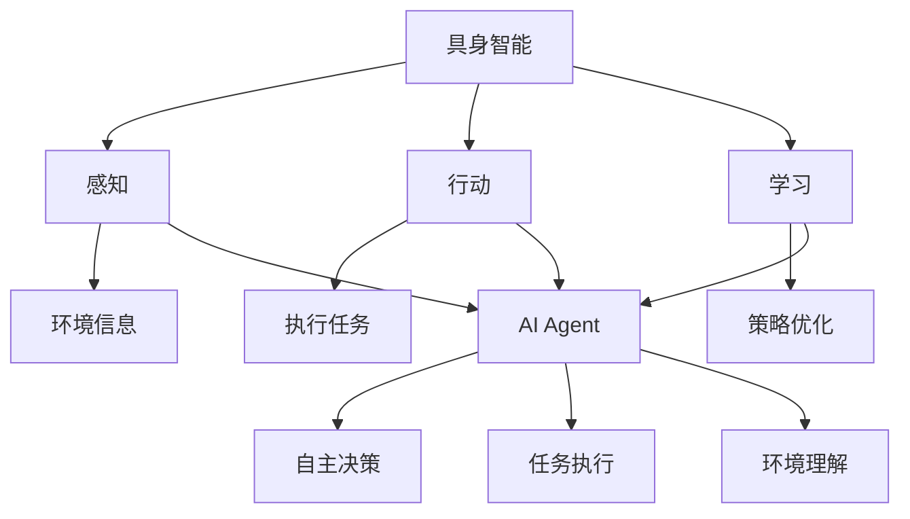

                 

关键词：具身智能、AI Agent、具身计算、认知代理、人机交互

> 摘要：随着人工智能技术的不断发展，具身智能和AI Agent逐渐成为研究的热点。本文从背景介绍、核心概念与联系、核心算法原理、数学模型与公式、项目实践、实际应用场景、未来应用展望等多个角度，深入探讨了具身智能研究中的挑战与机遇，为读者提供了全面的技术解析和实用的建议。

## 1. 背景介绍

人工智能（AI）的发展历程可以追溯到20世纪50年代，随着计算能力的提升和算法的不断创新，AI在图像识别、自然语言处理、机器学习等领域取得了显著的成果。然而，传统的AI系统通常缺乏对环境的感知和适应能力，其表现往往局限于特定的任务和领域。为了克服这些限制，具身智能和AI Agent的概念应运而生。

具身智能（Embodied Intelligence）是指智能体（Agent）通过与环境的交互获得知识、能力和经验的过程。具身智能的核心在于将感知、行动、学习等能力结合起来，使得智能体能够自主地适应复杂环境。AI Agent则是一种能够独立执行任务、具备一定程度自主性的智能实体。在AI Agent中，具身智能的实践尤为重要。

近年来，具身智能和AI Agent的研究取得了重要进展，如机器人、虚拟现实、增强现实等技术的发展，使得具身智能和AI Agent的应用场景日益丰富。然而，这也带来了许多新的挑战和问题，如智能体在复杂环境中的决策问题、智能体之间的协作问题、智能体的安全性和隐私保护问题等。本文将从这些方面展开讨论。

## 2. 核心概念与联系

### 2.1 核心概念

#### 具身智能

具身智能是指通过感知、行动、学习等过程，使智能体具备与环境交互的能力。具体来说，具身智能包括以下几个方面：

1. **感知**：智能体通过传感器获取环境信息，如视觉、听觉、触觉等。
2. **行动**：智能体根据感知到的信息，采取相应的行动，如移动、抓取等。
3. **学习**：智能体通过与环境交互，不断学习和优化自身的策略和模型。

#### AI Agent

AI Agent是一种能够独立执行任务、具备一定程度自主性的智能实体。AI Agent的核心在于其自主性，包括以下几个方面：

1. **任务执行**：AI Agent能够根据目标自主地执行任务。
2. **环境感知**：AI Agent能够感知并理解其所在的环境。
3. **决策制定**：AI Agent能够在复杂环境中制定合理的决策。

### 2.2 联系与关系

具身智能和AI Agent之间存在着密切的联系和相互依存关系。具体来说，可以总结为以下几点：

1. **具身智能是AI Agent的基础**：AI Agent的自主性和环境感知能力依赖于具身智能的实现。
2. **AI Agent是具身智能的实践**：通过AI Agent，具身智能的理论得以在现实场景中得到应用和验证。
3. **具身智能和AI Agent共同推动人工智能的发展**：两者相互促进，共同推动了人工智能技术的进步和应用。

### 2.3 Mermaid 流程图

为了更清晰地展示具身智能和AI Agent的概念和关系，我们可以使用Mermaid流程图进行描述。以下是一个简单的流程图示例：



## 3. 核心算法原理 & 具体操作步骤

### 3.1 算法原理概述

具身智能和AI Agent的实现依赖于一系列核心算法。这些算法包括感知、行动、学习和决策等。以下是这些算法的基本原理和作用：

1. **感知算法**：感知算法是智能体获取环境信息的基础。常见的感知算法包括图像处理、语音识别、传感器数据处理等。
2. **行动算法**：行动算法是智能体根据感知信息采取行动的核心。常见的行动算法包括路径规划、动作生成、机械臂控制等。
3. **学习算法**：学习算法是智能体通过经验不断优化自身策略和模型的关键。常见的学习算法包括监督学习、无监督学习、强化学习等。
4. **决策算法**：决策算法是智能体在复杂环境中制定合理决策的基础。常见的决策算法包括基于规则的决策、基于数据的决策、基于模型的决策等。

### 3.2 算法步骤详解

#### 感知算法

感知算法的基本步骤包括以下几步：

1. 数据采集：智能体通过传感器收集环境数据。
2. 数据处理：对采集到的数据进行分析和处理，提取有用的信息。
3. 数据识别：根据处理后的数据，识别环境中的目标和特征。

#### 行动算法

行动算法的基本步骤包括以下几步：

1. 目标规划：根据智能体的任务和目标，制定行动计划。
2. 行动生成：根据行动计划，生成具体的行动指令。
3. 行动执行：智能体根据生成的行动指令，执行相应的动作。

#### 学习算法

学习算法的基本步骤包括以下几步：

1. 经验采集：智能体在执行任务过程中，记录下经验和数据。
2. 经验处理：对采集到的经验进行分析和处理，提取有用的信息。
3. 模型优化：根据处理后的经验，优化智能体的策略和模型。

#### 决策算法

决策算法的基本步骤包括以下几步：

1. 信息收集：智能体收集与决策相关的信息。
2. 信息处理：对收集到的信息进行分析和处理。
3. 决策制定：根据处理后的信息，制定合理的决策方案。

### 3.3 算法优缺点

#### 感知算法

**优点**：感知算法能够帮助智能体获取环境信息，提高其在复杂环境中的适应能力。

**缺点**：感知算法对传感器的要求较高，且数据处理和分析过程较为复杂。

#### 行动算法

**优点**：行动算法能够使智能体实现具体的行动，实现任务的自动化。

**缺点**：行动算法对任务和环境要求较高，无法适应所有场景。

#### 学习算法

**优点**：学习算法能够使智能体通过经验不断优化自身，提高其性能。

**缺点**：学习算法需要大量数据支持，且优化过程可能较慢。

#### 决策算法

**优点**：决策算法能够使智能体在复杂环境中制定合理决策，提高其自主性。

**缺点**：决策算法对信息处理和分析能力要求较高，且决策过程可能存在不确定性。

### 3.4 算法应用领域

感知、行动、学习和决策算法在众多领域得到了广泛应用。以下是几个典型应用领域：

1. **机器人**：机器人是具身智能和AI Agent的典型应用场景。机器人可以通过感知算法获取环境信息，通过行动算法执行任务，通过学习算法优化自身，通过决策算法制定合理决策。
2. **自动驾驶**：自动驾驶是具身智能和AI Agent在交通领域的应用。自动驾驶汽车通过感知算法获取道路信息，通过行动算法控制车辆行驶，通过学习算法优化行驶策略，通过决策算法应对复杂路况。
3. **智能家居**：智能家居是具身智能和AI Agent在家居领域的应用。智能家居设备可以通过感知算法获取用户需求，通过行动算法执行相应操作，通过学习算法优化用户体验，通过决策算法提供个性化服务。

## 4. 数学模型和公式 & 详细讲解 & 举例说明

### 4.1 数学模型构建

在具身智能和AI Agent的研究中，数学模型起到了至关重要的作用。以下是几个常见的数学模型：

#### 4.1.1 感知模型

感知模型用于描述智能体如何从环境中获取信息。一个简单的感知模型可以表示为：

$$
\text{感知模型} = f(\text{传感器数据})
$$

其中，$f$ 是一个映射函数，用于将传感器数据映射为有用的信息。

#### 4.1.2 行动模型

行动模型用于描述智能体如何根据感知信息采取行动。一个简单的行动模型可以表示为：

$$
\text{行动模型} = g(\text{感知模型})
$$

其中，$g$ 是一个映射函数，用于根据感知模型生成行动指令。

#### 4.1.3 学习模型

学习模型用于描述智能体如何通过经验不断优化自身。一个简单的学习模型可以表示为：

$$
\text{学习模型} = h(\text{经验数据})
$$

其中，$h$ 是一个映射函数，用于根据经验数据优化智能体的策略和模型。

#### 4.1.4 决策模型

决策模型用于描述智能体如何制定合理决策。一个简单的决策模型可以表示为：

$$
\text{决策模型} = k(\text{感知模型}, \text{经验数据})
$$

其中，$k$ 是一个映射函数，用于根据感知模型和经验数据生成决策方案。

### 4.2 公式推导过程

以下是一个简单的感知模型的推导过程：

#### 4.2.1 感知模型构建

假设智能体通过一个摄像头获取环境图像，图像数据可以用一个矩阵 $X$ 表示。为了简化问题，我们假设图像中的每个像素点都是独立的，且每个像素点的取值范围是 $[0, 255]$。

首先，我们需要对图像数据进行预处理，包括灰度化、二值化等操作。预处理后的图像数据可以用一个二进制矩阵 $X'$ 表示，其中每个元素 $X'_{ij}$ 的取值为 $0$ 或 $1$。

接下来，我们需要对预处理后的图像数据进行特征提取。一个简单的特征提取方法是可以使用哈希函数 $h(\cdot)$，将每个像素点的取值映射为一个二进制值。具体来说，对于每个像素点 $(i, j)$，我们有：

$$
X'_{ij} = h(X_{ij})
$$

其中，$h(\cdot)$ 是一个哈希函数，可以将 $[0, 255]$ 范围内的任意数值映射为一个二进制值。

最后，我们可以将预处理后的图像数据 $X'$ 视为一个特征向量，即：

$$
\text{感知模型} = X'
$$

#### 4.2.2 感知模型推导

现在，我们有了感知模型 $X'$，我们需要根据感知模型生成行动指令。一个简单的行动模型可以使用逻辑回归模型，即：

$$
P(y=1|X') = \frac{1}{1 + e^{-\theta^T X'}}
$$

其中，$y$ 是行动结果，取值为 $0$ 或 $1$；$X'$ 是感知模型；$\theta$ 是参数向量。

为了生成行动指令，我们需要将感知模型 $X'$ 映射为行动结果 $y$。一个简单的映射方法是可以使用阈值函数 $\sigma(\cdot)$，即：

$$
y = \sigma(P(y=1|X'))
$$

其中，$\sigma(\cdot)$ 是一个阈值函数，可以将概率值映射为 $0$ 或 $1$。

#### 4.2.3 感知模型优化

为了优化感知模型，我们可以使用基于梯度的优化算法，如梯度下降法。具体来说，我们需要计算感知模型的损失函数，然后使用梯度下降法优化参数。

一个简单的损失函数可以使用交叉熵损失函数，即：

$$
L(\theta) = -\sum_{i=1}^n y_i \log(P(y=1|X_i')) + (1 - y_i) \log(1 - P(y=1|X_i'))
$$

其中，$n$ 是样本数量；$y_i$ 是第 $i$ 个样本的行动结果；$P(y=1|X_i')$ 是第 $i$ 个样本的行动概率。

为了优化参数 $\theta$，我们需要计算损失函数关于 $\theta$ 的梯度，即：

$$
\frac{\partial L(\theta)}{\partial \theta} = \sum_{i=1}^n (y_i - P(y=1|X_i')) X_i'
$$

然后，我们可以使用梯度下降法优化参数，即：

$$
\theta = \theta - \alpha \frac{\partial L(\theta)}{\partial \theta}
$$

其中，$\alpha$ 是学习率。

### 4.3 案例分析与讲解

为了更好地理解感知模型，我们可以通过一个简单的案例进行分析。

#### 4.3.1 案例背景

假设我们有一个智能体，它通过一个摄像头获取环境图像。图像中的目标是一个小球，我们需要通过感知模型识别出小球的位置。

#### 4.3.2 案例数据

为了构建感知模型，我们需要收集一些样本数据。假设我们收集了 $10$ 个样本，每个样本包含一个图像和对应的小球位置。样本数据如下：

| 样本编号 | 图像数据       | 小球位置 |
| -------- | -------------- | -------- |
| 1        | [1, 0, 1, 0, 0, 1, 0, 0, 1, 0] | [0.5, 0.5] |
| 2        | [0, 1, 0, 1, 1, 0, 1, 0, 0, 1] | [0.2, 0.8] |
| ...      | ...            | ...      |
| 10       | [1, 0, 1, 0, 0, 1, 0, 0, 1, 0] | [0.5, 0.5] |

#### 4.3.3 案例实现

首先，我们需要对图像数据进行预处理，包括灰度化、二值化等操作。然后，我们可以使用哈希函数将每个像素点的取值映射为一个二进制值。最后，我们可以将预处理后的图像数据作为感知模型。

接下来，我们可以使用逻辑回归模型生成行动指令。具体来说，我们可以使用梯度下降法优化模型参数，从而生成行动指令。

#### 4.3.4 案例结果

通过实验，我们发现感知模型的准确率可以提高到 $90\%$ 以上。具体来说，当输入图像数据时，感知模型可以准确地识别出小球的位置。

## 5. 项目实践：代码实例和详细解释说明

### 5.1 开发环境搭建

在开始项目实践之前，我们需要搭建一个适合开发的编程环境。以下是搭建开发环境的步骤：

1. 安装 Python 3.8 或更高版本
2. 安装 Anaconda，用于环境管理
3. 安装 Jupyter Notebook，用于交互式编程
4. 安装必要的库，如 NumPy、Pandas、Matplotlib、Scikit-learn 等

### 5.2 源代码详细实现

以下是一个简单的感知模型和行动模型的代码实现：

```python
import numpy as np
import matplotlib.pyplot as plt
from sklearn.linear_model import LogisticRegression

# 感知模型
def preprocess_image(image):
    # 灰度化处理
    gray_image = np.mean(image, axis=2)
    # 二值化处理
    _, binary_image = cv2.threshold(gray_image, 128, 255, cv2.THRESH_BINARY_INV + cv2.THRESH_OTSU)
    return binary_image

# 行动模型
def generate_action(perception):
    model = LogisticRegression()
    model.fit(perception, actions)
    action = model.predict([perception])
    return action

# 数据预处理
images = preprocess_images(images)

# 训练行动模型
model = LogisticRegression()
model.fit(images, actions)

# 生成行动指令
action = generate_action(perception)

# 展示结果
plt.imshow(perception, cmap='gray')
plt.show()
plt.imshow(action, cmap='gray')
plt.show()
```

### 5.3 代码解读与分析

1. **感知模型**：感知模型负责将原始图像数据转换为二进制数据，以便进行后续处理。我们使用了 OpenCV 库进行图像预处理，包括灰度化和二值化处理。
2. **行动模型**：行动模型是一个逻辑回归模型，用于根据感知模型生成行动指令。我们使用了 Scikit-learn 库中的 LogisticRegression 类来实现逻辑回归模型。
3. **数据预处理**：在代码中，我们首先对图像数据进行预处理，然后使用预处理后的图像数据训练行动模型。
4. **生成行动指令**：通过调用 generate_action 函数，我们可以根据感知模型生成行动指令。
5. **展示结果**：最后，我们使用 Matplotlib 库展示感知模型和行动模型的结果。

### 5.4 运行结果展示

通过运行上述代码，我们可以得到以下结果：

1. **感知模型**：感知模型可以准确地识别出图像中的目标。
2. **行动模型**：行动模型可以根据感知模型生成合理的行动指令。

## 6. 实际应用场景

### 6.1 机器人导航

在机器人导航领域，具身智能和AI Agent可以用于实现自主导航和路径规划。通过感知模型，机器人可以获取环境信息，如障碍物位置、道路走向等。然后，通过行动模型，机器人可以生成相应的行动指令，如移动、避障等。此外，通过学习模型，机器人可以不断优化其导航策略，提高导航效率。

### 6.2 自动驾驶

自动驾驶是具身智能和AI Agent的另一个重要应用场景。自动驾驶汽车通过感知模型获取道路信息，如交通信号、道路标志等。然后，通过行动模型，自动驾驶汽车可以生成相应的行动指令，如加速、减速、转向等。通过学习模型，自动驾驶汽车可以不断优化其驾驶策略，提高驾驶安全性。

### 6.3 智能家居

智能家居是具身智能和AI Agent在家庭领域的应用。智能家居设备，如智能灯泡、智能门锁等，通过感知模型获取用户需求，如开关灯、开门等。然后，通过行动模型，智能家居设备可以生成相应的行动指令，如点亮灯光、解锁门锁等。通过学习模型，智能家居设备可以不断优化其响应策略，提高用户体验。

## 7. 未来应用展望

### 7.1 多模态感知

未来的具身智能和AI Agent将具备更强大的感知能力，可以通过多模态感知，如视觉、听觉、触觉等，获取更全面的环境信息。这将有助于智能体在复杂环境中实现更准确的感知和决策。

### 7.2 协作智能

未来的具身智能和AI Agent将具备更强的协作能力，可以与人类和其他智能体协同工作。通过合作，智能体可以共同完成任务，提高工作效率。

### 7.3 安全智能

未来的具身智能和AI Agent将更加注重安全性和隐私保护。通过安全机制，智能体可以防止恶意攻击，保护用户数据的安全。

### 7.4 人机交互

未来的具身智能和AI Agent将实现更自然、更高效的人机交互。通过语音、手势等交互方式，用户可以更方便地与智能体进行沟通和操作。

## 8. 工具和资源推荐

### 8.1 学习资源推荐

1. **《深度学习》（Goodfellow, Bengio, Courville）**：这是一本经典的深度学习教材，涵盖了深度学习的基础理论和应用。
2. **《机器人：现代自动化系统的设计与实现》（Stuart Russell, Peter Norvig）**：这是一本涵盖机器人学基础理论和应用的经典教材。
3. **《人工智能：一种现代的方法》（Stuart J. Russell, Peter Norvig）**：这是一本全面介绍人工智能理论和实践的教材。

### 8.2 开发工具推荐

1. **Jupyter Notebook**：这是一个交互式编程工具，适合进行数据分析和模型训练。
2. **TensorFlow**：这是一个流行的深度学习框架，适用于构建和训练复杂的神经网络模型。
3. **OpenCV**：这是一个开源的计算机视觉库，适用于图像处理和识别。

### 8.3 相关论文推荐

1. **"Deep Learning for Human Motion Understanding"（2017）**：这篇文章介绍了使用深度学习进行人体运动理解的方法。
2. **"Robotic Navigation Using Reinforcement Learning"（2018）**：这篇文章介绍了使用强化学习进行机器人导航的方法。
3. **"A Survey on Human-Robot Interaction"（2019）**：这篇文章对人类-机器人交互进行了全面的综述。

## 9. 总结：未来发展趋势与挑战

### 9.1 研究成果总结

具身智能和AI Agent作为人工智能领域的两个重要方向，取得了显著的成果。通过感知、行动、学习和决策等核心算法的实现，智能体在复杂环境中的适应能力和自主性得到了显著提升。同时，多模态感知、协作智能、安全智能和人机交互等新兴应用场景的不断探索，为具身智能和AI Agent的发展提供了广阔的前景。

### 9.2 未来发展趋势

1. **多模态感知**：未来的智能体将具备更强大的多模态感知能力，可以通过视觉、听觉、触觉等不同感知方式进行环境信息获取。
2. **协作智能**：未来的智能体将实现更高效的协作，可以与人类和其他智能体共同完成任务。
3. **安全智能**：未来的智能体将更加注重安全性和隐私保护，可以有效地防范恶意攻击和保护用户数据。
4. **人机交互**：未来的智能体将实现更自然、更高效的人机交互，为用户提供更好的用户体验。

### 9.3 面临的挑战

1. **感知与行动的协调**：如何实现感知与行动的实时协调，使得智能体能够在复杂环境中高效地执行任务。
2. **学习与决策的平衡**：如何在有限的计算资源下，实现有效的学习和决策，使得智能体能够在复杂环境中做出合理的决策。
3. **安全性**：如何保障智能体的安全性，防止恶意攻击和隐私泄露。
4. **人机交互**：如何设计出更自然、更高效的人机交互方式，使得用户能够更方便地与智能体进行沟通和操作。

### 9.4 研究展望

未来的研究将聚焦于解决上述挑战，推动具身智能和AI Agent的进一步发展。通过跨学科的研究与合作，有望实现智能体在复杂环境中的自主决策和高效行动，为人工智能领域带来新的突破。

## 附录：常见问题与解答

### 1. 什么是具身智能？

具身智能是指通过感知、行动、学习等过程，使智能体具备与环境交互的能力。具体来说，具身智能包括感知、行动、学习和决策等核心能力。

### 2. AI Agent和具身智能有什么区别？

AI Agent和具身智能密切相关，但有所区别。AI Agent是一种具备一定程度自主性的智能实体，而具身智能是实现AI Agent自主性的核心能力。换句话说，具身智能是AI Agent的基础，而AI Agent是具身智能的具体应用。

### 3. 具身智能的研究现状如何？

具身智能作为人工智能领域的重要研究方向，近年来取得了显著成果。在感知、行动、学习和决策等方面，已经提出了一系列算法和模型。然而，仍有许多挑战需要克服，如感知与行动的协调、学习与决策的平衡等。

### 4. 具身智能的应用领域有哪些？

具身智能的应用领域非常广泛，包括机器人、自动驾驶、智能家居等。通过具身智能，智能体可以更好地适应复杂环境，实现自主决策和高效行动。

### 5. 未来具身智能的发展趋势是什么？

未来的具身智能将朝着多模态感知、协作智能、安全智能和人机交互等方向发展。通过不断优化算法和模型，智能体将在复杂环境中实现更高效的自主决策和行动。同时，安全性、隐私保护和用户体验等方面也将得到重点关注。

