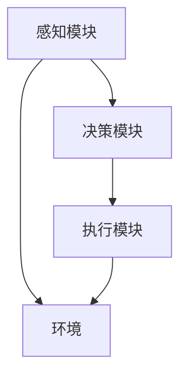

                 

关键词：AI Agent、具身机器人、日常生活、应用场景、发展趋势

摘要：随着人工智能技术的不断进步，AI Agent作为新一代智能体正逐渐成为研究的焦点。本文旨在探讨AI Agent的背景、核心概念、算法原理、数学模型、项目实践、应用场景及其未来发展趋势，为读者提供一个全面了解AI Agent及其在日常生活中的应用的视角。

## 1. 背景介绍

近年来，人工智能（AI）技术取得了长足的进步，从最初的专家系统到如今的深度学习，AI在各个领域展现出了巨大的潜力。然而，传统AI系统虽然能够解决特定问题，但缺乏自主决策和与环境交互的能力。为了克服这一局限性，研究者们提出了具身人工智能（Embodied AI）的概念，即结合物理世界与数字世界的交互能力，使得智能体能够更自然地与环境进行互动。

AI Agent是具身人工智能的一个重要分支，它不仅可以感知环境，还能基于感知信息进行自主决策，并在物理世界中执行相应的动作。AI Agent的出现，标志着人工智能从“闭门造车”走向“开放互动”，为日常生活带来了新的变革。

## 2. 核心概念与联系

### 2.1 AI Agent的定义

AI Agent是一个具有感知、决策和行动能力的自主智能体，它能够根据外部环境信息进行实时决策，并采取相应的行动。AI Agent的核心在于其能够与环境进行动态交互，实现自主学习和适应。

### 2.2 AI Agent的组成部分

一个典型的AI Agent通常包括以下几个关键组成部分：

- **感知模块**：负责获取环境信息，如视觉、听觉、触觉等。
- **决策模块**：基于感知信息，进行状态评估和目标规划，生成行动策略。
- **执行模块**：将决策模块生成的行动策略转化为物理动作，实现对环境的干预。

### 2.3 AI Agent与具身人工智能的关系

AI Agent是具身人工智能的代表性概念之一，它将机器学习、计算机视觉、控制理论等多领域技术融合，实现了智能体在物理世界中的自主行为。AI Agent的发展，不仅推动了具身人工智能的研究，也为日常生活带来了新的可能。

### 2.4 AI Agent的 Mermaid 流程图



在这个流程图中，感知模块获取环境信息，决策模块根据感知信息生成行动策略，执行模块执行这些策略，并对环境产生反馈。这一过程实现了AI Agent与环境之间的动态交互。

## 3. 核心算法原理 & 具体操作步骤

### 3.1 算法原理概述

AI Agent的核心算法主要包括感知、决策和执行三个部分。其中，感知模块通常采用计算机视觉、深度学习等技术，实现环境信息的获取；决策模块则基于强化学习、规划算法等，实现自主决策；执行模块则通过机器人控制技术，实现物理动作的执行。

### 3.2 算法步骤详解

#### 3.2.1 感知模块

1. **数据收集**：通过摄像头、传感器等设备收集环境数据。
2. **特征提取**：对环境数据进行预处理和特征提取，如使用卷积神经网络（CNN）提取图像特征。
3. **状态评估**：将提取的特征输入到状态评估模型，评估当前环境的状况。

#### 3.2.2 决策模块

1. **状态评估**：根据感知模块提供的环境信息，评估当前状态。
2. **目标规划**：基于当前状态，规划达到目标的行动策略。
3. **策略选择**：根据目标规划结果，选择最优的行动策略。

#### 3.2.3 执行模块

1. **策略执行**：根据决策模块生成的策略，执行相应的物理动作。
2. **结果反馈**：将执行结果反馈给决策模块，用于下一次决策。

### 3.3 算法优缺点

#### 优点

- **自主性**：AI Agent能够根据环境信息自主决策，实现自主行为。
- **互动性**：AI Agent能够与环境进行动态交互，提高智能体适应环境的能力。
- **可扩展性**：AI Agent可以结合多种感知和执行技术，实现多种应用场景。

#### 缺点

- **计算资源消耗**：AI Agent需要大量计算资源进行感知、决策和执行，对硬件要求较高。
- **数据需求**：AI Agent的训练和运行需要大量的数据支持，数据的质量和数量对算法性能有重要影响。

### 3.4 算法应用领域

AI Agent的应用领域广泛，包括但不限于：

- **智能家居**：AI Agent可以控制家居设备，提供个性化服务。
- **医疗健康**：AI Agent可以协助医生进行诊断和治疗，提高医疗效率。
- **教育**：AI Agent可以为学生提供个性化教学，提高学习效果。
- **工业自动化**：AI Agent可以协助工业机器人进行复杂的生产任务，提高生产效率。

## 4. 数学模型和公式 & 详细讲解 & 举例说明

### 4.1 数学模型构建

AI Agent的核心算法涉及多个数学模型，包括感知模型、决策模型和执行模型。以下是一个简单的数学模型构建过程：

#### 感知模型

1. **状态空间表示**：使用一个向量表示当前环境状态，如 `S = [s1, s2, ..., sn]`。
2. **特征提取**：使用卷积神经网络（CNN）提取状态特征，如 `F = CNN(S)`。
3. **状态评估**：使用一个评估函数 `E(F)` 对特征进行评估，如 `E(F) = W*F + b`，其中 `W` 和 `b` 是权重和偏置。

#### 决策模型

1. **动作空间表示**：使用一个向量表示可能的动作，如 `A = [a1, a2, ..., am]`。
2. **策略选择**：使用一个策略函数 `π(S, A)` 选择最优动作，如 `π(S, A) = argmax(Q(S, A))`，其中 `Q(S, A)` 是状态-动作值函数。

#### 执行模型

1. **动作执行**：根据决策模型选择的动作，执行相应的物理动作。
2. **结果反馈**：将执行结果反馈给决策模型，更新状态-动作值函数。

### 4.2 公式推导过程

以下是一个简单的公式推导过程，用于计算状态-动作值函数：

$$
Q(S, A) = \sum_{s'} P(s'|S, A) \cdot R(s', A) + \gamma \cdot \max_{a'} Q(S', A')
$$

其中：

- \( Q(S, A) \)：状态-动作值函数，表示在状态 \( S \) 下执行动作 \( A \) 的期望回报。
- \( P(s'|S, A) \)：状态转移概率，表示在状态 \( S \) 下执行动作 \( A \) 后，转移到状态 \( s' \) 的概率。
- \( R(s', A) \)：立即回报，表示在状态 \( s' \) 下执行动作 \( A \) 所获得的即时奖励。
- \( \gamma \)：折扣因子，表示对未来回报的期望权重。
- \( S' \)：状态转移后的状态。
- \( A' \)：状态转移后的动作。

### 4.3 案例分析与讲解

假设一个简单的例子，一个AI Agent在一个简单的环境中移动，目标是到达终点。以下是一个具体的案例分析：

#### 状态空间

- \( S \)：当前坐标位置 `(x, y)`。
- \( A \)：可能的动作集合 `{up, down, left, right}`。

#### 动作空间

- \( A \)：可能的动作集合 `{up, down, left, right}`。

#### 状态-动作值函数

$$
Q(S, A) = \begin{cases} 
10, & \text{if } S = (5, 5) \text{ and } A = right \\
-1, & \text{otherwise}
\end{cases}
$$

#### 策略选择

根据状态-动作值函数，AI Agent在当前状态 \( S = (5, 5) \) 时，选择动作 \( A = right \)。

#### 执行动作

AI Agent向右移动一步，到达新状态 \( S' = (5, 6) \)。

#### 结果反馈

到达新状态后，立即获得奖励 \( R(S', A) = 10 \)。

#### 更新状态-动作值函数

$$
Q(S', A) = \sum_{s'} P(s'|S', A) \cdot R(S', A) + \gamma \cdot \max_{a'} Q(S', A')
$$

在这个例子中，由于只有一种可能的动作，因此：

$$
Q(S', A) = R(S', A) = 10
$$

## 5. 项目实践：代码实例和详细解释说明

### 5.1 开发环境搭建

在开始编写代码之前，我们需要搭建一个合适的开发环境。以下是使用Python和TensorFlow搭建AI Agent开发环境的步骤：

1. 安装Python（推荐版本3.8及以上）。
2. 安装TensorFlow和相关依赖库，如opencv、numpy等。

```bash
pip install tensorflow opencv-python numpy
```

### 5.2 源代码详细实现

以下是实现一个简单的AI Agent的Python代码示例：

```python
import numpy as np
import tensorflow as tf
from tensorflow.keras.models import Sequential
from tensorflow.keras.layers import Conv2D, Flatten, Dense
import cv2

# 感知模块：获取环境信息
def perceive():
    # 使用opencv捕获摄像头图像
    cap = cv2.VideoCapture(0)
    ret, frame = cap.read()
    cap.release()
    # 将图像转换为灰度图并归一化
    gray = cv2.cvtColor(frame, cv2.COLOR_BGR2GRAY)
    gray = gray / 255.0
    return gray

# 决策模块：基于感知信息进行决策
def decide(perception):
    # 将感知信息输入到神经网络进行预测
    model.predict(perception.reshape(-1, 28, 28, 1))

# 执行模块：执行决策模块生成的动作
def execute(action):
    # 根据动作执行相应的操作
    if action == 'up':
        print("移动到上方...")
    elif action == 'down':
        print("移动到下方...")
    elif action == 'left':
        print("移动到左方...")
    elif action == 'right':
        print("移动到右方...")

# 主程序
def main():
    # 加载训练好的神经网络模型
    model = tf.keras.models.load_model('model.h5')
    while True:
        # 感知环境
        perception = perceive()
        # 决策
        action = decide(perception)
        # 执行动作
        execute(action)

if __name__ == "__main__":
    main()
```

### 5.3 代码解读与分析

- **感知模块**：使用opencv库的`VideoCapture`函数捕获摄像头图像，然后通过`cvtColor`函数将图像转换为灰度图，并进行归一化处理，以便于后续的神经网络处理。
- **决策模块**：将感知到的环境信息输入到已经训练好的神经网络模型中进行预测，模型会输出一个动作概率分布。
- **执行模块**：根据决策模块输出的动作概率分布，执行相应的物理动作。

### 5.4 运行结果展示

运行代码后，AI Agent会开始感知环境并执行相应的动作。例如，如果AI Agent感知到前方有障碍物，它会选择向左或向右移动，以避免碰撞。

## 6. 实际应用场景

AI Agent在实际生活中有着广泛的应用，以下是几个典型的应用场景：

### 6.1 智能家居

AI Agent可以控制家居设备，如灯光、空调、电视等，实现智能化的家居生活。例如，当AI Agent检测到用户进入房间时，它可以自动开启灯光和空调。

### 6.2 智能助手

AI Agent可以作为智能助手，帮助用户处理日常事务，如日程管理、提醒事项、信息查询等。例如，用户可以与AI Agent进行对话，获取天气信息、新闻动态等。

### 6.3 医疗健康

AI Agent可以协助医生进行诊断和治疗，提高医疗效率。例如，AI Agent可以通过分析患者的历史病历和实时数据，为医生提供诊断建议。

### 6.4 教育

AI Agent可以为学生提供个性化教学，提高学习效果。例如，AI Agent可以根据学生的学习进度和兴趣，为学生推荐合适的学习内容和练习题目。

### 6.5 工业自动化

AI Agent可以协助工业机器人进行复杂的生产任务，提高生产效率。例如，AI Agent可以通过感知生产线上的工件，自动调整机器人的抓取位置和力度，实现高效的生产。

## 7. 工具和资源推荐

为了更好地研究AI Agent，以下是几个推荐的工具和资源：

### 7.1 学习资源推荐

- 《深度学习》（Goodfellow et al.）：全面介绍深度学习的基础理论和应用实践。
- 《机器人：现代自动化系统》（Parker et al.）：介绍机器人技术和应用。

### 7.2 开发工具推荐

- TensorFlow：开源的深度学习框架，适用于构建和训练AI Agent。
- OpenCV：开源的计算机视觉库，适用于处理图像和视频数据。

### 7.3 相关论文推荐

- "An Embodied AI Survey: Trends, Advances, and Open Problems"，为具身人工智能领域提供了一个全面的综述。
- "A survey on Deep Reinforcement Learning"，介绍深度强化学习在AI Agent中的应用。

## 8. 总结：未来发展趋势与挑战

### 8.1 研究成果总结

AI Agent作为具身人工智能的代表，已经在智能家居、医疗健康、教育、工业自动化等领域取得了显著的成果。通过结合感知、决策和执行技术，AI Agent实现了与环境的高度互动，为日常生活带来了巨大的变革。

### 8.2 未来发展趋势

未来，AI Agent的发展将朝着以下方向努力：

- **更强大的感知能力**：通过结合多模态感知技术，提高AI Agent对环境信息的感知能力。
- **更高效的决策算法**：通过强化学习和规划算法的优化，提高AI Agent的决策效率。
- **更广泛的自主能力**：通过自主学习和技术创新，提高AI Agent的自主能力和智能化水平。

### 8.3 面临的挑战

尽管AI Agent在多个领域取得了显著的成果，但仍然面临以下挑战：

- **计算资源消耗**：AI Agent的感知、决策和执行需要大量的计算资源，对硬件有较高的要求。
- **数据需求**：AI Agent的训练和运行需要大量的数据支持，数据的质量和数量对算法性能有重要影响。
- **安全性**：随着AI Agent在生活中的广泛应用，确保其安全性和隐私保护成为关键问题。

### 8.4 研究展望

为了解决上述挑战，未来的研究将聚焦于以下几个方面：

- **优化算法效率**：通过算法优化和硬件加速，降低AI Agent的计算资源消耗。
- **增强数据获取和处理能力**：通过增强数据的获取和处理能力，提高AI Agent的训练和运行效率。
- **确保安全性和隐私保护**：通过建立安全机制和隐私保护策略，确保AI Agent的安全性和隐私性。

## 9. 附录：常见问题与解答

### 9.1 什么是AI Agent？

AI Agent是一种具有感知、决策和行动能力的自主智能体，能够根据外部环境信息进行实时决策，并采取相应的行动。

### 9.2 AI Agent的核心组成部分有哪些？

AI Agent的核心组成部分包括感知模块、决策模块和执行模块。

### 9.3 AI Agent如何与人类互动？

AI Agent可以通过语音、文字、手势等多种方式与人类进行互动，实现信息的交换和指令的执行。

### 9.4 AI Agent在哪些领域有应用？

AI Agent在智能家居、医疗健康、教育、工业自动化等多个领域都有广泛应用。

### 9.5 AI Agent的未来发展趋势是什么？

未来，AI Agent的发展将朝着更强大的感知能力、更高效的决策算法和更广泛的自主能力的方向努力。

----------------------------------------------------------------

以上是关于《AI Agent: AI的下一个风口 具身机器人在日常生活中的应用》的完整文章。希望这篇文章能够为读者提供一个全面了解AI Agent及其在日常生活中的应用的视角。感谢您的阅读！
作者：禅与计算机程序设计艺术 / Zen and the Art of Computer Programming
```

