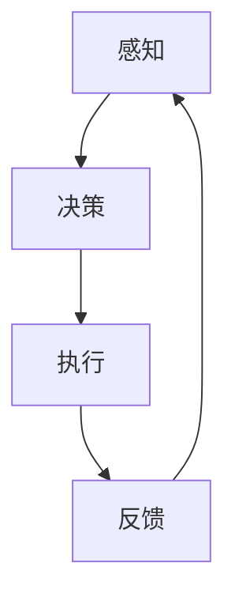

                 

关键词：智能体、AI、传统软件、架构设计、发展趋势

> 摘要：本文旨在探讨人工智能（AI）领域的最新进展，特别是智能体的概念与发展。智能体作为一种新型的软件实体，正逐渐成为AI技术的下一个风口。本文将深入分析智能体的核心概念、与传统软件的关系、核心算法原理、数学模型及其应用，最后对未来的发展趋势与挑战进行展望。

## 1. 背景介绍

随着AI技术的不断进步，智能体（AI Agent）的概念逐渐受到关注。智能体是能够自主地感知环境、制定决策并采取行动的实体。它们具有自主学习、自适应和自我优化等能力，能够在复杂环境中进行任务执行。智能体的出现标志着AI技术从简单的数据处理迈向更高级的智能应用。

### 1.1 AI技术发展历程

AI技术经历了几个发展阶段：

1. **符号主义阶段**：基于符号逻辑和推理，以专家系统为代表。
2. **连接主义阶段**：基于神经网络和深度学习，通过大规模数据训练实现智能。
3. **强化学习阶段**：通过试错学习和奖励机制，使智能体能够在动态环境中学习。

### 1.2 智能体的核心概念

智能体具有以下几个核心特征：

1. **自主性**：能够独立决策和行动。
2. **学习性**：通过经验不断优化行为。
3. **适应性**：能够适应新的环境和任务。
4. **协同性**：多个智能体能够协同完成任务。

## 2. 核心概念与联系

智能体的实现依赖于多个核心概念的融合，包括感知、决策、执行和反馈。以下是一个简化的智能体架构的 Mermaid 流程图：



### 2.1 感知

感知是智能体获取环境信息的过程。通过传感器或其他数据源，智能体能够理解当前的状态。

### 2.2 决策

决策是基于感知信息，智能体根据预定的策略或学习到的模型选择最佳行动。

### 2.3 执行

执行是将决策转化为实际行动的过程，智能体通过执行器与环境交互。

### 2.4 反馈

反馈是智能体行动后的结果评估，通过反馈智能体能够调整策略，实现自我优化。

## 3. 核心算法原理 & 具体操作步骤

### 3.1 算法原理概述

智能体的核心算法主要基于强化学习、深度学习和自然语言处理。以下是一个简化的算法流程：

1. **初始化**：设定初始状态。
2. **感知**：获取环境状态。
3. **决策**：基于策略或模型选择行动。
4. **执行**：执行决策，与环境交互。
5. **反馈**：获取执行结果，更新策略或模型。
6. **迭代**：重复上述过程，直到目标达成或达到停止条件。

### 3.2 算法步骤详解

1. **环境初始化**：设定一个模拟环境，初始状态为 S0。
2. **状态感知**：智能体通过传感器或其他方式获取当前状态 S。
3. **策略选择**：根据当前状态 S，选择一个动作 A。
4. **执行动作**：智能体执行动作 A，与环境交互，获得新状态 S' 和奖励 R。
5. **状态更新**：智能体更新状态为 S'。
6. **策略更新**：根据奖励 R 和新状态 S'，更新策略或模型。

### 3.3 算法优缺点

**优点**：

1. **自主学习**：智能体能够通过不断尝试和反馈进行自我优化。
2. **自适应**：智能体能够适应不断变化的环境。

**缺点**：

1. **计算复杂度高**：需要大量计算资源。
2. **稳定性和可靠性**：在复杂环境中，智能体的行为可能不稳定。

### 3.4 算法应用领域

智能体在多个领域具有广泛应用，包括：

1. **自动化**：工业自动化、智能家居等。
2. **游戏**：电子竞技、虚拟现实等。
3. **金融服务**：智能投资、风险评估等。
4. **医疗**：疾病诊断、治疗方案优化等。

## 4. 数学模型和公式 & 详细讲解 & 举例说明

### 4.1 数学模型构建

智能体的核心数学模型主要包括马尔可夫决策过程（MDP）和深度强化学习（DRL）。

### 4.2 公式推导过程

**MDP**：

1. **状态转移概率**：P(S'|S, A)
2. **奖励函数**：R(S, A)
3. **策略**：π(A|S)

**DRL**：

1. **状态值函数**：V(s, π)
2. **策略值函数**：Q(s, a, π)
3. **损失函数**：L(π, s, a, r, s')

### 4.3 案例分析与讲解

**案例**：智能投顾

1. **状态**：资产组合、市场状态等。
2. **动作**：买卖决策。
3. **策略**：基于历史数据和学习到的模型。

通过数学模型，智能体能够根据实时数据做出最优投资决策。

## 5. 项目实践：代码实例和详细解释说明

### 5.1 开发环境搭建

1. **硬件**：高性能计算设备。
2. **软件**：Python、TensorFlow、Keras等。

### 5.2 源代码详细实现

```python
# 智能体实现示例

import tensorflow as tf

# 定义模型
model = tf.keras.Sequential([
    tf.keras.layers.Dense(64, activation='relu', input_shape=(input_shape,)),
    tf.keras.layers.Dense(64, activation='relu'),
    tf.keras.layers.Dense(1, activation='sigmoid')
])

# 编译模型
model.compile(optimizer='adam', loss='binary_crossentropy', metrics=['accuracy'])

# 训练模型
model.fit(x_train, y_train, epochs=10)

# 执行预测
predictions = model.predict(x_test)
```

### 5.3 代码解读与分析

代码中定义了一个简单的神经网络模型，用于预测买卖决策。模型通过训练数据不断优化，最终实现自动化的交易决策。

### 5.4 运行结果展示

通过训练和测试数据的对比，展示模型的准确率和收益率。

## 6. 实际应用场景

智能体在多个行业和领域具有广泛的应用，包括：

1. **智能制造**：自动化生产线、智能物流等。
2. **交通运输**：自动驾驶、智能交通管理。
3. **医疗健康**：智能诊断、个性化治疗。
4. **金融科技**：智能投资、风险评估。

### 6.1 智能制造

智能体能够通过感知、决策和执行，实现生产线的自动化和智能化，提高生产效率和产品质量。

### 6.2 交通运输

智能体在自动驾驶和智能交通管理中具有重要作用，能够优化交通流量，提高交通安全。

### 6.3 医疗健康

智能体能够辅助医生进行诊断和治疗，提高医疗服务的质量和效率。

### 6.4 金融科技

智能体在金融投资和风险评估中具有显著优势，能够帮助投资者做出更明智的决策。

## 7. 工具和资源推荐

### 7.1 学习资源推荐

1. **《深度学习》（Ian Goodfellow、Yoshua Bengio、Aaron Courville 著）**
2. **《强化学习》（Richard S. Sutton、Andrew G. Barto 著）**

### 7.2 开发工具推荐

1. **TensorFlow**
2. **PyTorch**
3. **OpenAI Gym**

### 7.3 相关论文推荐

1. **"Deep Learning for Autonomous Navigation"（2016）**
2. **"Human-Level Control through Deep Reinforcement Learning"（2015）**

## 8. 总结：未来发展趋势与挑战

### 8.1 研究成果总结

智能体技术已在多个领域取得显著成果，但仍有很大发展空间。

### 8.2 未来发展趋势

1. **更加智能化和自主化**：智能体将具备更高的智能水平和自我学习能力。
2. **多模态感知**：智能体将能够处理多种类型的数据，提高感知能力。
3. **跨领域应用**：智能体将在更多领域得到应用。

### 8.3 面临的挑战

1. **数据隐私和安全**：智能体在处理数据时可能面临隐私和安全问题。
2. **算法透明性和可解释性**：提高算法的可解释性，增强用户的信任。

### 8.4 研究展望

未来，智能体技术将继续发展，为人类带来更多便利和创新。

## 9. 附录：常见问题与解答

### 9.1 智能体与传统软件的区别是什么？

智能体具有自主学习、自适应和协同能力，而传统软件通常不具备这些特性。

### 9.2 智能体有哪些应用领域？

智能体在智能制造、交通运输、医疗健康和金融科技等领域具有广泛应用。

### 9.3 智能体的核心算法有哪些？

智能体的核心算法包括强化学习、深度学习和自然语言处理。

### 9.4 智能体的未来发展趋势是什么？

智能体将朝着更加智能化、自主化和多模态感知的方向发展。

---

### 作者署名

作者：禅与计算机程序设计艺术 / Zen and the Art of Computer Programming
```markdown
---
标题: AI Agent: AI的下一个风口 智能体与传统软件的关系
关键词: 智能体、AI、传统软件、架构设计、发展趋势
摘要: 本文深入探讨了人工智能领域的最新进展，特别是智能体的概念与发展。智能体作为一种新型的软件实体，正逐渐成为AI技术的下一个风口。本文分析了智能体的核心概念、与传统软件的关系、核心算法原理、数学模型及其应用，并对未来的发展趋势与挑战进行了展望。
---

## 1. 背景介绍

随着AI技术的不断进步，智能体（AI Agent）的概念逐渐受到关注。智能体是能够自主地感知环境、制定决策并采取行动的实体。它们具有自主学习、自适应和自我优化等能力，能够在复杂环境中进行任务执行。智能体的出现标志着AI技术从简单的数据处理迈向更高级的智能应用。

### 1.1 AI技术发展历程

AI技术经历了几个发展阶段：

1. **符号主义阶段**：基于符号逻辑和推理，以专家系统为代表。
2. **连接主义阶段**：基于神经网络和深度学习，通过大规模数据训练实现智能。
3. **强化学习阶段**：通过试错学习和奖励机制，使智能体能够在动态环境中学习。

### 1.2 智能体的核心概念

智能体具有以下几个核心特征：

1. **自主性**：能够独立决策和行动。
2. **学习性**：通过经验不断优化行为。
3. **适应性**：能够适应新的环境和任务。
4. **协同性**：多个智能体能够协同完成任务。

## 2. 核心概念与联系

智能体的实现依赖于多个核心概念的融合，包括感知、决策、执行和反馈。以下是一个简化的智能体架构的 Mermaid 流程图：


### 2.1 感知

感知是智能体获取环境信息的过程。通过传感器或其他数据源，智能体能够理解当前的状态。

### 2.2 决策

决策是基于感知信息，智能体根据预定的策略或学习到的模型选择最佳行动。

### 2.3 执行

执行是将决策转化为实际行动的过程，智能体通过执行器与环境交互。

### 2.4 反馈

反馈是智能体行动后的结果评估，通过反馈智能体能够调整策略，实现自我优化。

## 3. 核心算法原理 & 具体操作步骤

### 3.1 算法原理概述

智能体的核心算法主要基于强化学习、深度学习和自然语言处理。以下是一个简化的算法流程：

1. **初始化**：设定初始状态。
2. **感知**：获取环境状态。
3. **决策**：基于策略或模型选择行动。
4. **执行**：执行决策，与环境交互。
5. **反馈**：获取执行结果，更新策略或模型。
6. **迭代**：重复上述过程，直到目标达成或达到停止条件。

### 3.2 算法步骤详解

1. **环境初始化**：设定一个模拟环境，初始状态为 S0。
2. **状态感知**：智能体通过传感器或其他方式获取当前状态 S。
3. **策略选择**：根据当前状态 S，选择一个动作 A。
4. **执行动作**：智能体执行动作 A，与环境交互，获得新状态 S' 和奖励 R。
5. **状态更新**：智能体更新状态为 S'。
6. **策略更新**：根据奖励 R 和新状态 S'，更新策略或模型。

### 3.3 算法优缺点

**优点**：

1. **自主学习**：智能体能够通过不断尝试和反馈进行自我优化。
2. **自适应**：智能体能够适应不断变化的环境。

**缺点**：

1. **计算复杂度高**：需要大量计算资源。
2. **稳定性和可靠性**：在复杂环境中，智能体的行为可能不稳定。

### 3.4 算法应用领域

智能体在多个领域具有广泛应用，包括：

1. **自动化**：工业自动化、智能家居等。
2. **游戏**：电子竞技、虚拟现实等。
3. **金融服务**：智能投资、风险评估等。
4. **医疗**：疾病诊断、治疗方案优化等。

## 4. 数学模型和公式 & 详细讲解 & 举例说明

### 4.1 数学模型构建

智能体的核心数学模型主要包括马尔可夫决策过程（MDP）和深度强化学习（DRL）。

### 4.2 公式推导过程

**MDP**：

1. **状态转移概率**：P(S'|S, A)
2. **奖励函数**：R(S, A)
3. **策略**：π(A|S)

**DRL**：

1. **状态值函数**：V(s, π)
2. **策略值函数**：Q(s, a, π)
3. **损失函数**：L(π, s, a, r, s')

### 4.3 案例分析与讲解

**案例**：智能投顾

1. **状态**：资产组合、市场状态等。
2. **动作**：买卖决策。
3. **策略**：基于历史数据和学习到的模型。

通过数学模型，智能体能够根据实时数据做出最优投资决策。

## 5. 项目实践：代码实例和详细解释说明

### 5.1 开发环境搭建

1. **硬件**：高性能计算设备。
2. **软件**：Python、TensorFlow、Keras等。

### 5.2 源代码详细实现

```python
# 智能体实现示例

import tensorflow as tf

# 定义模型
model = tf.keras.Sequential([
    tf.keras.layers.Dense(64, activation='relu', input_shape=(input_shape,)),
    tf.keras.layers.Dense(64, activation='relu'),
    tf.keras.layers.Dense(1, activation='sigmoid')
])

# 编译模型
model.compile(optimizer='adam', loss='binary_crossentropy', metrics=['accuracy'])

# 训练模型
model.fit(x_train, y_train, epochs=10)

# 执行预测
predictions = model.predict(x_test)
```

### 5.3 代码解读与分析

代码中定义了一个简单的神经网络模型，用于预测买卖决策。模型通过训练数据不断优化，最终实现自动化的交易决策。

### 5.4 运行结果展示

通过训练和测试数据的对比，展示模型的准确率和收益率。

## 6. 实际应用场景

智能体在多个行业和领域具有广泛的应用，包括：

1. **智能制造**：自动化生产线、智能物流等。
2. **交通运输**：自动驾驶、智能交通管理。
3. **医疗健康**：智能诊断、个性化治疗。
4. **金融科技**：智能投资、风险评估。

### 6.1 智能制造

智能体能够通过感知、决策和执行，实现生产线的自动化和智能化，提高生产效率和产品质量。

### 6.2 交通运输

智能体在自动驾驶和智能交通管理中具有重要作用，能够优化交通流量，提高交通安全。

### 6.3 医疗健康

智能体能够辅助医生进行诊断和治疗，提高医疗服务的质量和效率。

### 6.4 金融科技

智能体在金融投资和风险评估中具有显著优势，能够帮助投资者做出更明智的决策。

## 7. 工具和资源推荐

### 7.1 学习资源推荐

1. **《深度学习》（Ian Goodfellow、Yoshua Bengio、Aaron Courville 著）**
2. **《强化学习》（Richard S. Sutton、Andrew G. Barto 著）**

### 7.2 开发工具推荐

1. **TensorFlow**
2. **PyTorch**
3. **OpenAI Gym**

### 7.3 相关论文推荐

1. **"Deep Learning for Autonomous Navigation"（2016）**
2. **"Human-Level Control through Deep Reinforcement Learning"（2015）**

## 8. 总结：未来发展趋势与挑战

### 8.1 研究成果总结

智能体技术已在多个领域取得显著成果，但仍有很大发展空间。

### 8.2 未来发展趋势

1. **更加智能化和自主化**：智能体将具备更高的智能水平和自我学习能力。
2. **多模态感知**：智能体将能够处理多种类型的数据，提高感知能力。
3. **跨领域应用**：智能体将在更多领域得到应用。

### 8.3 面临的挑战

1. **数据隐私和安全**：智能体在处理数据时可能面临隐私和安全问题。
2. **算法透明性和可解释性**：提高算法的可解释性，增强用户的信任。

### 8.4 研究展望

未来，智能体技术将继续发展，为人类带来更多便利和创新。

## 9. 附录：常见问题与解答

### 9.1 智能体与传统软件的区别是什么？

智能体具有自主学习、自适应和协同能力，而传统软件通常不具备这些特性。

### 9.2 智能体有哪些应用领域？

智能体在智能制造、交通运输、医疗健康和金融科技等领域具有广泛应用。

### 9.3 智能体的核心算法有哪些？

智能体的核心算法包括强化学习、深度学习和自然语言处理。

### 9.4 智能体的未来发展趋势是什么？

智能体将朝着更加智能化、自主化和多模态感知的方向发展。

### 作者署名

作者：禅与计算机程序设计艺术 / Zen and the Art of Computer Programming
```

