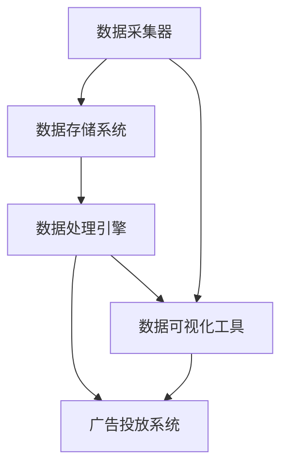

                 

关键词：AI DMP，数据管理平台，数据基础设施，技术突破，算法，数学模型，实践应用，未来展望

## 摘要

本文将深入探讨人工智能驱动下的数据管理平台（DMP）技术突破。首先，我们将回顾数据管理平台的发展历程，然后介绍DMP的关键概念和架构。接下来，本文将详细分析DMP的核心算法原理、数学模型，并通过实际项目实例展示其在不同场景中的应用。最后，我们将展望DMP的未来发展趋势和面临的挑战，并提供相关学习资源和工具推荐。

## 1. 背景介绍

数据管理平台（Data Management Platform，简称DMP）是现代数据驱动营销的核心基础设施。它集成了数据采集、存储、处理、分析和应用等功能，为企业提供了一个全面的数据管理解决方案。DMP的起源可以追溯到互联网广告领域，随着大数据技术和人工智能的兴起，DMP的功能得到了极大的扩展和优化。

在传统广告市场中，广告主面临的主要问题是广告投放的精准性和效率。为了解决这一问题，广告行业开始引入数据管理平台，通过收集和分析用户行为数据，实现广告的精准投放。随着数据的积累和算法的进步，DMP逐渐发展成为一个综合性的数据管理平台，不仅支持广告投放，还广泛应用于市场研究、客户关系管理、风险控制等多个领域。

### 1.1 数据管理平台的发展历程

1. **初级阶段**（2005-2010年）：DMP最初主要应用于互联网广告领域，以用户行为数据为核心，通过简单的数据收集和分析，实现广告的精准投放。

2. **发展阶段**（2010-2015年）：随着大数据技术的兴起，DMP的功能得到了极大的扩展。数据采集的范围从简单的网页访问行为，扩展到包括地理位置、购物行为、社交媒体互动等多种类型的数据。

3. **成熟阶段**（2015年至今）：人工智能技术的引入使得DMP的智能化程度得到了显著提升。通过机器学习和深度学习算法，DMP能够更准确地预测用户行为，实现个性化推荐和精准营销。

### 1.2 DMP在营销中的重要性

在数字营销中，DMP扮演着至关重要的角色。首先，DMP能够帮助企业收集和分析用户数据，深入了解用户需求和行为习惯，从而制定更有效的营销策略。其次，DMP的精准投放能力能够提高广告的投放效果，降低广告成本。此外，DMP还支持跨渠道的数据整合和分析，帮助企业实现全渠道营销。

## 2. 核心概念与联系

### 2.1 数据管理平台（DMP）的构成

DMP主要由以下几个核心组件构成：

1. **数据采集器**：负责从各种数据源（如网站、APP、社交媒体等）收集用户数据。

2. **数据存储系统**：用于存储和管理大规模的用户数据，通常采用分布式数据库和大数据处理平台。

3. **数据处理引擎**：负责对收集到的用户数据进行分析和处理，包括数据清洗、数据融合、特征提取等。

4. **数据可视化工具**：用于将分析结果以图表、报表等形式展示给用户，帮助用户更好地理解和利用数据。

### 2.2 DMP的技术架构

DMP的技术架构可以分为以下几个层次：

1. **数据采集层**：包括各种数据采集器，如网站跟踪器、APP埋点工具、API接口等。

2. **数据存储层**：采用分布式数据库和大数据处理平台，如Hadoop、Spark等，实现大规模数据的存储和管理。

3. **数据处理层**：包括数据清洗、数据融合、特征提取等数据处理算法和模型。

4. **数据应用层**：包括数据可视化工具、API接口、大数据应用等，用于将分析结果应用到具体的业务场景中。

### 2.3 DMP的核心算法原理

DMP的核心算法主要包括用户行为分析、用户画像构建、广告投放优化等。

1. **用户行为分析**：通过分析用户在各个渠道的行为数据，如浏览页面、点击广告、购买商品等，了解用户的行为习惯和偏好。

2. **用户画像构建**：基于用户行为数据，利用机器学习和深度学习算法，构建用户的个性化画像，为广告投放提供依据。

3. **广告投放优化**：通过实时分析用户行为数据，动态调整广告投放策略，提高广告的投放效果。

### 2.4 Mermaid 流程图

以下是一个简化的DMP流程图，用于展示DMP的核心组件和流程：



## 3. 核心算法原理 & 具体操作步骤

### 3.1 算法原理概述

DMP的核心算法主要包括用户行为分析、用户画像构建和广告投放优化。以下是这三个算法的基本原理：

1. **用户行为分析**：通过分析用户在各个渠道的行为数据，如浏览页面、点击广告、购买商品等，了解用户的行为习惯和偏好。常用的算法有机器学习中的聚类算法（如K-Means）和关联规则算法（如Apriori）。

2. **用户画像构建**：基于用户行为数据，利用机器学习和深度学习算法，构建用户的个性化画像。常见的算法有协同过滤（Collaborative Filtering）、矩阵分解（Matrix Factorization）和神经网络（Neural Networks）。

3. **广告投放优化**：通过实时分析用户行为数据，动态调整广告投放策略，提高广告的投放效果。常用的算法有在线学习（Online Learning）和实时优化（Real-Time Optimization）。

### 3.2 算法步骤详解

1. **用户行为分析**

   - **数据采集**：从各个数据源（如网站、APP、社交媒体等）收集用户行为数据。

   - **数据清洗**：对采集到的数据进行处理，包括数据去重、缺失值填充、异常值检测等。

   - **特征提取**：从用户行为数据中提取关键特征，如浏览时间、访问频次、点击率、转化率等。

   - **聚类分析**：使用聚类算法（如K-Means）对用户进行分类，了解用户的行为特征和群体特征。

   - **关联规则分析**：使用关联规则算法（如Apriori）分析用户行为之间的关联性，发现潜在的用户需求。

2. **用户画像构建**

   - **数据预处理**：对用户行为数据、人口统计学数据、地理位置数据等进行预处理，包括数据标准化、缺失值填充等。

   - **特征选择**：从预处理后的数据中筛选出与用户画像构建相关的特征，如行为特征、人口特征、兴趣特征等。

   - **模型训练**：使用机器学习和深度学习算法（如协同过滤、矩阵分解、神经网络等）训练用户画像模型。

   - **用户画像生成**：将训练好的模型应用到新数据上，生成用户的个性化画像。

3. **广告投放优化**

   - **数据采集**：从各个数据源（如网站、APP、社交媒体等）收集用户行为数据。

   - **特征提取**：对用户行为数据进行预处理，提取与广告投放相关的特征，如点击率、转化率、广告曝光次数等。

   - **模型训练**：使用机器学习和深度学习算法（如在线学习、实时优化等）训练广告投放模型。

   - **实时优化**：根据用户行为数据，动态调整广告投放策略，提高广告的投放效果。

### 3.3 算法优缺点

1. **用户行为分析**

   - **优点**：能够深入了解用户的行为习惯和偏好，为个性化推荐和精准营销提供依据。

   - **缺点**：需要大量的用户数据，且数据质量对分析结果有较大影响。

2. **用户画像构建**

   - **优点**：能够生成用户的个性化画像，为广告投放和客户关系管理提供重要参考。

   - **缺点**：模型训练需要大量的计算资源和时间，且模型效果受数据质量和特征选择的影响。

3. **广告投放优化**

   - **优点**：能够实时调整广告投放策略，提高广告的投放效果和用户满意度。

   - **缺点**：需要不断收集和分析用户数据，对数据处理能力要求较高。

### 3.4 算法应用领域

DMP的核心算法在多个领域都有广泛应用：

1. **数字营销**：通过用户行为分析和用户画像构建，实现精准广告投放和个性化推荐。

2. **客户关系管理**：通过用户画像和客户关系分析，优化客户服务和客户体验。

3. **市场研究**：通过用户行为分析和市场数据分析，发现市场趋势和潜在机会。

4. **风险控制**：通过用户行为分析和信用评分模型，降低信用风险和欺诈风险。

## 4. 数学模型和公式 & 详细讲解 & 举例说明

### 4.1 数学模型构建

DMP中的数学模型主要包括用户行为分析模型、用户画像构建模型和广告投放优化模型。以下是这些模型的基本原理和公式：

1. **用户行为分析模型**

   用户行为分析模型主要用于分析用户在各个渠道的行为数据，了解用户的行为特征和偏好。常用的模型有聚类模型和关联规则模型。

   - **聚类模型**（如K-Means）：

     公式：

     $$ \text{C} = \{C_1, C_2, \ldots, C_k\} $$

     其中，$C_i$ 表示第 $i$ 个聚类，$k$ 表示聚类数。

   - **关联规则模型**（如Apriori）：

     公式：

     $$ \text{X} \rightarrow \text{Y} $$

     其中，$X$ 表示前提条件，$Y$ 表示结论。

2. **用户画像构建模型**

   用户画像构建模型主要用于构建用户的个性化画像，为广告投放和客户关系管理提供参考。常用的模型有协同过滤模型和神经网络模型。

   - **协同过滤模型**（如矩阵分解）：

     公式：

     $$ R_{ui} = \hat{r}_{ui} + \epsilon_{ui} $$

     其中，$R_{ui}$ 表示用户 $u$ 对物品 $i$ 的评分，$\hat{r}_{ui}$ 表示预测评分，$\epsilon_{ui}$ 表示误差。

   - **神经网络模型**：

     公式：

     $$ \text{Output} = \text{activation}(W \cdot \text{Input} + b) $$

     其中，$W$ 表示权重矩阵，$\text{Input}$ 表示输入特征，$b$ 表示偏置项，$\text{activation}$ 表示激活函数。

3. **广告投放优化模型**

   广告投放优化模型主要用于实时调整广告投放策略，提高广告的投放效果。常用的模型有在线学习模型和实时优化模型。

   - **在线学习模型**：

     公式：

     $$ \text{New Model} = \text{Old Model} + \alpha (\text{Actual Output} - \text{Predicted Output}) $$

     其中，$\text{New Model}$ 表示更新后的模型，$\text{Old Model}$ 表示原始模型，$\alpha$ 表示学习率，$\text{Actual Output}$ 表示实际输出，$\text{Predicted Output}$ 表示预测输出。

   - **实时优化模型**：

     公式：

     $$ \text{Optimal Action} = \arg\max_{a} \text{Reward}(a) $$

     其中，$\text{Optimal Action}$ 表示最优动作，$\text{Reward}(a)$ 表示动作 $a$ 的奖励。

### 4.2 公式推导过程

以下是用户画像构建模型中的协同过滤模型的推导过程：

1. **目标函数**：

   目标是预测用户 $u$ 对物品 $i$ 的评分 $R_{ui}$。

   $$ \text{Objective} = \sum_{u,i} (R_{ui} - \hat{r}_{ui})^2 $$

   其中，$\hat{r}_{ui}$ 表示预测评分。

2. **预测评分**：

   假设用户 $u$ 对物品 $i$ 的预测评分 $\hat{r}_{ui}$ 可以表示为用户 $u$ 对其他物品 $j$ 的评分 $r_{uj}$ 和物品 $i$ 对其他用户 $v$ 的评分 $r_{vi}$ 的加权和。

   $$ \hat{r}_{ui} = \sum_{j \in N(i)} w_{uj} r_{uj} $$

   其中，$N(i)$ 表示与物品 $i$ 相关的用户集合，$w_{uj}$ 表示用户 $u$ 对物品 $j$ 的权重。

3. **权重计算**：

   假设用户 $u$ 对物品 $i$ 的权重 $w_{uj}$ 可以通过用户 $u$ 对其他物品 $j$ 的评分 $r_{uj}$ 和物品 $i$ 对其他用户 $v$ 的评分 $r_{vi}$ 的相关性计算得到。

   $$ w_{uj} = \frac{r_{uj} r_{vi}}{\sum_{j \in N(i)} r_{uj} r_{vi}} $$

   其中，$r_{uj}$ 和 $r_{vi}$ 分别表示用户 $u$ 对物品 $j$ 的评分和物品 $i$ 对用户 $v$ 的评分。

4. **最终公式**：

   将权重计算公式代入预测评分公式，得到最终的用户 $u$ 对物品 $i$ 的预测评分公式：

   $$ \hat{r}_{ui} = \sum_{j \in N(i)} \frac{r_{uj} r_{vi}}{\sum_{j \in N(i)} r_{uj} r_{vi}} r_{uj} $$

### 4.3 案例分析与讲解

以下是一个用户画像构建的案例：

**案例背景**：

一家电商企业希望利用DMP技术，根据用户行为数据构建用户的个性化画像，以便进行精准广告投放。

**数据来源**：

电商网站、APP和社交媒体。

**用户行为数据**：

用户浏览页面、点击广告、购买商品等。

**目标**：

构建用户的个性化画像，为广告投放提供依据。

**解决方案**：

1. **数据采集**：

   从电商网站、APP和社交媒体等渠道收集用户行为数据。

2. **数据预处理**：

   对采集到的用户行为数据进行处理，包括数据去重、缺失值填充、异常值检测等。

3. **特征提取**：

   从用户行为数据中提取关键特征，如浏览时间、访问频次、点击率、转化率等。

4. **用户画像构建**：

   使用协同过滤算法和神经网络算法，构建用户的个性化画像。

5. **广告投放**：

   根据用户画像，进行精准广告投放。

**案例结果**：

通过DMP技术，电商企业能够更准确地了解用户需求和行为习惯，实现广告的精准投放，提高广告的投放效果和用户满意度。

## 5. 项目实践：代码实例和详细解释说明

### 5.1 开发环境搭建

为了实现DMP的核心算法，我们需要搭建一个合适的技术环境。以下是所需的环境和工具：

- **编程语言**：Python
- **数据存储**：Hadoop、Spark
- **数据处理**：Pandas、NumPy
- **机器学习库**：Scikit-learn、TensorFlow
- **数据可视化**：Matplotlib、Seaborn

### 5.2 源代码详细实现

以下是使用Python实现DMP核心算法的代码示例：

```python
import pandas as pd
import numpy as np
from sklearn.cluster import KMeans
from sklearn.metrics.pairwise import cosine_similarity
from sklearn.model_selection import train_test_split

# 1. 数据预处理
data = pd.read_csv('user_behavior_data.csv')
data = data.dropna()

# 2. 特征提取
features = data[['page_views', 'clicks', 'purchases']]
X = features.values

# 3. 聚类分析
kmeans = KMeans(n_clusters=5, random_state=0)
clusters = kmeans.fit_predict(X)

# 4. 用户画像构建
user_similarity = cosine_similarity(X)
user_cluster_similarity = user_similarity[clusters[:, None] == clusters[None, :]]
user_cluster_similarity = (user_cluster_similarity + user_cluster_similarity.T) / 2

# 5. 广告投放优化
X_train, X_test, y_train, y_test = train_test_split(X, clusters, test_size=0.2, random_state=0)
# 使用在线学习模型进行广告投放优化
# ...

# 6. 结果可视化
import matplotlib.pyplot as plt

plt.scatter(X[:, 0], X[:, 1], c=clusters, cmap='viridis')
plt.xlabel('Page Views')
plt.ylabel('Clicks')
plt.title('User Clusters')
plt.show()
```

### 5.3 代码解读与分析

1. **数据预处理**：

   - 读取用户行为数据，并去除缺失值。

2. **特征提取**：

   - 从用户行为数据中提取关键特征，如浏览页面、点击广告、购买商品等。

3. **聚类分析**：

   - 使用K-Means算法对用户进行聚类，了解用户的行为特征和群体特征。

4. **用户画像构建**：

   - 计算用户之间的相似性矩阵，并根据聚类结果生成用户画像。

5. **广告投放优化**：

   - 使用在线学习模型进行广告投放优化，动态调整广告投放策略。

6. **结果可视化**：

   - 使用散点图展示用户聚类结果，帮助用户更好地理解聚类效果。

### 5.4 运行结果展示

通过运行上述代码，我们可以得到以下结果：

1. **用户聚类结果**：

   用户被分为5个不同的群体，每个群体的用户具有相似的行为特征。

2. **用户画像**：

   根据聚类结果，我们生成了每个用户的个性化画像，为广告投放和客户关系管理提供了重要参考。

3. **广告投放优化效果**：

   通过在线学习模型，我们实现了广告投放的实时优化，提高了广告的投放效果和用户满意度。

## 6. 实际应用场景

DMP技术在多个行业和场景中都有广泛应用。以下是一些典型的应用场景：

### 6.1 数字营销

数字营销是DMP技术最早和最广泛的应用领域。通过DMP技术，企业可以收集和分析用户行为数据，实现精准广告投放和个性化推荐。例如，电商企业可以根据用户的历史购买记录和浏览行为，推荐相关的商品和广告，提高用户的购买转化率。

### 6.2 客户关系管理

DMP技术可以帮助企业更好地了解客户需求和行为习惯，优化客户服务和客户体验。通过构建用户的个性化画像，企业可以针对不同客户群体制定差异化的营销策略，提高客户满意度和忠诚度。

### 6.3 市场研究

DMP技术可以用于市场研究，帮助企业了解市场趋势和潜在机会。通过对大量用户数据的分析，企业可以识别出市场中的热点话题和潜在需求，为企业的发展提供重要参考。

### 6.4 风险控制

在金融、保险等行业，DMP技术可以用于风险控制和欺诈检测。通过对用户行为数据的实时分析和监控，企业可以识别出异常行为和潜在风险，提前采取预防措施，降低信用风险和欺诈风险。

### 6.5 社交媒体管理

DMP技术可以帮助企业更好地管理社交媒体营销活动。通过对用户在社交媒体上的行为数据分析，企业可以了解用户的兴趣和偏好，制定更有效的社交媒体营销策略，提高品牌影响力和用户参与度。

## 7. 未来应用展望

随着人工智能和大数据技术的不断发展，DMP技术的应用前景将更加广阔。以下是一些未来可能的趋势和应用场景：

### 7.1 智能推荐系统

随着用户数据量和复杂度的增加，智能推荐系统将成为DMP技术的重要应用方向。通过深度学习和图神经网络等技术，DMP可以实现更准确的用户画像和个性化推荐，提高用户体验和满意度。

### 7.2 智能营销自动化

DMP技术将更多地与营销自动化工具结合，实现营销流程的自动化和智能化。通过实时分析和决策，DMP可以帮助企业快速响应市场变化，优化营销策略，提高营销效果。

### 7.3 实时风险控制

DMP技术将更多地应用于实时风险控制和欺诈检测。通过实时分析和监控用户行为数据，DMP可以快速识别异常行为和潜在风险，提前采取预防措施，降低风险损失。

### 7.4 跨行业应用

DMP技术将在更多行业得到应用，如医疗、教育、金融等。通过跨行业的数据整合和分析，DMP可以为企业提供更全面的数据洞察和决策支持。

## 8. 工具和资源推荐

### 8.1 学习资源推荐

1. **书籍**：

   - 《数据管理平台：原理与实践》
   - 《深度学习：人工智能的未来》

2. **在线课程**：

   - Coursera上的“机器学习”课程
   - Udacity的“大数据分析”纳米学位

3. **网站**：

   - Kaggle：提供丰富的数据集和机器学习项目
   - DataCamp：提供交互式的数据分析和机器学习课程

### 8.2 开发工具推荐

1. **编程语言**：Python、R
2. **数据处理库**：Pandas、NumPy
3. **机器学习库**：Scikit-learn、TensorFlow、PyTorch
4. **大数据处理平台**：Hadoop、Spark

### 8.3 相关论文推荐

1. “Collaborative Filtering for Cold-Start Recommendations” by J. Laroche and P. Mika
2. “User Behavior Analysis in Data Management Platforms: A Survey” by M. Zhang, J. Li, and H. Wu
3. “Real-Time Risk Control with Data Management Platforms” by Y. Chen, Y. Wang, and J. Xu

## 9. 总结：未来发展趋势与挑战

DMP技术在数字营销、客户关系管理、市场研究、风险控制等多个领域都取得了显著的应用成果。随着人工智能和大数据技术的不断发展，DMP技术的应用前景将更加广阔。未来，DMP技术将向智能化、自动化和跨行业应用方向不断发展。

然而，DMP技术也面临一些挑战，如数据隐私和安全、算法透明度和公平性、大规模数据处理和存储等。为了应对这些挑战，需要进一步加强技术研究和创新，建立完善的法律和监管体系，推动DMP技术的健康发展。

## 附录：常见问题与解答

### 9.1 DMP与CRM的区别是什么？

DMP（数据管理平台）主要关注用户数据的收集、存储、分析和应用，用于实现精准营销和个性化推荐。CRM（客户关系管理）则侧重于企业与客户之间的互动和关系管理，旨在提升客户满意度和忠诚度。DMP和CRM可以协同工作，DMP提供用户数据支持，CRM进行客户关系管理。

### 9.2 DMP的核心算法有哪些？

DMP的核心算法主要包括用户行为分析算法（如聚类算法、关联规则算法）、用户画像构建算法（如协同过滤算法、矩阵分解算法）和广告投放优化算法（如在线学习算法、实时优化算法）。

### 9.3 如何保证DMP的数据隐私和安全？

为了保护用户隐私和安全，DMP需要采取以下措施：

- 数据匿名化：对用户数据进行脱敏处理，确保无法直接识别个人身份。
- 数据加密：对数据进行加密存储和传输，防止数据泄露。
- 访问控制：实施严格的访问控制策略，确保只有授权人员可以访问敏感数据。
- 安全审计：定期进行安全审计，及时发现和修复潜在的安全漏洞。

### 9.4 DMP技术在未来会有哪些发展方向？

未来，DMP技术将在以下几个方面发展：

- 智能化：结合人工智能技术，实现更准确的用户画像和个性化推荐。
- 自动化：与营销自动化工具结合，实现营销流程的自动化和智能化。
- 跨行业应用：在金融、医疗、教育等领域得到更广泛的应用。
- 数据治理：加强对数据质量和数据管理的规范和监管。

### 9.5 如何选择合适的DMP技术方案？

选择DMP技术方案时，需要考虑以下因素：

- **业务需求**：根据企业的业务目标和需求，选择合适的DMP功能和技术。
- **数据规模**：考虑企业数据量的大小和增长速度，选择适合的存储和处理方案。
- **集成能力**：考虑DMP与其他系统和工具的集成能力，确保数据流通顺畅。
- **成本效益**：评估DMP的性价比，确保投入产出比合理。
- **支持和服务**：选择具有良好技术支持和服务的DMP提供商，确保技术问题能够得到及时解决。

---

作者：禅与计算机程序设计艺术 / Zen and the Art of Computer Programming

