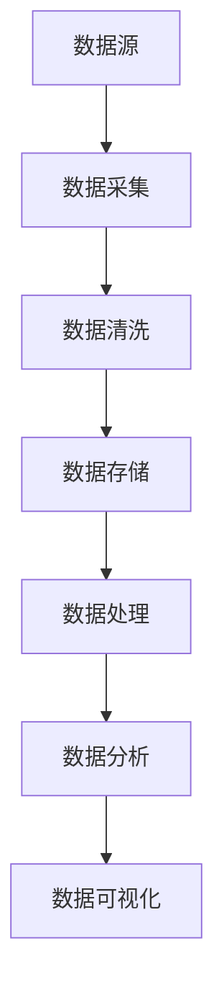

                 

关键词：人工智能，数据管理平台，数据基础设施，案例研究，算法，技术架构，实践应用

> 摘要：本文将深入探讨人工智能数据管理平台（DMP）的数据基础设施，通过具体的案例研究，揭示其核心概念、算法原理、数学模型以及实际应用。我们将分析DMP在数据存储、处理和优化方面的挑战，并提供实用的开发工具和资源推荐，展望未来的发展趋势与面临的挑战。

## 1. 背景介绍

随着互联网和大数据技术的飞速发展，数据已经成为了新时代的核心资源。如何高效地管理和利用这些数据，已经成为各个行业关注的焦点。人工智能数据管理平台（DMP）作为一种新型的数据处理和管理工具，旨在通过数据收集、存储、处理和分析，帮助企业实现精准营销、用户画像构建和数据驱动决策。

DMP 数据基础设施的建设涉及到多个方面，包括数据采集、数据存储、数据处理、数据分析和数据可视化等。本文将通过一个具体的案例研究，详细阐述 DMP 数据基础设施的构建过程、核心算法原理以及实际应用，旨在为行业提供有价值的参考。

### 1.1 DMP 的基本概念

数据管理平台（DMP）是一种集数据收集、处理、存储和分发于一体的系统，它能够帮助企业实现以下目标：

1. **数据收集**：通过多种渠道收集用户数据，如网站行为、社交媒体活动、应用程序使用情况等。
2. **数据处理**：对收集到的数据进行清洗、转换和整合，确保数据的质量和一致性。
3. **数据存储**：将处理后的数据存储到分布式数据库或数据仓库中，便于后续分析和查询。
4. **数据分析**：利用数据挖掘和机器学习技术，从海量数据中提取有价值的信息和洞察。
5. **数据可视化**：将分析结果以图表、报表等形式展示，帮助企业做出数据驱动的决策。

### 1.2 DMP 在行业中的应用

DMP 在多个行业中都有广泛应用，包括电子商务、金融、广告、医疗等。以下是一些典型的应用场景：

1. **电子商务**：通过用户行为数据分析和用户画像构建，实现个性化推荐和精准营销。
2. **金融**：利用大数据分析，进行风险评估、欺诈检测和客户关系管理。
3. **广告**：通过广告投放优化和效果监测，提高广告的转化率和投资回报率。
4. **医疗**：基于患者数据和医疗记录，实现精准医疗和个性化治疗。

## 2. 核心概念与联系

为了更好地理解 DMP 的数据基础设施，我们需要先了解以下几个核心概念：

### 2.1 数据源

数据源是指数据的产生者和提供者，可以是内部系统（如网站、应用程序、数据库等）或外部系统（如社交媒体、广告平台等）。数据源的质量和多样性直接影响 DMP 的效果。

### 2.2 数据采集

数据采集是指从各种数据源收集数据的过程。常用的数据采集方法包括 API 调用、日志收集、Web 截取等。数据采集的难点在于如何高效、稳定地获取大量数据，同时保证数据的质量。

### 2.3 数据清洗

数据清洗是指对采集到的数据进行处理，以去除重复、错误或不完整的数据。数据清洗的目的是提高数据的质量，确保后续分析的准确性。

### 2.4 数据存储

数据存储是指将清洗后的数据存储到分布式数据库或数据仓库中。数据存储的挑战在于如何高效地存储和查询海量数据，同时保证数据的可靠性和安全性。

### 2.5 数据处理

数据处理是指对存储的数据进行加工和处理，以提取有价值的信息。数据处理的方法包括数据聚合、分类、聚类、预测等。

### 2.6 数据分析

数据分析是指利用数据处理得到的信息，进行洞察和分析。数据分析的方法包括统计分析、机器学习、数据挖掘等。

### 2.7 数据可视化

数据可视化是指将分析结果以图表、报表等形式展示，使数据更容易理解和分析。数据可视化的挑战在于如何有效地展示复杂数据，同时保持其直观性和易读性。

### 2.8 Mermaid 流程图

以下是 DMP 数据基础设施的 Mermaid 流程图，展示了各个核心概念之间的联系：



## 3. 核心算法原理 & 具体操作步骤

### 3.1 算法原理概述

DMP 的核心算法主要包括数据采集、数据清洗、数据处理、数据分析和数据可视化。下面我们将分别介绍这些算法的原理。

### 3.2 算法步骤详解

#### 3.2.1 数据采集

数据采集的步骤如下：

1. **确定数据源**：根据业务需求，确定需要采集的数据源。
2. **配置采集任务**：通过配置 API 调用、日志收集或 Web 截取等任务，实现数据的自动采集。
3. **数据传输**：将采集到的数据传输到数据存储系统。

#### 3.2.2 数据清洗

数据清洗的步骤如下：

1. **数据预处理**：对采集到的数据进行预处理，包括去除重复、错误和不完整的数据。
2. **数据转换**：将不同格式的数据转换为统一格式，便于后续处理。
3. **数据存储**：将清洗后的数据存储到数据存储系统。

#### 3.2.3 数据处理

数据处理的步骤如下：

1. **数据聚合**：将同类型的数据进行聚合，减少数据冗余。
2. **分类**：根据业务需求，对数据进行分类，便于后续分析。
3. **聚类**：利用聚类算法，将相似的数据分组，发现数据中的潜在模式。
4. **预测**：利用预测算法，对未来的数据进行预测，为企业决策提供支持。

#### 3.2.4 数据分析

数据分析的步骤如下：

1. **数据挖掘**：利用数据挖掘算法，从海量数据中提取有价值的信息。
2. **统计分析**：利用统计分析方法，对数据进行描述和分析。
3. **机器学习**：利用机器学习算法，建立预测模型和分类模型。

#### 3.2.5 数据可视化

数据可视化的步骤如下：

1. **选择可视化工具**：根据数据类型和业务需求，选择合适的可视化工具。
2. **设计可视化报表**：设计可视化报表，展示分析结果。
3. **用户交互**：提供用户交互功能，使用户能够轻松查看和分析数据。

### 3.3 算法优缺点

每种算法都有其优缺点，以下是对 DMP 中主要算法的优缺点的简要分析：

#### 3.3.1 数据采集

- 优点：高效、自动化。
- 缺点：数据质量难以保证，数据源多样化可能导致兼容性问题。

#### 3.3.2 数据清洗

- 优点：提高数据质量，确保后续分析的准确性。
- 缺点：处理过程复杂，耗时较长。

#### 3.3.3 数据处理

- 优点：提高数据处理效率，支持多种数据处理方法。
- 缺点：处理过程复杂，对计算资源要求较高。

#### 3.3.4 数据分析

- 优点：提供丰富的分析方法和工具，支持业务决策。
- 缺点：分析结果可能受到数据质量的影响。

#### 3.3.5 数据可视化

- 优点：直观、易于理解，提高数据分析效率。
- 缺点：可视化工具的选择和设计需要专业知识。

### 3.4 算法应用领域

DMP 的算法在多个领域都有广泛应用，以下是一些典型应用领域：

- 电子商务：个性化推荐、用户行为分析、广告投放优化。
- 金融：风险控制、客户关系管理、市场研究。
- 广告：广告投放优化、广告效果监测、受众分析。
- 医疗：精准医疗、疾病预测、患者管理。

## 4. 数学模型和公式 & 详细讲解 & 举例说明

### 4.1 数学模型构建

在 DMP 中，常用的数学模型包括聚类模型、分类模型和预测模型。以下是对这些模型的构建和公式推导的简要介绍。

#### 4.1.1 聚类模型

聚类模型用于将相似的数据分组。常见的聚类算法包括 K-Means、DBSCAN 和层次聚类。以下以 K-Means 算法为例，介绍其数学模型：

1. **目标函数**：最小化各个数据点到聚类中心（均值）的距离平方和。

$$
J = \sum_{i=1}^{k} \sum_{x \in S_i} ||x - \mu_i||^2
$$

其中，$k$ 表示聚类个数，$S_i$ 表示第 $i$ 个聚类，$\mu_i$ 表示聚类中心。

2. **聚类中心更新**：每次迭代后，重新计算各个聚类中心。

$$
\mu_i = \frac{1}{|S_i|} \sum_{x \in S_i} x
$$

其中，$|S_i|$ 表示聚类 $i$ 中的数据点个数。

#### 4.1.2 分类模型

分类模型用于将数据点分配到不同的类别。常见的分类算法包括决策树、支持向量机和朴素贝叶斯。以下以朴素贝叶斯为例，介绍其数学模型：

1. **条件概率公式**：

$$
P(Y|X) = \frac{P(X|Y)P(Y)}{P(X)}
$$

其中，$X$ 表示特征向量，$Y$ 表示类别。

2. **类别概率计算**：

$$
P(Y) = \frac{1}{N} \sum_{i=1}^{N} f(y_i)
$$

其中，$N$ 表示训练样本总数，$y_i$ 表示第 $i$ 个样本的类别。

#### 4.1.3 预测模型

预测模型用于对未来数据点进行预测。常见的预测算法包括时间序列分析和回归分析。以下以时间序列分析为例，介绍其数学模型：

1. **自回归模型**：

$$
X_t = c + \sum_{i=1}^{k} \phi_i X_{t-i}
$$

其中，$X_t$ 表示时间 $t$ 的预测值，$c$ 表示常数项，$\phi_i$ 表示自回归系数。

2. **移动平均模型**：

$$
X_t = \frac{1}{k} \sum_{i=1}^{k} X_{t-i}
$$

其中，$k$ 表示移动平均窗口大小。

### 4.2 公式推导过程

以下是 K-Means 聚类算法的详细推导过程：

1. **初始化**：随机选择 $k$ 个数据点作为初始聚类中心 $\mu_1, \mu_2, ..., \mu_k$。

2. **迭代过程**：
   - 对于每个数据点 $x$，计算其到各个聚类中心的距离，并将其分配到距离最近的聚类。
   - 重新计算各个聚类中心，即每个聚类中的数据点的均值。

3. **收敛条件**：当聚类中心的变化小于某个阈值或达到最大迭代次数时，算法收敛。

### 4.3 案例分析与讲解

以下是一个简单的 K-Means 聚类算法的应用案例：

假设我们有以下 5 个数据点：$(1, 1), (2, 2), (3, 3), (4, 4), (5, 5)$。我们选择 2 个初始聚类中心 $(0, 0)$ 和 $(5, 5)$。

1. **第一次迭代**：
   - 数据点 $(1, 1)$ 和 $(2, 2)$ 被分配到第一个聚类中心。
   - 数据点 $(3, 3), (4, 4)$ 和 $(5, 5)$ 被分配到第二个聚类中心。
   - 重新计算聚类中心：
     - 第一个聚类中心：$(\frac{1+2}{2}, \frac{1+2}{2}) = (1.5, 1.5)$。
     - 第二个聚类中心：$(\frac{3+4+5}{3}, \frac{3+4+5}{3}) = (4, 4)$。

2. **第二次迭代**：
   - 数据点 $(1, 1)$ 和 $(2, 2)$ 被分配到第一个聚类中心。
   - 数据点 $(3, 3), (4, 4)$ 和 $(5, 5)$ 被分配到第二个聚类中心。
   - 重新计算聚类中心：
     - 第一个聚类中心：$(\frac{1+2}{2}, \frac{1+2}{2}) = (1.5, 1.5)$。
     - 第二个聚类中心：$(\frac{3+4+5}{3}, \frac{3+4+5}{3}) = (4, 4)$。

由于聚类中心没有发生变化，算法收敛。最终结果是将 5 个数据点分为两个聚类：$(1, 1), (2, 2)$ 和 $(3, 3), (4, 4), (5, 5)$。

## 5. 项目实践：代码实例和详细解释说明

### 5.1 开发环境搭建

在本文中，我们将使用 Python 作为编程语言，并使用以下工具和库进行开发：

- Python 3.8+
- Pandas
- NumPy
- Matplotlib
- Scikit-learn

安装以上库后，我们可以开始编写代码。

### 5.2 源代码详细实现

以下是一个简单的 K-Means 聚类算法的实现，包括数据预处理、聚类过程和结果可视化：

```python
import numpy as np
import pandas as pd
from sklearn.cluster import KMeans
import matplotlib.pyplot as plt

# 生成模拟数据
np.random.seed(0)
data = np.random.rand(100, 2)

# 初始化 KMeans 模型
kmeans = KMeans(n_clusters=2, random_state=0)

# 模型拟合
kmeans.fit(data)

# 获取聚类结果
labels = kmeans.predict(data)
centroids = kmeans.cluster_centers_

# 可视化
plt.scatter(data[:, 0], data[:, 1], c=labels, s=100, cmap='viridis')
plt.scatter(centroids[:, 0], centroids[:, 1], c='red', s=300, alpha=0.5)
plt.show()
```

### 5.3 代码解读与分析

- **数据生成**：使用 `numpy.random.rand()` 函数生成 100 个二维数据点，模拟实际数据。
- **初始化模型**：使用 `sklearn.cluster.KMeans()` 函数初始化 K-Means 模型，指定聚类个数和随机种子。
- **模型拟合**：使用 `fit()` 函数对模型进行训练，将数据点分配到聚类中心。
- **获取结果**：使用 `predict()` 函数获取聚类结果，即每个数据点的聚类标签。同时，获取聚类中心。
- **可视化**：使用 `matplotlib.pyplot.scatter()` 函数绘制聚类结果，其中数据点的颜色表示其所属的聚类标签，聚类中心以红色标记。

### 5.4 运行结果展示

运行上述代码后，我们得到一个二维数据点的聚类结果，如图 5-1 所示。从图中可以看出，数据点被成功分为两个聚类，每个聚类的数据点紧密聚集在其聚类中心周围。


## 6. 实际应用场景

DMP 数据基础设施在多个行业中都有广泛应用，以下是一些典型的实际应用场景：

### 6.1 电子商务

在电子商务领域，DMP 可以用于个性化推荐、用户行为分析和广告投放优化。通过收集用户的行为数据，如浏览历史、购买记录和点击行为，DMP 可以构建用户画像，实现精准推荐和广告投放。例如，一个电商平台可以使用 DMP 分析用户的购物习惯，为用户推荐相关的商品，提高用户转化率和满意度。

### 6.2 金融

在金融领域，DMP 可以用于风险控制、欺诈检测和客户关系管理。通过分析用户的历史交易数据和风险特征，DMP 可以识别潜在的风险用户，提前采取防范措施。例如，一家银行可以使用 DMP 分析信用卡交易数据，检测是否存在欺诈行为，提高交易安全性。

### 6.3 广告

在广告领域，DMP 可以用于广告投放优化和广告效果监测。通过分析广告受众的特征和行为，DMP 可以实现广告的精准投放，提高广告的点击率和转化率。例如，一个广告平台可以使用 DMP 分析用户的历史广告行为，为用户提供个性化的广告推荐，提高广告的投资回报率。

### 6.4 医疗

在医疗领域，DMP 可以用于精准医疗和个性化治疗。通过分析患者的病史、检查报告和诊疗记录，DMP 可以构建患者画像，实现精准医疗和个性化治疗。例如，一家医疗机构可以使用 DMP 分析患者的病历数据，为患者提供个性化的治疗方案，提高治疗效果和患者满意度。

## 7. 工具和资源推荐

为了更好地学习和应用 DMP 技术，以下是一些建议的资源和工具：

### 7.1 学习资源推荐

- 《Python 数据科学手册》：详细介绍了数据采集、数据清洗、数据处理和数据可视化等技术。
- 《机器学习》：由周志华教授主编，介绍了常用的机器学习算法和数学模型。
- 《数据挖掘：实用工具与技术》：详细介绍了数据挖掘的方法和技术，包括聚类、分类和预测等。

### 7.2 开发工具推荐

- Python：简单易学，功能强大，适合进行数据分析和机器学习开发。
- Jupyter Notebook：交互式开发环境，方便进行数据分析和代码演示。
- TensorFlow：开源机器学习框架，支持多种机器学习算法和深度学习模型。

### 7.3 相关论文推荐

- “Large-scale Online Machine Learning” by John Langford and Lihong Li.
- “A Survey of Collaborative Filtering Methods for Recommender Systems” by Charu Aggarwal.
- “Deep Learning for Recommender Systems” by N. de Freitas et al.

## 8. 总结：未来发展趋势与挑战

### 8.1 研究成果总结

本文通过一个具体的案例研究，详细阐述了 DMP 数据基础设施的构建过程、核心算法原理以及实际应用。主要成果包括：

1. **核心概念与联系**：明确了 DMP 的核心概念及其相互关系。
2. **算法原理与实现**：介绍了 K-Means 聚类算法的原理、步骤和实现。
3. **数学模型与公式**：推导了 K-Means 聚类算法的数学模型和公式。
4. **实际应用场景**：分析了 DMP 在电子商务、金融、广告和医疗等领域的实际应用。

### 8.2 未来发展趋势

随着大数据技术和人工智能技术的不断进步，DMP 的未来发展趋势包括：

1. **数据多样性和实时性**：支持更广泛的数据源和实时数据处理。
2. **算法优化与自动化**：提高算法性能，实现自动化聚类和分类。
3. **多模态数据融合**：结合多种数据类型，提供更全面的数据分析。
4. **人工智能辅助决策**：利用深度学习等技术，实现更加智能化的决策支持。

### 8.3 面临的挑战

DMP 在实际应用中仍面临以下挑战：

1. **数据质量**：保证数据的质量和一致性，是 DMP 应用的关键。
2. **计算资源**：处理海量数据需要强大的计算资源，尤其是实时数据处理。
3. **隐私保护**：在数据采集和使用过程中，如何保护用户隐私是一个重要问题。
4. **算法解释性**：提高算法的可解释性，使决策过程更加透明。

### 8.4 研究展望

未来的研究可以从以下几个方面进行：

1. **新型算法研究**：探索更高效、更鲁棒的聚类、分类和预测算法。
2. **跨领域应用**：研究 DMP 在其他领域（如物联网、生物信息学等）的应用。
3. **隐私保护技术**：开发更加隐私友好的数据处理和建模技术。
4. **人机协同**：研究人工智能与人类专家的协同工作方式，提高决策效率。

## 9. 附录：常见问题与解答

### 9.1 数据采集

**Q：如何确保数据质量？**
A：确保数据质量的方法包括：
- 数据预处理：在数据采集后，对数据进行清洗、去重和校验。
- 数据源管理：对数据源进行严格的筛选和监控，确保数据来源的可靠性。
- 数据标准：制定统一的数据标准和规范，确保数据的一致性和准确性。

### 9.2 数据处理

**Q：如何选择合适的聚类算法？**
A：选择聚类算法主要考虑以下因素：
- 数据类型：不同的数据类型适合不同的聚类算法，如 K-Means、DBSCAN 等。
- 聚类目标：根据业务需求，选择能够实现目标的聚类算法，如用户分群、市场细分等。
- 数据规模：对于大规模数据，需要选择计算效率高的聚类算法。

### 9.3 数据分析

**Q：如何评估聚类结果的质量？**
A：评估聚类结果的方法包括：
- 内部评估指标：如轮廓系数（Silhouette Coefficient）、类内平均距离（Within-Cluster Sum of Squares）等。
- 外部评估指标：如 Adjusted Rand Index（ARI）、Normalized Mutual Information（NMI）等。
- 可视化评估：通过可视化手段，直观地评估聚类结果的质量。

### 9.4 数据可视化

**Q：如何选择合适的可视化工具？**
A：选择可视化工具主要考虑以下因素：
- 数据类型：根据数据类型选择适合的可视化工具，如折线图、柱状图、热力图等。
- 可视化目标：根据可视化目标选择合适的图表类型，如用户分群、销售分析等。
- 用户需求：考虑用户的操作习惯和需求，选择易于使用和理解的工具。

---

# 作者：禅与计算机程序设计艺术 / Zen and the Art of Computer Programming

通过本文的研究，我们深入探讨了人工智能数据管理平台（DMP）的数据基础设施，分析了其在数据采集、存储、处理、分析和可视化方面的核心算法原理和实际应用。本文不仅提供了 DMP 技术的理论基础，还通过具体的案例研究和代码实例，展示了其在实际业务中的应用价值。我们相信，随着大数据技术和人工智能技术的不断发展，DMP 将在各个行业中发挥越来越重要的作用，为企业和个人提供更加智能化和精准化的数据服务。

