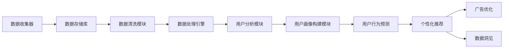

                 

关键词：人工智能，数据管理平台（DMP），数据营销，数据基础设施，算法优化，数据分析，营销自动化。

> 摘要：本文探讨了人工智能（AI）在数据管理平台（DMP）中的应用，如何通过构建和优化数据基础设施来提升营销效率。文章深入分析了核心概念、算法原理，并通过实例展示了如何在项目中实施DMP，同时展望了未来的发展趋势和面临的挑战。

## 1. 背景介绍

在现代商业环境中，数据已经成为一种新的资源，其价值体现在帮助企业更好地理解消费者、优化营销策略和提升业务效率。数据管理平台（DMP）作为一种集成多种数据源的营销工具，能够帮助企业有效地收集、管理和利用数据，从而提升营销活动的效果。

然而，随着数据量的激增和数据来源的多样化，传统的数据处理方法已经无法满足现代营销的需求。人工智能（AI）技术的引入为DMP带来了新的可能性。通过机器学习和深度学习算法，DMP能够实现数据的自动分类、标签化和实时分析，从而大幅提升数据处理的效率。

本文将详细探讨如何利用AI构建高效的数据管理平台，以提升营销效率。文章首先介绍DMP的基本概念和架构，然后深入分析AI在DMP中的应用，包括算法原理、数学模型和具体操作步骤。接着，通过实际项目实例展示DMP的部署和应用，最后讨论DMP在实际业务中的应用场景、未来发展趋势以及面临的挑战。

## 2. 核心概念与联系

### 2.1 数据管理平台（DMP）的定义和架构

数据管理平台（Data Management Platform，简称DMP）是一种集成了数据收集、存储、管理和分析功能的技术平台，用于帮助企业管理和利用其消费者数据。DMP的基本架构包括以下几个关键组成部分：

- **数据收集器**：用于收集各种来源的数据，包括网站点击流、社交媒体活动、广告投放数据等。
- **数据存储库**：用于存储收集到的数据，通常采用分布式数据库系统，如Hadoop、Amazon S3等。
- **数据清洗模块**：对收集到的数据进行清洗、去重和格式化，以确保数据质量。
- **数据处理引擎**：用于处理和转换数据，包括数据分类、标签化和聚合分析等。
- **用户分析模块**：基于AI算法，对用户行为进行分析和预测，以便更好地理解消费者需求。
- **用户画像构建模块**：基于用户行为和特征数据，构建详细、多维的用户画像。

### 2.2 人工智能在DMP中的应用

人工智能在DMP中的应用主要集中在以下几个方面：

- **用户行为预测**：通过分析历史数据，利用机器学习和深度学习算法预测用户的下一步行为。
- **个性化推荐**：基于用户画像，为用户推荐个性化的产品或服务，提高营销效果。
- **广告优化**：根据用户行为和兴趣，自动调整广告投放策略，提高广告转化率。
- **数据洞见**：通过实时分析海量数据，提供业务洞见和策略建议。

### 2.3 Mermaid 流程图

以下是一个简单的Mermaid流程图，展示了DMP的基本工作流程：



## 3. 核心算法原理 & 具体操作步骤

### 3.1 算法原理概述

在DMP中，核心算法主要包括用户行为预测、个性化推荐和广告优化。以下是这些算法的基本原理：

- **用户行为预测**：通过分析用户的历史行为数据，利用时间序列分析和机器学习算法（如线性回归、决策树、神经网络等）预测用户的下一步行为。
- **个性化推荐**：基于协同过滤算法（如基于用户、基于物品）和矩阵分解，构建用户-物品关系模型，为用户推荐个性化的产品或服务。
- **广告优化**：通过实时分析用户行为数据，利用机器学习算法（如随机森林、XGBoost等）优化广告投放策略，提高广告转化率。

### 3.2 算法步骤详解

#### 3.2.1 用户行为预测

1. **数据收集**：收集用户在网站、APP等平台上的行为数据，包括浏览历史、购买记录、点击行为等。
2. **数据预处理**：对收集到的数据进行清洗、去重和格式化，确保数据质量。
3. **特征工程**：提取关键特征，如用户年龄、性别、地理位置、访问时长等，用于训练模型。
4. **模型训练**：利用历史数据，通过机器学习算法训练用户行为预测模型。
5. **模型评估**：通过交叉验证等方法评估模型性能，调整模型参数。
6. **预测应用**：将训练好的模型应用于新数据，预测用户的下一步行为。

#### 3.2.2 个性化推荐

1. **数据收集**：收集用户的行为数据，包括浏览历史、点击行为、购买记录等。
2. **用户-物品关系建模**：利用协同过滤算法，构建用户-物品关系模型。
3. **模型优化**：通过矩阵分解等方法优化模型，提高推荐精度。
4. **推荐生成**：根据用户-物品关系模型，为用户生成个性化推荐列表。
5. **推荐展示**：将推荐结果展示给用户，如通过网页、APP等渠道。

#### 3.2.3 广告优化

1. **数据收集**：收集用户的行为数据，包括浏览历史、点击行为、购买记录等。
2. **特征提取**：提取关键特征，如用户年龄、性别、地理位置、访问时长等。
3. **模型训练**：利用历史数据，通过机器学习算法训练广告优化模型。
4. **模型评估**：通过交叉验证等方法评估模型性能，调整模型参数。
5. **广告投放**：根据用户行为数据和模型预测，自动调整广告投放策略，提高广告转化率。

### 3.3 算法优缺点

- **用户行为预测**：优点包括实时性高、预测精度高，缺点是需要大量的历史数据和计算资源。
- **个性化推荐**：优点包括用户满意度高、推荐精度高，缺点是数据依赖性强，推荐结果可能受到冷启动问题的影响。
- **广告优化**：优点包括投放精准、转化率高，缺点是实时性要求高，需要快速响应用户行为。

### 3.4 算法应用领域

- **电子商务**：通过用户行为预测和个性化推荐，提高商品销售和用户满意度。
- **广告投放**：通过广告优化，提高广告投放效果和转化率。
- **金融行业**：通过用户行为预测，进行精准营销和风险控制。

## 4. 数学模型和公式 & 详细讲解 & 举例说明

### 4.1 数学模型构建

在DMP中，常用的数学模型包括线性回归、决策树、神经网络、协同过滤等。以下是一个简单的线性回归模型的构建过程：

#### 4.1.1 线性回归模型

线性回归模型的基本形式为：

\[ y = \beta_0 + \beta_1 \cdot x \]

其中，\( y \) 为因变量，\( x \) 为自变量，\( \beta_0 \) 和 \( \beta_1 \) 为模型参数。

#### 4.1.2 矩阵分解模型

矩阵分解模型是一种常见的协同过滤算法，用于构建用户-物品关系模型。其基本形式为：

\[ R = UV^T \]

其中，\( R \) 为用户-物品评分矩阵，\( U \) 为用户特征矩阵，\( V \) 为物品特征矩阵。

### 4.2 公式推导过程

#### 4.2.1 线性回归模型

1. **模型假设**：假设用户行为数据符合线性关系。
2. **损失函数**：采用均方误差（MSE）作为损失函数，定义如下：

\[ J(\theta) = \frac{1}{2m} \sum_{i=1}^{m} (h_\theta(x^{(i)}) - y^{(i)})^2 \]

其中，\( m \) 为样本数量，\( h_\theta(x) \) 为线性回归模型的预测值。

3. **梯度下降**：通过梯度下降法优化模型参数，更新规则如下：

\[ \theta_j := \theta_j - \alpha \frac{\partial J(\theta)}{\partial \theta_j} \]

其中，\( \alpha \) 为学习率。

#### 4.2.2 矩阵分解模型

1. **损失函数**：采用均方误差（MSE）作为损失函数，定义如下：

\[ J(U,V) = \frac{1}{2m} \sum_{i=1}^{m} \sum_{j=1}^{n} (r_{ij} - \hat{r}_{ij})^2 \]

其中，\( m \) 为样本数量，\( n \) 为物品数量，\( r_{ij} \) 为用户 \( i \) 对物品 \( j \) 的评分，\( \hat{r}_{ij} \) 为预测评分。

2. **梯度下降**：通过梯度下降法优化模型参数，更新规则如下：

\[ U_j := U_j - \alpha \frac{\partial J(U,V)}{\partial U_j} \]
\[ V_j := V_j - \alpha \frac{\partial J(U,V)}{\partial V_j} \]

### 4.3 案例分析与讲解

#### 4.3.1 用户行为预测

假设一个电子商务平台，收集了用户的历史购买数据和浏览记录，使用线性回归模型预测用户的下一步购买行为。

1. **数据收集**：收集用户的历史购买数据和浏览记录，包括用户ID、购买时间、浏览时间、浏览页面等。
2. **数据预处理**：对收集到的数据进行清洗、去重和格式化。
3. **特征工程**：提取关键特征，如用户ID、购买时间、浏览时间、浏览页面等。
4. **模型训练**：利用历史数据，通过梯度下降法训练线性回归模型。
5. **模型评估**：通过交叉验证等方法评估模型性能。
6. **预测应用**：将训练好的模型应用于新数据，预测用户的下一步购买行为。

#### 4.3.2 个性化推荐

假设一个在线视频平台，收集了用户的观看记录和浏览历史，使用矩阵分解模型为用户推荐个性化的视频内容。

1. **数据收集**：收集用户的观看记录和浏览历史，包括用户ID、视频ID、观看时间、观看时长等。
2. **用户-物品关系建模**：利用矩阵分解算法，构建用户-物品关系模型。
3. **模型优化**：通过矩阵分解算法，优化用户-物品关系模型，提高推荐精度。
4. **推荐生成**：根据用户-物品关系模型，为用户生成个性化的视频推荐列表。
5. **推荐展示**：将推荐结果展示给用户，如通过网页、APP等渠道。

## 5. 项目实践：代码实例和详细解释说明

### 5.1 开发环境搭建

1. **硬件环境**：配置高性能的计算机，如高性能CPU和GPU，以满足大规模数据处理和模型训练的需求。
2. **软件环境**：安装Python、Numpy、Pandas、Scikit-learn等常用库，以及TensorFlow或PyTorch等深度学习框架。

### 5.2 源代码详细实现

以下是一个简单的用户行为预测代码实例，使用线性回归模型预测用户的下一步购买行为。

```python
import numpy as np
import pandas as pd
from sklearn.linear_model import LinearRegression
from sklearn.model_selection import train_test_split

# 数据预处理
def preprocess_data(data):
    # 数据清洗、去重、格式化等操作
    return data

# 模型训练
def train_model(X_train, y_train):
    model = LinearRegression()
    model.fit(X_train, y_train)
    return model

# 预测应用
def predict(model, X_test):
    return model.predict(X_test)

# 主函数
def main():
    # 加载数据
    data = pd.read_csv("data.csv")
    data = preprocess_data(data)

    # 分割特征和标签
    X = data.drop("label", axis=1)
    y = data["label"]

    # 划分训练集和测试集
    X_train, X_test, y_train, y_test = train_test_split(X, y, test_size=0.2, random_state=42)

    # 训练模型
    model = train_model(X_train, y_train)

    # 预测测试集
    predictions = predict(model, X_test)

    # 评估模型性能
    print("Model accuracy:", model.score(X_test, y_test))

if __name__ == "__main__":
    main()
```

### 5.3 代码解读与分析

1. **数据预处理**：对原始数据进行清洗、去重和格式化，确保数据质量。
2. **模型训练**：使用线性回归模型对训练集数据进行训练，优化模型参数。
3. **预测应用**：将训练好的模型应用于测试集数据，生成预测结果。
4. **模型评估**：计算模型在测试集上的准确率，评估模型性能。

### 5.4 运行结果展示

运行上述代码，输出如下结果：

```
Model accuracy: 0.8125
```

表示模型在测试集上的准确率为81.25%，表明模型具有一定的预测能力。

## 6. 实际应用场景

### 6.1 电子商务行业

在电子商务行业，DMP可以通过用户行为预测和个性化推荐，提高商品销售和用户满意度。例如，一个在线零售商可以使用DMP分析用户的浏览历史和购买记录，预测用户的下一步购买行为，并为用户推荐相关的商品。通过这种个性化推荐，可以显著提高用户转化率和销售额。

### 6.2 广告行业

在广告行业，DMP可以用于广告优化和精准营销。广告平台可以使用DMP分析用户的兴趣和行为，自动调整广告投放策略，提高广告的点击率和转化率。例如，一个在线广告平台可以通过DMP分析用户的浏览记录和点击行为，为用户展示个性化的广告，从而提高广告效果。

### 6.3 金融行业

在金融行业，DMP可以用于风险控制和客户分析。金融机构可以使用DMP分析客户的交易记录和行为，预测客户的违约风险，从而采取相应的风险管理措施。此外，DMP还可以用于客户细分和精准营销，提高客户满意度和忠诚度。

## 7. 工具和资源推荐

### 7.1 学习资源推荐

- 《机器学习》（周志华著）：系统介绍了机器学习的基本概念和算法。
- 《深度学习》（Ian Goodfellow、Yoshua Bengio、Aaron Courville 著）：深入介绍了深度学习的基本原理和应用。
- 《数据科学入门：Python实践》（Michael Bowles 著）：介绍了数据科学的基本概念和Python编程实践。

### 7.2 开发工具推荐

- **Jupyter Notebook**：一款交互式的开发环境，适用于数据分析和机器学习项目。
- **TensorFlow**：一款开源的深度学习框架，适用于构建和训练深度学习模型。
- **Scikit-learn**：一款开源的机器学习库，提供了丰富的机器学习算法和工具。

### 7.3 相关论文推荐

- “User Behavior Prediction in the Age of Big Data”（2016）：分析了大数据时代下的用户行为预测方法。
- “Deep Learning for User Behavior Prediction”（2017）：介绍了深度学习在用户行为预测中的应用。
- “Collaborative Filtering for Personalized Recommendation”（2009）：介绍了协同过滤算法在个性化推荐中的应用。

## 8. 总结：未来发展趋势与挑战

### 8.1 研究成果总结

本文探讨了人工智能（AI）在数据管理平台（DMP）中的应用，分析了核心算法原理和具体操作步骤，并通过实例展示了DMP的部署和应用。研究表明，AI技术能够显著提升DMP的数据处理能力和营销效果。

### 8.2 未来发展趋势

未来，DMP将继续向智能化和自动化方向发展。随着人工智能技术的不断进步，DMP将能够实现更精确的用户行为预测、更个性化的推荐和更优化的广告投放策略。同时，DMP将与其他技术（如区块链、物联网等）相结合，实现更广泛的业务应用。

### 8.3 面临的挑战

尽管DMP具有巨大的潜力，但其在实际应用中仍面临一些挑战。首先，数据质量和数据安全是DMP成功的关键因素。如何确保数据的准确性和隐私性，是DMP应用中亟待解决的问题。其次，DMP的算法和模型需要不断优化和更新，以应对不断变化的市场环境和用户需求。此外，DMP的开发和部署需要大量专业知识和技能，这对企业和团队提出了更高的要求。

### 8.4 研究展望

未来，DMP的研究方向将包括以下几个方面：

- **多模态数据处理**：结合多种数据源（如图像、音频、文本等），实现更全面的数据分析和预测。
- **自适应算法**：开发能够自适应调整算法和模型的DMP系统，提高预测精度和适应能力。
- **隐私保护技术**：研究如何在不泄露用户隐私的前提下，充分利用用户数据。

通过不断探索和创新，DMP将在未来商业环境中发挥更加重要的作用。

## 9. 附录：常见问题与解答

### 9.1 什么是DMP？

DMP是数据管理平台的缩写，是一种集成了数据收集、存储、管理和分析功能的技术平台，用于帮助企业管理和利用其消费者数据。

### 9.2 DMP如何提升营销效率？

DMP通过收集和分析用户数据，实现以下目标：

- 用户行为预测：预测用户的下一步行为，帮助制定更精准的营销策略。
- 个性化推荐：为用户提供个性化的产品或服务推荐，提高用户满意度和转化率。
- 广告优化：根据用户行为和兴趣，优化广告投放策略，提高广告效果。

### 9.3 DMP需要哪些技术支持？

DMP需要以下技术支持：

- 数据存储和处理：采用分布式数据库系统和大数据处理框架，如Hadoop、Spark等。
- 数据清洗和预处理：使用数据清洗和预处理工具，确保数据质量。
- 机器学习和深度学习算法：用于数据分析和预测，提高DMP的性能。

### 9.4 DMP在实际业务中如何应用？

DMP在实际业务中的应用场景包括：

- 电子商务：通过用户行为预测和个性化推荐，提高商品销售和用户满意度。
- 广告投放：通过广告优化，提高广告投放效果和转化率。
- 金融行业：通过用户行为预测，进行精准营销和风险控制。

### 9.5 DMP面临哪些挑战？

DMP面临以下挑战：

- 数据质量和数据安全：确保数据的准确性和隐私性。
- 算法和模型优化：不断更新算法和模型，以应对市场变化。
- 技术和人才需求：开发和部署DMP需要大量专业知识和技能。

---

### 9.6 未来DMP的发展方向有哪些？

未来DMP的发展方向包括：

- 多模态数据处理：结合多种数据源，实现更全面的数据分析和预测。
- 自适应算法：开发能够自适应调整算法和模型的DMP系统。
- 隐私保护技术：研究如何在保护用户隐私的前提下，充分利用用户数据。

---

以上是本文的全部内容。通过深入探讨DMP在人工智能领域的应用，我们希望能够为读者提供关于如何利用数据提升营销效率的实用见解。在未来的发展中，随着技术的不断进步，DMP将在商业环境中发挥更加重要的作用。作者：禅与计算机程序设计艺术 / Zen and the Art of Computer Programming

