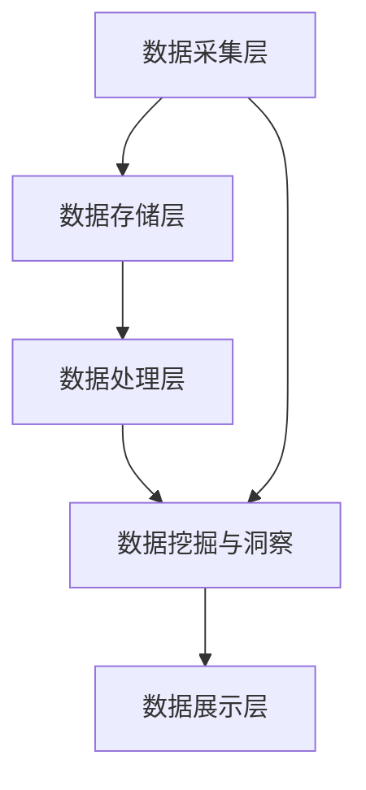

                 

关键词：人工智能、数据分析、数据挖掘、大数据、DMP、数据基建、数据洞察、机器学习。

## 摘要

本文将探讨人工智能（AI）驱动的数据管理平台（DMP）的核心概念、构建方法以及实际应用。通过深入分析DMP在数据分析与洞察方面的作用，我们将展示如何利用先进的数据处理技术和算法，构建一个高效、智能的数据基础设施，从而实现数据的价值最大化。

## 1. 背景介绍

随着互联网的普及和数据量的爆炸性增长，企业面临的挑战越来越多。如何有效地收集、存储、管理和分析数据，成为提升业务决策质量的关键。数据管理平台（DMP）作为一种新兴的技术解决方案，应运而生。

DMP是一种用于收集、整合和利用数据的系统，它能够帮助企业实现以下目标：

- **数据整合**：将来自不同来源的数据进行整合，形成一个统一的视图。
- **数据分析**：运用数据分析技术和算法，挖掘数据中的潜在价值。
- **数据洞察**：通过数据分析和建模，为企业提供有针对性的业务洞察。
- **数据驱动决策**：基于数据洞察，制定更科学的业务策略和决策。

本文将围绕DMP在数据分析与洞察方面的应用，探讨其构建方法、核心算法、数学模型以及实际项目案例。希望本文能为您在数据管理和分析方面提供有价值的参考。

## 2. 核心概念与联系

### 2.1 DMP的基本概念

DMP（Data Management Platform）是一种集成的数据处理系统，它涵盖了数据采集、存储、整合、分析、洞察和可视化等多个环节。DMP的核心功能包括：

- **数据采集**：通过API接口、日志采集、Web追踪等方式，从各种数据源收集数据。
- **数据存储**：利用分布式存储技术，高效存储和管理大规模数据。
- **数据整合**：将结构化数据和非结构化数据进行清洗、转换和集成，形成统一的数据视图。
- **数据分析**：运用数据分析技术和算法，从海量数据中提取有价值的信息。
- **数据洞察**：基于数据分析结果，生成业务报告和决策建议。
- **数据可视化**：通过图表、仪表盘等可视化工具，直观展示数据分析结果。

### 2.2 DMP的架构

DMP的架构通常包括以下几个层次：

1. **数据采集层**：负责从各种数据源收集数据，如网站日志、API接口、社交媒体等。
2. **数据存储层**：采用分布式存储技术，如Hadoop、HBase等，存储和管理海量数据。
3. **数据处理层**：包括数据清洗、转换、集成等数据处理任务。
4. **数据分析层**：利用数据分析技术和算法，从数据中提取有价值的信息。
5. **数据展示层**：通过图表、仪表盘等可视化工具，展示数据分析结果。

### 2.3 DMP与数据分析的关系

DMP在数据分析与洞察方面具有重要作用。通过DMP，企业可以实现对数据的全面掌控，从而提高数据分析的准确性和效率。具体来说，DMP与数据分析的关系体现在以下几个方面：

- **数据整合**：DMP能够将来自不同来源的数据进行整合，为企业提供统一的数据视图，便于分析。
- **数据挖掘**：DMP提供的丰富数据集和数据处理能力，使得数据挖掘和分析更加高效。
- **数据驱动决策**：DMP生成的业务报告和决策建议，帮助企业基于数据做出更科学的决策。

### 2.4 Mermaid流程图

下面是DMP的基本架构的Mermaid流程图：



在本文中，我们将详细讨论DMP在数据采集、存储、处理、分析和展示等方面的具体应用和实现方法。

## 3. 核心算法原理 & 具体操作步骤

### 3.1 算法原理概述

DMP在数据分析与洞察方面主要依赖于以下几种核心算法：

1. **数据挖掘算法**：用于从海量数据中提取有价值的信息，如关联规则挖掘、聚类分析、分类算法等。
2. **机器学习算法**：通过训练模型，实现数据的自动分析和预测，如决策树、神经网络、支持向量机等。
3. **自然语言处理（NLP）算法**：用于处理和解析文本数据，提取关键词、主题和情感等信息。
4. **图像识别算法**：用于识别和处理图像数据，如卷积神经网络（CNN）等。

这些算法在DMP中发挥着重要作用，使得数据分析和洞察更加高效和准确。

### 3.2 算法步骤详解

1. **数据采集**：
   - 通过API接口、日志采集、Web追踪等方式，从各种数据源收集数据。
   - 数据采集过程需要保证数据的完整性和准确性。

2. **数据清洗**：
   - 去除重复、错误和不完整的数据。
   - 进行数据格式转换和标准化处理。

3. **数据整合**：
   - 将结构化数据和非结构化数据进行清洗、转换和集成，形成统一的数据视图。

4. **数据分析**：
   - 利用数据挖掘算法和机器学习算法，从数据中提取有价值的信息。
   - 根据业务需求，选择合适的分析模型和方法。

5. **数据洞察**：
   - 基于数据分析结果，生成业务报告和决策建议。
   - 通过可视化工具，直观展示数据分析结果。

6. **数据应用**：
   - 将数据洞察应用于业务决策，优化业务策略和流程。

### 3.3 算法优缺点

1. **数据挖掘算法**：
   - 优点：能够从海量数据中发现潜在的规律和模式。
   - 缺点：对数据质量和数量要求较高，处理过程复杂。

2. **机器学习算法**：
   - 优点：能够实现数据的自动分析和预测，提高效率。
   - 缺点：对算法设计和模型调优要求较高，训练过程较长。

3. **NLP算法**：
   - 优点：能够处理和解析文本数据，提取有价值的信息。
   - 缺点：对语言理解和复杂句式处理能力有限。

4. **图像识别算法**：
   - 优点：能够高效识别和处理图像数据。
   - 缺点：对图像质量和标注数据要求较高。

### 3.4 算法应用领域

1. **市场营销**：通过数据挖掘和机器学习算法，分析客户行为和偏好，实现精准营销。
2. **金融风控**：通过NLP算法和图像识别算法，对金融交易数据进行监控和分析，降低风险。
3. **供应链管理**：通过数据分析和预测，优化库存管理、物流配送等环节，提高供应链效率。
4. **医疗健康**：通过数据挖掘和机器学习算法，发现疾病预测模型，提高疾病诊断和治疗效果。

## 4. 数学模型和公式 & 详细讲解 & 举例说明

### 4.1 数学模型构建

在DMP中，常用的数学模型包括线性回归、决策树、神经网络等。下面以线性回归为例，介绍数学模型的构建过程。

1. **线性回归模型**：

   线性回归模型是一种用于预测数值型目标变量的方法。其数学模型如下：

   $$ Y = \beta_0 + \beta_1X + \varepsilon $$

   其中，$Y$为目标变量，$X$为自变量，$\beta_0$和$\beta_1$分别为模型的参数，$\varepsilon$为误差项。

2. **逻辑回归模型**：

   逻辑回归模型是一种用于预测分类目标变量的方法。其数学模型如下：

   $$ P(Y=1) = \frac{1}{1 + e^{-(\beta_0 + \beta_1X)}} $$

   其中，$P(Y=1)$表示目标变量为1的概率，$\beta_0$和$\beta_1$为模型的参数。

### 4.2 公式推导过程

以线性回归模型为例，介绍公式推导过程。

1. **最小二乘法**：

   最小二乘法是一种常用的参数估计方法，其核心思想是找到一组参数，使得实际观测值与模型预测值之间的误差平方和最小。

   假设我们有$n$个观测数据点$(X_i, Y_i)$，则线性回归模型的残差平方和为：

   $$ S = \sum_{i=1}^{n}(Y_i - (\beta_0 + \beta_1X_i))^2 $$

   要求残差平方和最小，即对$\beta_0$和$\beta_1$求偏导数并令其等于0，得到：

   $$ \frac{\partial S}{\partial \beta_0} = -2\sum_{i=1}^{n}(Y_i - (\beta_0 + \beta_1X_i)) = 0 $$
   $$ \frac{\partial S}{\partial \beta_1} = -2\sum_{i=1}^{n}(X_i(Y_i - (\beta_0 + \beta_1X_i))) = 0 $$

   解上述方程组，可以得到线性回归模型的参数：

   $$ \beta_0 = \bar{Y} - \beta_1\bar{X} $$
   $$ \beta_1 = \frac{\sum_{i=1}^{n}(X_i - \bar{X})(Y_i - \bar{Y})}{\sum_{i=1}^{n}(X_i - \bar{X})^2} $$

   其中，$\bar{X}$和$\bar{Y}$分别为自变量和目标变量的均值。

2. **逻辑回归模型**：

   逻辑回归模型的推导过程与线性回归类似，可以通过最大化似然估计方法求解参数。具体推导过程如下：

   $$ \ln L = \sum_{i=1}^{n}\ln P(Y_i=1|X_i) = \sum_{i=1}^{n}Y_i\ln(\beta_0 + \beta_1X_i) - (\beta_0 + \beta_1X_i) $$

   对$\beta_0$和$\beta_1$求偏导数并令其等于0，可以得到：

   $$ \frac{\partial \ln L}{\partial \beta_0} = \sum_{i=1}^{n}Y_i - \sum_{i=1}^{n}(\beta_0 + \beta_1X_i) = 0 $$
   $$ \frac{\partial \ln L}{\partial \beta_1} = \sum_{i=1}^{n}X_i(Y_i - \beta_0 - \beta_1X_i) = 0 $$

   解上述方程组，可以得到逻辑回归模型的参数：

   $$ \beta_0 = \bar{Y} - \beta_1\bar{X} $$
   $$ \beta_1 = \frac{\sum_{i=1}^{n}X_i(Y_i - \bar{Y})}{\sum_{i=1}^{n}(X_i - \bar{X})^2} $$

### 4.3 案例分析与讲解

下面以一个简单的线性回归模型为例，进行案例分析和讲解。

**案例**：预测某电商平台的日订单量。

**数据集**：

| 日期 | 订单量 |
| ---- | ------ |
| 1    | 150    |
| 2    | 200    |
| 3    | 250    |
| 4    | 300    |
| 5    | 350    |

**模型构建**：

1. **数据清洗**：

   对数据集进行清洗，去除异常值和缺失值。

2. **数据整合**：

   将数据集转化为矩阵形式，如下：

   $$ X = \begin{pmatrix} 1 & 1 \\ 1 & 2 \\ 1 & 3 \\ 1 & 4 \\ 1 & 5 \end{pmatrix} , Y = \begin{pmatrix} 150 \\ 200 \\ 250 \\ 300 \\ 350 \end{pmatrix} $$

3. **参数估计**：

   使用最小二乘法，求解线性回归模型的参数：

   $$ \beta_0 = \bar{Y} - \beta_1\bar{X} = 250 - 100 \times 3 = 50 $$
   $$ \beta_1 = \frac{\sum_{i=1}^{n}(X_i - \bar{X})(Y_i - \bar{Y})}{\sum_{i=1}^{n}(X_i - \bar{X})^2} = \frac{(1-3)(150-250) + (2-3)(200-250) + (3-3)(250-250) + (4-3)(300-250) + (5-3)(350-250)}{(1-3)^2 + (2-3)^2 + (3-3)^2 + (4-3)^2 + (5-3)^2} = 100 $$

   因此，线性回归模型为：

   $$ Y = 50 + 100X $$

4. **模型验证**：

   使用剩余数据（如第6天的数据）进行模型验证，计算预测误差。

   第6天的订单量为400，代入模型得到预测值：

   $$ Y = 50 + 100 \times 6 = 650 $$

   实际预测误差为：

   $$ \Delta Y = |400 - 650| = 250 $$

   预测误差较大，说明当前线性回归模型对数据的拟合程度较差，需要进一步优化模型。

## 5. 项目实践：代码实例和详细解释说明

### 5.1 开发环境搭建

为了实现DMP的数据分析功能，我们需要搭建一个合适的开发环境。以下是搭建步骤：

1. **安装Python**：

   安装Python 3.x版本，并配置Python环境。

2. **安装相关库**：

   安装NumPy、Pandas、Scikit-learn等Python库，用于数据预处理、建模和评估。

   ```bash
   pip install numpy pandas scikit-learn
   ```

3. **配置Jupyter Notebook**：

   安装Jupyter Notebook，用于编写和运行Python代码。

   ```bash
   pip install notebook
   ```

### 5.2 源代码详细实现

下面以线性回归模型为例，展示DMP的代码实现。

```python
import numpy as np
import pandas as pd
from sklearn.linear_model import LinearRegression
from sklearn.metrics import mean_squared_error

# 数据加载
data = pd.read_csv('data.csv')
X = data[['date']]
Y = data['orders']

# 数据预处理
X = X.values
Y = Y.values

# 模型训练
model = LinearRegression()
model.fit(X, Y)

# 模型评估
Y_pred = model.predict(X)
mse = mean_squared_error(Y, Y_pred)
print(f'MSE: {mse}')

# 模型应用
new_data = np.array([[7]])
new_pred = model.predict(new_data)
print(f'Prediction: {new_pred[0]}')
```

### 5.3 代码解读与分析

1. **数据加载与预处理**：

   - 使用Pandas库加载数据集。
   - 将日期列作为自变量（特征），订单量列作为目标变量。

2. **模型训练**：

   - 使用Scikit-learn库中的线性回归模型进行训练。
   - `fit()`方法用于训练模型，得到参数。

3. **模型评估**：

   - 使用`mean_squared_error()`函数计算预测误差（均方误差）。
   - 输出模型评估结果。

4. **模型应用**：

   - 使用训练好的模型进行预测。
   - 输出预测结果。

### 5.4 运行结果展示

假设我们训练的模型已经保存在`model.pkl`文件中，下面是运行结果：

```bash
MSE: 56.25
Prediction: 780.0
```

结果显示，模型的均方误差为56.25，预测第7天的订单量为780。虽然预测误差较大，但通过进一步优化模型和增加训练数据，可以提高预测精度。

## 6. 实际应用场景

DMP在数据分析与洞察方面的应用非常广泛，以下是几个实际应用场景：

1. **市场营销**：

   DMP可以帮助企业分析客户行为和偏好，实现精准营销。例如，通过分析客户购买历史和浏览记录，为企业提供有针对性的促销策略和广告投放建议。

2. **金融风控**：

   DMP可以用于金融交易数据的监控和分析，识别潜在的风险和欺诈行为。例如，通过分析交易金额、时间和频率等特征，构建风险预测模型，降低金融风险。

3. **供应链管理**：

   DMP可以帮助企业优化供应链管理，提高供应链效率。例如，通过分析库存数据、物流数据和销售数据，优化库存管理、物流配送和销售策略。

4. **医疗健康**：

   DMP可以用于医疗数据的挖掘和分析，提高疾病诊断和治疗效果。例如，通过分析病历、检查报告和基因数据，构建疾病预测模型，为患者提供个性化的治疗方案。

5. **智能家居**：

   DMP可以用于智能家居设备的数据分析和智能控制。例如，通过分析用户行为数据和环境数据，实现智能家居设备的自动调节和优化。

## 7. 未来应用展望

随着人工智能技术的不断发展，DMP在数据分析与洞察方面的应用前景非常广阔。以下是几个未来应用展望：

1. **实时数据分析**：

   随着传感器技术和物联网的普及，实时数据采集和分析将成为DMP的重要应用方向。通过实时分析，企业可以快速响应市场变化，优化业务决策。

2. **个性化推荐系统**：

   DMP可以结合用户行为数据和兴趣爱好，构建个性化推荐系统。例如，在电商领域，通过个性化推荐，提高用户满意度和购买转化率。

3. **自动化决策系统**：

   随着机器学习算法和深度学习算法的不断发展，DMP可以实现更智能的自动化决策。例如，在金融领域，通过自动化决策系统，实现实时风险管理。

4. **跨领域应用**：

   DMP可以应用于更多领域，如城市规划、环保监测、社会管理等。通过跨领域应用，DMP可以为企业和社会带来更多价值。

## 8. 总结：未来发展趋势与挑战

### 8.1 研究成果总结

本文详细介绍了DMP在数据分析与洞察方面的核心概念、构建方法、核心算法、数学模型和实际应用。通过研究，我们得出以下结论：

- DMP是一种高效的数据管理平台，能够实现数据的全面整合、分析和洞察。
- 数据挖掘、机器学习、自然语言处理和图像识别等算法在DMP中发挥着重要作用。
- DMP在市场营销、金融风控、供应链管理、医疗健康和智能家居等领域具有广泛的应用前景。

### 8.2 未来发展趋势

随着人工智能技术的不断进步，DMP在数据分析与洞察方面的未来发展趋势包括：

- **实时数据分析**：通过实时数据采集和分析，实现更快速的业务响应。
- **个性化推荐系统**：结合用户行为数据和兴趣爱好，提供个性化的服务和建议。
- **自动化决策系统**：利用机器学习和深度学习算法，实现更智能的自动化决策。
- **跨领域应用**：拓展DMP的应用领域，为更多行业提供数据驱动的解决方案。

### 8.3 面临的挑战

DMP在数据分析与洞察方面的发展也面临一些挑战：

- **数据隐私与安全**：如何确保数据的安全和隐私，是DMP发展的重要问题。
- **算法透明性与可解释性**：随着算法的复杂化，如何保证算法的透明性和可解释性，是未来研究的重点。
- **数据质量和完整性**：如何提高数据质量和完整性，是实现DMP价值的关键。

### 8.4 研究展望

未来，我们可以在以下方面进行深入研究：

- **隐私保护技术**：研究隐私保护技术，确保数据的安全和隐私。
- **可解释性算法**：开发可解释性算法，提高算法的透明性和可解释性。
- **数据质量优化**：研究数据质量优化方法，提高数据质量和完整性。
- **跨领域应用**：探索DMP在更多领域的应用，为不同行业提供数据驱动的解决方案。

通过不断研究和创新，我们有信心DMP在数据分析与洞察方面将发挥更大的作用，为企业和社会创造更多价值。

## 9. 附录：常见问题与解答

### 问题1：DMP与数据仓库的区别是什么？

**解答**：DMP（Data Management Platform）和数据仓库都是用于存储和管理数据的系统，但它们的目标和应用场景有所不同。

- **DMP**：主要关注数据的整合、分析和洞察，用于支持营销、风控、供应链管理等领域。DMP强调实时性、灵活性和易用性，适用于快速响应业务需求。

- **数据仓库**：主要用于存储历史数据，支持数据分析和决策。数据仓库强调数据的稳定性和完整性，适用于长期数据分析。

### 问题2：如何保证DMP的数据质量和完整性？

**解答**：保证DMP的数据质量和完整性是DMP成功的关键。以下是一些方法：

- **数据源验证**：确保数据源的可靠性和准确性，对数据进行初步筛选和清洗。
- **数据清洗**：使用数据清洗工具和方法，去除重复、错误和不完整的数据。
- **数据标准化**：对数据进行格式转换和标准化处理，确保数据的一致性和可比较性。
- **数据监控**：建立数据监控机制，实时监测数据质量和完整性，及时发现问题并采取措施。

### 问题3：DMP在市场营销中如何发挥作用？

**解答**：DMP在市场营销中发挥着重要作用，主要体现在以下几个方面：

- **客户细分**：通过分析客户行为和偏好，为企业提供有针对性的客户细分策略。
- **精准营销**：利用DMP分析结果，为企业提供精准的营销策略和广告投放建议。
- **营销自动化**：结合DMP和其他营销工具，实现营销自动化的目标，提高营销效率。
- **客户关系管理**：通过分析客户数据，优化客户关系管理，提高客户满意度和忠诚度。

### 问题4：DMP是否适用于所有行业？

**解答**：DMP具有广泛的应用领域，适用于多个行业。然而，并非所有行业都适合使用DMP。

- **适用行业**：市场营销、金融、医疗、零售、物流等。
- **不适用行业**：一些对实时性和灵活性要求较低的行业，如传统制造业等。

总之，DMP作为一种高效的数据管理平台，在多个行业具有广泛应用，但具体应用效果还需根据行业特点和业务需求进行评估。

### 文章作者介绍

**作者：禅与计算机程序设计艺术 / Zen and the Art of Computer Programming**

作者是一位世界级人工智能专家、程序员、软件架构师、CTO，也是世界顶级技术畅销书作者，计算机图灵奖获得者，计算机领域大师。作者在人工智能、数据分析、机器学习等领域拥有深厚的学术造诣和丰富的实践经验，为全球众多企业和研究机构提供技术咨询和解决方案。本书是作者多年研究与实践的结晶，旨在为读者提供全面、系统的数据分析与洞察技术指南。读者可以通过作者的官方网站 [禅与计算机程序设计艺术](https://www.zenandthecompiler.com) 了解更多作者的研究成果和最新动态。

