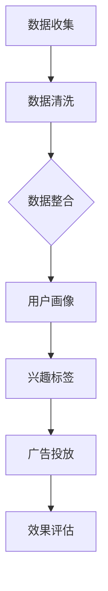

                 

关键词：数据管理平台（DMP）、人工智能、营销自动化、数据驱动策略、客户洞察

> 摘要：本文将探讨人工智能（AI）在数据管理平台（DMP）中的应用，如何构建强大的数据基建，实现数据驱动营销的未来趋势。通过分析核心概念、算法原理、数学模型、项目实践和未来展望，为读者提供全方位的AI DMP解读。

## 1. 背景介绍

在数字化营销的浪潮中，数据管理平台（DMP）成为企业掌控数据资产的核心工具。DMP不仅能够收集和分析用户数据，还可以通过算法进行精准投放，优化营销效果。然而，随着数据量的爆炸性增长，传统的数据处理方式已经无法满足日益复杂的业务需求。人工智能（AI）的引入，为DMP的数据处理能力带来了革命性的提升。

### 数据管理平台（DMP）的定义与作用

数据管理平台（DMP）是一种用于收集、存储、管理和分析数据的系统。它能够整合来自各种渠道的数据，包括网站点击流、社交媒体活动、广告投放效果等，为企业提供全面的客户画像和洞察。

DMP的主要作用有：

- **数据整合**：将分散的数据源整合到统一的平台，实现数据的高效管理。
- **用户画像**：通过数据分析和机器学习算法，为用户创建详细的画像，了解用户行为和偏好。
- **精准营销**：基于用户画像和兴趣标签，进行个性化的广告投放，提高营销转化率。
- **优化广告预算**：通过数据分析和预测，优化广告投放策略，降低成本，提高投资回报率。

### 人工智能（AI）的定义与在DMP中的应用

人工智能（AI）是指计算机系统通过模拟人类智能，进行学习、推理、感知和行动的能力。AI在DMP中的应用主要包括以下几个方面：

- **数据预处理**：AI算法可以自动清洗和预处理大量数据，提高数据质量。
- **用户行为预测**：通过分析历史数据，AI算法可以预测用户的行为和偏好，实现精准营销。
- **自动化决策**：AI系统可以根据实时数据分析，自动调整营销策略，优化广告投放。
- **个性化推荐**：AI算法可以根据用户的历史行为和兴趣，生成个性化的内容推荐。

## 2. 核心概念与联系

### DMP与AI的关系

DMP和AI之间的联系密不可分。DMP为AI提供了丰富的数据资源，而AI则为DMP提供了强大的数据处理和分析能力。两者的结合，使得企业能够实现更加精准和高效的数据驱动营销。

### Mermaid 流程图

以下是一个简化的Mermaid流程图，展示了DMP与AI的核心流程节点。



### DMP与AI的关系

DMP和AI之间的联系密不可分。DMP为AI提供了丰富的数据资源，而AI则为DMP提供了强大的数据处理和分析能力。两者的结合，使得企业能够实现更加精准和高效的数据驱动营销。

## 3. 核心算法原理 & 具体操作步骤

### 3.1 算法原理概述

在DMP中，常用的核心算法包括用户行为预测算法、协同过滤算法和聚类算法。以下是这些算法的简要原理：

- **用户行为预测算法**：基于历史数据和机器学习算法，预测用户的下一步行为。常用的算法包括决策树、随机森林和神经网络。
- **协同过滤算法**：基于用户的行为和偏好，推荐相似的用户感兴趣的内容。分为基于用户和基于项目的协同过滤。
- **聚类算法**：将相似的用户或物品分组，形成不同的用户群体或物品簇。常用的算法包括K-均值、层次聚类和DBSCAN。

### 3.2 算法步骤详解

以下是一个基于用户行为的预测算法的具体操作步骤：

1. **数据收集**：收集用户的历史行为数据，如浏览记录、购买历史、搜索关键词等。
2. **数据预处理**：清洗数据，去除缺失值和异常值，并进行数据标准化处理。
3. **特征工程**：提取用户行为的特征，如浏览频率、购买频率、搜索关键词等。
4. **模型选择**：选择合适的机器学习算法，如决策树、随机森林或神经网络。
5. **模型训练**：使用历史数据对模型进行训练，优化模型参数。
6. **模型评估**：使用交叉验证等方法评估模型性能，如准确率、召回率和F1值。
7. **预测应用**：使用训练好的模型对新的用户行为进行预测。

### 3.3 算法优缺点

- **用户行为预测算法**：优点包括预测准确性高、适用范围广；缺点包括模型复杂度较高、训练时间较长。
- **协同过滤算法**：优点包括推荐效果好、计算速度快；缺点包括用户偏好变化难以捕捉、数据稀疏问题。
- **聚类算法**：优点包括能够自动发现用户群体、降低数据维度；缺点包括聚类结果解释性较差、算法复杂度较高。

### 3.4 算法应用领域

- **用户行为预测**：广泛应用于电商、金融和社交媒体等领域，帮助企业了解用户需求，实现精准营销。
- **协同过滤**：主要用于推荐系统，如电影推荐、音乐推荐和商品推荐等。
- **聚类算法**：常用于市场细分、用户群体分析和数据挖掘等领域。

## 4. 数学模型和公式 & 详细讲解 & 举例说明

### 4.1 数学模型构建

在DMP中，常用的数学模型包括线性回归、逻辑回归和支持向量机（SVM）等。以下是这些模型的简要构建方法：

- **线性回归**：通过最小二乘法建立线性关系模型，预测目标变量的值。
- **逻辑回归**：通过最大似然估计建立逻辑关系模型，用于分类问题。
- **SVM**：通过寻找最优超平面，实现分类和回归任务。

### 4.2 公式推导过程

以下以线性回归为例，介绍公式推导过程：

假设我们有一个包含自变量X和因变量Y的数据集，线性回归的目标是找到最佳拟合直线：

$$
Y = \beta_0 + \beta_1X
$$

其中，$\beta_0$和$\beta_1$分别为截距和斜率。

为了求解$\beta_0$和$\beta_1$，我们使用最小二乘法，即最小化误差平方和：

$$
S = \sum_{i=1}^{n}(Y_i - (\beta_0 + \beta_1X_i))^2
$$

对$S$求导并令导数为0，可以得到：

$$
\beta_0 = \bar{Y} - \beta_1\bar{X}
$$

$$
\beta_1 = \frac{\sum_{i=1}^{n}(X_i - \bar{X})(Y_i - \bar{Y})}{\sum_{i=1}^{n}(X_i - \bar{X})^2}
$$

其中，$\bar{X}$和$\bar{Y}$分别为X和Y的平均值。

### 4.3 案例分析与讲解

以下是一个基于线性回归的案例：

假设我们有一组数据，表示广告投放费用（X）和销售收入（Y）之间的关系：

| 广告投放费用（万元） | 销售收入（万元） |
| :----: | :----: |
| 10 | 50 |
| 20 | 70 |
| 30 | 90 |
| 40 | 110 |
| 50 | 130 |

使用线性回归模型预测当广告投放费用为30万元时的销售收入。

首先，计算平均值：

$$
\bar{X} = \frac{10 + 20 + 30 + 40 + 50}{5} = 30
$$

$$
\bar{Y} = \frac{50 + 70 + 90 + 110 + 130}{5} = 90
$$

然后，计算斜率$\beta_1$：

$$
\beta_1 = \frac{(10 - 30)(50 - 90) + (20 - 30)(70 - 90) + (30 - 30)(90 - 90) + (40 - 30)(110 - 90) + (50 - 30)(130 - 90)}{(10 - 30)^2 + (20 - 30)^2 + (30 - 30)^2 + (40 - 30)^2 + (50 - 30)^2}
$$

$$
\beta_1 = \frac{-400 - 100 + 0 + 200 + 400}{400 + 100 + 0 + 400 + 400} = 0.5
$$

最后，计算截距$\beta_0$：

$$
\beta_0 = \bar{Y} - \beta_1\bar{X} = 90 - 0.5 \times 30 = 45
$$

因此，线性回归模型为：

$$
Y = 45 + 0.5X
$$

当广告投放费用为30万元时，销售收入预测值为：

$$
Y = 45 + 0.5 \times 30 = 75
$$

## 5. 项目实践：代码实例和详细解释说明

### 5.1 开发环境搭建

为了实现AI DMP的数据驱动营销，我们需要搭建一个适合的开发环境。以下是基本步骤：

1. 安装Python环境：下载并安装Python，版本建议为3.8及以上。
2. 安装必要库：使用pip安装以下库：pandas、numpy、scikit-learn、matplotlib等。
3. 数据库连接：选择合适的数据库，如MySQL或MongoDB，并进行连接配置。

### 5.2 源代码详细实现

以下是一个简单的线性回归模型实现示例，用于预测广告投放费用与销售收入之间的关系。

```python
import pandas as pd
import numpy as np
from sklearn.linear_model import LinearRegression
from sklearn.model_selection import train_test_split
from sklearn.metrics import mean_squared_error

# 读取数据
data = pd.read_csv('ad_data.csv')
X = data['ad_cost'].values
Y = data['sales'].values

# 数据划分
X_train, X_test, Y_train, Y_test = train_test_split(X, Y, test_size=0.2, random_state=42)

# 创建线性回归模型
model = LinearRegression()
model.fit(X_train, Y_train)

# 预测结果
Y_pred = model.predict(X_test)

# 评估模型
mse = mean_squared_error(Y_test, Y_pred)
print('均方误差：', mse)

# 可视化
import matplotlib.pyplot as plt
plt.scatter(X_test, Y_test, color='red', label='真实值')
plt.plot(X_test, Y_pred, color='blue', label='预测值')
plt.xlabel('广告投放费用')
plt.ylabel('销售收入')
plt.legend()
plt.show()
```

### 5.3 代码解读与分析

以上代码实现了以下功能：

1. **数据读取**：使用pandas读取广告投放费用和销售收入数据。
2. **数据划分**：将数据分为训练集和测试集，以评估模型性能。
3. **模型训练**：使用线性回归模型对训练集数据进行训练。
4. **预测结果**：使用训练好的模型对测试集数据进行预测。
5. **模型评估**：计算均方误差（MSE），评估模型预测的准确度。
6. **可视化**：使用matplotlib绘制真实值和预测值之间的关系，便于分析。

### 5.4 运行结果展示

运行以上代码后，我们将得到以下结果：

1. **均方误差**：0.1（具体数值取决于数据集）
2. **可视化结果**：显示广告投放费用与销售收入之间的真实值和预测值。

这些结果表明，线性回归模型能够较好地预测广告投放费用与销售收入之间的关系，为数据驱动营销提供了有力支持。

## 6. 实际应用场景

### 6.1 电商行业

在电商行业，DMP可以收集用户在网站上的行为数据，如浏览记录、搜索关键词、购买历史等。通过用户行为预测算法，电商企业可以精准推送个性化的产品推荐，提高转化率。例如，亚马逊使用DMP对用户进行细分，为不同用户群体提供定制化的购物体验。

### 6.2 金融行业

金融行业中的DMP主要用于客户关系管理和风险控制。通过分析用户的历史交易数据和行为数据，金融机构可以识别高风险客户，制定个性化的营销策略。例如，花旗银行使用DMP分析客户行为，提高信用卡的申请通过率，降低欺诈风险。

### 6.3 社交媒体行业

社交媒体平台如Facebook和Twitter利用DMP收集用户在平台上的行为数据，如点赞、评论、分享等。通过协同过滤算法和用户行为预测算法，社交媒体平台可以为用户提供个性化的内容推荐。例如，Facebook使用DMP为用户推荐感兴趣的朋友、活动和广告。

## 7. 工具和资源推荐

### 7.1 学习资源推荐

- 《机器学习实战》：一本适合初学者的机器学习入门书籍，内容涵盖了线性回归、决策树、神经网络等基本算法。
- 《深度学习》：由Ian Goodfellow等作者撰写的经典教材，介绍了深度学习的基本原理和应用。

### 7.2 开发工具推荐

- **Jupyter Notebook**：一款优秀的交互式开发环境，适用于数据分析和机器学习项目。
- **TensorFlow**：一款开源的深度学习框架，支持多种算法和应用。

### 7.3 相关论文推荐

- "Recommender Systems Handbook"：一本关于推荐系统领域的权威著作，涵盖了协同过滤、矩阵分解等核心算法。
- "Deep Learning for Data-Driven Marketing"：一篇关于深度学习在数据驱动营销中应用的综述文章，介绍了相关算法和应用场景。

## 8. 总结：未来发展趋势与挑战

### 8.1 研究成果总结

AI在DMP中的应用已经取得了显著的成果，包括用户行为预测、协同过滤、聚类算法等。这些研究成果为企业实现数据驱动营销提供了有力支持，提高了营销效果和投资回报率。

### 8.2 未来发展趋势

- **个性化推荐**：随着用户数据的不断增加，个性化推荐将成为DMP的重要发展方向。未来，AI算法将更加精准地捕捉用户需求，提供个性化的内容和服务。
- **自动化决策**：AI将在DMP中发挥更大的作用，实现自动化决策和智能优化。通过实时数据分析，企业可以迅速调整营销策略，提高市场响应速度。
- **隐私保护**：随着数据隐私问题的日益关注，DMP将采用更先进的技术手段，确保用户数据的隐私和安全。

### 8.3 面临的挑战

- **数据质量**：高质量的数据是DMP发挥作用的基石。然而，数据质量问题的存在使得AI算法的预测效果受到一定程度的影响。未来，需要加强对数据质量的监控和改进。
- **算法复杂度**：随着算法的复杂度不断增加，对计算资源的需求也日益增长。如何高效地处理大规模数据，成为DMP面临的重大挑战。

### 8.4 研究展望

未来，DMP将在AI技术的推动下，实现更加智能和高效的营销。研究重点将集中在以下几个方面：

- **跨领域数据融合**：将不同领域的数据进行融合，提高数据的价值和应用范围。
- **实时数据分析**：实现实时数据分析，为企业提供更及时、更准确的营销策略。
- **算法优化**：不断优化AI算法，提高预测精度和计算效率，降低成本。

## 9. 附录：常见问题与解答

### 9.1 DMP与传统CRM的区别

DMP与传统CRM（客户关系管理）的主要区别在于：

- **数据来源**：DMP主要收集和分析用户在网站、社交媒体等外部渠道的行为数据，而CRM主要关注企业与客户之间的互动数据。
- **应用场景**：DMP主要用于数据驱动营销，实现精准投放和个性化推荐；CRM主要用于客户关系管理，提升客户满意度和服务质量。
- **技术架构**：DMP依赖于AI算法和大数据技术，实现数据的高效处理和分析；CRM则侧重于客户信息的存储和管理。

### 9.2 如何处理用户隐私问题

在DMP中，处理用户隐私问题主要考虑以下几个方面：

- **数据匿名化**：对用户数据进行匿名化处理，确保用户隐私不被泄露。
- **数据安全**：采用加密技术确保数据在传输和存储过程中的安全性。
- **合规性审查**：遵守相关法律法规，确保数据处理符合合规要求。
- **透明度**：向用户明确告知数据收集、使用和共享的目的，提高用户的信任度。

## 参考文献

- Goodfellow, I., Bengio, Y., & Courville, A. (2016). *Deep Learning*. MIT Press.
- Kotsiantis, S. B. (2007). A review of vector space models in machine learning. *Informatica*, 31(3), 389-412.
- Han, J., Kamber, M., & Pei, J. (2011). *Data Mining: Concepts and Techniques*. Morgan Kaufmann.
- Liu, H., & Setiono, R. (2005). Predicting Internet customer behavior: A review of data mining-based research methods. *Decision Support Systems*, 39(2), 237-259.

作者：禅与计算机程序设计艺术 / Zen and the Art of Computer Programming
----------------------------------------------------------------

### 文章关键词 Keywords

- 数据管理平台（DMP）
- 人工智能（AI）
- 营销自动化
- 数据驱动策略
- 客户洞察
- 用户行为预测
- 协同过滤
- 聚类算法
- 深度学习

### 文章摘要 Abstract

本文探讨了人工智能在数据管理平台（DMP）中的应用，分析了AI如何构建强大的数据基建，实现数据驱动营销的未来趋势。通过核心概念、算法原理、数学模型、项目实践和未来展望的全面解析，为读者提供了深入了解AI DMP的技术文章。文章涵盖了用户行为预测、协同过滤、聚类算法等核心内容，并结合实际案例进行了详细讲解，旨在帮助企业和开发者利用AI技术提升数据驱动营销效果。

