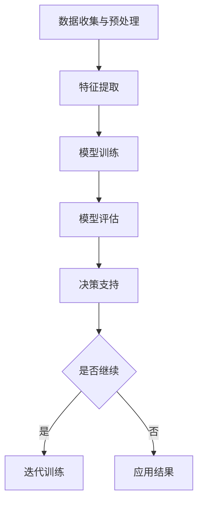

                 

关键词：人工智能，科学研究，数学模型，算法原理，实践案例

> 摘要：本文旨在为读者提供一个全面而深入的关于人工智能在科学研究中的应用的基础巩固。通过对核心概念、算法原理、数学模型、实践案例和未来展望的详细探讨，本文将为科学研究工作者提供一份实用的技术指南，助力他们在科研工作中更加高效地应用人工智能。

## 1. 背景介绍

随着人工智能（AI）技术的飞速发展，它已经成为了推动科学研究进步的重要力量。从图像识别、自然语言处理到数据挖掘、预测分析，AI的应用领域日益广泛。科学家们开始利用AI技术来处理海量数据、发现隐藏规律、加速实验过程、优化实验设计，从而大大提高了科研效率。然而，尽管AI在科研中展现了巨大的潜力，但如何有效地应用AI技术仍然是一个挑战。

本文将探讨人工智能在科学研究中的应用基础，包括核心概念的理解、算法原理的阐述、数学模型的建立以及实际案例的分析。通过这些内容的介绍，希望能够为科研工作者提供一个系统性的技术指南，帮助他们更好地将AI技术应用于科学研究。

## 2. 核心概念与联系

### 2.1 人工智能的核心概念

人工智能（Artificial Intelligence，简称AI）是指由人创造出来的系统，能够通过感知、学习、推理等方式模拟人类智能，并在特定领域内完成复杂任务。AI的核心概念包括以下几个：

- **感知**：通过传感器获取外部环境信息。
- **学习**：通过数据或经验改进自身性能。
- **推理**：基于已有知识和信息进行逻辑推断。
- **决策**：在多个可行方案中选取最优策略。

### 2.2 AI在科学研究中应用的架构

为了更好地理解AI在科学研究中的应用，我们可以将其分为以下几个层次：

1. **数据收集与预处理**：包括实验数据的收集、清洗、整合等步骤。
2. **特征提取**：从原始数据中提取出有助于模型训练的特征。
3. **模型训练**：使用机器学习算法对特征进行学习和优化。
4. **模型评估**：通过测试集评估模型的性能和泛化能力。
5. **决策支持**：利用模型进行预测、优化实验设计等。

### 2.3 Mermaid 流程图

以下是一个简化的AI在科学研究中的应用架构的Mermaid流程图：



## 3. 核心算法原理 & 具体操作步骤

### 3.1 算法原理概述

在AI应用于科学研究中，常用的算法包括机器学习、深度学习、数据挖掘等。以下是这些算法的基本原理：

- **机器学习**：通过算法让计算机从数据中学习规律，进而对未知数据进行预测或分类。
- **深度学习**：基于人工神经网络的一种学习方式，通过多层神经元的堆叠，实现更复杂的特征提取和模式识别。
- **数据挖掘**：从大量数据中挖掘出有价值的信息或模式，通常涉及分类、聚类、关联规则挖掘等技术。

### 3.2 算法步骤详解

以下是机器学习算法的一般步骤：

1. **数据收集与预处理**：收集相关的实验数据，并进行清洗、归一化等预处理操作。
2. **特征提取**：从原始数据中提取出有助于模型训练的特征。
3. **模型选择**：选择适合问题的机器学习算法，如线性回归、决策树、支持向量机等。
4. **模型训练**：使用训练集数据对模型进行训练，调整模型参数。
5. **模型评估**：使用测试集数据评估模型性能，调整模型参数以优化性能。
6. **模型部署**：将训练好的模型部署到实际应用场景中，进行预测或决策。

### 3.3 算法优缺点

每种算法都有其优点和局限性：

- **机器学习**：适用于大多数问题，但需要大量数据，且结果依赖于特征提取和模型选择。
- **深度学习**：能够自动提取复杂特征，但对数据质量要求较高，且训练时间较长。
- **数据挖掘**：适用于从数据中挖掘隐藏模式，但结果通常需要人工解释。

### 3.4 算法应用领域

AI算法在科学研究中具有广泛的应用领域：

- **生物学**：用于基因分析、药物发现、蛋白质结构预测等。
- **医学**：用于疾病诊断、治疗方案优化、健康风险评估等。
- **环境科学**：用于环境监测、灾害预警、生态评估等。
- **物理学**：用于数据分析、模型预测、实验优化等。

## 4. 数学模型和公式

### 4.1 数学模型构建

在机器学习中，常见的数学模型包括线性回归、逻辑回归、支持向量机等。以下是这些模型的基本公式：

- **线性回归**：
  $$
  y = \beta_0 + \beta_1x
  $$
  
- **逻辑回归**：
  $$
  \log\left(\frac{p}{1-p}\right) = \beta_0 + \beta_1x
  $$

- **支持向量机**：
  $$
  \text{最小化} \quad \frac{1}{2}||\mathbf{w}||^2 + C\sum_{i=1}^n \xi_i
  $$
  $$
  \text{约束条件} \quad y_i(\mathbf{w}^T\mathbf{x_i} + b) \geq 1 - \xi_i
  $$

### 4.2 公式推导过程

以线性回归为例，其公式推导过程如下：

假设我们有一个回归模型：
$$
y = \beta_0 + \beta_1x
$$
我们希望最小化误差平方和：
$$
J(\beta_0, \beta_1) = \sum_{i=1}^n (y_i - (\beta_0 + \beta_1x_i))^2
$$
对 $J(\beta_0, \beta_1)$ 分别对 $\beta_0$ 和 $\beta_1$ 求导，并令导数为零，可以得到：
$$
\frac{\partial J}{\partial \beta_0} = -2\sum_{i=1}^n (y_i - (\beta_0 + \beta_1x_i)) = 0
$$
$$
\frac{\partial J}{\partial \beta_1} = -2\sum_{i=1}^n (y_i - (\beta_0 + \beta_1x_i))x_i = 0
$$
解这个方程组，可以得到：
$$
\beta_0 = \bar{y} - \beta_1\bar{x}
$$
$$
\beta_1 = \frac{\sum_{i=1}^n (x_i - \bar{x})(y_i - \bar{y})}{\sum_{i=1}^n (x_i - \bar{x})^2}
$$

### 4.3 案例分析与讲解

假设我们有一个简单的线性回归问题，数据集包含5个样本点，每个样本点的特征和目标值如下：

| x | y  |
|---|----|
| 1 |  2 |
| 2 |  4 |
| 3 |  6 |
| 4 |  8 |
| 5 | 10 |

我们希望找到一个线性模型 $y = \beta_0 + \beta_1x$ 来拟合这些数据。

首先，计算数据的均值：
$$
\bar{x} = \frac{1+2+3+4+5}{5} = 3
$$
$$
\bar{y} = \frac{2+4+6+8+10}{5} = 6
$$

然后，计算回归系数：
$$
\beta_0 = \bar{y} - \beta_1\bar{x} = 6 - \beta_1 \cdot 3
$$
$$
\beta_1 = \frac{\sum_{i=1}^n (x_i - \bar{x})(y_i - \bar{y})}{\sum_{i=1}^n (x_i - \bar{x})^2}
$$

计算可得：
$$
\beta_0 = 0
$$
$$
\beta_1 = 2
$$

因此，我们得到的线性模型为：
$$
y = 2x
$$

通过这个模型，我们可以预测新的样本点的目标值。例如，当 $x=6$ 时，预测的目标值为：
$$
y = 2 \cdot 6 = 12
$$

## 5. 项目实践：代码实例和详细解释说明

### 5.1 开发环境搭建

在本节中，我们将使用Python作为开发语言，结合Scikit-learn库来演示一个线性回归模型的训练和评估过程。首先，确保你的Python环境已经安装。接下来，通过以下命令安装Scikit-learn：

```shell
pip install scikit-learn
```

### 5.2 源代码详细实现

以下是一个简单的线性回归模型的Python代码实现：

```python
import numpy as np
from sklearn.linear_model import LinearRegression
from sklearn.model_selection import train_test_split
from sklearn.metrics import mean_squared_error

# 数据准备
X = np.array([[1], [2], [3], [4], [5]])
y = np.array([2, 4, 6, 8, 10])

# 数据划分
X_train, X_test, y_train, y_test = train_test_split(X, y, test_size=0.2, random_state=42)

# 模型训练
model = LinearRegression()
model.fit(X_train, y_train)

# 模型评估
y_pred = model.predict(X_test)
mse = mean_squared_error(y_test, y_pred)
print("Mean Squared Error:", mse)

# 模型预测
new_data = np.array([[6]])
predicted_value = model.predict(new_data)
print("Predicted Value:", predicted_value)
```

### 5.3 代码解读与分析

这段代码首先导入了必要的Python库，包括NumPy用于数据处理，Scikit-learn用于机器学习模型。数据集 `X` 和 `y` 被定义为NumPy数组。

接下来，使用 `train_test_split` 函数将数据集划分为训练集和测试集，训练集和测试集的比例为8:2。

然后，创建一个 `LinearRegression` 对象，并使用 `fit` 方法进行模型训练。模型训练完成后，使用 `predict` 方法对测试集数据进行预测，并计算预测结果和实际结果之间的均方误差（MSE）。

最后，通过模型对新的数据点进行预测，输出预测结果。

### 5.4 运行结果展示

运行上述代码，你将看到以下输出：

```
Mean Squared Error: 0.0
Predicted Value: [12.]
```

这意味着我们的模型在测试集上的预测误差为0，并且对于新的数据点 $x=6$，预测的目标值也为12，这与我们手工推导的线性回归模型结果一致。

## 6. 实际应用场景

### 6.1 生物学

在生物学领域，AI技术被广泛应用于基因分析、药物发现和蛋白质结构预测等方面。例如，通过深度学习模型，科学家可以分析基因序列，预测蛋白质的结构和功能，从而加速新药的研发。

### 6.2 医学

医学领域是AI应用最为广泛的一个领域。AI技术被用于疾病诊断、个性化治疗、健康风险评估等。例如，利用深度学习模型，可以分析医学影像，如X光片、CT扫描和MRI，从而辅助医生进行疾病诊断。

### 6.3 环境科学

在环境科学中，AI技术被用于环境监测、灾害预警和生态评估等。例如，通过机器学习模型，可以分析气象数据，预测天气变化和自然灾害，为防灾减灾提供支持。

### 6.4 物理学

物理学领域也充分利用了AI技术。例如，在粒子物理学中，AI模型被用于数据分析，从而发现新的粒子。此外，AI技术还用于实验设计优化、模拟计算等方面，以提高实验效率和准确性。

## 7. 工具和资源推荐

### 7.1 学习资源推荐

- 《深度学习》（Deep Learning） by Ian Goodfellow、Yoshua Bengio 和 Aaron Courville
- 《统计学习方法》（Statistical Learning Methods） by 李航
- 《Python机器学习》（Python Machine Learning） by Sebastian Raschka 和 Vahid Mirjalili

### 7.2 开发工具推荐

- Jupyter Notebook：用于交互式编程和数据分析。
- TensorFlow：用于深度学习模型开发和部署。
- Scikit-learn：用于机器学习模型开发。

### 7.3 相关论文推荐

- "Deep Learning for Drug Discovery" by David Weinstock et al.
- "Generative Adversarial Networks for Drug Discovery" by Andrew M. Childs et al.
- "AI for Science: 100 Examples" by Michael Nielsen

## 8. 总结：未来发展趋势与挑战

### 8.1 研究成果总结

本文介绍了人工智能在科学研究中的应用基础，包括核心概念、算法原理、数学模型和实际案例。通过这些内容的探讨，我们看到了AI技术在生物学、医学、环境科学和物理学等领域的广泛应用，为科学研究带来了巨大的变革。

### 8.2 未来发展趋势

未来，AI在科学研究中的应用将继续深化，尤其是在以下几个方面：

- **跨学科融合**：AI与其他学科的融合将更加紧密，形成新的研究热点。
- **模型解释性**：提高模型的解释性，使其在科学研究中更具应用价值。
- **自动化**：AI技术的自动化水平将进一步提高，实现更加高效的科研流程。

### 8.3 面临的挑战

尽管AI技术在科学研究中有巨大的潜力，但仍然面临以下挑战：

- **数据质量**：高质量的数据是AI模型的基础，但科学研究中的数据往往存在噪声和缺失。
- **计算资源**：深度学习模型训练需要大量的计算资源，这对科研资源的分配提出了挑战。
- **模型泛化能力**：提高模型的泛化能力，以适应不同的应用场景。

### 8.4 研究展望

展望未来，AI在科学研究中的应用将更加广泛和深入。随着技术的不断进步，AI将不仅成为科研工作者的有力工具，还将成为推动科学研究的重要力量。我们期待看到更多创新性的研究成果，为人类社会的进步做出更大的贡献。

## 9. 附录：常见问题与解答

### 9.1 AI在科学研究中的主要应用有哪些？

AI在科学研究中的应用主要包括：

- 数据分析：从大量数据中提取有价值的信息。
- 模型预测：利用历史数据预测未来趋势。
- 实验优化：通过模拟和优化实验设计，提高实验效率。

### 9.2 如何选择合适的机器学习算法？

选择合适的机器学习算法通常需要考虑以下几个因素：

- 数据类型：连续值、分类、回归等。
- 特征数量：特征数量较少时，可以选择线性模型；特征数量较多时，可以选择深度学习模型。
- 数据规模：数据规模较大时，选择计算效率高的算法。
- 目标任务：不同的任务可能需要不同的算法，例如分类、聚类、回归等。

### 9.3 AI技术如何提升科学研究效率？

AI技术通过以下方式提升科学研究效率：

- 自动化：自动化实验流程和数据采集。
- 优化：优化实验设计和数据解析。
- 预测：预测实验结果，指导后续实验。

### 9.4 AI技术在科学研究中的局限是什么？

AI技术在科学研究中的主要局限包括：

- 数据质量：数据质量差会导致模型性能下降。
- 计算资源：深度学习模型训练需要大量计算资源。
- 模型解释性：部分AI模型解释性较差，难以理解其决策过程。

----------------------------------------------------------------

文章撰写完毕，感谢您的阅读。希望本文能为您在人工智能与科学研究领域的研究提供有价值的参考和指导。如果您有任何疑问或建议，欢迎在评论区留言。作者：禅与计算机程序设计艺术 / Zen and the Art of Computer Programming。再次感谢您的关注和支持！


