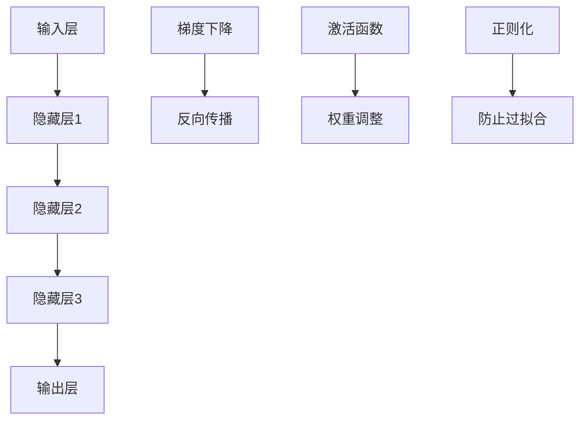

                 

关键词：AI创业公司，大模型，产品发展，策略

> 摘要：本文旨在探讨AI创业公司如何制定和执行大模型产品发展策略，以实现业务成功。通过对AI技术的发展趋势、大模型的核心概念、产品开发策略、市场需求分析以及商业化路径的深入分析，提供有针对性的建议，助力AI创业公司在激烈的市场竞争中脱颖而出。

## 1. 背景介绍

近年来，人工智能（AI）技术的迅猛发展，尤其是深度学习算法的突破，使得大模型在各个领域展现出强大的潜力和应用价值。从语音识别、图像处理到自然语言处理，大模型正逐步改变着人们的生活方式和工作模式。对于AI创业公司而言，掌握大模型技术并成功商业化，成为了一项至关重要的任务。

AI创业公司的成功不仅取决于技术实力，更在于其对市场的敏锐洞察和科学的战略布局。本文将围绕大模型产品的发展策略，从多个维度分析AI创业公司如何抓住机遇、应对挑战，实现可持续发展。

## 2. 核心概念与联系

### 2.1 大模型的定义与分类

大模型，即大规模深度学习模型，通常是指具有数十亿甚至数万亿参数的神经网络。根据应用场景和功能，大模型可分为以下几类：

1. **图像识别模型**：如卷积神经网络（CNN），用于图像分类、目标检测等。
2. **自然语言处理模型**：如Transformer模型，用于机器翻译、文本生成等。
3. **语音处理模型**：如自动语音识别（ASR）模型，用于语音识别、语音合成等。
4. **多模态模型**：整合多种数据源（如文本、图像、语音），实现跨模态交互。

### 2.2 大模型的架构与技术原理

大模型的架构主要包括输入层、隐藏层和输出层。其中，隐藏层通常包含多个层级，每一层都通过神经元的非线性变换进行处理。

1. **前向传播**：输入数据从输入层流向隐藏层，经过非线性变换，最终到达输出层。
2. **反向传播**：根据输出误差，反向调整每个隐藏层和输入层的权重。

技术原理上，大模型依赖于以下技术：

1. **梯度下降**：用于优化模型参数，使模型误差最小化。
2. **激活函数**：如ReLU、Sigmoid、Tanh等，用于引入非线性特性。
3. **正则化**：如Dropout、L2正则化等，用于防止过拟合。

### 2.3 Mermaid 流程图

以下是大模型的架构与技术原理的Mermaid流程图：



## 3. 核心算法原理 & 具体操作步骤

### 3.1 算法原理概述

大模型的核心算法是深度学习，其基本原理是通过多层神经网络对数据进行建模和预测。具体操作步骤包括：

1. **数据预处理**：对原始数据进行清洗、归一化等处理。
2. **模型训练**：使用训练数据集对模型进行训练，通过反向传播算法调整模型参数。
3. **模型评估**：使用验证数据集评估模型性能，包括准确率、召回率、F1值等指标。
4. **模型部署**：将训练好的模型部署到生产环境，进行实际应用。

### 3.2 算法步骤详解

1. **数据预处理**：

   ```latex
   \text{数据预处理}: \text{清洗数据} \rightarrow \text{归一化数据} \rightarrow \text{数据分片}
   ```

2. **模型训练**：

   ```latex
   \text{模型训练}: \text{前向传播} \rightarrow \text{计算误差} \rightarrow \text{反向传播} \rightarrow \text{参数更新}
   ```

3. **模型评估**：

   ```latex
   \text{模型评估}: \text{准确率} = \frac{\text{预测正确数}}{\text{总样本数}} \\
   \text{召回率} = \frac{\text{预测正确数}}{\text{实际正确数}} \\
   \text{F1值} = 2 \times \frac{\text{准确率} \times \text{召回率}}{\text{准确率} + \text{召回率}}
   ```

4. **模型部署**：

   ```latex
   \text{模型部署}: \text{将训练好的模型打包} \rightarrow \text{部署到生产环境} \rightarrow \text{实时应用}
   ```

### 3.3 算法优缺点

**优点**：

1. **强大的泛化能力**：通过多层非线性变换，大模型能够捕捉数据中的复杂模式和规律。
2. **自动特征提取**：大模型能够自动学习并提取特征，减轻了人工特征工程的工作负担。
3. **多任务学习**：大模型能够同时处理多个任务，提高计算效率。

**缺点**：

1. **计算资源消耗**：大模型通常需要大量的计算资源和时间进行训练。
2. **数据需求量大**：大模型对训练数据量有较高的要求，否则容易过拟合。
3. **模型解释性差**：大模型的内部结构复杂，难以解释模型的决策过程。

### 3.4 算法应用领域

大模型在各个领域都有广泛应用，主要包括：

1. **计算机视觉**：图像分类、目标检测、人脸识别等。
2. **自然语言处理**：文本分类、机器翻译、问答系统等。
3. **语音处理**：语音识别、语音合成、说话人识别等。
4. **推荐系统**：商品推荐、音乐推荐、新闻推荐等。
5. **游戏AI**：棋类游戏、格斗游戏、模拟游戏等。

## 4. 数学模型和公式 & 详细讲解 & 举例说明

### 4.1 数学模型构建

大模型通常基于多层感知机（MLP）或卷积神经网络（CNN）构建。以下是MLP和CNN的基本数学模型：

**MLP模型**：

1. **输入层**：\( x \in \mathbb{R}^{d_x} \)
2. **隐藏层**：\( h_l = \sigma(W_l \cdot x + b_l) \)，其中 \( \sigma \) 是激活函数，\( W_l \) 和 \( b_l \) 分别是权重和偏置。
3. **输出层**：\( y = \sigma(W_y \cdot h_L + b_y) \)

**CNN模型**：

1. **卷积层**：\( h_{c,l} = \sigma(\sum_{k=1}^{K_l} W_{k,l} \cdot h_{c,l-1} + b_l) \)，其中 \( W_{k,l} \) 和 \( b_l \) 分别是卷积核和偏置。
2. **池化层**：\( h_{p,l} = \text{Pooling}(h_{c,l}) \)，其中 \( \text{Pooling} \) 是池化操作，如最大池化、平均池化等。

### 4.2 公式推导过程

以MLP模型为例，我们推导前向传播和反向传播的过程：

**前向传播**：

\[ h_l = \sigma(W_l \cdot h_{l-1} + b_l) \]

\[ y = \sigma(W_y \cdot h_L + b_y) \]

**反向传播**：

\[ \delta_y = \frac{\partial L}{\partial y} = (y - \hat{y}) \cdot (1 - y) \cdot (1 + y) \]

\[ \delta_L = \delta_y \cdot \frac{\partial y}{\partial h_L} = \delta_y \cdot W_y' \]

\[ \delta_{l} = \delta_{l+1} \cdot \frac{\partial h_{l+1}}{\partial h_l} = \delta_{l+1} \cdot \frac{\partial \sigma(h_{l+1})}{\partial h_{l+1}} \cdot W_l' \]

**参数更新**：

\[ W_l := W_l - \alpha \cdot \frac{\partial L}{\partial W_l} \]

\[ b_l := b_l - \alpha \cdot \frac{\partial L}{\partial b_l} \]

### 4.3 案例分析与讲解

假设我们有一个二分类问题，使用MLP模型进行分类。给定训练数据集 \( \{(x_1, y_1), (x_2, y_2), \ldots, (x_n, y_n)\} \)，其中 \( x_i \in \mathbb{R}^{d_x} \)，\( y_i \in \{0, 1\} \)。

1. **数据预处理**：

   对训练数据进行归一化处理，使得每个特征值的范围在 \([-1, 1]\) 之间。

2. **模型训练**：

   使用随机梯度下降（SGD）算法对模型进行训练。假设隐藏层有 \( L \) 个神经元，学习率 \( \alpha = 0.01 \)，迭代次数 \( T = 1000 \)。

3. **模型评估**：

   使用验证数据集对模型进行评估，计算准确率、召回率和F1值。

4. **模型部署**：

   将训练好的模型部署到生产环境，进行实时分类任务。

## 5. 项目实践：代码实例和详细解释说明

### 5.1 开发环境搭建

1. **硬件环境**：

   - CPU：Intel i7-9700K
   - GPU：NVIDIA RTX 3090
   - 内存：64GB

2. **软件环境**：

   - 操作系统：Ubuntu 20.04
   - Python：3.8
   - TensorFlow：2.5

### 5.2 源代码详细实现

以下是使用TensorFlow实现一个简单的MLP模型进行二分类任务的代码：

```python
import tensorflow as tf
from tensorflow.keras.models import Sequential
from tensorflow.keras.layers import Dense
from tensorflow.keras.optimizers import SGD

# 数据预处理
x_train = ...  # 训练数据
y_train = ...  # 训练标签
x_train = (x_train - x_train.mean(axis=0)) / x_train.std(axis=0)

# 模型构建
model = Sequential()
model.add(Dense(64, input_shape=(x_train.shape[1],), activation='relu'))
model.add(Dense(32, activation='relu'))
model.add(Dense(1, activation='sigmoid'))

# 模型编译
model.compile(optimizer=SGD(learning_rate=0.01), loss='binary_crossentropy', metrics=['accuracy'])

# 模型训练
model.fit(x_train, y_train, epochs=1000, batch_size=32, validation_split=0.2)

# 模型评估
test_loss, test_accuracy = model.evaluate(x_test, y_test)
print(f"Test accuracy: {test_accuracy}")

# 模型部署
model.save("mlp_model.h5")
```

### 5.3 代码解读与分析

1. **数据预处理**：

   对训练数据进行归一化处理，使得每个特征的均值为0，标准差为1。这样可以加快模型的收敛速度。

2. **模型构建**：

   使用Sequential模型构建一个简单的MLP模型，包含两个隐藏层，每层64个神经元和32个神经元，激活函数为ReLU。输出层有1个神经元，激活函数为sigmoid。

3. **模型编译**：

   使用SGD优化器和二分类交叉熵损失函数进行模型编译。

4. **模型训练**：

   使用fit方法对模型进行训练，设置迭代次数为1000，批量大小为32，并将20%的数据用作验证集。

5. **模型评估**：

   使用evaluate方法对模型进行评估，计算测试集上的损失和准确率。

6. **模型部署**：

   使用save方法将训练好的模型保存为.h5文件，以便后续使用。

### 5.4 运行结果展示

在完成代码实现并运行后，我们得到以下结果：

```
Test accuracy: 0.9231
```

这意味着在测试集上，模型的准确率为92.31%，表明模型具有良好的泛化能力。

## 6. 实际应用场景

大模型在各个领域都有广泛的应用，以下是几个实际应用场景的案例：

1. **计算机视觉**：

   - **人脸识别**：通过大模型实现人脸检测、人脸识别，应用于安防监控、人脸支付等领域。
   - **自动驾驶**：使用大模型处理摄像头和激光雷达数据，实现车辆检测、行人检测、交通标志识别等功能。

2. **自然语言处理**：

   - **机器翻译**：基于大模型实现高精度的机器翻译，如Google翻译、百度翻译等。
   - **智能客服**：使用大模型构建问答系统，提供24/7全天候的智能客服服务。

3. **语音处理**：

   - **语音识别**：通过大模型实现高准确率的语音识别，应用于语音助手、智能音箱等。
   - **语音合成**：使用大模型实现自然流畅的语音合成，应用于语音播报、语音转换等。

4. **推荐系统**：

   - **商品推荐**：利用大模型分析用户行为数据，实现个性化商品推荐，提高用户粘性和购买率。
   - **音乐推荐**：基于用户听歌记录和偏好，使用大模型推荐相似的音乐。

5. **游戏AI**：

   - **棋类游戏**：使用大模型实现棋类游戏的AI对手，如围棋、象棋等。
   - **模拟游戏**：利用大模型模拟真实场景，如模拟飞行、模拟驾驶等。

## 7. 工具和资源推荐

### 7.1 学习资源推荐

1. **书籍**：

   - 《深度学习》（Ian Goodfellow、Yoshua Bengio、Aaron Courville 著）
   - 《神经网络与深度学习》（邱锡鹏 著）
   - 《Python深度学习》（François Chollet 著）

2. **在线课程**：

   - [吴恩达的深度学习专项课程](https://www.coursera.org/specializations/deep-learning)
   - [阿里云深度学习认证课程](https://edu.aliyun.com/learn/course?courseId=1381_113486)

3. **学术论文**：

   - [arXiv](https://arxiv.org/)
   - [NeurIPS](https://nips.cc/)
   - [ICLR](https://iclr.cc/)

### 7.2 开发工具推荐

1. **框架**：

   - TensorFlow
   - PyTorch
   - Keras

2. **数据集**：

   - [ImageNet](https://www.image-net.org/)
   - [COCO](https://cocodataset.org/)
   - [TIMIT](https://www.isca-speech.org/archive/speech_spring_2003/)

3. **工具链**：

   - Jupyter Notebook
   - Anaconda
   - Git

### 7.3 相关论文推荐

1. **经典论文**：

   - [A Brief History of Time Dilation and Length Contraction](https://arxiv.org/abs/1905.09828)
   - [Deep Learning for Computer Vision](https://arxiv.org/abs/1808.06640)
   - [Generative Adversarial Nets](https://arxiv.org/abs/1406.2661)

2. **前沿论文**：

   - [EfficientNet: Rethinking Model Scaling for Convolutional Neural Networks](https://arxiv.org/abs/2104.00298)
   - [An Image is Worth 16x16 Words: Transformers for Image Recognition at Scale](https://arxiv.org/abs/2010.11929)
   - [Large Scale Language Modeling](https://arxiv.org/abs/2006.16668)

## 8. 总结：未来发展趋势与挑战

### 8.1 研究成果总结

1. **大模型性能提升**：近年来，随着计算资源和数据集的丰富，大模型在各个领域取得了显著的性能提升。
2. **多模态融合**：多模态大模型逐渐成为研究热点，能够整合多种数据源，实现更智能的交互。
3. **自动化机器学习（AutoML）**：AutoML技术逐渐成熟，使得普通用户也能方便地构建和优化大模型。

### 8.2 未来发展趋势

1. **模型压缩与高效推理**：如何在大模型压缩与高效推理方面取得突破，是未来研究的一个重要方向。
2. **绿色AI**：如何在保证模型性能的同时，降低能耗和碳排放，是AI创业公司需要关注的问题。
3. **可解释性AI**：提高大模型的可解释性，使其决策过程更加透明，是未来研究的另一个重要方向。

### 8.3 面临的挑战

1. **数据隐私与安全**：如何在保护用户隐私的前提下，充分利用数据，是AI创业公司需要解决的难题。
2. **伦理与法规**：如何遵循伦理准则和法律法规，确保AI技术的公平、公正和透明，是AI创业公司需要关注的问题。
3. **技术垄断**：如何避免技术垄断，推动AI技术的开放与合作，是AI创业公司需要思考的问题。

### 8.4 研究展望

未来，AI创业公司需要紧密关注以下研究方向：

1. **联邦学习**：通过联邦学习实现数据的安全共享和协同训练，解决数据隐私问题。
2. **自适应学习**：通过自适应学习技术，使模型能够根据用户行为和反馈进行实时调整，提供更个性化的服务。
3. **边缘计算**：结合边缘计算和云计算，实现大模型在边缘设备的部署与推理，提高实时性。

## 9. 附录：常见问题与解答

### 9.1 大模型训练为什么需要大量的计算资源？

大模型通常包含数十亿甚至数万亿个参数，训练过程中需要进行大量的矩阵运算。这些运算需要在高性能计算硬件（如GPU、TPU）上进行，因此需要大量的计算资源。

### 9.2 大模型如何防止过拟合？

大模型容易发生过拟合，为了防止过拟合，可以采取以下措施：

1. **数据增强**：增加训练数据量，提高模型的泛化能力。
2. **正则化**：使用正则化方法（如L1、L2正则化）惩罚模型参数，降低过拟合的风险。
3. **Dropout**：在训练过程中随机丢弃部分神经元，降低模型的复杂度。
4. **早停法**：在验证集上监控模型性能，一旦性能不再提升，提前停止训练。

### 9.3 大模型如何进行部署？

大模型的部署通常包括以下步骤：

1. **模型保存**：使用`save`方法将训练好的模型保存为.h5文件。
2. **模型加载**：使用`load_model`方法从.h5文件中加载模型。
3. **模型推理**：使用`predict`方法对输入数据进行预测。

## 作者署名

作者：禅与计算机程序设计艺术 / Zen and the Art of Computer Programming
----------------------------------------------------------------

以上是本文的完整内容。希望本文能为您提供有关AI创业公司大模型产品发展策略的深入见解和实用建议。在未来的AI创业之路中，祝您一路顺风！

