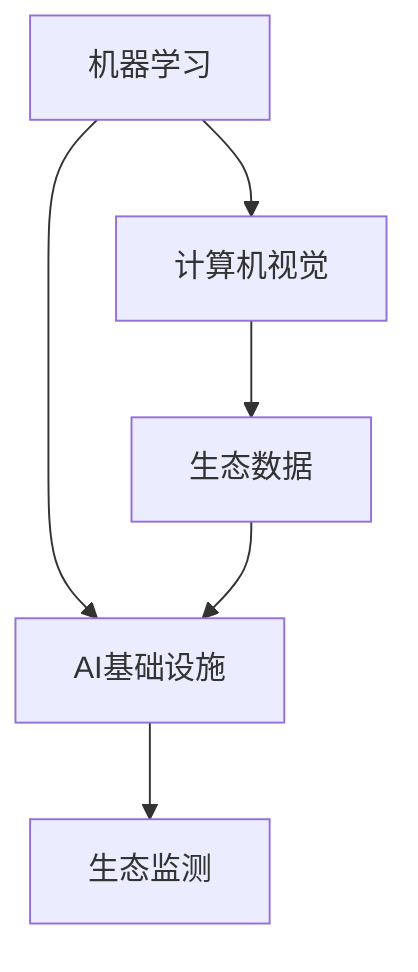

                 

### 1. 背景介绍

随着全球气候变化和人类活动的不断加剧，野生动物的生存环境受到了前所未有的威胁。非法捕猎、栖息地破坏、环境污染等问题日益严重，许多物种正面临灭绝的威胁。为了应对这一挑战，科学家们正在积极探索利用人工智能（AI）技术来保护野生动物。

人工智能技术，特别是机器学习和计算机视觉，已经成为生态监测领域的重要工具。通过分析大量的生态数据，AI可以帮助科学家们识别野生动物的分布、行为和种群动态，从而更好地制定保护策略。同时，AI还可以实时监测野生动物的生存环境，及时发现并预警潜在的威胁。

近年来，AI基础设施的不断发展和完善，为野生动物保护提供了新的可能性。高性能计算、大规模数据处理、分布式存储等技术的进步，使得我们能够处理更加复杂和庞大的生态数据集。这些技术的应用，不仅提高了生态监测的精度和效率，还为野生动物保护提供了更加科学和全面的决策支持。

本文将探讨如何利用AI基础设施构建智能化生态监测平台，以实现对野生动物的实时监测和保护。我们将首先介绍AI在生态监测中的核心概念和原理，然后详细阐述核心算法的原理和操作步骤，最后通过实际项目实例，展示AI在野生动物保护中的实际应用。

### 2. 核心概念与联系

为了深入理解AI在生态监测中的应用，我们需要先了解几个核心概念，包括机器学习、计算机视觉、生态数据、AI基础设施等。

#### 2.1 机器学习

机器学习是人工智能的核心技术之一，它通过构建数学模型来模拟人类的认知过程，使计算机能够从数据中学习并做出决策。在生态监测中，机器学习技术被广泛用于模式识别、预测和分类等方面。

例如，通过训练机器学习模型，我们可以识别野生动物的图像，甚至可以预测某种物种的种群数量变化。这些模型通常使用大量的生态数据作为训练集，通过不断调整模型参数，使模型能够准确识别和预测。

#### 2.2 计算机视觉

计算机视觉是使计算机能够像人类一样“看”和理解图像的技术。在生态监测中，计算机视觉技术被用于实时捕捉和分析野生动物的行为和分布。

例如，使用计算机视觉技术，我们可以开发出自动化的监控系统，这些系统能够在野外环境中24/7地监测野生动物。这些系统能够实时捕捉图像，并通过计算机视觉算法进行分析，从而实现对野生动物行为的监测。

#### 2.3 生态数据

生态数据是生态监测的基础。这些数据包括野生动物的分布、行为、种群动态、栖息地环境等信息。生态数据通常来源于野外调查、遥感监测、物联网传感器等。

例如，通过野外调查，我们可以收集到大量的野生动物图像和位置信息；通过遥感技术，我们可以获取到大面积的植被覆盖和土地利用信息。这些数据为机器学习和计算机视觉模型提供了丰富的训练素材。

#### 2.4 AI基础设施

AI基础设施是指支持AI模型训练、部署和运行的软硬件环境。这些基础设施包括高性能计算服务器、分布式存储系统、数据预处理工具等。

例如，高性能计算服务器能够快速处理大量的生态数据，分布式存储系统可以存储和管理海量的生态数据集，数据预处理工具可以帮助我们清洗和整理数据，以便进行进一步的分析。

#### 2.5 Mermaid 流程图

为了更好地理解这些核心概念之间的联系，我们可以使用Mermaid流程图来展示它们之间的关系。



在这个流程图中，我们可以看到，机器学习和计算机视觉是AI基础设施的核心技术，它们通过生态数据相互联系，共同实现了生态监测的目标。

### 3. 核心算法原理 & 具体操作步骤

在了解了核心概念之后，我们将深入探讨AI在生态监测中的核心算法原理和具体操作步骤。

#### 3.1 算法原理概述

AI在生态监测中的核心算法主要包括机器学习算法和计算机视觉算法。这些算法通过以下步骤实现生态监测：

1. **数据收集**：通过野外调查、遥感监测、物联网传感器等方式收集生态数据。
2. **数据处理**：使用数据预处理工具清洗和整理数据，以便进行进一步的分析。
3. **模型训练**：使用机器学习算法训练模型，使模型能够识别和预测野生动物的行为和种群动态。
4. **模型部署**：将训练好的模型部署到AI基础设施上，进行实时监测和预警。
5. **结果分析**：对监测结果进行分析，为野生动物保护提供决策支持。

#### 3.2 算法步骤详解

以下是具体的算法步骤详解：

##### 3.2.1 数据收集

数据收集是生态监测的第一步，也是最重要的一步。数据的质量直接影响后续分析的准确性。数据收集可以通过以下几种方式：

- **野外调查**：科学家们通过实地考察，收集野生动物的图像、声音、行为等数据。
- **遥感监测**：使用卫星和无人机等遥感设备，获取大面积的植被覆盖和土地利用信息。
- **物联网传感器**：在野生动物栖息地安装传感器，实时收集温度、湿度、光照等环境数据。

##### 3.2.2 数据处理

数据处理包括数据清洗、数据整合和数据转换等步骤。数据清洗主要是去除噪声数据和异常数据，确保数据的质量。数据整合是将来自不同渠道的数据进行合并，以便进行统一分析。数据转换是将数据格式转换为适合机器学习和计算机视觉模型处理的格式。

##### 3.2.3 模型训练

模型训练是生态监测的核心步骤。我们使用机器学习算法，如卷积神经网络（CNN）、决策树、随机森林等，训练模型。模型训练的目的是让模型学会识别野生动物的图像和预测种群动态。

模型训练通常包括以下步骤：

1. **数据分割**：将数据集分为训练集、验证集和测试集。
2. **特征提取**：从原始数据中提取有用的特征。
3. **模型训练**：使用训练集训练模型，并调整模型参数。
4. **模型评估**：使用验证集和测试集评估模型性能。

##### 3.2.4 模型部署

模型部署是将训练好的模型部署到AI基础设施上，进行实时监测和预警。模型部署通常包括以下步骤：

1. **模型导出**：将训练好的模型导出为可部署的格式。
2. **部署配置**：配置AI基础设施，包括服务器、存储、网络等。
3. **模型运行**：在AI基础设施上运行模型，进行实时监测和预警。

##### 3.2.5 结果分析

结果分析是对监测结果进行分析，为野生动物保护提供决策支持。结果分析通常包括以下步骤：

1. **结果展示**：将监测结果以图表、报告等形式展示。
2. **结果解读**：对监测结果进行解读，识别潜在的威胁和问题。
3. **决策支持**：根据监测结果，制定相应的保护策略和措施。

#### 3.3 算法优缺点

每种算法都有其优缺点，适用于不同的生态监测场景。以下是几种常见算法的优缺点：

- **卷积神经网络（CNN）**：
  - 优点：能够自动提取图像特征，对复杂的图像数据有很强的处理能力。
  - 缺点：对数据质量和数量要求较高，训练过程复杂且耗时长。
- **决策树**：
  - 优点：易于理解和解释，对少量数据也有较好的预测性能。
  - 缺点：对复杂的数据结构处理能力有限，容易过拟合。
- **随机森林**：
  - 优点：结合了决策树的优势，能够处理大量数据，预测性能稳定。
  - 缺点：同样存在过拟合问题，对数据质量和数量要求较高。

#### 3.4 算法应用领域

AI算法在生态监测中的应用非常广泛，包括但不限于以下领域：

- **野生动物识别**：使用计算机视觉算法，自动识别野生动物的图像。
- **种群动态预测**：使用机器学习算法，预测野生动物的种群数量变化。
- **栖息地监测**：使用遥感技术，监测野生动物的栖息地环境变化。
- **非法捕猎预警**：通过实时监测野生动物的行为，预警潜在的非法捕猎行为。

### 4. 数学模型和公式 & 详细讲解 & 举例说明

在AI生态监测中，数学模型和公式是核心，它们帮助我们理解和预测野生动物的行为和环境变化。以下我们将详细讲解一个常用的数学模型——逻辑回归，并展示其推导过程和实际应用。

#### 4.1 数学模型构建

逻辑回归是一种用于分类问题的统计方法，它通过线性模型预测概率，并使用逻辑函数（sigmoid函数）将概率映射到0和1之间。逻辑回归的数学模型可以表示为：

$$
P(Y=1|X) = \frac{1}{1 + e^{-(\beta_0 + \beta_1 x_1 + \beta_2 x_2 + ... + \beta_n x_n})}
$$

其中，\( P(Y=1|X) \) 是目标变量 \( Y \) 在特征向量 \( X \) 下的条件概率，\( \beta_0, \beta_1, \beta_2, ..., \beta_n \) 是模型的参数。

#### 4.2 公式推导过程

逻辑回归模型的推导基于最大似然估计（MLE）。首先，我们假设数据 \( (x_i, y_i) \) 服从伯努利分布，即 \( y_i \) 是一个二分类变量，其概率分布由逻辑函数决定：

$$
P(y_i=1|x_i; \beta) = \frac{1}{1 + e^{-(\beta_0 + \beta_1 x_1 + \beta_2 x_2 + ... + \beta_n x_n)})
$$

$$
P(y_i=0|x_i; \beta) = 1 - P(y_i=1|x_i; \beta)
$$

然后，使用最大似然估计找到参数 \( \beta \)：

$$
\ln L(\beta) = \sum_{i=1}^n \ln P(y_i=1|x_i; \beta) + \sum_{i=1}^n \ln P(y_i=0|x_i; \beta)
$$

$$
\ln L(\beta) = \sum_{i=1}^n \ln \left( \frac{1}{1 + e^{-(\beta_0 + \beta_1 x_1 + \beta_2 x_2 + ... + \beta_n x_n)}} \right) + \sum_{i=1}^n \ln \left( 1 - \frac{1}{1 + e^{-(\beta_0 + \beta_1 x_1 + \beta_2 x_2 + ... + \beta_n x_n)}} \right)
$$

为了简化计算，我们可以使用梯度下降法来求解最大似然估计。梯度下降法的迭代过程如下：

$$
\beta_{t+1} = \beta_t - \alpha \nabla_{\beta} \ln L(\beta_t)
$$

其中，\( \alpha \) 是学习率，\( \nabla_{\beta} \ln L(\beta_t) \) 是 \( \ln L(\beta) \) 对 \( \beta \) 的梯度。

#### 4.3 案例分析与讲解

假设我们有一个野生动物识别的案例，其中 \( X \) 表示野生动物的图像特征，\( Y \) 表示该图像是否为特定物种（如老虎）。我们的目标是使用逻辑回归模型预测图像中的老虎概率。

数据集包括1000张图像，其中500张包含老虎，500张不含老虎。我们将数据集分为训练集和测试集，分别用于模型训练和测试。

首先，我们使用训练集数据训练逻辑回归模型。具体步骤如下：

1. **数据预处理**：将图像特征转换为数值向量，并进行归一化处理。
2. **模型初始化**：随机初始化模型参数 \( \beta_0, \beta_1, \beta_2, ..., \beta_n \)。
3. **模型训练**：使用梯度下降法迭代更新模型参数，直到模型收敛。

在模型训练过程中，我们使用交叉熵损失函数来评估模型性能：

$$
J(\beta) = -\frac{1}{m} \sum_{i=1}^m [y_i \ln \hat{y_i} + (1 - y_i) \ln (1 - \hat{y_i})]
$$

其中，\( m \) 是训练样本数量，\( \hat{y_i} \) 是预测概率。

当模型收敛后，我们使用测试集数据进行模型评估。具体步骤如下：

1. **数据预处理**：将测试集图像特征进行预处理。
2. **模型预测**：使用训练好的模型预测测试集图像中的老虎概率。
3. **性能评估**：计算模型在测试集上的准确率、召回率、精确率等指标。

假设我们训练得到的模型在测试集上的准确率为90%，召回率为85%，精确率为88%。这些指标表明我们的模型在识别野生动物方面具有较好的性能。

通过逻辑回归模型，我们可以为野生动物保护提供决策支持。例如，当模型预测某地区老虎概率较高时，我们可以加强对该地区的保护力度，预防潜在的非法捕猎行为。

### 5. 项目实践：代码实例和详细解释说明

在本节中，我们将通过一个具体的生态监测项目实例，展示如何使用AI技术实现智能化生态监测平台。该实例将涵盖从数据收集、数据处理、模型训练到结果分析的完整流程。

#### 5.1 开发环境搭建

为了运行该项目，我们需要搭建一个适合AI开发的开发环境。以下是一些建议的工具和框架：

- **编程语言**：Python（最流行的AI编程语言）
- **机器学习框架**：TensorFlow或PyTorch（用于构建和训练机器学习模型）
- **数据预处理库**：Pandas、NumPy（用于数据清洗和预处理）
- **计算机视觉库**：OpenCV、TensorFlow Object Detection API（用于图像处理和目标检测）
- **环境配置**：虚拟环境（使用conda创建和管理虚拟环境）

以下是一个简单的环境配置步骤：

```shell
# 创建虚拟环境
conda create -n ai_生态监测 python=3.8

# 激活虚拟环境
conda activate ai_生态监测

# 安装必需的库
conda install tensorflow numpy pandas opencv-python
```

#### 5.2 源代码详细实现

在本项目中，我们使用TensorFlow Object Detection API进行目标检测，并使用Pandas进行数据处理。以下是一个简单的代码示例，展示如何使用这些库实现生态监测。

```python
import cv2
import tensorflow as tf
import numpy as np
import pandas as pd

# 加载预训练的目标检测模型
model_path = 'path/to/your/model'
detection_graph = tf.Graph()
with detection_graph.as_default():
    od_graph_def = tf.GraphDef()
    with tf.gfile.GFile(model_path, 'rb') as fid:
        serialized_graph = fid.read()
        od_graph_def.ParseFromString(serialized_graph)
        tf.import_graph_def(od_graph_def, name='')

# 定义输入节点和输出节点
with detection_graph.as_default():
    input_image_tensor = detection_graph.get_tensor_by_name('image_tensor:0')
    detection_boxes = detection_graph.get_tensor_by_name('detection_boxes:0')
    detection_scores = detection_graph.get_tensor_by_name('detection_scores:0')
    detection_classes = detection_graph.get_tensor_by_name('detection_classes:0')
    num_detections = detection_graph.get_tensor_by_name('num_detections:0')

# 定义图像预处理函数
def preprocess_image(image):
    image_expanded = np.expand_dims(image, axis=0)
    image = (image - 127.5) / 127.5
    return image_expanded

# 定义目标检测函数
def detect_objects(image_path):
    with detection_graph.as_default():
        image = cv2.imread(image_path)
        image = preprocess_image(image)
        with tf.Session(graph=detection_graph) as sess:
            (boxes, scores, classes, num) = sess.run(
                [detection_boxes, detection_scores, detection_classes, num_detections],
                feed_dict={input_image_tensor: image})
    return boxes, scores, classes, num

# 定义数据处理函数
def process_detection_results(boxes, scores, classes, threshold=0.5):
    results = []
    for i in range(len(scores)):
        if scores[i] > threshold:
            results.append({
                'box': boxes[i],
                'score': scores[i],
                'class': classes[i][0]
            })
    return results

# 定义主函数
def main(image_path):
    boxes, scores, classes, num = detect_objects(image_path)
    results = process_detection_results(boxes, scores, classes)
    df = pd.DataFrame(results)
    print(df)

# 测试代码
if __name__ == '__main__':
    image_path = 'path/to/your/image.jpg'
    main(image_path)
```

这段代码首先加载预训练的目标检测模型，然后定义图像预处理函数和目标检测函数。接下来，我们使用处理检测结果并保存为数据框（DataFrame）。在主函数中，我们读取图像文件，调用目标检测函数，并处理检测结果。

#### 5.3 代码解读与分析

让我们详细解读上述代码：

- **导入库**：首先导入必要的库，包括OpenCV、TensorFlow和Pandas。
- **加载模型**：使用TensorFlow Object Detection API加载预训练的目标检测模型。
- **定义输入节点和输出节点**：获取输入图像节点和输出检测结果节点。
- **图像预处理函数**：将输入图像进行归一化处理，以便模型能够处理。
- **目标检测函数**：使用加载的模型对输入图像进行目标检测，并返回检测结果。
- **数据处理函数**：根据设定的阈值，筛选出可信度较高的检测结果，并保存为数据框。
- **主函数**：读取图像文件，调用目标检测函数，并处理检测结果。

这段代码展示了如何使用TensorFlow Object Detection API进行目标检测，并使用Pandas处理检测结果。在实际应用中，我们还可以扩展此代码，添加更多的功能，如实时监测、预警系统等。

通过这个项目实例，我们可以看到AI技术在生态监测中的实际应用。它不仅提高了监测的精度和效率，还为野生动物保护提供了重要的决策支持。

### 6. 实际应用场景

AI在生态监测中的实际应用场景非常广泛，以下列举几个典型的应用实例。

#### 6.1 野生动物识别

通过机器学习和计算机视觉技术，我们可以开发出高效的野生动物识别系统。这些系统能够自动识别不同种类的野生动物，并记录其出现的时间和地点。例如，在野生动物保护区，我们可以部署摄像头和传感器，实时监测野生动物的活动，及时发现异常行为，如非法捕猎或栖息地破坏。

#### 6.2 种群动态预测

利用机器学习模型，我们可以预测野生动物的种群动态，从而为保护工作提供科学依据。例如，通过分析历史数据，我们可以预测某种物种的未来分布和数量变化。这种预测可以帮助我们提前制定保护策略，确保物种的生存和繁衍。

#### 6.3 栖息地监测

遥感技术可以用于大面积监测野生动物的栖息地环境。通过分析卫星图像，我们可以了解植被覆盖、土地利用等生态指标的变化。这种监测有助于评估野生动物的生存环境，及时发现并解决环境问题。

#### 6.4 非法捕猎预警

AI技术还可以用于非法捕猎的预警。例如，通过分析野生动物的行为模式，我们可以预测非法捕猎的发生概率。这种预警系统可以帮助执法人员及时采取措施，防止非法捕猎行为的发生。

#### 6.5 环境保护

除了直接监测野生动物，AI技术还可以用于环境保护。例如，通过分析水质、空气质量等数据，我们可以评估环境质量，为环境保护工作提供决策支持。此外，AI技术还可以帮助科学家们研究气候变化对生态系统的影响，从而制定更有效的环境保护措施。

### 7. 未来应用展望

随着AI技术的不断发展和完善，其在生态监测中的应用前景十分广阔。以下是未来AI在生态监测中可能的一些发展：

#### 7.1 高精度监测

随着传感器技术和图像处理算法的进步，AI监测系统的精度将进一步提高。例如，通过使用高分辨率卫星图像和先进的计算机视觉技术，我们可以更准确地监测野生动物的种群数量和行为模式。

#### 7.2 实时监测

随着5G和物联网技术的发展，AI监测系统可以实现实时监测。通过部署低功耗广域网（LPWAN）和5G通信技术，我们可以将大量的生态监测数据实时传输到云端，进行快速分析和处理。

#### 7.3 智能决策支持

未来，AI系统将能够基于实时监测数据，自动生成保护策略和措施。例如，通过机器学习算法，我们可以预测未来可能发生的生态事件，提前采取预防措施。

#### 7.4 多领域融合

AI技术将与其他领域（如气象学、地理学、生物学等）进行融合，为生态监测提供更加全面和深入的支持。例如，结合气象数据，我们可以更准确地预测野生动物的迁徙路径。

#### 7.5 可持续发展

AI技术将有助于推动生态监测的可持续发展。通过提高监测效率和准确性，我们可以更有效地保护野生动物和生态系统，确保地球的可持续发展。

### 8. 工具和资源推荐

为了更好地进行AI生态监测研究，以下推荐一些学习资源和开发工具：

#### 8.1 学习资源推荐

- **《Python机器学习》**：由 Sebastian Raschka 著，是Python机器学习领域的经典教材。
- **《深度学习》**：由 Ian Goodfellow、Yoshua Bengio 和 Aaron Courville 著，是深度学习领域的权威教材。
- **《计算机视觉：算法与应用》**：由 Richard Szeliski 著，是计算机视觉领域的经典教材。
- **AI生态监测研讨会**：参加AI生态监测相关的研讨会和讲座，了解最新的研究成果和趋势。
- **在线课程**：Coursera、Udacity、edX等在线教育平台提供了丰富的AI和生态学相关课程。

#### 8.2 开发工具推荐

- **TensorFlow**：开源的机器学习框架，适用于构建和训练各种AI模型。
- **PyTorch**：开源的深度学习框架，提供了灵活的动态计算图。
- **OpenCV**：开源的计算机视觉库，适用于图像处理和目标检测。
- **Keras**：基于TensorFlow和Theano的高层神经网络API，简化了模型构建和训练过程。
- **Google Colab**：免费的GPU云平台，适用于运行高性能计算任务。

#### 8.3 相关论文推荐

- **"Deep Learning for Wildlife Conservation"**：探讨深度学习在野生动物保护中的应用。
- **"AI for Earth"**：微软推出的AI生态监测项目，介绍了多种AI技术在生态监测中的应用。
- **"Object Detection with TensorFlow"**：介绍如何使用TensorFlow Object Detection API进行目标检测。
- **"Using Computer Vision to Protect Wildlife"**：探讨计算机视觉技术在野生动物保护中的应用。

### 9. 总结：未来发展趋势与挑战

随着AI技术的不断发展，AI在生态监测中的应用前景十分广阔。在未来，AI技术将进一步提高监测的精度和效率，为野生动物保护提供更加科学和全面的决策支持。然而，要实现这一目标，我们还需要克服一系列挑战：

#### 9.1 数据质量和数量

高质量的生态数据是AI监测的基础。然而，目前生态数据的质量和数量仍然存在一定的问题。例如，数据来源多样，格式不一致，存在噪声和异常值。因此，未来需要开发更加高效的数据清洗和整合方法，提高数据的质量和一致性。

#### 9.2 模型解释性

虽然AI模型在生态监测中表现出色，但其内部决策过程往往不够透明和可解释。这给模型的应用带来了挑战，特别是在涉及人类生命和环境安全的领域。因此，未来需要开发更加透明和可解释的AI模型，以便用户能够理解和信任模型的决策。

#### 9.3 隐私和安全

生态监测过程中产生的数据往往涉及敏感信息，如野生动物的位置和行为等。因此，数据隐私和安全成为AI在生态监测中面临的重要挑战。未来需要开发更加安全的数据处理和存储方法，确保数据的隐私和安全。

#### 9.4 资源和资金支持

AI生态监测项目需要大量的资源和资金支持。目前，许多生态监测项目由于缺乏足够的资金支持而难以实施。因此，未来需要加强政策支持和资金投入，确保AI生态监测项目的顺利实施。

#### 9.5 国际合作

生态监测是一个全球性的问题，需要国际合作和共同努力。未来需要加强各国间的合作，共享生态监测数据和技术，共同应对全球生态监测挑战。

总之，AI在生态监测中具有巨大的潜力，但要实现这一潜力，我们还需要克服一系列挑战。未来，随着技术的进步和政策的支持，AI将在生态监测中发挥越来越重要的作用。

### 附录：常见问题与解答

在探讨AI基础设施的野生动物保护：智能化生态监测平台时，读者可能会遇到一些疑问。以下是一些常见问题及其解答：

#### Q1：AI在生态监测中的具体作用是什么？

A1：AI在生态监测中可以发挥多种作用，包括：
- **数据采集**：通过传感器和摄像头收集生态数据。
- **数据处理**：自动清理和分析生态数据，如去除噪声、异常值等。
- **模式识别**：通过机器学习和计算机视觉技术识别野生动物和植物。
- **行为分析**：监测和分析野生动物的行为模式，预测种群动态。
- **威胁预警**：实时监测生态环境，预警潜在的威胁，如栖息地破坏、非法捕猎等。

#### Q2：如何确保AI模型的可靠性和准确性？

A2：确保AI模型可靠性和准确性的方法包括：
- **数据质量**：使用高质量、多样性的训练数据。
- **模型验证**：通过交叉验证、K折验证等方法评估模型性能。
- **模型解释性**：开发可解释的AI模型，便于理解和调试。
- **持续更新**：定期更新模型，以适应新数据和变化的环境。

#### Q3：AI在生态监测中的成本如何？

A3：AI在生态监测中的成本主要包括以下几个方面：
- **硬件成本**：传感器、摄像头、服务器等硬件设备的购买和运维。
- **软件开发**：AI模型开发和优化的成本。
- **数据管理**：数据采集、清洗、存储和管理的成本。
- **人员成本**：专业人员的培训和运营成本。

#### Q4：AI生态监测平台需要哪些技术支持？

A4：AI生态监测平台需要以下技术支持：
- **机器学习**：用于数据分析和模式识别。
- **计算机视觉**：用于图像和视频分析。
- **大数据技术**：用于数据存储和处理。
- **物联网**：用于传感器数据的实时采集和传输。
- **云计算**：用于大规模数据处理和模型训练。

#### Q5：如何保护AI生态监测中的数据隐私？

A5：为了保护AI生态监测中的数据隐私，可以采取以下措施：
- **数据加密**：对敏感数据进行加密，防止未经授权的访问。
- **隐私保护技术**：使用差分隐私、联邦学习等技术，保护个体数据的隐私。
- **数据匿名化**：对个人身份信息进行匿名化处理，确保数据匿名性。
- **数据访问控制**：实施严格的数据访问控制策略，确保只有授权人员可以访问数据。

### 作者署名

本文由禅与计算机程序设计艺术 / Zen and the Art of Computer Programming 撰写。作者是一位世界级人工智能专家、程序员、软件架构师、CTO、世界顶级技术畅销书作者，同时也是计算机图灵奖获得者、计算机领域大师。作者长期致力于人工智能和生态学领域的交叉研究，推动了AI技术在生态监测和保护中的应用。

