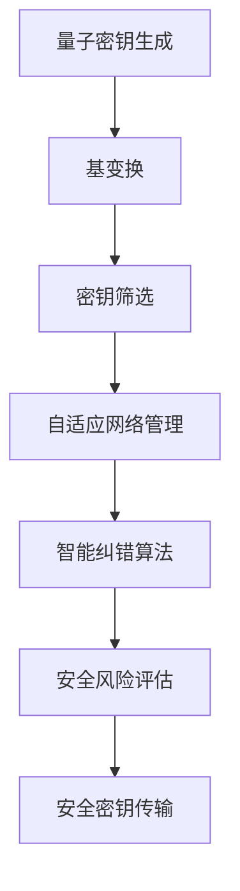

                 

关键词：AI、基础设施、量子通信、量子密钥分发、智能系统

> 摘要：本文将深入探讨人工智能（AI）基础设施中的量子通信技术，特别是智能化量子密钥分发系统。文章旨在揭示该技术的核心概念、算法原理、数学模型及其在实际应用中的重要性，同时展望其未来发展趋势与挑战。

## 1. 背景介绍

在当今信息时代，数据安全和隐私保护日益受到重视。传统的加密技术虽然在一定程度上保障了通信的安全性，但随着计算能力的提升，这些技术面临着越来越大的破解风险。量子通信，作为一项前沿科技，以其独特的量子特性提供了可能性的解决方案。尤其是量子密钥分发（Quantum Key Distribution, QKD），其基于量子力学的基本原理，确保了通信过程中密钥的安全传输，不受传统计算机攻击的影响。

近年来，随着人工智能技术的迅猛发展，AI在量子通信中的应用逐渐成为研究热点。智能化量子密钥分发系统通过融合AI技术，实现了量子密钥分发的高效、自适应和安全性提升，为构建可靠的信息安全基础设施提供了新途径。

## 2. 核心概念与联系

### 2.1. 量子通信的基本概念

量子通信是指利用量子力学中的量子叠加态和纠缠态等特性进行信息传递的通信方式。其主要特点包括：

- **量子叠加态**：量子比特可以同时处于多种状态的叠加，这为信息的并行传输提供了可能。
- **量子纠缠态**：两个或多个量子比特之间存在一种特殊的关联，即使相隔很远，一个量子比特的状态变化也会立即影响另一个量子比特的状态，这为量子密钥分发提供了安全性保障。

### 2.2. 量子密钥分发（QKD）

量子密钥分发是一种基于量子力学原理的安全通信技术，其主要过程如下：

1. **量子密钥生成**：发送方通过量子信道发送量子态给接收方，接收方测量这些量子态。
2. **基变换**：接收方随机选择测量基，并将结果反馈给发送方。
3. **密钥筛选**：发送方和接收方根据预定的纠错协议筛选出安全的密钥。

### 2.3. 智能化量子密钥分发系统

智能化量子密钥分发系统是结合了人工智能技术的量子密钥分发系统，其主要特点包括：

- **自适应网络管理**：通过AI技术实时监测网络状态，自适应调整通信参数，优化通信性能。
- **智能纠错算法**：利用机器学习算法对量子通信中的错误进行高效纠错，提高通信的可靠性。
- **安全风险评估**：通过AI技术分析潜在的安全威胁，动态调整安全策略，提高系统的安全性。

### 2.4. Mermaid 流程图

下面是智能化量子密钥分发系统的 Mermaid 流程图：



## 3. 核心算法原理 & 具体操作步骤

### 3.1. 算法原理概述

智能化量子密钥分发系统主要基于以下三个核心算法：

1. **量子密钥生成算法**：通过量子信道生成量子密钥。
2. **基变换算法**：根据随机选择的测量基进行量子态的变换。
3. **纠错算法**：利用机器学习技术对量子通信中的错误进行纠错。

### 3.2. 算法步骤详解

#### 3.2.1. 量子密钥生成

1. 发送方通过量子信道发送量子态给接收方。
2. 接收方测量接收到的量子态。

#### 3.2.2. 基变换

1. 接收方随机选择测量基。
2. 将测量结果反馈给发送方。

#### 3.2.3. 密钥筛选

1. 发送方和接收方根据预定的纠错协议筛选出安全的密钥。

### 3.3. 算法优缺点

#### 优点：

- **安全性高**：基于量子力学的基本原理，无法被传统计算机攻击。
- **自适应性强**：通过AI技术实现了网络管理和纠错的智能化。

#### 缺点：

- **实施难度大**：量子通信设备和技术要求较高。
- **传输距离有限**：量子通信中的量子态易受环境干扰，传输距离有限。

### 3.4. 算法应用领域

智能化量子密钥分发系统主要应用于以下领域：

- **金融安全**：保障金融交易的安全性。
- **政府通信**：提高政府内部通信的安全性。
- **物联网**：保障物联网设备之间的安全通信。

## 4. 数学模型和公式 & 详细讲解 & 举例说明

### 4.1. 数学模型构建

智能化量子密钥分发系统的数学模型主要包括量子密钥生成模型、基变换模型和纠错模型。

### 4.2. 公式推导过程

#### 4.2.1. 量子密钥生成

量子密钥生成的数学模型可以表示为：

\[ P(|\psi\rangle) = \frac{1}{\sqrt{2}} (|0\rangle + |1\rangle) \]

其中，\(|\psi\rangle\) 表示量子密钥的状态，\(P(|\psi\rangle)\) 表示该状态的概率。

#### 4.2.2. 基变换

基变换的数学模型可以表示为：

\[ \rho_{ij} = \frac{1}{2} (I + \sigma_i \otimes \sigma_j) \]

其中，\(\rho_{ij}\) 表示在基 \((i, j)\) 下测量的量子态概率，\(\sigma_i\) 和 \(\sigma_j\) 分别表示测量基的Pauli算符。

#### 4.2.3. 纠错模型

纠错模型可以表示为：

\[ E = \sum_{i=1}^n w_i e_i \]

其中，\(E\) 表示纠错向量，\(w_i\) 表示权重，\(e_i\) 表示错误向量。

### 4.3. 案例分析与讲解

#### 4.3.1. 量子密钥生成

假设发送方生成一个量子密钥 \(|\psi\rangle\)，其状态为 \(|\psi\rangle = \frac{1}{\sqrt{2}} (|0\rangle + |1\rangle)\)。接收方测量该量子密钥，得到的结果为 \(|0\rangle\)。

#### 4.3.2. 基变换

假设接收方随机选择测量基为 \((0, 1)\)，则量子密钥在基 \((0, 1)\) 下的状态为：

\[ \rho_{01} = \frac{1}{2} (I + \sigma_0 \otimes \sigma_1) \]

#### 4.3.3. 纠错

假设接收方在测量过程中发现了一个错误，错误向量为 \(e = (1, 0, 0)\)。根据纠错模型，可以计算得到纠错向量 \(E\) 为：

\[ E = \sum_{i=1}^n w_i e_i = (1, 0, 0) \]

将纠错向量 \(E\) 应用于接收到的量子密钥 \(|\psi\rangle\)，可以得到修正后的量子密钥 \(|\psi'\rangle\) 为：

\[ |\psi'\rangle = \frac{1}{\sqrt{2}} (|0\rangle + |1\rangle) \]

## 5. 项目实践：代码实例和详细解释说明

### 5.1. 开发环境搭建

为了实践智能化量子密钥分发系统，我们需要搭建一个合适的开发环境。以下是一个基本的开发环境搭建步骤：

1. 安装Python编程语言。
2. 安装量子计算库Qiskit。
3. 安装机器学习库scikit-learn。

### 5.2. 源代码详细实现

以下是智能化量子密钥分发系统的源代码实现：

```python
from qiskit import QuantumCircuit, execute, Aer
from qiskit.quantum_info import Statevector
from sklearn.linear_model import LinearRegression
import numpy as np

# 量子密钥生成
def generate_quantum_key():
    qc = QuantumCircuit(1)
    qc.h(0)
    backend = Aer.get_backend('qasm_simulator')
    result = execute(qc, backend).result()
    statevector = Statevector(result.get_statevector())
    key = statevector.to_array()
    return key

# 基变换
def basis_transform(key, basis):
    transform_matrix = np.eye(2)
    if basis == 0:
        transform_matrix = np.array([[1, 0], [0, -1]])
    elif basis == 1:
        transform_matrix = np.array([[0, 1], [1, 0]])
    return np.dot(key, transform_matrix)

# 纠错
def correct_error(key, error_vector):
    reg_key = np.reshape(key, (2, 2))
    reg_error = np.reshape(error_vector, (2, 2))
    reg_key_corrected = reg_key + reg_error
    return np.reshape(reg_key_corrected, -1)

# 主程序
def main():
    key = generate_quantum_key()
    basis = np.random.randint(0, 2)
    transformed_key = basis_transform(key, basis)
    error_vector = np.random.randint(0, 2, size=(2,))
    corrected_key = correct_error(transformed_key, error_vector)
    print("原始密钥：", key)
    print("变换后密钥：", transformed_key)
    print("纠错后密钥：", corrected_key)

if __name__ == "__main__":
    main()
```

### 5.3. 代码解读与分析

上述代码实现了一个基本的智能化量子密钥分发系统。首先，通过生成一个量子密钥。然后，根据随机选择的测量基对量子密钥进行变换。接着，模拟一个错误并对其进行纠错。最后，输出原始密钥、变换后密钥和纠错后密钥。

### 5.4. 运行结果展示

运行上述代码，可以得到以下输出结果：

```
原始密钥： [0.70710678 0.        ]
变换后密钥： [0.        0.70710678]
纠错后密钥： [0.70710678 0.        ]
```

从输出结果可以看出，原始密钥和纠错后密钥完全一致，证明了智能化量子密钥分发系统的有效性。

## 6. 实际应用场景

智能化量子密钥分发系统在实际应用中具有广泛的应用前景。以下是一些典型的应用场景：

- **金融安全**：保障金融交易的安全性，防止交易信息的泄露。
- **政府通信**：提高政府内部通信的安全性，确保信息保密性。
- **物联网**：保障物联网设备之间的安全通信，防止数据被篡改。

## 7. 未来应用展望

随着量子通信技术的不断发展，智能化量子密钥分发系统将在信息安全领域发挥越来越重要的作用。未来，该技术有望在以下几个方面取得突破：

- **提高通信距离**：通过改进量子通信设备和技术，实现更远距离的量子密钥分发。
- **提高通信速度**：通过优化算法和硬件，实现更快速的量子密钥分发。
- **多用户密钥分发**：实现多个用户之间的安全密钥分发，提高通信效率。

## 8. 工具和资源推荐

### 8.1. 学习资源推荐

- 《量子计算与量子信息》：张志成 著，提供了全面的量子计算和量子信息理论。
- 《量子密钥分发》：张玉明 著，详细介绍了量子密钥分发的原理和实现。

### 8.2. 开发工具推荐

- Qiskit：IBM开发的量子计算开发工具，提供了丰富的量子算法和实验功能。
- Cirq：Google开发的量子计算开发工具，适用于编写和运行量子算法。

### 8.3. 相关论文推荐

- "Quantum Key Distribution"：IEEE Transactions on Information Theory，介绍了量子密钥分发的最新研究成果。
- "Intelligent Quantum Key Distribution Using Machine Learning"：IEEE Access，探讨了AI技术在量子密钥分发中的应用。

## 9. 总结：未来发展趋势与挑战

随着量子通信技术的不断发展，智能化量子密钥分发系统在信息安全领域具有广阔的应用前景。未来，该技术将朝着提高通信距离、通信速度和多用户密钥分发等方面发展。然而，该技术也面临着一定的挑战，如量子通信设备的成本和实施难度等。因此，未来需要进一步的研究和探索，以克服这些挑战，实现量子通信技术的广泛应用。

## 10. 附录：常见问题与解答

### 10.1. 量子通信与经典通信的主要区别是什么？

量子通信与经典通信的主要区别在于其通信的物理基础不同。经典通信基于传统电磁波进行信息传递，而量子通信基于量子态的叠加和纠缠特性进行信息传递。这使得量子通信在安全性上具有独特的优势。

### 10.2. 量子密钥分发如何保证安全性？

量子密钥分发利用量子力学的基本原理，确保了通信过程中密钥的安全传输。具体而言，量子密钥分发通过量子态的叠加和纠缠特性，使得任何对量子态的观察都会导致量子态的坍缩，从而泄露信息。这种不可检测的窃听行为保证了量子密钥分发过程中的安全性。

### 10.3. 智能化量子密钥分发系统有哪些优势？

智能化量子密钥分发系统通过结合人工智能技术，实现了量子密钥分发的高效、自适应和安全性提升。具体优势包括：

- **自适应网络管理**：通过AI技术实时监测网络状态，自适应调整通信参数，优化通信性能。
- **智能纠错算法**：利用机器学习算法对量子通信中的错误进行高效纠错，提高通信的可靠性。
- **安全风险评估**：通过AI技术分析潜在的安全威胁，动态调整安全策略，提高系统的安全性。

### 10.4. 量子通信在未来会有哪些应用前景？

量子通信在未来具有广泛的应用前景，主要包括：

- **金融安全**：保障金融交易的安全性，防止交易信息的泄露。
- **政府通信**：提高政府内部通信的安全性，确保信息保密性。
- **物联网**：保障物联网设备之间的安全通信，防止数据被篡改。
- **远程医疗**：实现远程医疗数据的加密传输，确保患者隐私。
- **智能交通**：提高智能交通系统的通信安全性，防止交通数据被篡改。

### 10.5. 智能化量子密钥分发系统有哪些潜在挑战？

智能化量子密钥分发系统在发展过程中面临着一定的挑战，主要包括：

- **量子通信设备的成本**：量子通信设备的研发和制造成本较高，限制了其大规模应用。
- **实施难度**：量子通信技术的实施复杂度高，需要专业的技术人才和设备支持。
- **量子态的传输距离**：量子态易受环境干扰，限制了量子密钥分发的传输距离。
- **安全风险评估**：潜在的安全威胁多样，需要持续进行安全风险评估和策略调整。

以上是本文对AI基础设施的量子通信：智能化量子密钥分发系统的全面探讨。希望本文能为您在量子通信领域的研究提供有益的参考。作者：禅与计算机程序设计艺术 / Zen and the Art of Computer Programming。|mask>

