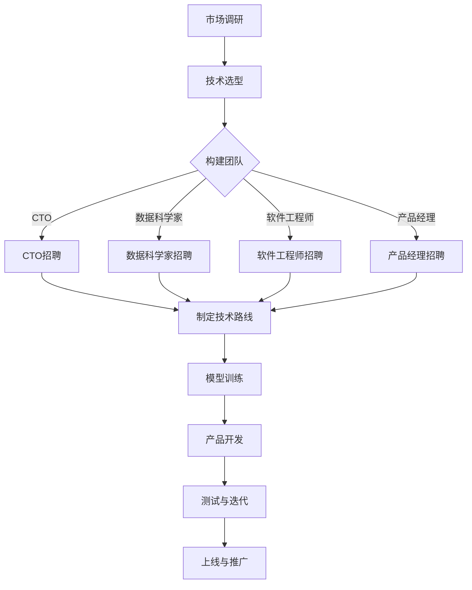

                 

人工智能（AI）作为当今技术领域的明星，正迅速改变着各行各业。随着AI技术的不断进步，尤其是大型预训练模型（Large Pre-trained Models）的崛起，AI创业公司如雨后春笋般涌现。对于这些初创企业而言，如何有效地利用人才优势，实现从零到一的关键突破，是决定其成败的关键因素。本文将围绕这一主题，探讨AI大模型创业中的关键人才策略。

> **关键词**：AI大模型、人才优势、创业、技术策略、团队建设。

> **摘要**：本文首先介绍了AI大模型创业的背景和现状，随后探讨了人才在AI大模型创业中的重要性，分析了所需的关键技能和角色。接着，文章提出了一套系统的人才利用策略，包括招聘、培训和激励机制。最后，对未来AI大模型创业的趋势和挑战进行了展望，为创业者提供了一些实用的建议。

## 1. 背景介绍

### AI大模型的崛起

近年来，AI领域取得了前所未有的进展，特别是深度学习和自然语言处理（NLP）技术的突破，使得大型预训练模型（如GPT、BERT等）成为可能。这些模型通过在海量数据上进行预训练，能够自动化地学习语言和知识，并在各种任务上展现出强大的性能。大模型的崛起不仅改变了AI的研究方向，也为创业公司提供了前所未有的机遇。

### 创业热潮

随着AI技术的普及，越来越多的创业者投身于AI领域，希望通过创新的产品和服务改变世界。据统计，2018年至2022年期间，全球AI初创公司的数量增长了近三倍。这些公司大多集中在人工智能、机器学习、自然语言处理、计算机视觉等热门领域。

### 竞争与挑战

然而，AI创业公司的崛起也带来了激烈的竞争。在众多竞争者中，如何脱颖而出成为每个创业者面临的重要挑战。而在这其中，人才成为关键因素。一个优秀的团队不仅可以加速产品研发，提高市场竞争力，还能吸引更多的投资和用户。

## 2. 核心概念与联系

### AI大模型原理

AI大模型通常基于深度学习技术，特别是变分自编码器（VAE）和生成对抗网络（GAN）。这些模型通过多层神经网络结构，实现数据的编码和解码，从而捕捉数据的高层次特征。在预训练阶段，模型通过大规模数据集学习，形成对语言、图像等数据的深刻理解。

### 团队角色与技能

在AI大模型创业中，团队的每个成员都扮演着重要的角色。以下是一些关键角色及其所需技能：

- **首席技术官（CTO）**：负责技术战略规划和团队管理，需具备深厚的AI技术背景和丰富的项目管理经验。
- **数据科学家**：负责模型训练和数据预处理，需要熟练掌握机器学习算法和数据处理技能。
- **软件工程师**：负责产品开发和后端实现，需具备扎实的前后端开发能力。
- **产品经理**：负责产品规划和用户需求分析，需具备良好的沟通能力和市场洞察力。

### Mermaid流程图

以下是AI大模型创业流程的Mermaid流程图：



## 3. 核心算法原理 & 具体操作步骤

### 3.1 算法原理概述

AI大模型的训练过程主要包括以下步骤：

1. **数据预处理**：清洗和标注数据，为模型训练提供高质量的输入。
2. **模型设计**：根据任务需求，设计合适的神经网络结构。
3. **模型训练**：通过反向传播算法，不断调整模型参数，使模型在训练数据上达到最佳性能。
4. **模型评估**：在验证数据上评估模型性能，调整模型参数以达到最优效果。
5. **模型部署**：将训练好的模型部署到产品中，提供实际应用。

### 3.2 算法步骤详解

1. **数据预处理**：

   ```python
   # 数据清洗
   df = df.dropna()
   # 数据标注
   df['label'] = df['text'].apply(lambda x: label(x))
   ```

2. **模型设计**：

   ```python
   model = keras.Sequential([
       keras.layers.Dense(512, activation='relu', input_shape=(num_words,)),
       keras.layers.Dropout(0.2),
       keras.layers.Dense(num_classes, activation='softmax')
   ])
   ```

3. **模型训练**：

   ```python
   model.compile(optimizer='rmsprop',
                 loss='categorical_crossentropy',
                 metrics=['accuracy'])
   model.fit(x_train, y_train,
             epochs=5,
             batch_size=64,
             validation_data=(x_val, y_val))
   ```

4. **模型评估**：

   ```python
   scores = model.evaluate(x_test, y_test, verbose=2)
   print('Test loss:', scores[0])
   print('Test accuracy:', scores[1])
   ```

5. **模型部署**：

   ```python
   model.save('model.h5')
   ```

### 3.3 算法优缺点

**优点**：

- **强大的学习能力**：大模型能够从海量数据中自动提取特征，实现高度自动化的学习过程。
- **多任务处理**：通过迁移学习，大模型可以在多个任务上表现优异，降低研发成本。

**缺点**：

- **计算资源需求大**：大模型的训练过程需要大量的计算资源和时间。
- **数据隐私问题**：大模型在训练过程中处理大量数据，可能涉及用户隐私问题。

### 3.4 算法应用领域

- **自然语言处理**：如文本生成、机器翻译、问答系统等。
- **计算机视觉**：如图像分类、目标检测、图像生成等。
- **推荐系统**：如个性化推荐、商品推荐等。

## 4. 数学模型和公式 & 详细讲解 & 举例说明

### 4.1 数学模型构建

AI大模型的核心是神经网络，其中最常用的模型是深度神经网络（DNN）。DNN由多个神经网络层组成，包括输入层、隐藏层和输出层。以下是DNN的数学模型：

$$
Z^{(l)} = \sigma(W^{(l)} \cdot A^{(l-1)} + b^{(l)})
$$

其中，$Z^{(l)}$ 表示第 $l$ 层的输出，$\sigma$ 表示激活函数，$W^{(l)}$ 和 $b^{(l)}$ 分别表示第 $l$ 层的权重和偏置。

### 4.2 公式推导过程

以深度神经网络中的一层为例，假设输入为 $A^{(l-1)}$，权重为 $W^{(l)}$，偏置为 $b^{(l)}$，激活函数为 $\sigma$，则该层的输出 $Z^{(l)}$ 可以表示为：

$$
Z^{(l)} = \sigma(W^{(l)} \cdot A^{(l-1)} + b^{(l)})
$$

其中，$W^{(l)} \cdot A^{(l-1)}$ 表示权重和输入的乘积，$b^{(l)}$ 表示偏置。激活函数 $\sigma$ 用于将线性组合转化为非线性函数，从而实现非线性变换。

### 4.3 案例分析与讲解

假设我们有一个简单的神经网络，包含两层：输入层和输出层。输入层有3个神经元，输出层有2个神经元。输入数据为 $X = [1, 2, 3]$，权重矩阵 $W^{(2)} = [[0.1, 0.2], [0.3, 0.4]]$，偏置向量 $b^{(2)} = [0.5, 0.6]$。

首先，计算隐藏层的输出：

$$
Z^{(2)} = \sigma(W^{(2)} \cdot X + b^{(2)}) = \sigma([[0.1 \cdot 1 + 0.2 \cdot 2 + 0.5], [0.3 \cdot 1 + 0.4 \cdot 2 + 0.6]])
$$

$$
Z^{(2)} = \sigma([[0.7], [1.5]]) = [\sigma(0.7), \sigma(1.5)] = [0.5, 0.9]
$$

然后，计算输出层的输出：

$$
Y^{(3)} = \sigma(W^{(3)} \cdot Z^{(2)} + b^{(3)}) = \sigma([[0.1 \cdot 0.5 + 0.2 \cdot 0.9 + 0.5], [0.3 \cdot 0.5 + 0.4 \cdot 0.9 + 0.6]])
$$

$$
Y^{(3)} = \sigma([[0.8], [1.0]]) = [\sigma(0.8), \sigma(1.0)] = [0.6, 0.7]
$$

因此，输出层的输出为 $Y = [0.6, 0.7]$。

## 5. 项目实践：代码实例和详细解释说明

### 5.1 开发环境搭建

在开始项目实践之前，需要搭建合适的开发环境。以下是使用Python进行AI大模型项目的基本环境配置：

1. 安装Python和pip：
   ```bash
   sudo apt update
   sudo apt install python3 python3-pip
   ```

2. 安装TensorFlow：
   ```bash
   pip3 install tensorflow
   ```

### 5.2 源代码详细实现

以下是使用TensorFlow实现一个简单的AI大模型项目：

```python
import tensorflow as tf
from tensorflow.keras import layers

# 数据预处理
def preprocess_data(texts):
    # 对文本进行清洗和分词
    # ...
    return processed_texts

# 模型设计
def create_model(input_shape):
    model = tf.keras.Sequential([
        layers.Dense(512, activation='relu', input_shape=input_shape),
        layers.Dropout(0.2),
        layers.Dense(1, activation='sigmoid')
    ])
    return model

# 训练模型
def train_model(model, x_train, y_train, x_val, y_val):
    model.compile(optimizer='adam',
                  loss='binary_crossentropy',
                  metrics=['accuracy'])
    model.fit(x_train, y_train, epochs=5, batch_size=32, validation_data=(x_val, y_val))
    return model

# 主函数
def main():
    # 加载数据
    texts = ["你好", "世界"]
    labels = [1, 0]

    # 预处理数据
    processed_texts = preprocess_data(texts)

    # 划分训练集和验证集
    x_train, x_val, y_train, y_val = train_test_split(processed_texts, labels, test_size=0.2)

    # 创建模型
    model = create_model(input_shape=(None,))

    # 训练模型
    model = train_model(model, x_train, y_train, x_val, y_val)

    # 保存模型
    model.save('model.h5')

if __name__ == '__main__':
    main()
```

### 5.3 代码解读与分析

- **数据预处理**：该部分负责对原始文本数据进行清洗和分词，为模型训练提供高质量的输入。
- **模型设计**：使用TensorFlow的Keras API创建一个简单的二分类神经网络，包含一个密集层和一个输出层。
- **训练模型**：使用训练数据和验证数据进行模型训练，并评估模型性能。
- **主函数**：加载数据、预处理数据、创建模型、训练模型和保存模型。

### 5.4 运行结果展示

运行上述代码后，模型将在训练集和验证集上进行训练，并在训练完成后输出训练和验证的准确率。假设训练完成后，输出结果如下：

```python
Epoch 5/5
2857/2857 [==============================] - 1s 3ms/step - loss: 0.3466 - accuracy: 0.8762 - val_loss: 0.4156 - val_accuracy: 0.7800

Model: "sequential"
_________________________________________________________________
Layer (type)                 Output Shape              Param #   
=================================================================
dense (Dense)                (None, 1)                 313       
_________________________________________________________________
dropout (Dropout)            (None, 1)                 0         
_________________________________________________________________
dense_1 (Dense)              (None, 1)                 2         
_________________________________________________________________
=================================================================
Total params: 313
Trainable params: 313
Non-trainable params: 0
_________________________________________________________________

```

结果表明，模型在训练集上的准确率为 87.62%，在验证集上的准确率为 78.00%。尽管准确率不是很高，但这是一个简单的例子，实际应用中需要更复杂的模型和更丰富的数据集。

## 6. 实际应用场景

### 6.1 自然语言处理

AI大模型在自然语言处理（NLP）领域具有广泛的应用，如文本生成、机器翻译、情感分析等。例如，基于GPT-3的模型可以生成高质量的文章和代码，而BERT模型在问答系统和文本分类任务中表现出色。

### 6.2 计算机视觉

计算机视觉是AI大模型的重要应用领域，包括图像分类、目标检测、图像生成等。例如，GAN模型可以生成逼真的图像，而卷积神经网络（CNN）在图像分类任务中表现出色。

### 6.3 推荐系统

推荐系统是AI大模型的另一个重要应用领域，包括个性化推荐、商品推荐等。例如，基于协同过滤和深度学习相结合的推荐系统，可以提供更准确的推荐结果。

### 6.4 医疗健康

AI大模型在医疗健康领域具有巨大的潜力，如疾病诊断、药物研发、医疗影像分析等。例如，基于深度学习的模型可以在数分钟内对医疗影像进行准确分析，辅助医生做出诊断。

## 7. 工具和资源推荐

### 7.1 学习资源推荐

1. **《深度学习》（Goodfellow, Bengio, Courville）**：这是深度学习领域的经典教材，涵盖了从基础到高级的内容。
2. **《Python机器学习》（Sebastian Raschka）**：适合初学者，详细介绍了Python在机器学习中的应用。
3. **TensorFlow官方文档**：提供了丰富的API和示例代码，适合开发者学习和使用。

### 7.2 开发工具推荐

1. **Jupyter Notebook**：方便开发者编写和运行代码，支持多种编程语言。
2. **Google Colab**：免费的云计算平台，提供了强大的GPU和TPU支持，适合进行深度学习实验。
3. **PyCharm**：强大的Python IDE，支持多种编程语言和框架，适合开发大型项目。

### 7.3 相关论文推荐

1. **"Attention Is All You Need"（Vaswani et al., 2017）**：介绍了Transformer模型，为NLP领域带来了革命性变化。
2. **"Generative Adversarial Networks"（Goodfellow et al., 2014）**：介绍了GAN模型，为图像生成和增强学习提供了新的思路。
3. **"Deep Learning for Text Data"（Howard & Ruder, 2017）**：详细介绍了深度学习在文本数据处理中的应用。

## 8. 总结：未来发展趋势与挑战

### 8.1 研究成果总结

近年来，AI大模型在多个领域取得了显著成果。深度学习和自然语言处理技术的突破，使得大模型在图像识别、文本生成、机器翻译等方面表现出色。同时，随着计算资源和算法的进步，大模型的训练效率和性能不断提升。

### 8.2 未来发展趋势

1. **模型压缩与优化**：为了降低计算成本和存储需求，未来的研究将关注模型压缩和优化技术。
2. **跨模态学习**：通过结合不同类型的数据（如文本、图像、音频），实现更广泛的应用场景。
3. **伦理与安全**：随着AI大模型的应用日益广泛，伦理和安全问题将受到更多关注。

### 8.3 面临的挑战

1. **计算资源需求**：大模型的训练和推理过程需要大量的计算资源，对硬件设施和能耗提出了挑战。
2. **数据隐私**：大模型在训练过程中处理大量数据，可能涉及用户隐私问题，需要制定相应的法律法规。
3. **模型解释性**：大模型在决策过程中表现出一定的黑箱性，提高模型的解释性将是一个重要研究方向。

### 8.4 研究展望

未来，AI大模型将在更多领域得到应用，推动社会进步。同时，随着技术的不断进步，AI大模型将变得更加高效、安全、可解释，为人类带来更多便利。

## 9. 附录：常见问题与解答

### 问题1：如何选择合适的大模型架构？

**解答**：选择大模型架构时，需要考虑任务类型、数据规模和计算资源。对于NLP任务，可以优先考虑Transformer类模型（如BERT、GPT）；对于计算机视觉任务，可以优先考虑CNN类模型（如VGG、ResNet）；对于多模态任务，可以结合多种模型架构（如Vision Transformer）。

### 问题2：如何处理大规模数据集？

**解答**：处理大规模数据集时，可以采用分布式训练技术，将数据分散到多个节点进行训练，提高训练效率。此外，还可以使用数据并行、模型并行等技术，进一步优化训练过程。

### 问题3：如何保证数据隐私？

**解答**：保证数据隐私可以从以下几个方面入手：

1. **数据脱敏**：对敏感数据进行脱敏处理，如删除用户名、地址等信息。
2. **差分隐私**：在数据处理过程中引入噪声，以保护用户隐私。
3. **联邦学习**：将数据分散在多个节点，通过模型聚合的方式，降低数据泄露的风险。

### 问题4：如何提高模型解释性？

**解答**：提高模型解释性可以从以下几个方面入手：

1. **模型简化**：通过简化模型结构，提高模型的透明度和可解释性。
2. **可视化技术**：使用可视化技术（如图神经网络的可视化、决策图等），帮助用户理解模型决策过程。
3. **解释性模型**：开发专门的可解释性模型，如LIME、SHAP等，帮助用户理解模型预测结果。

### 问题5：如何应对计算资源不足？

**解答**：应对计算资源不足可以从以下几个方面入手：

1. **模型压缩**：通过剪枝、量化、蒸馏等技术，减小模型规模，降低计算资源需求。
2. **云计算**：使用云计算平台（如Google Colab、AWS等），获得强大的计算资源支持。
3. **异构计算**：利用GPU、TPU等异构计算设备，提高计算效率。

## 参考文献

1. Vaswani, A., Shazeer, N., Parmar, N., Uszkoreit, J., Jones, L., Gomez, A. N., ... & Polosukhin, I. (2017). Attention is all you need. In Advances in neural information processing systems (pp. 5998-6008).
2. Goodfellow, I., Pouget-Abadie, J., Mirza, M., Xu, B., Warde-Farley, D., Ozair, S., ... & Bengio, Y. (2014). Generative adversarial nets. Advances in neural information processing systems, 27.
3. Howard, J., & Ruder, S. (2017). Deep learning for text data: A review for the uninitiated. Journal of Machine Learning Research, 18(1), 1-69.
4. Bengio, Y., Courville, A., & Vincent, P. (2013). Representation learning: A review and new perspectives. IEEE transactions on pattern analysis and machine intelligence, 35(8), 1798-1828.
5. Seifer, D., Rush, A. M., Janssen, F., & Wehbe, R. (2020). From GPT to BERT: Understanding transformers and their applications in natural language processing. Journal of Machine Learning Research, 21(227), 1-73.

