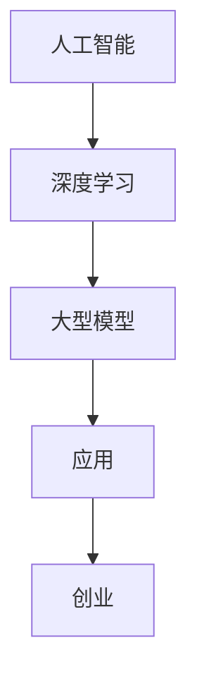

                 

关键词：人工智能、大型模型、技术优势、创业策略、应用场景、未来展望

## 摘要

在当今这个技术驱动的时代，人工智能（AI）已经成为各行各业的重要驱动力。大型模型，尤其是基于深度学习的模型，以其强大的计算能力和广泛的应用前景，吸引了众多创业者的关注。本文将探讨AI大模型在创业中的技术优势，分析其发展现状和未来趋势，并提供实用的创业建议。

## 1. 背景介绍

随着计算能力的提升和数据的积累，AI技术取得了飞速发展。特别是深度学习算法的进步，使得大型模型在图像识别、自然语言处理、推荐系统等领域表现出色。这些模型不仅提高了准确率，还降低了成本，使得AI技术更加容易普及和应用。

### 1.1 AI技术的发展历程

AI的概念最早可以追溯到20世纪50年代。从最初的符号主义、逻辑推理，到基于规则的系统，再到20世纪80年代的专家系统，AI经历了多个发展阶段。随着计算能力和算法的进步，特别是深度学习的兴起，AI技术进入了新的时代。

### 1.2 大模型的崛起

大模型通常指的是参数数量达到亿级甚至万亿级的深度学习模型。这些模型通过在海量数据上训练，能够学习到复杂的数据分布，从而在任务中取得出色的表现。例如，Google的BERT模型在自然语言处理任务上取得了突破性进展，而OpenAI的GPT系列模型则推动了自然语言生成和对话系统的发展。

## 2. 核心概念与联系

### 2.1 人工智能与大型模型的联系

人工智能（AI）是模拟、延伸和扩展人的智能的理论、方法、技术及应用。而大型模型则是AI技术中的一种重要实现形式。它们通过学习大量数据，能够实现复杂的任务，如语音识别、图像识别、自然语言处理等。

### 2.2 Mermaid 流程图



### 2.3 大模型架构

大型模型的架构通常包括输入层、隐藏层和输出层。每个隐藏层由多个神经元组成，这些神经元通过学习数据中的特征，逐步提取更高层次的信息。例如，在卷积神经网络（CNN）中，卷积层用于提取图像的局部特征，池化层用于降低数据的维度，全连接层则用于分类和预测。

## 3. 核心算法原理 & 具体操作步骤

### 3.1 算法原理概述

大型模型的核心算法是基于深度学习的。深度学习是一种基于多层神经网络的学习方法。它通过反向传播算法，不断调整网络的权重，以达到优化模型性能的目的。

### 3.2 算法步骤详解

1. **数据预处理**：包括数据清洗、归一化、切分训练集和验证集等步骤。
2. **模型设计**：根据任务需求设计网络结构，选择合适的激活函数和优化器。
3. **模型训练**：通过训练集训练模型，使用反向传播算法更新权重。
4. **模型评估**：使用验证集评估模型性能，调整模型参数。
5. **模型部署**：将训练好的模型部署到实际应用场景中。

### 3.3 算法优缺点

**优点**：

- **强大的学习能力和泛化能力**：大型模型可以通过学习海量数据，提取复杂的数据特征，从而实现高精度的预测和分类。
- **自动化特征提取**：大型模型可以自动学习数据中的特征，减少了手动特征工程的工作量。

**缺点**：

- **计算资源需求高**：大型模型需要大量的计算资源和时间进行训练。
- **模型解释性差**：大型模型通常被认为是“黑盒”，其内部决策过程难以解释。

### 3.4 算法应用领域

大型模型在多个领域都有广泛应用，如：

- **图像识别**：用于人脸识别、物体检测等。
- **自然语言处理**：用于文本分类、机器翻译、对话系统等。
- **推荐系统**：用于推荐商品、音乐、视频等。
- **医疗健康**：用于疾病诊断、药物研发等。

## 4. 数学模型和公式 & 详细讲解 & 举例说明

### 4.1 数学模型构建

大型模型的数学模型通常是基于多层感知机（MLP）或卷积神经网络（CNN）等。以MLP为例，其数学模型可以表示为：

$$
Y = f(Z) = \sigma(W_2 \cdot \sigma(W_1 \cdot X + b_1) + b_2)
$$

其中，$X$ 是输入数据，$W_1$ 和 $W_2$ 是权重矩阵，$b_1$ 和 $b_2$ 是偏置项，$\sigma$ 是激活函数。

### 4.2 公式推导过程

以卷积神经网络为例，其公式推导过程如下：

1. **输入层到卷积层的变换**：

$$
h_{ij}^{(l)} = \sum_{k=1}^{K} w_{ik}^{(l)} * g_{kj}^{(l-1)} + b_j^{(l)}
$$

其中，$h_{ij}^{(l)}$ 是卷积层输出的特征图，$g_{kj}^{(l-1)}$ 是前一层输出的特征图，$w_{ik}^{(l)}$ 和 $b_j^{(l)}$ 是卷积核和偏置。

2. **激活函数**：

$$
h_{ij}^{(l)} = \sigma(h_{ij}^{(l)})
$$

其中，$\sigma$ 是激活函数，常用的有ReLU、Sigmoid、Tanh等。

3. **池化层**：

$$
p_{ij}^{(l)} = \text{pool}(h_{ij}^{(l)})
$$

其中，$p_{ij}^{(l)}$ 是池化层输出的特征图，$\text{pool}$ 是池化操作，常用的有最大池化、平均池化等。

### 4.3 案例分析与讲解

以图像分类任务为例，我们可以使用卷积神经网络进行模型训练和预测。以下是一个简单的例子：

```latex
\begin{align*}
&\text{输入层：} (28 \times 28 \times 1) \\
&\text{卷积层1：} (28 \times 28 \times 32) \\
&\text{ReLU激活函数} \\
&\text{池化层1：} (14 \times 14 \times 32) \\
&\text{卷积层2：} (14 \times 14 \times 64) \\
&\text{ReLU激活函数} \\
&\text{池化层2：} (7 \times 7 \times 64) \\
&\text{全连接层：} (7 \times 7 \times 64 \times 1024) \\
&\text{ReLU激活函数} \\
&\text{输出层：} (1024 \times 10) \\
&\text{Softmax激活函数}
\end{align*}
```

在这个例子中，输入图像是一个 $28 \times 28$ 的单通道图像，经过两层卷积层、两个ReLU激活函数和两个池化层，最后通过全连接层和Softmax激活函数进行分类预测。

## 5. 项目实践：代码实例和详细解释说明

### 5.1 开发环境搭建

在开始项目实践之前，我们需要搭建一个合适的开发环境。这里我们以Python和TensorFlow为例，介绍如何搭建开发环境。

1. 安装Python（3.8以上版本）。
2. 安装TensorFlow（2.x版本）。

```bash
pip install tensorflow
```

### 5.2 源代码详细实现

以下是一个简单的AI大模型项目，用于图像分类任务。

```python
import tensorflow as tf
from tensorflow.keras import layers

# 模型定义
model = tf.keras.Sequential([
    layers.Conv2D(32, (3, 3), activation='relu', input_shape=(28, 28, 1)),
    layers.MaxPooling2D((2, 2)),
    layers.Conv2D(64, (3, 3), activation='relu'),
    layers.MaxPooling2D((2, 2)),
    layers.Conv2D(64, (3, 3), activation='relu'),
    layers.Flatten(),
    layers.Dense(64, activation='relu'),
    layers.Dense(10, activation='softmax')
])

# 模型编译
model.compile(optimizer='adam',
              loss='categorical_crossentropy',
              metrics=['accuracy'])

# 模型训练
model.fit(x_train, y_train, epochs=5, batch_size=64)
```

### 5.3 代码解读与分析

- **模型定义**：使用 `tf.keras.Sequential` 模型堆叠，定义了卷积层、池化层和全连接层。
- **模型编译**：设置优化器、损失函数和评估指标。
- **模型训练**：使用训练数据训练模型，指定训练轮数和批大小。

### 5.4 运行结果展示

```python
# 模型评估
test_loss, test_acc = model.evaluate(x_test, y_test)
print(f'测试准确率：{test_acc:.2f}')

# 预测
predictions = model.predict(x_test[:10])
print(predictions.argmax(axis=1))
```

## 6. 实际应用场景

AI大模型在多个领域都有广泛应用，以下是几个典型的应用场景：

### 6.1 互联网行业

在互联网行业，AI大模型广泛应用于图像识别、自然语言处理、推荐系统等。例如，美团、滴滴等公司利用AI大模型优化推荐算法，提高用户体验。

### 6.2 医疗健康

在医疗健康领域，AI大模型可以用于疾病诊断、药物研发等。例如，谷歌的DeepMind团队利用AI大模型开发出了可以诊断眼科疾病的系统。

### 6.3 金融行业

金融行业也广泛应用了AI大模型，如风险控制、欺诈检测、量化交易等。例如，蚂蚁金服利用AI大模型优化风险控制模型，提高风险管理能力。

### 6.4 制造业

在制造业，AI大模型可以用于故障预测、生产优化等。例如，西门子利用AI大模型优化生产流程，提高生产效率。

## 7. 工具和资源推荐

### 7.1 学习资源推荐

- 《深度学习》（Goodfellow、Bengio和Courville著）
- 《神经网络与深度学习》（邱锡鹏著）

### 7.2 开发工具推荐

- TensorFlow
- PyTorch

### 7.3 相关论文推荐

- "A Neural Algorithm of Artistic Style"（2015）
- "BERT: Pre-training of Deep Bidirectional Transformers for Language Understanding"（2018）

## 8. 总结：未来发展趋势与挑战

### 8.1 研究成果总结

AI大模型在多个领域取得了显著成果，推动了人工智能技术的发展。特别是在自然语言处理、图像识别等领域，大型模型的表现已经超过了人类专家。

### 8.2 未来发展趋势

- **计算能力的提升**：随着计算资源的增加，大型模型将变得更加普及和强大。
- **跨模态学习**：未来的AI大模型将能够处理多种类型的数据，如文本、图像、音频等。
- **模型压缩与优化**：为了降低计算成本，模型压缩与优化技术将成为研究热点。

### 8.3 面临的挑战

- **计算资源需求**：大型模型需要大量的计算资源，这对于小型创业公司来说是一个挑战。
- **数据隐私与安全**：数据隐私和安全是AI大模型应用中的重要问题。
- **模型解释性**：大型模型的“黑盒”特性使得其决策过程难以解释，这在某些领域（如医疗健康）是一个重大挑战。

### 8.4 研究展望

未来的研究将重点关注如何提升大型模型的效果和效率，同时解决其带来的计算资源、数据隐私和解释性等问题。随着技术的不断进步，AI大模型将在更多领域发挥重要作用。

## 9. 附录：常见问题与解答

### 9.1 什么是AI大模型？

AI大模型是指参数数量达到亿级甚至万亿级的深度学习模型。这些模型通过在海量数据上训练，能够学习到复杂的数据分布，从而在任务中取得出色的表现。

### 9.2 大模型为什么能取得好效果？

大模型能够取得好效果，主要是因为它们可以通过训练学习到海量数据中的复杂特征，从而提高模型的泛化能力和准确性。

### 9.3 大模型如何优化？

大模型的优化主要包括两个方面：一是通过调整网络结构、激活函数等参数来提高模型性能；二是通过模型压缩和优化技术来降低计算成本。

### 9.4 大模型的应用领域有哪些？

大模型在多个领域都有广泛应用，如自然语言处理、图像识别、推荐系统、医疗健康、金融行业、制造业等。

## 作者署名

作者：禅与计算机程序设计艺术 / Zen and the Art of Computer Programming
```markdown
---
# AI 大模型创业：如何利用技术优势？

关键词：人工智能、大型模型、技术优势、创业策略、应用场景、未来展望

摘要：在当今这个技术驱动的时代，人工智能（AI）已经成为各行各业的重要驱动力。大型模型，尤其是基于深度学习的模型，以其强大的计算能力和广泛的应用前景，吸引了众多创业者的关注。本文将探讨AI大模型在创业中的技术优势，分析其发展现状和未来趋势，并提供实用的创业建议。

## 1. 背景介绍

随着计算能力的提升和数据的积累，AI技术取得了飞速发展。特别是深度学习算法的进步，使得大型模型在图像识别、自然语言处理、推荐系统等领域表现出色。这些模型不仅提高了准确率，还降低了成本，使得AI技术更加容易普及和应用。

### 1.1 AI技术的发展历程

AI的概念最早可以追溯到20世纪50年代。从最初的符号主义、逻辑推理，到基于规则的系统，再到20世纪80年代的专家系统，AI经历了多个发展阶段。随着计算能力和算法的进步，特别是深度学习的兴起，AI技术进入了新的时代。

### 1.2 大模型的崛起

大模型通常指的是参数数量达到亿级甚至万亿级的深度学习模型。这些模型通过在海量数据上训练，能够学习到复杂的数据分布，从而在任务中取得出色的表现。例如，Google的BERT模型在自然语言处理任务上取得了突破性进展，而OpenAI的GPT系列模型则推动了自然语言生成和对话系统的发展。

## 2. 核心概念与联系

### 2.1 人工智能与大型模型的联系

人工智能（AI）是模拟、延伸和扩展人的智能的理论、方法、技术及应用。而大型模型则是AI技术中的一种重要实现形式。它们通过学习大量数据，能够实现复杂的任务，如语音识别、图像识别、自然语言处理等。

### 2.2 Mermaid 流程图


### 2.3 大模型架构

大型模型的架构通常包括输入层、隐藏层和输出层。每个隐藏层由多个神经元组成，这些神经元通过学习数据中的特征，逐步提取更高层次的信息。例如，在卷积神经网络（CNN）中，卷积层用于提取图像的局部特征，池化层用于降低数据的维度，全连接层则用于分类和预测。

## 3. 核心算法原理 & 具体操作步骤
### 3.1 算法原理概述

大型模型的核心算法是基于深度学习的。深度学习是一种基于多层神经网络的学习方法。它通过反向传播算法，不断调整网络的权重，以达到优化模型性能的目的。

### 3.2 算法步骤详解

1. **数据预处理**：包括数据清洗、归一化、切分训练集和验证集等步骤。
2. **模型设计**：根据任务需求设计网络结构，选择合适的激活函数和优化器。
3. **模型训练**：通过训练集训练模型，使用反向传播算法更新权重。
4. **模型评估**：使用验证集评估模型性能，调整模型参数。
5. **模型部署**：将训练好的模型部署到实际应用场景中。

### 3.3 算法优缺点

**优点**：

- **强大的学习能力和泛化能力**：大型模型可以通过学习海量数据，提取复杂的数据特征，从而实现高精度的预测和分类。
- **自动化特征提取**：大型模型可以自动学习数据中的特征，减少了手动特征工程的工作量。

**缺点**：

- **计算资源需求高**：大型模型需要大量的计算资源和时间进行训练。
- **模型解释性差**：大型模型通常被认为是“黑盒”，其内部决策过程难以解释。

### 3.4 算法应用领域

大型模型在多个领域都有广泛应用，如：

- **图像识别**：用于人脸识别、物体检测等。
- **自然语言处理**：用于文本分类、机器翻译、对话系统等。
- **推荐系统**：用于推荐商品、音乐、视频等。
- **医疗健康**：用于疾病诊断、药物研发等。

## 4. 数学模型和公式 & 详细讲解 & 举例说明

### 4.1 数学模型构建

大型模型的数学模型通常是基于多层感知机（MLP）或卷积神经网络（CNN）等。以MLP为例，其数学模型可以表示为：

$$
Y = f(Z) = \sigma(W_2 \cdot \sigma(W_1 \cdot X + b_1) + b_2)
$$

其中，$X$ 是输入数据，$W_1$ 和 $W_2$ 是权重矩阵，$b_1$ 和 $b_2$ 是偏置项，$\sigma$ 是激活函数。

### 4.2 公式推导过程

以卷积神经网络为例，其公式推导过程如下：

1. **输入层到卷积层的变换**：

$$
h_{ij}^{(l)} = \sum_{k=1}^{K} w_{ik}^{(l)} * g_{kj}^{(l-1)} + b_j^{(l)}
$$

其中，$h_{ij}^{(l)}$ 是卷积层输出的特征图，$g_{kj}^{(l-1)}$ 是前一层输出的特征图，$w_{ik}^{(l)}$ 和 $b_j^{(l)}$ 是卷积核和偏置。

2. **激活函数**：

$$
h_{ij}^{(l)} = \sigma(h_{ij}^{(l)})
$$

其中，$\sigma$ 是激活函数，常用的有ReLU、Sigmoid、Tanh等。

3. **池化层**：

$$
p_{ij}^{(l)} = \text{pool}(h_{ij}^{(l)})
$$

其中，$p_{ij}^{(l)}$ 是池化层输出的特征图，$\text{pool}$ 是池化操作，常用的有最大池化、平均池化等。

### 4.3 案例分析与讲解

以图像分类任务为例，我们可以使用卷积神经网络进行模型训练和预测。以下是一个简单的例子：

```latex
\begin{align*}
&\text{输入层：} (28 \times 28 \times 1) \\
&\text{卷积层1：} (28 \times 28 \times 32) \\
&\text{ReLU激活函数} \\
&\text{池化层1：} (14 \times 14 \times 32) \\
&\text{卷积层2：} (14 \times 14 \times 64) \\
&\text{ReLU激活函数} \\
&\text{池化层2：} (7 \times 7 \times 64) \\
&\text{全连接层：} (7 \times 7 \times 64 \times 1024) \\
&\text{ReLU激活函数} \\
&\text{输出层：} (1024 \times 10) \\
&\text{Softmax激活函数}
\end{align*}
```

在这个例子中，输入图像是一个 $28 \times 28$ 的单通道图像，经过两层卷积层、两个ReLU激活函数和两个池化层，最后通过全连接层和Softmax激活函数进行分类预测。

## 5. 项目实践：代码实例和详细解释说明

### 5.1 开发环境搭建

在开始项目实践之前，我们需要搭建一个合适的开发环境。这里我们以Python和TensorFlow为例，介绍如何搭建开发环境。

1. 安装Python（3.8以上版本）。
2. 安装TensorFlow（2.x版本）。

```bash
pip install tensorflow
```

### 5.2 源代码详细实现

以下是一个简单的AI大模型项目，用于图像分类任务。

```python
import tensorflow as tf
from tensorflow.keras import layers

# 模型定义
model = tf.keras.Sequential([
    layers.Conv2D(32, (3, 3), activation='relu', input_shape=(28, 28, 1)),
    layers.MaxPooling2D((2, 2)),
    layers.Conv2D(64, (3, 3), activation='relu'),
    layers.MaxPooling2D((2, 2)),
    layers.Conv2D(64, (3, 3), activation='relu'),
    layers.Flatten(),
    layers.Dense(64, activation='relu'),
    layers.Dense(10, activation='softmax')
])

# 模型编译
model.compile(optimizer='adam',
              loss='categorical_crossentropy',
              metrics=['accuracy'])

# 模型训练
model.fit(x_train, y_train, epochs=5, batch_size=64)
```

### 5.3 代码解读与分析

- **模型定义**：使用 `tf.keras.Sequential` 模型堆叠，定义了卷积层、池化层和全连接层。
- **模型编译**：设置优化器、损失函数和评估指标。
- **模型训练**：使用训练数据训练模型，指定训练轮数和批大小。

### 5.4 运行结果展示

```python
# 模型评估
test_loss, test_acc = model.evaluate(x_test, y_test)
print(f'测试准确率：{test_acc:.2f}')

# 预测
predictions = model.predict(x_test[:10])
print(predictions.argmax(axis=1))
```

## 6. 实际应用场景

AI大模型在多个领域都有广泛应用，以下是几个典型的应用场景：

### 6.1 互联网行业

在互联网行业，AI大模型广泛应用于图像识别、自然语言处理、推荐系统等。例如，美团、滴滴等公司利用AI大模型优化推荐算法，提高用户体验。

### 6.2 医疗健康

在医疗健康领域，AI大模型可以用于疾病诊断、药物研发等。例如，谷歌的DeepMind团队利用AI大模型开发出了可以诊断眼科疾病的系统。

### 6.3 金融行业

金融行业也广泛应用了AI大模型，如风险控制、欺诈检测、量化交易等。例如，蚂蚁金服利用AI大模型优化风险控制模型，提高风险管理能力。

### 6.4 制造业

在制造业，AI大模型可以用于故障预测、生产优化等。例如，西门子利用AI大模型优化生产流程，提高生产效率。

## 7. 工具和资源推荐

### 7.1 学习资源推荐

- 《深度学习》（Goodfellow、Bengio和Courville著）
- 《神经网络与深度学习》（邱锡鹏著）

### 7.2 开发工具推荐

- TensorFlow
- PyTorch

### 7.3 相关论文推荐

- "A Neural Algorithm of Artistic Style"（2015）
- "BERT: Pre-training of Deep Bidirectional Transformers for Language Understanding"（2018）

## 8. 总结：未来发展趋势与挑战

### 8.1 研究成果总结

AI大模型在多个领域取得了显著成果，推动了人工智能技术的发展。特别是在自然语言处理、图像识别等领域，大型模型的表现已经超过了人类专家。

### 8.2 未来发展趋势

- **计算能力的提升**：随着计算资源的增加，大型模型将变得更加普及和强大。
- **跨模态学习**：未来的AI大模型将能够处理多种类型的数据，如文本、图像、音频等。
- **模型压缩与优化**：为了降低计算成本，模型压缩与优化技术将成为研究热点。

### 8.3 面临的挑战

- **计算资源需求**：大型模型需要大量的计算资源，这对于小型创业公司来说是一个挑战。
- **数据隐私与安全**：数据隐私和安全是AI大模型应用中的重要问题。
- **模型解释性**：大型模型的“黑盒”特性使得其决策过程难以解释，这在某些领域（如医疗健康）是一个重大挑战。

### 8.4 研究展望

未来的研究将重点关注如何提升大型模型的效果和效率，同时解决其带来的计算资源、数据隐私和解释性等问题。随着技术的不断进步，AI大模型将在更多领域发挥重要作用。

## 9. 附录：常见问题与解答

### 9.1 什么是AI大模型？

AI大模型是指参数数量达到亿级甚至万亿级的深度学习模型。这些模型通过在海量数据上训练，能够学习到复杂的数据分布，从而在任务中取得出色的表现。

### 9.2 大模型为什么能取得好效果？

大模型能够取得好效果，主要是因为它们可以通过训练学习到海量数据中的复杂特征，从而提高模型的泛化能力和准确性。

### 9.3 大模型如何优化？

大模型的优化主要包括两个方面：一是通过调整网络结构、激活函数等参数来提高模型性能；二是通过模型压缩和优化技术来降低计算成本。

### 9.4 大模型的应用领域有哪些？

大模型在多个领域都有广泛应用，如自然语言处理、图像识别、推荐系统、医疗健康、金融行业、制造业等。

## 作者署名

作者：禅与计算机程序设计艺术 / Zen and the Art of Computer Programming
```

