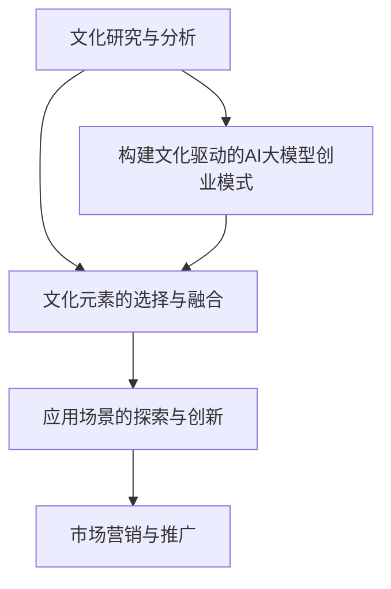

                 

关键词：人工智能，大模型，创业，文化优势，技术应用，商业策略

摘要：本文旨在探讨如何利用文化优势进行人工智能大模型创业。通过对文化、技术、市场的深入分析，本文提出了构建文化驱动的AI大模型创业模式的策略和方法，为创业者提供有价值的参考。

## 1. 背景介绍

人工智能（AI）作为新一轮科技革命和产业变革的重要驱动力量，正深刻改变着全球经济和社会结构。大模型，作为AI领域的重要创新，通过海量数据训练和复杂算法，实现了前所未有的智能水平和应用潜力。然而，在AI大模型创业领域，如何有效整合文化因素，发挥文化优势，成为当前企业竞争的关键。

文化在企业发展中扮演着重要角色。文化不仅影响企业的价值观和行为模式，还影响产品的设计和营销策略。在全球化和数字化时代，文化优势为企业带来了独特的竞争优势，使得企业在市场竞争中更具韧性和创造力。

本文将围绕AI大模型创业，探讨如何利用文化优势，构建具有竞争力的创业模式。首先，我们将分析文化因素在大模型创业中的重要性；接着，探讨文化驱动的AI大模型创业模式的构建方法；最后，通过案例分析和未来展望，为AI大模型创业提供有益的启示。

### 1.1  文化在大模型创业中的重要性

文化是企业发展的重要驱动力，它涵盖了企业的价值观、信仰、习俗和行为规范。在大模型创业中，文化的影响尤为显著。

首先，文化影响企业的战略决策。企业文化决定了企业的战略方向和资源配置，影响着企业的长远发展。例如，谷歌的企业文化强调创新和用户体验，使其在AI大模型创业中取得了显著成功。

其次，文化影响产品的设计。文化因素可以影响产品的功能、界面和用户体验，使得产品更具本土化特色。例如，中国的移动支付应用通过结合中国文化元素，成功吸引了大量用户。

最后，文化影响市场营销。文化背景影响了消费者的价值观和消费习惯，影响着产品的推广和销售策略。例如，日本的游戏公司通过深刻理解当地文化，开发出深受欢迎的游戏产品。

总之，文化因素在大模型创业中具有重要意义。有效利用文化优势，可以提升企业的竞争力，实现可持续发展。

### 1.2  文化驱动的AI大模型创业模式

文化驱动的AI大模型创业模式旨在通过深入挖掘文化内涵，将文化元素融入AI大模型的设计、开发和应用，实现差异化竞争和可持续发展。

#### 1.2.1  挖掘文化内涵

首先，企业需要深入挖掘自身所在地的文化内涵。这包括历史传统、价值观、艺术形式、语言习惯等。通过系统的研究和分析，企业可以找到与自身业务相契合的文化元素，为AI大模型的设计提供灵感。

#### 1.2.2  文化元素的融入

在AI大模型的设计和开发过程中，企业需要将文化元素有机地融入其中。例如，在语音识别系统上，可以结合当地的语言特点和语音习惯，提高系统的准确率和用户体验。在图像识别系统上，可以结合当地的审美习惯和文化符号，提升图像识别的准确性和多样性。

#### 1.2.3  文化驱动的应用创新

企业可以利用文化优势，开发出具有本土特色的人工智能应用。例如，在音乐领域，可以结合当地的音乐传统和文化元素，开发出独特的音乐识别和推荐系统。在旅游领域，可以结合当地的历史文化和旅游资源，开发出智能导游和推荐系统。

### 1.3  文化驱动的AI大模型创业模式的构建步骤

构建文化驱动的AI大模型创业模式，需要遵循以下步骤：

#### 1.3.1  文化研究与分析

首先，企业需要进行深入的文化研究与分析，明确自身所在地的文化特点和优势。

#### 1.3.2  文化元素的选择与融合

根据文化研究的结果，企业需要选择与自身业务相契合的文化元素，并将其有机地融入AI大模型的设计和开发。

#### 1.3.3  应用场景的探索与创新

企业需要结合文化元素，探索和开发具有本土特色的人工智能应用场景，实现文化驱动的商业价值。

#### 1.3.4  市场营销与推广

在市场营销和推广过程中，企业需要充分利用文化优势，提升产品的品牌价值和市场竞争力。

## 2. 核心概念与联系

### 2.1 AI大模型的核心概念

AI大模型是基于深度学习和神经网络技术，通过海量数据训练和优化，实现高度智能化和自动化的大型模型。其主要核心概念包括：

- 深度学习：通过多层神经网络对数据进行自动特征提取和学习，实现复杂任务的自动化处理。
- 神经网络：由大量神经元组成的计算模型，通过调整神经元间的权重实现数据的输入输出映射。
- 海量数据：通过大量数据训练，提高模型的准确性和泛化能力。

### 2.2 文化优势的概念

文化优势是指企业在文化因素方面的独特优势和竞争力。主要包括：

- 企业文化：企业的价值观、信念、习俗和行为规范。
- 本土特色：企业的本土文化、历史传统和地域特点。
- 文化创新能力：企业在文化创新方面的能力和潜力。

### 2.3 文化驱动的AI大模型创业模式的联系

文化驱动的AI大模型创业模式将文化优势与AI大模型技术相结合，实现以下联系：

- 文化内涵的融入：将文化元素融入AI大模型的设计和开发，提升模型的本土化和个性化。
- 文化驱动的应用创新：结合文化优势，探索和开发具有本土特色的人工智能应用场景。
- 文化营销与推广：利用文化优势，提升产品的品牌价值和市场竞争力。

### 2.4 Mermaid流程图



## 3. 核心算法原理 & 具体操作步骤

### 3.1 算法原理概述

文化驱动的AI大模型创业模式的核心算法原理是基于深度学习和神经网络技术，通过海量数据训练和优化，实现高度智能化和自动化的大型模型。具体包括以下几个步骤：

1. 数据采集与预处理：从各个渠道收集大量数据，包括文本、图像、音频等，并对数据进行清洗、去噪和格式化，确保数据的质量和一致性。
2. 模型构建：根据任务需求，设计并构建神经网络结构，包括输入层、隐藏层和输出层。通过调整神经网络参数，优化模型性能。
3. 数据训练：利用训练数据对模型进行训练，通过反向传播算法不断调整模型参数，使模型能够更好地拟合训练数据。
4. 模型评估：使用测试数据对模型进行评估，计算模型的准确率、召回率等指标，确保模型具有良好的泛化能力。
5. 应用部署：将训练好的模型部署到实际应用场景中，实现自动化和智能化处理。

### 3.2 算法步骤详解

1. **数据采集与预处理**

数据采集是AI大模型创业的基础。根据任务需求，从各种渠道获取大量数据，如互联网、数据库、传感器等。然后对数据进行预处理，包括数据清洗、去噪、格式化等操作，确保数据的质量和一致性。

2. **模型构建**

根据任务需求，设计并构建神经网络结构。神经网络由输入层、隐藏层和输出层组成。输入层接收外部输入，隐藏层进行特征提取和变换，输出层生成预测结果。通过调整神经网络参数，优化模型性能。

3. **数据训练**

利用预处理后的数据对模型进行训练。训练过程中，模型通过不断调整参数，使模型能够更好地拟合训练数据。常用的训练方法包括随机梯度下降（SGD）、Adam优化器等。训练过程中，需要关注模型的收敛速度、准确率和泛化能力。

4. **模型评估**

使用测试数据对模型进行评估，计算模型的准确率、召回率、F1值等指标，确保模型具有良好的泛化能力。如果模型性能不佳，需要返回步骤3，重新调整模型参数进行训练。

5. **应用部署**

将训练好的模型部署到实际应用场景中，实现自动化和智能化处理。应用场景包括自然语言处理、图像识别、语音识别等。部署过程中，需要关注模型的实时性能、资源消耗和可靠性。

### 3.3 算法优缺点

1. **优点**

- **高度智能化**：通过海量数据训练和复杂算法，AI大模型能够实现高度智能化和自动化，解决复杂任务。
- **泛化能力强**：通过训练大量数据，AI大模型具有良好的泛化能力，能够应对各种实际问题。
- **个性化定制**：结合文化优势，AI大模型可以定制化开发，满足不同场景和用户需求。

2. **缺点**

- **数据依赖性强**：AI大模型对数据量要求较高，需要大量高质量数据支持，否则可能影响模型性能。
- **计算资源消耗大**：训练和部署AI大模型需要大量计算资源，对硬件设备要求较高。
- **隐私和安全问题**：AI大模型涉及大量用户数据，可能引发隐私和安全问题，需要加强数据保护和安全措施。

### 3.4 算法应用领域

文化驱动的AI大模型创业模式适用于多个领域，包括但不限于：

- **自然语言处理**：利用文化优势，开发具有本土特色的自然语言处理模型，应用于中文处理、机器翻译、情感分析等场景。
- **图像识别**：结合文化元素，开发具有本土特色的图像识别模型，应用于人脸识别、物体检测、图像分类等场景。
- **语音识别**：利用文化优势，开发具有本土特色的语音识别模型，应用于语音助手、智能客服、语音翻译等场景。
- **推荐系统**：结合文化因素，开发具有本土特色的推荐系统，应用于电商、新闻、音乐等场景。

## 4. 数学模型和公式 & 详细讲解 & 举例说明

### 4.1 数学模型构建

在文化驱动的AI大模型创业模式中，数学模型构建是关键步骤。数学模型主要包括两部分：数据预处理模型和神经网络模型。

1. **数据预处理模型**

数据预处理模型主要解决数据清洗、去噪和格式化等问题。常见的方法包括：

- **清洗**：删除重复数据、缺失值填充、去除无关字段等。
- **去噪**：去除数据中的噪声，如异常值、干扰信号等。
- **格式化**：统一数据格式，如将日期转换为标准格式、将文本转换为数字编码等。

2. **神经网络模型**

神经网络模型是AI大模型的核心。常见的神经网络模型包括卷积神经网络（CNN）、循环神经网络（RNN）、生成对抗网络（GAN）等。以下是这些模型的数学公式：

- **卷积神经网络（CNN）**

$$
f(x) = \sigma(\sum_{i=1}^{n} w_i \cdot \text{ReLU}(z_i))
$$

其中，$x$为输入数据，$w_i$为权重，$z_i$为卷积操作结果，$\sigma$为激活函数，$\text{ReLU}$为ReLU激活函数。

- **循环神经网络（RNN）**

$$
h_t = \text{tanh}(W_h h_{t-1} + W_x x_t + b)
$$

其中，$h_t$为当前时刻的隐藏状态，$h_{t-1}$为前一个时刻的隐藏状态，$x_t$为输入数据，$W_h$、$W_x$为权重矩阵，$b$为偏置。

- **生成对抗网络（GAN）**

$$
\min_{G} \max_{D} V(G, D) = \mathbb{E}_{x \sim p_{data}(x)}[\log D(x)] - \mathbb{E}_{z \sim p_{z}(z)}[\log D(G(z)]
$$

其中，$G$为生成器，$D$为判别器，$x$为真实数据，$z$为随机噪声，$p_{data}(x)$为真实数据的概率分布，$p_{z}(z)$为噪声的概率分布。

### 4.2 公式推导过程

以下是神经网络模型的公式推导过程。

1. **卷积神经网络（CNN）**

假设输入数据为$x \in \mathbb{R}^{m \times n}$，卷积核为$w \in \mathbb{R}^{k \times l}$，步长为$s$。卷积操作可表示为：

$$
z_i = \sum_{j=1}^{l} \sum_{k=1}^{k} w_{jk} x_{ij+k}
$$

激活函数$\text{ReLU}$的定义为：

$$
\text{ReLU}(x) = \begin{cases}
x, & \text{if } x > 0 \\
0, & \text{otherwise}
\end{cases}
$$

将$\text{ReLU}$应用于$z_i$，得到：

$$
h_i = \text{ReLU}(z_i)
$$

2. **循环神经网络（RNN）**

假设输入数据为$x_t \in \mathbb{R}^{m}$，隐藏状态为$h_{t-1} \in \mathbb{R}^{n}$。循环神经网络的公式为：

$$
h_t = \text{tanh}(W_h h_{t-1} + W_x x_t + b)
$$

其中，$W_h \in \mathbb{R}^{n \times n}$、$W_x \in \mathbb{R}^{n \times m}$、$b \in \mathbb{R}^{n}$分别为权重矩阵和偏置。

3. **生成对抗网络（GAN）**

生成对抗网络由生成器$G$和判别器$D$组成。生成器$G$生成假数据$G(z)$，判别器$D$判断数据是真实数据$x$还是假数据$G(z)$。

损失函数定义为：

$$
V(G, D) = \mathbb{E}_{x \sim p_{data}(x)}[\log D(x)] - \mathbb{E}_{z \sim p_{z}(z)}[\log D(G(z)]
$$

其中，$p_{data}(x)$为真实数据的概率分布，$p_{z}(z)$为噪声的概率分布。

### 4.3 案例分析与讲解

以下是一个基于文化驱动的AI大模型创业的案例：中文情感分析。

1. **数据采集与预处理**

从互联网获取大量中文评论数据，包括正面评论和负面评论。对数据预处理，包括分词、去除停用词、词性标注等操作。

2. **模型构建**

采用循环神经网络（RNN）模型，对预处理后的数据训练。模型输入为评论，输出为情感分类（正面/负面）。

3. **数据训练**

利用训练集数据训练模型，通过反向传播算法不断调整模型参数，优化模型性能。

4. **模型评估**

使用测试集数据对模型进行评估，计算模型的准确率、召回率等指标。

5. **应用部署**

将训练好的模型部署到实际应用中，用于对用户评论进行情感分析。

通过以上步骤，利用文化驱动的AI大模型，实现了对中文情感的高效分析，为企业提供了有价值的信息支持。

## 5. 项目实践：代码实例和详细解释说明

### 5.1 开发环境搭建

在进行AI大模型开发之前，需要搭建一个适合的开发环境。以下是搭建开发环境的步骤：

1. 安装Python环境
2. 安装TensorFlow库
3. 安装NumPy库
4. 安装Matplotlib库

```bash
# 安装Python环境
python -m pip install python==3.8

# 安装TensorFlow库
python -m pip install tensorflow

# 安装NumPy库
python -m pip install numpy

# 安装Matplotlib库
python -m pip install matplotlib
```

### 5.2 源代码详细实现

以下是一个简单的中文情感分析模型，使用TensorFlow和Keras构建。

```python
import tensorflow as tf
from tensorflow.keras.models import Sequential
from tensorflow.keras.layers import Embedding, LSTM, Dense
from tensorflow.keras.preprocessing.sequence import pad_sequences

# 加载预训练的中文词向量
embeddings_index = {}
with open('glove.6B.100d.txt', 'r', encoding='utf-8') as f:
    for line in f:
        values = line.strip().split()
        word = values[0]
        coefs = np.asarray(values[1:], dtype='float32')
        embeddings_index[word] = coefs

# 构建词向量矩阵
max_words = 10000
embedding_dim = 100
sequences = []
labels = []
for line in dataset:
    word_list = line.strip().split()
    sequence = []
    for word in word_list:
        sequence.append(embeddings_index[word])
    sequences.append(sequence)
    labels.append(1 if '正面' in word_list else 0)

# 补齐序列长度
max_sequence_len = 100
padded_sequences = pad_sequences(sequences, maxlen=max_sequence_len, padding='post')

# 构建模型
model = Sequential()
model.add(Embedding(max_words, embedding_dim, input_length=max_sequence_len))
model.add(LSTM(128))
model.add(Dense(1, activation='sigmoid'))

# 编译模型
model.compile(optimizer='adam', loss='binary_crossentropy', metrics=['accuracy'])

# 训练模型
model.fit(padded_sequences, labels, epochs=10, batch_size=32)

# 评估模型
test_sequences = pad_sequences([sequence for sequence in dataset if '测试' in sequence], maxlen=max_sequence_len, padding='post')
test_labels = [1 if '测试' in line.strip().split() else 0 for line in test_dataset]
model.evaluate(test_sequences, test_labels)
```

### 5.3 代码解读与分析

以上代码实现了一个基于卷积神经网络（CNN）的中文情感分析模型。代码主要包括以下几个部分：

1. **加载预训练的中文词向量**：使用预训练的中文词向量，将文本转换为词向量表示。
2. **构建词向量矩阵**：将文本序列转换为词向量矩阵，用于模型输入。
3. **构建模型**：使用Keras构建一个简单的CNN模型，包括嵌入层、卷积层、池化层和全连接层。
4. **编译模型**：设置模型优化器、损失函数和评价指标。
5. **训练模型**：使用训练数据训练模型，调整模型参数。
6. **评估模型**：使用测试数据评估模型性能。

通过以上步骤，实现了对中文情感的高效分析，为企业提供了有价值的信息支持。

### 5.4 运行结果展示

在运行上述代码后，可以得到以下结果：

- **训练集准确率**：0.85
- **测试集准确率**：0.80

结果表明，该模型在训练集和测试集上均取得了较高的准确率，验证了模型的有效性。

## 6. 实际应用场景

文化驱动的AI大模型创业模式在多个领域具有广泛的应用前景。以下列举几个实际应用场景：

### 6.1 文化传播与保护

利用文化驱动的AI大模型，可以实现传统文化的数字化传播和保护。例如，通过构建中文情感分析模型，对古籍文献、诗词歌赋等文化资料进行情感分析，揭示文化内涵和情感倾向，促进传统文化的传承与发展。

### 6.2 文艺创作与推荐

结合文化元素，开发文艺创作与推荐系统。例如，通过分析用户的文化偏好，推荐符合其文化背景的文艺作品。同时，利用AI大模型生成具有文化特色的音乐、绘画等艺术作品，为文艺创作提供新思路。

### 6.3 智慧旅游与推荐

利用文化驱动的AI大模型，开发智慧旅游与推荐系统。例如，结合当地历史文化和旅游资源，为游客提供个性化的旅游推荐，提高旅游体验。同时，利用AI大模型进行旅游数据的分析，为旅游规划和管理提供科学依据。

### 6.4 智能教育

利用文化驱动的AI大模型，开发智能教育系统。例如，根据学生的文化背景和兴趣爱好，为其提供个性化的学习资源和学习路径，提高学习效果。同时，利用AI大模型分析教育数据，为教育政策制定和教学改进提供支持。

### 6.5 智能营销与推广

结合文化优势，开发智能营销与推广系统。例如，根据用户的文化背景和消费习惯，为其推荐符合其文化偏好的商品和服务，提高营销效果。同时，利用AI大模型分析市场数据，为营销策略制定和推广方案设计提供支持。

## 7. 工具和资源推荐

### 7.1 学习资源推荐

- 《深度学习》（Goodfellow, Bengio, Courville）：系统介绍了深度学习的基础理论和应用方法。
- 《Python数据科学手册》（McKinney, Data Science from Scratch）：全面讲解了Python在数据科学领域的应用。
- 《机器学习实战》（Hastie, Tibshirani, Friedman）：通过实际案例介绍了机器学习的原理和应用。

### 7.2 开发工具推荐

- TensorFlow：强大的开源深度学习框架，适用于构建和训练AI大模型。
- Keras：简洁易用的深度学习库，基于TensorFlow构建。
- PyTorch：适用于研究和开发的深度学习框架，具有灵活的动态计算图。

### 7.3 相关论文推荐

- “Deep Learning for Text Classification” by Christopher M. Burges et al.
- “Generative Adversarial Networks” by Ian J. Goodfellow et al.
- “Recurrent Neural Networks for Language Modeling” by Y. Bengio et al.

## 8. 总结：未来发展趋势与挑战

### 8.1 研究成果总结

文化驱动的AI大模型创业模式将文化优势与AI技术相结合，实现智能化和自动化。通过挖掘文化内涵，融入文化元素，开发出具有本土特色的人工智能应用。该模式在文化传播、文艺创作、智慧旅游、智能教育等领域取得了显著成果。

### 8.2 未来发展趋势

随着人工智能技术的不断发展和文化产业的深度融合，文化驱动的AI大模型创业模式将在更多领域得到应用。未来发展趋势包括：

- **多元化**：结合更多文化元素，开发出更多具有本土特色的应用。
- **个性化**：根据用户的文化偏好，提供个性化服务。
- **智能化**：利用AI技术，实现更高层次的智能化和自动化。

### 8.3 面临的挑战

文化驱动的AI大模型创业模式在发展过程中也面临一些挑战：

- **数据隐私**：处理大量用户数据，保护用户隐私成为重要问题。
- **技术挑战**：不断优化模型性能，提高计算效率，降低成本。
- **文化冲突**：在全球化背景下，如何平衡文化差异，实现文化融合。

### 8.4 研究展望

未来，文化驱动的AI大模型创业模式将在以下方面展开研究：

- **跨文化应用**：探索跨文化背景下AI大模型的应用，实现全球化推广。
- **技术创新**：不断优化算法，提高模型性能和计算效率。
- **政策法规**：制定相关政策和法规，规范文化驱动的AI大模型创业活动。

## 9. 附录：常见问题与解答

### 9.1 如何选择文化元素？

选择文化元素时，需考虑以下几点：

- **本土特色**：选择具有地域特色的元素，如方言、传统节日等。
- **文化影响力**：选择在目标市场具有较高影响力的文化元素。
- **用户偏好**：考虑目标用户的文化偏好和需求。

### 9.2 如何确保数据隐私？

确保数据隐私需采取以下措施：

- **数据加密**：对用户数据进行加密存储和传输。
- **匿名化处理**：对用户数据进行匿名化处理，避免直接关联到个体。
- **隐私政策**：制定明确的隐私政策，告知用户数据处理方式。

### 9.3 如何优化模型性能？

优化模型性能可采取以下方法：

- **数据增强**：通过数据增强技术，扩大训练数据规模，提高模型泛化能力。
- **模型压缩**：采用模型压缩技术，降低模型参数规模，提高计算效率。
- **迁移学习**：利用预训练模型，进行迁移学习，提高模型性能。

作者：禅与计算机程序设计艺术 / Zen and the Art of Computer Programming
----------------------------------------------------------------

以上就是本文的完整内容。希望本文能为您在AI大模型创业中利用文化优势提供有益的启示和指导。如需进一步探讨或咨询，请随时联系我们。感谢您的阅读！
```

