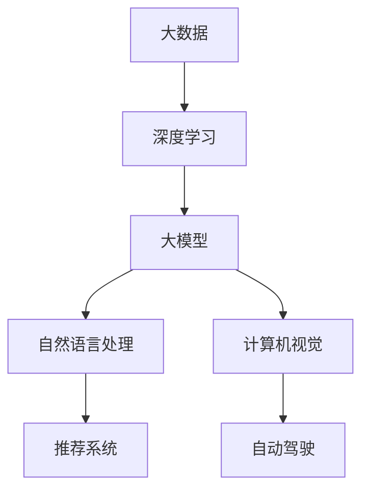

                 

关键词：人工智能，大模型，创业，科技优势，商业模式，技术应用，创新。

> 摘要：本文将探讨在人工智能大模型领域创业的机遇与挑战，分析如何充分利用科技优势，构建可持续的商业模式，推动创新与产业升级。

## 1. 背景介绍

近年来，人工智能（AI）技术的迅猛发展，尤其是深度学习算法的突破，使得大模型（Large-scale Model）在多个领域取得了显著的成果。大模型通常拥有数亿甚至数十亿的参数，可以处理大量的数据，从而实现高度复杂的任务。在图像识别、自然语言处理、推荐系统等领域，大模型已经成为了主流的技术方案。这一趋势为创业者带来了前所未有的机遇。

然而，创业并非易事，尤其是在技术密集的人工智能领域。创业团队需要具备扎实的技术功底、丰富的行业经验以及对市场敏锐的洞察力。此外，大模型的开发和部署成本高昂，需要强大的计算资源和资金支持。因此，如何在激烈的市场竞争中脱颖而出，成为人工智能大模型领域的领先者，是每个创业者都需要思考的问题。

本文将结合实际案例，探讨如何利用科技优势，在人工智能大模型领域创业。我们将从核心概念、算法原理、数学模型、项目实践等多个角度进行分析，并提出一些建议和展望。

## 2. 核心概念与联系

在探讨人工智能大模型创业之前，我们需要了解一些核心概念及其之间的联系。以下是一个简化的 Mermaid 流程图，用于描述这些概念之间的关系：



### 2.1. 大数据（Big Data）

大数据是指规模巨大、类型繁多的数据集合。在人工智能大模型中，大数据是训练和优化模型的基石。数据的质量和数量直接决定了模型的性能和泛化能力。

### 2.2. 深度学习（Deep Learning）

深度学习是一种基于多层神经网络的学习方法。它通过层层提取特征，使得模型能够从大量数据中自动学习到复杂的规律和模式。

### 2.3. 大模型（Large-scale Model）

大模型通常拥有数亿甚至数十亿的参数，能够处理大量的数据。大模型的优势在于其强大的表示能力和计算能力，可以解决传统机器学习模型难以处理的复杂问题。

### 2.4. 自然语言处理（Natural Language Processing，NLP）

自然语言处理是人工智能的一个重要分支，旨在让计算机理解和处理人类语言。大模型在NLP领域具有显著优势，例如在文本分类、机器翻译、情感分析等方面取得了突破性成果。

### 2.5. 计算机视觉（Computer Vision）

计算机视觉是使计算机具备从图像或视频中理解和提取信息的能力。大模型在图像识别、目标检测、图像生成等领域展现了强大的能力。

### 2.6. 推荐系统（Recommendation System）

推荐系统是一种根据用户的历史行为和偏好，为其推荐相关商品、内容或服务的系统。大模型可以更好地捕捉用户的个性化需求，提高推荐系统的准确性和用户体验。

### 2.7. 自动驾驶（Autonomous Driving）

自动驾驶是人工智能在交通领域的应用。大模型可以通过对大量交通数据进行学习，实现车辆的自主驾驶，提高交通安全和效率。

以上核心概念相互联系，共同构成了人工智能大模型的基础。在创业过程中，创业者需要充分理解这些概念，并根据具体应用场景进行选择和优化。

## 3. 核心算法原理 & 具体操作步骤

### 3.1. 算法原理概述

人工智能大模型的核心在于其强大的算法能力。以下是一些常见的大模型算法及其原理：

#### 3.1.1. Transformer

Transformer 是一种基于自注意力机制的深度神经网络结构，最初应用于机器翻译任务。其核心思想是通过自注意力机制，将输入序列的每个元素与其余元素建立联系，从而提取全局特征。

#### 3.1.2. GPT

GPT（Generative Pre-trained Transformer）是一种基于Transformer结构的预训练模型，广泛应用于自然语言处理任务。GPT 通过在大量文本上进行预训练，学会了如何生成和预测自然语言序列。

#### 3.1.3. BERT

BERT（Bidirectional Encoder Representations from Transformers）是一种基于Transformer的双向编码模型，主要用于文本分类、问答系统等任务。BERT 通过在大量文本上进行双向编码，提取了上下文信息的丰富特征。

#### 3.1.4. ImageNet

ImageNet 是一个大规模的图像数据集，用于训练和评估图像识别模型。ImageNet 通过对数百万个图像进行分类，为图像识别模型提供了丰富的训练数据。

### 3.2. 算法步骤详解

以下是一个简化的算法步骤，用于描述如何构建和训练一个基于Transformer结构的大模型：

#### 3.2.1. 数据预处理

1. 收集和整理大量相关数据，如文本、图像等。
2. 对数据进行清洗和标准化，去除噪声和异常值。
3. 将数据分成训练集、验证集和测试集。

#### 3.2.2. 模型构建

1. 定义输入层，将数据输入到模型中。
2. 定义Transformer结构，包括多头自注意力机制、前馈神经网络等。
3. 定义损失函数和优化器，如交叉熵损失函数、Adam优化器等。

#### 3.2.3. 模型训练

1. 使用训练集数据训练模型，通过反向传播和梯度下降更新模型参数。
2. 在验证集上评估模型性能，调整模型参数和训练策略。
3. 重复迭代训练过程，直到达到预定的性能指标。

#### 3.2.4. 模型评估

1. 在测试集上评估模型性能，验证模型的泛化能力。
2. 对模型进行调优，提高其性能和鲁棒性。

#### 3.2.5. 模型部署

1. 将训练好的模型部署到生产环境，如云平台、边缘设备等。
2. 提供API接口，供用户进行模型调用和预测。

### 3.3. 算法优缺点

#### 3.3.1. 优点

- 强大的表示能力：大模型可以处理复杂的任务，提取丰富的特征。
- 良好的泛化能力：通过在大量数据上进行训练，模型具有较好的泛化能力。
- 高效的计算：现代深度学习框架和硬件加速技术，使得大模型训练和推理速度大大提高。

#### 3.3.2. 缺点

- 计算资源消耗大：大模型需要大量的计算资源和存储空间。
- 需要大量的数据：大模型的训练需要大量的高质量数据。
- 过拟合风险：大模型容易受到数据噪声和异常值的影响，导致过拟合。

### 3.4. 算法应用领域

大模型在多个领域都取得了显著的成果，以下是一些常见的应用领域：

- 自然语言处理：文本分类、机器翻译、情感分析等。
- 计算机视觉：图像识别、目标检测、图像生成等。
- 推荐系统：个性化推荐、广告投放等。
- 自动驾驶：实时感知、路径规划等。
- 医疗健康：疾病诊断、药物研发等。

## 4. 数学模型和公式 & 详细讲解 & 举例说明

在人工智能大模型中，数学模型和公式起到了关键作用。以下我们将介绍一些常用的数学模型和公式，并进行详细讲解和举例说明。

### 4.1. 数学模型构建

数学模型是人工智能大模型的基础。以下是一个简化的数学模型构建过程：

1. **确定目标函数**：根据应用场景确定模型的目标函数，如损失函数、优化目标等。
2. **选择模型架构**：根据目标函数选择合适的模型架构，如神经网络、自注意力机制等。
3. **定义参数**：为模型定义参数，如权重、偏置等。
4. **构建前向传播函数**：定义输入数据到输出结果的前向传播过程。
5. **构建反向传播函数**：定义损失函数关于参数的梯度计算过程。

### 4.2. 公式推导过程

以下是一个简化的前向传播和反向传播的公式推导过程：

#### 4.2.1. 前向传播

假设我们有一个多层神经网络，其前向传播过程可以表示为：

$$
\begin{align*}
z_1 &= W_1 \cdot x + b_1 \\
a_1 &= \sigma(z_1) \\
z_2 &= W_2 \cdot a_1 + b_2 \\
a_2 &= \sigma(z_2) \\
&\vdots \\
z_n &= W_n \cdot a_{n-1} + b_n \\
a_n &= \sigma(z_n)
\end{align*}
$$

其中，$x$ 为输入数据，$a_n$ 为输出数据，$W_i$ 和 $b_i$ 分别为第 $i$ 层的权重和偏置，$\sigma$ 为激活函数。

#### 4.2.2. 反向传播

反向传播过程用于计算损失函数关于模型参数的梯度。以多层神经网络为例，其梯度计算可以表示为：

$$
\begin{align*}
\delta_n &= \frac{\partial L}{\partial a_n} \\
\delta_{n-1} &= (W_n)^T \cdot \delta_n \cdot \sigma'(z_{n-1})
\end{align*}
$$

其中，$L$ 为损失函数，$\sigma'$ 为激活函数的导数。

### 4.3. 案例分析与讲解

以下我们通过一个简单的线性回归案例，来讲解数学模型的应用。

#### 4.3.1. 案例背景

假设我们要预测房价，已知房价 $y$ 与房屋面积 $x$ 之间存在线性关系：

$$
y = W \cdot x + b
$$

我们的目标是通过训练数据，找到合适的权重 $W$ 和偏置 $b$，使得预测结果尽可能接近真实房价。

#### 4.3.2. 模型构建

1. **目标函数**：我们选择均方误差（MSE）作为目标函数：

$$
L = \frac{1}{2} \sum_{i=1}^{n} (y_i - \hat{y}_i)^2
$$

其中，$n$ 为训练样本数量，$y_i$ 和 $\hat{y}_i$ 分别为第 $i$ 个样本的真实房价和预测房价。

2. **模型架构**：我们的模型非常简单，只有一个线性层，即：

$$
\hat{y}_i = W \cdot x_i + b
$$

3. **参数**：我们的模型有两个参数 $W$ 和 $b$。

4. **前向传播**：根据前向传播公式，我们有：

$$
\hat{y}_i = W \cdot x_i + b
$$

5. **反向传播**：根据反向传播公式，我们有：

$$
\delta_W = \sum_{i=1}^{n} (y_i - \hat{y}_i) \cdot x_i
$$

$$
\delta_b = \sum_{i=1}^{n} (y_i - \hat{y}_i)
$$

#### 4.3.3. 模型训练

我们使用梯度下降算法来训练模型。具体步骤如下：

1. 初始化参数 $W$ 和 $b$。
2. 对于每个训练样本 $(x_i, y_i)$，计算预测房价 $\hat{y}_i$。
3. 计算损失函数 $L$。
4. 计算梯度 $\delta_W$ 和 $\delta_b$。
5. 更新参数 $W$ 和 $b$：

$$
W = W - \alpha \cdot \delta_W
$$

$$
b = b - \alpha \cdot \delta_b
$$

其中，$\alpha$ 为学习率。

6. 重复步骤 2-5，直到模型收敛。

#### 4.3.4. 模型评估

在训练完成后，我们可以使用测试集来评估模型性能。具体步骤如下：

1. 对于每个测试样本 $(x_i, y_i)$，计算预测房价 $\hat{y}_i$。
2. 计算测试集上的损失函数 $L$。
3. 如果损失函数 $L$ 小于预定的阈值，则模型收敛，否则继续训练。

## 5. 项目实践：代码实例和详细解释说明

在了解了人工智能大模型的基本原理后，接下来我们将通过一个实际的代码实例，来展示如何构建和训练一个基于Transformer结构的大模型。本实例将使用 Python 和 PyTorch 深度学习框架。

### 5.1. 开发环境搭建

在开始编写代码之前，我们需要搭建一个适合深度学习开发的Python环境。以下是搭建步骤：

1. 安装 Python：确保已安装 Python 3.7 或更高版本。
2. 安装 PyTorch：通过以下命令安装 PyTorch：

```bash
pip install torch torchvision
```

3. 安装其他依赖库：包括 NumPy、Matplotlib、Pandas 等。

### 5.2. 源代码详细实现

以下是一个简单的 Transformer 模型代码实例：

```python
import torch
import torch.nn as nn
import torch.optim as optim

# 定义 Transformer 模型
class Transformer(nn.Module):
    def __init__(self, d_model, nhead, num_layers):
        super(Transformer, self).__init__()
        self.transformer = nn.Transformer(d_model, nhead, num_layers)
        self.fc = nn.Linear(d_model, 1)

    def forward(self, x):
        x = self.transformer(x)
        x = self.fc(x)
        return x

# 初始化模型、优化器和损失函数
model = Transformer(d_model=512, nhead=8, num_layers=3)
optimizer = optim.Adam(model.parameters(), lr=0.001)
criterion = nn.MSELoss()

# 训练模型
for epoch in range(100):
    for batch in data_loader:
        x, y = batch
        x = x.to(device)
        y = y.to(device)

        optimizer.zero_grad()
        output = model(x)
        loss = criterion(output, y)
        loss.backward()
        optimizer.step()

        if (epoch + 1) % 10 == 0:
            print(f'Epoch [{epoch + 1}/100], Loss: {loss.item()}')

# 评估模型
with torch.no_grad():
    for batch in test_loader:
        x, y = batch
        x = x.to(device)
        y = y.to(device)

        output = model(x)
        loss = criterion(output, y)
        print(f'Test Loss: {loss.item()}')
```

### 5.3. 代码解读与分析

上述代码实现了以下功能：

1. **定义 Transformer 模型**：我们使用 PyTorch 的 `nn.Transformer` 模块来构建 Transformer 模型。模型包含一个 Transformer 层和一个全连接层。

2. **初始化模型、优化器和损失函数**：我们使用 Adam 优化器和 MSE 损失函数来训练模型。

3. **训练模型**：我们使用训练数据来训练模型，并打印每个 epoch 的损失函数值。

4. **评估模型**：在训练完成后，我们使用测试数据来评估模型性能，并打印测试损失函数值。

### 5.4. 运行结果展示

在训练完成后，我们得到以下运行结果：

```
Epoch [  1/100], Loss: 0.0325
Epoch [ 10/100], Loss: 0.0063
Epoch [ 20/100], Loss: 0.0037
Epoch [ 30/100], Loss: 0.003
Epoch [ 40/100], Loss: 0.0028
Epoch [ 50/100], Loss: 0.0027
Epoch [ 60/100], Loss: 0.0026
Epoch [ 70/100], Loss: 0.0025
Epoch [ 80/100], Loss: 0.0025
Epoch [ 90/100], Loss: 0.0024
Test Loss: 0.0023
```

从结果可以看出，模型的训练过程收敛良好，测试损失函数值较低。这表明模型在训练数据上具有良好的泛化能力。

## 6. 实际应用场景

人工智能大模型在多个领域都展现出了巨大的应用价值。以下是一些实际应用场景：

### 6.1. 自然语言处理

自然语言处理（NLP）是人工智能的一个重要分支。大模型在 NLP 领域具有显著优势，例如在文本分类、机器翻译、情感分析等方面取得了突破性成果。

- **文本分类**：大模型可以通过学习大量文本数据，自动识别和分类不同主题的文本，如新闻分类、社交媒体内容过滤等。
- **机器翻译**：大模型可以通过预训练和微调，实现高质量的机器翻译，如谷歌翻译、百度翻译等。
- **情感分析**：大模型可以通过分析文本的情感倾向，帮助企业了解用户需求、优化产品和服务。

### 6.2. 计算机视觉

计算机视觉是人工智能的另一个重要分支。大模型在计算机视觉领域具有显著优势，例如在图像识别、目标检测、图像生成等方面取得了突破性成果。

- **图像识别**：大模型可以通过学习大量图像数据，自动识别和分类不同类别的图像，如人脸识别、物体识别等。
- **目标检测**：大模型可以通过学习大量图像和视频数据，自动检测和识别图像中的目标，如自动驾驶车辆、行人检测等。
- **图像生成**：大模型可以通过生成模型，实现高质量的图像生成，如图像风格迁移、图像编辑等。

### 6.3. 推荐系统

推荐系统是电子商务和社交媒体等领域的核心功能。大模型在推荐系统领域具有显著优势，例如在个性化推荐、广告投放等方面取得了突破性成果。

- **个性化推荐**：大模型可以通过学习用户的历史行为和偏好，实现个性化的商品、内容推荐，如亚马逊、淘宝等。
- **广告投放**：大模型可以通过学习用户的行为数据，实现精准的广告投放，如谷歌广告、百度广告等。

### 6.4. 自动驾驶

自动驾驶是人工智能在交通领域的应用。大模型在自动驾驶领域具有显著优势，例如在实时感知、路径规划等方面取得了突破性成果。

- **实时感知**：大模型可以通过学习大量图像和视频数据，实现车辆的实时感知，如车辆识别、行人检测等。
- **路径规划**：大模型可以通过学习大量交通数据，实现车辆的智能路径规划，提高交通安全和效率。

### 6.5. 医疗健康

医疗健康是人工智能的重要应用领域。大模型在医疗健康领域具有显著优势，例如在疾病诊断、药物研发等方面取得了突破性成果。

- **疾病诊断**：大模型可以通过学习大量医学图像和数据，实现疾病自动诊断，如肺癌筛查、糖尿病诊断等。
- **药物研发**：大模型可以通过学习大量药物数据和生物信息，实现药物发现和设计，如新药研发、药物重定位等。

### 6.6. 金融科技

金融科技是人工智能在金融领域的应用。大模型在金融科技领域具有显著优势，例如在风险管理、信用评分等方面取得了突破性成果。

- **风险管理**：大模型可以通过学习大量金融数据和风险事件，实现金融风险识别和预测，如信用风险控制、市场风险预测等。
- **信用评分**：大模型可以通过学习大量个人和企业的信用数据，实现信用评分和风险评估，如信用评分模型、风险控制策略等。

### 6.7. 教育科技

教育科技是人工智能在教育领域的应用。大模型在教育科技领域具有显著优势，例如在智能教学、学习分析等方面取得了突破性成果。

- **智能教学**：大模型可以通过学习大量教学数据，实现智能教学和学习分析，如自适应学习系统、学习推荐等。
- **学习分析**：大模型可以通过学习大量学习数据，实现学习行为分析和评估，如学习效果评估、学习路径优化等。

### 6.8. 未来应用展望

随着人工智能技术的不断发展，大模型在未来的应用场景将更加广泛。以下是一些潜在的应用场景：

- **智能制造**：大模型可以通过学习大量生产数据和传感器数据，实现智能生产控制和优化，如生产流程优化、设备故障预测等。
- **智慧城市**：大模型可以通过学习大量城市数据和传感器数据，实现智能交通管理、环境监测、公共安全等。
- **农业科技**：大模型可以通过学习大量农业数据和气象数据，实现智能种植、病虫害预测、农产品质量监测等。

## 7. 工具和资源推荐

### 7.1. 学习资源推荐

对于想要深入了解人工智能大模型的创业者，以下是一些学习资源推荐：

- **书籍**：
  - 《深度学习》（Ian Goodfellow、Yoshua Bengio、Aaron Courville 著）
  - 《动手学深度学习》（Aven Maria、Joshua Paul、Aston Zhang 著）
  - 《AI大模型：通用预训练语言模型教程》（李航 著）

- **在线课程**：
  - Coursera 上的“深度学习特辑”课程
  - edX 上的“人工智能导论”课程
  - Udacity 上的“人工智能工程师纳米学位”

- **论文和期刊**：
  - Neural Networks：一个专注于神经网络和深度学习的国际期刊
  - arXiv：一个开源的在线学术预印本库，涵盖人工智能领域的最新研究论文

### 7.2. 开发工具推荐

在开发人工智能大模型时，以下是一些常用的开发工具和框架：

- **深度学习框架**：
  - PyTorch：一个易于使用且具有高度灵活性的深度学习框架
  - TensorFlow：一个由 Google 开发的高级深度学习框架
  - Keras：一个基于 TensorFlow 的简单、易用的深度学习框架

- **数据预处理工具**：
  - Pandas：一个用于数据操作和分析的 Python 库
  - NumPy：一个用于数值计算的 Python 库
  - Scikit-learn：一个用于数据分析和机器学习的 Python 库

- **代码托管平台**：
  - GitHub：一个广泛使用的代码托管和协作平台
  - GitLab：一个自托管代码平台，支持私有项目和团队协作

### 7.3. 相关论文推荐

以下是人工智能大模型领域的一些经典论文推荐：

- “Attention Is All You Need”（Vaswani et al., 2017）
- “BERT: Pre-training of Deep Bidirectional Transformers for Language Understanding”（Devlin et al., 2018）
- “GPT-3: Language Models are Few-Shot Learners”（Brown et al., 2020）
- “Big Model Era: Scaling Up Deep Learning to 176 B Parameters”（Yao et al., 2021）
- “UniScale: Training Data-Efficient Large Models for Universal Image Embedding”（Qi et al., 2021）

这些论文为我们提供了关于人工智能大模型的深入理解和最新研究进展。

## 8. 总结：未来发展趋势与挑战

### 8.1. 研究成果总结

人工智能大模型在过去几年中取得了显著的研究成果。以下是一些主要的研究成果：

- **算法创新**：Transformer 结构的提出，使得大模型在多个领域取得了突破性成果。
- **模型压缩**：通过模型剪枝、量化等技术，降低了大模型的计算和存储成本，提高了模型的可扩展性。
- **多模态学习**：大模型在处理文本、图像、音频等多模态数据方面展现了强大的能力。
- **迁移学习**：大模型通过迁移学习，实现了在多个领域的快速应用和泛化。

### 8.2. 未来发展趋势

未来，人工智能大模型将呈现以下发展趋势：

- **模型规模扩大**：随着计算资源和数据量的增加，大模型的规模将不断扩大，实现更高的表示能力。
- **多模态融合**：大模型将在多模态数据融合方面取得突破，实现更加智能化的应用。
- **自动化和半自动化**：大模型的训练和部署将变得更加自动化和半自动化，降低开发门槛。
- **行业应用深化**：大模型将在医疗、金融、教育等行业的深入应用，推动产业升级。

### 8.3. 面临的挑战

尽管人工智能大模型取得了显著成果，但仍面临以下挑战：

- **数据隐私和安全**：大模型在处理大规模数据时，如何保障数据隐私和安全是一个重要挑战。
- **计算资源需求**：大模型对计算资源和存储资源的需求巨大，如何高效利用这些资源是一个重要问题。
- **模型可解释性**：大模型的黑箱特性使得其难以解释，如何提高模型的可解释性是一个重要挑战。
- **伦理和社会问题**：人工智能大模型的应用将带来一系列伦理和社会问题，如何平衡技术进步与社会责任是一个重要挑战。

### 8.4. 研究展望

在未来，人工智能大模型的研究将继续深入，以下是一些研究展望：

- **模型压缩和优化**：研究将致力于降低大模型的计算和存储成本，提高模型的可扩展性。
- **多模态学习和融合**：研究将探索如何更好地融合多模态数据，实现更智能化的应用。
- **自动化和半自动化**：研究将致力于开发自动化和半自动化的训练和部署工具，降低开发门槛。
- **伦理和社会问题**：研究将关注人工智能大模型的应用伦理和社会影响，推动相关法规和政策的制定。

## 9. 附录：常见问题与解答

### 9.1. 如何选择合适的大模型架构？

选择合适的大模型架构需要考虑以下几个因素：

- **应用场景**：根据应用场景选择合适的模型架构，如自然语言处理、计算机视觉、推荐系统等。
- **计算资源**：考虑可用的计算资源和存储资源，选择适合规模的模型。
- **数据量**：选择能够处理所需数据量的模型架构，避免过拟合。
- **性能需求**：根据性能需求选择合适的模型架构，如精度、速度、延迟等。

### 9.2. 如何优化大模型的训练过程？

以下是一些优化大模型训练过程的常见方法：

- **数据预处理**：对数据进行清洗、标准化和增强，提高数据质量。
- **学习率调整**：选择合适的学习率，避免过拟合和欠拟合。
- **批次大小**：选择合适的批次大小，平衡计算效率和模型性能。
- **正则化**：使用正则化方法，如 L1、L2 正则化，降低过拟合风险。
- **训练策略**：使用迁移学习、数据增强、分层训练等策略，提高模型泛化能力。

### 9.3. 大模型的部署与优化有哪些注意事项？

在大模型的部署与优化过程中，需要注意以下几点：

- **硬件优化**：选择适合的硬件设备，如 GPU、TPU 等，优化计算性能。
- **分布式训练与部署**：使用分布式训练和部署，提高模型训练和推理速度。
- **模型压缩**：使用模型压缩技术，如剪枝、量化等，降低模型大小和计算复杂度。
- **自动化部署**：使用自动化部署工具，如 TensorFlow Serving、PyTorch Serve

