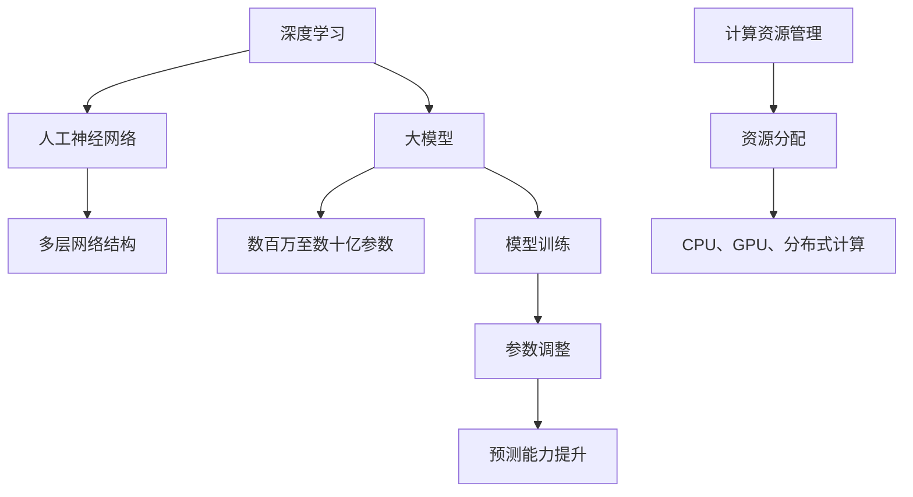

                 

在当今飞速发展的技术领域，人工智能（AI）已经不仅仅是一个学术研究的课题，更成为了商业竞争的重要武器。随着大模型技术的逐渐成熟，越来越多的创业公司开始投身于这一领域，试图通过AI技术获得商业上的成功。然而，AI大模型创业并不是一个简单的任务，它需要深厚的专业知识、精湛的编程技巧，以及有效的管理策略。本文将探讨如何在AI大模型创业过程中利用管理优势，从而提高项目的成功率。

## 1. 背景介绍

近年来，深度学习和神经网络技术的发展推动了AI大模型（如GPT、BERT等）的诞生。这些大模型具有处理大规模数据的能力，能够在各种任务中实现前所未有的准确度和效率。AI大模型的应用场景广泛，包括自然语言处理、图像识别、推荐系统等，已经在各行各业中产生了深远的影响。然而，AI大模型的开发和部署是一个复杂的过程，涉及大量的计算资源、数据处理技术和算法优化。这无疑对创业公司提出了更高的要求。

## 2. 核心概念与联系

在探讨如何利用管理优势之前，我们首先需要理解一些核心概念。这些概念包括：

- **深度学习（Deep Learning）**：一种基于人工神经网络的学习方法，通过多层网络结构对数据进行建模。
- **大模型（Big Models）**：具有数百万至数十亿参数的神经网络模型，能够处理大规模数据。
- **模型训练（Model Training）**：通过大量的数据对模型进行参数调整，以提高其预测能力。
- **计算资源管理**：合理分配和利用计算资源，包括CPU、GPU和分布式计算资源。

下面是这些核心概念的Mermaid流程图：



## 3. 核心算法原理 & 具体操作步骤

### 3.1 算法原理概述

AI大模型的核心在于其深度学习的原理。深度学习通过多层网络结构对输入数据进行特征提取和组合，从而实现复杂任务的建模。以下是深度学习的基本原理：

1. **数据预处理**：对原始数据进行清洗、归一化等处理，使其适合模型训练。
2. **网络结构设计**：选择合适的人工神经网络结构，包括输入层、隐藏层和输出层。
3. **模型训练**：通过反向传播算法，根据损失函数调整网络参数，使模型能够更好地拟合训练数据。
4. **模型评估**：使用验证集和测试集评估模型的性能，包括准确度、召回率等指标。
5. **模型部署**：将训练好的模型部署到生产环境中，进行实际任务的处理。

### 3.2 算法步骤详解

1. **数据预处理**：
   - 数据清洗：处理缺失值、噪声数据等。
   - 数据归一化：将不同特征的范围统一，以便于模型训练。

2. **网络结构设计**：
   - 输入层：接收原始数据。
   - 隐藏层：通过激活函数对数据进行非线性变换。
   - 输出层：产生预测结果。

3. **模型训练**：
   - 初始化参数：随机生成网络权重和偏置。
   - 前向传播：计算输入数据的特征表示。
   - 计算损失：通过损失函数评估模型预测结果与真实结果的差距。
   - 反向传播：更新网络参数，减少损失。
   - 重复迭代：多次迭代，直到模型收敛。

4. **模型评估**：
   - 验证集评估：在验证集上评估模型性能，调整模型参数。
   - 测试集评估：在测试集上评估模型性能，作为最终评估标准。

5. **模型部署**：
   - 环境准备：准备模型运行的环境。
   - 模型加载：从存储中加载训练好的模型。
   - 预测：接收输入数据，输出预测结果。

### 3.3 算法优缺点

**优点**：
- 高效的处理能力：大模型能够处理大量数据，快速完成复杂任务。
- 广泛的应用领域：适用于图像识别、自然语言处理、推荐系统等多种任务。
- 自动化：深度学习模型可以自动提取特征，减少人工干预。

**缺点**：
- 计算资源需求大：训练大模型需要大量的计算资源和时间。
- 数据需求大：需要大量高质量的数据进行训练。
- 难以解释：深度学习模型通常是一个“黑盒”，难以解释其决策过程。

### 3.4 算法应用领域

AI大模型的应用领域非常广泛，主要包括：

- 自然语言处理：文本分类、机器翻译、情感分析等。
- 图像识别：人脸识别、物体检测、图像生成等。
- 推荐系统：个性化推荐、商品推荐等。
- 金融领域：风险管理、欺诈检测等。
- 医疗健康：疾病诊断、药物研发等。

## 4. 数学模型和公式 & 详细讲解 & 举例说明

### 4.1 数学模型构建

深度学习中的数学模型主要包括神经网络、损失函数和优化算法。

#### 神经网络

神经网络的基本单元是神经元，每个神经元接收多个输入并产生一个输出。假设一个神经元接收输入 $x_1, x_2, \ldots, x_n$，权重分别为 $w_1, w_2, \ldots, w_n$，偏置为 $b$，激活函数为 $f$，则该神经元的输出为：

$$
z = \sum_{i=1}^{n} w_i x_i + b \\
a = f(z)
$$

其中，$f(z)$ 可以是 sigmoid、ReLU 或 tanh 等激活函数。

#### 损失函数

损失函数用于评估模型预测结果与真实结果的差距。常用的损失函数包括均方误差（MSE）、交叉熵等。

- 均方误差（MSE）：

$$
MSE = \frac{1}{m} \sum_{i=1}^{m} (y_i - \hat{y}_i)^2
$$

其中，$y_i$ 是真实标签，$\hat{y}_i$ 是模型预测值。

- 交叉熵（Cross-Entropy）：

$$
H(y, \hat{y}) = -\sum_{i=1}^{m} y_i \log(\hat{y}_i)
$$

#### 优化算法

优化算法用于调整模型参数，以最小化损失函数。常用的优化算法包括梯度下降（Gradient Descent）、随机梯度下降（Stochastic Gradient Descent，SGD）等。

- 梯度下降：

$$
\theta_{t+1} = \theta_{t} - \alpha \nabla_{\theta} J(\theta)
$$

其中，$\theta$ 是模型参数，$\alpha$ 是学习率，$J(\theta)$ 是损失函数。

### 4.2 公式推导过程

以下是均方误差（MSE）的推导过程：

设 $y$ 为真实值，$\hat{y}$ 为预测值，则：

$$
L(y, \hat{y}) = (y - \hat{y})^2
$$

为了求解 $L$ 的最小值，对 $L$ 关于 $\hat{y}$ 求导：

$$
\frac{\partial L}{\partial \hat{y}} = 2(y - \hat{y}) \\
\frac{\partial L}{\partial \hat{y}} = 0 \\
\hat{y} = y
$$

因此，当预测值等于真实值时，损失函数取得最小值。

### 4.3 案例分析与讲解

#### 案例一：图像分类

假设我们有一个图像分类任务，其中包含 $10$ 个类别。训练数据集有 $1000$ 张图像，测试数据集有 $100$ 张图像。我们使用卷积神经网络（CNN）进行模型训练。

1. **数据预处理**：对图像进行缩放、裁剪、翻转等操作，使其尺寸统一。然后，将图像数据转换为张量形式，并归一化。
2. **网络结构设计**：设计一个包含 $3$ 个卷积层和 $2$ 个全连接层的 CNN 网络。
3. **模型训练**：使用训练数据集对模型进行训练，优化网络参数。训练过程中，使用均方误差（MSE）作为损失函数，梯度下降（Gradient Descent）作为优化算法。
4. **模型评估**：在测试数据集上评估模型性能，计算准确率、召回率等指标。

#### 案例二：情感分析

假设我们有一个情感分析任务，其中包含 $2$ 个情感类别（正面、负面）。训练数据集有 $1000$ 条文本，测试数据集有 $100$ 条文本。我们使用循环神经网络（RNN）进行模型训练。

1. **数据预处理**：对文本进行分词、去停用词等操作。然后，将文本数据转换为序列形式，并编码为整数。
2. **网络结构设计**：设计一个包含 $1$ 个嵌入层和 $2$ 个循环层（LSTM）的 RNN 网络。
3. **模型训练**：使用训练数据集对模型进行训练，优化网络参数。训练过程中，使用交叉熵（Cross-Entropy）作为损失函数，随机梯度下降（Stochastic Gradient Descent，SGD）作为优化算法。
4. **模型评估**：在测试数据集上评估模型性能，计算准确率、召回率等指标。

## 5. 项目实践：代码实例和详细解释说明

### 5.1 开发环境搭建

在本项目中，我们将使用 Python 编写深度学习模型。首先，需要安装以下软件和库：

1. **Python**：版本为 3.8 或以上。
2. **PyTorch**：深度学习框架，用于构建和训练神经网络。
3. **NumPy**：用于数值计算。
4. **Pandas**：用于数据处理。
5. **Matplotlib**：用于数据可视化。

安装命令如下：

```bash
pip install python==3.8
pip install torch torchvision
pip install numpy pandas matplotlib
```

### 5.2 源代码详细实现

以下是一个简单的图像分类项目的代码实现：

```python
import torch
import torch.nn as nn
import torch.optim as optim
from torchvision import datasets, transforms
from torch.utils.data import DataLoader
import matplotlib.pyplot as plt

# 数据预处理
transform = transforms.Compose([
    transforms.Resize(256),
    transforms.RandomHorizontalFlip(),
    transforms.ToTensor(),
    transforms.Normalize(mean=[0.485, 0.456, 0.406], std=[0.229, 0.224, 0.225]),
])

train_data = datasets.ImageFolder('train', transform=transform)
test_data = datasets.ImageFolder('test', transform=transform)

train_loader = DataLoader(train_data, batch_size=64, shuffle=True)
test_loader = DataLoader(test_data, batch_size=64, shuffle=False)

# 网络结构
class CNN(nn.Module):
    def __init__(self):
        super(CNN, self).__init__()
        self.conv1 = nn.Conv2d(3, 32, kernel_size=3, padding=1)
        self.conv2 = nn.Conv2d(32, 64, kernel_size=3, padding=1)
        self.conv3 = nn.Conv2d(64, 128, kernel_size=3, padding=1)
        self.fc1 = nn.Linear(128 * 4 * 4, 1024)
        self.fc2 = nn.Linear(1024, 2)
        self.relu = nn.ReLU()

    def forward(self, x):
        x = self.relu(self.conv1(x))
        x = self.relu(self.conv2(x))
        x = self.relu(self.conv3(x))
        x = x.view(x.size(0), -1)
        x = self.relu(self.fc1(x))
        x = self.fc2(x)
        return x

model = CNN()

# 损失函数和优化器
criterion = nn.CrossEntropyLoss()
optimizer = optim.Adam(model.parameters(), lr=0.001)

# 模型训练
num_epochs = 10
for epoch in range(num_epochs):
    running_loss = 0.0
    for inputs, labels in train_loader:
        optimizer.zero_grad()
        outputs = model(inputs)
        loss = criterion(outputs, labels)
        loss.backward()
        optimizer.step()
        running_loss += loss.item()
    print(f'Epoch {epoch+1}, Loss: {running_loss/len(train_loader)}')

# 模型评估
model.eval()
with torch.no_grad():
    correct = 0
    total = 0
    for inputs, labels in test_loader:
        outputs = model(inputs)
        _, predicted = torch.max(outputs.data, 1)
        total += labels.size(0)
        correct += (predicted == labels).sum().item()
print(f'Accuracy: {100 * correct / total}%')

# 保存模型
torch.save(model.state_dict(), 'cnn_model.pth')
```

### 5.3 代码解读与分析

- **数据预处理**：使用 torchvision 库中的 datasets 和 transforms 模块加载和预处理图像数据。
- **网络结构**：定义一个简单的 CNN 网络，包括卷积层、ReLU 激活函数和全连接层。
- **损失函数和优化器**：使用 CrossEntropyLoss 作为损失函数，Adam 作为优化器。
- **模型训练**：使用训练数据集对模型进行训练，优化网络参数。
- **模型评估**：在测试数据集上评估模型性能，计算准确率。
- **保存模型**：将训练好的模型保存为 pth 格式。

## 6. 实际应用场景

AI大模型在许多实际应用场景中展现了强大的能力。以下是一些典型的应用场景：

- **医疗健康**：通过分析患者病历和基因数据，AI大模型可以帮助医生进行疾病诊断、药物研发和个性化治疗。
- **金融领域**：AI大模型可以用于风险控制、欺诈检测、信用评分等任务，提高金融服务的效率和安全。
- **智能交通**：通过分析交通数据，AI大模型可以帮助优化交通流量、预测交通事故和减少拥堵。
- **智能家居**：AI大模型可以用于智能家居设备的管理，实现更加智能化的家居环境。

### 6.4 未来应用展望

随着AI大模型技术的不断发展，其应用领域将越来越广泛。未来，AI大模型有望在以下领域取得突破：

- **自动驾驶**：AI大模型可以帮助实现更加智能的自动驾驶系统，提高行车安全。
- **人机交互**：通过语音识别、图像识别等技术，AI大模型可以实现更加自然的人机交互。
- **教育领域**：AI大模型可以用于个性化教育，为学生提供更加精准的学习指导。
- **环境保护**：通过分析环境数据，AI大模型可以帮助预测气候变化、减少污染。

## 7. 工具和资源推荐

### 7.1 学习资源推荐

- **书籍**：
  - 《深度学习》（Goodfellow, Bengio, Courville）
  - 《Python深度学习》（François Chollet）
- **在线课程**：
  - Coursera 上的《深度学习》课程
  - Udacity 上的《深度学习工程师纳米学位》

### 7.2 开发工具推荐

- **PyTorch**：强大的深度学习框架，易于使用和扩展。
- **TensorFlow**：Google 开发的人工智能框架，广泛应用于工业界和学术界。
- **Keras**：基于 TensorFlow 的简单易用的深度学习库。

### 7.3 相关论文推荐

- **《A Theoretically Grounded Application of Dropout in Recurrent Neural Networks》**
- **《Understanding Deep Learning requires rethinking generalization》**
- **《BERT: Pre-training of Deep Bidirectional Transformers for Language Understanding》**

## 8. 总结：未来发展趋势与挑战

AI大模型技术在过去几年中取得了显著的发展，其在各个领域的应用也日益广泛。然而，随着技术的进步，AI大模型也面临着一系列挑战：

### 8.1 研究成果总结

- AI大模型在图像识别、自然语言处理等任务中取得了显著突破。
- 深度学习算法的优化和改进，使得模型训练更加高效。
- 大规模数据集的可用性，为模型训练提供了丰富的数据资源。

### 8.2 未来发展趋势

- **更高效的计算资源**：随着GPU、TPU等计算资源的不断升级，AI大模型的训练速度和规模将得到进一步提升。
- **更多样化的模型结构**：研究人员将继续探索各种神经网络结构，以提高模型的性能和可解释性。
- **跨领域应用**：AI大模型将在更多领域得到应用，推动各行业的技术进步。

### 8.3 面临的挑战

- **计算资源需求**：训练AI大模型需要大量的计算资源和时间，对硬件设施提出了更高的要求。
- **数据隐私和安全性**：在处理大量数据时，需要确保数据的安全和隐私。
- **可解释性和透明度**：深度学习模型通常是一个“黑盒”，如何提高其可解释性是一个重要的研究方向。

### 8.4 研究展望

- **模型压缩**：研究如何压缩模型大小，降低计算复杂度，使AI大模型更易于部署。
- **联邦学习**：研究如何在保护数据隐私的前提下，进行大规模模型训练。
- **多模态学习**：研究如何同时处理多种类型的数据，提高模型的泛化能力。

## 9. 附录：常见问题与解答

### 9.1 AI大模型创业的难点有哪些？

**难点**包括：计算资源需求、数据获取和处理、模型优化和调试、商业化路径的不确定性等。

### 9.2 如何确保AI大模型的数据隐私和安全？

确保数据隐私和安全的方法包括：使用加密技术、数据匿名化、联邦学习等。

### 9.3 AI大模型创业的成功关键是什么？

成功关键包括：技术创新、团队协作、市场需求分析、商业模式设计等。

### 9.4 AI大模型创业面临的挑战有哪些？

面临的挑战包括：计算资源需求、数据隐私和安全、模型可解释性、商业化路径的不确定性等。

### 9.5 AI大模型创业的未来趋势是什么？

未来趋势包括：计算资源升级、多样化模型结构、跨领域应用、联邦学习和多模态学习等。

在AI大模型创业的道路上，成功需要技术创新、团队协作和市场洞察力。通过有效的管理策略，创业公司可以克服各种困难，实现商业上的成功。希望本文能为AI大模型创业提供一些有价值的参考和启示。

# 附录：常见问题与解答

### 9.1 AI大模型创业的难点有哪些？

AI大模型创业的难点主要体现在以下几个方面：

1. **计算资源需求**：AI大模型的训练和推理通常需要大量的计算资源，包括高性能的CPU、GPU和TPU等。对于创业公司来说，获取和维持这些高性能硬件设施可能是一个挑战。
2. **数据获取和处理**：高质量的训练数据是AI大模型成功的关键。创业公司可能面临数据量不足、数据获取困难或数据质量不高等问题。
3. **模型优化和调试**：AI大模型的优化和调试是一个复杂的过程，需要深入的算法知识和实践经验。这要求创业公司拥有高水平的研发团队。
4. **商业化路径的不确定性**：AI大模型在商业应用中的路径并不明确，如何将技术优势转化为商业价值是创业公司需要解决的问题。

### 9.2 如何确保AI大模型的数据隐私和安全？

确保AI大模型的数据隐私和安全是当前重要的研究课题，以下是一些常用的方法：

1. **数据匿名化**：在训练模型之前，对数据进行匿名化处理，以减少数据泄露的风险。
2. **加密技术**：使用加密算法对数据进行加密，确保数据在传输和存储过程中的安全性。
3. **联邦学习**：通过联邦学习技术，可以在保护数据隐私的前提下，进行大规模模型的训练。
4. **访问控制**：设置严格的访问控制机制，限制只有授权人员能够访问敏感数据。

### 9.3 AI大模型创业的成功关键是什么？

AI大模型创业的成功关键包括以下几个方面：

1. **技术创新**：持续进行技术研究和创新，确保公司在技术上的领先地位。
2. **团队协作**：构建高效的研发团队，确保团队能够紧密协作，快速推进项目。
3. **市场需求分析**：深入分析市场需求，确保公司的产品或服务能够满足实际应用场景的需求。
4. **商业模式设计**：设计合理的商业模式，确保公司的可持续发展。

### 9.4 AI大模型创业面临的挑战有哪些？

AI大模型创业面临的挑战主要包括：

1. **计算资源需求**：训练大模型需要大量的计算资源和时间，这对硬件设施和资金提出了较高的要求。
2. **数据隐私和安全**：在处理大量数据时，需要确保数据的安全和隐私，这是一个复杂且不断演变的问题。
3. **模型可解释性**：深度学习模型通常是一个“黑盒”，提高其可解释性是一个重要的研究方向。
4. **商业化路径的不确定性**：AI大模型在商业应用中的路径并不明确，如何将技术优势转化为商业价值是创业公司需要解决的问题。

### 9.5 AI大模型创业的未来趋势是什么？

AI大模型创业的未来趋势包括：

1. **计算资源升级**：随着GPU、TPU等计算资源的不断升级，AI大模型的训练速度和规模将得到进一步提升。
2. **多样化模型结构**：研究人员将继续探索各种神经网络结构，以提高模型的性能和可解释性。
3. **跨领域应用**：AI大模型将在更多领域得到应用，推动各行业的技术进步。
4. **联邦学习和多模态学习**：联邦学习和多模态学习等新兴技术将在AI大模型创业中发挥重要作用。

在AI大模型创业的道路上，成功需要技术创新、团队协作和市场洞察力。通过有效的管理策略，创业公司可以克服各种困难，实现商业上的成功。希望本文能为AI大模型创业提供一些有价值的参考和启示。

