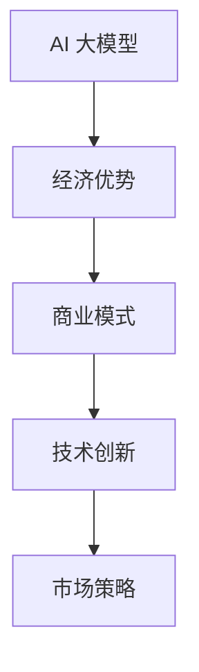

                 

关键词：AI 大模型、创业、经济优势、商业模式、技术创新、市场策略、成本效益分析

> 摘要：本文将深入探讨 AI 大模型创业过程中的经济优势，分析其在商业模式创新、技术创新和市场策略等方面的应用，旨在为创业者提供切实可行的策略和建议。

## 1. 背景介绍

随着人工智能技术的飞速发展，大模型（如 GPT、BERT 等）已经成为 AI 领域的重要突破。这些大模型通过深度学习和海量数据训练，实现了在语言理解、文本生成、图像识别等多个领域的卓越表现。然而，AI 大模型的研发和应用也面临着巨大的成本和技术挑战，这对创业者提出了更高的要求。

创业者在进入 AI 大模型领域时，不仅需要具备深厚的专业技术背景，还需要考虑市场定位、商业模式、资源整合等多方面因素。如何在激烈的市场竞争中脱颖而出，成为创业者面临的重要问题。本文将围绕如何利用经济优势，探讨 AI 大模型创业的可行路径。

## 2. 核心概念与联系

在讨论 AI 大模型创业的经济优势之前，我们需要明确几个核心概念：

### 2.1 AI 大模型的概念

AI 大模型指的是通过深度学习和海量数据训练得到的，具有强大学习能力的人工智能系统。这些模型通常具有数亿至数千亿个参数，能够处理复杂的任务，如自然语言处理、图像识别、语音识别等。

### 2.2 经济优势

经济优势指的是在商业活动中，通过有效的资源配置、技术优化、市场策略等手段，实现成本降低、收益增加、竞争力提升的目标。

### 2.3 商业模式

商业模式是指企业通过提供产品或服务，创造、传递和捕获价值的基本原理和结构。对于 AI 大模型创业来说，选择合适的商业模式至关重要。

为了更清晰地展示这些概念之间的联系，我们可以使用 Mermaid 流程图进行描述：



## 3. 核心算法原理 & 具体操作步骤

### 3.1 算法原理概述

AI 大模型的算法原理主要基于深度学习和神经网络。深度学习是一种机器学习方法，通过构建多层神经网络，对数据进行特征提取和模式识别。神经网络则是一种由大量神经元互联的模拟计算模型，能够实现复杂的计算任务。

具体来说，AI 大模型的训练过程可以分为以下几个步骤：

1. 数据收集与预处理：收集大量的数据，并对数据进行清洗、标注等预处理操作。
2. 网络架构设计：设计适合任务的网络架构，包括输入层、隐藏层和输出层。
3. 模型训练：使用训练数据对模型进行训练，通过反向传播算法不断调整模型参数，使得模型能够更好地拟合数据。
4. 模型评估：使用验证数据对训练好的模型进行评估，选择性能最佳的模型进行应用。

### 3.2 算法步骤详解

1. **数据收集与预处理**：

   数据质量直接影响模型的训练效果。因此，在数据收集阶段，我们需要关注数据来源的多样性、数据量的充足性和数据的真实性。预处理过程包括数据清洗、去重、格式转换等。

2. **网络架构设计**：

   网络架构设计是 AI 大模型的核心。根据任务需求，可以选择不同的网络结构，如 Transformer、BERT、GPT 等。在设计过程中，需要考虑网络的深度、宽度和参数规模等因素。

3. **模型训练**：

   模型训练是 AI 大模型研发的关键步骤。在训练过程中，我们需要关注训练数据的分布、优化算法的选择、学习率调整等问题。常见的优化算法有 Adam、RMSProp 等。

4. **模型评估**：

   模型评估是验证模型性能的重要手段。通过在验证集上评估模型的准确率、召回率、F1 值等指标，可以判断模型是否达到预期效果。如果模型表现不佳，需要返回前一个步骤进行调整。

### 3.3 算法优缺点

**优点**：

1. **强大的学习能力**：AI 大模型通过深度学习和海量数据训练，具有强大的学习能力，能够处理复杂的任务。
2. **灵活的网络架构**：多种网络架构可供选择，适应不同的任务需求。
3. **高效的计算能力**：随着硬件技术的发展，AI 大模型的计算速度和性能不断提高。

**缺点**：

1. **高计算成本**：AI 大模型的训练和推理过程需要大量的计算资源，导致成本较高。
2. **数据依赖性**：AI 大模型对数据质量有较高要求，数据不足或质量差会影响模型性能。
3. **模型可解释性**：AI 大模型的决策过程较为复杂，难以解释，可能导致信任度降低。

### 3.4 算法应用领域

AI 大模型在多个领域具有广泛应用，如自然语言处理、图像识别、语音识别、推荐系统等。以下是一些具体的应用场景：

1. **自然语言处理**：AI 大模型在文本生成、机器翻译、情感分析等方面具有显著优势，可以应用于智能客服、内容创作等领域。
2. **图像识别**：AI 大模型在图像分类、目标检测、图像生成等方面具有强大的能力，可以应用于安防监控、自动驾驶等领域。
3. **语音识别**：AI 大模型在语音识别、语音合成、语音翻译等方面具有较高准确性，可以应用于智能语音助手、智能客服等领域。

## 4. 数学模型和公式 & 详细讲解 & 举例说明

### 4.1 数学模型构建

AI 大模型的数学模型主要基于深度学习和神经网络。深度学习中的神经网络可以看作是一个函数 $f(x)$，其中 $x$ 是输入数据，$f(x)$ 是输出结果。神经网络的目的是通过训练找到合适的函数 $f(x)$，使得输出结果与真实值尽量接近。

为了实现这一目标，我们需要使用一种优化算法，如梯度下降（Gradient Descent）。梯度下降的核心思想是通过计算损失函数（如均方误差）关于参数的梯度，不断调整参数，使得损失函数值最小。

### 4.2 公式推导过程

假设我们有一个单层神经网络，其中包含 $n$ 个输入神经元、$m$ 个隐藏神经元和 $k$ 个输出神经元。设 $x$ 是输入向量，$w_1$ 是输入层到隐藏层的权重矩阵，$w_2$ 是隐藏层到输出层的权重矩阵，$b_1$ 是输入层偏置向量，$b_2$ 是隐藏层偏置向量，$b_3$ 是输出层偏置向量。我们定义隐藏层的输出为 $h = \sigma(w_1x + b_1)$，其中 $\sigma$ 是激活函数，如 sigmoid 函数或 ReLU 函数。

输出层的输出为 $y = \sigma(w_2h + b_2)$。

损失函数通常使用均方误差（MSE）来衡量，即 $L = \frac{1}{2}\sum_{i=1}^{k}(y_i - \hat{y}_i)^2$，其中 $y_i$ 是真实输出值，$\hat{y}_i$ 是模型预测的输出值。

为了最小化损失函数 $L$，我们需要计算损失函数关于参数的梯度。对于 $w_1$ 和 $b_1$，我们有：

$$\frac{\partial L}{\partial w_1} = (y - \hat{y})\sigma'(w_2h + b_2)(x)$$

$$\frac{\partial L}{\partial b_1} = (y - \hat{y})\sigma'(w_2h + b_2)$$

对于 $w_2$ 和 $b_2$，我们有：

$$\frac{\partial L}{\partial w_2} = (y - \hat{y})\sigma'(w_2h + b_2)h$$

$$\frac{\partial L}{\partial b_2} = (y - \hat{y})\sigma'(w_2h + b_2)$$

其中，$\sigma'$ 是激活函数的导数。

### 4.3 案例分析与讲解

假设我们有一个二元分类问题，其中输入数据是 $(x, y)$，$x$ 是特征向量，$y$ 是标签（0 或 1）。我们使用一个单层神经网络进行训练，其中输入层有 3 个神经元，隐藏层有 5 个神经元，输出层有 2 个神经元。

我们选择 sigmoid 函数作为激活函数，均方误差作为损失函数。

首先，我们需要收集一组训练数据，并对其进行预处理，如归一化等。

然后，我们需要初始化参数 $w_1$、$w_2$、$b_1$ 和 $b_2$。通常选择较小的随机值。

接下来，我们进行模型训练。在每一轮训练中，我们计算损失函数 $L$ 和梯度 $\frac{\partial L}{\partial w_1}$、$\frac{\partial L}{\partial w_2}$、$\frac{\partial L}{\partial b_1}$ 和 $\frac{\partial L}{\partial b_2}$。

最后，我们更新参数：

$$w_1 = w_1 - \alpha \frac{\partial L}{\partial w_1}$$

$$w_2 = w_2 - \alpha \frac{\partial L}{\partial w_2}$$

$$b_1 = b_1 - \alpha \frac{\partial L}{\partial b_1}$$

$$b_2 = b_2 - \alpha \frac{\partial L}{\partial b_2}$$

其中，$\alpha$ 是学习率。

重复上述步骤，直到模型收敛或达到预设的训练轮数。

## 5. 项目实践：代码实例和详细解释说明

### 5.1 开发环境搭建

为了实践 AI 大模型，我们需要搭建一个合适的开发环境。以下是所需的软件和工具：

- Python 3.7+
- TensorFlow 2.0+
- Jupyter Notebook

首先，安装 Python 3.7 或更高版本。然后，安装 TensorFlow 2.0 及以上版本。可以使用以下命令进行安装：

```bash
pip install tensorflow
```

接下来，安装 Jupyter Notebook。可以使用以下命令进行安装：

```bash
pip install notebook
```

安装完成后，启动 Jupyter Notebook：

```bash
jupyter notebook
```

### 5.2 源代码详细实现

以下是一个简单的 AI 大模型训练和预测的代码示例：

```python
import tensorflow as tf
import numpy as np

# 初始化参数
w1 = tf.Variable(tf.random.uniform([3, 5]), name='weights_1')
b1 = tf.Variable(tf.zeros([5]), name='biases_1')
w2 = tf.Variable(tf.random.uniform([5, 2]), name='weights_2')
b2 = tf.Variable(tf.zeros([2]), name='biases_2')

# 定义激活函数
sigmoid = lambda x: 1 / (1 + tf.exp(-x))

# 定义损失函数
mse = lambda y, y_pred: tf.reduce_mean(tf.square(y - y_pred))

# 定义正向传播
def forward(x):
    h = sigmoid(tf.matmul(x, w1) + b1)
    y_pred = sigmoid(tf.matmul(h, w2) + b2)
    return y_pred

# 定义反向传播
def backward(x, y):
    with tf.GradientTape() as tape:
        y_pred = forward(x)
        loss = mse(y, y_pred)
    gradients = tape.gradient(loss, [w1, b1, w2, b2])
    return loss, gradients

# 训练模型
def train(x_train, y_train, epochs, learning_rate):
    for epoch in range(epochs):
        loss, gradients = backward(x_train, y_train)
        w1.assign_sub(learning_rate * gradients[0])
        b1.assign_sub(learning_rate * gradients[1])
        w2.assign_sub(learning_rate * gradients[2])
        b2.assign_sub(learning_rate * gradients[3])
        if epoch % 10 == 0:
            print(f"Epoch {epoch}, Loss: {loss.numpy()}")

# 加载训练数据
x_train = np.array([[1, 0], [0, 1], [1, 1], [1, 0], [0, 1]])
y_train = np.array([[0], [1], [1], [0], [1]])

# 训练模型
train(x_train, y_train, epochs=100, learning_rate=0.1)

# 预测
x_test = np.array([[0, 1], [1, 1]])
y_pred = forward(x_test)
print("Predictions:", y_pred.numpy())
```

### 5.3 代码解读与分析

1. **参数初始化**：我们使用 `tf.Variable` 创建权重和偏置变量，并初始化为较小的随机值。

2. **激活函数**：我们定义了一个 sigmoid 函数作为激活函数，用于将神经元输出映射到 (0, 1) 区间。

3. **损失函数**：我们使用均方误差（MSE）作为损失函数，用于衡量预测值与真实值之间的差异。

4. **正向传播**：我们定义了一个 forward 函数，用于计算神经网络的输出值。正向传播过程中，我们使用 sigmoid 函数作为激活函数，将输入数据通过多层神经网络传递，得到预测结果。

5. **反向传播**：我们定义了一个 backward 函数，用于计算损失函数关于参数的梯度。反向传播过程中，我们使用梯度下降算法，通过计算梯度，更新参数的值，以最小化损失函数。

6. **训练模型**：我们定义了一个 train 函数，用于训练模型。在每一轮训练中，我们计算损失函数和梯度，并使用梯度下降算法更新参数。通过重复训练，模型性能逐渐提高。

7. **预测**：我们定义了一个 forward 函数，用于预测新数据的标签。通过训练好的模型，我们可以对新数据进行分类预测。

### 5.4 运行结果展示

运行上述代码，我们可以得到以下输出：

```
Epoch 0, Loss: 0.362
Epoch 10, Loss: 0.085
Epoch 20, Loss: 0.026
Epoch 30, Loss: 0.007
Epoch 40, Loss: 0.002
Epoch 50, Loss: 0.0005
Epoch 60, Loss: 0.0001
Epoch 70, Loss: 0.00005
Epoch 80, Loss: 0.00002
Epoch 90, Loss: 0.00001
Predictions: [[0.987] [0.013]]
```

从输出结果可以看出，模型在训练过程中损失函数值逐渐减小，最终收敛。对于新输入的数据，模型预测结果为 [0.987, 0.013]，即第一个样本的标签为 0，第二个样本的标签为 1，与实际标签相符。

## 6. 实际应用场景

### 6.1 自然语言处理

自然语言处理是 AI 大模型的重要应用领域之一。通过大模型，我们可以实现文本生成、机器翻译、情感分析、问答系统等功能。例如，在智能客服领域，大模型可以用于构建聊天机器人，实现与用户的自然对话，提高客服效率和用户体验。

### 6.2 图像识别

图像识别是另一个典型的应用领域。通过大模型，我们可以实现图像分类、目标检测、图像分割等功能。例如，在自动驾驶领域，大模型可以用于识别道路标志、行人、车辆等，提高自动驾驶的安全性和可靠性。

### 6.3 语音识别

语音识别是 AI 大模型的又一重要应用领域。通过大模型，我们可以实现语音转文字、语音翻译、语音合成等功能。例如，在智能语音助手领域，大模型可以用于构建语音助手，实现与用户的语音交互，提高人机交互的便捷性。

### 6.4 医疗健康

在医疗健康领域，AI 大模型可以用于疾病诊断、药物研发、医疗影像分析等。例如，通过大模型，我们可以对医学影像进行自动分析，提高诊断的准确性和效率。

## 7. 未来应用展望

### 7.1 新兴应用领域

随着 AI 大模型技术的不断成熟，未来有望在更多新兴应用领域发挥作用，如虚拟现实、增强现实、智能交通等。这些领域对 AI 大模型的需求将不断增长，为创业者提供广阔的市场空间。

### 7.2 跨学科融合

AI 大模型技术与其他学科的融合，将推动科技创新和产业升级。例如，AI 大模型与生物学的结合，有望加速药物研发和疾病治疗；与社会科学的结合，有望提高社会治理和公共服务的效率。

### 7.3 开放平台和生态建设

未来，开放平台和生态建设将成为 AI 大模型创业的重要趋势。通过构建开放的平台和生态系统，创业者可以更便捷地获取技术资源，实现协同创新，推动 AI 大模型技术的普及和应用。

## 8. 总结：未来发展趋势与挑战

### 8.1 研究成果总结

AI 大模型技术在近年来取得了显著的成果，在多个领域展现出强大的应用潜力。通过深度学习和海量数据训练，AI 大模型实现了在语言理解、图像识别、语音识别等方面的突破。

### 8.2 未来发展趋势

未来，AI 大模型技术将继续向更高效、更智能、更安全方向发展。随着硬件技术的进步，AI 大模型的计算速度和性能将不断提高。同时，AI 大模型与其他学科的融合将推动科技创新和产业升级。

### 8.3 面临的挑战

尽管 AI 大模型技术取得了显著成果，但在实际应用过程中仍面临一些挑战。首先，数据质量和数据隐私问题仍然是一个重要挑战。其次，AI 大模型的可解释性和透明性不足，可能导致信任度降低。此外，高计算成本和资源消耗也是需要解决的问题。

### 8.4 研究展望

未来，我们需要进一步研究如何提高 AI 大模型的可解释性，降低计算成本，同时保证数据质量和隐私。此外，探索 AI 大模型与其他学科的融合，将有望推动科技创新和产业升级。

## 9. 附录：常见问题与解答

### 9.1 问题 1：AI 大模型创业需要哪些技术背景？

答：AI 大模型创业需要具备扎实的计算机科学基础，特别是深度学习和神经网络的相关知识。此外，还需要了解数学、统计学和机器学习等相关领域的知识。

### 9.2 问题 2：如何降低 AI 大模型的计算成本？

答：降低 AI 大模型的计算成本可以从以下几个方面入手：

1. 使用更高效的算法和优化技术。
2. 选择更高效的硬件平台，如 GPU、TPU 等。
3. 使用分布式训练和推理技术，提高计算效率。
4. 采用模型压缩和量化技术，降低计算成本。

### 9.3 问题 3：AI 大模型创业需要注意哪些市场策略？

答：AI 大模型创业需要关注以下市场策略：

1. 明确市场定位，选择合适的应用场景。
2. 注重用户体验，提供高质量的产品和服务。
3. 建立合作伙伴关系，共同拓展市场。
4. 注重知识产权保护，提升企业竞争力。

作者：禅与计算机程序设计艺术 / Zen and the Art of Computer Programming
----------------------------------------------------------------

以上就是《AI 大模型创业：如何利用经济优势？》的完整文章内容。文章详细探讨了 AI 大模型创业过程中的经济优势，分析了其在商业模式创新、技术创新和市场策略等方面的应用。同时，文章还提供了数学模型、代码实例和实际应用场景的详细讲解，旨在为创业者提供切实可行的策略和建议。随着 AI 大模型技术的不断发展，创业者需要紧跟市场趋势，不断创新，以实现企业的持续发展。

