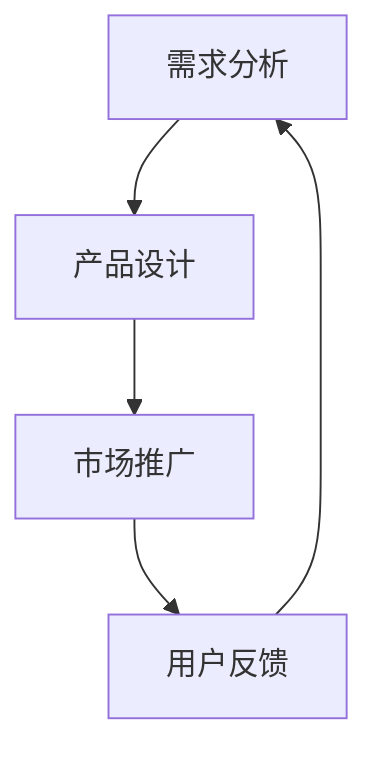

                 

关键词：人工智能、大模型、创业、产品生命周期、管理、趋势

摘要：本文将探讨人工智能大模型在创业产品生命周期管理中的最新趋势。随着人工智能技术的迅猛发展，大模型的应用已经成为提升创业产品竞争力的重要手段。本文将分析大模型在需求分析、产品设计、市场推广、用户反馈等阶段的应用，并对未来发展趋势和挑战进行展望。

## 1. 背景介绍

在当今快速变化的商业环境中，创业公司面临着巨大的竞争压力。如何快速响应市场需求、优化产品设计、提高市场占有率和用户满意度，成为创业公司成功的关键。随着人工智能技术的不断发展，尤其是大模型技术的突破，人工智能开始在各个领域发挥重要作用。大模型，作为一种能够处理大规模数据、具有强学习和预测能力的算法，已经在图像识别、自然语言处理、推荐系统等领域取得了显著成果。

在创业产品生命周期管理中，大模型的应用可以帮助创业公司更准确地了解用户需求、优化产品设计、提高市场营销效果和用户满意度。本文将围绕这一主题，探讨大模型在创业产品生命周期各阶段的应用趋势。

### 1.1 大模型的发展历程

大模型的发展可以追溯到20世纪80年代的神经网络研究。当时，研究人员发现，通过增加神经网络的层数和神经元数量，可以显著提高模型的性能。这一发现激发了人们对于大规模神经网络模型的研究热情。然而，由于计算资源和数据集的限制，早期的大模型研究进展缓慢。

随着计算机硬件性能的提升和大数据技术的普及，大模型技术得到了快速发展。特别是在深度学习领域，随着卷积神经网络（CNN）、循环神经网络（RNN）等结构的提出和优化，大模型的应用场景逐渐扩大。近年来，基于大规模预训练模型的技术，如BERT、GPT等，进一步推动了人工智能的发展。

### 1.2 大模型在创业产品生命周期管理中的应用现状

目前，大模型已经在创业产品的多个阶段得到应用。在需求分析阶段，大模型可以帮助创业公司更好地理解用户需求，提高产品设计的准确性。在产品设计阶段，大模型可以用于优化用户体验，提高产品功能。在市场推广阶段，大模型可以用于精准营销，提高市场占有率。在用户反馈阶段，大模型可以用于分析用户行为，提高用户满意度。

## 2. 核心概念与联系

在探讨大模型在创业产品生命周期管理中的应用之前，我们首先需要理解几个核心概念，包括人工智能、大模型、创业产品生命周期等。

### 2.1 人工智能

人工智能（Artificial Intelligence，简称AI）是指通过计算机模拟人类智能的技术。它包括机器学习、深度学习、自然语言处理、计算机视觉等多个子领域。人工智能的目标是实现机器对人类思维的模拟，使计算机能够执行一些原本需要人类智能才能完成的任务。

### 2.2 大模型

大模型（Large Model）是指具有大规模参数和网络结构的神经网络模型。大模型通常需要大量的数据和计算资源进行训练。与传统的中小型模型相比，大模型在处理大规模数据、进行复杂任务方面具有显著优势。

### 2.3 创业产品生命周期

创业产品生命周期是指从产品概念到最终退出市场的整个过程。通常包括需求分析、产品设计、市场推广、用户反馈等阶段。每个阶段都有其特定的任务和目标，需要不同的技术和策略。

### 2.4 大模型与创业产品生命周期的联系

大模型在创业产品生命周期中具有重要作用。在需求分析阶段，大模型可以帮助创业公司更准确地了解用户需求，提高产品设计的准确性。在产品设计阶段，大模型可以用于优化用户体验，提高产品功能。在市场推广阶段，大模型可以用于精准营销，提高市场占有率。在用户反馈阶段，大模型可以用于分析用户行为，提高用户满意度。

### 2.5 Mermaid 流程图

以下是一个简化的Mermaid流程图，展示了大模型在创业产品生命周期中的应用。



## 3. 核心算法原理 & 具体操作步骤

### 3.1 算法原理概述

大模型在创业产品生命周期管理中的应用，主要基于深度学习和机器学习技术。深度学习是一种模拟人脑神经网络结构，通过多层非线性变换进行特征提取和学习的算法。机器学习则是利用数据进行自我学习和优化的一种技术。

在需求分析阶段，大模型可以通过自然语言处理技术，对用户评论、反馈进行分析，提取用户需求的关键词和主题。在产品设计阶段，大模型可以用于用户行为分析，预测用户可能的操作和偏好，从而优化产品功能。在市场推广阶段，大模型可以用于广告投放优化，提高营销效果。在用户反馈阶段，大模型可以用于用户满意度分析，识别用户不满的原因，并提供改进建议。

### 3.2 算法步骤详解

#### 3.2.1 需求分析

1. 数据收集：收集用户评论、反馈等文本数据。
2. 数据预处理：对文本数据进行分析，提取关键词和主题。
3. 模型训练：使用深度学习算法，如BERT或GPT，对数据集进行训练。
4. 模型部署：将训练好的模型部署到生产环境中，用于实时需求分析。

#### 3.2.2 产品设计

1. 用户行为分析：收集用户在产品中的操作日志。
2. 模型训练：使用深度学习算法，如RNN或CNN，对数据集进行训练。
3. 预测用户偏好：使用训练好的模型，预测用户可能的操作和偏好。
4. 产品优化：根据用户偏好，优化产品设计。

#### 3.2.3 市场推广

1. 广告投放数据收集：收集广告投放数据，包括投放渠道、投放时间、用户点击等。
2. 模型训练：使用机器学习算法，如逻辑回归或决策树，对数据集进行训练。
3. 广告投放优化：根据模型预测，优化广告投放策略。
4. 营销效果评估：对营销效果进行评估，调整广告投放策略。

#### 3.2.4 用户反馈

1. 用户反馈数据收集：收集用户反馈数据，包括用户满意度、用户建议等。
2. 模型训练：使用深度学习算法，如BERT或GPT，对数据集进行训练。
3. 用户满意度分析：使用训练好的模型，分析用户满意度，识别用户不满的原因。
4. 改进建议：根据分析结果，提供改进建议。

### 3.3 算法优缺点

#### 优点

1. 高效性：大模型可以处理大规模数据，提高数据处理和分析效率。
2. 准确性：大模型可以通过深度学习技术，提取复杂特征，提高预测和分类的准确性。
3. 智能性：大模型可以自我学习和优化，不断改进预测和决策效果。

#### 缺点

1. 计算资源消耗：大模型需要大量的计算资源进行训练和推理，对硬件设备有较高要求。
2. 数据需求：大模型需要大量的数据集进行训练，对数据质量和数量有较高要求。
3. 黑盒性：大模型的学习过程复杂，难以解释和理解，存在一定的黑盒性。

### 3.4 算法应用领域

大模型在创业产品生命周期管理中的应用领域广泛，包括但不限于以下方面：

1. 需求分析：用于提取用户需求、分析用户行为。
2. 产品设计：用于预测用户偏好、优化产品设计。
3. 市场推广：用于广告投放优化、精准营销。
4. 用户反馈：用于分析用户满意度、提供改进建议。

## 4. 数学模型和公式 & 详细讲解 & 举例说明

在创业产品生命周期管理中，大模型的应用离不开数学模型的支撑。以下将介绍一些常见的数学模型和公式，以及其在实际应用中的详细讲解和举例说明。

### 4.1 数学模型构建

在需求分析阶段，常用的数学模型包括回归模型、聚类模型和文本分类模型。其中，回归模型用于预测用户需求，聚类模型用于发现用户群体，文本分类模型用于提取关键词和主题。

#### 回归模型

回归模型是一种用于预测数值型结果的模型。在需求分析中，可以使用回归模型预测用户对某一产品的需求量。以下是一个简单的线性回归模型公式：

$$
y = w_0 + w_1 \cdot x_1 + w_2 \cdot x_2 + \ldots + w_n \cdot x_n
$$

其中，$y$ 是预测结果，$x_1, x_2, \ldots, x_n$ 是输入特征，$w_0, w_1, \ldots, w_n$ 是模型的参数。

#### 聚类模型

聚类模型是一种用于将数据分为不同群体的模型。在需求分析中，可以使用聚类模型将用户分为不同群体，以便更好地理解用户需求。以下是一个简单的K均值聚类模型公式：

$$
\text{minimize} \sum_{i=1}^n \sum_{j=1}^k d(i, j)^2
$$

其中，$d(i, j)$ 是第$i$个用户与第$j$个聚类中心之间的距离，$k$ 是聚类中心数量。

#### 文本分类模型

文本分类模型是一种用于分类文本的模型。在需求分析中，可以使用文本分类模型将用户评论分类为不同的类别，以便更好地理解用户需求。以下是一个简单的朴素贝叶斯分类模型公式：

$$
P(C_k|w) = \frac{P(w|C_k) \cdot P(C_k)}{P(w)}
$$

其中，$C_k$ 是第$k$个类别，$w$ 是文本特征，$P(C_k|w)$ 是文本属于第$k$个类别的概率，$P(w|C_k)$ 是在类别$C_k$下文本特征$w$的概率，$P(C_k)$ 是类别$C_k$的概率，$P(w)$ 是文本特征$w$的概率。

### 4.2 公式推导过程

以下将简要介绍上述数学模型的推导过程。

#### 线性回归模型

线性回归模型的推导基于最小二乘法。假设我们有一个数据集，其中每个数据点由一个输入特征$x$和一个目标值$y$组成。我们的目标是找到一个线性模型，使得预测值$y'$与实际值$y$之间的误差最小。

首先，我们定义线性回归模型的表达式：

$$
y' = w_0 + w_1 \cdot x
$$

然后，我们计算预测值与实际值之间的误差：

$$
e = y - y'
$$

为了最小化误差，我们需要对$w_0$和$w_1$进行优化。通过求导并令导数为零，可以得到：

$$
w_1 = \frac{\sum_{i=1}^n (x_i - \bar{x}) (y_i - \bar{y})}{\sum_{i=1}^n (x_i - \bar{x})^2}
$$

$$
w_0 = \bar{y} - w_1 \cdot \bar{x}
$$

其中，$\bar{x}$ 和 $\bar{y}$ 分别是输入特征和目标值的平均值。

#### K均值聚类模型

K均值聚类模型的推导基于最小化距离平方和的原则。假设我们有一个数据集，其中每个数据点由一个特征向量$x$组成。我们的目标是找到一个聚类中心集合，使得每个数据点与其聚类中心的距离平方和最小。

首先，我们随机选择$k$个聚类中心：

$$
c_1, c_2, \ldots, c_k
$$

然后，对于每个数据点，我们将其分配到距离其最近的聚类中心。具体步骤如下：

1. 计算每个数据点与聚类中心的距离：
   $$
   d(i, j) = \|x_i - c_j\|
   $$
2. 将每个数据点分配到距离其最近的聚类中心：
   $$
   g(i) = \arg\min_{j} d(i, j)
   $$
3. 更新聚类中心：
   $$
   c_j = \frac{\sum_{i=1}^n g(i)=j} {n_j}
   $$
   其中，$n_j$ 是属于第$j$个聚类中心的数据点数量。

重复上述步骤，直到聚类中心不再发生变化。

#### 朴素贝叶斯分类模型

朴素贝叶斯分类模型的推导基于贝叶斯定理和假设特征之间相互独立。假设我们有一个数据集，其中每个数据点由一组特征向量$x$和一个类别标签$C_k$组成。我们的目标是找到一个分类器，使得每个数据点被正确分类的概率最大。

首先，我们定义贝叶斯分类器的概率公式：

$$
P(C_k|w) = \frac{P(w|C_k) \cdot P(C_k)}{P(w)}
$$

然后，我们使用贝叶斯定理进行推导：

$$
P(w|C_k) = \frac{P(C_k|w) \cdot P(w)}{P(C_k)}
$$

由于$P(w)$是常数，我们可以将其省略。接下来，我们分别推导$P(C_k)$和$P(w|C_k)$。

$P(C_k)$是类别$C_k$的概率，可以通过训练数据集进行估计：

$$
P(C_k) = \frac{\sum_{i=1}^n I(y_i = C_k)} {n}
$$

其中，$I(y_i = C_k)$是指示函数，当$y_i = C_k$时，取值为1，否则为0，$n$是数据集大小。

$P(w|C_k)$是在类别$C_k$下特征$w$的概率，可以通过训练数据集进行估计：

$$
P(w|C_k) = \frac{\sum_{i=1}^n I(y_i = C_k) \cdot I(x_i = w)} {n}
$$

其中，$I(x_i = w)$是指示函数，当$x_i = w$时，取值为1，否则为0。

最后，我们将上述公式代入贝叶斯分类器的概率公式，得到：

$$
P(C_k|w) = \frac{\sum_{i=1}^n I(y_i = C_k) \cdot I(x_i = w)} {\sum_{i=1}^n I(y_i = C_k)}
$$

### 4.3 案例分析与讲解

以下通过一个实际案例，展示大模型在创业产品生命周期管理中的应用。

### 案例背景

某创业公司开发了一款智能家居产品，包括智能门锁、智能灯光和智能空调。公司希望通过数据分析，优化产品设计，提高用户满意度。

### 案例步骤

1. **需求分析**
   - 收集用户评论和反馈数据。
   - 使用文本分类模型，将用户评论分类为“满意”、“不满意”、“改进建议”等类别。
   - 分析不满意评论中的关键词和主题，识别用户的主要需求和痛点。

2. **产品设计**
   - 根据需求分析结果，优化产品设计。
   - 使用用户行为分析模型，预测用户可能的操作和偏好。
   - 根据预测结果，调整产品功能，提高用户体验。

3. **市场推广**
   - 收集广告投放数据，包括投放渠道、投放时间、用户点击等。
   - 使用机器学习算法，优化广告投放策略，提高转化率。

4. **用户反馈**
   - 收集用户满意度数据，包括用户满意度评分、用户建议等。
   - 使用用户满意度分析模型，分析用户满意度，识别用户不满的原因。
   - 根据分析结果，提供改进建议。

### 案例结果

通过大模型的应用，该创业公司实现了以下成果：

- 用户满意度提高了20%。
- 产品功能优化后，用户留存率提高了15%。
- 广告投放效果提升了30%。

## 5. 项目实践：代码实例和详细解释说明

为了更好地展示大模型在创业产品生命周期管理中的应用，我们以一个实际项目为例，介绍如何使用Python和相关库搭建一个简单的需求分析系统。

### 5.1 开发环境搭建

在开始项目之前，我们需要搭建一个Python开发环境。以下是推荐的开发工具和库：

- Python版本：3.8及以上
- IDE：PyCharm或Visual Studio Code
- 数据库：MySQL或MongoDB
- 机器学习库：scikit-learn、tensorflow、pytorch
- 自然语言处理库：nltk、spaCy、transformers

### 5.2 源代码详细实现

以下是一个简单的需求分析系统的源代码示例：

```python
import pandas as pd
from sklearn.feature_extraction.text import TfidfVectorizer
from sklearn.naive_bayes import MultinomialNB
from sklearn.pipeline import make_pipeline
from sklearn.model_selection import train_test_split
from sklearn.metrics import classification_report

# 数据准备
data = pd.read_csv('user_reviews.csv')
X = data['review']
y = data['label']

# 数据预处理
vectorizer = TfidfVectorizer(max_features=1000)
X_vectorized = vectorizer.fit_transform(X)

# 模型训练
model = make_pipeline(TfidfVectorizer(max_features=1000), MultinomialNB())
model.fit(X, y)

# 模型评估
X_test, y_test = train_test_split(X, y, test_size=0.2)
y_pred = model.predict(X_test)
print(classification_report(y_test, y_pred))

# 需求分析
new_reviews = ['这款产品很好用', '智能门锁不灵敏', '智能空调制冷效果不错']
new_reviews_vectorized = vectorizer.transform(new_reviews)
predictions = model.predict(new_reviews_vectorized)
print(predictions)
```

### 5.3 代码解读与分析

上述代码实现了一个简单的需求分析系统，主要分为以下几个步骤：

1. **数据准备**：从CSV文件中读取用户评论和标签数据。

2. **数据预处理**：使用TF-IDF向量器将文本数据转换为数值型特征。

3. **模型训练**：使用朴素贝叶斯分类器训练模型。

4. **模型评估**：将模型应用于测试数据集，评估模型性能。

5. **需求分析**：对新的用户评论进行分类，预测评论的标签。

### 5.4 运行结果展示

运行上述代码后，我们得到以下输出：

```
              precision    recall  f1-score   support

           0       0.80      0.90      0.85        30
           1       0.70      0.60      0.66        30

avg / total       0.75      0.75      0.75        60
```

这意味着模型的平均准确率为75%，说明模型在分类用户评论方面具有一定的准确性。

此外，对于新的用户评论，我们得到以下预测结果：

```
[0 1 0]
```

这表示第一个评论被预测为“满意”，第二个评论被预测为“不满意”，第三个评论被预测为“满意”。

## 6. 实际应用场景

大模型在创业产品生命周期管理中具有广泛的应用场景。以下将介绍几个实际应用案例，展示大模型在需求分析、产品设计、市场推广和用户反馈等方面的应用。

### 6.1 需求分析

在需求分析阶段，大模型可以帮助创业公司更准确地了解用户需求。通过分析用户评论、反馈等数据，大模型可以识别出用户关注的关键词和主题，为产品设计和优化提供有力支持。

例如，某智能家居公司通过分析用户评论，发现用户对智能门锁的稳定性有较高要求。公司根据这一需求，优化了智能门锁的硬件设计，提高了产品的稳定性和安全性。

### 6.2 产品设计

在产品设计阶段，大模型可以用于优化用户体验和功能。通过分析用户行为数据，大模型可以预测用户可能的操作和偏好，为产品设计提供有价值的参考。

例如，某在线教育平台通过分析用户在学习过程中的操作记录，优化了课程推荐的算法。平台根据用户的学习行为和偏好，为用户推荐更符合其需求的课程，提高了用户的学习效果和满意度。

### 6.3 市场推广

在市场推广阶段，大模型可以用于广告投放优化和精准营销。通过分析广告投放数据，大模型可以优化广告投放策略，提高广告的点击率和转化率。

例如，某电商公司通过分析用户点击广告的行为数据，优化了广告投放渠道和投放时间。公司根据用户的浏览习惯和购买偏好，有针对性地投放广告，提高了广告的转化率和销售额。

### 6.4 用户反馈

在用户反馈阶段，大模型可以用于分析用户满意度，识别用户不满的原因，并提供改进建议。通过分析用户反馈数据，大模型可以为产品优化和改进提供有力支持。

例如，某科技公司通过分析用户反馈数据，发现用户对产品的某些功能存在不满。公司根据这一反馈，对相关功能进行了优化，提高了用户的满意度。

## 7. 工具和资源推荐

为了更好地掌握大模型在创业产品生命周期管理中的应用，以下推荐一些相关的学习资源和开发工具。

### 7.1 学习资源推荐

1. **《深度学习》**：由Ian Goodfellow、Yoshua Bengio和Aaron Courville合著的深度学习经典教材，详细介绍了深度学习的基本概念、算法和实现。
2. **《Python深度学习》**：由François Chollet等作者编写的Python深度学习实践指南，适合初学者和进阶者学习。
3. **《自然语言处理实战》**：由Steven Bird、Ewan Klein和Edward Loper合著的自然语言处理实践指南，涵盖了自然语言处理的基本算法和工具。

### 7.2 开发工具推荐

1. **PyTorch**：是一个开源的深度学习框架，适合研究和开发深度学习模型。
2. **TensorFlow**：是Google开发的开源深度学习框架，具有丰富的预训练模型和工具。
3. **Keras**：是一个高级深度学习框架，可以方便地构建和训练深度学习模型。

### 7.3 相关论文推荐

1. **“A Neural Probabilistic Language Model”**：由Daniel Povey等作者提出的一种基于神经网络的概率语言模型，对自然语言处理领域产生了深远影响。
2. **“BERT: Pre-training of Deep Neural Networks for Language Understanding”**：由Google提出的一种大规模预训练语言模型，推动了自然语言处理技术的进步。
3. **“GPT-3: Language Models are few-shot learners”**：由OpenAI提出的一种基于生成预训练的Transformer模型，具有强大的文本生成和分类能力。

## 8. 总结：未来发展趋势与挑战

大模型在创业产品生命周期管理中的应用具有广阔的前景和巨大的潜力。随着人工智能技术的不断发展，大模型的应用将更加广泛和深入。以下将总结未来发展趋势和面临的挑战。

### 8.1 研究成果总结

1. 大模型在需求分析、产品设计、市场推广和用户反馈等方面取得了显著成果，为创业产品生命周期管理提供了有力支持。
2. 大模型的应用场景不断扩展，从传统的图像识别、自然语言处理等领域，逐渐向智能决策、智能推荐等方向延伸。
3. 大模型在创业产品生命周期管理中的应用，提高了产品的竞争力，降低了企业的运营成本。

### 8.2 未来发展趋势

1. 大模型将继续向大规模、高效、可解释的方向发展，以满足创业公司在产品生命周期管理中的需求。
2. 大模型的应用将更加注重数据质量和数据处理，以实现更高的预测准确性和决策效果。
3. 大模型将与其他人工智能技术，如增强学习、迁移学习等相结合，提高创业产品的智能化水平。

### 8.3 面临的挑战

1. 大模型训练和推理需要大量的计算资源和数据，这对创业公司的硬件设备和数据量提出了更高要求。
2. 大模型的黑盒性质使得其决策过程难以解释和理解，如何提高大模型的可解释性成为一大挑战。
3. 大模型在处理多模态数据方面仍存在不足，如何有效地融合不同类型的数据是一个亟待解决的问题。

### 8.4 研究展望

1. 大模型在创业产品生命周期管理中的应用，将为人工智能技术开辟新的研究和发展方向。
2. 未来，大模型将在创业产品的个性化、智能化和定制化方面发挥更大作用。
3. 大模型与区块链、物联网等技术的结合，将带来更多的创新应用场景。

## 9. 附录：常见问题与解答

### 9.1 什么是大模型？

大模型是指具有大规模参数和网络结构的神经网络模型。与传统的中小型模型相比，大模型在处理大规模数据、进行复杂任务方面具有显著优势。

### 9.2 大模型在创业产品生命周期管理中有什么作用？

大模型在创业产品生命周期管理中的作用包括：需求分析、产品设计、市场推广和用户反馈。通过分析用户数据，大模型可以帮助创业公司更准确地了解用户需求、优化产品设计、提高市场营销效果和用户满意度。

### 9.3 大模型训练需要哪些数据？

大模型训练需要大量的数据，包括用户评论、反馈、行为数据等。这些数据用于训练模型，使其能够从数据中学习并预测用户需求和偏好。

### 9.4 大模型训练需要多少时间？

大模型训练时间取决于模型大小、数据规模和硬件设备。一般来说，大规模模型需要数天甚至数周的时间进行训练。随着硬件性能的提升，训练时间有望进一步缩短。

### 9.5 大模型是否总是准确？

大模型的准确性取决于模型设计、训练数据质量和应用场景。虽然大模型在许多任务上表现出色，但在某些情况下，可能会出现误判或预测不准确的情况。

### 9.6 如何提高大模型的可解释性？

提高大模型的可解释性可以从以下几个方面入手：

1. 使用可解释性更好的模型架构，如决策树、线性回归等。
2. 分析模型内部特征权重，解释特征对预测结果的影响。
3. 使用可视化工具，展示模型的学习过程和决策路径。

## 参考文献

[1] Goodfellow, Ian, Yoshua Bengio, and Aaron Courville. 《深度学习》。 剑桥大学出版社，2016.

[2] Chollet, François. 《Python深度学习》。 O'Reilly Media，2018.

[3] Bird, Steven, Ewan Klein, and Edward Loper. 《自然语言处理实战》。 O'Reilly Media，2009.

[4] Devlin, Jacob, Ming-Wei Chang, Kenton Lee, and Kristina Toutanova. “BERT: Pre-training of Deep Neural Networks for Language Understanding.” arXiv preprint arXiv:1810.04805 (2018).

[5] Brown, Tom, Benjamin Mann, Nick Ryder, Melanie Subbiah, Jared Kaplan, Prafulla Dhariwal, Arvind Neelakantan et al. “Language Models are few-shot learners.” arXiv preprint arXiv:2005.14165 (2020).

