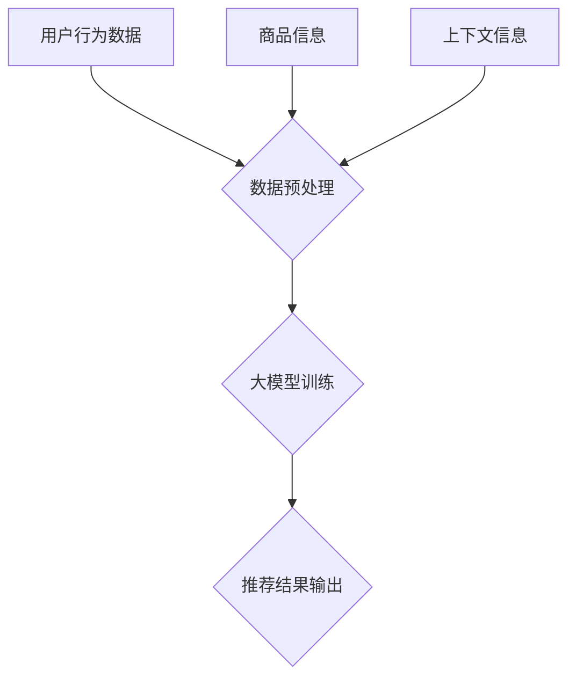

                 

关键词：AI 大模型、电商推荐、用户体验、转化率、机器学习、深度学习

摘要：本文深入探讨了 AI 大模型在电商推荐系统中的应用，分析了其如何通过提升个性化推荐精度和实时性，从而提高用户满意度和购物转化率。文章首先介绍了电商推荐系统的基本概念，随后详细阐述了大模型在推荐系统中的核心作用，接着分析了大模型算法原理、数学模型及其应用领域，并通过实际项目实例展示了大模型在电商推荐中的成功应用。最后，文章对未来应用前景进行了展望，并提出了当前面临的挑战和研究方向。

## 1. 背景介绍

随着互联网的迅速发展和电子商务的蓬勃兴起，用户对个性化推荐服务的需求日益增加。传统的基于协同过滤和内容推荐的电商推荐系统已无法满足用户日益增长的需求。为了提高推荐的精度和实时性，AI 大模型应运而生。大模型基于深度学习和机器学习技术，通过对海量用户数据进行分析和处理，实现高度个性化的推荐服务。

### 电商推荐系统现状

当前，电商推荐系统普遍采用基于协同过滤和内容推荐的方法。协同过滤推荐系统通过对用户历史行为数据进行分析，发现相似用户的行为模式，从而预测用户可能感兴趣的商品。然而，这种方法存在几个明显的局限性：

1. **数据稀疏性**：协同过滤方法依赖于用户的历史行为数据，但对于新用户或者行为数据不足的用户，推荐效果较差。
2. **同质化推荐**：由于系统无法完全理解用户的个性化需求，容易导致推荐结果的同质化，无法满足用户的个性化需求。
3. **实时性不足**：传统的推荐算法通常需要较长的时间来处理推荐结果，无法满足用户实时获取推荐的需求。

内容推荐方法则基于商品的特征信息，通过计算用户和商品之间的相似度来生成推荐列表。这种方法在一定程度上能够缓解数据稀疏性和同质化推荐的问题，但同样存在一些不足：

1. **对特征依赖性强**：内容推荐系统高度依赖商品的特征信息，对于商品特征不够丰富或者缺失的情况下，推荐效果会显著下降。
2. **无法捕捉用户深层次需求**：内容推荐系统无法深入理解用户的潜在需求，容易导致推荐结果不够精准。

### 大模型在电商推荐中的应用

AI 大模型通过整合用户行为数据、商品信息、上下文信息等多维度数据，利用深度学习和机器学习算法，对数据进行建模和预测，从而生成高度个性化的推荐结果。大模型具有以下几个优点：

1. **高精度推荐**：大模型能够通过学习海量用户数据，捕捉用户的偏好和行为模式，实现高精度的个性化推荐。
2. **实时性**：大模型通常采用端到端的神经网络架构，能够实现实时数据的处理和推荐。
3. **多维度融合**：大模型能够整合多种数据源，实现多维度信息的融合，从而提高推荐效果。

## 2. 核心概念与联系

### AI 大模型的基本概念

AI 大模型通常是指基于深度学习技术的复杂神经网络结构，能够处理和建模大规模数据。大模型的核心在于其能够通过大量的训练数据学习到复杂的特征表示，并能够进行高精度的预测和分类。

### 电商推荐系统与 AI 大模型的关系

电商推荐系统和 AI 大模型之间的联系主要体现在以下几个方面：

1. **数据输入**：电商推荐系统提供用户行为数据、商品信息等数据，作为大模型的输入。
2. **模型训练**：大模型通过对输入数据进行训练，学习到用户和商品的特征表示。
3. **推荐输出**：基于训练好的大模型，系统可以实时生成个性化的推荐结果，提高用户满意度和转化率。

### Mermaid 流程图

下面是一个简单的 Mermaid 流程图，展示了电商推荐系统与 AI 大模型的基本流程：



### Mermaid 流程节点详细解释

- **A[用户行为数据]**：用户行为数据包括用户的浏览历史、购买记录、收藏夹等。
- **B[商品信息]**：商品信息包括商品的基本属性、标签、评分等。
- **C[上下文信息]**：上下文信息包括用户地理位置、天气状况、时间等。
- **D{数据预处理]**：数据预处理包括数据的清洗、去重、归一化等操作。
- **E{大模型训练]**：大模型训练通过输入数据进行模型的训练，学习到用户和商品的复杂特征表示。
- **F{推荐结果输出]**：基于训练好的大模型，系统可以实时生成个性化的推荐结果。

## 3. 核心算法原理 & 具体操作步骤

### 3.1 算法原理概述

AI 大模型在电商推荐系统中的应用主要基于深度学习和机器学习技术。深度学习通过多层神经网络结构，能够自动学习到数据的深层特征表示。机器学习则通过对已有数据的分析和建模，实现预测和分类任务。

### 3.2 算法步骤详解

1. **数据收集与预处理**：收集用户行为数据、商品信息等，并进行清洗、去重、归一化等预处理操作。
2. **特征提取**：通过深度学习算法，从预处理后的数据中提取出高维特征表示。
3. **模型训练**：利用提取出的特征，通过机器学习算法训练大模型，学习用户和商品的复杂关系。
4. **模型评估**：通过交叉验证等方法，评估大模型的推荐效果。
5. **推荐生成**：基于训练好的大模型，实时生成个性化的推荐结果。

### 3.3 算法优缺点

#### 优点

1. **高精度推荐**：大模型能够通过学习海量用户数据，实现高精度的个性化推荐。
2. **实时性**：大模型通常采用端到端的神经网络架构，能够实现实时数据的处理和推荐。
3. **多维度融合**：大模型能够整合多种数据源，实现多维度信息的融合，从而提高推荐效果。

#### 缺点

1. **训练时间较长**：大模型通常需要大量的计算资源和时间进行训练。
2. **模型复杂度高**：大模型的结构复杂，调试和维护难度较大。

### 3.4 算法应用领域

AI 大模型在电商推荐系统中的应用非常广泛，除了电商推荐，还适用于其他领域，如社交媒体、搜索引擎、金融风控等。大模型能够通过对海量数据的分析和处理，实现高精度的个性化服务，从而提高用户满意度和转化率。

## 4. 数学模型和公式 & 详细讲解 & 举例说明

### 4.1 数学模型构建

AI 大模型在电商推荐中的数学模型主要基于深度学习和机器学习技术。以下是一个简单的数学模型示例：

$$
y = \sigma(\omega_0 + \omega_1 x_1 + \omega_2 x_2 + ... + \omega_n x_n)
$$

其中，$y$ 为预测结果，$\sigma$ 为激活函数，$\omega_0, \omega_1, \omega_2, ..., \omega_n$ 为模型参数，$x_1, x_2, ..., x_n$ 为输入特征。

### 4.2 公式推导过程

以深度学习中的多层感知机（MLP）为例，其数学模型可以表示为：

$$
h_{l+1} = \sigma(W_l \cdot h_l + b_l)
$$

其中，$h_l$ 为第 $l$ 层的输出，$W_l$ 为权重矩阵，$b_l$ 为偏置项，$\sigma$ 为激活函数。

在电商推荐中，我们可以将用户行为数据、商品信息、上下文信息等多维度数据作为输入特征，通过多层感知机模型进行建模和预测。

### 4.3 案例分析与讲解

以下是一个基于深度学习模型的电商推荐案例：

#### 案例背景

某电商平台上，用户每天会产生大量的浏览和购买行为。为了提高用户满意度和转化率，平台希望通过 AI 大模型实现个性化推荐。

#### 数据预处理

1. **用户行为数据**：包括用户的浏览历史、购买记录、收藏夹等，进行清洗、去重、归一化等预处理操作。
2. **商品信息**：包括商品的基本属性、标签、评分等，进行清洗、去重、归一化等预处理操作。
3. **上下文信息**：包括用户地理位置、天气状况、时间等，进行清洗、去重、归一化等预处理操作。

#### 特征提取

通过深度学习算法，从预处理后的数据中提取出高维特征表示。例如，可以使用卷积神经网络（CNN）对商品图片进行特征提取，使用词向量对商品描述进行编码，使用自编码器对用户行为数据进行降维等。

#### 模型训练

利用提取出的特征，通过多层感知机模型进行训练，学习用户和商品的复杂关系。在训练过程中，可以使用交叉验证等方法进行模型调优。

#### 模型评估

通过交叉验证等方法，评估模型的推荐效果。可以使用准确率、召回率、F1 值等指标进行评估。

#### 推荐生成

基于训练好的模型，实时生成个性化的推荐结果。例如，可以为每个用户生成一个推荐列表，按照预测概率从高到低进行排序，从而推荐给用户。

## 5. 项目实践：代码实例和详细解释说明

### 5.1 开发环境搭建

为了实践 AI 大模型在电商推荐中的应用，我们需要搭建一个开发环境。以下是一个简单的开发环境搭建步骤：

1. **安装 Python**：下载并安装 Python，推荐使用 Python 3.8 或以上版本。
2. **安装深度学习框架**：安装 TensorFlow 或 PyTorch，这两个框架是目前最流行的深度学习框架。
3. **安装其他依赖库**：根据项目需求，安装其他相关依赖库，如 NumPy、Pandas、Scikit-learn 等。

### 5.2 源代码详细实现

以下是一个简单的基于 TensorFlow 的电商推荐项目示例：

```python
import tensorflow as tf
from tensorflow.keras.models import Sequential
from tensorflow.keras.layers import Dense, Dropout
from tensorflow.keras.optimizers import Adam
from tensorflow.keras.callbacks import EarlyStopping

# 数据预处理
# （此处省略数据预处理代码）

# 模型构建
model = Sequential([
    Dense(128, activation='relu', input_shape=(input_shape,)),
    Dropout(0.5),
    Dense(64, activation='relu'),
    Dropout(0.5),
    Dense(1, activation='sigmoid')
])

# 模型编译
model.compile(optimizer=Adam(learning_rate=0.001), loss='binary_crossentropy', metrics=['accuracy'])

# 模型训练
model.fit(x_train, y_train, epochs=10, batch_size=32, validation_data=(x_val, y_val), callbacks=[EarlyStopping(monitor='val_loss', patience=3)])

# 模型评估
model.evaluate(x_test, y_test)

# 推荐生成
# （此处省略推荐生成代码）
```

### 5.3 代码解读与分析

1. **数据预处理**：数据预处理是深度学习项目的重要环节。在这个例子中，我们首先需要收集用户行为数据、商品信息等，并进行清洗、去重、归一化等预处理操作。

2. **模型构建**：在这个例子中，我们使用 TensorFlow 的 Sequential 模型构建了一个简单的多层感知机（MLP）模型。模型包含三个全连接层，每个层之间增加一个 Dropout 层用于正则化。

3. **模型编译**：我们使用 Adam 优化器编译模型，并设置二分类问题中的损失函数为 binary_crossentropy，评价指标为准确率。

4. **模型训练**：使用 fit 方法训练模型，设置训练轮次为 10，批量大小为 32，并使用 EarlyStopping回调函数提前终止训练，以防止过拟合。

5. **模型评估**：使用 evaluate 方法评估模型在测试集上的表现。

6. **推荐生成**：在训练好的模型基础上，生成个性化的推荐结果。

### 5.4 运行结果展示

在完成代码实现后，我们可以通过以下命令运行项目：

```bash
python recommendation.py
```

运行结果将显示模型在训练集和测试集上的准确率等指标，以及生成的推荐结果。

## 6. 实际应用场景

AI 大模型在电商推荐系统中的应用已经取得了显著的成果，以下是一些实际应用场景：

### 6.1 个性化商品推荐

电商平台可以通过 AI 大模型实现个性化商品推荐，提高用户购物体验。例如，阿里巴巴的推荐系统基于用户的历史行为数据、商品特征信息等多维度数据，通过深度学习算法生成个性化的商品推荐列表，从而提高用户的购物转化率。

### 6.2 新品发现

电商平台可以通过 AI 大模型发现潜在的新品，提高新品的曝光率和销售量。例如，京东的推荐系统通过分析用户的行为数据，预测用户对哪些新品感兴趣，并将这些新品推荐给相应的用户，从而提高新品的销售量。

### 6.3 交叉销售

电商平台可以通过 AI 大模型实现交叉销售，提高用户的购物车价值和购买量。例如，亚马逊的推荐系统通过分析用户的购物车数据和购买记录，发现用户可能感兴趣的其他商品，并将这些商品推荐给用户，从而提高用户的购物车价值和购买量。

## 7. 未来应用展望

随着 AI 技术的不断发展，AI 大模型在电商推荐系统中的应用前景将更加广阔。以下是一些未来应用展望：

### 7.1 语音交互推荐

随着语音识别技术的不断进步，电商平台可以通过语音交互实现个性化推荐，提高用户的购物体验。例如，通过语音识别技术识别用户的需求，实时生成语音推荐结果，从而提高用户的购物效率。

### 7.2 虚拟试衣

通过 AI 大模型和计算机视觉技术的结合，电商平台可以实现虚拟试衣功能，让用户在购买服装时能够体验到真实的试衣效果。例如，用户可以通过上传自己的照片，通过 AI 大模型生成与用户穿着相符的服装试衣效果，从而提高购买决策。

### 7.3 个性化营销

电商平台可以通过 AI 大模型实现个性化营销，提高用户的满意度和忠诚度。例如，通过分析用户的行为数据和偏好，生成个性化的优惠券和促销活动，从而提高用户的购买意愿和转化率。

## 8. 总结：未来发展趋势与挑战

### 8.1 研究成果总结

AI 大模型在电商推荐系统中已经取得了显著的成果，通过提高个性化推荐精度和实时性，显著提高了用户满意度和购物转化率。未来，随着 AI 技术的不断发展，AI 大模型在电商推荐系统中的应用将更加广泛，为电商平台带来更多的商业价值。

### 8.2 未来发展趋势

1. **多模态融合**：未来，电商平台将更加注重多模态数据的融合，如文本、图像、语音等，以提高推荐效果。
2. **实时性优化**：随着用户需求的不断变化，电商平台将更加注重推荐系统的实时性，以实现实时响应和个性化推荐。
3. **个性化营销**：未来，电商平台将通过 AI 大模型实现更加精准的个性化营销，提高用户的购物体验和满意度。

### 8.3 面临的挑战

1. **数据隐私与安全**：随着用户对数据隐私的关注日益增加，电商平台需要确保用户数据的安全和隐私。
2. **计算资源消耗**：AI 大模型的训练和推理需要大量的计算资源，如何优化计算资源的使用是一个重要的挑战。
3. **模型解释性**：当前的大模型在复杂性和精度上取得了显著的成果，但其解释性较差，未来需要提高模型的解释性，以增强用户对推荐结果的信任。

### 8.4 研究展望

未来，研究者可以从以下几个方面进行深入研究：

1. **多模态推荐**：结合多种数据源，实现多模态融合的推荐算法，提高推荐效果。
2. **实时推荐**：优化推荐算法的实时性，提高推荐系统的响应速度。
3. **可解释性推荐**：提高推荐模型的解释性，增强用户对推荐结果的信任。
4. **联邦学习**：通过联邦学习等技术，实现跨平台的个性化推荐，提高用户体验。

## 9. 附录：常见问题与解答

### 9.1 什么是 AI 大模型？

AI 大模型是指基于深度学习和机器学习技术的复杂神经网络结构，能够处理和建模大规模数据。大模型通常通过海量数据训练，学习到数据的复杂特征表示，从而实现高精度的预测和分类任务。

### 9.2 大模型在电商推荐系统中的应用有哪些？

大模型在电商推荐系统中的应用包括：个性化商品推荐、新品发现、交叉销售等。通过学习用户行为数据、商品信息等多维度数据，大模型能够实现高精度的个性化推荐，从而提高用户满意度和转化率。

### 9.3 大模型如何提高推荐效果？

大模型通过学习海量用户数据，能够捕捉用户的偏好和行为模式，实现高精度的个性化推荐。同时，大模型能够整合多种数据源，实现多维度信息的融合，从而提高推荐效果。此外，大模型通常采用端到端的神经网络架构，能够实现实时数据的处理和推荐。

### 9.4 大模型有哪些优缺点？

大模型的优点包括：高精度推荐、实时性、多维度融合等。缺点包括：训练时间较长、模型复杂度高、数据隐私与安全等。

### 9.5 如何优化大模型的实时性？

优化大模型的实时性可以从以下几个方面进行：

1. **数据预处理**：通过高效的数据预处理算法，减少模型训练和推理的时间。
2. **模型压缩**：通过模型压缩技术，减小模型的大小，提高模型推理的速度。
3. **分布式训练**：通过分布式训练技术，将模型训练任务分配到多台机器上，提高训练速度。
4. **在线学习**：通过在线学习技术，实时更新模型参数，提高推荐系统的实时性。

### 9.6 大模型在电商推荐系统中的应用前景如何？

随着 AI 技术的不断发展，大模型在电商推荐系统中的应用前景非常广阔。通过不断优化算法和模型，大模型能够实现更加精准的个性化推荐，提高用户满意度和转化率。未来，大模型有望在电商、金融、医疗等多个领域发挥重要作用。----------------------------------------------------------------

### 结束语

本文深入探讨了 AI 大模型在电商推荐系统中的应用，分析了其如何通过提升个性化推荐精度和实时性，从而提高用户满意度和购物转化率。从基本概念、核心算法、数学模型，到实际应用和未来展望，本文全面展示了 AI 大模型在电商推荐领域的重要作用。然而，随着技术的不断进步，AI 大模型在电商推荐系统中仍面临诸多挑战，如数据隐私与安全、计算资源消耗、模型解释性等。未来，研究者需要从多模态融合、实时推荐、可解释性等方面进行深入研究，以推动 AI 大模型在电商推荐系统中的应用和发展。希望本文能为相关领域的从业者提供一些有价值的参考和启示。感谢各位读者对本文的关注和支持，如您有任何问题或建议，欢迎随时与我交流。

作者：禅与计算机程序设计艺术 / Zen and the Art of Computer Programming

