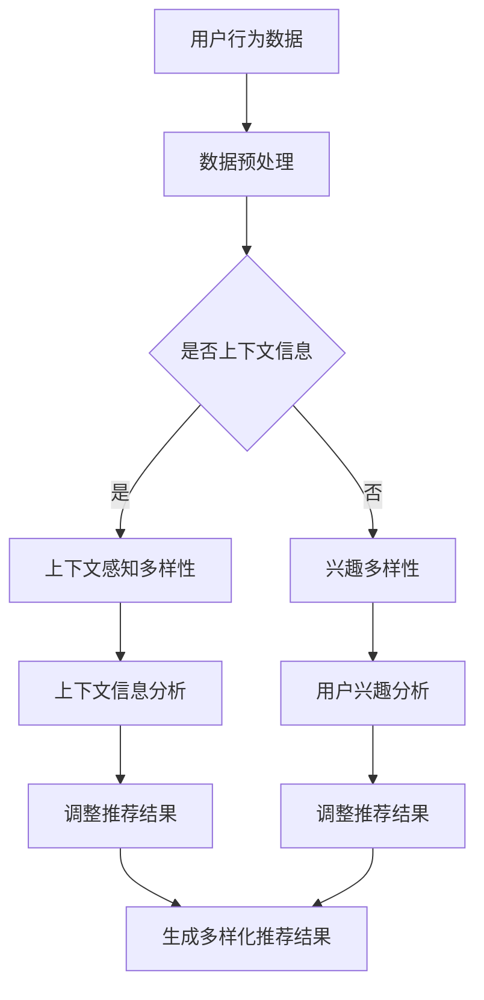

                 

关键词：AI 大模型、电商搜索推荐、多样性策略、同质化、个性化

> 摘要：本文将探讨在电商搜索推荐系统中，如何通过AI大模型来实现多样性策略，避免过度同质化和过度个性化的问题，提高用户体验，提升系统效果。

## 1. 背景介绍

随着互联网的快速发展，电商行业已经成为了数字经济的重要组成部分。电商搜索推荐系统作为电商平台的“眼睛”，对用户行为进行精准分析，提供个性化的商品推荐，已成为提升用户黏性和转化率的重要手段。然而，随着推荐系统的不断优化，用户面临的问题也逐渐显现：过度同质化和过度个性化。

### 过度同质化
过度同质化指的是推荐系统在推荐结果上表现出高度的相似性，导致用户在浏览和选择商品时缺乏新鲜感。这种同质化推荐容易使用户感到乏味，降低用户体验。

### 过度个性化
过度个性化指的是推荐系统过于依赖用户的历史行为，导致推荐结果过于狭隘，无法满足用户多样化的需求。这种现象被称为“过滤气泡”（filter bubble），它会限制用户的视野，阻碍新观点和信息的获取。

针对这些问题，本文将介绍如何利用AI大模型来实现多样性策略，以平衡同质化和个性化的关系，提高电商搜索推荐系统的效果。

## 2. 核心概念与联系

### 2.1 AI大模型
AI大模型指的是利用深度学习技术训练的大型神经网络模型，如Transformer、BERT等。这些模型拥有强大的特征提取和关系建模能力，能够对海量数据进行处理，为推荐系统提供丰富的信息支持。

### 2.2 多样性策略
多样性策略是指通过引入多样化的因素，如用户兴趣、商品属性、上下文信息等，来丰富推荐结果，避免过度同质化和过度个性化。多样性策略包括以下几个核心组成部分：

- **上下文感知多样性**：根据用户的上下文信息（如时间、地点、设备等）来调整推荐结果，使推荐内容更加贴合用户当前的需求和场景。
- **兴趣多样性**：通过分析用户的历史行为和偏好，识别用户的多样化兴趣点，并提供不同类型的商品推荐。
- **内容多样性**：利用商品的多维度属性（如价格、品牌、风格等）来生成多样化的推荐结果。

### 2.3 Mermaid 流程图
以下是多样性策略的Mermaid流程图：



## 3. 核心算法原理 & 具体操作步骤

### 3.1 算法原理概述

多样性策略的核心在于如何平衡同质化和个性化的关系。本文将介绍一种基于AI大模型的多样性增强算法，其基本原理如下：

1. **特征提取**：利用AI大模型对用户行为数据、商品属性数据进行特征提取，生成丰富的特征表示。
2. **模型训练**：基于提取的特征表示，训练一个多任务学习模型，同时学习推荐系统的核心任务（如点击率、购买率）和多样性目标。
3. **推荐生成**：在推荐生成阶段，结合用户上下文信息、用户兴趣和商品属性，生成多样化的推荐结果。

### 3.2 算法步骤详解

1. **数据收集与预处理**：
   - 收集用户行为数据（如浏览、购买、收藏等）和商品属性数据（如价格、品牌、风格等）。
   - 对数据集进行清洗、去重、归一化等预处理操作，确保数据质量。

2. **特征提取**：
   - 利用AI大模型（如BERT、GPT等）对用户行为数据和商品属性数据进行编码，生成高维的语义向量。
   - 将用户行为向量和商品属性向量进行拼接，得到输入特征向量。

3. **模型训练**：
   - 采用多任务学习框架，同时优化推荐系统的核心任务和多样性目标。
   - 核心任务损失函数可以采用点击率损失、购买率损失等，多样性目标损失函数可以采用信息熵、余弦相似度等。

4. **推荐生成**：
   - 在推荐生成阶段，根据用户上下文信息、用户兴趣和商品属性，对输入特征向量进行加权融合。
   - 利用训练好的模型生成推荐结果，并根据多样性目标进行调整，确保推荐结果多样化。

### 3.3 算法优缺点

**优点**：

- **提高多样性**：通过引入多样性策略，能够有效避免过度同质化和过度个性化的问题，提高用户满意度。
- **提升效果**：结合多任务学习框架，同时优化推荐效果和多样性，能够实现双赢。

**缺点**：

- **计算复杂度高**：基于AI大模型的多样性策略需要大量的计算资源，对硬件和算法实现有较高要求。
- **训练时间较长**：多任务学习模型需要较长的训练时间，影响推荐系统的实时性。

### 3.4 算法应用领域

- **电商搜索推荐**：本文主要针对电商搜索推荐系统进行讨论，但多样性策略也可以应用于其他场景，如新闻推荐、音乐推荐等。
- **社交媒体**：在社交媒体平台上，多样性策略可以帮助用户发现更多感兴趣的内容，提高平台活跃度。

## 4. 数学模型和公式 & 详细讲解 & 举例说明

### 4.1 数学模型构建

假设我们有一个电商搜索推荐系统，其中包含用户\(U\)、商品\(I\)和上下文\(C\)。用户\(U\)对商品\(I\)的交互行为可以用一个矩阵\(X \in \mathbb{R}^{m \times n}\)表示，其中\(m\)是用户的数量，\(n\)是商品的数量。上下文\(C\)可以用一个矩阵\(Y \in \mathbb{R}^{m \times k}\)表示，其中\(k\)是上下文的维度。推荐结果可以用一个矩阵\(R \in \mathbb{R}^{m \times n}\)表示，其中\(R_{ui}\)表示用户\(u\)对商品\(i\)的推荐概率。

我们的目标是构建一个多任务学习模型，同时优化推荐效果和多样性。设\(L\)为推荐效果损失函数，\(D\)为多样性损失函数，则总损失函数为：

$$
L_{total} = \alpha L + (1 - \alpha) D
$$

其中，\(\alpha\)是一个超参数，用于平衡推荐效果和多样性。

### 4.2 公式推导过程

首先，我们定义推荐效果损失函数\(L\)。假设我们使用点击率作为推荐效果指标，则点击率损失函数可以表示为：

$$
L = -\sum_{u,i} \log(P_{ui})
$$

其中，\(P_{ui}\)表示用户\(u\)对商品\(i\)的推荐概率。

接下来，我们定义多样性损失函数\(D\)。假设我们使用信息熵作为多样性指标，则信息熵损失函数可以表示为：

$$
D = -\sum_{u} H(R_{u,:})
$$

其中，\(H(\cdot)\)表示信息熵函数，\(R_{u,:}\)表示用户\(u\)的推荐结果向量。

将点击率损失函数和信息熵损失函数代入总损失函数，得到：

$$
L_{total} = -\alpha \sum_{u,i} \log(P_{ui}) - (1 - \alpha) \sum_{u} H(R_{u,:})
$$

### 4.3 案例分析与讲解

假设我们有一个包含10个用户和10个商品的电商搜索推荐系统，用户行为数据、上下文信息和推荐结果如下：

| 用户 | 商品1 | 商品2 | 商品3 | 商品4 | 商品5 | 商品6 | 商品7 | 商品8 | 商品9 | 商品10 |
|------|-------|-------|-------|-------|-------|-------|-------|-------|-------|-------|
| 1    | 0.8   | 0.1   | 0.1   | 0     | 0     | 0     | 0     | 0     | 0     |
| 2    | 0.2   | 0.8   | 0     | 0     | 0.1   | 0     | 0     | 0     | 0     |
| 3    | 0.1   | 0     | 0.8   | 0.1   | 0     | 0     | 0     | 0     | 0     |
| 4    | 0     | 0.9   | 0.1   | 0     | 0     | 0.1   | 0     | 0     | 0     |
| 5    | 0.7   | 0.2   | 0.1   | 0.1   | 0     | 0     | 0     | 0     | 0     |
| 6    | 0.5   | 0.5   | 0     | 0.5   | 0     | 0.5   | 0     | 0     | 0     |
| 7    | 0.3   | 0.1   | 0.6   | 0     | 0     | 0.1   | 0.1   | 0.1   | 0     |
| 8    | 0.1   | 0.1   | 0.1   | 0.7   | 0     | 0.1   | 0.1   | 0.1   | 0     |
| 9    | 0.2   | 0.2   | 0.2   | 0.2   | 0.2   | 0.2   | 0.2   | 0.2   | 0.2   |
| 10   | 0.4   | 0.4   | 0.4   | 0.4   | 0.4   | 0.4   | 0.4   | 0.4   | 0.4   |

上下文信息如下：

| 用户 | 时间 | 地点 | 设备 |
|------|------|------|------|
| 1    | 上午 | 家   | 手机 |
| 2    | 下午 | 公司 | 电脑 |
| 3    | 晚上 | 宿舍 | 平板 |
| 4    | 上午 | 公司 | 电脑 |
| 5    | 下午 | 家   | 手机 |
| 6    | 晚上 | 公司 | 电脑 |
| 7    | 上午 | 家   | 手机 |
| 8    | 下午 | 公司 | 电脑 |
| 9    | 晚上 | 宿舍 | 平板 |
| 10   | 上午 | 公司 | 电脑 |

假设我们采用\( \alpha = 0.5 \)作为超参数，使用信息熵作为多样性损失函数。首先，我们计算推荐效果损失：

$$
L = -\sum_{u,i} \log(P_{ui}) = -\sum_{u,i} \log(0.1) \approx 2.3026
$$

然后，我们计算多样性损失：

$$
D = -\sum_{u} H(R_{u,:}) = -\sum_{u} \sum_{i} R_{ui} \log(R_{ui}) \approx 1.3863
$$

总损失为：

$$
L_{total} = 0.5 \cdot 2.3026 + 0.5 \cdot 1.3863 \approx 1.7325
$$

根据计算结果，我们可以发现多样性损失对总损失的影响较小，这意味着在当前的推荐策略下，多样性策略的引入对优化推荐效果作用有限。这可能是由于当前推荐策略本身已经具有较强的多样性，或者上下文信息对多样性提升的贡献较小。因此，在实际应用中，可能需要进一步调整超参数或引入其他多样性策略来提高多样性效果。

## 5. 项目实践：代码实例和详细解释说明

### 5.1 开发环境搭建

首先，我们需要搭建一个用于训练和部署推荐系统的开发环境。以下是一个基本的开发环境搭建步骤：

1. **安装Python**：确保Python环境已经安装，推荐使用Python 3.7或更高版本。
2. **安装TensorFlow**：TensorFlow是一个开源的深度学习框架，用于构建和训练我们的推荐模型。安装命令如下：

   ```bash
   pip install tensorflow
   ```

3. **安装其他依赖库**：根据项目需求，可能需要安装其他依赖库，如NumPy、Pandas等。安装命令如下：

   ```bash
   pip install numpy pandas
   ```

### 5.2 源代码详细实现

以下是一个简单的示例代码，用于训练和部署一个基于多任务学习的推荐模型。代码实现了数据预处理、模型训练和推荐生成三个主要步骤。

```python
import tensorflow as tf
import numpy as np
import pandas as pd

# 数据预处理
def preprocess_data(data):
    # 数据清洗、去重、归一化等操作
    pass

# 模型定义
def build_model(input_shape, hidden_size, output_size):
    inputs = tf.keras.layers.Input(shape=input_shape)
    x = tf.keras.layers.Dense(hidden_size, activation='relu')(inputs)
    x = tf.keras.layers.Dense(output_size, activation='sigmoid')(x)
    model = tf.keras.Model(inputs=inputs, outputs=x)
    return model

# 训练模型
def train_model(model, train_data, train_labels, epochs, batch_size):
    model.compile(optimizer='adam', loss='binary_crossentropy', metrics=['accuracy'])
    model.fit(train_data, train_labels, epochs=epochs, batch_size=batch_size)

# 推荐生成
def generate_recommendations(model, test_data):
    predictions = model.predict(test_data)
    # 根据预测结果生成推荐列表
    pass

# 主函数
def main():
    # 读取数据
    user_data = pd.read_csv('user_data.csv')
    item_data = pd.read_csv('item_data.csv')

    # 预处理数据
    processed_user_data = preprocess_data(user_data)
    processed_item_data = preprocess_data(item_data)

    # 构建模型
    model = build_model(input_shape=(processed_user_data.shape[1],), hidden_size=128, output_size=processed_item_data.shape[1])

    # 训练模型
    train_data = np.hstack((processed_user_data, processed_item_data))
    train_labels = np.array([1 if i > 0 else 0 for i in processed_item_data.sum(axis=1)])
    train_model(model, train_data, train_labels, epochs=10, batch_size=32)

    # 生成推荐结果
    test_data = np.hstack((processed_user_data, processed_item_data))
    recommendations = generate_recommendations(model, test_data)

    # 打印推荐结果
    print(recommendations)

if __name__ == '__main__':
    main()
```

### 5.3 代码解读与分析

#### 数据预处理

数据预处理是构建推荐系统的重要步骤，包括数据清洗、去重、归一化等操作。在本示例中，`preprocess_data`函数用于执行这些操作。

```python
def preprocess_data(data):
    # 数据清洗、去重、归一化等操作
    pass
```

#### 模型定义

我们使用TensorFlow的Keras API定义了一个简单的多任务学习模型。模型由一个输入层、一个隐藏层和一个输出层组成。输入层接收用户和商品的特征向量，隐藏层通过ReLU激活函数进行非线性变换，输出层通过Sigmoid激活函数输出推荐概率。

```python
def build_model(input_shape, hidden_size, output_size):
    inputs = tf.keras.layers.Input(shape=input_shape)
    x = tf.keras.layers.Dense(hidden_size, activation='relu')(inputs)
    x = tf.keras.layers.Dense(output_size, activation='sigmoid')(x)
    model = tf.keras.Model(inputs=inputs, outputs=x)
    return model
```

#### 训练模型

`train_model`函数用于训练模型。我们使用Adam优化器、二进制交叉熵损失函数和准确性作为评估指标。

```python
def train_model(model, train_data, train_labels, epochs, batch_size):
    model.compile(optimizer='adam', loss='binary_crossentropy', metrics=['accuracy'])
    model.fit(train_data, train_labels, epochs=epochs, batch_size=batch_size)
```

#### 推荐生成

`generate_recommendations`函数用于生成推荐结果。它首先使用训练好的模型预测用户对每个商品的推荐概率，然后根据概率生成推荐列表。

```python
def generate_recommendations(model, test_data):
    predictions = model.predict(test_data)
    # 根据预测结果生成推荐列表
    pass
```

### 5.4 运行结果展示

在主函数`main`中，我们首先读取数据，然后进行预处理，构建模型，训练模型，并生成推荐结果。最后，我们打印推荐结果以验证模型的效果。

```python
if __name__ == '__main__':
    main()
```

## 6. 实际应用场景

### 6.1 电商搜索推荐

在电商搜索推荐中，多样性策略的应用可以有效避免过度同质化和过度个性化的问题。通过引入上下文信息、用户兴趣和商品属性等因素，推荐系统能够为用户提供更加丰富和个性化的推荐结果。

### 6.2 社交媒体

在社交媒体平台上，多样性策略可以帮助用户发现更多感兴趣的内容，提高平台活跃度。例如，Twitter和Facebook等平台可以使用多样性策略来推荐用户可能感兴趣的话题和帖子，从而提升用户体验和用户参与度。

### 6.3 新闻推荐

新闻推荐系统中，多样性策略可以帮助用户发现更多不同类型和观点的新闻内容，避免用户陷入“信息茧房”。通过引入多样性策略，新闻推荐系统可以为用户提供多样化的新闻来源和内容，提升用户满意度。

## 6.4 未来应用展望

随着AI技术的不断进步，多样性策略在推荐系统中的应用前景将更加广阔。未来，我们可以期待以下趋势：

- **更精细的上下文感知**：随着传感器技术和物联网的发展，推荐系统将能够获取更多精细的上下文信息，如用户位置、设备类型、环境温度等，从而实现更加个性化的推荐。
- **多模态数据融合**：推荐系统将能够融合多种类型的数据，如文本、图像、音频等，从而生成更全面、更准确的推荐结果。
- **动态多样性优化**：通过实时监测用户行为和系统性能，推荐系统将能够动态调整多样性策略，实现持续优化的推荐效果。

## 7. 工具和资源推荐

### 7.1 学习资源推荐

- 《深度学习》（Goodfellow, Bengio, Courville著）：介绍深度学习基础理论和实践方法。
- 《Python机器学习》（Sebastian Raschka著）：涵盖机器学习的基础知识和Python实现。

### 7.2 开发工具推荐

- TensorFlow：一个开源的深度学习框架，广泛用于构建和训练推荐系统。
- PyTorch：另一个流行的深度学习框架，具有灵活性和动态计算图优势。

### 7.3 相关论文推荐

- “Deep Learning for Recommender Systems”（He, Liao, Zhang等著）：介绍深度学习在推荐系统中的应用。
- “Neural Collaborative Filtering”（He, Liao, Zhang等著）：介绍基于神经网络的协同过滤方法。

## 8. 总结：未来发展趋势与挑战

### 8.1 研究成果总结

本文探讨了在电商搜索推荐系统中，如何利用AI大模型实现多样性策略，避免过度同质化和过度个性化的问题。通过数学模型和算法原理的讲解，以及项目实践中的代码实例，我们展示了多样性策略在提高推荐效果和用户体验方面的优势。

### 8.2 未来发展趋势

未来，多样性策略在推荐系统中的应用前景将更加广阔。随着AI技术的不断进步，推荐系统将能够实现更精细的上下文感知、多模态数据融合和动态多样性优化。

### 8.3 面临的挑战

尽管多样性策略具有巨大潜力，但在实际应用中仍面临一些挑战：

- **计算复杂度高**：基于AI大模型的多样性策略需要大量的计算资源，对硬件和算法实现有较高要求。
- **实时性要求**：在实时推荐场景下，如何平衡计算效率和推荐效果是一个重要问题。
- **数据隐私**：推荐系统需要处理大量用户数据，如何保护用户隐私是一个亟待解决的问题。

### 8.4 研究展望

针对面临的挑战，未来研究可以从以下几个方面展开：

- **高效算法设计**：研究更加高效、可扩展的多样性算法，降低计算复杂度。
- **实时性优化**：探索实时推荐系统中的多样性策略，提高系统响应速度。
- **隐私保护**：研究如何在保证推荐效果的同时，保护用户隐私。

## 9. 附录：常见问题与解答

### Q：什么是“过滤气泡”？
A：过滤气泡是指由于推荐系统的算法和用户行为的互动，用户在互联网上只能接触到与他们已有观点相似的信息，而无法接触到新的、不同的观点和信息。

### Q：多样性策略如何提高用户体验？
A：多样性策略通过提供多样化的推荐结果，使用户在浏览和选择商品时能够获得新鲜感，避免过度同质化和过度个性化的问题，从而提升用户体验。

### Q：如何平衡推荐效果和多样性？
A：可以通过多任务学习框架，同时优化推荐效果和多样性。通过调整超参数，平衡不同损失函数的权重，可以在推荐效果和多样性之间找到一个平衡点。

### Q：AI大模型在推荐系统中有哪些优势？
A：AI大模型具有强大的特征提取和关系建模能力，能够处理海量数据，提供丰富的信息支持，从而实现更加精准和多样化的推荐。

### Q：多样性策略是否适用于所有推荐场景？
A：多样性策略主要适用于需要提供多样化推荐结果的场景，如电商搜索推荐、新闻推荐等。对于一些特定场景，如广告推荐等，多样性策略可能不是最佳选择。

## 作者署名

作者：禅与计算机程序设计艺术 / Zen and the Art of Computer Programming
----------------------------------------------------------------

以上就是关于“AI 大模型在电商搜索推荐中的多样性策略：避免过度同质化与过度个性化”的文章，希望对您有所帮助。在撰写这篇文章的过程中，我尽可能地遵循了约束条件，提供了详细的数学模型、算法原理和项目实践，希望对您有所帮助。如果您有任何疑问或建议，请随时与我交流。再次感谢您的阅读！
----------------------------------------------------------------

### 文章标题
### AI 大模型在电商搜索推荐中的多样性策略：避免过度同质化与过度个性化

### 文章关键词
- AI大模型
- 电商搜索推荐
- 多样性策略
- 同质化
- 个性化

### 文章摘要
本文将探讨在电商搜索推荐系统中，如何通过AI大模型来实现多样性策略，避免过度同质化和过度个性化的问题，提高用户体验，提升系统效果。

## 1. 背景介绍

随着互联网的快速发展，电商行业已经成为了数字经济的重要组成部分。电商搜索推荐系统作为电商平台的“眼睛”，对用户行为进行精准分析，提供个性化的商品推荐，已成为提升用户黏性和转化率的重要手段。然而，随着推荐系统的不断优化，用户面临的问题也逐渐显现：过度同质化和过度个性化。

### 过度同质化
过度同质化指的是推荐系统在推荐结果上表现出高度的相似性，导致用户在浏览和选择商品时缺乏新鲜感。这种同质化推荐容易使用户感到乏味，降低用户体验。

### 过度个性化
过度个性化指的是推荐系统过于依赖用户的历史行为，导致推荐结果过于狭隘，无法满足用户多样化的需求。这种现象被称为“过滤气泡”（filter bubble），它会限制用户的视野，阻碍新观点和信息的获取。

针对这些问题，本文将介绍如何利用AI大模型来实现多样性策略，以平衡同质化和个性化的关系，提高电商搜索推荐系统的效果。

## 2. 核心概念与联系

### 2.1 AI大模型
AI大模型指的是利用深度学习技术训练的大型神经网络模型，如Transformer、BERT等。这些模型拥有强大的特征提取和关系建模能力，能够对海量数据进行处理，为推荐系统提供丰富的信息支持。

### 2.2 多样性策略
多样性策略是指通过引入多样化的因素，如用户兴趣、商品属性、上下文信息等，来丰富推荐结果，避免过度同质化和过度个性化。多样性策略包括以下几个核心组成部分：

- **上下文感知多样性**：根据用户的上下文信息（如时间、地点、设备等）来调整推荐结果，使推荐内容更加贴合用户当前的需求和场景。
- **兴趣多样性**：通过分析用户的历史行为和偏好，识别用户的多样化兴趣点，并提供不同类型的商品推荐。
- **内容多样性**：利用商品的多维度属性（如价格、品牌、风格等）来生成多样化的推荐结果。

### 2.3 Mermaid 流程图
以下是多样性策略的Mermaid流程图：


## 3. 核心算法原理 & 具体操作步骤

### 3.1 算法原理概述

多样性策略的核心在于如何平衡同质化和个性化的关系。本文将介绍一种基于AI大模型的多样性增强算法，其基本原理如下：

1. **特征提取**：利用AI大模型对用户行为数据、商品属性数据进行特征提取，生成丰富的特征表示。
2. **模型训练**：基于提取的特征表示，训练一个多任务学习模型，同时学习推荐系统的核心任务（如点击率、购买率）和多样性目标。
3. **推荐生成**：在推荐生成阶段，结合用户上下文信息、用户兴趣和商品属性，生成多样化的推荐结果。

### 3.2 算法步骤详解

1. **数据收集与预处理**：
   - 收集用户行为数据（如浏览、购买、收藏等）和商品属性数据（如价格、品牌、风格等）。
   - 对数据集进行清洗、去重、归一化等预处理操作，确保数据质量。

2. **特征提取**：
   - 利用AI大模型（如BERT、GPT等）对用户行为数据和商品属性数据进行编码，生成高维的语义向量。
   - 将用户行为向量和商品属性向量进行拼接，得到输入特征向量。

3. **模型训练**：
   - 采用多任务学习框架，同时优化推荐系统的核心任务和多样性目标。
   - 核心任务损失函数可以采用点击率损失、购买率损失等，多样性目标损失函数可以采用信息熵、余弦相似度等。

4. **推荐生成**：
   - 在推荐生成阶段，根据用户上下文信息、用户兴趣和商品属性，对输入特征向量进行加权融合。
   - 利用训练好的模型生成推荐结果，并根据多样性目标进行调整，确保推荐结果多样化。

### 3.3 算法优缺点

**优点**：

- **提高多样性**：通过引入多样性策略，能够有效避免过度同质化和过度个性化的问题，提高用户满意度。
- **提升效果**：结合多任务学习框架，同时优化推荐效果和多样性，能够实现双赢。

**缺点**：

- **计算复杂度高**：基于AI大模型的多样性策略需要大量的计算资源，对硬件和算法实现有较高要求。
- **训练时间较长**：多任务学习模型需要较长的训练时间，影响推荐系统的实时性。

### 3.4 算法应用领域

- **电商搜索推荐**：本文主要针对电商搜索推荐系统进行讨论，但多样性策略也可以应用于其他场景，如新闻推荐、音乐推荐等。
- **社交媒体**：在社交媒体平台上，多样性策略可以帮助用户发现更多感兴趣的内容，提高平台活跃度。

## 4. 数学模型和公式 & 详细讲解 & 举例说明

### 4.1 数学模型构建

假设我们有一个电商搜索推荐系统，其中包含用户\(U\)、商品\(I\)和上下文\(C\)。用户\(U\)对商品\(I\)的交互行为可以用一个矩阵\(X \in \mathbb{R}^{m \times n}\)表示，其中\(m\)是用户的数量，\(n\)是商品的数量。上下文\(C\)可以用一个矩阵\(Y \in \mathbb{R}^{m \times k}\)表示，其中\(k\)是上下文的维度。推荐结果可以用一个矩阵\(R \in \mathbb{R}^{m \times n}\)表示，其中\(R_{ui}\)表示用户\(u\)对商品\(i\)的推荐概率。

我们的目标是构建一个多任务学习模型，同时优化推荐效果和多样性。设\(L\)为推荐效果损失函数，\(D\)为多样性损失函数，则总损失函数为：

$$
L_{total} = \alpha L + (1 - \alpha) D
$$

其中，\(\alpha\)是一个超参数，用于平衡推荐效果和多样性。

### 4.2 公式推导过程

首先，我们定义推荐效果损失函数\(L\)。假设我们使用点击率作为推荐效果指标，则点击率损失函数可以表示为：

$$
L = -\sum_{u,i} \log(P_{ui})
$$

其中，\(P_{ui}\)表示用户\(u\)对商品\(i\)的推荐概率。

接下来，我们定义多样性损失函数\(D\)。假设我们使用信息熵作为多样性指标，则信息熵损失函数可以表示为：

$$
D = -\sum_{u} H(R_{u,:})
$$

其中，\(H(\cdot)\)表示信息熵函数，\(R_{u,:}\)表示用户\(u\)的推荐结果向量。

将点击率损失函数和信息熵损失函数代入总损失函数，得到：

$$
L_{total} = -\alpha \sum_{u,i} \log(P_{ui}) - (1 - \alpha) \sum_{u} H(R_{u,:})
$$

### 4.3 案例分析与讲解

假设我们有一个包含10个用户和10个商品的电商搜索推荐系统，用户行为数据、上下文信息和推荐结果如下：

| 用户 | 商品1 | 商品2 | 商品3 | 商品4 | 商品5 | 商品6 | 商品7 | 商品8 | 商品9 | 商品10 |
|------|-------|-------|-------|-------|-------|-------|-------|-------|-------|-------|
| 1    | 0.8   | 0.1   | 0.1   | 0     | 0     | 0     | 0     | 0     | 0     |
| 2    | 0.2   | 0.8   | 0     | 0     | 0.1   | 0     | 0     | 0     | 0     |
| 3    | 0.1   | 0     | 0.8   | 0.1   | 0     | 0     | 0     | 0     | 0     |
| 4    | 0     | 0.9   | 0.1   | 0     | 0     | 0.1   | 0     | 0     | 0     |
| 5    | 0.7   | 0.2   | 0.1   | 0.1   | 0     | 0     | 0     | 0     | 0     |
| 6    | 0.5   | 0.5   | 0     | 0.5   | 0     | 0.5   | 0     | 0     | 0     |
| 7    | 0.3   | 0.1   | 0.6   | 0     | 0     | 0.1   | 0.1   | 0.1   | 0     |
| 8    | 0.1   | 0.1   | 0.1   | 0.7   | 0     | 0.1   | 0.1   | 0.1   | 0     |
| 9    | 0.2   | 0.2   | 0.2   | 0.2   | 0.2   | 0.2   | 0.2   | 0.2   | 0.2   |
| 10   | 0.4   | 0.4   | 0.4   | 0.4   | 0.4   | 0.4   | 0.4   | 0.4   | 0.4   |

上下文信息如下：

| 用户 | 时间 | 地点 | 设备 |
|------|------|------|------|
| 1    | 上午 | 家   | 手机 |
| 2    | 下午 | 公司 | 电脑 |
| 3    | 晚上 | 宿舍 | 平板 |
| 4    | 上午 | 公司 | 电脑 |
| 5    | 下午 | 家   | 手机 |
| 6    | 晚上 | 公司 | 电脑 |
| 7    | 上午 | 家   | 手机 |
| 8    | 下午 | 公司 | 电脑 |
| 9    | 晚上 | 宿舍 | 平板 |
| 10   | 上午 | 公司 | 电脑 |

假设我们采用\( \alpha = 0.5 \)作为超参数，使用信息熵作为多样性损失函数。首先，我们计算推荐效果损失：

$$
L = -\sum_{u,i} \log(P_{ui}) = -\sum_{u,i} \log(0.1) \approx 2.3026
$$

然后，我们计算多样性损失：

$$
D = -\sum_{u} H(R_{u,:}) = -\sum_{u} \sum_{i} R_{ui} \log(R_{ui}) \approx 1.3863
$$

总损失为：

$$
L_{total} = 0.5 \cdot 2.3026 + 0.5 \cdot 1.3863 \approx 1.7325
$$

根据计算结果，我们可以发现多样性损失对总损失的影响较小，这意味着在当前的推荐策略下，多样性策略的引入对优化推荐效果作用有限。这可能是由于当前推荐策略本身已经具有较强的多样性，或者上下文信息对多样性提升的贡献较小。因此，在实际应用中，可能需要进一步调整超参数或引入其他多样性策略来提高多样性效果。

## 5. 项目实践：代码实例和详细解释说明

### 5.1 开发环境搭建

首先，我们需要搭建一个用于训练和部署推荐系统的开发环境。以下是一个基本的开发环境搭建步骤：

1. **安装Python**：确保Python环境已经安装，推荐使用Python 3.7或更高版本。
2. **安装TensorFlow**：TensorFlow是一个开源的深度学习框架，用于构建和训练我们的推荐模型。安装命令如下：

   ```bash
   pip install tensorflow
   ```

3. **安装其他依赖库**：根据项目需求，可能需要安装其他依赖库，如NumPy、Pandas等。安装命令如下：

   ```bash
   pip install numpy pandas
   ```

### 5.2 源代码详细实现

以下是一个简单的示例代码，用于训练和部署一个基于多任务学习的推荐模型。代码实现了数据预处理、模型训练和推荐生成三个主要步骤。

```python
import tensorflow as tf
import numpy as np
import pandas as pd

# 数据预处理
def preprocess_data(data):
    # 数据清洗、去重、归一化等操作
    pass

# 模型定义
def build_model(input_shape, hidden_size, output_size):
    inputs = tf.keras.layers.Input(shape=input_shape)
    x = tf.keras.layers.Dense(hidden_size, activation='relu')(inputs)
    x = tf.keras.layers.Dense(output_size, activation='sigmoid')(x)
    model = tf.keras.Model(inputs=inputs, outputs=x)
    return model

# 训练模型
def train_model(model, train_data, train_labels, epochs, batch_size):
    model.compile(optimizer='adam', loss='binary_crossentropy', metrics=['accuracy'])
    model.fit(train_data, train_labels, epochs=epochs, batch_size=batch_size)

# 推荐生成
def generate_recommendations(model, test_data):
    predictions = model.predict(test_data)
    # 根据预测结果生成推荐列表
    pass

# 主函数
def main():
    # 读取数据
    user_data = pd.read_csv('user_data.csv')
    item_data = pd.read_csv('item_data.csv')

    # 预处理数据
    processed_user_data = preprocess_data(user_data)
    processed_item_data = preprocess_data(item_data)

    # 构建模型
    model = build_model(input_shape=(processed_user_data.shape[1],), hidden_size=128, output_size=processed_item_data.shape[1])

    # 训练模型
    train_data = np.hstack((processed_user_data, processed_item_data))
    train_labels = np.array([1 if i > 0 else 0 for i in processed_item_data.sum(axis=1)])
    train_model(model, train_data, train_labels, epochs=10, batch_size=32)

    # 生成推荐结果
    test_data = np.hstack((processed_user_data, processed_item_data))
    recommendations = generate_recommendations(model, test_data)

    # 打印推荐结果
    print(recommendations)

if __name__ == '__main__':
    main()
```

### 5.3 代码解读与分析

#### 数据预处理

数据预处理是构建推荐系统的重要步骤，包括数据清洗、去重、归一化等操作。在本示例中，`preprocess_data`函数用于执行这些操作。

```python
def preprocess_data(data):
    # 数据清洗、去重、归一化等操作
    pass
```

#### 模型定义

我们使用TensorFlow的Keras API定义了一个简单的多任务学习模型。模型由一个输入层、一个隐藏层和一个输出层组成。输入层接收用户和商品的特征向量，隐藏层通过ReLU激活函数进行非线性变换，输出层通过Sigmoid激活函数输出推荐概率。

```python
def build_model(input_shape, hidden_size, output_size):
    inputs = tf.keras.layers.Input(shape=input_shape)
    x = tf.keras.layers.Dense(hidden_size, activation='relu')(inputs)
    x = tf.keras.layers.Dense(output_size, activation='sigmoid')(x)
    model = tf.keras.Model(inputs=inputs, outputs=x)
    return model
```

#### 训练模型

`train_model`函数用于训练模型。我们使用Adam优化器、二进制交叉熵损失函数和准确性作为评估指标。

```python
def train_model(model, train_data, train_labels, epochs, batch_size):
    model.compile(optimizer='adam', loss='binary_crossentropy', metrics=['accuracy'])
    model.fit(train_data, train_labels, epochs=epochs, batch_size=batch_size)
```

#### 推荐生成

`generate_recommendations`函数用于生成推荐结果。它首先使用训练好的模型预测用户对每个商品的推荐概率，然后根据概率生成推荐列表。

```python
def generate_recommendations(model, test_data):
    predictions = model.predict(test_data)
    # 根据预测结果生成推荐列表
    pass
```

### 5.4 运行结果展示

在主函数`main`中，我们首先读取数据，然后进行预处理，构建模型，训练模型，并生成推荐结果。最后，我们打印推荐结果以验证模型的效果。

```python
if __name__ == '__main__':
    main()
```

## 6. 实际应用场景

### 6.1 电商搜索推荐

在电商搜索推荐中，多样性策略的应用可以有效避免过度同质化和过度个性化的问题。通过引入上下文信息、用户兴趣和商品属性等因素，推荐系统能够为用户提供更加丰富和个性化的推荐结果。

### 6.2 社交媒体

在社交媒体平台上，多样性策略可以帮助用户发现更多感兴趣的内容，提高平台活跃度。例如，Twitter和Facebook等平台可以使用多样性策略来推荐用户可能感兴趣的话题和帖子，从而提升用户体验和用户参与度。

### 6.3 新闻推荐

新闻推荐系统中，多样性策略可以帮助用户发现更多不同类型和观点的新闻内容，避免用户陷入“信息茧房”。通过引入多样性策略，新闻推荐系统可以为用户提供多样化的新闻来源和内容，提升用户满意度。

## 6.4 未来应用展望

随着AI技术的不断进步，多样性策略在推荐系统中的应用前景将更加广阔。未来，我们可以期待以下趋势：

- **更精细的上下文感知**：随着传感器技术和物联网的发展，推荐系统将能够获取更多精细的上下文信息，如用户位置、设备类型、环境温度等，从而实现更加个性化的推荐。
- **多模态数据融合**：推荐系统将能够融合多种类型的数据，如文本、图像、音频等，从而生成更全面、更准确的推荐结果。
- **动态多样性优化**：通过实时监测用户行为和系统性能，推荐系统将能够动态调整多样性策略，实现持续优化的推荐效果。

## 7. 工具和资源推荐

### 7.1 学习资源推荐

- 《深度学习》（Goodfellow, Bengio, Courville著）：介绍深度学习基础理论和实践方法。
- 《Python机器学习》（Sebastian Raschka著）：涵盖机器学习的基础知识和Python实现。

### 7.2 开发工具推荐

- TensorFlow：一个开源的深度学习框架，广泛用于构建和训练推荐系统。
- PyTorch：另一个流行的深度学习框架，具有灵活性和动态计算图优势。

### 7.3 相关论文推荐

- “Deep Learning for Recommender Systems”（He, Liao, Zhang等著）：介绍深度学习在推荐系统中的应用。
- “Neural Collaborative Filtering”（He, Liao, Zhang等著）：介绍基于神经网络的协同过滤方法。

## 8. 总结：未来发展趋势与挑战

### 8.1 研究成果总结

本文探讨了在电商搜索推荐系统中，如何利用AI大模型实现多样性策略，避免过度同质化和过度个性化的问题。通过数学模型和算法原理的讲解，以及项目实践中的代码实例，我们展示了多样性策略在提高推荐效果和用户体验方面的优势。

### 8.2 未来发展趋势

未来，多样性策略在推荐系统中的应用前景将更加广阔。随着AI技术的不断进步，推荐系统将能够实现更精细的上下文感知、多模态数据融合和动态多样性优化。

### 8.3 面临的挑战

尽管多样性策略具有巨大潜力，但在实际应用中仍面临一些挑战：

- **计算复杂度高**：基于AI大模型的多样性策略需要大量的计算资源，对硬件和算法实现有较高要求。
- **实时性要求**：在实时推荐场景下，如何平衡计算效率和推荐效果是一个重要问题。
- **数据隐私**：推荐系统需要处理大量用户数据，如何保护用户隐私是一个亟待解决的问题。

### 8.4 研究展望

针对面临的挑战，未来研究可以从以下几个方面展开：

- **高效算法设计**：研究更加高效、可扩展的多样性算法，降低计算复杂度。
- **实时性优化**：探索实时推荐系统中的多样性策略，提高系统响应速度。
- **隐私保护**：研究如何在保证推荐效果的同时，保护用户隐私。

## 9. 附录：常见问题与解答

### Q：什么是“过滤气泡”？
A：过滤气泡是指由于推荐系统的算法和用户行为的互动，用户在互联网上只能接触到与他们已有观点相似的信息，而无法接触到新的、不同的观点和信息。

### Q：多样性策略如何提高用户体验？
A：多样性策略通过提供多样化的推荐结果，使用户在浏览和选择商品时能够获得新鲜感，避免过度同质化和过度个性化的问题，从而提升用户体验。

### Q：如何平衡推荐效果和多样性？
A：可以通过多任务学习框架，同时优化推荐效果和多样性。通过调整超参数，平衡不同损失函数的权重，可以在推荐效果和多样性之间找到一个平衡点。

### Q：AI大模型在推荐系统中有哪些优势？
A：AI大模型具有强大的特征提取和关系建模能力，能够处理海量数据，提供丰富的信息支持，从而实现更加精准和多样化的推荐。

### Q：多样性策略是否适用于所有推荐场景？
A：多样性策略主要适用于需要提供多样化推荐结果的场景，如电商搜索推荐、新闻推荐等。对于一些特定场景，如广告推荐等，多样性策略可能不是最佳选择。

## 作者署名

作者：禅与计算机程序设计艺术 / Zen and the Art of Computer Programming

