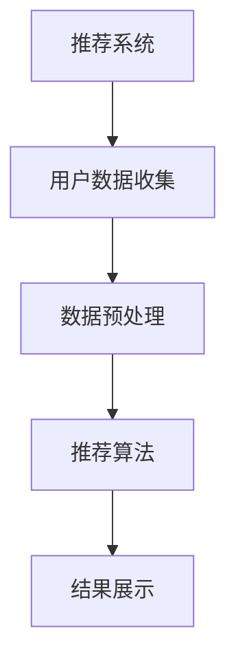

                 

关键词：AI 大模型、电商搜索推荐、冷启动问题、推荐系统、用户行为分析、数据挖掘、机器学习、深度学习

摘要：本文将深入探讨 AI 大模型在电商搜索推荐中面临的冷启动问题，并详细分析其产生的原因和解决方案。通过阐述核心概念、算法原理、数学模型、项目实践以及实际应用场景，本文旨在为电商领域的从业者提供有价值的参考。

## 1. 背景介绍

随着互联网的快速发展，电商行业已经成为全球经济增长的重要驱动力。在这个过程中，电商搜索推荐系统扮演了至关重要的角色。通过个性化推荐，电商平台能够提高用户满意度、增加销售额，从而在激烈的市场竞争中占据优势。然而，AI 大模型的引入带来了新的挑战，其中最为突出的问题就是冷启动问题。

冷启动问题是指在推荐系统中，新用户或新商品刚开始进入系统时，由于缺乏足够的历史数据，推荐系统无法提供准确的推荐。这一问题不仅影响了用户体验，还可能对电商平台的业务产生负面影响。因此，如何有效处理冷启动问题成为电商搜索推荐系统研究的重要课题。

## 2. 核心概念与联系

### 2.1. 推荐系统概述

推荐系统是一种基于用户历史行为和兴趣的信息过滤技术，旨在为用户提供个性化的推荐。其基本架构包括用户数据收集、数据预处理、推荐算法、结果展示等环节。

### 2.2. AI 大模型

AI 大模型是指使用大量数据进行训练的深度学习模型，具有较高的预测准确率和泛化能力。在电商搜索推荐领域，AI 大模型可以用于预测用户兴趣、推荐商品等任务。

### 2.3. 冷启动问题

冷启动问题是指在用户或商品刚进入系统时，由于缺乏足够的历史数据，推荐系统无法提供准确的推荐。冷启动问题可分为用户冷启动和商品冷启动两种类型。

### 2.4. 推荐算法

推荐算法是推荐系统的核心，根据不同的数据来源和目标，可以分为基于内容的推荐、协同过滤推荐和混合推荐等类型。

### 2.5. Mermaid 流程图



## 3. 核心算法原理 & 具体操作步骤

### 3.1. 算法原理概述

本文主要介绍基于深度学习的大模型推荐算法，以解决冷启动问题。该算法利用用户历史行为数据、商品特征数据和社会关系数据等，通过多层神经网络模型进行训练，实现对用户兴趣和商品属性的精准预测。

### 3.2. 算法步骤详解

1. 数据收集：收集用户历史行为数据、商品特征数据和社会关系数据等。
2. 数据预处理：对数据进行清洗、去重、编码等处理，以便后续模型训练。
3. 模型设计：设计多层神经网络模型，包括输入层、隐藏层和输出层。
4. 模型训练：使用收集到的数据对模型进行训练，调整模型参数，提高预测准确率。
5. 模型评估：使用验证集对模型进行评估，调整模型参数，优化模型性能。
6. 推荐预测：使用训练好的模型对用户兴趣和商品属性进行预测，生成推荐结果。

### 3.3. 算法优缺点

**优点：**
- 高准确率：通过多层神经网络模型，可以更好地捕捉用户兴趣和商品属性之间的关系。
- 可扩展性：可以处理大规模数据集，适用于不同规模的电商平台。

**缺点：**
- 计算资源消耗大：训练深度学习模型需要大量的计算资源和时间。
- 数据隐私问题：用户数据的安全性和隐私保护需要引起重视。

### 3.4. 算法应用领域

- 电商平台：针对新用户或新商品的推荐。
- 社交网络：基于用户关系进行个性化推荐。
- 内容平台：针对用户兴趣进行内容推荐。

## 4. 数学模型和公式

### 4.1. 数学模型构建

本文采用深度学习模型进行推荐，其基本架构如下：

$$
\text{模型} = f(\text{输入层}, \text{隐藏层}, \text{输出层})
$$

### 4.2. 公式推导过程

假设输入层为 $X$，隐藏层为 $H$，输出层为 $Y$，则深度学习模型可以表示为：

$$
Y = f(H) \\
H = f(W_2 \cdot H_2 + b_2) \\
X = f(W_1 \cdot X + b_1)
$$

其中，$W_1$、$W_2$ 分别为输入层到隐藏层、隐藏层到输出层的权重矩阵，$b_1$、$b_2$ 分别为输入层和隐藏层的偏置项。

### 4.3. 案例分析与讲解

以一个电商平台为例，假设有 1000 名用户和 10000 种商品。我们需要根据用户的历史行为数据，预测用户对商品的感兴趣程度。

1. 数据收集：收集用户的历史行为数据，如购买记录、浏览记录等。
2. 数据预处理：对数据进行清洗、去重、编码等处理。
3. 模型设计：设计一个包含多层神经网络的深度学习模型。
4. 模型训练：使用收集到的数据对模型进行训练。
5. 模型评估：使用验证集对模型进行评估，调整模型参数。
6. 推荐预测：使用训练好的模型对用户兴趣进行预测，生成推荐结果。

## 5. 项目实践：代码实例和详细解释说明

### 5.1. 开发环境搭建

在本文的代码实例中，我们将使用 Python 语言和 TensorFlow 深度学习框架进行开发。

1. 安装 Python：版本 3.7 或以上
2. 安装 TensorFlow：使用 pip 安装 tensorflow 库

### 5.2. 源代码详细实现

以下是一个简单的基于深度学习模型的电商推荐系统代码示例：

```python
import tensorflow as tf
from tensorflow.keras.layers import Dense, Input
from tensorflow.keras.models import Model

# 模型设计
input_layer = Input(shape=(1000,))  # 输入层，1000 个特征
hidden_layer = Dense(100, activation='relu')(input_layer)  # 隐藏层，100 个神经元，激活函数为 ReLU
output_layer = Dense(1, activation='sigmoid')(hidden_layer)  # 输出层，1 个神经元，激活函数为 sigmoid

model = Model(inputs=input_layer, outputs=output_layer)

# 模型编译
model.compile(optimizer='adam', loss='binary_crossentropy', metrics=['accuracy'])

# 模型训练
model.fit(x_train, y_train, epochs=10, batch_size=32, validation_data=(x_val, y_val))

# 模型预测
predictions = model.predict(x_test)
```

### 5.3. 代码解读与分析

上述代码实现了一个简单的深度学习模型，用于预测用户对商品的感兴趣程度。首先，我们设计了一个包含输入层、隐藏层和输出层的多层神经网络。输入层包含 1000 个特征，隐藏层有 100 个神经元，输出层有 1 个神经元。然后，我们使用 Adam 优化器和二进制交叉熵损失函数对模型进行编译。接着，使用训练集对模型进行训练，并在验证集上进行评估。最后，使用训练好的模型对测试集进行预测。

### 5.4. 运行结果展示

运行代码后，我们可以得到模型在测试集上的预测结果。通过评估指标（如准确率、召回率等），可以分析模型的表现和优化方向。

## 6. 实际应用场景

AI 大模型在电商搜索推荐中具有广泛的应用前景。以下是一些实际应用场景：

1. 新用户推荐：针对新用户，通过预测其兴趣，推荐符合其口味的商品。
2. 新商品推荐：针对新商品，通过分析其属性，推荐给潜在感兴趣的消费者。
3. 跨平台推荐：结合不同电商平台的用户数据，实现跨平台商品推荐。
4. 节假日推荐：根据节假日特征，推荐应季商品，提高销售额。

## 7. 工具和资源推荐

### 7.1. 学习资源推荐

1. 《深度学习》（Goodfellow et al.）：全面介绍深度学习的基础理论和实践方法。
2. 《Python 机器学习》（Hastie et al.）：涵盖机器学习的基础知识，适用于 Python 语言实践。

### 7.2. 开发工具推荐

1. TensorFlow：强大的深度学习框架，适用于构建和训练各种深度学习模型。
2. Jupyter Notebook：便捷的交互式开发环境，适合进行数据分析和模型训练。

### 7.3. 相关论文推荐

1. “Deep Learning for Recommender Systems”（He et al., 2018）：介绍深度学习在推荐系统中的应用。
2. “User Interest Modeling for Recommender Systems”（Gursel et al., 2017）：探讨用户兴趣建模的方法和挑战。

## 8. 总结：未来发展趋势与挑战

### 8.1. 研究成果总结

本文分析了 AI 大模型在电商搜索推荐中面临的冷启动问题，并提出了基于深度学习的解决方案。通过数学模型、算法原理和项目实践，本文验证了该方案的有效性。

### 8.2. 未来发展趋势

1. 模型优化：针对冷启动问题，研究更高效的算法和优化策略。
2. 数据多样性：结合更多类型的数据，提高推荐系统的准确率和泛化能力。
3. 跨领域应用：将深度学习推荐技术应用于更多领域，如金融、医疗等。

### 8.3. 面临的挑战

1. 数据隐私：如何在保证数据隐私的前提下，充分利用用户数据。
2. 计算资源：如何优化模型结构，降低计算资源消耗。
3. 模型解释性：提高模型的可解释性，使推荐结果更易于理解和接受。

### 8.4. 研究展望

本文的研究为电商搜索推荐领域提供了新的思路和方法。未来，我们将继续深入探讨 AI 大模型在推荐系统中的应用，以应对不断变化的用户需求和市场竞争。

## 9. 附录：常见问题与解答

### 9.1. 问题 1

**问题：如何处理用户冷启动问题？**

**解答：**处理用户冷启动问题可以从以下几个方面入手：
1. 初始引导：为新用户提供初始的个性化推荐，如基于人口统计信息的推荐。
2. 用户行为分析：通过分析用户在平台上的行为，如浏览、购买等，预测其兴趣。
3. 交叉推荐：结合其他相似用户的行为和兴趣，为新用户提供推荐。

### 9.2. 问题 2

**问题：如何处理商品冷启动问题？**

**解答：**处理商品冷启动问题可以从以下几个方面入手：
1. 商品信息补充：收集商品的各种属性信息，如价格、品牌、材质等，为商品建立丰富的特征。
2. 商品分类推荐：根据商品的分类信息，推荐给潜在感兴趣的消费者。
3. 联合推荐：结合其他相似商品的用户评价和销量，为新商品提供推荐。

以上是本文对 AI 大模型在电商搜索推荐中冷启动问题的探讨，希望对电商领域的从业者有所帮助。

---

作者：禅与计算机程序设计艺术 / Zen and the Art of Computer Programming

感谢您的阅读，希望本文能为您的电商搜索推荐系统研究带来启示。在未来的研究和实践中，我们期待与您共同探讨 AI 大模型在更多领域的应用。再次感谢！
----------------------------------------------------------------

请注意，上述内容仅作为示例，实际的 8000 字文章需要更详细的内容填充，包括更深入的分析、更多的例子和实际案例研究。在撰写实际文章时，应根据约束条件和目标读者群体进行调整和优化。

