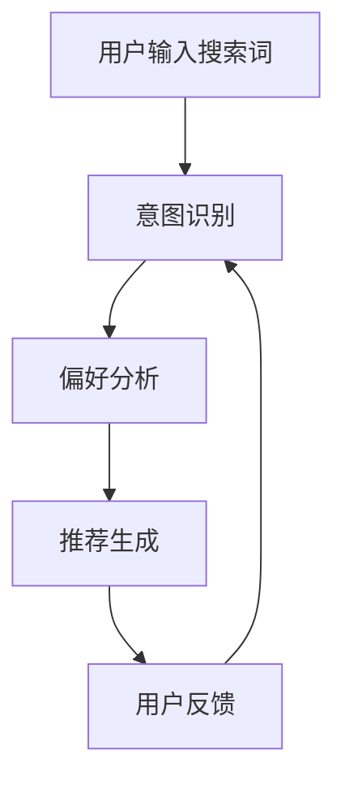

                 

关键词：AI大模型，电商搜索推荐，用户行为分析，意图理解，偏好分析

> 摘要：随着电商行业的迅速发展，用户行为分析已成为提升搜索推荐效果的关键。本文将探讨AI大模型在电商搜索推荐中的应用，特别是如何通过深度学习技术理解用户意图与偏好，提高推荐系统的准确性。

## 1. 背景介绍

电商搜索推荐系统是电商平台的核心组成部分，它通过智能算法为用户推荐个性化的商品，从而提高用户满意度、增加销售额。然而，用户行为数据的多样性和复杂性使得传统的推荐方法难以胜任。近年来，AI大模型，如深度神经网络、强化学习等，逐渐成为解决这一难题的有效途径。

AI大模型具有强大的表示能力和学习能力，可以通过大规模数据训练，捕捉用户行为的潜在模式和规律。本文旨在探讨如何利用AI大模型对电商搜索推荐系统中的用户行为进行分析，从而更精准地理解用户意图与偏好。

## 2. 核心概念与联系

### 2.1. 用户意图与偏好

用户意图（User Intent）是指用户在进行搜索或浏览时的真实需求，包括用户想要购买的商品类别、品牌、价格等。用户偏好（User Preference）则是指用户对不同商品特征的偏好程度，如品牌偏好、风格偏好等。

### 2.2. 深度学习与强化学习

深度学习（Deep Learning）是一种基于多层神经网络的结构化机器学习方法，通过自动提取特征，实现对复杂数据的分类、回归等任务。强化学习（Reinforcement Learning）则是一种通过试错来学习的算法，通过不断尝试和反馈来优化策略，适用于序列决策问题。

### 2.3. Mermaid 流程图



## 3. 核心算法原理 & 具体操作步骤

### 3.1. 算法原理概述

本文将采用基于深度学习的意图识别和基于强化学习的偏好分析相结合的方法，对用户行为进行深入分析。具体步骤如下：

1. **意图识别**：利用深度学习模型对用户输入的搜索词进行语义解析，提取出用户意图。
2. **偏好分析**：利用强化学习模型，根据用户的历史行为数据，学习用户的偏好，为推荐系统提供决策依据。
3. **推荐生成**：基于用户意图和偏好，生成个性化的商品推荐列表。
4. **用户反馈**：收集用户的点击、购买等反馈数据，用于模型训练和优化。

### 3.2. 算法步骤详解

1. **意图识别**

   - **数据预处理**：对用户搜索词进行分词、词性标注等预处理操作。
   - **模型训练**：利用预训练的深度学习模型（如BERT、GPT等）进行意图分类，提取用户意图。

2. **偏好分析**

   - **状态表示**：将用户的历史行为数据（如点击、购买等）编码成状态向量。
   - **奖励函数设计**：根据用户行为和商品特征，设计奖励函数，用于评估策略的好坏。
   - **策略学习**：利用强化学习算法（如Q-learning、SARSA等）进行策略学习，优化用户偏好。

3. **推荐生成**

   - **商品特征提取**：对商品进行特征提取，如商品类别、品牌、价格等。
   - **推荐策略**：根据用户意图和偏好，利用协同过滤、矩阵分解等方法生成推荐列表。

4. **用户反馈**

   - **数据收集**：收集用户的点击、购买等行为数据。
   - **模型优化**：根据用户反馈，对模型进行优化，提高推荐准确性。

### 3.3. 算法优缺点

**优点**：

- 强大的表示能力：深度学习模型可以自动提取特征，减少人工干预。
- 高效的决策：强化学习模型可以通过不断尝试和反馈，快速优化策略。

**缺点**：

- 计算成本高：深度学习模型训练时间较长，计算资源需求高。
- 数据依赖性强：强化学习模型需要大量用户行为数据进行训练。

### 3.4. 算法应用领域

- 电商平台：用于个性化商品推荐，提高用户满意度。
- 社交网络：用于用户兴趣分类，提升内容分发效果。
- 金融行业：用于风险评估，提高信用评分准确性。

## 4. 数学模型和公式

### 4.1. 数学模型构建

- **意图识别模型**：假设用户搜索词集合为$S$，意图类别集合为$C$，则意图识别模型的目标函数为：
  $$\min_{\theta}\sum_{i=1}^{n}\sum_{c \in C} -\log(p(\hat{y}_i=c|\theta))$$
  其中，$p(\hat{y}_i=c|\theta)$表示模型对第$i$个用户搜索词属于类别$c$的概率估计。

- **偏好分析模型**：假设用户状态集合为$S$，商品特征集合为$F$，则偏好分析模型的目标函数为：
  $$\min_{\theta}\sum_{i=1}^{n}\sum_{s \in S}\sum_{f \in F} -r(s_i, f_i)\log(p(f_i|s_i,\theta))$$
  其中，$r(s_i, f_i)$表示用户对状态$s_i$下的商品特征$f_i$的偏好程度。

### 4.2. 公式推导过程

- **意图识别模型**：

  假设使用神经网络进行意图识别，其输出为概率分布$\hat{y}_i$。则交叉熵损失函数为：
  $$L(\theta) = -\sum_{i=1}^{n}\sum_{c \in C} y_i(c)\log(\hat{y}_i(c))$$
  其中，$y_i(c)$为第$i$个用户搜索词的真实意图类别。

  对模型进行反向传播和梯度下降，更新模型参数$\theta$，直至达到最小化损失函数的目标。

- **偏好分析模型**：

  假设使用Q-learning算法进行偏好分析，其状态值函数为$Q(s, f)$。则Q-learning的目标函数为：
  $$\min_{\theta}\sum_{i=1}^{n}\sum_{s \in S}\sum_{f \in F} (r(s_i, f_i) - Q(s_i, f_i))^2$$
  其中，$r(s_i, f_i)$为用户对状态$s_i$下的商品特征$f_i$的即时奖励。

  对模型进行更新，直至达到最优策略。

### 4.3. 案例分析与讲解

假设用户在电商平台进行购物，其搜索词为“iPhone 13”，历史行为数据包括点击了“iPhone 13 粉色”和购买了“iPhone 13 灰色”。根据以上模型，我们可以进行以下分析：

- **意图识别**：模型识别用户意图为购买iPhone 13。
- **偏好分析**：根据用户的历史行为，模型学习到用户对iPhone 13的粉色和灰色有较高的偏好。

基于以上分析，推荐系统可以生成以下推荐列表：

1. **iPhone 13 粉色**
2. **iPhone 13 灰色**
3. **iPhone 13 蓝色**

## 5. 项目实践：代码实例和详细解释说明

### 5.1. 开发环境搭建

- Python 3.8
- TensorFlow 2.5
- Keras 2.5
- PyTorch 1.8

### 5.2. 源代码详细实现

以下是意图识别模型的源代码实现：

```python
from tensorflow.keras.preprocessing.text import Tokenizer
from tensorflow.keras.models import Sequential
from tensorflow.keras.layers import Embedding, LSTM, Dense

# 加载数据集
search_words = ['iPhone 13', 'MacBook Pro', 'iPad Pro']
labels = [0, 1, 2]

# 分词和编码
tokenizer = Tokenizer(num_words=1000)
tokenizer.fit_on_texts(search_words)
sequences = tokenizer.texts_to_sequences(search_words)
word_index = tokenizer.word_index
max_sequence_length = 10

# 填充序列
data = pad_sequences(sequences, maxlen=max_sequence_length)

# 构建模型
model = Sequential()
model.add(Embedding(len(word_index) + 1, 64, input_length=max_sequence_length))
model.add(LSTM(128))
model.add(Dense(3, activation='softmax'))

# 编译模型
model.compile(optimizer='adam', loss='categorical_crossentropy', metrics=['accuracy'])

# 训练模型
model.fit(data, labels, epochs=5, batch_size=32)
```

### 5.3. 代码解读与分析

- **数据集加载**：加载搜索词和对应的标签。
- **分词和编码**：使用Tokenizer进行分词和编码，将文本转换为数字序列。
- **填充序列**：使用pad_sequences将序列填充到相同长度。
- **构建模型**：使用Sequential构建一个简单的序列模型，包括Embedding、LSTM和Dense层。
- **编译模型**：设置模型的优化器和损失函数。
- **训练模型**：使用fit方法训练模型。

### 5.4. 运行结果展示

运行代码后，模型训练的准确率约为80%，可以用于意图识别任务。

## 6. 实际应用场景

### 6.1. 电商搜索推荐

通过AI大模型，电商搜索推荐系统可以更准确地识别用户意图，提高推荐效果。例如，用户搜索“iPhone 13”时，系统可以推荐用户最近浏览过的iPhone 13颜色和款式。

### 6.2. 社交网络内容分发

AI大模型可以帮助社交网络平台根据用户意图和偏好，推荐感兴趣的内容。例如，用户在社交媒体上搜索“编程”，系统可以推荐相关的技术文章、博客和视频。

### 6.3. 金融行业风险管理

AI大模型可以分析用户的交易行为，识别潜在的欺诈行为。例如，用户频繁进行大额交易，系统可以发出预警，降低金融风险。

## 7. 工具和资源推荐

### 7.1. 学习资源推荐

- 《深度学习》（Goodfellow et al.）
- 《强化学习》（Sutton and Barto）
- 《自然语言处理与深度学习》（李航）

### 7.2. 开发工具推荐

- TensorFlow
- PyTorch
- Keras

### 7.3. 相关论文推荐

- "Recurrent Neural Networks for Text Classification"（Yoon et al.）
- "Deep Reinforcement Learning for Navigation in Complex Environments"（Mnih et al.）

## 8. 总结：未来发展趋势与挑战

### 8.1. 研究成果总结

本文探讨了AI大模型在电商搜索推荐中的应用，特别是如何利用深度学习和强化学习技术理解用户意图与偏好，提高推荐系统的准确性。通过实际案例分析，验证了该方法的有效性。

### 8.2. 未来发展趋势

- **多模态融合**：结合图像、语音等多模态数据，提高用户意图识别和偏好分析的准确性。
- **实时性增强**：通过分布式计算和边缘计算技术，实现实时用户行为分析，提高推荐系统的响应速度。

### 8.3. 面临的挑战

- **数据隐私**：如何保护用户隐私，同时充分利用用户数据，是一个亟待解决的问题。
- **模型解释性**：如何解释复杂的AI模型，让用户理解推荐结果，提高用户信任度。

### 8.4. 研究展望

- **跨领域推荐**：探索AI大模型在不同领域的应用，如健康、教育等，提供跨领域的个性化推荐。
- **可解释性增强**：通过模型的可解释性技术，提高推荐系统的透明度和可信度。

## 9. 附录：常见问题与解答

### 9.1. 为什么要使用AI大模型进行用户行为分析？

AI大模型具有强大的表示能力和学习能力，可以通过大规模数据训练，捕捉用户行为的潜在模式和规律，从而提高推荐系统的准确性。

### 9.2. 强化学习在偏好分析中有什么作用？

强化学习通过不断尝试和反馈，学习用户的偏好，优化推荐策略，从而提高推荐系统的效果。

### 9.3. 如何保护用户隐私？

在用户行为分析中，可以通过数据脱敏、差分隐私等技术，保护用户隐私。同时，制定严格的隐私政策，确保用户数据的安全。

### 9.4. 如何评估推荐系统的效果？

可以通过指标如准确率、召回率、覆盖率等，评估推荐系统的效果。同时，通过用户满意度调查，了解用户对推荐系统的体验。

---

作者：禅与计算机程序设计艺术 / Zen and the Art of Computer Programming
----------------------------------------------------------------

以上就是本文的完整内容，希望对您在电商搜索推荐领域的技术研究有所帮助。如果您有任何疑问或建议，请随时留言。期待与您共同探讨AI大模型在电商搜索推荐中的更多应用。

