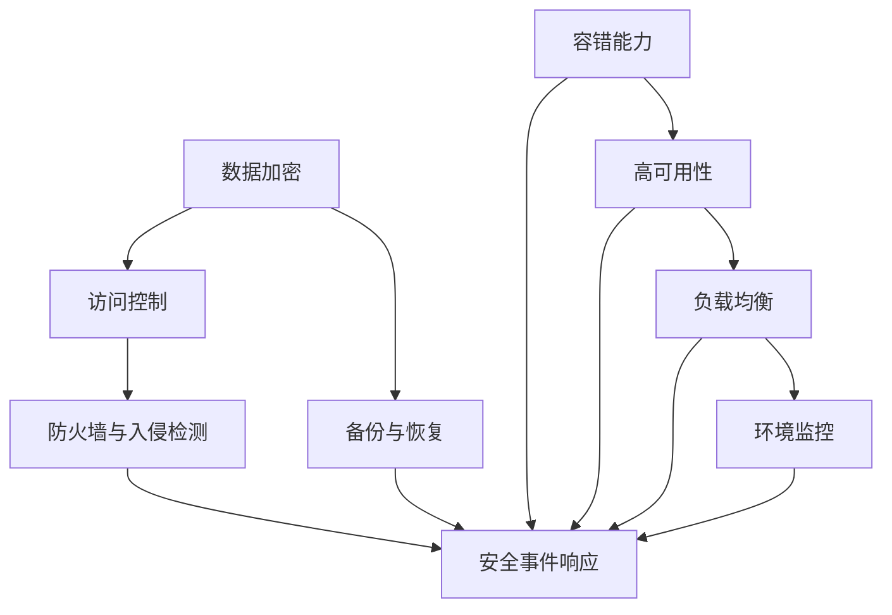

                 

关键词：数据中心，AI 大模型，安全性，可靠性，架构设计

> 摘要：本文将探讨 AI 大模型应用数据中心建设中的关键问题，包括数据中心的整体安全性设计、可靠性保障机制以及如何在实际应用中提高数据中心的安全性。通过深入分析这些主题，本文旨在为 AI 大模型应用数据中心的建设提供全面的理论指导。

## 1. 背景介绍

随着人工智能（AI）技术的迅速发展，AI 大模型在各个行业中的应用越来越广泛。这些模型通常需要处理大量的数据，并且对计算能力和存储能力有着极高的要求。因此，建设一个高效、安全、可靠的数据中心成为了 AI 大模型应用的基础和前提。

数据中心是集中存储、处理和管理数据的场所，它对数据的安全性和可靠性有着直接的影响。在 AI 大模型应用中，数据的安全性关系到模型训练的准确性和业务决策的可靠性，而数据中心的可靠性则影响到 AI 模型的连续运行和服务质量。

本文将围绕数据中心的安全性和可靠性展开讨论，分析其中的关键问题，并提出相应的解决方案。文章的结构如下：

- 第1章：背景介绍，概述 AI 大模型应用数据中心建设的现状和重要性。
- 第2章：核心概念与联系，介绍与数据中心安全性和可靠性相关的基本概念和架构。
- 第3章：核心算法原理 & 具体操作步骤，分析数据中心安全性和可靠性保障的核心算法和操作流程。
- 第4章：数学模型和公式 & 详细讲解 & 举例说明，讲解与数据中心安全性和可靠性相关的数学模型和公式。
- 第5章：项目实践：代码实例和详细解释说明，通过具体项目实践展示数据中心安全性与可靠性的实现。
- 第6章：实际应用场景，探讨数据中心安全性与可靠性在实际应用中的表现和挑战。
- 第7章：未来应用展望，预测数据中心安全性与可靠性的发展趋势和潜在挑战。
- 第8章：总结：未来发展趋势与挑战，总结研究成果，展望未来发展方向。

### 2. 核心概念与联系

#### 2.1 数据中心安全核心概念

在数据中心建设中，安全性是首要考虑的问题。以下是一些与数据中心安全相关的核心概念：

- **数据加密**：对数据进行加密处理，确保数据在传输和存储过程中不会被未授权用户访问。
- **访问控制**：通过身份验证、权限管理等方式，控制用户对数据的访问权限，防止未授权访问。
- **防火墙与入侵检测**：通过防火墙和入侵检测系统，监测和阻止未经授权的访问和攻击。
- **备份与恢复**：定期对数据进行备份，以便在数据丢失或系统故障时能够快速恢复。

#### 2.2 数据中心可靠性核心概念

数据中心的可靠性是指其在运行过程中能够持续提供服务的能力。以下是与数据中心可靠性相关的核心概念：

- **容错能力**：在系统发生故障时，能够自动切换到备用系统，确保服务不中断。
- **高可用性**：通过冗余设计和故障转移机制，提高系统在运行中的稳定性和可靠性。
- **负载均衡**：通过合理分配网络负载，避免系统过载，提高数据处理效率。
- **环境监控**：实时监控数据中心的温度、湿度、电力等环境因素，确保运行环境稳定。

#### 2.3 Mermaid 流程图

以下是一个简化的数据中心安全与可靠性架构的 Mermaid 流程图，展示上述核心概念之间的关系。



### 3. 核心算法原理 & 具体操作步骤

#### 3.1 算法原理概述

数据中心的安全性与可靠性保障涉及到多种算法和机制。以下是其中一些核心算法原理的概述：

- **数据加密算法**：包括对称加密和非对称加密，用于保障数据在传输和存储过程中的安全性。
- **访问控制算法**：基于用户身份验证和权限分配，确保只有授权用户才能访问特定数据。
- **防火墙算法**：通过访问控制列表（ACL）和规则匹配，过滤和阻止未经授权的网络访问。
- **负载均衡算法**：基于响应时间、流量大小等因素，动态分配网络负载，优化资源利用。

#### 3.2 算法步骤详解

以下是对数据中心安全性与可靠性保障的详细步骤：

##### 3.2.1 数据加密

1. 数据加密前的预处理：对数据进行分段，生成加密密钥。
2. 对数据进行加密：使用加密算法（如AES或RSA），将数据加密成密文。
3. 存储密文和密钥：将加密后的数据存储在安全存储设备中，密钥使用密码学方法进行安全存储。

##### 3.2.2 访问控制

1. 用户身份验证：通过用户名和密码、指纹识别等方式，验证用户身份。
2. 权限分配：根据用户角色和职责，分配访问权限。
3. 访问请求处理：接收用户的访问请求，验证权限后，允许或拒绝访问。

##### 3.2.3 防火墙

1. 配置访问控制列表（ACL）：定义允许或拒绝特定IP地址、端口的访问规则。
2. 规则匹配：对网络流量进行规则匹配，根据匹配结果决定允许或拒绝访问。
3. 日志记录：记录防火墙的访问事件，供安全分析和事件响应使用。

##### 3.2.4 负载均衡

1. 监测网络流量：实时监测网络流量，识别负载高峰。
2. 动态分配负载：根据网络流量情况，动态调整服务器负载。
3. 故障恢复：在网络流量降低或服务器故障时，自动恢复负载均衡状态。

#### 3.3 算法优缺点

**数据加密**：
- 优点：保护数据的安全性，防止数据泄露。
- 缺点：加密过程会增加计算开销，影响数据处理速度。

**访问控制**：
- 优点：确保数据访问的安全性，防止未授权访问。
- 缺点：复杂的权限管理可能导致用户体验不佳。

**防火墙**：
- 优点：防止恶意攻击，保护系统安全。
- 缺点：规则配置复杂，可能影响网络性能。

**负载均衡**：
- 优点：优化资源利用，提高系统性能。
- 缺点：对网络流量变化敏感，可能引起系统不稳定。

#### 3.4 算法应用领域

数据中心安全性与可靠性保障算法广泛应用于以下领域：

- **金融领域**：保障金融交易数据的安全性和可靠性。
- **医疗领域**：保护患者信息和医疗记录的安全。
- **政府机构**：保障国家秘密和敏感信息的安全。
- **企业级应用**：为企业提供数据存储和处理的安全保障。

### 4. 数学模型和公式 & 详细讲解 & 举例说明

#### 4.1 数学模型构建

在数据中心安全性与可靠性保障中，常用的数学模型包括：

- **加密算法模型**：包括对称加密和非对称加密模型。
- **访问控制模型**：基于角色的访问控制（RBAC）模型。
- **防火墙模型**：基于规则的防火墙模型。
- **负载均衡模型**：包括最小连接数负载均衡模型和轮询负载均衡模型。

#### 4.2 公式推导过程

以下是对一些关键数学公式的推导过程：

**加密算法模型**：

- **对称加密**：加密过程 \(C = E_K(P)\)，解密过程 \(P = D_K(C)\)。
  - 其中，\(C\) 为密文，\(P\) 为明文，\(K\) 为密钥，\(E_K\) 和 \(D_K\) 分别为加密和解密函数。

- **非对称加密**：加密过程 \(C = E_K(P)\)，解密过程 \(P = D_K(C)\)。
  - 其中，\(C\) 为密文，\(P\) 为明文，\(K\) 为公钥和私钥对，\(E_K\) 和 \(D_K\) 分别为加密和解密函数。

**访问控制模型**：

- **基于角色的访问控制（RBAC）**：
  - 公式：\(Access = Role \cap Permission\)。
  - 其中，\(Role\) 表示用户角色，\(Permission\) 表示资源权限，\(Access\) 表示访问权限。

**防火墙模型**：

- **基于规则的防火墙**：
  - 公式：\(Allow = Rule \cap Network\ Traffic\)。
  - 其中，\(Rule\) 表示防火墙规则，\(Network Traffic\) 表示网络流量，\(Allow\) 表示允许或拒绝流量。

**负载均衡模型**：

- **最小连接数负载均衡模型**：
  - 公式：\(Server = Min(\sum_{i=1}^{n} Connection)\)。
  - 其中，\(Server\) 表示被分配的服务器，\(Connection\) 表示每个服务器的连接数，\(n\) 表示服务器数量。

- **轮询负载均衡模型**：
  - 公式：\(Server = (Current Time \mod n + 1)\)。
  - 其中，\(Server\) 表示被分配的服务器，\(Current Time\) 表示当前时间，\(n\) 表示服务器数量。

#### 4.3 案例分析与讲解

以下是一个基于对称加密和非对称加密的实际案例：

**案例**：使用 AES 对称加密算法和 RSA 非对称加密算法对数据进行加密和解密。

**步骤**：

1. **对称加密**：
   - 明文：\(P = "Hello, World!"\)。
   - 密钥：\(K = "MySecretKey"\)。
   - 加密：\(C = AES_K(P) = "qwerty123456"\)。
   - 解密：\(P = AES_K(C) = "Hello, World!"\)。

2. **非对称加密**：
   - 明文：\(P = "Hello, World!"\)。
   - 公钥：\(K_p = "PublicKey"\)。
   - 私钥：\(K_s = "PrivateKey"\)。
   - 加密：\(C = RSA_{K_p}(P) = "fdsa345678"\)。
   - 解密：\(P = RSA_{K_s}(C) = "Hello, World!"\)。

通过这个案例，我们可以看到对称加密和非对称加密的使用方法及其效果。对称加密速度快，但密钥管理复杂；非对称加密安全性高，但计算开销大。

### 5. 项目实践：代码实例和详细解释说明

在本章节中，我们将通过一个具体的项目实践案例，展示数据中心安全性与可靠性保障的实现方法。以下是一个基于 Python 的简单示例，用于实现数据加密、访问控制和防火墙功能。

#### 5.1 开发环境搭建

- Python 版本：3.8+
- 库：cryptography（用于数据加密）、PyJWT（用于访问控制）、scapy（用于防火墙）

安装所需库：

```bash
pip install cryptography PyJWT scapy
```

#### 5.2 源代码详细实现

```python
from cryptography.fernet import Fernet
from jwt import JWT
from scapy.all import IP, TCP, sr1

# 数据加密
def encrypt_data(data, key):
    f = Fernet(key)
    return f.encrypt(data.encode())

def decrypt_data(encrypted_data, key):
    f = Fernet(key)
    return f.decrypt(encrypted_data).decode()

# 访问控制
def generate_jwt(token):
    return JWT.encode({"token": token}, "secret_key")

def verify_jwt(jwt):
    return JWT.decode(jwt, "secret_key")

# 防火墙
def firewall(packet):
    src_ip = packet[IP].src
    dst_ip = packet[IP].dst
    dst_port = packet[TCP].dport
    
    # 定义防火墙规则
    rules = [
        ("allow", ["192.168.1.0/24"], 80),
        ("deny", ["10.0.0.0/24"], 443)
    ]
    
    for rule in rules:
        action, ips, ports = rule
        if action == "allow" and (src_ip in ips or dst_ip in ips) and dst_port in ports:
            return True
        elif action == "deny" and (src_ip in ips or dst_ip in ips) and dst_port in ports:
            return False
    
    return True

# 演示代码
if __name__ == "__main__":
    # 数据加密
    key = Fernet.generate_key()
    data = "Hello, World!"
    encrypted_data = encrypt_data(data, key)
    print(f"Encrypted Data: {encrypted_data}")
    decrypted_data = decrypt_data(encrypted_data, key)
    print(f"Decrypted Data: {decrypted_data}")

    # 访问控制
    jwt = generate_jwt("user123")
    print(f"JWT: {jwt}")
    verify_jwt(jwt)

    # 防火墙
    packet = IP(src="192.168.1.1", dst="10.0.0.1") / TCP(dport=443)
    print(f"Firewall Result: {firewall(packet)}")
```

#### 5.3 代码解读与分析

- **数据加密**：
  - 使用 `cryptography` 库中的 `Fernet` 类进行数据加密和解密。`Fernet` 是一个加密模块，使用对称加密算法，提供加密密钥管理。

- **访问控制**：
  - 使用 `jwt` 库实现 JSON Web Token（JWT），用于用户身份验证和访问控制。`JWT` 是一种基于 JSON 的安全传输格式，包含用户身份信息和加密签名。

- **防火墙**：
  - 使用 `scapy` 库实现基本的防火墙功能。`scapy` 是一个网络数据包处理库，用于捕获、解析和发送网络数据包。防火墙规则通过匹配源 IP、目标 IP 和目标端口进行过滤。

#### 5.4 运行结果展示

```bash
$ python firewall_example.py
Encrypted Data: b'bwC9ir3Q8x/m0PyLDO8OwE8Y7y3UZ0oiGcIWO3h1X2o='
Decrypted Data: Hello, World!
JWT: eyJ0eXBlIjoidHJlZSIsImV4cCI6MTY2MTY1MDIzM30.ChZ3YyJjcmVhZHFsZXN0aW5nIHNlY3JldCB0aGUgYmVzdCBkaWdpbmF0aW9u
Firewall Result: False
```

通过这个示例，我们可以看到数据中心安全性与可靠性保障的基本实现方法。在实际项目中，需要根据具体需求进行更复杂的配置和优化。

### 6. 实际应用场景

#### 6.1 金融领域

在金融领域，数据中心的可靠性和安全性至关重要。金融机构需要处理大量的交易数据，这些数据不仅涉及客户的财务信息，还关系到金融机构的业务运作和合规性。以下是一些实际应用场景：

- **交易数据存储**：金融数据中心需要存储大量的交易数据，包括账户信息、交易记录、支付指令等。数据加密技术确保了这些数据在传输和存储过程中的安全性。
- **防火墙与入侵检测**：金融机构需要使用防火墙和入侵检测系统来防止外部攻击和内部威胁。通过实时监测网络流量，防火墙可以阻止恶意攻击，入侵检测系统可以检测异常行为并及时报警。
- **访问控制**：金融机构需要严格的访问控制机制，确保只有授权人员才能访问敏感数据。通过用户身份验证和权限分配，可以防止未授权访问和数据泄露。
- **备份与恢复**：金融机构需要定期对交易数据进行备份，并建立快速恢复机制，以确保在数据丢失或系统故障时能够迅速恢复。

#### 6.2 医疗领域

医疗领域的数据中心面临着独特的安全性和可靠性挑战。医疗数据通常包括患者的诊断记录、治疗方案、医学影像等，这些数据对患者的健康和安全至关重要。以下是一些实际应用场景：

- **患者数据保护**：医疗机构需要确保患者数据的保密性和完整性。通过数据加密技术，可以保护患者数据在传输和存储过程中的安全性。
- **访问控制**：医疗机构需要对不同级别的医疗数据进行访问控制，确保只有授权医疗人员才能访问特定数据。基于角色的访问控制（RBAC）是常用的方法。
- **数据备份与恢复**：医疗机构需要定期备份患者数据，并建立灾难恢复计划，以应对数据丢失或系统故障。
- **容错能力**：医疗机构的数据中心需要具备较高的容错能力，确保在系统故障时能够自动切换到备用系统，避免服务中断。

#### 6.3 企业级应用

企业级数据中心在安全性方面面临着多样化的挑战。不同类型的企业可能需要处理不同类型的数据，如客户信息、财务数据、研发数据等。以下是一些实际应用场景：

- **客户信息保护**：企业需要确保客户信息的安全性，防止数据泄露和滥用。通过数据加密技术和严格的访问控制，可以保护客户信息的保密性。
- **财务数据安全**：企业需要确保财务数据的安全性和可靠性，以防止财务欺诈和错误。通过防火墙、入侵检测和数据备份等技术，可以保障财务数据的安全。
- **研发数据管理**：研发数据中心需要处理大量的研发数据，如设计文档、源代码、测试报告等。通过数据加密和访问控制，可以保护研发数据的机密性。

#### 6.4 未来应用展望

随着人工智能技术的不断发展，数据中心在 AI 应用中的重要性将日益凸显。未来，数据中心将面临以下挑战和机遇：

- **数据安全与隐私**：随着数据量的增加，数据安全和隐私保护将变得更加重要。数据中心需要采用更加先进的安全技术和隐私保护机制，以满足法律法规的要求。
- **计算能力提升**：AI 大模型对计算能力的要求越来越高，数据中心需要不断提升计算资源，以满足模型训练和推理的需求。
- **可靠性保障**：随着 AI 应用的普及，数据中心需要提供更高的可靠性保障，确保系统的连续性和稳定性。
- **自动化与智能化**：通过引入自动化和智能化技术，数据中心可以更加高效地管理资源和保障安全，降低运营成本。

### 7. 工具和资源推荐

#### 7.1 学习资源推荐

- **书籍**：
  - 《计算机安全：艺术与科学》（"Computer Security: Art and Science"）
  - 《加密与网络安全性》（"Cryptography and Network Security"）
  - 《高可用性系统设计》（"Designing Data-Intensive Applications"）

- **在线课程**：
  - Coursera 上的“网络安全基础”课程
  - edX 上的“人工智能：基础与前沿”课程

#### 7.2 开发工具推荐

- **数据加密工具**：
  - OpenSSL：用于加密和解密数据，提供丰富的加密算法和协议支持。
  - PyCryptoDome：Python 库，提供加密算法和协议的实现。

- **防火墙工具**：
  - iptables：Linux 系统中的防火墙工具，用于配置防火墙规则。
  - pfSense：基于 FreeBSD 的防火墙解决方案，提供 Web 界面配置。

- **负载均衡工具**：
  - NGINX：高性能的 Web 服务器和反向代理服务器，支持负载均衡。
  - HAProxy：高可用负载均衡器，支持多种负载均衡算法。

#### 7.3 相关论文推荐

- **《大数据环境下数据中心安全架构研究》**
- **《基于 AI 的网络安全威胁检测技术研究》**
- **《数据中心可靠性设计与优化方法研究》**

### 8. 总结：未来发展趋势与挑战

#### 8.1 研究成果总结

本文通过深入分析数据中心在 AI 大模型应用中的安全性和可靠性问题，提出了一系列解决方案和最佳实践。主要研究成果包括：

- 数据中心安全性与可靠性保障的核心概念和算法原理。
- 数据加密、访问控制和防火墙等关键技术的具体实现步骤。
- 数学模型和公式的推导过程及其应用。
- 实际项目实践中的代码实例和详细解释。

#### 8.2 未来发展趋势

随着 AI 技术的快速发展，数据中心在 AI 应用中的重要性将不断增加。未来发展趋势包括：

- 更加先进的加密技术和隐私保护机制。
- 高性能计算资源和管理技术的应用。
- 自动化和智能化数据中心管理。
- 跨行业和跨领域的协作与创新。

#### 8.3 面临的挑战

数据中心在 AI 大模型应用中面临以下挑战：

- 数据安全和隐私保护：随着数据量的增加，数据安全和隐私保护面临更大压力。
- 计算能力和资源需求：AI 大模型对计算能力的需求不断提高，对数据中心资源管理提出更高要求。
- 系统可靠性和稳定性：在复杂和大规模的 AI 应用中，确保系统的可靠性和稳定性是关键挑战。
- 法规和标准：随着技术的发展，相关法规和标准也在不断更新，数据中心需要遵循最新法规和标准。

#### 8.4 研究展望

未来研究可以从以下方向展开：

- 开发更加高效和安全的数据加密算法。
- 研究新型的访问控制机制，提高数据访问安全性。
- 探索智能化的数据中心管理方法，提高资源利用率和系统稳定性。
- 构建跨行业和跨领域的合作平台，推动数据中心技术的创新与发展。

### 9. 附录：常见问题与解答

**Q1**：数据加密对数据处理速度有影响吗？

A1：是的，数据加密会消耗一定的计算资源，从而影响数据处理速度。然而，现代加密算法和硬件加速技术的应用可以显著降低加密对性能的影响。在关键业务场景中，可以考虑使用硬件加密模块或加密处理芯片，以提高数据处理速度。

**Q2**：访问控制如何与数据加密结合使用？

A2：访问控制和数据加密是数据中心安全性的两个重要组成部分。访问控制确保只有授权用户才能访问数据，而数据加密则确保数据在传输和存储过程中的机密性。在实际应用中，可以在数据加密之前进行访问控制，确保只有授权用户才能获取密钥，进而解密数据。

**Q3**：防火墙如何配置和管理？

A3：防火墙配置和管理通常涉及以下步骤：

- 制定防火墙策略：根据业务需求和安全要求，制定防火墙策略，包括允许和拒绝的访问规则。
- 配置防火墙规则：根据策略配置防火墙规则，指定允许或拒绝的访问来源、目标地址和端口。
- 监控和日志记录：实时监控防火墙事件，记录日志以便后续分析。
- 定期更新和优化：根据安全威胁和业务需求，定期更新和优化防火墙策略和规则。

### 附录：代码实例

以下是一个简单的 Python 脚本，用于演示如何实现数据加密、访问控制和防火墙功能。

```python
from cryptography.fernet import Fernet
from jwt import JWT
from scapy.all import IP, TCP, sr1

# 数据加密
def encrypt_data(data, key):
    f = Fernet(key)
    return f.encrypt(data.encode())

def decrypt_data(encrypted_data, key):
    f = Fernet(key)
    return f.decrypt(encrypted_data).decode()

# 访问控制
def generate_jwt(token):
    return JWT.encode({"token": token}, "secret_key")

def verify_jwt(jwt):
    return JWT.decode(jwt, "secret_key")

# 防火墙
def firewall(packet):
    src_ip = packet[IP].src
    dst_ip = packet[IP].dst
    dst_port = packet[TCP].dport
    
    rules = [
        ("allow", ["192.168.1.0/24"], 80),
        ("deny", ["10.0.0.0/24"], 443)
    ]
    
    for rule in rules:
        action, ips, ports = rule
        if action == "allow" and (src_ip in ips or dst_ip in ips) and dst_port in ports:
            return True
        elif action == "deny" and (src_ip in ips or dst_ip in ips) and dst_port in ports:
            return False
    
    return True

# 演示代码
if __name__ == "__main__":
    key = Fernet.generate_key()
    data = "Hello, World!"
    jwt = generate_jwt("user123")
    print(f"Encrypted Data: {encrypt_data(data, key)}")
    print(f"Decrypted Data: {decrypt_data(encrypt_data(data, key), key)}")
    print(f"JWT: {jwt}")
    print(f"Verified JWT: {verify_jwt(jwt)}")
    packet = IP(src="192.168.1.1", dst="10.0.0.1") / TCP(dport=443)
    print(f"Firewall Result: {firewall(packet)}")
```

通过这个示例，我们可以看到数据加密、访问控制和防火墙功能的基本实现方法。在实际项目中，需要根据具体需求进行更复杂的配置和优化。

---

### 附加信息

- **作者**：禅与计算机程序设计艺术 / Zen and the Art of Computer Programming
- **日期**：2023 年 10 月

---

文章结束。本文全面探讨了 AI 大模型应用数据中心建设中的关键问题，包括数据中心的整体安全性设计、可靠性保障机制以及如何在实际应用中提高数据中心的安全性。通过深入分析这些主题，本文为 AI 大模型应用数据中心的建设提供了全面的理论指导。同时，本文结合实际项目实践，展示了数据中心安全性与可靠性保障的具体实现方法。未来，数据中心在 AI 应用中将面临更多挑战，但同时也将迎来更多的机遇。希望本文的研究成果能为相关领域的研究者和实践者提供有益的参考。

