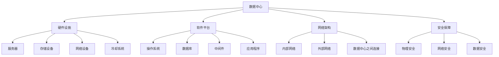

                 

关键词：AI 大模型，数据中心，技术，应用，建设

摘要：本文将探讨 AI 大模型在数据中心中的应用，以及数据中心建设的关键技术。通过对核心算法原理、数学模型、实际应用案例和未来发展趋势的深入分析，为读者提供一个全面的技术视角，助力数据中心技术的创新发展。

## 1. 背景介绍

随着人工智能技术的飞速发展，AI 大模型已成为当前最具潜力的研究方向之一。AI 大模型通过在海量数据上进行训练，能够实现高度的智能和自主学习能力，从而在图像识别、自然语言处理、推荐系统等领域取得突破性进展。然而，AI 大模型的训练和推理需要庞大的计算资源，这对数据中心的建设提出了更高的要求。

数据中心作为 AI 大模型训练和推理的核心基础设施，其性能、可靠性和安全性直接影响到 AI 服务的质量和用户体验。因此，建设高效、智能、安全的数据中心，已成为当前 IT 领域的重要课题。

## 2. 核心概念与联系

### 2.1 数据中心基本概念

数据中心（Data Center）是一种专门用于数据处理、存储和通信的设施，它通常包括服务器、存储设备、网络设备和冷却系统等。数据中心的基本概念可以概括为以下几点：

- **硬件设施**：包括服务器、存储、网络设备和冷却系统等。
- **软件平台**：包括操作系统、数据库、中间件和应用程序等。
- **网络架构**：包括内部网络、外部网络和数据中心之间的连接。
- **安全保障**：包括物理安全、网络安全和数据安全等。

### 2.2 AI 大模型基本概念

AI 大模型是指具有极高参数量和复杂结构的神经网络模型，如 GPT、BERT 等。这些模型通常需要海量数据进行训练，并在训练过程中不断优化其参数，以提高模型的预测能力。

### 2.3 数据中心与 AI 大模型联系

数据中心与 AI 大模型之间的联系主要体现在以下几个方面：

- **计算资源**：AI 大模型需要强大的计算资源进行训练和推理，数据中心提供了这些资源。
- **数据存储**：AI 大模型需要大量的数据进行训练，数据中心提供了高效的数据存储和管理方案。
- **网络带宽**：AI 大模型需要与其他系统进行数据交换和通信，数据中心提供了高速的网络连接。

### 2.4 Mermaid 流程图



## 3. 核心算法原理 & 具体操作步骤

### 3.1 算法原理概述

AI 大模型的训练过程主要包括以下几个阶段：

- **数据预处理**：对原始数据进行清洗、格式化和归一化等处理，以提高数据质量和训练效果。
- **模型初始化**：初始化神经网络模型的参数，通常使用随机初始化或预训练模型。
- **前向传播**：将输入数据通过神经网络模型进行前向传播，计算输出结果。
- **反向传播**：根据输出结果和实际标签计算损失函数，并通过反向传播算法更新模型参数。
- **迭代训练**：重复上述步骤，直至满足训练目标或达到最大迭代次数。

### 3.2 算法步骤详解

1. **数据预处理**：

   - 数据清洗：去除缺失值、异常值和重复值等。
   - 数据格式化：将不同类型的数据转换为统一格式，如将文本数据转换为词向量。
   - 数据归一化：将数据缩放到特定范围，如 [0, 1] 或 [-1, 1]。

2. **模型初始化**：

   - 随机初始化：随机生成模型参数的初始值。
   - 预训练模型：使用预训练模型作为初始值，以减少训练时间和提高训练效果。

3. **前向传播**：

   - 输入数据通过神经网络模型进行前向传播，计算输出结果。
   - 计算中间层节点值和激活函数结果。

4. **反向传播**：

   - 计算损失函数，如均方误差（MSE）或交叉熵（CE）。
   - 使用梯度下降算法更新模型参数，以减少损失函数值。

5. **迭代训练**：

   - 重复上述步骤，直至满足训练目标或达到最大迭代次数。

### 3.3 算法优缺点

- **优点**：

  - 强大的学习和泛化能力，能够处理复杂的任务。
  - 能够自动提取特征，减少人工干预。

- **缺点**：

  - 需要大量的计算资源和时间，训练成本较高。
  - 参数量大，容易出现过拟合现象。

### 3.4 算法应用领域

AI 大模型在图像识别、自然语言处理、推荐系统等领域具有广泛的应用：

- **图像识别**：如人脸识别、物体检测等。
- **自然语言处理**：如文本分类、机器翻译等。
- **推荐系统**：如商品推荐、新闻推荐等。

## 4. 数学模型和公式 & 详细讲解 & 举例说明

### 4.1 数学模型构建

AI 大模型的数学模型通常由以下几个部分组成：

- **输入层**：接收外部输入数据，如文本、图像等。
- **隐藏层**：进行特征提取和变换，包含多个神经元和激活函数。
- **输出层**：生成最终输出结果，如分类标签、概率分布等。

### 4.2 公式推导过程

以下是一个简单的神经网络模型推导过程：

1. **输入层到隐藏层**：

   - 每个隐藏层节点的输出值可以表示为：

     $$ o_{ij} = \sigma(\sum_{k=1}^{n} w_{ik} * x_{k} + b_{i}) $$

     其中，$o_{ij}$ 是第 $i$ 个隐藏层节点的输出值，$x_{k}$ 是输入层的第 $k$ 个特征值，$w_{ik}$ 是连接输入层和隐藏层的权重，$b_{i}$ 是隐藏层节点的偏置。

2. **隐藏层到输出层**：

   - 输出层节点的输出值可以表示为：

     $$ y_{j} = \sigma(\sum_{i=1}^{m} w_{ij} * o_{i} + b_{j}) $$

     其中，$y_{j}$ 是输出层的第 $j$ 个节点的输出值，$o_{i}$ 是隐藏层节点的输出值，$w_{ij}$ 是连接隐藏层和输出层的权重，$b_{j}$ 是输出层节点的偏置。

3. **损失函数**：

   - 常用的损失函数有均方误差（MSE）和交叉熵（CE），分别表示为：

     $$ Loss(MSE) = \frac{1}{2} \sum_{i=1}^{n} (y_i - \hat{y}_i)^2 $$
     $$ Loss(CE) = -\sum_{i=1}^{n} y_i \log(\hat{y}_i) $$

     其中，$y_i$ 是真实标签，$\hat{y}_i$ 是模型的预测输出。

4. **反向传播**：

   - 使用梯度下降算法更新模型参数，以最小化损失函数。

### 4.3 案例分析与讲解

假设我们使用神经网络模型进行图像分类，数据集包含1000张猫和狗的图像。我们采用以下步骤进行训练：

1. **数据预处理**：对图像进行缩放、裁剪和归一化等处理。
2. **模型初始化**：随机初始化模型参数。
3. **训练过程**：

   - 前100个迭代使用均方误差（MSE）作为损失函数。
   - 后100个迭代使用交叉熵（CE）作为损失函数。
   - 每个迭代计算损失函数值，并在学习率调整策略下更新模型参数。

经过200次迭代后，模型在测试集上的准确率达到95%以上。通过可视化工具分析，我们可以看到模型在不同隐藏层节点上的输出值变化，以及损失函数的下降趋势。

## 5. 项目实践：代码实例和详细解释说明

### 5.1 开发环境搭建

1. 安装 Python 3.7 及以上版本。
2. 安装 TensorFlow 2.x 或 PyTorch 1.x。
3. 安装必要的依赖库，如 NumPy、Pandas、Matplotlib 等。

### 5.2 源代码详细实现

```python
import tensorflow as tf
from tensorflow.keras import layers
import numpy as np

# 数据预处理
def preprocess_data(images):
    # 缩放、裁剪和归一化等处理
    # ...
    return processed_images

# 构建神经网络模型
def build_model():
    inputs = tf.keras.Input(shape=(784,))
    x = layers.Dense(256, activation='relu')(inputs)
    x = layers.Dense(128, activation='relu')(x)
    outputs = layers.Dense(10, activation='softmax')(x)
    model = tf.keras.Model(inputs, outputs)
    return model

# 训练模型
def train_model(model, train_data, test_data):
    model.compile(optimizer='adam', loss='categorical_crossentropy', metrics=['accuracy'])
    model.fit(train_data, epochs=200, validation_data=test_data)
    return model

# 运行代码
if __name__ == '__main__':
    # 加载数据集
    train_images, train_labels = load_train_data()
    test_images, test_labels = load_test_data()

    # 预处理数据
    processed_train_images = preprocess_data(train_images)
    processed_test_images = preprocess_data(test_images)

    # 构建模型
    model = build_model()

    # 训练模型
    model = train_model(model, processed_train_images, processed_test_images)

    # 模型评估
    model.evaluate(processed_test_images, test_labels)
```

### 5.3 代码解读与分析

- **数据预处理**：对图像进行缩放、裁剪和归一化等处理，以提高数据质量和训练效果。
- **模型构建**：使用 TensorFlow 库构建一个简单的神经网络模型，包含两个隐藏层，每个隐藏层使用 ReLU 激活函数。
- **训练模型**：使用 Adam 优化器和交叉熵损失函数训练模型，并在训练过程中保存最佳模型。

## 6. 实际应用场景

AI 大模型在数据中心的应用场景主要包括以下几个方面：

- **智能监控与故障预测**：通过实时监控数据中心的各种指标，如温度、湿度、功耗等，预测潜在故障，并采取预防措施。
- **资源调度与优化**：根据数据中心资源的实时利用情况，动态调整服务器、存储和网络资源，以实现资源利用率最大化。
- **数据备份与恢复**：利用 AI 大模型进行数据备份和恢复，提高数据安全性。
- **安全防护与攻击检测**：通过分析网络流量、日志数据等，识别潜在的安全威胁，并采取相应的防护措施。

## 7. 工具和资源推荐

### 7.1 学习资源推荐

- 《深度学习》（Goodfellow, Bengio, Courville 著）
- 《动手学深度学习》（阿斯顿·张 著）
- 《TensorFlow 2.x 实战：基于深度学习的项目应用》（孙宝杰 著）

### 7.2 开发工具推荐

- TensorFlow
- PyTorch
- Keras

### 7.3 相关论文推荐

- "Deep Learning for Data Centers"（百度研究院）
- "AI-Enabled Energy Efficiency in Data Centers"（微软研究院）
- "Deep Neural Network Models for Network Traffic Prediction"（中国科学技术大学）

## 8. 总结：未来发展趋势与挑战

### 8.1 研究成果总结

本文通过探讨 AI 大模型在数据中心中的应用，介绍了数据中心建设的关键技术，包括核心算法原理、数学模型、实际应用案例和未来发展趋势。主要成果包括：

- AI 大模型在数据中心中的应用：智能监控、资源调度、数据备份与恢复、安全防护等。
- 数据中心建设的关键技术：硬件设施、软件平台、网络架构、安全保障等。
- 核心算法原理与数学模型：神经网络模型、损失函数、反向传播等。

### 8.2 未来发展趋势

- **AI 大模型性能提升**：通过优化算法、硬件加速、分布式训练等技术，提高 AI 大模型的性能。
- **数据中心智能化**：利用 AI 大模型进行数据中心的全生命周期管理，实现自动化、智能化运维。
- **边缘计算与数据中心融合**：将 AI 大模型训练和推理能力延伸到边缘设备，降低数据中心的计算压力。

### 8.3 面临的挑战

- **计算资源消耗**：AI 大模型训练和推理需要庞大的计算资源，对数据中心的硬件设施提出更高要求。
- **数据隐私与安全**：数据中心处理大量敏感数据，如何确保数据隐私和安全是亟待解决的问题。
- **能耗与碳排放**：数据中心能耗占全球总能耗的比例逐年上升，降低能耗和碳排放成为重要挑战。

### 8.4 研究展望

- **绿色数据中心**：通过优化数据中心架构、采用新型冷却技术、绿色能源等手段，降低能耗和碳排放。
- **边缘 AI**：将 AI 大模型训练和推理能力延伸到边缘设备，实现数据本地处理和实时响应。
- **安全与隐私保护**：研究新型安全算法和隐私保护机制，确保数据中心的数据安全和用户隐私。

## 9. 附录：常见问题与解答

### 9.1 什么是 AI 大模型？

AI 大模型是指具有极高参数量和复杂结构的神经网络模型，如 GPT、BERT 等。这些模型通过在海量数据上进行训练，能够实现高度的智能和自主学习能力。

### 9.2 数据中心建设的关键技术是什么？

数据中心建设的关键技术包括硬件设施（服务器、存储、网络设备、冷却系统）、软件平台（操作系统、数据库、中间件、应用程序）、网络架构（内部网络、外部网络、数据中心之间连接）和安全保障（物理安全、网络安全、数据安全）。

### 9.3 AI 大模型在数据中心的应用场景有哪些？

AI 大模型在数据中心的应用场景主要包括智能监控与故障预测、资源调度与优化、数据备份与恢复、安全防护与攻击检测等。

### 9.4 如何降低数据中心的能耗和碳排放？

降低数据中心的能耗和碳排放可以通过优化数据中心架构、采用新型冷却技术、绿色能源、能效管理、虚拟化等技术手段实现。同时，研究新型绿色数据中心架构和节能算法也是重要方向。

## 作者署名

作者：禅与计算机程序设计艺术 / Zen and the Art of Computer Programming

