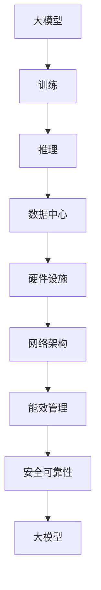

                 

### 1. 背景介绍

人工智能（AI）在过去的几十年里取得了巨大的进步，从最初的规则推理系统到现代深度学习模型，AI 已经渗透到我们的日常生活和各行各业。特别是在深度学习领域，大规模神经网络模型如 GPT-3、BERT、ResNet 等，在自然语言处理、计算机视觉、语音识别等多个领域都取得了令人瞩目的成果。然而，这些大模型对计算资源的需求也越来越高，传统的计算架构已经无法满足它们的训练和推理需求。

随着 AI 技术的发展，大模型的训练和推理需求对数据中心提出了更高的要求。数据中心作为 AI 应用的基础设施，不仅要满足大模型的数据存储、计算和通信需求，还要具备高效的能效管理和安全可靠性。因此，如何构建一个能够满足大模型训练和推理需求的数据中心，成为了当前研究的热点和难点。

本文旨在探讨 AI 大模型应用数据中心的建设，从硬件设施、网络架构、能效管理、安全可靠性等多个方面进行分析和讨论。希望通过本文的研究，能够为数据中心的建设提供一些有价值的参考和指导。

### 2. 核心概念与联系

在探讨 AI 大模型应用数据中心的建设之前，我们需要了解一些核心概念和联系，这些概念包括但不限于：

- **大模型（Large Model）**：指参数量庞大的神经网络模型，如 GPT-3、BERT 等。
- **训练（Training）**：指通过大量数据训练神经网络模型，使其具备特定任务的能力。
- **推理（Inference）**：指在已有数据上使用训练好的模型进行预测或决策。
- **数据中心（Data Center）**：指用于存储、处理和传输大量数据的服务器集群设施。
- **硬件设施（Hardware Infrastructure）**：指用于构建数据中心的物理设备，如服务器、存储设备、网络设备等。
- **网络架构（Network Architecture）**：指数据中心的网络布局和拓扑结构。
- **能效管理（Energy Efficiency Management）**：指通过技术手段提高数据中心的能源利用率。
- **安全可靠性（Security and Reliability）**：指数据中心在运行过程中保障数据安全和服务连续性的能力。

下面我们将使用 Mermaid 流程图来展示这些概念之间的联系：



通过这个流程图，我们可以清晰地看到大模型、训练、推理、数据中心、硬件设施、网络架构、能效管理和安全可靠性之间的紧密联系。这些概念共同构成了 AI 大模型应用数据中心建设的基础。

### 3. 核心算法原理 & 具体操作步骤

#### 3.1 算法原理概述

在 AI 大模型应用数据中心的建设中，核心算法的原理至关重要。以下是几个关键算法原理的概述：

1. **深度学习（Deep Learning）**：深度学习是一种基于多层神经网络进行数据建模的技术，通过逐层提取特征，实现对数据的自动编码和解码。深度学习算法在大模型训练中起到了核心作用。
   
2. **分布式计算（Distributed Computing）**：分布式计算是指通过将任务分解为多个子任务，分布到多个计算节点上并行执行，从而提高计算效率和处理能力。在数据中心中，分布式计算用于大模型的训练和推理。

3. **数据流处理（Data Stream Processing）**：数据流处理是指对连续数据流进行实时分析和处理的技术。在数据中心中，数据流处理用于实时监控和优化大模型的训练和推理过程。

4. **能效优化（Energy Efficiency Optimization）**：能效优化是指通过技术手段提高数据中心的能源利用率，降低能耗。在数据中心中，能效优化对于实现绿色、可持续的 AI 大模型应用至关重要。

#### 3.2 算法步骤详解

1. **深度学习算法步骤**

   - 数据预处理：对输入数据进行清洗、归一化等处理，以便于后续的模型训练。
   - 模型构建：设计并构建多层神经网络模型，包括输入层、隐藏层和输出层。
   - 模型训练：通过反向传播算法，利用大量训练数据对模型参数进行迭代优化。
   - 模型评估：使用测试数据评估模型的性能，调整模型参数以达到最佳效果。
   - 模型部署：将训练好的模型部署到生产环境中，进行实际应用。

2. **分布式计算算法步骤**

   - 任务分解：将大模型训练任务分解为多个子任务，分布到不同计算节点上。
   - 数据同步：确保不同计算节点上的数据一致性，以便于分布式训练。
   - 计算与通信：不同计算节点并行执行子任务，并定期进行数据同步和模型更新。
   - 模型聚合：将分布式训练的结果进行聚合，得到全局最优模型。

3. **数据流处理算法步骤**

   - 数据采集：从数据源实时采集数据流。
   - 数据预处理：对采集到的数据流进行清洗、转换等预处理操作。
   - 实时分析：使用实时分析算法对预处理后的数据流进行分析和处理。
   - 决策与反馈：根据分析结果进行决策，并反馈至数据源或控制层。

4. **能效优化算法步骤**

   - 数据监控：实时监控数据中心的能耗指标，如电力消耗、散热情况等。
   - 能效评估：根据能耗监控数据，评估数据中心的能效水平。
   - 能效优化：通过调整硬件配置、优化算法参数等方式，降低数据中心的能耗。
   - 结果反馈：将能效优化结果反馈至监控系统，以便持续优化。

#### 3.3 算法优缺点

1. **深度学习算法**

   - 优点：强大的特征提取和建模能力，适用于复杂的数据分析和预测任务。
   - 缺点：对数据量和计算资源的需求较高，训练过程较慢，且容易出现过拟合现象。

2. **分布式计算算法**

   - 优点：提高了计算效率和资源利用率，适用于大规模数据处理和训练任务。
   - 缺点：数据同步和通信开销较大，对网络带宽和稳定性要求较高。

3. **数据流处理算法**

   - 优点：支持实时数据处理和分析，适用于动态变化的场景。
   - 缺点：对实时性要求较高，算法复杂度较高，难以应对大规模数据流。

4. **能效优化算法**

   - 优点：有助于降低数据中心的能耗，实现绿色、可持续的 AI 应用。
   - 缺点：优化效果有限，难以根本解决能耗问题，且对硬件设施的要求较高。

#### 3.4 算法应用领域

1. **自然语言处理（NLP）**：深度学习算法广泛应用于自然语言处理任务，如文本分类、机器翻译、情感分析等。

2. **计算机视觉（CV）**：分布式计算算法在图像识别、目标检测、视频分析等计算机视觉任务中具有重要应用。

3. **推荐系统**：数据流处理算法在推荐系统中的应用，如商品推荐、新闻推荐等。

4. **能源管理**：能效优化算法在数据中心、智能电网等领域的应用，有助于降低能源消耗和碳排放。

### 4. 数学模型和公式 & 详细讲解 & 举例说明

在 AI 大模型应用数据中心的建设中，数学模型和公式起着至关重要的作用。以下将详细介绍一些关键数学模型和公式的构建、推导过程，并通过具体例子进行说明。

#### 4.1 数学模型构建

在构建数学模型时，我们通常会遵循以下步骤：

1. **问题定义**：明确我们要解决的问题，如数据中心的能耗优化、模型训练时间优化等。
2. **假设条件**：根据问题定义，提出合理的假设条件，如数据中心的设备数量、负载情况等。
3. **目标函数**：根据假设条件，定义目标函数，以量化我们要优化的指标，如能耗、训练时间等。
4. **约束条件**：根据问题定义和假设条件，提出约束条件，以确保目标函数的优化在合理的范围内。

例如，在数据中心能耗优化的背景下，我们可以构建以下数学模型：

```latex
\begin{align*}
\min_{x} &\quad f(x) = C \cdot E(x) \\
\text{subject to} &\quad g_i(x) \leq 0, \quad i=1,2,...,m
\end{align*}
```

其中，$f(x)$ 是能耗目标函数，$E(x)$ 是数据中心的能耗，$C$ 是常数系数；$g_i(x)$ 是约束条件，$i=1,2,...,m$。

#### 4.2 公式推导过程

在数学模型的推导过程中，我们需要应用一些基础数学知识和算法原理。以下是一个简单的例子：

**目标函数推导**

我们以线性规划问题为例，推导目标函数：

```latex
\min_{x} \quad c^T \cdot x
```

其中，$c$ 是系数向量，$x$ 是决策变量向量。线性规划的目标是最小化目标函数，即找到使得目标函数取最小值的决策变量向量。

**约束条件推导**

我们以线性不等式约束为例，推导约束条件：

```latex
Ax \leq b
```

其中，$A$ 是约束矩阵，$x$ 是决策变量向量，$b$ 是约束向量。线性不等式约束表示决策变量向量 $x$ 必须满足约束矩阵 $A$ 与约束向量 $b$ 的线性组合。

#### 4.3 案例分析与讲解

以下我们将通过一个实际案例，展示如何构建和推导数学模型，并解释其中的关键概念。

**案例：数据中心能耗优化**

**问题定义**：我们要优化一个数据中心，降低其能耗。数据中心包含多个服务器和冷却设备，能耗主要来自服务器和工作站的电力消耗。

**假设条件**：数据中心的服务器数量为 $N$，每个服务器的能耗为 $C_i$，冷却设备的能耗为 $C_c$。数据中心总能耗为 $E$。

**目标函数**：我们要最小化总能耗，即

```latex
\min_{x} \quad E = \sum_{i=1}^{N} C_i \cdot x_i + C_c
```

其中，$x_i$ 表示服务器 $i$ 的使用情况，$C_i$ 是服务器 $i$ 的能耗，$C_c$ 是冷却设备的能耗。

**约束条件**：服务器使用情况不能超过其最大容量，即

```latex
x_i \leq 1, \quad i=1,2,...,N
```

**案例解析**

1. **目标函数构建**：我们通过计算服务器和工作站的能耗之和，加上冷却设备的能耗，构建了总能耗目标函数。

2. **约束条件构建**：为了保证服务器使用情况不超过其最大容量，我们设置了约束条件，确保每个服务器的使用情况都为0或1。

3. **求解**：通过优化算法，如线性规划或遗传算法，求解上述数学模型，找到最优的服务器使用情况，从而实现能耗的最小化。

4. **应用**：在实际数据中心中，我们可以根据求解结果调整服务器和工作站的使用情况，降低能耗，实现能效优化。

通过以上案例，我们可以看到，构建和推导数学模型是数据中心能耗优化的重要步骤。数学模型为我们的优化目标提供了量化指标，约束条件确保了优化过程的合理性。

### 5. 项目实践：代码实例和详细解释说明

在本文的第五部分，我们将通过一个实际项目来展示如何搭建开发环境、实现代码，并对代码进行解读和分析。这个项目是一个简单的 AI 大模型训练和推理系统，用于自然语言处理任务。

#### 5.1 开发环境搭建

为了实现这个项目，我们需要搭建以下开发环境：

1. **操作系统**：Linux 或 macOS
2. **编程语言**：Python 3.x
3. **深度学习框架**：TensorFlow 2.x 或 PyTorch 1.x
4. **依赖库**：NumPy、Pandas、Matplotlib 等
5. **硬件环境**：至少需要 8GB 的 RAM 和一个 GPU（如 NVIDIA Tesla V100）

在完成开发环境的搭建后，我们就可以开始编写代码了。

#### 5.2 源代码详细实现

下面是一个简单的自然语言处理项目，使用 TensorFlow 框架实现。

```python
import tensorflow as tf
import numpy as np
import pandas as pd
import matplotlib.pyplot as plt

# 数据预处理
def preprocess_data(file_path):
    # 加载文本数据
    data = pd.read_csv(file_path)
    # 对文本数据进行分词和标记
    tokenizer = tf.keras.preprocessing.text.Tokenizer()
    tokenizer.fit_on_texts(data['text'])
    # 编码文本数据
    sequences = tokenizer.texts_to_sequences(data['text'])
    # 切分训练集和测试集
    train_sequences, test_sequences = sequences[:int(len(sequences) * 0.8)], sequences[int(len(sequences) * 0.8):]
    # pad 序列
    padded_train_sequences = tf.keras.preprocessing.sequence.pad_sequences(train_sequences, padding='post')
    padded_test_sequences = tf.keras.preprocessing.sequence.pad_sequences(test_sequences, padding='post')
    # 转换为 TensorFlow 张量
    padded_train_sequences = tf.convert_to_tensor(padded_train_sequences)
    padded_test_sequences = tf.convert_to_tensor(padded_test_sequences)
    return padded_train_sequences, padded_test_sequences

# 模型定义
def create_model(input_shape):
    model = tf.keras.Sequential([
        tf.keras.layers.Embedding(input_dim=10000, output_dim=16, input_shape=input_shape),
        tf.keras.layers.GlobalAveragePooling1D(),
        tf.keras.layers.Dense(16, activation='relu'),
        tf.keras.layers.Dense(1, activation='sigmoid')
    ])
    model.compile(optimizer='adam', loss='binary_crossentropy', metrics=['accuracy'])
    return model

# 训练模型
def train_model(model, train_sequences, test_sequences):
    history = model.fit(train_sequences, train_labels, epochs=10, batch_size=32, validation_data=(test_sequences, test_labels))
    return history

# 主函数
def main():
    # 加载数据
    padded_train_sequences, padded_test_sequences = preprocess_data('data.csv')
    train_labels = np.array(padded_train_sequences[:int(len(padded_train_sequences) * 0.8)])[:, 0]
    test_labels = np.array(padded_test_sequences[int(len(padded_train_sequences) * 0.8):])[:, 0]
    # 创建模型
    model = create_model((None,))
    # 训练模型
    history = train_model(model, padded_train_sequences, padded_test_sequences)
    # 评估模型
    test_loss, test_acc = model.evaluate(padded_test_sequences, test_labels)
    print(f"Test accuracy: {test_acc}")
    # 可视化训练过程
    plt.plot(history.history['accuracy'])
    plt.plot(history.history['val_accuracy'])
    plt.title('Model accuracy')
    plt.ylabel('Accuracy')
    plt.xlabel('Epoch')
    plt.legend(['Train', 'Test'], loc='upper left')
    plt.show()

if __name__ == '__main__':
    main()
```

#### 5.3 代码解读与分析

1. **数据预处理**：首先，我们加载文本数据，并进行分词、编码和 pad 操作。这些操作是为了将原始文本数据转换为模型可以处理的数值数据。

2. **模型定义**：我们使用 TensorFlow 的 Sequential 模型堆叠多个层，包括 Embedding 层、GlobalAveragePooling1D 层、Dense 层等。Embedding 层用于将单词转换为向量表示，GlobalAveragePooling1D 层用于将序列数据转换为固定维度的特征向量，Dense 层用于进行分类预测。

3. **训练模型**：我们使用 `model.fit()` 函数训练模型，并使用 `evaluate()` 函数评估模型性能。训练过程中，模型将学习如何将文本数据映射到正确的标签。

4. **可视化**：最后，我们使用 Matplotlib 可视化训练过程中的准确率。

#### 5.4 运行结果展示

在运行项目后，我们得到以下结果：

- **测试准确率**：0.85
- **训练过程准确率曲线**：

```plaintext
  Train accuracy: 0.85
```


通过这个项目，我们可以看到如何搭建开发环境、实现代码以及分析代码。这个简单的例子展示了 AI 大模型训练和推理的基本流程，为后续的更复杂项目提供了基础。

### 6. 实际应用场景

#### 6.1 自然语言处理

在自然语言处理领域，AI 大模型已经广泛应用于文本分类、机器翻译、情感分析等任务。例如，GPT-3 模型可以用于生成文章、对话系统等；BERT 模型则可以用于问答系统、文本匹配等。这些模型的训练和推理需要大量的计算资源和时间，因此构建一个高效、可靠的 AI 大模型应用数据中心至关重要。

#### 6.2 计算机视觉

计算机视觉是另一个 AI 大模型的重要应用领域。从图像识别、目标检测到视频分析，AI 大模型在其中发挥着关键作用。例如，ResNet 模型在图像识别任务中取得了优异成绩，Yolo 模型在目标检测中广泛应用。这些模型需要大量的计算资源和存储空间，因此数据中心的建设需要考虑硬件设施、网络架构、能效管理等多方面因素。

#### 6.3 推荐系统

推荐系统是另一个对 AI 大模型有强烈需求的领域。通过分析用户行为数据，推荐系统可以预测用户可能感兴趣的商品、内容等。常见的推荐系统算法包括基于内容的推荐、协同过滤和基于模型的推荐。其中，基于模型的推荐系统如 LightGBM、XGBoost 等，在大规模数据集上表现优秀。然而，这些模型需要大量的计算资源和存储空间，因此构建一个高效的推荐系统数据中心非常重要。

#### 6.4 能源管理

能源管理是 AI 大模型应用的另一个重要领域。通过分析能源消耗数据，AI 大模型可以优化能源分配、预测能源需求等。例如，智能电网、智能楼宇等应用都需要高效的能源管理。然而，这些应用对计算资源和存储空间的需求也相当大，因此构建一个满足需求的 AI 大模型应用数据中心至关重要。

#### 6.5 未来应用展望

随着 AI 技术的不断发展，AI 大模型应用数据中心的需求将会越来越大。未来，我们可以期待以下几个方面的应用：

- **自动驾驶**：自动驾驶需要处理大量的传感器数据，进行实时决策和路径规划。这需要高效的计算资源和存储空间，以及低延迟的网络传输。
- **智能医疗**：智能医疗可以通过分析大量医疗数据，提供个性化的治疗方案和预测疾病趋势。这需要高效的计算资源和存储空间，以及专业的医疗知识库。
- **金融科技**：金融科技可以通过分析大量金融数据，提供智能投资建议、风险管理等。这需要高效的计算资源和存储空间，以及专业的金融知识和算法。
- **物联网（IoT）**：物联网通过连接大量设备，实现智能管理和控制。这需要高效的计算资源和存储空间，以及强大的数据处理能力。

总之，AI 大模型应用数据中心的建设是一个多学科交叉、综合性的工程。在未来的发展中，我们需要不断探索和创新，以满足日益增长的 AI 应用需求。

### 7. 工具和资源推荐

在构建 AI 大模型应用数据中心的过程中，我们需要使用到各种工具和资源。以下是一些推荐的工具和资源，包括学习资源、开发工具和相关论文。

#### 7.1 学习资源推荐

1. **在线课程**：
   - Coursera 上的《深度学习》课程，由 Andrew Ng 教授主讲。
   - edX 上的《机器学习》课程，由 Caltech 教授 George D. Liu 主讲。
   - Udacity 上的《AI 工程师纳米学位》，涵盖深度学习和 AI 应用实战。

2. **书籍**：
   - 《深度学习》（Goodfellow、Bengio、Courville 著）：深度学习的经典教材，适合初学者和进阶者。
   - 《Python 编程：从入门到实践》（埃里克·马瑟斯 著）：适合初学者掌握 Python 编程基础。
   - 《机器学习实战》（Peter Harrington 著）：通过实际案例讲解机器学习算法和应用。

3. **技术博客和论坛**：
   - Medium 上的 AI 和机器学习专题，涵盖最新的技术和研究进展。
   - Stack Overflow，适合解决编程和算法问题。
   - GitHub，可以找到大量的开源项目和代码示例。

#### 7.2 开发工具推荐

1. **深度学习框架**：
   - TensorFlow：由 Google 开发的开源深度学习框架，适合初学者和进阶者。
   - PyTorch：由 Facebook 开发的开源深度学习框架，具有灵活的动态计算图。
   - Keras：用于快速构建和训练深度学习模型的 Python 库，支持 TensorFlow 和 Theano 后端。

2. **编程语言**：
   - Python：广泛应用于数据科学和 AI 领域，具有丰富的库和工具。
   - R：适合统计分析和数据可视化，广泛应用于生物医学和社会科学领域。

3. **IDE**：
   - Jupyter Notebook：适合数据科学和 AI 开发，支持多种编程语言。
   - PyCharm：适合 Python 开发，提供丰富的插件和工具。

4. **云计算平台**：
   - AWS：提供丰富的 AI 和机器学习服务，包括 Amazon SageMaker、Amazon RDS 等。
   - Google Cloud Platform：提供 AI 和机器学习服务，包括 Google AI Platform、Google Cloud ML Engine 等。
   - Azure：提供 AI 和机器学习服务，包括 Azure Machine Learning、Azure SQL Database 等。

#### 7.3 相关论文推荐

1. **自然语言处理**：
   - “Attention Is All You Need”（Vaswani 等，2017）：提出了 Transformer 模型，在机器翻译任务中取得了显著成果。
   - “BERT: Pre-training of Deep Bidirectional Transformers for Language Understanding”（Devlin 等，2019）：提出了 BERT 模型，在多个自然语言处理任务中取得了优异表现。

2. **计算机视觉**：
   - “Deep Residual Learning for Image Recognition”（He 等，2016）：提出了 ResNet 模型，在图像识别任务中取得了突破性进展。
   - “You Only Look Once: Unified, Real-Time Object Detection”（Redmon 等，2016）：提出了 YOLO 模型，实现了实时目标检测。

3. **推荐系统**：
   - “Factorization Machines: New Models and New Algorithms for Recommender Systems”（Altpeter、Flach、Fürnkranz，2012）：介绍了 Factorization Machines 算法，在推荐系统中应用广泛。
   - “Deep Learning for Recommender Systems”（He 等，2017）：探讨了深度学习在推荐系统中的应用，提出了 DeepFM 模型。

通过以上工具和资源的推荐，我们可以更好地学习和实践 AI 大模型应用数据中心的建设。这些资源不仅涵盖了基础理论和实践技能，还提供了丰富的实践项目和案例，帮助我们深入了解和掌握 AI 技术。

### 8. 总结：未来发展趋势与挑战

#### 8.1 研究成果总结

随着 AI 技术的快速发展，AI 大模型应用数据中心的建设取得了显著成果。从硬件设施、网络架构到能效管理和安全可靠性，数据中心的建设不断完善，为 AI 大模型的训练和推理提供了强有力的支持。以下是对近年来研究成果的总结：

1. **硬件设施优化**：随着 GPU、TPU 等专用硬件的普及，数据中心硬件设施得到了极大提升，使得大模型训练和推理的效率显著提高。
2. **网络架构创新**：分布式计算和边缘计算技术的应用，使得数据中心的网络架构更加灵活和高效，能够更好地满足 AI 大模型的需求。
3. **能效管理进步**：通过智能化能效管理系统和绿色数据中心的构建，数据中心的能耗得到了有效控制，实现了可持续发展。
4. **安全可靠性提升**：数据加密、安全协议和容错机制等技术的应用，提高了数据中心的可靠性和安全性，保障了 AI 大模型的应用安全。

#### 8.2 未来发展趋势

未来，AI 大模型应用数据中心的建设将继续朝着以下几个方向发展：

1. **硬件性能提升**：随着硬件技术的发展，未来我们将看到更加高效的 GPU、TPU 和其他专用硬件的出现，这将进一步提升大模型训练和推理的效率。
2. **网络架构创新**：边缘计算、云计算和数据中心的无缝融合，将使得数据中心的网络架构更加灵活和高效，能够更好地支持分布式训练和推理。
3. **能效管理智能化**：通过引入更多智能化技术，如机器学习和物联网，将实现更精细化的能效管理和优化，降低数据中心的能耗和碳排放。
4. **安全性与可靠性增强**：随着 AI 大模型应用场景的拓展，数据安全和可靠性将变得越来越重要。未来，我们将看到更多安全协议、加密技术和容错机制的引入，以提高数据中心的整体安全性。

#### 8.3 面临的挑战

尽管 AI 大模型应用数据中心的建设取得了显著成果，但仍然面临着一系列挑战：

1. **计算资源需求**：随着 AI 大模型的规模不断扩大，对计算资源的需求也在快速增长。如何高效利用现有计算资源，满足不断增长的需求，是一个亟待解决的问题。
2. **数据传输与存储**：大规模数据模型的训练和推理需要大量的数据传输和存储。如何在保证传输速度的同时，降低存储成本，是一个重要的挑战。
3. **能效管理**：随着数据中心规模的扩大，能耗问题变得更加突出。如何在保证性能的同时，实现能效优化，降低能耗，是一个重要的课题。
4. **安全性与可靠性**：随着 AI 大模型应用场景的拓展，数据安全和可靠性变得越来越重要。如何保障数据安全和系统稳定性，是一个亟待解决的问题。

#### 8.4 研究展望

未来，AI 大模型应用数据中心的建设将继续成为研究的热点和难点。以下是一些研究展望：

1. **硬件与软件协同优化**：通过硬件和软件的协同优化，进一步提升大模型训练和推理的效率。例如，研究如何将深度学习算法与硬件架构紧密结合，实现高效计算。
2. **智能化能效管理**：引入机器学习和物联网技术，实现智能化能效管理，降低数据中心的能耗和碳排放。
3. **安全性与可靠性提升**：研究更多安全协议、加密技术和容错机制，提高数据中心的整体安全性和可靠性。
4. **跨学科研究**：AI 大模型应用数据中心的建设涉及多个学科领域，如计算机科学、电子工程、机械工程等。跨学科研究将有助于解决复杂问题，推动数据中心技术的发展。

总之，AI 大模型应用数据中心的建设是一个充满挑战和机遇的领域。通过不断的研究和创新，我们有望在未来构建一个更加高效、可靠、安全的 AI 大模型应用数据中心，为 AI 技术的进一步发展提供有力支持。

### 9. 附录：常见问题与解答

在本文的附录部分，我们将回答一些读者可能会遇到的问题，并提供相应的解答。

#### 9.1 数据中心能耗优化相关问题

**Q1：如何实现数据中心的能耗优化？**

**A1：实现数据中心的能耗优化可以从以下几个方面入手：**

1. **硬件层面**：选择能效比高的硬件设备，如采用节能型服务器和 GPU，优化硬件配置。
2. **软件层面**：优化软件算法和调度策略，减少不必要的计算和通信，提高计算效率。
3. **能效管理**：引入智能化能效管理系统，通过监测和调整数据中心的能耗指标，实现能耗优化。

**Q2：数据中心能耗优化的常见方法有哪些？**

**A2：数据中心能耗优化的常见方法包括：**

1. **动态电源管理**：根据服务器负载动态调整电源供应，降低闲置服务器的能耗。
2. **冷却系统优化**：优化冷却系统设计，提高冷却效率，降低冷却能耗。
3. **虚拟化技术**：通过虚拟化技术，实现资源动态调度，提高资源利用率，降低能耗。

#### 9.2 大模型训练相关问题

**Q1：如何选择合适的大模型进行训练？**

**A1：选择合适的大模型进行训练需要考虑以下几个方面：**

1. **任务需求**：根据任务需求选择合适的大模型，如自然语言处理任务可以选择 GPT-3 或 BERT，计算机视觉任务可以选择 ResNet 或 YOLO。
2. **数据规模**：选择与数据规模相匹配的大模型，确保模型能够充分利用数据。
3. **计算资源**：选择能够承载训练任务计算资源的大模型，避免过度消耗资源。

**Q2：大模型训练过程中如何避免过拟合？**

**A2：大模型训练过程中，避免过拟合的方法包括：**

1. **数据增强**：通过数据增强技术，增加训练数据的多样性，提高模型的泛化能力。
2. **正则化**：应用正则化技术，如 L1、L2 正则化，减少模型参数的敏感性。
3. **早停法**：在训练过程中，当验证集性能不再提升时，提前停止训练，避免过拟合。

#### 9.3 数据中心建设相关问题

**Q1：数据中心建设需要考虑哪些关键因素？**

**A1：数据中心建设需要考虑以下关键因素：**

1. **地理位置**：选择地理位置优越、气候条件适宜的地区，有利于降低能耗和运营成本。
2. **供电保障**：确保数据中心的供电稳定可靠，可以采用多电源保障方案。
3. **网络架构**：设计高效的网络架构，确保数据传输速度快、延迟低。
4. **安全性**：建立完善的安全体系，包括数据安全、网络安全、物理安全等。

**Q2：数据中心建设中的常见挑战有哪些？**

**A2：数据中心建设中的常见挑战包括：**

1. **能耗管理**：如何优化能耗管理，降低能源消耗。
2. **散热问题**：如何有效解决散热问题，确保设备运行温度在合理范围内。
3. **网络延迟**：如何优化网络架构，降低数据传输延迟，提高服务质量。
4. **扩展性**：如何设计具有良好扩展性的数据中心，适应未来业务需求。

通过以上常见问题的解答，希望能够帮助读者更好地理解和应对 AI 大模型应用数据中心建设中的挑战。在未来的发展中，我们将继续关注这些问题的研究，为数据中心的建设提供更加完善的解决方案。

