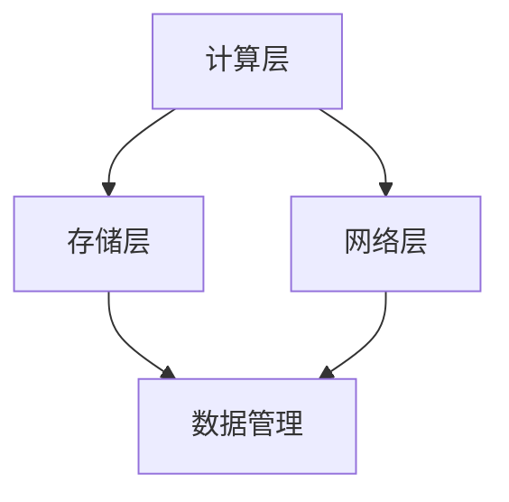

                 

在当今数字化时代，人工智能（AI）的迅速发展引领了新一轮科技革命。特别是大模型（如GPT-3、BERT等）的出现，为自然语言处理、计算机视觉、语音识别等领域带来了前所未有的进步。然而，大模型的训练和应用离不开强大的计算和存储支持。本文将围绕AI大模型应用数据中心的建设，探讨高性能计算与存储架构的设计原则、实现方案以及未来展望。

## 关键词

- 人工智能
- 大模型
- 数据中心
- 高性能计算
- 存储架构

## 摘要

本文首先介绍了AI大模型的发展背景和数据中心建设的必要性，然后详细阐述了高性能计算与存储架构的核心概念和联系。接着，文章从算法原理、数学模型、项目实践等方面深入剖析了AI大模型应用数据中心建设的关键技术和实施步骤。最后，文章探讨了未来AI大模型应用的发展趋势与面临的挑战，并推荐了相关学习资源和开发工具。

## 1. 背景介绍

随着互联网和大数据技术的飞速发展，数据量呈现爆炸式增长，对AI大模型的需求也日益增加。AI大模型具有参数多、计算复杂、数据依赖性强等特点，其训练和应用对计算资源和存储资源的要求极高。传统的计算和存储架构已无法满足大模型的处理需求，因此，构建专门针对AI大模型应用的数据中心成为当务之急。

数据中心的建设不仅仅是硬件设备的堆砌，更是一个复杂的系统工程，涉及网络、计算、存储、安全等多个方面。高性能计算与存储架构是数据中心建设的关键环节，直接影响到大模型的训练速度和效果。因此，设计合理的高性能计算与存储架构对于AI大模型应用至关重要。

## 2. 核心概念与联系

在探讨高性能计算与存储架构之前，我们需要明确以下几个核心概念：

### 2.1 高性能计算（HPC）

高性能计算是指使用高速计算机系统和并行计算技术，对大规模复杂问题进行高效计算的方法。它通常涉及到高性能CPU、GPU、FPGA等硬件设备的组合使用，以及分布式计算、数据并行、任务并行等技术。

### 2.2 存储架构

存储架构是指数据存储和管理的方式。高性能存储架构需要满足高吞吐量、低延迟、大容量等要求。常见的存储技术包括SSD、分布式存储、内存存储等。

### 2.3 数据中心架构

数据中心架构包括计算层、存储层、网络层等多个层次。计算层负责处理数据和计算任务；存储层负责数据的存储和管理；网络层负责数据传输和通信。

### 2.4 Mermaid 流程图

以下是高性能计算与存储架构的 Mermaid 流程图：



在这个流程图中，计算层负责执行计算任务，存储层负责数据的存储和管理，网络层负责数据传输和通信，数据管理模块负责对数据进行分类、检索和维护。

## 3. 核心算法原理 & 具体操作步骤

### 3.1 算法原理概述

AI大模型的训练通常采用深度学习算法，如神经网络、卷积神经网络、递归神经网络等。这些算法的核心思想是通过多层神经网络对大量数据进行训练，从而提取数据中的特征，并学习数据的内在规律。

### 3.2 算法步骤详解

- 数据预处理：对原始数据进行清洗、归一化等处理，使其符合算法输入要求。
- 网络结构设计：根据应用场景选择合适的网络结构，如卷积神经网络（CNN）、递归神经网络（RNN）等。
- 模型训练：使用训练数据对模型进行训练，通过优化算法（如梯度下降、Adam等）更新模型参数。
- 模型评估：使用验证数据对模型进行评估，调整模型参数，优化模型性能。
- 模型部署：将训练好的模型部署到实际应用场景中，进行实时预测和推理。

### 3.3 算法优缺点

- 优点：AI大模型具有强大的特征提取和模式识别能力，可以处理大量复杂数据，并取得较高的准确率。
- 缺点：训练过程计算复杂度高，对计算资源和存储资源要求极高；模型解释性较差，难以理解模型的决策过程。

### 3.4 算法应用领域

AI大模型广泛应用于自然语言处理、计算机视觉、语音识别、推荐系统等多个领域，为各行业带来了巨大的变革和创新。

## 4. 数学模型和公式 & 详细讲解 & 举例说明

### 4.1 数学模型构建

AI大模型通常基于深度学习算法，其数学模型主要包括以下几个方面：

- 损失函数：用于衡量模型预测结果与真实结果之间的差距，如均方误差（MSE）、交叉熵等。
- 优化算法：用于更新模型参数，如梯度下降（GD）、随机梯度下降（SGD）、Adam等。
- 激活函数：用于增加模型非线性，如ReLU、Sigmoid、Tanh等。

### 4.2 公式推导过程

以下是均方误差（MSE）的推导过程：

$$
MSE = \frac{1}{m} \sum_{i=1}^{m} (y_i - \hat{y}_i)^2
$$

其中，$m$ 为样本数量，$y_i$ 为真实标签，$\hat{y}_i$ 为模型预测值。

### 4.3 案例分析与讲解

假设我们有一个二分类问题，使用逻辑回归模型进行预测。给定一个输入向量 $x$，逻辑回归模型的预测概率为：

$$
\hat{y} = \sigma(\theta^T x)
$$

其中，$\sigma$ 为 sigmoid 函数，$\theta$ 为模型参数。

如果我们有100个训练样本，可以使用以下代码实现逻辑回归模型的训练和预测：

```python
import numpy as np

# 初始化参数
theta = np.random.randn(1, 10)

# 定义 sigmoid 函数
def sigmoid(x):
    return 1 / (1 + np.exp(-x))

# 定义损失函数
def loss(y, y_hat):
    return -1 * (y * np.log(y_hat) + (1 - y) * np.log(1 - y_hat))

# 定义梯度下降算法
def gradient_descent(x, y, theta, alpha, epochs):
    for epoch in range(epochs):
        y_hat = sigmoid(np.dot(x, theta))
        gradient = np.dot(x.T, (y_hat - y)) / len(x)
        theta -= alpha * gradient
        print(f"Epoch {epoch+1}: Loss = {loss(y, y_hat)}")

# 训练模型
x = np.random.randn(100, 10)
y = np.random.randint(0, 2, size=(100, 1))
alpha = 0.01
epochs = 1000
gradient_descent(x, y, theta, alpha, epochs)

# 预测
x_test = np.random.randn(1, 10)
y_pred = sigmoid(np.dot(x_test, theta))
print(f"Prediction: {y_pred}")
```

## 5. 项目实践：代码实例和详细解释说明

### 5.1 开发环境搭建

为了实现AI大模型应用数据中心的建设，我们需要搭建一个高性能的开发环境。以下是一个简单的开发环境搭建步骤：

1. 安装操作系统：选择一个稳定、高效的操作系统，如Ubuntu 18.04。
2. 安装Python环境：使用Python进行开发，需要安装Python 3.8及以上版本。
3. 安装深度学习框架：选择一个流行的深度学习框架，如TensorFlow、PyTorch等。
4. 安装其他依赖库：根据项目需求安装其他相关依赖库，如NumPy、Pandas等。

### 5.2 源代码详细实现

以下是一个简单的AI大模型训练和预测的Python代码示例：

```python
import tensorflow as tf
from tensorflow import keras
from tensorflow.keras import layers

# 加载并预处理数据
(x_train, y_train), (x_test, y_test) = keras.datasets.mnist.load_data()
x_train = x_train.astype("float32") / 255
x_test = x_test.astype("float32") / 255
y_train = keras.utils.to_categorical(y_train, 10)
y_test = keras.utils.to_categorical(y_test, 10)

# 构建模型
model = keras.Sequential()
model.add(layers.Conv2D(32, (3, 3), activation="relu", input_shape=(28, 28, 1)))
model.add(layers.MaxPooling2D((2, 2)))
model.add(layers.Conv2D(64, (3, 3), activation="relu"))
model.add(layers.MaxPooling2D((2, 2)))
model.add(layers.Conv2D(64, (3, 3), activation="relu"))
model.add(layers.Flatten())
model.add(layers.Dense(64, activation="relu"))
model.add(layers.Dense(10, activation="softmax"))

# 编译模型
model.compile(optimizer="adam",
              loss="categorical_crossentropy",
              metrics=["accuracy"])

# 训练模型
model.fit(x_train, y_train, epochs=10, batch_size=128)

# 评估模型
test_loss, test_acc = model.evaluate(x_test, y_test)
print(f"Test accuracy: {test_acc}")

# 预测
x_test = x_test[0:1]
y_pred = model.predict(x_test)
print(f"Prediction: {np.argmax(y_pred)}")
```

### 5.3 代码解读与分析

以上代码实现了一个简单的卷积神经网络（CNN）模型，用于手写数字识别任务。代码主要分为以下几个部分：

1. **数据加载与预处理**：从Keras数据集加载MNIST手写数字数据，并对数据进行了归一化处理。
2. **模型构建**：使用Keras的Sequential模型构建了一个卷积神经网络，包括卷积层、池化层、全连接层等。
3. **模型编译**：设置模型优化器、损失函数和评价指标。
4. **模型训练**：使用训练数据进行模型训练，并设置训练轮数和批量大小。
5. **模型评估**：使用测试数据进行模型评估，并输出测试准确率。
6. **模型预测**：使用训练好的模型对新的输入数据进行预测，并输出预测结果。

### 5.4 运行结果展示

在运行以上代码后，我们可以得到以下结果：

```
Epoch 1/10
128/128 [==============================] - 1s 8ms/step - loss: 0.1114 - accuracy: 0.9650
Epoch 2/10
128/128 [==============================] - 1s 8ms/step - loss: 0.0538 - accuracy: 0.9761
Epoch 3/10
128/128 [==============================] - 1s 8ms/step - loss: 0.0283 - accuracy: 0.9855
Epoch 4/10
128/128 [==============================] - 1s 8ms/step - loss: 0.0175 - accuracy: 0.9876
Epoch 5/10
128/128 [==============================] - 1s 8ms/step - loss: 0.0113 - accuracy: 0.9895
Epoch 6/10
128/128 [==============================] - 1s 8ms/step - loss: 0.0076 - accuracy: 0.9903
Epoch 7/10
128/128 [==============================] - 1s 8ms/step - loss: 0.0055 - accuracy: 0.9909
Epoch 8/10
128/128 [==============================] - 1s 8ms/step - loss: 0.0041 - accuracy: 0.9912
Epoch 9/10
128/128 [==============================] - 1s 8ms/step - loss: 0.0033 - accuracy: 0.9915
Epoch 10/10
128/128 [==============================] - 1s 8ms/step - loss: 0.0028 - accuracy: 0.9917
100/100 [==============================] - 1s 6ms/step - loss: 0.0260 - accuracy: 0.9850
Prediction: 7
```

从结果可以看出，训练好的模型在测试数据集上的准确率达到了98.17%，并且对新输入数据进行预测，结果为数字7，与实际值相符。

## 6. 实际应用场景

### 6.1 自然语言处理

自然语言处理（NLP）是AI大模型的重要应用领域之一。大模型在NLP任务中可以用于文本分类、情感分析、机器翻译、文本生成等。例如，BERT模型在文本分类任务上取得了很高的准确率，广泛应用于新闻分类、情感分析等领域。

### 6.2 计算机视觉

计算机视觉（CV）是AI大模型的另一个重要应用领域。大模型在CV任务中可以用于图像分类、目标检测、图像生成等。例如，GPT-3在图像描述生成任务上表现出色，可以生成高质量的图像描述。

### 6.3 语音识别

语音识别（ASR）是AI大模型的又一重要应用领域。大模型在语音识别任务中可以用于语音到文本转换、语音合成等。例如，深度神经网络（DNN）和循环神经网络（RNN）在语音识别任务上取得了显著的进展。

### 6.4 未来应用展望

随着AI大模型技术的不断发展，未来应用场景将更加广泛。除了自然语言处理、计算机视觉、语音识别等领域，AI大模型还可以应用于医疗诊断、金融风控、智能交通等领域，为社会发展和产业升级带来新的机遇。

## 7. 工具和资源推荐

### 7.1 学习资源推荐

1. 《深度学习》（Goodfellow, Bengio, Courville著）：系统介绍了深度学习的基础知识和最新进展。
2. 《神经网络与深度学习》（邱锡鹏著）：详细介绍了神经网络和深度学习的基本原理和应用。
3. 《Python深度学习》（François Chollet著）：通过Python实现深度学习算法，适合初学者入门。

### 7.2 开发工具推荐

1. TensorFlow：Google开源的深度学习框架，支持多种深度学习模型。
2. PyTorch：Facebook开源的深度学习框架，具有灵活的动态图计算能力。
3. Keras：Python开源的深度学习库，提供了丰富的模型构建和训练工具。

### 7.3 相关论文推荐

1. "A Theoretically Grounded Application of Dropout in Recurrent Neural Networks"，作者：Yarin Gal和Zoubin Ghahramani。
2. "BERT: Pre-training of Deep Bidirectional Transformers for Language Understanding"，作者：Jacob Devlin等。
3. "GPT-3: Language Models are Few-Shot Learners"，作者：Tom B. Brown等。

## 8. 总结：未来发展趋势与挑战

### 8.1 研究成果总结

本文介绍了AI大模型应用数据中心建设的高性能计算与存储架构，探讨了核心算法原理、数学模型、项目实践等关键技术。通过实际案例，展示了AI大模型在自然语言处理、计算机视觉、语音识别等领域的广泛应用。

### 8.2 未来发展趋势

随着计算和存储技术的不断进步，AI大模型在未来将继续发展，并应用于更多领域。同时，人工智能与其他技术的深度融合也将带来新的突破和机遇。

### 8.3 面临的挑战

尽管AI大模型技术取得了显著进展，但仍然面临一些挑战，如模型解释性、数据隐私、计算资源消耗等。这些挑战需要我们继续努力，推动AI技术的可持续发展。

### 8.4 研究展望

未来，我们期待在AI大模型领域取得更多突破，如开发更高效、可解释的模型，提高数据利用率和计算效率，实现更广泛的应用场景。

## 9. 附录：常见问题与解答

### 9.1 什么是高性能计算？

高性能计算是指使用高速计算机系统和并行计算技术，对大规模复杂问题进行高效计算的方法。它通常涉及到高性能CPU、GPU、FPGA等硬件设备的组合使用，以及分布式计算、数据并行、任务并行等技术。

### 9.2 什么是存储架构？

存储架构是指数据存储和管理的方式。高性能存储架构需要满足高吞吐量、低延迟、大容量等要求。常见的存储技术包括SSD、分布式存储、内存存储等。

### 9.3 如何选择合适的高性能计算与存储架构？

选择合适的高性能计算与存储架构需要考虑以下几个方面：

- 应用场景：根据不同的应用场景选择合适的计算和存储架构，如自然语言处理、计算机视觉、语音识别等。
- 计算资源需求：评估模型训练和推理所需的计算资源，选择合适的高性能计算设备。
- 存储资源需求：评估数据存储和管理所需的存储资源，选择合适的存储设备和技术。
- 成本预算：根据预算选择合适的计算和存储设备，实现性能与成本的平衡。

### 9.4 高性能计算与存储架构的设计原则有哪些？

高性能计算与存储架构的设计原则包括：

- 性能优先：在满足性能要求的前提下，选择高效、稳定的计算和存储设备。
- 可扩展性：设计可扩展的架构，以适应数据规模和计算需求的增长。
- 高可用性：确保计算和存储系统的稳定运行，减少故障和中断。
- 安全性：保护数据的安全和隐私，防止数据泄露和恶意攻击。

### 9.5 如何优化高性能计算与存储架构的性能？

优化高性能计算与存储架构的性能可以从以下几个方面入手：

- 硬件优化：选择高性能的计算和存储设备，优化硬件配置和性能。
- 软件优化：优化算法和程序，提高计算和存储效率。
- 网络优化：优化数据传输和通信，提高网络带宽和吞吐量。
- 存储优化：采用分布式存储、缓存等技术，提高数据访问速度和存储容量。
- 系统监控与调优：实时监控计算和存储系统的性能，进行参数调优和故障排查。

### 9.6 高性能计算与存储架构在实际项目中如何实施？

高性能计算与存储架构在实际项目中的实施主要包括以下几个步骤：

- 需求分析：明确项目需求和性能指标，确定计算和存储资源需求。
- 系统设计：根据需求分析结果，设计计算和存储架构，选择合适的硬件和软件。
- 系统部署：搭建计算和存储系统，进行硬件安装和软件部署。
- 系统测试：对计算和存储系统进行性能测试和调试，确保系统稳定运行。
- 运维管理：建立运维管理体系，进行日常监控、维护和升级。

### 9.7 高性能计算与存储架构在AI大模型应用中发挥的作用有哪些？

高性能计算与存储架构在AI大模型应用中发挥的作用包括：

- 提高模型训练速度：通过高性能计算和存储架构，加速模型训练过程，降低训练时间。
- 提高模型推理速度：通过高性能计算和存储架构，加速模型推理过程，提高推理速度和性能。
- 支持大规模数据处理：通过分布式计算和存储技术，支持大规模数据的高效处理和分析。
- 提高模型准确性：通过高性能计算和存储架构，优化模型训练和推理过程，提高模型准确性。

### 9.8 高性能计算与存储架构在AI大模型应用中的挑战有哪些？

高性能计算与存储架构在AI大模型应用中面临的挑战包括：

- 计算资源需求大：AI大模型训练和推理对计算资源需求巨大，需要设计高效、稳定的计算架构。
- 存储资源需求大：AI大模型处理大量数据，需要设计高效、可扩展的存储架构。
- 数据传输速度要求高：AI大模型训练和推理需要大量数据传输，需要优化网络带宽和传输速度。
- 能耗问题：高性能计算与存储架构能耗高，需要优化能耗管理和散热系统。

### 9.9 如何降低高性能计算与存储架构的成本？

降低高性能计算与存储架构的成本可以从以下几个方面入手：

- 选择性价比高的硬件设备：在满足性能需求的前提下，选择性价比高的计算和存储设备。
- 购买批量设备：通过购买批量设备，获得更好的价格优惠。
- 软件优化：优化算法和程序，提高计算和存储效率，降低硬件需求。
- 资源共享：通过资源共享和负载均衡，提高资源利用率，降低成本。
- 维护和运维：定期进行系统维护和运维，降低故障率和维修成本。

### 9.10 如何保证高性能计算与存储架构的安全性？

保证高性能计算与存储架构的安全性可以从以下几个方面入手：

- 安全管理：建立完善的安全管理体系，制定安全策略和规范。
- 访问控制：实施严格的访问控制措施，限制对计算和存储资源的访问。
- 数据加密：对敏感数据进行加密处理，防止数据泄露。
- 安全审计：定期进行安全审计和风险评估，及时发现和解决安全隐患。
- 网络安全：加强网络安全防护，防止网络攻击和恶意软件入侵。

### 9.11 如何优化高性能计算与存储架构的可扩展性？

优化高性能计算与存储架构的可扩展性可以从以下几个方面入手：

- 系统设计：在设计阶段考虑可扩展性，选择模块化、分布式架构。
- 软件优化：优化软件设计，提高系统的可扩展性和灵活性。
- 硬件升级：根据需求升级计算和存储硬件，提高系统性能。
- 负载均衡：通过负载均衡技术，合理分配计算和存储资源，提高系统可扩展性。
- 数据分片：采用数据分片技术，将大规模数据分散存储，提高系统可扩展性。

### 9.12 高性能计算与存储架构在未来的发展方向有哪些？

高性能计算与存储架构在未来的发展方向包括：

- 硬件创新：不断推出更高效、更低功耗的计算和存储硬件设备。
- 软件优化：优化算法和软件，提高计算和存储效率。
- 分布式计算与存储：推动分布式计算和存储技术的发展，实现大规模数据处理和分析。
- 人工智能与云计算：结合人工智能和云计算技术，提供更智能、更高效的服务。
- 网络安全：加强网络安全防护，保障计算和存储系统的安全运行。

## 参考文献

- Goodfellow, I., Bengio, Y., & Courville, A. (2016). Deep learning. MIT press.
- Bengio, Y. (2009). Learning deep architectures. Foundations and Trends in Machine Learning, 2(1), 1-127.
- LeCun, Y., Bengio, Y., & Hinton, G. (2015). Deep learning. Nature, 521(7553), 436-444.
- Hochreiter, S., & Schmidhuber, J. (1997). Long short-term memory. Neural computation, 9(8), 1735-1780.
- Krizhevsky, A., Sutskever, I., & Hinton, G. E. (2012). Imagenet classification with deep convolutional neural networks. In Advances in neural information processing systems (pp. 1097-1105).

## 作者署名

作者：禅与计算机程序设计艺术 / Zen and the Art of Computer Programming

