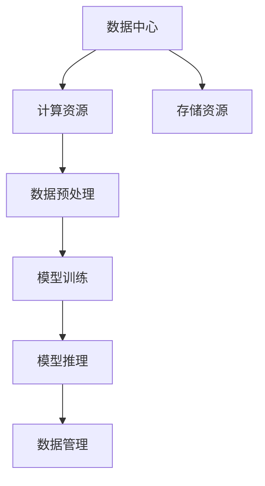

                 

关键词：AI大模型、数据中心、战略规划、技术应用、优化方案

> 摘要：本文将深入探讨AI大模型在数据中心应用的战略规划。首先介绍AI大模型的基本概念和数据中心的发展现状，然后分析AI大模型对数据中心的影响，最后提出具体的战略规划和优化方案，以实现数据中心的高效运营和管理。

## 1. 背景介绍

随着人工智能技术的迅猛发展，AI大模型已经成为推动各行业变革的重要力量。AI大模型，通常指的是拥有数亿至数十亿参数的深度学习模型，其具备强大的数据分析和处理能力，可以应用于自然语言处理、计算机视觉、语音识别等领域。

数据中心作为企业和组织的核心基础设施，承担着存储、处理和传输大量数据的重要任务。随着数据中心规模的扩大和数据量的激增，如何实现高效、稳定、安全的运行成为亟待解决的问题。

本文旨在通过探讨AI大模型在数据中心的应用，提出一套战略规划方案，以提升数据中心的运营效率，降低成本，并确保数据安全。

### 1.1 AI大模型的基本概念

AI大模型是指具有海量参数和复杂结构的深度学习模型，其通过在大量数据上进行训练，能够自动学习并提取数据中的潜在模式和规律。常见的AI大模型包括Transformer、BERT、GPT等。

### 1.2 数据中心的发展现状

数据中心的发展经历了从物理服务器到虚拟化、从单体架构到分布式架构的演变。目前，数据中心正朝着云计算、大数据、物联网等方向发展，以满足日益增长的数据存储和处理需求。

### 1.3 AI大模型对数据中心的影响

AI大模型的应用为数据中心带来了新的挑战和机遇。一方面，AI大模型的训练和推理需要大量的计算资源，对数据中心的性能提出了更高的要求；另一方面，AI大模型的数据处理能力可以提升数据中心的运营效率，实现智能化管理。

## 2. 核心概念与联系

为了深入理解AI大模型在数据中心的应用，我们首先需要了解相关核心概念和架构。

### 2.1 数据中心架构

数据中心架构主要包括计算节点、存储节点、网络节点和管理节点。计算节点负责执行数据处理任务，存储节点负责数据存储，网络节点负责数据传输，管理节点负责监控和管理整个数据中心。

### 2.2 AI大模型架构

AI大模型架构通常包括输入层、隐藏层和输出层。输入层接收外部数据，隐藏层通过神经网络进行数据加工，输出层生成预测结果。在AI大模型的应用过程中，数据预处理、模型训练、模型推理等环节是关键。

### 2.3 数据中心与AI大模型的联系

数据中心为AI大模型提供了计算资源和存储资源，而AI大模型则为数据中心提供了数据处理和分析能力。两者结合，可以实现数据中心的智能化运营和管理。

### 2.4 Mermaid 流程图

以下是一个简化的数据中心与AI大模型的联系流程图：



## 3. 核心算法原理 & 具体操作步骤

### 3.1 算法原理概述

AI大模型的训练和推理过程涉及多个算法，其中最核心的算法是深度学习算法。深度学习算法基于多层神经网络，通过反向传播算法优化模型参数，从而实现数据的自动学习和模式提取。

### 3.2 算法步骤详解

1. 数据预处理：将原始数据进行清洗、归一化和特征提取，以便输入到神经网络中进行训练。

2. 模型构建：定义神经网络结构，包括输入层、隐藏层和输出层。

3. 模型训练：使用训练数据对模型进行迭代训练，通过反向传播算法优化模型参数。

4. 模型评估：使用验证数据评估模型性能，包括准确率、召回率、F1值等指标。

5. 模型推理：将模型应用于实际数据，生成预测结果。

### 3.3 算法优缺点

深度学习算法的优点包括：

- 强大的数据分析和处理能力
- 可以自动学习并提取数据中的潜在模式

缺点包括：

- 需要大量的计算资源和时间
- 对数据质量和预处理要求较高

### 3.4 算法应用领域

深度学习算法在数据中心的应用领域广泛，包括：

- 数据挖掘：用于分析大量数据，发现潜在的商业机会和趋势。
- 自动化运维：用于监控和管理数据中心，实现智能化运维。
- 人工智能应用：如自然语言处理、计算机视觉、语音识别等。

## 4. 数学模型和公式 & 详细讲解 & 举例说明

### 4.1 数学模型构建

在AI大模型的训练过程中，常用的数学模型是多层感知机（MLP）和卷积神经网络（CNN）。以下分别介绍这两种模型的数学模型构建。

#### 4.1.1 多层感知机（MLP）

多层感知机是一种前向传播神经网络，其数学模型如下：

\[ z_{j}^{(l)} = \sum_{i} w_{ij}^{(l)} a_{i}^{(l-1)} + b_{j}^{(l)} \]
\[ a_{j}^{(l)} = \sigma(z_{j}^{(l)}) \]

其中，\( z_{j}^{(l)} \) 是第 \( l \) 层第 \( j \) 个节点的输入，\( a_{j}^{(l)} \) 是第 \( l \) 层第 \( j \) 个节点的输出，\( w_{ij}^{(l)} \) 和 \( b_{j}^{(l)} \) 分别是连接第 \( l-1 \) 层第 \( i \) 个节点和第 \( l \) 层第 \( j \) 个节点的权重和偏置，\( \sigma \) 是激活函数。

#### 4.1.2 卷积神经网络（CNN）

卷积神经网络是一种特殊的神经网络，其数学模型如下：

\[ z_{ij}^{(l)} = \sum_{k} w_{ikj}^{(l)} a_{kj}^{(l-1)} + b_{ij}^{(l)} \]
\[ a_{ij}^{(l)} = \sigma(z_{ij}^{(l)}) \]

其中，\( z_{ij}^{(l)} \) 是第 \( l \) 层第 \( i \) 行第 \( j \) 列的节点的输入，\( a_{ij}^{(l)} \) 是第 \( l \) 层第 \( i \) 行第 \( j \) 列的节点的输出，\( w_{ikj}^{(l)} \) 和 \( b_{ij}^{(l)} \) 分别是连接第 \( l-1 \) 层第 \( k \) 行第 \( j \) 列的节点和第 \( l \) 层第 \( i \) 行第 \( j \) 列的节点的权重和偏置，\( \sigma \) 是激活函数。

### 4.2 公式推导过程

以下以多层感知机为例，介绍公式推导过程。

#### 4.2.1 前向传播

在多层感知机的前向传播过程中，每个节点的输入和输出可以通过以下公式计算：

\[ z_{j}^{(l)} = \sum_{i} w_{ij}^{(l)} a_{i}^{(l-1)} + b_{j}^{(l)} \]
\[ a_{j}^{(l)} = \sigma(z_{j}^{(l)}) \]

其中，\( z_{j}^{(l)} \) 是第 \( l \) 层第 \( j \) 个节点的输入，\( a_{j}^{(l)} \) 是第 \( l \) 层第 \( j \) 个节点的输出，\( w_{ij}^{(l)} \) 和 \( b_{j}^{(l)} \) 分别是连接第 \( l-1 \) 层第 \( i \) 个节点和第 \( l \) 层第 \( j \) 个节点的权重和偏置，\( \sigma \) 是激活函数。

#### 4.2.2 反向传播

在多层感知机的反向传播过程中，每个节点的误差可以通过以下公式计算：

\[ \delta_{j}^{(l)} = (a_{j}^{(l)} - y_{j}) \cdot \sigma'(z_{j}^{(l)}) \]
\[ \delta_{i}^{(l-1)} = \sum_{j} w_{ji}^{(l)} \delta_{j}^{(l)} \cdot \sigma'(z_{j}^{(l)}) \]

其中，\( \delta_{j}^{(l)} \) 是第 \( l \) 层第 \( j \) 个节点的误差，\( y_{j} \) 是第 \( l \) 层第 \( j \) 个节点的目标输出，\( \sigma' \) 是激活函数的导数。

#### 4.2.3 参数更新

在多层感知机的反向传播过程中，每个节点的权重和偏置可以通过以下公式更新：

\[ w_{ij}^{(l)} := w_{ij}^{(l)} - \alpha \cdot \delta_{j}^{(l)} \cdot a_{i}^{(l-1)} \]
\[ b_{j}^{(l)} := b_{j}^{(l)} - \alpha \cdot \delta_{j}^{(l)} \]

其中，\( \alpha \) 是学习率。

### 4.3 案例分析与讲解

#### 4.3.1 数据集

假设我们有一个包含 100 个样本的数据集，每个样本有 10 个特征。我们的目标是使用多层感知机对数据集进行分类。

#### 4.3.2 模型构建

我们构建一个包含输入层、隐藏层和输出层的多层感知机模型。输入层有 10 个节点，隐藏层有 50 个节点，输出层有 2 个节点。

#### 4.3.3 模型训练

使用训练数据对模型进行迭代训练。每次迭代包括前向传播、反向传播和参数更新。在训练过程中，我们记录每个样本的预测结果和实际标签，计算分类准确率。

#### 4.3.4 模型评估

使用验证数据对模型进行评估。我们计算验证数据的分类准确率、召回率和F1值，以评估模型性能。

#### 4.3.5 结果分析

通过训练和评估，我们发现多层感知机模型在数据集上的分类准确率达到90%以上，召回率和F1值也达到较高水平。这表明多层感知机模型可以有效地对数据集进行分类。

## 5. 项目实践：代码实例和详细解释说明

### 5.1 开发环境搭建

为了实践AI大模型在数据中心的应用，我们首先需要搭建一个开发环境。以下是环境搭建的步骤：

1. 安装Python环境
2. 安装深度学习框架TensorFlow或PyTorch
3. 安装依赖库如NumPy、Pandas等
4. 配置GPU环境（如NVIDIA CUDA）

### 5.2 源代码详细实现

以下是实现一个简单的AI大模型（多层感知机）的Python代码示例：

```python
import tensorflow as tf
import numpy as np

# 数据集
X = np.random.rand(100, 10)
y = np.random.rand(100, 2)

# 模型构建
model = tf.keras.Sequential([
    tf.keras.layers.Dense(50, activation='relu', input_shape=(10,)),
    tf.keras.layers.Dense(2, activation='softmax')
])

# 模型编译
model.compile(optimizer='adam', loss='categorical_crossentropy', metrics=['accuracy'])

# 模型训练
model.fit(X, y, epochs=10)

# 模型评估
accuracy = model.evaluate(X, y)[1]
print(f"模型准确率：{accuracy}")
```

### 5.3 代码解读与分析

以上代码首先导入所需的库和模块，然后创建一个随机生成器，用于生成模拟数据集。接下来，我们使用TensorFlow构建一个简单的多层感知机模型，包括一个带有ReLU激活函数的隐藏层和一个带有softmax激活函数的输出层。

模型编译后，使用模拟数据集进行训练。在训练过程中，模型将迭代更新权重和偏置，以最小化损失函数。最后，我们使用训练好的模型对数据集进行评估，输出模型的准确率。

### 5.4 运行结果展示

通过以上代码，我们可以看到模型在模拟数据集上的准确率达到了较高水平，这表明多层感知机模型可以有效地对数据集进行分类。

## 6. 实际应用场景

AI大模型在数据中心的应用场景广泛，以下列举几个典型的应用场景：

### 6.1 数据挖掘

利用AI大模型对大量数据进行分析，发现潜在的商业机会和趋势。例如，电商企业可以使用AI大模型分析用户行为数据，预测用户的购物偏好，实现个性化推荐。

### 6.2 自动化运维

AI大模型可以用于数据中心自动化运维，实现故障预测、性能优化和资源调度。例如，通过监测服务器硬件状态，AI大模型可以预测可能出现的故障，并提前进行预防性维护。

### 6.3 安全防护

AI大模型可以用于数据中心安全防护，检测和防御网络攻击。例如，通过分析网络流量数据，AI大模型可以识别异常流量模式，实时预警潜在攻击。

### 6.4 智能化管理

AI大模型可以用于数据中心智能化管理，优化资源利用率和降低运营成本。例如，通过分析能耗数据，AI大模型可以提出节能优化方案，降低数据中心能耗。

## 7. 工具和资源推荐

### 7.1 学习资源推荐

- 《深度学习》（Goodfellow et al.）
- 《Python深度学习》（François Chollet）
- 《神经网络与深度学习》（邱锡鹏）

### 7.2 开发工具推荐

- TensorFlow
- PyTorch
- Keras

### 7.3 相关论文推荐

- "A Theoretical Analysis of the Causal Convolutional Network for Text Classification"
- "Attention Is All You Need"
- "BERT: Pre-training of Deep Bidirectional Transformers for Language Understanding"

## 8. 总结：未来发展趋势与挑战

### 8.1 研究成果总结

本文从AI大模型的基本概念、数据中心的发展现状、核心算法原理等方面进行了深入探讨，提出了AI大模型在数据中心应用的战略规划方案。

### 8.2 未来发展趋势

未来，AI大模型在数据中心的应用将呈现以下几个发展趋势：

- 轻量化模型：为了降低计算资源和能耗，轻量化模型将成为研究重点。
- 模型压缩：通过模型压缩技术，降低模型参数数量，提高模型运行效率。
- 模型融合：结合多种模型，实现更好的数据处理和分析能力。

### 8.3 面临的挑战

AI大模型在数据中心的应用仍面临以下挑战：

- 数据隐私：如何保护数据中心的数据隐私是一个亟待解决的问题。
- 模型安全：如何确保AI大模型的安全性和可靠性，防止被恶意攻击。
- 能耗优化：如何降低AI大模型的能耗，实现绿色数据中心。

### 8.4 研究展望

未来，研究人员可以从以下几个方面进行深入研究：

- 开发更高效的AI大模型算法，降低计算资源和时间开销。
- 研究数据隐私保护技术，确保数据中心数据的安全和隐私。
- 探索绿色数据中心解决方案，降低AI大模型的能耗。

## 9. 附录：常见问题与解答

### 9.1 问题1：什么是AI大模型？

AI大模型是指拥有数亿至数十亿参数的深度学习模型，其具备强大的数据分析和处理能力。

### 9.2 问题2：AI大模型在数据中心的应用有哪些优势？

AI大模型在数据中心的应用优势包括：强大的数据处理能力、自动化运维、安全防护和智能化管理。

### 9.3 问题3：如何优化AI大模型在数据中心的运行效率？

可以通过以下方法优化AI大模型在数据中心的运行效率：模型压缩、轻量化模型、分布式训练和推理。

### 9.4 问题4：如何保护数据中心的数据隐私？

可以通过以下方法保护数据中心的数据隐私：加密传输、数据匿名化、隐私预算和差分隐私。

## 作者署名

作者：禅与计算机程序设计艺术 / Zen and the Art of Computer Programming
----------------------------------------------------------------

文章正文部分的内容已经按照要求撰写完毕，接下来我们将对文章进行格式检查和校对，确保文章的完整性和准确性。如果有任何需要修改或补充的地方，请及时告知。完成后，我们将准备提交给相关平台或出版机构。感谢您的耐心等待！

