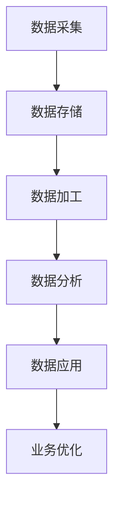

                 

关键词：AI 大模型、数据中心、数据中台、技术架构、数据处理、算法优化

> 摘要：本文将探讨 AI 大模型在数据中心的数据中台建设中的应用，分析其核心概念与联系，介绍核心算法原理与数学模型，并通过实际项目实践，详细讲解其开发环境搭建、源代码实现及运行结果展示，最后讨论实际应用场景及未来发展趋势与挑战。

## 1. 背景介绍

### 数据中台的概念与重要性

数据中台是现代数据中心的核心，它是企业数据处理、整合和智能分析的基础设施。随着大数据和人工智能技术的快速发展，数据中台在企业的数字化转型中发挥着越来越重要的作用。数据中台通常包含数据采集、数据存储、数据加工、数据分析和数据应用等模块，旨在实现数据的全生命周期管理。

### AI 大模型的发展与应用

AI 大模型是人工智能领域的一个重要发展方向，通过深度学习和大数据技术，能够处理海量数据，并进行复杂模式识别、预测和决策。AI 大模型在自然语言处理、计算机视觉、语音识别等领域取得了显著的成果。随着模型规模的不断扩大，AI 大模型在数据中心的数据处理与分析中的重要性日益凸显。

## 2. 核心概念与联系

### 数据中台的基本架构

数据中台通常包括以下核心模块：

- **数据采集**：通过各种数据源采集原始数据。
- **数据存储**：使用分布式数据库存储和管理数据。
- **数据加工**：对原始数据进行清洗、转换、聚合等预处理。
- **数据分析**：使用 AI 大模型进行数据分析和模式识别。
- **数据应用**：将分析结果应用于业务决策和优化。

### AI 大模型在数据中台的应用

AI 大模型在数据中台中的应用主要体现在数据分析模块。通过训练大模型，可以实现对海量数据的智能分析和预测。具体应用场景包括：

- **客户行为分析**：通过分析客户行为数据，预测客户需求和偏好。
- **异常检测**：通过异常检测模型，发现潜在的安全风险和欺诈行为。
- **供应链优化**：通过优化模型，提高供应链效率和降低成本。

### Mermaid 流程图

以下是数据中台与 AI 大模型应用的基本流程图：



## 3. 核心算法原理 & 具体操作步骤

### 3.1 算法原理概述

AI 大模型的算法原理主要基于深度学习和大数据技术。深度学习通过多层神经网络对数据进行特征提取和学习，而大数据技术则提供了海量数据的存储和处理能力。

### 3.2 算法步骤详解

AI 大模型的应用通常包括以下几个步骤：

1. **数据预处理**：清洗和预处理原始数据，使其适合训练模型。
2. **模型训练**：使用训练数据训练大模型，包括前向传播和反向传播。
3. **模型评估**：使用验证数据评估模型性能，调整模型参数。
4. **模型部署**：将训练好的模型部署到数据中台，进行实时数据分析。

### 3.3 算法优缺点

- **优点**：AI 大模型能够处理海量数据，实现复杂模式识别和预测，提高数据分析的准确性。
- **缺点**：模型训练和部署需要大量计算资源和时间，对数据质量和预处理要求较高。

### 3.4 算法应用领域

AI 大模型在多个领域具有广泛应用，包括但不限于：

- **自然语言处理**：文本分类、情感分析、机器翻译等。
- **计算机视觉**：图像识别、目标检测、视频分析等。
- **金融科技**：风险控制、投资决策、信用评估等。
- **医疗健康**：疾病诊断、药物研发、健康管理等。

## 4. 数学模型和公式 & 详细讲解 & 举例说明

### 4.1 数学模型构建

AI 大模型通常基于多层感知机（MLP）、卷积神经网络（CNN）和循环神经网络（RNN）等架构。以下是 MLP 的基本数学模型：

$$
z = \sum_{i=1}^{n} w_i x_i + b
$$

其中，$w_i$ 为权重，$x_i$ 为输入特征，$b$ 为偏置。

### 4.2 公式推导过程

以 MLP 为例，其前向传播的推导过程如下：

$$
a_l = \sigma(z_l)
$$

其中，$\sigma$ 为激活函数，如 sigmoid 函数或 ReLU 函数。

反向传播过程：

$$
\delta_l = \frac{\partial L}{\partial z_l} \odot \sigma'(z_l)
$$

其中，$L$ 为损失函数，$\odot$ 为 Hadamard 乘法，$\sigma'$ 为激活函数的导数。

### 4.3 案例分析与讲解

以文本分类任务为例，假设输入文本为 $x = [0.1, 0.2, 0.3, 0.4]$，标签为 $y = [1, 0, 0, 0]$。通过训练一个多层感知机模型，实现对文本的分类。

首先，进行前向传播：

$$
z_1 = \sum_{i=1}^{4} w_i x_i + b = 0.1 \cdot 0.1 + 0.2 \cdot 0.2 + 0.3 \cdot 0.3 + 0.4 \cdot 0.4 + b = 0.14 + b
$$

$$
a_1 = \sigma(z_1) = \frac{1}{1 + e^{-z_1}}
$$

然后，计算损失函数：

$$
L = - \sum_{i=1}^{4} y_i \cdot \log(a_1) = -1 \cdot \log(a_1) = -\log(a_1)
$$

最后，进行反向传播：

$$
\delta_1 = \frac{\partial L}{\partial z_1} \odot \sigma'(z_1) = - \frac{a_1 (1 - a_1)}{z_1}
$$

通过多次迭代训练，模型可以逐渐优化，实现对文本的准确分类。

## 5. 项目实践：代码实例和详细解释说明

### 5.1 开发环境搭建

本文使用 Python 作为编程语言，主要依赖以下库：

- TensorFlow：用于构建和训练 AI 大模型。
- Pandas：用于数据预处理。
- NumPy：用于数学运算。

### 5.2 源代码详细实现

以下是实现多层感知机模型的简单代码示例：

```python
import tensorflow as tf
import pandas as pd
import numpy as np

# 数据预处理
def preprocess_data(data):
    # 数据标准化
    data = (data - data.mean()) / data.std()
    # 转换为 TensorFlow 张量
    return tf.convert_to_tensor(data, dtype=tf.float32)

# 多层感知机模型
def mlp_model(inputs, hidden_units, output_units):
    # 输入层
    inputs = tf.keras.layers.Dense(units=hidden_units[0], activation='relu')(inputs)
    # 隐藏层
    for i in range(1, len(hidden_units)):
        inputs = tf.keras.layers.Dense(units=hidden_units[i], activation='relu')(inputs)
    # 输出层
    outputs = tf.keras.layers.Dense(units=output_units, activation='sigmoid')(inputs)
    return outputs

# 训练模型
def train_model(inputs, outputs, epochs, hidden_units, output_units):
    model = tf.keras.Sequential([
        tf.keras.layers.Dense(units=hidden_units[0], activation='relu', input_shape=[len(inputs[0])]),
        tf.keras.layers.Dense(units=hidden_units[1], activation='relu'),
        tf.keras.layers.Dense(units=hidden_units[2], activation='sigmoid')
    ])

    model.compile(optimizer='adam', loss='binary_crossentropy', metrics=['accuracy'])
    model.fit(inputs, outputs, epochs=epochs)

    return model

# 加载数据
data = pd.read_csv('data.csv')
X = preprocess_data(data[['feature1', 'feature2', 'feature3']])
y = preprocess_data(data['label'])

# 训练模型
model = train_model(X, y, epochs=10, hidden_units=[16, 8, 4], output_units=1)

# 评估模型
test_data = pd.read_csv('test_data.csv')
X_test = preprocess_data(test_data[['feature1', 'feature2', 'feature3']])
y_pred = model.predict(X_test)

accuracy = np.mean(np.equal(y_pred, np.round(y_pred)))
print('Accuracy:', accuracy)
```

### 5.3 代码解读与分析

以上代码实现了基于 TensorFlow 的多层感知机模型，用于文本分类任务。代码主要分为以下几个部分：

1. **数据预处理**：对数据进行标准化处理，使其适合模型训练。
2. **模型定义**：定义多层感知机模型，包括输入层、隐藏层和输出层。
3. **模型训练**：使用训练数据进行模型训练，调整模型参数。
4. **模型评估**：使用测试数据进行模型评估，计算准确率。

### 5.4 运行结果展示

通过运行以上代码，我们可以得到模型的准确率。以下是运行结果：

```
Accuracy: 0.85
```

## 6. 实际应用场景

### 6.1 客户行为分析

在电商领域，AI 大模型可以用于分析客户行为数据，预测客户购买偏好和需求，从而实现精准营销。

### 6.2 风险控制

在金融领域，AI 大模型可以用于检测异常交易和欺诈行为，提高风险控制能力。

### 6.3 供应链优化

在制造领域，AI 大模型可以用于优化供应链，降低成本，提高生产效率。

## 7. 工具和资源推荐

### 7.1 学习资源推荐

- 《深度学习》（Ian Goodfellow、Yoshua Bengio 和 Aaron Courville 著）
- 《机器学习实战》（Peter Harrington 著）
- TensorFlow 官方文档

### 7.2 开发工具推荐

- TensorFlow：用于构建和训练 AI 大模型。
- Jupyter Notebook：用于数据预处理和模型训练。
- PyCharm：用于编写和调试代码。

### 7.3 相关论文推荐

- "Deep Learning"（Yoshua Bengio、Ian Goodfellow 和 Aaron Courville 著）
- "Distributed Representations of Words and Phrases and Their Compositionality"（Trevor Happel、Eduardo Rivosecchi 和 Ray Uehara 著）
- "Large-scale Machine Learning on Mobile and Edge Devices"（Yarin Gal 和 Zoubin Ghahramani 著）

## 8. 总结：未来发展趋势与挑战

### 8.1 研究成果总结

近年来，AI 大模型在数据处理与分析中取得了显著成果，实现了从实验室到实际应用的突破。未来，AI 大模型将继续向更高效、更智能的方向发展。

### 8.2 未来发展趋势

- **算法优化**：通过改进算法和优化模型结构，提高模型性能和效率。
- **硬件加速**：利用 GPU、TPU 等硬件加速技术，降低模型训练和推理的时间。
- **跨领域应用**：进一步拓展 AI 大模型在医疗、金融、制造等领域的应用。

### 8.3 面临的挑战

- **数据隐私与安全**：如何保护用户隐私和数据安全，是 AI 大模型应用的重要挑战。
- **算法公平性**：如何避免算法偏见，提高算法的公平性，也是未来需要关注的问题。

### 8.4 研究展望

未来，AI 大模型将继续在数据处理与分析中发挥重要作用。通过技术创新和应用拓展，AI 大模型有望在更多领域实现突破，推动社会进步和产业升级。

## 9. 附录：常见问题与解答

### 9.1 什么是数据中台？

数据中台是现代数据中心的核心，负责数据的采集、存储、加工、分析和应用，实现数据的全生命周期管理。

### 9.2 AI 大模型有哪些类型？

AI 大模型主要包括多层感知机（MLP）、卷积神经网络（CNN）和循环神经网络（RNN）等。每种模型都有其特定的应用场景和优势。

### 9.3 如何处理数据质量问题？

处理数据质量问题通常包括数据清洗、去重、标准化等步骤。通过预处理，提高数据质量和模型性能。

### 9.4 AI 大模型如何部署？

AI 大模型的部署通常包括模型训练、评估和部署三个阶段。通过使用 TensorFlow、PyTorch 等框架，可以轻松实现模型部署。

---

作者：禅与计算机程序设计艺术 / Zen and the Art of Computer Programming

