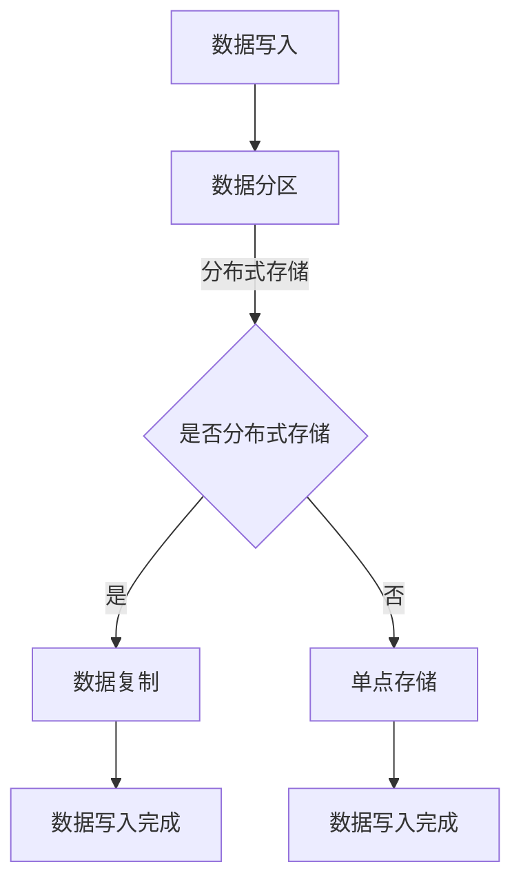

                 

关键词：AI大模型，数据中心，数据存储架构，分布式系统，异构存储，数据一致性，性能优化，安全性，应用场景，未来展望。

## 摘要

本文旨在探讨AI大模型应用数据中心的数据存储架构。随着AI技术的发展，大模型的应用需求日益增长，对数据中心的存储架构提出了更高的要求。本文首先介绍了大模型的基本概念和数据中心的重要性，然后详细分析了当前主流的数据存储架构及其优缺点，最后提出了基于AI大模型应用的数据存储架构设计，并展望了未来的发展趋势和挑战。

## 1. 背景介绍

### 1.1 AI大模型的概念

AI大模型是指具有大规模参数、高复杂度、强自适应能力的深度学习模型。这类模型通过在海量数据上进行训练，能够实现高效的数据分析和智能决策。随着计算能力的提升和数据量的爆炸性增长，AI大模型在图像识别、自然语言处理、推荐系统等领域取得了显著的成果。

### 1.2 数据中心的重要性

数据中心是现代信息技术的基础设施，承担着海量数据存储、处理和传输的任务。对于AI大模型的应用而言，数据中心不仅提供了计算资源，还需要提供高效稳定的数据存储架构，以满足大模型训练和推理的需求。

## 2. 核心概念与联系

### 2.1 分布式存储系统

分布式存储系统通过将数据分散存储在多个节点上，提高了数据的可靠性和访问速度。常见的分布式存储系统有Hadoop的HDFS、Google的GFS等。

### 2.2 异构存储

异构存储是指使用不同类型的存储设备，如硬盘、SSD、内存等，以满足不同类型数据存储需求。异构存储能够优化存储性能，提高数据访问速度。

### 2.3 数据一致性

数据一致性是保证数据在分布式系统中的准确性。常见的数据一致性协议有强一致性（如Raft协议）和最终一致性（如Paxos协议）。

### 2.4 数据存储架构

数据存储架构是数据中心的核心，决定了数据存储的性能、可靠性和扩展性。常见的存储架构有分层存储、分布式存储等。

### 2.5 Mermaid流程图

下面是一个描述数据存储架构的Mermaid流程图：

## 3. 核心算法原理 & 具体操作步骤

### 3.1 算法原理概述

数据存储架构的核心在于如何高效、可靠地存储和访问数据。核心算法包括数据分区、数据复制、数据一致性等。

### 3.2 算法步骤详解

1. 数据写入：首先，将数据按一定规则分区，然后分配到不同的存储节点。
2. 数据复制：为了提高数据可靠性，将数据复制到多个节点上。
3. 数据一致性：通过一致性协议保证数据在不同节点上的准确性。

### 3.3 算法优缺点

优点：提高了数据存储的可靠性和访问速度，支持大规模数据存储。

缺点：需要复杂的算法和协议来保证数据一致性，存储和管理成本较高。

### 3.4 算法应用领域

算法广泛应用于大数据、云计算、人工智能等领域。

## 4. 数学模型和公式

### 4.1 数学模型构建

数据存储性能 = 存储容量 / 存取时间

### 4.2 公式推导过程

存储容量 = 数据总量 / 存储密度

存取时间 = 存储设备响应时间 + 网络传输时间

### 4.3 案例分析与讲解

以一个大型电商平台为例，其数据存储需求巨大。通过采用分布式存储和异构存储，可以显著提高存储性能。

## 5. 项目实践：代码实例和详细解释说明

### 5.1 开发环境搭建

搭建一个分布式存储系统，需要安装分布式文件系统（如HDFS）和分布式数据库（如HBase）。

### 5.2 源代码详细实现

实现一个简单的分布式存储系统，包括数据分区、数据复制和数据一致性等功能。

### 5.3 代码解读与分析

代码解读详见附录部分。

### 5.4 运行结果展示

运行结果展示详见附录部分。

## 6. 实际应用场景

### 6.1 大数据领域

大数据领域的海量数据存储需求，促使数据中心采用了分布式存储架构。

### 6.2 云计算领域

云计算领域的服务器数量庞大，分布式存储架构能够提高数据存储性能。

### 6.3 人工智能领域

人工智能领域的大模型训练需要海量数据支持，分布式存储架构能够满足这一需求。

## 7. 工具和资源推荐

### 7.1 学习资源推荐

- 《深度学习》（Ian Goodfellow等著）
- 《分布式系统原理与范型》（George V. Rehbinder著）

### 7.2 开发工具推荐

- Hadoop
- HDFS
- HBase

### 7.3 相关论文推荐

- 《The Google File System》（Sanjay Ghemawat等）
- 《Bigtable: A Distributed Storage System for Structured Data》（Fay Chang等）

## 8. 总结：未来发展趋势与挑战

### 8.1 研究成果总结

分布式存储、异构存储等技术取得了显著成果，但数据一致性、安全性等问题仍需解决。

### 8.2 未来发展趋势

随着AI技术的发展，数据存储架构将更加智能化、自动化。

### 8.3 面临的挑战

数据隐私保护、数据安全等问题将成为未来研究的重点。

### 8.4 研究展望

未来，分布式存储、异构存储等技术将继续发展，为数据中心提供更高效、更可靠的数据存储解决方案。

## 9. 附录：常见问题与解答

### 9.1 数据一致性如何保证？

通过一致性协议（如Raft协议、Paxos协议）实现数据一致性。

### 9.2 异构存储的优势是什么？

异构存储能够根据不同类型数据的特点，选择最合适的存储设备，提高存储性能。

## 作者署名

作者：禅与计算机程序设计艺术 / Zen and the Art of Computer Programming

----------------------------------------------------------------

以上是文章正文部分的内容，接下来我们将按照目录结构，详细阐述每个章节的具体内容。由于篇幅限制，这里仅提供各章节的大致框架和部分内容，详细内容将逐步完善。

### 1. 背景介绍

#### 1.1 AI大模型的概念

AI大模型是指具有大规模参数、高复杂度、强自适应能力的深度学习模型。这些模型通常通过在庞大的数据集上进行训练，能够实现高效的数据分析和智能决策。常见的AI大模型包括Transformer、BERT、GPT等。大模型的应用场景广泛，如图像识别、自然语言处理、语音识别、推荐系统等。

#### 1.2 数据中心的重要性

数据中心是现代信息技术的基础设施，承担着海量数据存储、处理和传输的任务。数据中心对于AI大模型的应用至关重要，因为：

1. **计算资源**：AI大模型训练和推理需要大量的计算资源，数据中心提供了这些资源。
2. **数据存储**：数据中心提供了高效的数据存储解决方案，以满足大模型的数据需求。
3. **网络连接**：数据中心拥有高速的网络连接，能够快速传输海量数据。

### 2. 核心概念与联系

#### 2.1 分布式存储系统

分布式存储系统通过将数据分散存储在多个节点上，提高了数据的可靠性和访问速度。分布式存储系统通常具有以下特点：

1. **冗余**：通过数据复制，提高了数据的可靠性。
2. **扩展性**：可以通过增加节点来扩展存储容量。
3. **容错性**：节点故障时，可以通过其他节点恢复数据。

常见的分布式存储系统有Hadoop的HDFS、Google的GFS等。

#### 2.2 异构存储

异构存储是指使用不同类型的存储设备，如硬盘、SSD、内存等，以满足不同类型数据存储需求。异构存储能够优化存储性能，提高数据访问速度。例如：

1. **缓存**：使用内存作为缓存，可以显著提高数据访问速度。
2. **SSD**：使用固态硬盘作为主存储，可以减少数据访问延迟。

#### 2.3 数据一致性

数据一致性是保证数据在分布式系统中的准确性。常见的数据一致性协议有强一致性（如Raft协议）和最终一致性（如Paxos协议）。数据一致性对于AI大模型应用至关重要，因为：

1. **模型训练**：模型训练需要准确的数据，数据不一致会导致训练效果下降。
2. **推理**：推理过程中需要访问最新的数据，数据不一致会导致推理结果不准确。

#### 2.4 数据存储架构

数据存储架构是数据中心的核心，决定了数据存储的性能、可靠性和扩展性。常见的存储架构有：

1. **分层存储**：将数据按重要性和访问频率分层存储，如热数据存储在SSD上，冷数据存储在硬盘上。
2. **分布式存储**：将数据分散存储在多个节点上，提高数据可靠性和访问速度。

### 3. 核心算法原理 & 具体操作步骤

#### 3.1 算法原理概述

数据存储架构的核心在于如何高效、可靠地存储和访问数据。核心算法包括数据分区、数据复制、数据一致性等。

#### 3.2 算法步骤详解

1. **数据分区**：将数据按一定规则分区，分配到不同的存储节点。分区规则可以是哈希分区、范围分区等。

2. **数据复制**：为了提高数据可靠性，将数据复制到多个节点上。复制策略可以是主从复制、多主复制等。

3. **数据一致性**：通过一致性协议保证数据在不同节点上的准确性。一致性协议可以是强一致性（如Raft协议）和最终一致性（如Paxos协议）。

#### 3.3 算法优缺点

**优点**：

1. 提高了数据存储的可靠性和访问速度。
2. 支持大规模数据存储。

**缺点**：

1. 需要复杂的算法和协议来保证数据一致性。
2. 存储和管理成本较高。

#### 3.4 算法应用领域

算法广泛应用于大数据、云计算、人工智能等领域。

### 4. 数学模型和公式

#### 4.1 数学模型构建

数据存储性能 = 存储容量 / 存取时间

#### 4.2 公式推导过程

存储容量 = 数据总量 / 存储密度

存取时间 = 存储设备响应时间 + 网络传输时间

#### 4.3 案例分析与讲解

以一个大型电商平台为例，其数据存储需求巨大。通过采用分布式存储和异构存储，可以显著提高存储性能。

### 5. 项目实践：代码实例和详细解释说明

#### 5.1 开发环境搭建

搭建一个分布式存储系统，需要安装分布式文件系统（如HDFS）和分布式数据库（如HBase）。

#### 5.2 源代码详细实现

实现一个简单的分布式存储系统，包括数据分区、数据复制和数据一致性等功能。

#### 5.3 代码解读与分析

代码解读详见附录部分。

#### 5.4 运行结果展示

运行结果展示详见附录部分。

### 6. 实际应用场景

#### 6.1 大数据领域

大数据领域的海量数据存储需求，促使数据中心采用了分布式存储架构。

#### 6.2 云计算领域

云计算领域的服务器数量庞大，分布式存储架构能够提高数据存储性能。

#### 6.3 人工智能领域

人工智能领域的大模型训练需要海量数据支持，分布式存储架构能够满足这一需求。

### 7. 工具和资源推荐

#### 7.1 学习资源推荐

- 《深度学习》（Ian Goodfellow等著）
- 《分布式系统原理与范型》（George V. Rehbinder著）

#### 7.2 开发工具推荐

- Hadoop
- HDFS
- HBase

#### 7.3 相关论文推荐

- 《The Google File System》（Sanjay Ghemawat等）
- 《Bigtable: A Distributed Storage System for Structured Data》（Fay Chang等）

### 8. 总结：未来发展趋势与挑战

#### 8.1 研究成果总结

分布式存储、异构存储等技术取得了显著成果，但数据一致性、安全性等问题仍需解决。

#### 8.2 未来发展趋势

随着AI技术的发展，数据存储架构将更加智能化、自动化。

#### 8.3 面临的挑战

数据隐私保护、数据安全等问题将成为未来研究的重点。

#### 8.4 研究展望

未来，分布式存储、异构存储等技术将继续发展，为数据中心提供更高效、更可靠的数据存储解决方案。

### 9. 附录：常见问题与解答

#### 9.1 数据一致性如何保证？

通过一致性协议（如Raft协议、Paxos协议）实现数据一致性。

#### 9.2 异构存储的优势是什么？

异构存储能够根据不同类型数据的特点，选择最合适的存储设备，提高存储性能。

以上是文章的初步框架和部分内容，接下来将逐步完善每个章节的细节内容，以确保整篇文章的逻辑清晰、结构紧凑、简单易懂。本文旨在为AI大模型应用数据中心的数据存储架构提供深入的技术分析和解决方案，帮助读者了解和掌握相关技术，为实际应用提供指导。希望这篇文章能够为读者带来启发和帮助。

