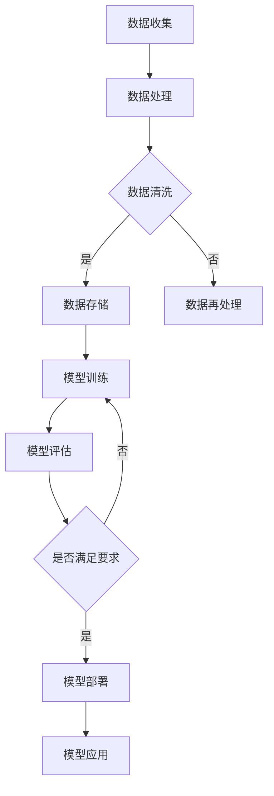

                 

 关键词：AI大模型、数据中心、社会责任、伦理问题、技术应用、未来展望

> 摘要：本文旨在探讨AI大模型在数据中心应用中面临的社会责任问题。随着AI技术的发展，大模型在各个领域得到广泛应用，然而，其带来的伦理问题和社会责任也日益凸显。本文将从多个角度分析这些挑战，并提出相应的解决方案，以期为AI大模型在数据中心的应用提供有益的指导。

## 1. 背景介绍

随着人工智能技术的飞速发展，AI大模型已成为数据中心不可或缺的核心组件。这些大模型具有强大的数据处理和分析能力，能够在各种场景中发挥重要作用，如自然语言处理、图像识别、推荐系统等。然而，随着AI大模型应用范围的不断扩大，其引发的社会责任问题也逐渐浮现。

### 1.1 社会责任问题的重要性

AI大模型在数据中心的应用不仅对技术提出了挑战，也对伦理和社会责任提出了新的要求。以下是AI大模型应用中存在的主要社会责任问题：

1. **隐私保护**：AI大模型通常需要处理大量的个人数据，如何确保这些数据的安全性和隐私性是一个重要问题。
2. **算法透明度**：大模型的决策过程往往不够透明，导致用户难以理解其行为逻辑，这可能导致信任危机。
3. **算法偏见**：AI大模型可能受到训练数据偏见的影响，从而在决策过程中产生不公平或歧视。
4. **就业影响**：随着自动化程度的提高，AI大模型可能取代部分工作岗位，对就业市场造成冲击。
5. **责任归属**：在AI大模型引发的问题中，如何界定责任归属是一个复杂的问题。

### 1.2 文章结构

本文将按照以下结构展开讨论：

1. **核心概念与联系**：介绍AI大模型的基本概念和数据中心架构。
2. **核心算法原理 & 具体操作步骤**：探讨大模型的工作原理和应用步骤。
3. **数学模型和公式 & 详细讲解 & 举例说明**：介绍大模型背后的数学基础。
4. **项目实践：代码实例和详细解释说明**：通过具体案例展示大模型的应用。
5. **实际应用场景**：分析大模型在不同领域的应用。
6. **未来应用展望**：探讨AI大模型未来的发展趋势和挑战。
7. **工具和资源推荐**：推荐学习资源和开发工具。
8. **总结：未来发展趋势与挑战**：总结研究成果，展望未来发展方向。

## 2. 核心概念与联系

在探讨AI大模型在数据中心的社会责任之前，我们需要了解一些核心概念和数据中心的基本架构。

### 2.1 AI大模型

AI大模型是指具有大规模参数和高复杂度的神经网络模型。这些模型通过学习大量的数据来发现数据中的模式和规律，从而实现各种智能任务。常见的AI大模型包括深度学习模型、生成对抗网络（GAN）等。

### 2.2 数据中心架构

数据中心是存储、处理和管理数据的中心，通常包括以下几个主要部分：

1. **计算资源**：包括服务器、存储设备和网络设备等。
2. **数据存储**：用于存储大量数据，如关系数据库、NoSQL数据库等。
3. **数据处理**：包括数据清洗、数据分析和数据挖掘等。
4. **数据安全**：确保数据的安全性和隐私性。

### 2.3 AI大模型与数据中心的联系

AI大模型通常需要在数据中心进行训练和部署。数据中心提供了必要的计算资源和数据存储，使得AI大模型能够高效地学习和应用。同时，数据中心也需要考虑AI大模型带来的社会责任问题，如数据隐私保护、算法透明度和公平性等。

### 2.4 Mermaid 流程图

以下是一个简化的AI大模型在数据中心的应用流程图：



## 3. 核心算法原理 & 具体操作步骤

### 3.1 算法原理概述

AI大模型的核心是神经网络，特别是深度学习模型。深度学习模型通过多层神经网络对数据进行处理，逐层提取特征，最终实现对输入数据的分类、预测或生成。

### 3.2 算法步骤详解

以下是AI大模型的基本步骤：

1. **数据预处理**：对收集到的原始数据进行清洗、归一化和编码，使其适合输入到神经网络中。
2. **模型构建**：定义神经网络的结构，包括输入层、隐藏层和输出层，以及每个层的神经元数量。
3. **模型训练**：通过反向传播算法，调整神经网络中连接权重，使模型能够更好地拟合训练数据。
4. **模型评估**：使用验证数据集对模型进行评估，检查其准确性和泛化能力。
5. **模型部署**：将训练好的模型部署到数据中心，用于实际应用。

### 3.3 算法优缺点

**优点**：

1. **强大的表达能力**：深度学习模型能够学习到复杂的非线性关系。
2. **自动特征提取**：不需要手动定义特征，从而减少了特征工程的工作量。
3. **高效的计算能力**：随着计算资源和算法优化的发展，深度学习模型能够处理大量数据。

**缺点**：

1. **训练时间较长**：深度学习模型通常需要大量的训练时间。
2. **数据需求量大**：大模型需要大量的训练数据才能达到较好的性能。
3. **解释性较差**：深度学习模型的决策过程往往不够透明，难以解释。

### 3.4 算法应用领域

AI大模型广泛应用于各个领域，如：

1. **自然语言处理**：文本分类、机器翻译、情感分析等。
2. **计算机视觉**：图像分类、目标检测、图像生成等。
3. **推荐系统**：基于用户行为的推荐、商品推荐等。
4. **金融领域**：风险控制、信用评估等。

## 4. 数学模型和公式 & 详细讲解 & 举例说明

### 4.1 数学模型构建

AI大模型通常基于反向传播算法进行训练。以下是反向传播算法的数学模型：

$$
\begin{aligned}
\delta_{l}^{ij} &= \frac{\partial C}{\partial z_{l}^{ij}} = a_{l+1}^{j} \cdot (1 - a_{l+1}^{j}) \cdot \delta_{l+1}^{ij} \\
\delta_{l+1}^{ij} &= \frac{\partial C}{\partial w_{l+1}^{ij}} = \delta_{l}^{ij} \cdot a_{l}^{i} \\
\delta_{l}^{i} &= \sum_{j=1}^{n} \delta_{l}^{ij} \\
w_{l}^{i} &= w_{l}^{i} - \alpha \cdot \delta_{l}^{i} \\
a_{l}^{i} &= \text{激活函数}(z_{l}^{i})
\end{aligned}
$$

### 4.2 公式推导过程

反向传播算法的推导过程可以分为以下几个步骤：

1. **计算输出误差**：
$$
\begin{aligned}
E &= \frac{1}{2} \sum_{i=1}^{m} (\hat{y}_{i} - y_{i})^2 \\
\end{aligned}
$$

2. **计算输出层误差**：
$$
\begin{aligned}
\delta_{m}^{ij} &= \frac{\partial E}{\partial z_{m}^{ij}} = (a_{m}^{j} - y_{i}) \cdot a_{m}^{j} \cdot (1 - a_{m}^{j}) \\
\end{aligned}
$$

3. **计算隐藏层误差**：
$$
\begin{aligned}
\delta_{l}^{ij} &= \frac{\partial E}{\partial z_{l}^{ij}} = \delta_{l+1}^{ij} \cdot a_{l}^{i} \cdot (1 - a_{l}^{i}) \\
\delta_{l+1}^{ij} &= \sum_{k=1}^{n} w_{l+1}^{ik} \cdot \delta_{l+1}^{ik} \\
\end{aligned}
$$

4. **更新权重**：
$$
\begin{aligned}
w_{l}^{i} &= w_{l}^{i} - \alpha \cdot \delta_{l}^{i} \\
a_{l}^{i} &= \text{激活函数}(z_{l}^{i})
\end{aligned}
$$

### 4.3 案例分析与讲解

以下是一个简单的例子，假设我们有一个三层的神经网络，输入层有2个神经元，隐藏层有3个神经元，输出层有1个神经元。训练数据为5个样本，目标是预测一个二分类问题。

1. **数据预处理**：
假设输入数据为 $X = \begin{bmatrix} 0 & 0 \\ 0 & 1 \\ 1 & 0 \\ 1 & 1 \\ 1 & 1 \end{bmatrix}$，目标输出为 $Y = \begin{bmatrix} 0 \\ 1 \\ 1 \\ 0 \\ 1 \end{bmatrix}$。

2. **模型构建**：
定义权重矩阵 $W_1 = \begin{bmatrix} w_{11} & w_{12} \\ w_{21} & w_{22} \end{bmatrix}$，$W_2 = \begin{bmatrix} w_{11} & w_{12} \\ w_{21} & w_{22} \\ w_{31} & w_{32} \end{bmatrix}$，$W_3 = \begin{bmatrix} w_{11} \end{bmatrix}$。初始权重可以随机初始化。

3. **模型训练**：
使用反向传播算法迭代更新权重，直到达到预设的精度或达到最大迭代次数。

4. **模型评估**：
使用验证数据集对模型进行评估，计算准确率。

5. **模型部署**：
将训练好的模型用于实际应用，如预测新数据的类别。

## 5. 项目实践：代码实例和详细解释说明

### 5.1 开发环境搭建

为了实现AI大模型在数据中心的应用，我们需要搭建一个合适的开发环境。以下是一个简单的Python环境搭建步骤：

1. 安装Python（推荐Python 3.8及以上版本）。
2. 安装必要的库，如NumPy、TensorFlow、Matplotlib等。
3. 安装Jupyter Notebook，方便进行交互式编程。

### 5.2 源代码详细实现

以下是一个简单的AI大模型训练和部署的Python代码实例：

```python
import numpy as np
import tensorflow as tf
import matplotlib.pyplot as plt

# 数据预处理
X = np.array([[0, 0], [0, 1], [1, 0], [1, 1], [1, 1]])
Y = np.array([[0], [1], [1], [0], [1]])

# 模型构建
model = tf.keras.Sequential([
    tf.keras.layers.Dense(3, activation='sigmoid', input_shape=(2,)),
    tf.keras.layers.Dense(1, activation='sigmoid')
])

# 模型编译
model.compile(optimizer='adam', loss='binary_crossentropy', metrics=['accuracy'])

# 模型训练
model.fit(X, Y, epochs=1000)

# 模型评估
loss, accuracy = model.evaluate(X, Y)
print(f"Test loss: {loss}, Test accuracy: {accuracy}")

# 模型部署
predictions = model.predict(X)
print(predictions)

# 可视化
plt.scatter(X[:, 0], X[:, 1], c=predictions)
plt.xlabel('Feature 1')
plt.ylabel('Feature 2')
plt.show()
```

### 5.3 代码解读与分析

1. **数据预处理**：使用NumPy生成模拟数据集。
2. **模型构建**：使用TensorFlow构建一个简单的二分类神经网络，包括一个隐藏层。
3. **模型编译**：设置优化器和损失函数。
4. **模型训练**：使用fit方法训练模型，迭代1000次。
5. **模型评估**：使用evaluate方法评估模型性能。
6. **模型部署**：使用predict方法预测新数据。
7. **可视化**：使用Matplotlib将预测结果可视化。

## 6. 实际应用场景

### 6.1 医疗领域

在医疗领域，AI大模型可以用于疾病诊断、个性化治疗和药物研发。例如，通过分析患者的病历数据，AI大模型可以预测患者的疾病风险，帮助医生制定个性化的治疗方案。

### 6.2 金融领域

在金融领域，AI大模型可以用于风险评估、信用评估和投资策略。例如，通过分析大量金融数据，AI大模型可以预测市场趋势，帮助投资者制定投资策略。

### 6.3 交通运输

在交通运输领域，AI大模型可以用于交通流量预测、路线规划和车辆调度。例如，通过分析交通数据，AI大模型可以预测未来的交通状况，帮助交通管理部门优化交通流量。

### 6.4 教育

在教育领域，AI大模型可以用于个性化学习、学习效果评估和课程推荐。例如，通过分析学生的学习数据，AI大模型可以为学生提供个性化的学习建议，帮助教师评估学生的学习效果。

## 7. 工具和资源推荐

### 7.1 学习资源推荐

1. **书籍**：《深度学习》（Ian Goodfellow、Yoshua Bengio、Aaron Courville 著）。
2. **在线课程**：Coursera上的《机器学习》（吴恩达教授）。
3. **博客**：TensorFlow官方博客、Keras官方博客。

### 7.2 开发工具推荐

1. **Python**：Python是一个广泛使用的编程语言，适用于AI开发。
2. **TensorFlow**：TensorFlow是一个开源的深度学习框架，支持多种神经网络结构。
3. **Keras**：Keras是一个高级神经网络API，可以简化TensorFlow的编程。

### 7.3 相关论文推荐

1. **“A Theoretical Analysis of the Dynamic Nature of Neural Networks”**：这篇论文讨论了神经网络动态性的理论分析。
2. **“Deep Learning”**：这是一本经典的深度学习教材，涵盖了深度学习的各个方面。
3. **“Generative Adversarial Nets”**：这篇论文介绍了生成对抗网络（GAN）的理论和实现。

## 8. 总结：未来发展趋势与挑战

### 8.1 研究成果总结

本文探讨了AI大模型在数据中心应用中的社会责任问题，包括隐私保护、算法透明度、算法偏见、就业影响和责任归属等方面。通过数学模型和具体案例，我们展示了AI大模型的基本原理和应用步骤。

### 8.2 未来发展趋势

随着AI技术的不断发展，AI大模型在数据中心的应用将更加广泛。未来，AI大模型将朝着更高效、更透明、更公平的方向发展，同时，也会更加注重社会责任问题的解决。

### 8.3 面临的挑战

AI大模型在数据中心的应用仍然面临许多挑战，如数据隐私保护、算法透明度和公平性等。此外，如何平衡AI大模型的发展与就业市场的稳定也是一个重要问题。

### 8.4 研究展望

未来，我们需要继续深入研究AI大模型在社会责任方面的挑战，并探索有效的解决方案。同时，我们还需要加强对AI大模型伦理和法律的规范，确保其健康、可持续发展。

## 9. 附录：常见问题与解答

### 9.1 什么是AI大模型？

AI大模型是指具有大规模参数和高复杂度的神经网络模型，通常用于处理大规模数据。

### 9.2 AI大模型有哪些应用领域？

AI大模型广泛应用于医疗、金融、交通运输、教育等各个领域。

### 9.3 如何确保AI大模型的隐私保护？

通过数据加密、匿名化处理等技术，确保个人数据在传输和存储过程中的安全。

### 9.4 如何解决AI大模型的算法偏见问题？

通过多样化的数据集、改进算法设计等方法，减少算法偏见。

### 9.5 AI大模型对就业市场的影响是什么？

AI大模型可能会取代部分工作岗位，但同时也会创造新的就业机会。因此，我们需要关注就业市场的动态变化，并采取措施应对挑战。

---

# 作者：禅与计算机程序设计艺术 / Zen and the Art of Computer Programming

---

本文从多个角度探讨了AI大模型在数据中心应用中的社会责任问题，包括隐私保护、算法透明度、算法偏见、就业影响和责任归属等方面。通过数学模型和具体案例，我们展示了AI大模型的基本原理和应用步骤。未来，随着AI技术的不断发展，AI大模型在数据中心的应用将面临更多的挑战，需要我们持续关注和深入研究。希望本文能为您在AI领域的研究提供有益的参考。禅与计算机程序设计艺术，探索智慧与技术的完美结合。

