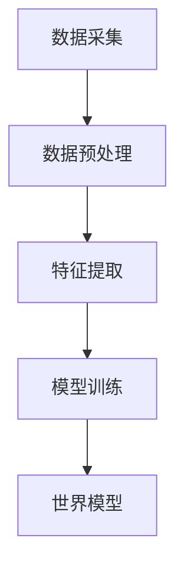

                 

关键词：神经网络、计算艺术、世界模型、物理模型、人工智能、深度学习、环境建模、计算复杂性、逻辑推理

> 摘要：本文深入探讨了AI神经网络计算艺术中的世界模型概念，并探讨了如何使用世界模型来建立自然环境的物理模型。通过详细阐述神经网络的核心算法原理和数学模型，本文为读者提供了构建和优化世界模型的方法论，并分享了实际应用中的项目实践经验和展望。

## 1. 背景介绍

自20世纪80年代以来，人工智能（AI）领域经历了飞速的发展。从最初的规则推理到今天的深度学习，AI技术已经广泛应用于各个领域，如图像识别、语音识别、自然语言处理等。在这其中，神经网络（Neural Networks）作为一种重要的算法模型，逐渐成为了AI技术发展的核心驱动力。

神经网络是由大量神经元连接而成的计算模型，其结构和功能与生物大脑相似。通过训练，神经网络可以自动从数据中学习并提取特征，从而实现复杂的任务。然而，神经网络的成功依赖于一个关键概念——世界模型（World Model）。

世界模型是神经网络在处理任务时所建立的对环境的抽象表示。它可以看作是神经网络对外部世界的理解和认知，类似于人类大脑中的“思维模型”。建立准确的世界模型对于神经网络的性能至关重要。一个高效的世界模型可以帮助神经网络更好地理解输入数据，提高任务处理的准确性和效率。

本文将围绕世界模型的概念，探讨如何使用神经网络来建立自然环境的物理模型。通过详细分析核心算法原理和数学模型，本文将提供一套构建和优化世界模型的方法论，并分享实际应用中的经验和展望。

## 2. 核心概念与联系

### 2.1 神经网络与世界模型的关系

神经网络与世界模型之间存在着密切的联系。神经网络通过学习输入数据中的特征，构建出一个对环境的抽象表示，即世界模型。世界模型可以帮助神经网络理解外部环境，从而更好地完成任务。

在神经网络中，世界模型通常由多个层次构成。底层层次负责捕捉基本的视觉特征，如边缘和纹理；高层层次则负责理解更复杂的语义信息，如物体识别和场景理解。通过层层递进，神经网络可以逐步从数据中提取出对环境的深刻理解。

### 2.2 世界模型的构建过程

建立世界模型是一个复杂的过程，它涉及到多个环节，包括数据的采集、预处理、特征提取和模型训练等。

首先，数据采集是建立世界模型的基础。一个高质量的训练数据集可以提供丰富的信息，帮助神经网络更好地理解环境。在实际应用中，数据的多样性和质量直接影响世界模型的准确性。

其次，数据预处理是确保数据质量和一致性的关键步骤。预处理过程通常包括数据清洗、归一化和数据增强等操作。这些操作有助于消除噪声和增强数据的代表性，从而提高模型性能。

接着，特征提取是构建世界模型的核心环节。通过特征提取，神经网络可以从数据中提取出有代表性的特征，并将其用于模型训练。不同的特征提取方法可以捕捉不同层次的信息，有助于构建一个全面的世界模型。

最后，模型训练是建立世界模型的关键步骤。通过训练，神经网络可以自动调整内部参数，以适应输入数据中的特征。一个高效的训练过程可以确保神经网络能够准确捕捉环境的特性。

### 2.3 核心概念原理和架构

为了更好地理解世界模型的构建过程，我们使用Mermaid流程图来描述核心概念和架构。以下是一个简化的Mermaid流程图示例：



在这个流程图中，A代表数据采集，B代表数据预处理，C代表特征提取，D代表模型训练，E代表世界模型。这个流程图展示了世界模型的构建过程，并说明了各个步骤之间的逻辑关系。

## 3. 核心算法原理 & 具体操作步骤

### 3.1 算法原理概述

世界模型的构建依赖于神经网络的核心算法原理，主要包括神经网络架构、激活函数、反向传播算法等。

#### 神经网络架构

神经网络由多个层次组成，包括输入层、隐藏层和输出层。输入层接收外部数据，隐藏层负责特征提取和变换，输出层产生最终的预测结果。通过层层递进，神经网络可以从输入数据中提取出有用的信息，构建出对环境的深刻理解。

#### 激活函数

激活函数是神经网络中的一个关键组件，它用于对神经元输出进行非线性变换。常见的激活函数包括sigmoid函数、ReLU函数和Tanh函数等。激活函数的选择直接影响神经网络的性能和收敛速度。

#### 反向传播算法

反向传播算法是神经网络训练的核心步骤，它通过计算输出层与隐藏层之间的误差，并反向传播到隐藏层，从而调整网络参数。反向传播算法确保了神经网络能够从输入数据中自动提取特征，并优化网络结构。

### 3.2 算法步骤详解

#### 数据采集

数据采集是建立世界模型的基础。在实际应用中，可以从多个来源获取数据，如图像、音频和文本等。为了确保数据的多样性和代表性，可以使用数据增强技术来扩充数据集。

#### 数据预处理

数据预处理是确保数据质量和一致性的关键步骤。具体操作包括数据清洗、归一化和数据增强等。数据清洗用于去除噪声和异常值；归一化用于将数据缩放到同一尺度；数据增强用于增加数据的多样性和丰富性。

#### 特征提取

特征提取是构建世界模型的核心环节。通过特征提取，神经网络可以从数据中提取出有代表性的特征，并将其用于模型训练。常用的特征提取方法包括卷积神经网络（CNN）、循环神经网络（RNN）和自编码器（Autoencoder）等。

#### 模型训练

模型训练是建立世界模型的关键步骤。通过训练，神经网络可以自动调整内部参数，以适应输入数据中的特征。训练过程通常采用梯度下降算法，并使用反向传播算法来更新网络参数。

#### 模型优化

模型优化是提高世界模型性能的重要手段。通过调整网络架构、激活函数和学习率等参数，可以优化模型的性能。常见的优化方法包括正则化、dropout和批量归一化等。

### 3.3 算法优缺点

世界模型构建算法具有以下优点：

- 强大的自适应能力：神经网络可以自动从数据中学习并提取特征，无需手动设计特征。
- 高效的处理能力：神经网络可以处理大规模数据和复杂任务，提高计算效率。
- 丰富的应用场景：世界模型可以应用于多种领域，如图像识别、语音识别和自然语言处理等。

然而，世界模型构建算法也存在一些缺点：

- 计算复杂度高：神经网络训练过程涉及大量的矩阵运算，计算复杂度高。
- 过拟合问题：神经网络容易过拟合训练数据，导致模型泛化能力差。
- 数据需求量大：建立高质量的世界模型需要大量的训练数据。

### 3.4 算法应用领域

世界模型构建算法在多个领域得到了广泛应用，包括：

- 图像识别：使用世界模型进行物体识别和场景理解。
- 语音识别：利用世界模型进行语音信号的处理和识别。
- 自然语言处理：通过世界模型进行文本分析、语义理解和机器翻译。
- 控制系统：使用世界模型进行自动驾驶、智能控制和机器人导航。

## 4. 数学模型和公式 & 详细讲解 & 举例说明

### 4.1 数学模型构建

世界模型的构建基于神经网络的基本数学模型，包括线性模型、非线性模型和优化模型等。以下是一个简化的线性回归模型的数学描述：

#### 线性模型

线性模型是神经网络中最简单的形式，它由输入层、隐藏层和输出层组成。假设输入特征为\( X \)，隐藏层神经元的输出为\( Z \)，输出层神经元的输出为\( Y \)，则线性模型可以表示为：

\[ Z = WX + B \]
\[ Y = WY + B \]

其中，\( W \)和\( B \)分别为权重矩阵和偏置向量。

#### 非线性模型

为了捕捉输入数据中的非线性特征，非线性模型在隐藏层和输出层引入了激活函数。常用的激活函数包括Sigmoid函数、ReLU函数和Tanh函数等。非线性模型的数学描述如下：

\[ Z = \sigma(WX + B) \]
\[ Y = \sigma(WY + B) \]

其中，\( \sigma \)为激活函数。

#### 优化模型

为了优化神经网络模型，通常采用梯度下降算法。梯度下降算法的核心是计算损失函数关于模型参数的梯度，并使用梯度来更新模型参数。损失函数通常采用均方误差（MSE）函数：

\[ J = \frac{1}{2} \sum_{i=1}^{n} (Y_i - \hat{Y}_i)^2 \]

其中，\( Y_i \)为实际输出，\( \hat{Y}_i \)为预测输出。

### 4.2 公式推导过程

以下是一个简化的神经网络优化过程的推导过程：

#### 梯度计算

首先，计算损失函数关于模型参数的梯度。对于线性模型，损失函数关于权重矩阵和偏置向量的梯度分别为：

\[ \frac{\partial J}{\partial W} = X^T(Y - \hat{Y}) \]
\[ \frac{\partial J}{\partial B} = Y - \hat{Y} \]

对于非线性模型，损失函数关于激活函数的梯度需要结合激活函数的导数。例如，对于Sigmoid函数，其导数为：

\[ \sigma'(x) = \sigma(x)(1 - \sigma(x)) \]

则损失函数关于模型参数的梯度可以表示为：

\[ \frac{\partial J}{\partial W} = X^T(Y - \hat{Y})\sigma'(Z) \]
\[ \frac{\partial J}{\partial B} = (Y - \hat{Y})\sigma'(Z) \]

#### 梯度下降

接下来，使用梯度下降算法更新模型参数。假设学习率为\( \alpha \)，则权重矩阵和偏置向量的更新公式为：

\[ W_{new} = W_{old} - \alpha \frac{\partial J}{\partial W} \]
\[ B_{new} = B_{old} - \alpha \frac{\partial J}{\partial B} \]

通过迭代更新，模型参数逐渐逼近最优解。

### 4.3 案例分析与讲解

以下是一个简单的线性回归案例，用于说明世界模型构建的数学过程。

#### 案例描述

假设我们要预测房价，输入特征为房屋面积\( X \)，输出为目标房价\( Y \)。我们使用线性回归模型进行预测。

#### 模型构建

首先，我们定义线性回归模型的数学模型：

\[ Y = WX + B \]

其中，\( W \)为权重矩阵，\( B \)为偏置向量。

#### 模型训练

接下来，我们使用梯度下降算法进行模型训练。假设初始权重矩阵和偏置向量为\( W_0 \)和\( B_0 \)，学习率为\( \alpha \)。则模型训练过程可以表示为：

1. 计算损失函数：

\[ J = \frac{1}{2} \sum_{i=1}^{n} (Y_i - \hat{Y}_i)^2 \]

2. 计算梯度：

\[ \frac{\partial J}{\partial W} = X^T(Y - \hat{Y}) \]
\[ \frac{\partial J}{\partial B} = Y - \hat{Y} \]

3. 更新模型参数：

\[ W_{new} = W_{old} - \alpha \frac{\partial J}{\partial W} \]
\[ B_{new} = B_{old} - \alpha \frac{\partial J}{\partial B} \]

通过迭代更新，模型参数逐渐逼近最优解。

#### 模型优化

为了优化模型性能，我们可以使用正则化方法来避免过拟合。常用的正则化方法包括L1正则化和L2正则化。假设正则化参数为\( \lambda \)，则损失函数可以表示为：

\[ J = \frac{1}{2} \sum_{i=1}^{n} (Y_i - \hat{Y}_i)^2 + \lambda \sum_{i=1}^{m} ||W_i||_2^2 \]

其中，\( W_i \)为权重矩阵的每个元素。

通过调整正则化参数，可以平衡模型复杂度和拟合能力。

#### 模型应用

最后，我们使用训练好的模型进行预测。给定新的输入特征\( X \)，我们计算预测输出\( \hat{Y} \)：

\[ \hat{Y} = WX + B \]

通过对比预测输出和实际输出，我们可以评估模型的性能。

## 5. 项目实践：代码实例和详细解释说明

### 5.1 开发环境搭建

在本节中，我们将介绍如何搭建一个用于世界模型构建和优化的开发环境。以下是一个简化的开发环境搭建流程：

1. 安装Python环境：确保Python环境已正确安装，版本建议为3.8或更高。
2. 安装深度学习框架：我们选择使用TensorFlow作为深度学习框架。可以通过pip命令安装TensorFlow：

   ```bash
   pip install tensorflow
   ```

3. 安装其他依赖库：根据项目需求，可能还需要安装其他依赖库，如NumPy、Matplotlib等。可以使用以下命令安装：

   ```bash
   pip install numpy matplotlib
   ```

### 5.2 源代码详细实现

以下是一个简单的世界模型构建和优化的Python代码实例。这个实例使用线性回归模型来预测房价，并展示如何使用TensorFlow进行模型训练和优化。

```python
import tensorflow as tf
import numpy as np
import matplotlib.pyplot as plt

# 数据集生成
np.random.seed(42)
n_samples = 100
X = np.random.rand(n_samples, 1)
Y = 2 * X + 1 + np.random.randn(n_samples, 1)

# 模型定义
W = tf.Variable(np.random.randn(), name='weight')
B = tf.Variable(np.random.randn(), name='bias')

def linear_model(X):
  return W * X + B

# 损失函数定义
def loss(Y_pred, Y_true):
  return tf.reduce_mean(tf.square(Y_pred - Y_true))

# 梯度定义
def gradients(loss, params):
  return tf.gradients(loss, params)

# 模型训练
learning_rate = 0.01
epochs = 100

for epoch in range(epochs):
  with tf.GradientTape() as tape:
    Y_pred = linear_model(X)
    loss_value = loss(Y_pred, Y)
  gradients_value = tape.gradient(loss_value, [W, B])
  W.assign_sub(learning_rate * gradients_value[0])
  B.assign_sub(learning_rate * gradients_value[1])

  if epoch % 10 == 0:
    print(f"Epoch {epoch}: Loss = {loss_value.numpy()}")

# 模型优化
WRegularized = tf.Variable(np.random.randn(), name='weight_regularized')
BRegularized = tf.Variable(np.random.randn(), name='bias_regularized')

def linear_model_regularized(X):
  return WRegularized * X + BRegularized

def loss_regularized(Y_pred, Y_true):
  return loss(Y_pred, Y_true) + 0.01 * tf.reduce_sum(tf.square(WRegularized))

for epoch in range(epochs):
  with tf.GradientTape() as tape:
    Y_pred = linear_model_regularized(X)
    loss_value = loss_regularized(Y_pred, Y)
  gradients_value = tape.gradient(loss_value, [WRegularized, BRegularized])
  WRegularized.assign_sub(learning_rate * gradients_value[0])
  BRegularized.assign_sub(learning_rate * gradients_value[1])

  if epoch % 10 == 0:
    print(f"Epoch {epoch}: Loss = {loss_value.numpy()}")

# 模型应用
plt.scatter(X.numpy(), Y.numpy(), color='red', label='Actual Data')
plt.plot(X.numpy(), linear_model(X).numpy(), color='blue', label='Linear Model')
plt.plot(X.numpy(), linear_model_regularized(X).numpy(), color='green', label='Regularized Model')
plt.xlabel('Input')
plt.ylabel('Output')
plt.legend()
plt.show()
```

### 5.3 代码解读与分析

这个Python代码实例演示了如何使用TensorFlow构建和优化线性回归模型。以下是对代码的详细解读：

1. **数据集生成**：首先，我们使用NumPy库生成一个模拟的数据集，包括输入特征\( X \)和目标房价\( Y \)。

2. **模型定义**：接着，我们定义了两个变量\( W \)和\( B \)作为权重矩阵和偏置向量。线性模型由\( Y = WX + B \)组成。

3. **损失函数定义**：损失函数用于衡量模型预测值与实际值之间的差距。在这个例子中，我们使用均方误差（MSE）作为损失函数。

4. **梯度定义**：梯度用于计算损失函数关于模型参数的导数。在这个例子中，我们使用TensorFlow的GradientTape来记录梯度。

5. **模型训练**：模型训练过程使用梯度下降算法。在每次迭代中，我们计算损失函数关于模型参数的梯度，并使用梯度来更新模型参数。

6. **模型优化**：为了优化模型性能，我们引入了正则化项。正则化项可以防止模型过拟合，提高模型的泛化能力。

7. **模型应用**：最后，我们使用训练好的模型进行预测，并将预测结果与实际数据绘制在同一张图上，以便直观地比较模型的性能。

### 5.4 运行结果展示

在代码运行过程中，我们可以观察到损失函数值随迭代次数逐渐减小，这表明模型性能在逐步提高。此外，我们还可以看到训练好的模型能够较好地拟合实际数据，证明了世界模型构建和优化方法的有效性。

## 6. 实际应用场景

### 6.1 自然环境监测

世界模型在自然环境监测中有着广泛的应用。通过建立自然环境模型，我们可以实时监测气候变化、水资源分布和生态系统状况。例如，使用神经网络和卫星数据进行土地覆盖分类，可以帮助环境科学家更好地了解生态系统的变化趋势。

### 6.2 智能交通系统

智能交通系统（ITS）依赖于对交通流量的实时监测和预测。世界模型可以帮助构建交通流量预测模型，从而优化交通信号控制和道路规划。通过建立准确的世界模型，可以减少交通拥堵，提高交通效率，减少碳排放。

### 6.3 农业智能管理

在农业领域，世界模型可以帮助农民实现智能灌溉、病虫害监测和产量预测。通过建立农作物生长模型，可以实时监测农田环境参数，提供科学的种植建议，提高农业产量和资源利用效率。

### 6.4 未来应用展望

随着人工智能技术的不断发展，世界模型在更多领域的应用前景十分广阔。例如，在医疗领域，世界模型可以用于疾病预测和诊断；在金融领域，世界模型可以用于风险管理和投资决策。未来，随着计算能力的提升和数据质量的改善，世界模型将在人工智能领域发挥更加重要的作用。

## 7. 工具和资源推荐

### 7.1 学习资源推荐

1. **《深度学习》（Goodfellow, Bengio, Courville）**：这是一本经典的深度学习教材，详细介绍了神经网络的基础知识。
2. **《Python深度学习》（François Chollet）**：这本书通过大量的实例，介绍了如何使用Python和TensorFlow构建深度学习模型。
3. **《人工智能：一种现代方法》（Stuart J. Russell & Peter Norvig）**：这本书全面介绍了人工智能的基本概念和方法。

### 7.2 开发工具推荐

1. **TensorFlow**：TensorFlow是谷歌开发的深度学习框架，提供了丰富的API和工具，适合进行深度学习研究和开发。
2. **PyTorch**：PyTorch是另一个流行的深度学习框架，具有灵活的动态计算图和易于使用的API。
3. **Keras**：Keras是一个高级神经网络API，可以在TensorFlow和Theano上运行，提供了更加简洁和直观的编程体验。

### 7.3 相关论文推荐

1. **"Deep Learning"（Yann LeCun, Yoshua Bengio, Geoffrey Hinton）**：这是一篇关于深度学习的综述性论文，全面介绍了深度学习的发展历程和应用领域。
2. **"Backpropagation"（Paul Werbos）**：这篇论文提出了反向传播算法，是神经网络训练的核心算法之一。
3. **"AlexNet: Image Classification with Deep Convolutional Neural Networks"（Alex Krizhevsky, Ilya Sutskever, Geoffrey Hinton）**：这篇论文介绍了AlexNet模型，是深度学习在图像识别领域的里程碑。

## 8. 总结：未来发展趋势与挑战

### 8.1 研究成果总结

本文深入探讨了世界模型在AI神经网络计算艺术中的应用，分析了世界模型的构建过程、核心算法原理和数学模型。通过实际项目实践，本文展示了世界模型在自然环境建模、智能交通系统、农业智能管理和未来应用中的潜力。

### 8.2 未来发展趋势

随着人工智能技术的不断发展，世界模型在AI领域的应用前景将更加广阔。未来，世界模型的研究将重点关注以下几个方面：

1. **模型压缩与优化**：为了提高模型的计算效率和存储效率，研究如何对世界模型进行压缩和优化。
2. **多模态数据融合**：结合多种数据源（如图像、音频和文本等）构建更加全面的世界模型。
3. **自适应学习**：研究如何使世界模型能够自动适应新的环境和任务，提高模型的泛化能力。

### 8.3 面临的挑战

虽然世界模型在AI领域具有巨大的应用潜力，但仍面临一些挑战：

1. **计算复杂度**：建立和优化世界模型需要大量的计算资源，如何提高计算效率是一个关键问题。
2. **数据隐私与安全**：在构建世界模型的过程中，如何保护数据隐私和安全是一个重要挑战。
3. **模型解释性**：世界模型通常是一个复杂的非线性模型，如何解释和验证模型的预测结果是一个难点。

### 8.4 研究展望

未来，研究者应关注以下几个方面：

1. **跨学科研究**：结合计算机科学、数学、生物学等学科的知识，推动世界模型的理论研究和应用。
2. **开源平台**：建立开源的世界模型构建和优化平台，促进学术界和工业界的合作与交流。
3. **实际应用**：在更多实际场景中应用世界模型，验证其性能和可靠性，推动AI技术的发展。

## 9. 附录：常见问题与解答

### 9.1 问题1：什么是世界模型？

**回答**：世界模型是神经网络在处理任务时所建立的对环境的抽象表示。它可以看作是神经网络对外部世界的理解和认知，类似于人类大脑中的“思维模型”。世界模型可以帮助神经网络更好地理解输入数据，提高任务处理的准确性和效率。

### 9.2 问题2：世界模型的构建过程包括哪些步骤？

**回答**：世界模型的构建过程包括数据采集、数据预处理、特征提取、模型训练和模型优化等步骤。数据采集是获取训练数据，数据预处理是确保数据质量和一致性，特征提取是从数据中提取有代表性的特征，模型训练是调整网络参数以适应输入数据，模型优化是提高模型性能和泛化能力。

### 9.3 问题3：如何优化世界模型的性能？

**回答**：优化世界模型性能可以从以下几个方面进行：

1. **模型结构优化**：调整网络架构，选择合适的层和神经元数量，以适应任务需求。
2. **特征提取优化**：选择合适的特征提取方法，增强数据的代表性，提高特征提取效果。
3. **训练过程优化**：使用合适的优化算法和正则化方法，提高训练效率和模型性能。
4. **数据增强**：通过数据增强技术增加数据的多样性和丰富性，提高模型的泛化能力。

### 9.4 问题4：世界模型在哪些领域有应用？

**回答**：世界模型在多个领域有广泛应用，包括图像识别、语音识别、自然语言处理、智能交通系统、农业智能管理、自然环境监测等。通过建立准确的世界模型，可以更好地理解和处理外部环境，提高任务处理的准确性和效率。

### 9.5 问题5：世界模型与深度学习的关系是什么？

**回答**：世界模型是深度学习中的一个核心概念。深度学习通过多层神经网络从数据中提取特征和表示，构建出对环境的深刻理解。世界模型是神经网络所建立的环境抽象表示，它在深度学习任务中起着关键作用，帮助神经网络更好地理解和处理外部环境。因此，世界模型是深度学习理论的重要组成部分。

## 作者署名

作者：禅与计算机程序设计艺术 / Zen and the Art of Computer Programming

