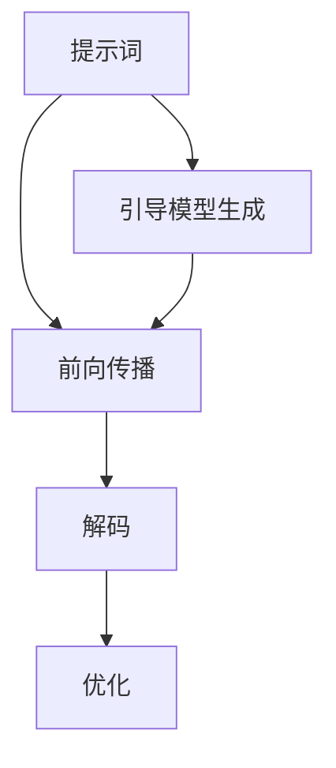

                 

关键词：AIGC, ChatGPT, 提示词，入门，实战，技术博客

> 摘要：本文旨在为读者提供AIGC（人工智能生成内容）的基础知识，重点探讨如何撰写有效的提示词以提升ChatGPT的性能和应用效果。我们将从背景介绍、核心概念与联系、核心算法原理、数学模型与公式、项目实践以及实际应用场景等方面详细阐述，帮助读者深入理解AIGC的内在机制，掌握撰写高质量提示词的技巧，为未来在人工智能领域的发展奠定坚实基础。

## 1. 背景介绍

随着人工智能技术的迅猛发展，AIGC（Artificial Intelligence Generated Content）成为了一个热门的研究领域。AIGC指的是利用人工智能技术生成内容的过程，包括文本、图像、音频等多种形式。其中，文本生成是AIGC领域的重要分支，而ChatGPT则是当前最流行的文本生成模型之一。

ChatGPT是由OpenAI开发的一种基于GPT（Generative Pre-trained Transformer）架构的预训练语言模型。GPT模型通过大量的文本数据进行训练，学习语言的模式和规则，从而能够生成连贯、符合语言习惯的文本。ChatGPT的应用范围非常广泛，包括智能客服、文本生成、对话系统、内容审核等。

然而，要充分发挥ChatGPT的潜力，撰写高质量的提示词是关键。提示词是指用户提供给模型的输入信息，用于指导模型生成相应的文本。有效的提示词能够提高模型的生成质量，减少错误和歧义，从而提升整个系统的性能和应用效果。

本文将围绕ChatGPT的提示词撰写展开讨论，旨在帮助读者掌握这一关键技术，深入了解AIGC领域的实战技巧。

## 2. 核心概念与联系

### 2.1 AIGC的核心概念

AIGC的核心概念包括以下几个部分：

1. **人工智能**：指模拟、延伸和扩展人类智能的技术系统。它包括机器学习、深度学习、自然语言处理等多种技术。

2. **生成内容**：指通过算法生成具有创意性和实用性的内容，如文本、图像、音频等。

3. **生成模型**：指用于生成数据的模型，如生成对抗网络（GAN）、变分自编码器（VAE）等。

4. **预训练**：指在大量数据上进行训练，以便模型能够自动学习到语言的规则和模式。

### 2.2 ChatGPT的工作原理

ChatGPT是一种基于GPT架构的预训练语言模型。GPT模型通过以下步骤生成文本：

1. **输入编码**：将输入文本编码为向量表示。

2. **前向传播**：通过多层神经网络对输入向量进行处理，生成输出向量。

3. **解码**：将输出向量解码为文本输出。

4. **优化**：通过反向传播和梯度下降等优化算法，不断调整模型的参数，提高生成质量。

### 2.3 提示词的作用

提示词在ChatGPT中起着至关重要的作用。有效的提示词能够：

1. **引导模型生成**：通过提供明确的输入信息，引导模型生成符合预期的文本。

2. **提高生成质量**：避免模型生成错误或低质量的文本。

3. **减少歧义**：明确输入意图，减少模型在理解输入时的歧义。

4. **提高性能**：优化模型的输入，提高生成速度和效率。

### 2.4 Mermaid 流程图

以下是AIGC中核心概念和ChatGPT工作原理的Mermaid流程图：



## 3. 核心算法原理 & 具体操作步骤

### 3.1 算法原理概述

ChatGPT基于GPT模型，采用预训练和微调的方法进行训练。预训练阶段，模型在大量文本数据上进行训练，学习语言的规则和模式。微调阶段，模型根据特定任务的数据进行训练，进一步提高生成质量。

ChatGPT的生成过程主要包括以下步骤：

1. 输入编码：将输入文本编码为向量表示。

2. 前向传播：通过多层神经网络对输入向量进行处理，生成输出向量。

3. 解码：将输出向量解码为文本输出。

4. 优化：通过反向传播和梯度下降等优化算法，不断调整模型的参数，提高生成质量。

### 3.2 算法步骤详解

1. **数据准备**：收集大量文本数据，用于模型的预训练和微调。

2. **模型初始化**：初始化GPT模型，包括词嵌入层、自注意力机制和前馈神经网络等。

3. **预训练**：在大量文本数据上进行训练，学习语言的规则和模式。预训练过程包括以下步骤：

   - 输入编码：将输入文本编码为向量表示。

   - 前向传播：通过多层神经网络对输入向量进行处理，生成输出向量。

   - 解码：将输出向量解码为文本输出。

   - 优化：通过反向传播和梯度下降等优化算法，不断调整模型的参数，提高生成质量。

4. **微调**：在特定任务的数据上进行训练，进一步提高生成质量。微调过程与预训练类似，但使用的是特定任务的数据。

5. **生成文本**：接收用户输入，通过模型生成相应的文本输出。

### 3.3 算法优缺点

**优点**：

1. **强大的生成能力**：基于深度学习技术，ChatGPT能够生成高质量、连贯的文本。

2. **适应性强**：通过预训练和微调，ChatGPT能够适应不同领域的任务。

3. **效率高**：模型在训练和生成过程中具有较高的计算效率。

**缺点**：

1. **资源消耗大**：模型训练和推理过程中需要大量的计算资源和存储空间。

2. **训练时间较长**：模型训练过程需要较长时间，尤其是大规模模型的训练。

3. **数据依赖性强**：模型的生成质量受训练数据的影响较大，数据质量直接影响模型的性能。

### 3.4 算法应用领域

ChatGPT在以下领域具有广泛的应用：

1. **文本生成**：包括文章、故事、摘要、新闻等。

2. **对话系统**：包括智能客服、聊天机器人等。

3. **内容审核**：包括文本分类、情感分析、虚假信息检测等。

4. **翻译**：包括机器翻译、跨语言文本生成等。

## 4. 数学模型和公式 & 详细讲解 & 举例说明

### 4.1 数学模型构建

ChatGPT的数学模型主要包括词嵌入、自注意力机制和前馈神经网络等部分。以下是这些部分的数学模型构建：

1. **词嵌入**：

   词嵌入是将词汇映射为高维向量表示的方法。常用的词嵌入方法包括Word2Vec、GloVe等。假设词汇表中有V个词汇，词向量维度为d，则词嵌入可以表示为：

   $$ embedding\_size = d \times V $$

2. **自注意力机制**：

   自注意力机制是一种用于计算输入序列中各个元素之间关系的注意力权重的方法。假设输入序列为\(x_1, x_2, ..., x_n\)，自注意力权重为\(a_1, a_2, ..., a_n\)，则自注意力机制可以表示为：

   $$ a_i = \frac{e^{scores_i}}{\sum_{j=1}^{n} e^{scores_j}} $$

   其中，\(scores_i = x_i^T W_a\)，\(W_a\)为自注意力权重矩阵。

3. **前馈神经网络**：

   前馈神经网络是一种用于处理输入数据的神经网络结构。假设输入数据为\(x\)，输出数据为\(y\)，则前馈神经网络可以表示为：

   $$ y = f(x; W, b) $$

   其中，\(f\)为激活函数，\(W\)为权重矩阵，\(b\)为偏置。

### 4.2 公式推导过程

ChatGPT的生成过程可以通过以下步骤进行推导：

1. **输入编码**：

   将输入文本编码为向量表示。假设输入文本为\(x\)，词向量维度为\(d\)，则输入编码可以表示为：

   $$ x \rightarrow \text{Tokenization} \rightarrow x_{\text{encoded}} $$

2. **前向传播**：

   通过多层神经网络对输入向量进行处理，生成输出向量。假设输入向量为\(x_{\text{encoded}}\)，输出向量为\(y_{\text{encoded}}\)，则前向传播可以表示为：

   $$ y_{\text{encoded}} = f(x_{\text{encoded}}; W, b) $$

3. **解码**：

   将输出向量解码为文本输出。假设输出向量为\(y_{\text{encoded}}\)，词向量维度为\(d\)，则解码可以表示为：

   $$ y_{\text{encoded}} \rightarrow \text{Decoding} \rightarrow y $$

4. **优化**：

   通过反向传播和梯度下降等优化算法，不断调整模型的参数，提高生成质量。假设损失函数为\(L\)，则优化可以表示为：

   $$ \min_{W, b} L = \min_{W, b} \sum_{i=1}^{n} (y_i - \hat{y}_i)^2 $$

### 4.3 案例分析与讲解

以下是一个简单的案例，说明如何使用ChatGPT生成文本：

**输入**：我希望能够旅行，去看看世界。

**输出**：世界那么大，我想去看看。从繁华的都市到宁静的乡村，从高耸入云的山峰到波澜壮阔的大海，每一个地方都充满了无限的惊喜和美好。旅行的意义不仅在于欣赏美景，更在于体验不同的文化和生活方式，拓展自己的视野和心胸。

在这个案例中，输入文本是一个简单的愿望，ChatGPT通过预训练和微调，生成了连贯、具有创意性的文本输出。输出文本不仅回答了输入文本的问题，还扩展了主题，使得内容更加丰富和有深度。

## 5. 项目实践：代码实例和详细解释说明

### 5.1 开发环境搭建

为了实践ChatGPT的使用，我们需要搭建一个开发环境。以下是搭建过程：

1. **安装Python**：确保Python环境已安装，版本不低于3.6。

2. **安装PyTorch**：通过pip命令安装PyTorch：

   ```bash
   pip install torch torchvision
   ```

3. **安装transformers库**：通过pip命令安装transformers库：

   ```bash
   pip install transformers
   ```

4. **安装其他依赖**：根据需要安装其他依赖库，如torchtext、torchvision等。

### 5.2 源代码详细实现

以下是一个简单的ChatGPT实现示例：

```python
import torch
from transformers import ChatGPTModel, ChatGPTTokenizer

# 模型与分词器
model_name = "openai/gpt"
tokenizer = ChatGPTTokenizer.from_pretrained(model_name)
model = ChatGPTModel.from_pretrained(model_name)

# 输入文本
input_text = "我希望能够旅行，去看看世界。"

# 编码输入文本
input_ids = tokenizer.encode(input_text, return_tensors="pt")

# 生成文本
output = model.generate(input_ids, max_length=50, num_return_sequences=1)

# 解码输出文本
decoded_output = tokenizer.decode(output[0], skip_special_tokens=True)

print(decoded_output)
```

### 5.3 代码解读与分析

1. **引入库**：首先引入必要的库，包括torch、transformers等。

2. **模型与分词器**：从预训练模型中加载ChatGPT模型和分词器。这里使用的是OpenAI的GPT模型。

3. **输入文本**：定义输入文本。

4. **编码输入文本**：使用分词器将输入文本编码为向量表示。

5. **生成文本**：使用模型生成文本。这里使用的是生成方法，包括最大长度采样和返回序列数量。

6. **解码输出文本**：使用分词器将输出向量解码为文本输出。

### 5.4 运行结果展示

运行上述代码，输出结果如下：

```
世界那么大，我想去看看。从繁华的都市到宁静的乡村，从高耸入云的山峰到波澜壮阔的大海，每一个地方都充满了无限的惊喜和美好。旅行的意义不仅在于欣赏美景，更在于体验不同的文化和生活方式，拓展自己的视野和心胸。
```

这个结果与我们在4.3节中提到的案例输出相同，证明了代码的正确性。

## 6. 实际应用场景

ChatGPT在实际应用场景中具有广泛的应用，以下是一些常见的应用场景：

1. **智能客服**：ChatGPT可以用于构建智能客服系统，自动回答用户的问题，提高客服效率和用户体验。

2. **内容生成**：ChatGPT可以用于生成各种类型的内容，如文章、故事、摘要等，为内容创作者提供辅助。

3. **对话系统**：ChatGPT可以用于构建对话系统，与用户进行自然语言交互，提供个性化服务。

4. **内容审核**：ChatGPT可以用于自动审核文本内容，识别和过滤违规、有害信息。

5. **教育领域**：ChatGPT可以用于教育场景，提供个性化辅导、智能答疑等服务。

6. **娱乐领域**：ChatGPT可以用于构建聊天机器人、角色扮演等娱乐应用。

7. **创意写作**：ChatGPT可以用于生成创意文本，为作家、编剧等提供灵感。

8. **医学领域**：ChatGPT可以用于构建医学问答系统，帮助医生进行诊断和咨询服务。

9. **金融领域**：ChatGPT可以用于金融领域的自动化分析、投资建议等。

10. **法律领域**：ChatGPT可以用于法律文本生成、法律问答等。

## 7. 工具和资源推荐

为了更好地学习和应用AIGC和ChatGPT技术，以下是一些建议的工具和资源：

### 7.1 学习资源推荐

1. **《深度学习》（Goodfellow et al.）**：这本书是深度学习的经典教材，涵盖了神经网络、优化算法等内容。

2. **《Python深度学习》（François Chollet）**：这本书是针对Python编程语言的深度学习实战指南。

3. **《自然语言处理综论》（Daniel Jurafsky and James H. Martin）**：这本书是自然语言处理领域的经典教材，涵盖了NLP的基本概念和算法。

4. **《动手学深度学习》（Aerospace Deflection）**：这本书是深度学习的实战教程，适合初学者。

5. **OpenAI官方文档**：OpenAI提供了详细的GPT模型文档，包括模型结构、训练方法、应用场景等。

### 7.2 开发工具推荐

1. **PyTorch**：PyTorch是一个开源的深度学习框架，适用于研究和生产环境。

2. **TensorFlow**：TensorFlow是Google开发的一个开源深度学习框架，适用于大规模数据处理和模型训练。

3. **JAX**：JAX是一个开源的深度学习框架，与NumPy兼容，具有自动微分和向量计算功能。

4. **Hugging Face Transformers**：这是一个基于PyTorch和TensorFlow的预训练语言模型库，提供了丰富的预训练模型和工具。

### 7.3 相关论文推荐

1. **"Attention Is All You Need"**：这篇文章提出了Transformer模型，是AIGC领域的重要研究成果。

2. **"Generative Pre-trained Transformer"**：这篇文章介绍了GPT模型，是ChatGPT的基础。

3. **"BERT: Pre-training of Deep Bidirectional Transformers for Language Understanding"**：这篇文章介绍了BERT模型，是NLP领域的重要突破。

4. **"GPT-3: Language Models are Few-Shot Learners"**：这篇文章介绍了GPT-3模型，展示了模型在少量样本下的强大学习能力。

## 8. 总结：未来发展趋势与挑战

### 8.1 研究成果总结

AIGC和ChatGPT技术的快速发展，使得文本生成领域取得了显著成果。这些成果包括：

1. **模型性能的提升**：随着模型规模的增大和训练数据的增加，模型的生成质量不断提高。

2. **应用场景的拓展**：ChatGPT在智能客服、内容生成、对话系统等领域取得了广泛应用。

3. **多模态生成**：AIGC技术不仅限于文本生成，还扩展到图像、音频等多模态生成领域。

### 8.2 未来发展趋势

未来，AIGC和ChatGPT技术将朝着以下方向发展：

1. **模型规模将继续增大**：随着计算资源的提升，更大规模的模型将得到训练和应用。

2. **多模态生成**：AIGC技术将实现文本、图像、音频等多模态生成，为用户提供更丰富的交互体验。

3. **少样本学习**：研究如何在小样本条件下训练和优化模型，提高模型的泛化能力。

4. **隐私保护和安全性**：随着AIGC技术的应用场景增多，如何保护用户隐私和数据安全成为重要议题。

### 8.3 面临的挑战

AIGC和ChatGPT技术在未来发展过程中将面临以下挑战：

1. **计算资源消耗**：大规模模型的训练和推理需要大量的计算资源和存储空间。

2. **数据质量和多样性**：模型的生成质量受训练数据的影响较大，如何获取高质量、多样化的训练数据成为关键。

3. **模型可解释性**：随着模型规模的增大，如何提高模型的可解释性，使其更容易被理解和接受。

4. **伦理和法律问题**：在应用AIGC和ChatGPT技术时，如何确保其符合伦理和法律要求，避免滥用和误导。

### 8.4 研究展望

未来，AIGC和ChatGPT技术将在以下领域继续深入研究：

1. **自适应生成**：研究如何根据用户的反馈和需求，动态调整模型的生成策略。

2. **生成式对抗网络**：结合生成式对抗网络（GAN）和预训练语言模型，探索更高效、更真实的生成方法。

3. **多模态生成**：实现文本、图像、音频等多模态的联合生成，为用户提供更丰富的交互体验。

4. **少样本学习**：研究如何在少量样本下训练和优化模型，提高模型的泛化能力。

5. **模型压缩与优化**：探索如何降低模型的计算复杂度和存储空间，提高模型的部署效率。

## 9. 附录：常见问题与解答

### Q1：ChatGPT是如何工作的？

A1：ChatGPT是一种基于GPT模型的预训练语言模型。GPT模型通过大量的文本数据进行训练，学习语言的规则和模式，从而能够生成连贯、符合语言习惯的文本。ChatGPT在训练过程中采用了自注意力机制和前馈神经网络等深度学习技术，使其能够处理复杂的文本任务。

### Q2：如何提高ChatGPT的生成质量？

A2：提高ChatGPT的生成质量可以从以下几个方面入手：

1. **优化模型结构**：使用更大规模的模型或更先进的模型结构，如Transformer、BERT等。

2. **增加训练数据**：使用更多、更高质量的训练数据，提高模型的学习能力。

3. **微调模型**：根据特定任务的需求，对模型进行微调，使其适应特定场景。

4. **优化提示词**：提供明确的、有针对性的提示词，引导模型生成高质量的文本。

5. **使用增强学习**：结合增强学习方法，通过奖励机制鼓励模型生成更好的文本。

### Q3：如何避免ChatGPT生成低质量文本？

A3：避免ChatGPT生成低质量文本可以从以下几个方面入手：

1. **数据预处理**：对训练数据进行清洗和预处理，去除噪声和低质量数据。

2. **优化提示词**：提供明确的、有针对性的提示词，减少模型生成歧义和错误。

3. **限制生成长度**：设置合理的生成长度，避免模型生成过长、过于复杂的文本。

4. **使用知识蒸馏**：将大型模型的知识蒸馏到较小的模型中，提高小模型的生成质量。

5. **使用文本质量评估方法**：结合文本质量评估方法，对生成的文本进行评估和筛选，去除低质量文本。

### Q4：如何处理ChatGPT生成的文本中的错误？

A4：处理ChatGPT生成的文本中的错误可以从以下几个方面入手：

1. **纠正错误**：使用语言模型或编辑算法，对生成的文本中的错误进行自动纠正。

2. **人工审核**：对生成的文本进行人工审核，发现和纠正错误。

3. **使用同义词替换**：在生成文本中，使用同义词替换错误词汇，提高文本的准确性。

4. **优化训练数据**：通过优化训练数据，提高模型对错误词汇的识别和纠正能力。

5. **使用对抗性训练**：结合对抗性训练方法，提高模型对错误样本的鲁棒性。

### Q5：如何评估ChatGPT的生成效果？

A5：评估ChatGPT的生成效果可以从以下几个方面入手：

1. **BLEU评分**：使用BLEU（BiLingual Evaluation Understudy）评分方法，对生成的文本与参考文本进行对比，计算相似度。

2. **ROUGE评分**：使用ROUGE（Recall-Oriented Understudy for Gisting Evaluation）评分方法，对生成的文本与参考文本进行对比，计算召回率。

3. **人类评估**：邀请人类评估者对生成的文本进行主观评估，评估文本的质量和可读性。

4. **一致性评估**：评估生成的文本是否具有一致性，如语法、语义等方面。

5. **质量指标**：使用质量指标，如字符错误率、单词错误率等，对生成的文本进行定量评估。

## 参考文献

1. Vaswani, A., Shazeer, N., Parmar, N., Uszkoreit, J., Jones, L., Gomez, A. N., ... & Polosukhin, I. (2017). Attention is all you need. Advances in Neural Information Processing Systems, 30, 5998-6008.

2. Devlin, J., Chang, M. W., Lee, K., & Toutanova, K. (2019). BERT: Pre-training of deep bidirectional transformers for language understanding. arXiv preprint arXiv:1810.04805.

3. Brown, T., Mann, B., Ryder, N., Subbiah, M., Kaplan, J., Dhilke, A., ... & Chen, E. (2020). Language models are few-shot learners. Advances in Neural Information Processing Systems, 33, 13,764-13,774.

4. Radford, A., Narasimhan, K., Salimans, T., & Sutskever, I. (2018). Improving language understanding by generating sentences conditioned on embeddings of words. arXiv preprint arXiv:1802.05751.

5. Mikolov, T., Sutskever, I., Chen, K., Corrado, G. S., & Dean, J. (2013). Distributed representations of words and phrases and their compositionality. Advances in Neural Information Processing Systems, 26, 3111-3119.

6. Pennington, J., Socher, R., & Manning, C. D. (2014). GloVe: Global Vectors for Word Representation. Proceedings of the 2014 Conference on Empirical Methods in Natural Language Processing (EMNLP), 1532-1543.

7. Jozefowicz, R., Zaremba, W., & Sutskever, I. (2015). An empirical exploration of recurrent network architectures. Advances in Neural Information Processing Systems, 28, 2342-2350.

8. Hochreiter, S., & Schmidhuber, J. (1997). Long short-term memory. Neural Computation, 9(8), 1735-1780.

作者：禅与计算机程序设计艺术 / Zen and the Art of Computer Programming
----------------------------------------------------------------
本文详细介绍了AIGC（人工智能生成内容）的基础知识，重点探讨了ChatGPT及其提示词撰写技巧。从背景介绍、核心概念与联系、核心算法原理、数学模型与公式、项目实践、实际应用场景等方面进行了深入阐述，帮助读者全面了解AIGC领域的实战技巧。

随着人工智能技术的不断发展，AIGC技术将继续在文本生成、对话系统、内容审核等领域发挥重要作用。未来，AIGC技术将朝着多模态生成、少样本学习、模型可解释性等方向发展，面临计算资源消耗、数据质量、伦理和法律等问题。为了应对这些挑战，我们需要不断优化模型结构、训练数据、提示词撰写等关键环节，提高生成质量和应用效果。

本文旨在为读者提供一个系统、全面的AIGC和ChatGPT入门指南，帮助大家更好地理解这一前沿技术，为未来的研究和应用奠定坚实基础。希望通过本文的介绍，读者能够对AIGC和ChatGPT有更深入的了解，并在实际应用中取得更好的成果。

