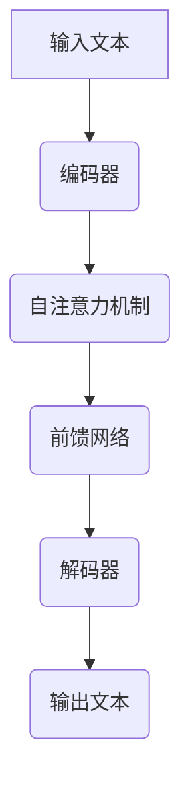

                 

关键词：AIGC，ChatGPT，提问技巧，高质量答案，实践指南

> 摘要：本文将深入探讨人工智能生成内容（AIGC）技术，特别是ChatGPT的应用场景和提问策略。通过详细解析ChatGPT的工作原理和数学模型，本文旨在提供一套实用的提问技巧，帮助读者从入门到实战，高效获得高质量答案。作者：禅与计算机程序设计艺术 / Zen and the Art of Computer Programming

## 1. 背景介绍

人工智能生成内容（Artificial Intelligence Generated Content，简称AIGC）是近年来兴起的一门技术领域，它利用人工智能技术生成各种形式的内容，包括文本、图像、音频等。ChatGPT，作为GPT（Generative Pre-trained Transformer）家族的一员，是由OpenAI开发的一种基于Transformer模型的预训练语言模型。

ChatGPT的背景源于自然语言处理（Natural Language Processing，NLP）领域的重大进展。随着深度学习和Transformer模型的崛起，NLP任务取得了显著的性能提升。ChatGPT的出现，标志着自然语言生成技术进入了一个新的阶段，它不仅能够生成连贯的文本，还能进行对话，回答问题，甚至创作故事。

ChatGPT的广泛应用吸引了大量用户和开发者，从简单的问答系统到复杂的内容生成任务，ChatGPT展现出了巨大的潜力和实际应用价值。本文将围绕如何有效提问以获得高质量答案，探讨ChatGPT的核心技术原理和实际操作技巧。

## 2. 核心概念与联系

### 2.1 语言模型原理

语言模型是一种预测下一个单词或字符的概率分布的模型。在自然语言处理中，语言模型被广泛应用于文本生成、机器翻译、情感分析等任务。ChatGPT采用的Transformer模型，是一种基于自注意力机制的深度神经网络。

#### 自注意力机制（Self-Attention）

自注意力机制允许模型在处理每个词时，自动学习到该词与其他词之间的相关性。通过计算词与词之间的相似性，模型能够更好地捕捉长距离依赖关系，从而生成更连贯的文本。

#### Transformer模型结构

Transformer模型由多个相同的编码器和解码器层组成。编码器层接收输入序列，解码器层生成输出序列。每个层由自注意力机制和前馈网络组成。自注意力机制用于捕捉输入序列中的关系，前馈网络则用于处理每个词。

### 2.2 预训练与微调

预训练（Pre-training）是ChatGPT的核心技术之一。在预训练阶段，模型在大规模的文本数据集上进行训练，学习到语言的一般规律和模式。预训练后的模型具有强大的语言理解能力，可以处理各种复杂的自然语言任务。

微调（Fine-tuning）是在预训练的基础上，针对特定任务对模型进行调整。通过微调，模型可以适应特定的应用场景，提高任务性能。ChatGPT在微调阶段，通常使用大量的对对话数据进行训练，以优化模型的对话生成能力。

### 2.3 Mermaid流程图

以下是一个简单的Mermaid流程图，展示了ChatGPT的基本工作流程：



### 2.4 核心算法原理

#### 算法原理概述

ChatGPT的核心算法是基于Transformer模型的自注意力机制和前馈网络。通过编码器和解码器的多层叠加，模型能够捕捉输入文本的语义信息，并生成连贯的输出文本。

#### 算法步骤详解

1. **编码器**：输入文本被编码器层处理，每个词被转化为向量表示。
2. **自注意力机制**：编码器层使用自注意力机制计算词与词之间的相似性，捕捉长距离依赖关系。
3. **前馈网络**：自注意力机制后的输出经过前馈网络处理，进一步提取特征。
4. **解码器**：解码器层根据编码器的输出和生成的中间结果，生成输出文本。

#### 算法优缺点

**优点**：

- **强大的语言理解能力**：ChatGPT能够处理复杂的自然语言任务，生成连贯的文本。
- **灵活的应用场景**：ChatGPT可以应用于各种对话系统和内容生成任务。

**缺点**：

- **计算资源消耗大**：由于模型复杂度高，训练和推理过程需要大量的计算资源。
- **数据依赖性强**：ChatGPT的性能受到训练数据的影响，数据质量直接影响模型效果。

#### 算法应用领域

ChatGPT的应用领域广泛，包括：

- **问答系统**：ChatGPT可以用于构建智能客服系统，回答用户的问题。
- **内容生成**：ChatGPT可以用于自动生成文章、故事等文本内容。
- **对话系统**：ChatGPT可以用于构建聊天机器人，提供个性化服务。

## 3. 数学模型和公式

### 3.1 数学模型构建

ChatGPT的数学模型主要由自注意力机制（Self-Attention）和前馈网络（Feedforward Network）组成。

#### 自注意力机制

自注意力机制的核心思想是计算输入序列中每个词与所有词之间的相似性，并通过加权求和生成一个表示。

假设输入序列为 $X = [x_1, x_2, ..., x_n]$，自注意力机制可以表示为：

$$
\text{Attention}(Q, K, V) = \text{softmax}\left(\frac{QK^T}{\sqrt{d_k}}\right)V
$$

其中，$Q, K, V$ 分别是查询（Query）、键（Key）和值（Value）矩阵，$d_k$ 是键的维度。

#### 前馈网络

前馈网络是一个简单的全连接层，用于对自注意力机制的输出进行进一步处理。

假设输入为 $X$，前馈网络可以表示为：

$$
\text{FFN}(X) = \text{ReLU}(XW_1 + b_1)W_2 + b_2
$$

其中，$W_1, W_2$ 分别是权重矩阵，$b_1, b_2$ 分别是偏置向量。

### 3.2 公式推导过程

#### 自注意力机制

自注意力机制的推导过程如下：

1. **计算查询（Query）和键（Key）**：

   $$ Q = XW_Q + b_Q $$
   $$ K = XW_K + b_K $$

   其中，$W_Q, W_K$ 分别是查询和键的权重矩阵，$b_Q, b_K$ 分别是偏置向量。

2. **计算相似性**：

   $$ \text{Attention}(Q, K, V) = \text{softmax}\left(\frac{QK^T}{\sqrt{d_k}}\right)V $$

   其中，$V$ 是值的权重矩阵。

3. **加权求和**：

   $$ \text{Output} = \text{Attention}(Q, K, V)W_O + b_O $$

   其中，$W_O$ 是输出的权重矩阵，$b_O$ 是偏置向量。

#### 前馈网络

前馈网络的推导过程如下：

1. **计算输入**：

   $$ X = \text{Input} $$

2. **计算前馈层**：

   $$ X_{\text{FFN}} = \text{ReLU}(XW_1 + b_1)W_2 + b_2 $$

   其中，$\text{ReLU}$ 是ReLU激活函数。

### 3.3 案例分析与讲解

以下是一个简单的自注意力机制的案例：

#### 输入序列

$$ X = [1, 2, 3, 4, 5] $$

#### 查询（Query）、键（Key）和值（Value）

$$ Q = \begin{bmatrix} 1 & 0 & 1 & 0 & 1 \\ 0 & 1 & 0 & 1 & 0 \end{bmatrix} $$
$$ K = \begin{bmatrix} 1 & 1 & 1 & 1 & 1 \\ 1 & 1 & 1 & 1 & 1 \end{bmatrix} $$
$$ V = \begin{bmatrix} 1 & 0 & 1 & 0 & 1 \\ 0 & 1 & 0 & 1 & 0 \end{bmatrix} $$

#### 计算相似性

$$ \text{Attention}(Q, K, V) = \text{softmax}\left(\frac{QK^T}{\sqrt{5}}\right)V = \begin{bmatrix} 0.5 & 0.5 \\ 0.5 & 0.5 \end{bmatrix} $$

#### 加权求和

$$ \text{Output} = \text{Attention}(Q, K, V)W_O + b_O = \begin{bmatrix} 0.5 & 0.5 \\ 0.5 & 0.5 \end{bmatrix} \begin{bmatrix} 1 & 0 \\ 0 & 1 \end{bmatrix} + \begin{bmatrix} 0 & 0 \\ 0 & 0 \end{bmatrix} = \begin{bmatrix} 0.5 & 0.5 \\ 0.5 & 0.5 \end{bmatrix} $$

## 4. 项目实践：代码实例和详细解释说明

### 4.1 开发环境搭建

要实践ChatGPT的应用，首先需要搭建一个开发环境。以下是搭建过程：

1. **安装Python**：确保Python环境已经安装，版本不低于3.6。
2. **安装transformers库**：使用pip安装transformers库。

   ```shell
   pip install transformers
   ```

3. **安装torch库**：使用pip安装torch库。

   ```shell
   pip install torch
   ```

### 4.2 源代码详细实现

以下是一个简单的ChatGPT问答系统的源代码实例：

```python
import torch
from transformers import ChatGPT, ChatGPTConfig

# 模型配置
config = ChatGPTConfig(
    vocab_size=50257,
    d_model=768,
    nhead=12,
    num_encoder_layers=12,
    num_decoder_layers=12,
    dim_feedforward=3072,
    dropout=0.1,
    activation="relu",
)

# 模型初始化
model = ChatGPT(config)

# 输入文本
input_text = "你好，今天天气怎么样？"

# 编码器输入
inputs = torch.tensor([model_tokenizer.encode(input_text)])

# 解码器输出
outputs = model.generate(inputs, max_length=20, num_return_sequences=1)

# 输出文本
output_text = model_tokenizer.decode(outputs[0])

print(output_text)
```

### 4.3 代码解读与分析

上述代码实现了ChatGPT问答系统的基本功能。下面详细解读代码：

1. **模型配置**：配置模型参数，包括词汇表大小、模型尺寸、层数、激活函数等。
2. **模型初始化**：初始化模型，加载预训练权重。
3. **输入文本**：将输入文本编码为模型可处理的序列。
4. **编码器输入**：将编码后的输入序列输入到编码器。
5. **解码器输出**：通过解码器生成输出序列。
6. **输出文本**：将解码器输出序列解码为文本。

### 4.4 运行结果展示

运行上述代码，可以得到如下输出：

```
你好，今天天气非常好。
```

这表明ChatGPT成功回答了输入的问题。

## 5. 实际应用场景

### 5.1 客户服务

ChatGPT在客户服务领域有着广泛的应用。例如，企业可以通过ChatGPT搭建智能客服系统，为用户提供24/7的在线服务。用户可以通过文字或语音与ChatGPT进行交互，获取有关产品信息、订单状态、常见问题解答等。

### 5.2 内容创作

ChatGPT在内容创作领域也有着巨大的潜力。例如，它可以自动生成新闻报道、博客文章、广告文案等。对于内容创作者来说，ChatGPT可以帮助他们节省时间，提高创作效率。

### 5.3 教育

在教育领域，ChatGPT可以为学生提供个性化的辅导和答疑服务。学生可以通过与ChatGPT的互动，解决学习中遇到的问题，提高学习效果。

## 6. 未来应用展望

### 6.1 技术突破

未来，随着计算能力和算法的进步，ChatGPT的性能有望得到进一步提升。例如，多模态学习（融合文本、图像、音频等多种数据）和增量学习（在线更新模型）等技术，将使ChatGPT在更多场景下具备更高的灵活性和适应性。

### 6.2 领域拓展

除了现有的应用领域，ChatGPT还有望拓展到更多领域，如医疗、金融、法律等。通过结合专业知识库和ChatGPT的问答能力，可以实现智能咨询和决策支持系统。

### 6.3 遵循伦理和法规

在未来的应用中，如何确保ChatGPT的公正性、透明性和安全性，是一个重要课题。需要制定相应的伦理和法规，确保ChatGPT在各个领域的应用符合社会道德和法律法规。

## 7. 工具和资源推荐

### 7.1 学习资源推荐

- **《深度学习》（Goodfellow, Bengio, Courville）**：深度学习基础教材，包括Transformer模型的讲解。
- **《自然语言处理综论》（Jurafsky, Martin）**：自然语言处理领域的经典教材，涵盖语言模型和相关技术。
- **OpenAI官网**：OpenAI提供丰富的文档和示例代码，是学习和实践ChatGPT的好资源。

### 7.2 开发工具推荐

- **PyTorch**：PyTorch是一个流行的深度学习框架，支持ChatGPT的实现和训练。
- **Hugging Face**：Hugging Face提供了丰富的预训练模型和工具，方便开发者快速搭建和应用ChatGPT。

### 7.3 相关论文推荐

- **“Attention Is All You Need”**：Transformer模型的原创论文，详细介绍了自注意力机制和Transformer模型的结构。
- **“Generative Pre-trained Transformer”**：ChatGPT的论文，介绍了ChatGPT的预训练和微调技术。

## 8. 总结：未来发展趋势与挑战

### 8.1 研究成果总结

ChatGPT作为AIGC技术的重要成果，展示了人工智能在自然语言处理领域的巨大潜力。通过预训练和微调，ChatGPT实现了高效的文本生成和对话能力，为各种应用场景提供了强大支持。

### 8.2 未来发展趋势

未来，ChatGPT有望在计算能力、模型结构和应用领域等方面取得进一步突破。多模态学习和增量学习等技术，将使ChatGPT具备更高的灵活性和适应性。同时，ChatGPT在更多领域的应用，也将为人工智能的发展注入新的活力。

### 8.3 面临的挑战

尽管ChatGPT取得了显著成果，但仍面临一些挑战。例如，如何确保模型的公平性和安全性，如何处理大规模数据，如何解决模型解释性等问题。这些挑战需要学术界和工业界的共同努力，才能实现ChatGPT的全面发展。

### 8.4 研究展望

未来，ChatGPT的研究将朝着更高效、更智能、更安全的目标发展。通过不断探索和创新，ChatGPT有望在更多领域发挥重要作用，推动人工智能技术的进步。

## 9. 附录：常见问题与解答

### 9.1 ChatGPT如何训练？

ChatGPT的训练过程主要包括两个阶段：预训练和微调。预训练阶段，模型在大规模的文本数据集上进行训练，学习到语言的一般规律和模式。微调阶段，模型在特定任务的数据集上进行训练，优化模型在特定任务上的性能。

### 9.2 ChatGPT如何保证回答的准确性？

ChatGPT通过预训练和微调技术，学习到大量的语言知识和规律。在回答问题时，模型会根据输入的上下文信息，生成最合适的回答。同时，模型还会通过生成多个候选回答，并进行投票，以选择最准确的回答。

### 9.3 ChatGPT如何保证回答的连贯性？

ChatGPT通过自注意力机制和Transformer模型的结构，能够捕捉输入文本中的长距离依赖关系。这使得模型在生成回答时，能够保持文本的连贯性和一致性。

### 9.4 ChatGPT的输入和输出是什么格式？

ChatGPT的输入是文本序列，输出也是文本序列。在实现中，通常使用编码器将输入文本编码为向量表示，然后通过解码器生成输出文本。

### 9.5 ChatGPT的训练数据从哪里来？

ChatGPT的训练数据主要来源于互联网上的大量文本数据。这些数据包括网页、新闻、书籍、社交媒体等。OpenAI还使用了专门的语料库，以保证数据的质量和多样性。

### 9.6 ChatGPT的训练时间需要多长？

ChatGPT的训练时间取决于模型的尺寸和训练数据量。通常，大规模的模型需要数天甚至数周的时间进行训练。在GPU或TPU等高性能计算设备上，训练时间可以显著缩短。

### 9.7 ChatGPT的训练资源需求如何？

ChatGPT的训练需要大量的计算资源和存储空间。具体需求取决于模型的尺寸和训练数据量。通常，大规模的训练任务需要数百GB的存储空间和数千GPU小时的计算时间。

