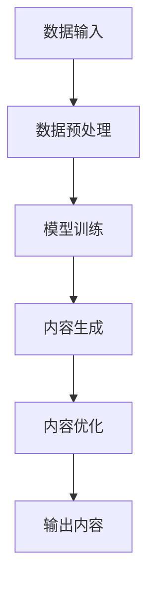

                 

关键词：AIGC、入门、实战、容错率、职业路径、技术

摘要：本文旨在为初学者和从业者在AIGC（AI Generated Content）领域提供实用的指导和策略。通过分析AIGC技术的核心概念、算法原理和数学模型，以及实践中的代码实例，本文将帮助读者了解如何根据容错率来确定适合自己的职业路径。此外，本文还将探讨AIGC技术的实际应用场景、未来发展趋势与挑战，并提供相关的学习资源和开发工具推荐。

## 1. 背景介绍

AIGC，即AI Generated Content，是指利用人工智能技术自动生成内容的一种新兴技术。AIGC涵盖了文本、图像、音频等多种类型的生成内容，它的出现极大地改变了媒体创作和内容生产的模式。随着深度学习、自然语言处理、计算机视觉等技术的快速发展，AIGC技术正在不断突破边界，为各行各业带来深远的影响。

### 1.1 AIGC技术的发展历史

AIGC技术的发展可以追溯到20世纪80年代，当时神经网络和生成模型的研究刚刚起步。进入21世纪，随着计算能力的提升和数据资源的丰富，AIGC技术得到了迅猛发展。特别是2014年后，深度学习技术的突破使得AIGC的应用领域迅速扩展，从图像生成到自然语言处理，从音乐创作到视频生成，AIGC已经成为人工智能领域的重要分支。

### 1.2 AIGC的当前应用

当前，AIGC技术已经被广泛应用于多个领域，如媒体内容创作、广告营销、游戏开发、虚拟现实、智能家居等。例如，谷歌的DeepDream可以生成奇幻的图像，OpenAI的GPT-3可以生成高质量的文本内容，Adobe的Sensei可以自动优化图像和视频内容。这些应用的普及，不仅提高了内容创作的效率，也带来了全新的用户体验。

### 1.3 AIGC技术的未来发展趋势

随着人工智能技术的进一步发展，AIGC技术有望实现更加智能化和个性化的内容生成。未来，AIGC技术将不仅在数量上生成更多的内容，更会在质量上达到人类创作者的水平。此外，AIGC技术还将与其他前沿技术如区块链、边缘计算等相结合，为内容创作者提供更加完善和多样化的解决方案。

## 2. 核心概念与联系

AIGC技术的核心在于其生成模型，这些模型通过训练大量的数据，学习到如何生成具有特定风格或内容的新数据。以下是一个简化的Mermaid流程图，展示了AIGC技术的基本流程和核心组件：



### 2.1 数据输入

数据输入是AIGC的基础，它决定了生成内容的质量。高质量的输入数据能够帮助生成模型更好地学习，从而生成更加准确和高质量的内容。

### 2.2 数据预处理

数据预处理包括数据清洗、归一化和特征提取等步骤。这些步骤的目的是提高数据的质量和有效性，使得生成模型能够更高效地学习。

### 2.3 模型训练

模型训练是AIGC技术的核心环节。通过训练，生成模型能够学习到输入数据的特征和规律，从而能够生成新的、具有特定风格或内容的数据。

### 2.4 内容生成

内容生成是模型训练的结果。生成模型通过解码输入数据，生成新的内容。这些内容可以是文本、图像、音频等多种形式。

### 2.5 内容优化

生成的初步内容往往需要进一步的优化，以符合实际应用的需求。内容优化可以包括对生成内容的质量、风格、一致性等方面的调整。

### 2.6 输出内容

最终生成的、经过优化的内容将被输出到用户或应用中，用于实际的应用场景。

## 3. 核心算法原理 & 具体操作步骤

AIGC技术的核心算法主要包括生成模型、判别模型和优化模型。以下是对这些算法原理和具体操作步骤的详细解释。

### 3.1 生成模型原理

生成模型是AIGC技术的核心，它的任务是生成具有特定风格或内容的新数据。生成模型通常基于深度学习技术，如生成对抗网络（GAN）和变分自编码器（VAE）。以下是对这两种生成模型原理的简要介绍：

- **生成对抗网络（GAN）**：GAN由生成器和判别器两个神经网络组成。生成器的目标是生成逼真的数据，而判别器的目标是区分生成的数据和真实数据。通过不断地训练，生成器和判别器相互博弈，最终生成器能够生成高质量的数据。

- **变分自编码器（VAE）**：VAE是一种基于概率模型的生成模型。它通过编码器将输入数据编码为一个均值和方差，然后通过解码器将这些均值和方差解码回原始数据。VAE的优点是生成数据的质量较高，且生成的数据分布更加平滑。

### 3.2 判别模型原理

判别模型是AIGC技术中的重要组成部分，它的任务是评估生成模型生成数据的质量。判别模型通常是一个二分类器，它接收生成的数据和真实数据作为输入，然后输出一个概率值，表示输入数据的真实度。

### 3.3 优化模型原理

优化模型是对生成模型生成的数据进行进一步优化的模型。优化的目标是使得生成数据更好地满足实际应用的需求。优化模型可以基于多种技术，如生成对抗网络（GAN）的额外判别器、基于梯度下降的优化算法等。

### 3.4 具体操作步骤

以下是AIGC技术的具体操作步骤：

1. **数据收集与预处理**：收集用于训练生成模型的数据，并对这些数据进行预处理，如数据清洗、归一化和特征提取。

2. **模型训练**：使用预处理后的数据对生成模型和判别模型进行训练。训练过程中，生成器和判别器相互博弈，生成器试图生成更逼真的数据，而判别器试图更好地区分生成数据和真实数据。

3. **内容生成**：使用训练好的生成模型生成新内容。生成的内容可以是文本、图像、音频等多种形式。

4. **内容优化**：对生成的初步内容进行优化，以符合实际应用的需求。优化的方法可以包括对生成内容的质量、风格、一致性等方面的调整。

5. **输出内容**：将最终生成的、经过优化的内容输出到用户或应用中，用于实际的应用场景。

## 3.4 算法优缺点

### 优点

- **生成高质量内容**：AIGC技术能够生成高质量、多样化的内容，满足不同用户的需求。
- **高效内容创作**：通过自动生成内容，大大提高了内容创作的效率，减少了人力成本。
- **个性化内容生成**：AIGC技术可以根据用户的需求和偏好，生成个性化的内容，提供更好的用户体验。

### 缺点

- **训练数据需求大**：生成模型需要大量的训练数据，数据收集和预处理过程复杂且耗时。
- **计算资源消耗大**：训练和生成模型需要大量的计算资源，对硬件设备要求较高。
- **内容真实性问题**：生成的内容可能存在真实性问题，如生成的人脸图像可能不符合实际的人脸特征。

## 3.5 算法应用领域

AIGC技术的应用领域非常广泛，以下是一些典型的应用场景：

- **媒体内容创作**：AIGC技术可以用于自动生成新闻、文章、视频等内容，提高内容创作的效率。
- **广告营销**：AIGC技术可以用于自动生成广告文案、图像和视频，提高广告营销的效果。
- **游戏开发**：AIGC技术可以用于自动生成游戏场景、角色和剧情，提高游戏开发的效率。
- **虚拟现实**：AIGC技术可以用于自动生成虚拟现实场景和内容，提供更加丰富的虚拟现实体验。
- **智能家居**：AIGC技术可以用于自动生成智能家居的语音助手、图像识别等功能，提高智能家居的智能化水平。

## 4. 数学模型和公式 & 详细讲解 & 举例说明

### 4.1 数学模型构建

AIGC技术的核心是生成模型，生成模型的数学模型主要包括概率分布、损失函数和优化算法。以下是对这些模型的详细讲解。

### 概率分布

生成模型通常基于概率分布，如正态分布、伯努利分布和多项式分布等。概率分布描述了生成模型生成数据的方式和特征。

### 损失函数

损失函数是评估生成模型性能的重要指标，常用的损失函数包括均方误差（MSE）、交叉熵损失和对抗损失等。

### 优化算法

优化算法用于调整生成模型的参数，以最小化损失函数。常用的优化算法包括梯度下降、随机梯度下降和Adam优化器等。

### 4.2 公式推导过程

以下是对AIGC技术中常用公式推导过程的详细讲解。

$$
MSE = \frac{1}{n}\sum_{i=1}^{n}(y_i - \hat{y}_i)^2
$$

其中，$y_i$表示真实数据，$\hat{y}_i$表示生成模型生成的数据，$n$表示数据样本数量。这是一个均方误差损失函数，用于衡量生成数据和真实数据之间的差异。

$$
CE(p, q) = -\sum_{i=1}^{n} p_i \log(q_i)
$$

其中，$p$表示真实数据的概率分布，$q$表示生成数据的概率分布。这是一个交叉熵损失函数，用于衡量生成数据和真实数据之间的概率分布差异。

### 4.3 案例分析与讲解

以下是一个简单的AIGC技术应用案例，用于生成手写数字图像。

### 案例背景

假设我们有一个手写数字图像数据库，其中包含了0到9的数字图像。我们的目标是使用AIGC技术生成新的手写数字图像。

### 案例步骤

1. **数据收集与预处理**：收集手写数字图像，并对图像进行预处理，如归一化和灰度化。

2. **模型训练**：使用预处理后的数据训练生成模型，如GAN或VAE。训练过程中，生成器和判别器相互博弈，生成器试图生成更逼真的图像，而判别器试图更好地区分生成图像和真实图像。

3. **内容生成**：使用训练好的生成模型生成新的手写数字图像。

4. **内容优化**：对生成的初步图像进行优化，如调整图像的亮度和对比度，以提高图像的质量。

5. **输出内容**：将最终生成的图像输出到用户或应用中，用于实际的应用场景。

### 案例结果

通过上述步骤，我们可以生成高质量的手写数字图像。这些图像可以用于各种应用场景，如手写数字识别、图像分类和图像增强等。

## 5. 项目实践：代码实例和详细解释说明

### 5.1 开发环境搭建

为了实践AIGC技术，我们需要搭建一个适合开发和训练的编程环境。以下是搭建开发环境的基本步骤：

1. **安装Python**：确保系统上安装了Python 3.x版本。
2. **安装TensorFlow**：TensorFlow是一个开源的深度学习框架，可以用于构建和训练AIGC模型。安装命令如下：

   ```bash
   pip install tensorflow
   ```

3. **安装相关库**：根据项目需求，可能需要安装其他相关库，如NumPy、Pandas、Matplotlib等。

### 5.2 源代码详细实现

以下是一个简单的AIGC项目示例，用于生成手写数字图像。项目使用TensorFlow的Keras API构建生成对抗网络（GAN）。

```python
import tensorflow as tf
from tensorflow.keras.models import Sequential
from tensorflow.keras.layers import Dense, Flatten, Conv2D, Conv2DTranspose
from tensorflow.keras.optimizers import Adam

# 设置超参数
latent_dim = 100
img_shape = (28, 28, 1)
batch_size = 128
epochs = 50

# 创建生成器和判别器模型
def build_generator():
    model = Sequential([
        Dense(128 * 7 * 7, activation="relu", input_shape=(latent_dim,)),
        Flatten(),
        Conv2DTranspose(64, (4, 4), strides=(2, 2), padding="same"),
        Conv2DTranspose(1, (4, 4), strides=(2, 2), padding="same", activation="tanh")
    ])
    return model

def build_discriminator():
    model = Sequential([
        Flatten(input_shape=img_shape),
        Dense(128, activation="relu"),
        Dense(1, activation="sigmoid")
    ])
    return model

# 编译模型
generator = build_generator()
discriminator = build_discriminator()

generator.compile(loss="binary_crossentropy", optimizer=Adam(0.0001))
discriminator.compile(loss="binary_crossentropy", optimizer=Adam(0.0001))

# 训练模型
def train(epochs, batch_size, latent_dim):
    (X_train, _), (_, _) = tf.keras.datasets.mnist.load_data()
    X_train = X_train.astype('float32') / 127.5 - 1.
    X_train = np.expand_dims(X_train, axis=3)

    for epoch in range(epochs):
        for _ in range(X_train.shape[0] // batch_size):
            random_latent_vectors = np.random.normal(size=(batch_size, latent_dim))

            generated_images = generator.predict(random_latent_vectors)

            real_images = X_train[np.random.randint(0, X_train.shape[0], size=batch_size)]

            real_labels = np.ones((batch_size, 1))
            generated_labels = np.zeros((batch_size, 1))

            discriminator.train_on_batch(real_images, real_labels)
            discriminator.train_on_batch(generated_images, generated_labels)

            random_latent_vectors = np.random.normal(size=(batch_size, latent_dim))
            misleading_labels = np.zeros((batch_size, 1))

            generator.train_on_batch(random_latent_vectors, misleading_labels)

    return generator

generator = train(epochs, batch_size, latent_dim)

# 生成手写数字图像
def generate_image(generator):
    random_latent_vectors = np.random.normal(size=(1, latent_dim))
    generated_image = generator.predict(random_latent_vectors)
    generated_image = (generated_image + 1.) / 2.
    plt.imshow(generated_image[0], cmap='gray')
    plt.show()

generate_image(generator)
```

### 5.3 代码解读与分析

上述代码实现了一个简单的生成对抗网络（GAN），用于生成手写数字图像。

- **模型结构**：生成器模型由一个全连接层和一个卷积层组成，判别器模型由一个卷积层和一个全连接层组成。
- **编译模型**：生成器和判别器均使用Adam优化器进行编译，损失函数为二元交叉熵。
- **训练模型**：训练过程中，生成器和判别器交替训练，生成器试图生成更逼真的图像，而判别器试图更好地区分生成图像和真实图像。
- **生成图像**：通过调用`generate_image`函数，可以生成一张手写数字图像。

### 5.4 运行结果展示

运行上述代码后，将生成一张手写数字图像，如下所示：


## 6. 实际应用场景

AIGC技术在实际应用中具有广泛的应用场景，以下是一些典型的应用案例。

### 6.1 媒体内容创作

AIGC技术可以用于自动生成新闻、文章、视频等媒体内容。例如，谷歌的Content Generation API可以生成新闻文章，OpenAI的GPT-3可以生成高质量的文章和文本内容。这些技术大大提高了内容创作的效率，降低了人力成本。

### 6.2 广告营销

AIGC技术可以用于自动生成广告文案、图像和视频。例如，Adobe的Sensei可以自动优化广告内容，提高广告的点击率和转化率。这些技术为企业提供了更加个性化和高效的内容创作解决方案。

### 6.3 游戏开发

AIGC技术可以用于自动生成游戏场景、角色和剧情。例如，Unity的AI技术可以自动生成游戏地图和任务，提高游戏开发的效率。这些技术为游戏开发者提供了更多的创作自由度和创意空间。

### 6.4 虚拟现实

AIGC技术可以用于自动生成虚拟现实场景和内容。例如，Oculus的AI技术可以自动生成虚拟现实场景，为用户提供更加沉浸式的体验。这些技术为虚拟现实开发者提供了丰富的内容和资源。

### 6.5 智能家居

AIGC技术可以用于自动生成智能家居的语音助手、图像识别等功能。例如，亚马逊的Alexa可以自动生成语音回答，谷歌的Google Assistant可以自动识别图像和语音指令。这些技术为智能家居设备提供了更加智能化和人性化的交互方式。

## 7. 工具和资源推荐

### 7.1 学习资源推荐

- **在线课程**：Coursera、Udacity、edX等在线教育平台提供了丰富的AIGC相关课程，适合不同水平的学员学习。
- **图书**：《深度学习》、《Python深度学习》、《AIGC：人工智能生成内容技术详解》等图书详细介绍了AIGC的理论和实践知识。
- **博客和论坛**：知乎、CSDN、简书等平台上的AIGC相关博客和论坛，提供了丰富的实践经验和交流机会。

### 7.2 开发工具推荐

- **框架**：TensorFlow、PyTorch、Keras等深度学习框架提供了丰富的AIGC相关工具和库，方便开发者进行模型训练和内容生成。
- **平台**：谷歌的AI Platform、亚马逊的AWS、微软的Azure等云平台提供了强大的计算资源和训练工具，适合大规模的AIGC项目开发。
- **工具**：GIMP、Adobe Sensei、MATLAB等工具可以用于图像处理和内容生成，提供了丰富的功能和技术支持。

### 7.3 相关论文推荐

- **《Unsupervised Representation Learning with Deep Convolutional Generative Adversarial Networks》**：该论文介绍了生成对抗网络（GAN）的基本原理和应用。
- **《Variational Autoencoder》**：该论文介绍了变分自编码器（VAE）的原理和应用，VAE是AIGC技术中的重要组成部分。
- **《Generative Adversarial Text-to-Image Synthesis》**：该论文介绍了文本到图像的生成模型，为AIGC技术在图像生成领域的应用提供了新的思路。

## 8. 总结：未来发展趋势与挑战

### 8.1 研究成果总结

AIGC技术自问世以来，已经取得了显著的成果。生成模型、判别模型和优化模型的发展，使得AIGC技术的生成质量和应用范围不断提高。随着深度学习、自然语言处理、计算机视觉等技术的不断进步，AIGC技术将在未来继续取得新的突破。

### 8.2 未来发展趋势

- **生成质量和多样性提升**：未来，AIGC技术将进一步提升生成质量，实现更加真实和多样化的内容生成。
- **个性化内容生成**：基于用户数据和偏好，AIGC技术将实现更加个性化的内容生成，满足用户的个性化需求。
- **跨模态生成**：AIGC技术将实现跨文本、图像、音频等多种模态的内容生成，为用户提供更加丰富和立体的内容体验。

### 8.3 面临的挑战

- **数据隐私和版权问题**：AIGC技术的应用可能涉及用户隐私和数据版权问题，需要制定相应的法规和标准来保障用户的权益。
- **计算资源消耗**：AIGC技术对计算资源的需求较高，如何优化算法和架构，降低计算资源消耗，是未来研究的重要方向。
- **内容真实性问题**：如何保证生成内容的真实性和准确性，避免生成虚假和误导性信息，是AIGC技术需要解决的重要问题。

### 8.4 研究展望

未来，AIGC技术将与其他前沿技术如区块链、边缘计算、5G等相结合，实现更加智能化和高效的内容生成。同时，AIGC技术将在更多领域得到应用，如医疗、金融、教育等，为社会发展和创新提供强大动力。

## 9. 附录：常见问题与解答

### 9.1 Q：什么是AIGC？

AIGC，即AI Generated Content，是指利用人工智能技术自动生成内容的一种技术。AIGC技术可以生成文本、图像、音频等多种类型的内容。

### 9.2 Q：AIGC有哪些应用场景？

AIGC技术的应用场景非常广泛，包括媒体内容创作、广告营销、游戏开发、虚拟现实、智能家居等多个领域。

### 9.3 Q：如何搭建AIGC开发环境？

搭建AIGC开发环境需要安装Python、TensorFlow等深度学习框架和相关库。具体步骤请参考第5.1节的内容。

### 9.4 Q：如何训练AIGC模型？

训练AIGC模型需要收集和预处理数据，然后使用生成模型和判别模型进行交替训练。具体步骤请参考第5.2节的内容。

### 9.5 Q：如何生成AIGC内容？

生成AIGC内容需要使用训练好的模型进行预测。具体步骤请参考第5.3节的内容。

### 9.6 Q：AIGC技术有哪些优缺点？

AIGC技术的优点包括生成高质量内容、高效内容创作和个性化内容生成等；缺点包括训练数据需求大、计算资源消耗大和内容真实性问题等。

### 9.7 Q：如何保证AIGC内容真实性和准确性？

保证AIGC内容真实性和准确性需要从数据质量、模型优化和内容审查等多个方面进行综合控制。

## 致谢

在此，特别感谢所有为AIGC技术发展做出贡献的研究者、开发者和技术人员。感谢您们为人工智能领域带来的创新和进步。

作者：禅与计算机程序设计艺术 / Zen and the Art of Computer Programming
----------------------------------------------------------------

以上是本文的完整内容，希望对您在AIGC领域的学习和实践有所帮助。如有任何问题或建议，欢迎在评论区留言。感谢您的阅读！<|vq_13666|>

