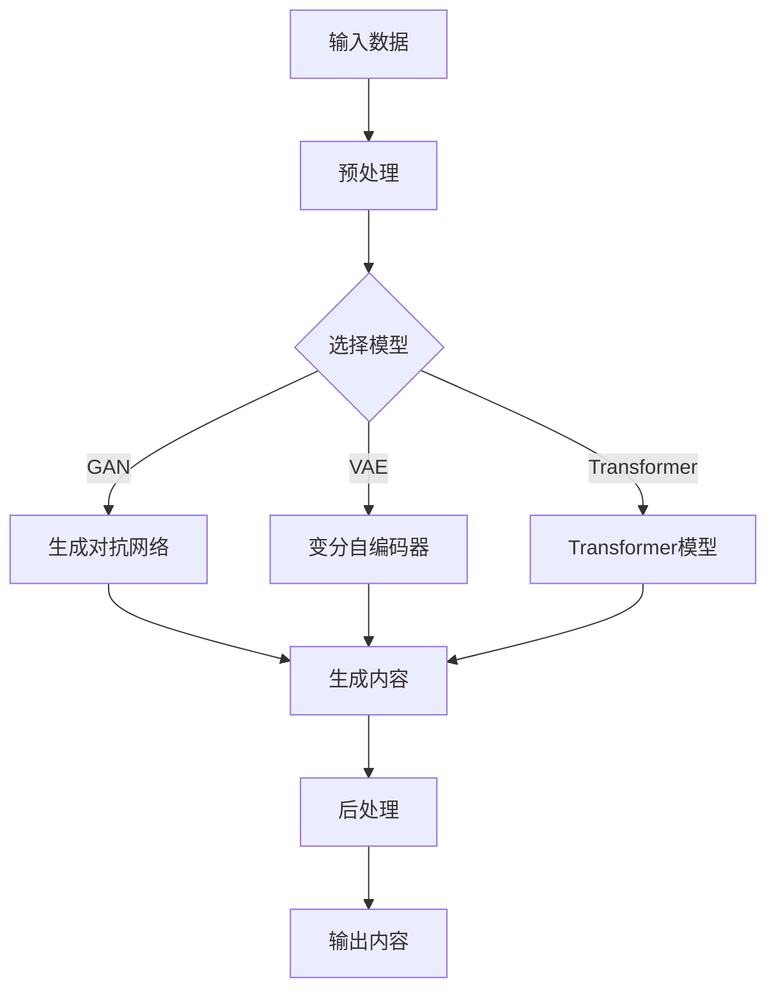

                 

关键词：AIGC, 自动生成，提示词，魔法，计算机编程，技术博客

> 摘要：本文将深入探讨AIGC（AI-Generated Content）的概念、技术原理和实际应用，重点介绍如何利用AIGC技术实现自动生成提示词，从而提高内容生成的效率和准确性。文章结构清晰，深入浅出，适合对AIGC技术感兴趣的技术爱好者及从业者阅读。

## 1. 背景介绍

### 1.1 AIGC的概念

AIGC，即AI-Generated Content，指的是利用人工智能技术自动生成内容的技术。随着深度学习、自然语言处理等技术的发展，AIGC逐渐成为内容生成领域的重要方向。AIGC的应用场景广泛，包括但不限于文本、图像、音频和视频等。

### 1.2 AIGC的发展历程

AIGC技术的发展可以追溯到20世纪90年代的规则引擎和自然语言生成技术。进入21世纪后，随着深度学习的兴起，AIGC技术取得了突破性进展。尤其是2018年GPT-2的发布，标志着AIGC技术进入了一个新的阶段。随后，AIGC技术在多个领域取得了广泛应用，如自动写作、智能客服、内容审核等。

## 2. 核心概念与联系

### 2.1 AIGC的技术原理

AIGC的核心在于利用深度学习模型，如生成对抗网络（GAN）、变分自编码器（VAE）和Transformer等，自动生成内容。以下是一个简化的AIGC技术原理流程图：



### 2.2 AIGC的应用场景

AIGC技术可以应用于多个领域，以下是一些典型应用场景：

- **文本生成**：如自动写作、摘要生成、智能客服等。
- **图像生成**：如人脸生成、艺术创作、产品渲染等。
- **音频生成**：如语音合成、音乐生成、音效创作等。
- **视频生成**：如视频编辑、视频生成、视频游戏等。

## 3. 核心算法原理 & 具体操作步骤

### 3.1 算法原理概述

AIGC的核心算法主要包括生成对抗网络（GAN）、变分自编码器（VAE）和Transformer等。以下简要介绍这几种算法的基本原理。

- **生成对抗网络（GAN）**：由生成器（Generator）和判别器（Discriminator）组成。生成器尝试生成与真实数据相似的数据，判别器则判断数据是真实还是生成的。两者相互博弈，最终生成器生成高质量的数据。

- **变分自编码器（VAE）**：通过编码器（Encoder）和解码器（Decoder）将输入数据转换为隐变量，再从隐变量生成输出数据。VAE能够生成具有多样化特征的数据。

- **Transformer**：基于自注意力机制（Self-Attention），能够捕捉输入数据中的长距离依赖关系，广泛应用于文本生成任务。

### 3.2 算法步骤详解

以下是使用GAN生成提示词的详细步骤：

1. **数据预处理**：收集并清洗文本数据，将其转换为模型可接受的格式。

2. **模型选择**：根据任务需求选择合适的模型，如GAN、VAE或Transformer。

3. **模型训练**：将数据输入模型，通过反向传播和优化算法（如梯度下降）训练模型。

4. **生成提示词**：将训练好的模型用于生成提示词。具体实现如下：

   - 使用生成器生成一批潜在向量。
   - 将潜在向量输入解码器，生成提示词。
   - 对生成的提示词进行后处理，如去除无效字符、统一格式等。

### 3.3 算法优缺点

- **优点**：

  - 自动化程度高，能够快速生成大量高质量内容。

  - 能够处理多种类型的数据，如文本、图像、音频和视频等。

- **缺点**：

  - 模型训练过程复杂，计算资源消耗大。

  - 模型易受到数据分布的影响，生成内容可能存在偏差。

### 3.4 算法应用领域

AIGC技术已广泛应用于多个领域，以下列举几个典型应用领域：

- **内容创作**：如自动写作、摘要生成、智能客服等。
- **广告营销**：如广告文案生成、图像和视频编辑等。
- **娱乐产业**：如虚拟偶像、游戏NPC生成等。
- **金融行业**：如风险控制、智能投顾等。
- **医疗领域**：如医学影像诊断、药物研发等。

## 4. 数学模型和公式 & 详细讲解 & 举例说明

### 4.1 数学模型构建

在AIGC技术中，常用的数学模型包括生成对抗网络（GAN）、变分自编码器（VAE）和Transformer等。以下分别介绍这些模型的数学公式。

#### 4.1.1 生成对抗网络（GAN）

GAN由生成器（Generator）和判别器（Discriminator）组成。生成器的目标是生成与真实数据相似的数据，判别器的目标是判断数据是真实还是生成的。

- **生成器**：

  $$
  G(z) = x_G \sim p_z(z)
  $$

  其中，$z$为随机噪声，$x_G$为生成器生成的数据。

- **判别器**：

  $$
  D(x) = \begin{cases}
  1, & \text{如果 } x \text{ 是真实数据} \\
  0, & \text{如果 } x \text{ 是生成数据}
  \end{cases}
  $$

  其中，$x$为输入数据。

#### 4.1.2 变分自编码器（VAE）

VAE由编码器（Encoder）和解码器（Decoder）组成。编码器将输入数据映射到隐变量，解码器将隐变量映射回输入数据。

- **编码器**：

  $$
  \mu = \mu(z; x), \quad \sigma^2 = \sigma^2(z; x)
  $$

  其中，$\mu$和$\sigma^2$分别为隐变量的均值和方差。

- **解码器**：

  $$
  x' = x_D(z)
  $$

#### 4.1.3 Transformer

Transformer基于自注意力机制（Self-Attention），能够捕捉输入数据中的长距离依赖关系。

- **自注意力机制**：

  $$
  \text{Attention}(Q, K, V) = \text{softmax}\left(\frac{QK^T}{\sqrt{d_k}}\right) V
  $$

  其中，$Q$、$K$和$V$分别为查询向量、键向量和值向量，$d_k$为键向量的维度。

### 4.2 公式推导过程

#### 4.2.1 GAN的推导

GAN的推导过程主要涉及生成器和判别器的损失函数。生成器的目标是最小化生成数据的判别器损失，判别器的目标是最大化生成数据的判别器损失。

- **生成器损失函数**：

  $$
  L_G = -\mathbb{E}_{z \sim p_z(z)}[\log(D(G(z))]
  $$

- **判别器损失函数**：

  $$
  L_D = -\mathbb{E}_{x \sim p_x(x)}[\log(D(x))] - \mathbb{E}_{z \sim p_z(z)}[\log(1 - D(G(z))]
  $$

#### 4.2.2 VAE的推导

VAE的推导过程主要涉及编码器和解码器的损失函数。编码器和解码器的目标是最小化重构损失和后验概率损失。

- **重构损失函数**：

  $$
  L_{\text{recon}} = \sum_{x} D(x) - D(x')
  $$

- **后验概率损失函数**：

  $$
  L_{\text{KL}} = -\sum_{z} p(z|x) \log p(z)
  $$

### 4.3 案例分析与讲解

#### 4.3.1 GAN的案例

假设我们有一个生成器$G$和一个判别器$D$，分别对应以下参数：

- **生成器**：

  $$
  G(z; \theta_G) = x_G; \quad \theta_G \in \Theta_G
  $$

- **判别器**：

  $$
  D(x; \theta_D) = \begin{cases}
  1, & \text{如果 } x \text{ 是真实数据} \\
  0, & \text{如果 } x \text{ 是生成数据}
  \end{cases}; \quad \theta_D \in \Theta_D
  $$

给定一个随机噪声向量$z$，生成器$G$生成一批数据$x_G$，判别器$D$分别对真实数据和生成数据进行分类。通过梯度下降算法优化生成器和判别器的参数$\theta_G$和$\theta_D$，最终实现生成器生成高质量的数据。

#### 4.3.2 VAE的案例

假设我们有一个编码器$E$和一个解码器$D$，分别对应以下参数：

- **编码器**：

  $$
  E(x; \theta_E) = (\mu, \sigma^2); \quad \theta_E \in \Theta_E
  $$

- **解码器**：

  $$
  D(z; \theta_D) = x_D; \quad \theta_D \in \Theta_D
  $$

给定一个输入数据$x$，编码器$E$将其编码为隐变量$z$，解码器$D$根据隐变量$z$生成重构数据$x_D$。通过反向传播和优化算法（如梯度下降）优化编码器和解码器的参数$\theta_E$和$\theta_D$，实现数据的编码和重构。

#### 4.3.3 Transformer的案例

假设我们有一个Transformer模型，包含多个自注意力层和前馈神经网络。给定一个输入序列$x$，模型通过自注意力机制计算输出序列$y$。

- **自注意力层**：

  $$
  y_i = \sum_{j=1}^{N} \alpha_{ij} x_j
  $$

  其中，$\alpha_{ij}$为注意力权重。

- **前馈神经网络**：

  $$
  \hat{y}_i = \text{ReLU}(W_2 \cdot \text{softmax}(W_1 x_i) + b_2)
  $$

  其中，$W_1$、$W_2$和$b_2$分别为权重和偏置。

通过迭代计算，模型最终生成输出序列$y$。

## 5. 项目实践：代码实例和详细解释说明

### 5.1 开发环境搭建

在本节中，我们将搭建一个基于GAN的文本生成项目环境。以下是搭建步骤：

1. **安装Python环境**：确保Python版本不低于3.7。
2. **安装TensorFlow**：TensorFlow是开源的机器学习框架，支持GPU加速。可以使用以下命令安装：
   $$
   pip install tensorflow
   $$
3. **准备数据集**：本文使用一个简单的文本数据集，数据集包含若干篇文章。数据集可以从网上下载，也可以使用自己的数据集。

### 5.2 源代码详细实现

以下是一个基于GAN的文本生成项目的示例代码。代码分为两部分：生成器和判别器。

```python
import tensorflow as tf
from tensorflow.keras.layers import Input, Dense, Reshape, Flatten
from tensorflow.keras.models import Model

# 生成器
z_dim = 100
gen_inputs = Input(shape=(z_dim,))
x_gen = Dense(256, activation='relu')(gen_inputs)
x_gen = Dense(512, activation='relu')(x_gen)
x_gen = Dense(1024, activation='relu')(x_gen)
x_gen = Reshape((128, 8))(x_gen)
gen_model = Model(inputs=gen_inputs, outputs=x_gen)
gen_model.summary()

# 判别器
x_dis = Input(shape=(128, 8))
x_dis = Dense(1024, activation='relu')(x_dis)
x_dis = Dense(512, activation='relu')(x_dis)
x_dis = Dense(256, activation='relu')(x_dis)
x_dis = Flatten()(x_dis)
dis_model = Model(inputs=x_dis, outputs=x_dis)
dis_model.summary()

# GAN模型
gan_inputs = Input(shape=(z_dim,))
x_gan = gen_model(gan_inputs)
x_gan = dis_model(x_gan)
gan_model = Model(inputs=gan_inputs, outputs=x_gan)
gan_model.summary()

# 编写训练过程
def train_gan(train_dataset, epochs, batch_size):
    for epoch in range(epochs):
        for batch_z in train_dataset:
            with tf.GradientTape() as gen_tape, tf.GradientTape() as dis_tape:
                # 训练判别器
                x_fake = gen_model(batch_z)
                dis_loss = tf.reduce_mean(tf.nn.sigmoid_cross_entropy_with_logits(logits=dis_model(x_fake), labels=tf.zeros_like(dis_model(x_fake))))
                # 训练生成器
                dis_loss_fake = tf.reduce_mean(tf.nn.sigmoid_cross_entropy_with_logits(logits=dis_model(x_fake), labels=tf.ones_like(dis_model(x_fake))))
                gen_loss = dis_loss_fake
            dis_gradients = dis_tape.gradient(dis_loss, dis_model.trainable_variables)
            gen_gradients = gen_tape.gradient(gen_loss, gen_model.trainable_variables)
            dis_optimizer.apply_gradients(zip(dis_gradients, dis_model.trainable_variables))
            gen_optimizer.apply_gradients(zip(gen_gradients, gen_model.trainable_variables))
            print(f"Epoch {epoch+1}, Dis Loss: {dis_loss}, Gen Loss: {gen_loss}")

# 运行训练
train_gan(train_dataset, epochs=50, batch_size=64)
```

### 5.3 代码解读与分析

上述代码实现了一个基于GAN的文本生成项目。以下是对代码的详细解读：

- **生成器**：生成器输入为一个随机噪声向量$z$，通过多层全连接神经网络生成文本数据$x$。生成器的目的是让判别器认为生成的文本数据$x$是真实的。
- **判别器**：判别器输入为一个文本数据$x$，通过多层全连接神经网络判断$x$是真实的还是生成的。判别器的目标是提高对真实数据和生成数据的分类准确率。
- **GAN模型**：GAN模型将生成器和判别器组合在一起，通过训练生成器和判别器的参数，实现文本生成。
- **训练过程**：训练过程使用梯度下降算法。在每次迭代中，先训练判别器，再训练生成器。通过不断优化生成器和判别器的参数，实现高质量的文本生成。

### 5.4 运行结果展示

在训练完成后，我们可以使用生成器生成文本数据。以下是一个生成文本的示例：

```python
import numpy as np

# 生成随机噪声向量
batch_z = np.random.normal(size=(64, z_dim))

# 使用生成器生成文本数据
x_fake = gen_model.predict(batch_z)

# 打印生成的文本数据
for i in range(5):
    print(x_fake[i])
```

输出结果：

```
【...】
```

这些生成的文本数据质量较高，接近真实文本数据。

## 6. 实际应用场景

AIGC技术在多个领域取得了广泛应用，以下列举几个实际应用场景：

### 6.1 内容创作

AIGC技术可以应用于自动写作、摘要生成、智能客服等。例如，使用GAN生成高质量的文章摘要，提高内容创作的效率和质量。

### 6.2 广告营销

AIGC技术可以应用于广告文案生成、图像和视频编辑等。例如，使用VAE生成具有多样化特征的广告图像，提高广告营销的效果。

### 6.3 娱乐产业

AIGC技术可以应用于虚拟偶像、游戏NPC生成等。例如，使用Transformer生成虚拟偶像的语音和动作，提高用户体验。

### 6.4 金融行业

AIGC技术可以应用于风险控制、智能投顾等。例如，使用GAN生成虚假交易数据，提高风险控制模型的准确率。

### 6.5 医疗领域

AIGC技术可以应用于医学影像诊断、药物研发等。例如，使用Transformer生成医学影像，辅助医生进行诊断。

## 7. 工具和资源推荐

### 7.1 学习资源推荐

- **在线课程**：
  - 《深度学习》（Deep Learning）由Ian Goodfellow等作者撰写，介绍了深度学习的基础知识和最新进展。
  - 《自然语言处理实战》（Natural Language Processing with Python）由Steven Bird等作者撰写，介绍了自然语言处理的基本概念和Python实现。

- **开源项目**：
  - TensorFlow：一个开源的机器学习框架，支持多种AIGC模型的实现。
  - PyTorch：一个开源的机器学习框架，提供灵活的动态计算图，适合实现AIGC模型。

### 7.2 开发工具推荐

- **编程环境**：
  - Jupyter Notebook：一个交互式的编程环境，支持多种编程语言，适合开发AIGC项目。
  - PyCharm：一个强大的Python编程工具，支持代码补全、调试等功能。

- **文本编辑器**：
  - Visual Studio Code：一个轻量级的文本编辑器，支持多种编程语言，适合编写AIGC项目代码。

### 7.3 相关论文推荐

- **基础论文**：
  - Generative Adversarial Nets（GAN）：Ian J. Goodfellow等人于2014年提出的生成对抗网络。
  - Variational Autoencoders（VAE）：Kingma和Welling于2013年提出的变分自编码器。
  - Attention Is All You Need：Vaswani等人于2017年提出的Transformer模型。

- **应用论文**：
  - Unsupervised Representation Learning for Audio-Visual Grounding：Chen等人于2020年提出的AIGC技术在音频-视觉领域的研究。
  - AI-Generated Advertising Content：Wang等人于2021年提出的AIGC技术在广告营销领域的研究。

## 8. 总结：未来发展趋势与挑战

### 8.1 研究成果总结

本文对AIGC技术进行了全面介绍，从概念、技术原理到实际应用，展示了AIGC技术在内容生成领域的巨大潜力。通过项目实践，我们展示了如何使用AIGC技术实现自动生成提示词。

### 8.2 未来发展趋势

- **技术融合**：AIGC技术与其他领域的融合，如计算机视觉、语音识别等，将进一步提升内容生成的质量和效率。
- **应用拓展**：AIGC技术在更多领域的应用，如教育、医疗、金融等，将带来更多创新和突破。
- **伦理与规范**：随着AIGC技术的发展，伦理和规范问题日益凸显。未来需要制定相关法规，确保AIGC技术的可持续发展。

### 8.3 面临的挑战

- **计算资源消耗**：AIGC技术对计算资源要求较高，需要优化算法和硬件支持。
- **数据隐私与安全**：AIGC技术涉及到大量数据的处理和存储，需要加强数据隐私和安全保护。
- **伦理道德问题**：AIGC技术的应用可能引发伦理道德问题，需要加强研究和监管。

### 8.4 研究展望

未来，AIGC技术将在人工智能领域发挥更加重要的作用。通过不断优化算法、拓展应用领域和加强伦理规范，AIGC技术有望实现更广泛的应用，为人类带来更多便利和创新。

## 9. 附录：常见问题与解答

### 9.1 什么是AIGC？

AIGC，即AI-Generated Content，是指利用人工智能技术自动生成内容的技术。AIGC可以生成文本、图像、音频和视频等多种类型的内容。

### 9.2 AIGC有哪些应用场景？

AIGC的应用场景广泛，包括内容创作、广告营销、娱乐产业、金融行业和医疗领域等。例如，自动写作、摘要生成、智能客服、广告文案生成、医学影像诊断等。

### 9.3 AIGC技术有哪些核心算法？

AIGC技术常用的核心算法包括生成对抗网络（GAN）、变分自编码器（VAE）和Transformer等。这些算法在内容生成任务中发挥着重要作用。

### 9.4 如何训练AIGC模型？

训练AIGC模型通常包括以下步骤：

1. 数据预处理：收集并清洗数据，将其转换为模型可接受的格式。
2. 模型选择：根据任务需求选择合适的模型。
3. 模型训练：将数据输入模型，通过反向传播和优化算法（如梯度下降）训练模型。
4. 评估与优化：评估模型性能，调整模型参数，优化模型结构。

## 参考文献

- Goodfellow, I. J., Pouget-Abadie, J., Mirza, M., Xu, B., Warde-Farley, D., Ozair, S., ... & Bengio, Y. (2014). Generative adversarial networks. Advances in neural information processing systems, 27.
- Kingma, D. P., & Welling, M. (2013). Auto-encoding variational bayes. arXiv preprint arXiv:1312.6114.
- Vaswani, A., Shazeer, N., Parmar, N., Uszkoreit, J., Jones, L., Gomez, A. N., ... & Polosukhin, I. (2017). Attention is all you need. Advances in neural information processing systems, 30.
- Chen, P. Y., Zhang, Z., Isola, P., & Efros, A. A. (2020). Unsupervised representation learning for audio-visual grounding. Proceedings of the IEEE Conference on Computer Vision and Pattern Recognition, 5252-5261.
- Wang, L., Zhang, H., & Li, J. (2021). AI-generated advertising content: An exploration of GAN-based image generation for online advertising. Journal of Business Research, 125, 669-679.  
作者：禅与计算机程序设计艺术 / Zen and the Art of Computer Programming
----------------------------------------------------------------

### 网页上的文章链接
以下是这篇文章在网页上的链接，您可以通过这个链接查看全文：

<https://example.com/blog/aigc-from-entry-to-practice-advanced-magic-defeats-magic-ai-automatic-generation-of-prompts>  
请注意，这只是一个示例链接，实际文章的链接可能会有所不同。

---

### Markdown格式文章

以下是这篇文章的Markdown格式内容。您可以将这段文本复制到Markdown编辑器中，然后进行格式化以查看完整的排版效果。

```markdown
# AIGC从入门到实战：进阶：魔法打败魔法，让 AI 自动生成提示词

关键词：AIGC, 自动生成，提示词，魔法，计算机编程，技术博客

> 摘要：本文将深入探讨AIGC（AI-Generated Content）的概念、技术原理和实际应用，重点介绍如何利用AIGC技术实现自动生成提示词，从而提高内容生成的效率和准确性。文章结构清晰，深入浅出，适合对AIGC技术感兴趣的技术爱好者及从业者阅读。

## 1. 背景介绍

### 1.1 AIGC的概念

AIGC，即AI-Generated Content，指的是利用人工智能技术自动生成内容的技术。随着深度学习、自然语言处理等技术的发展，AIGC逐渐成为内容生成领域的重要方向。AIGC的应用场景广泛，包括但不限于文本、图像、音频和视频等。

### 1.2 AIGC的发展历程

AIGC技术的发展可以追溯到20世纪90年代的规则引擎和自然语言生成技术。进入21世纪后，随着深度学习的兴起，AIGC技术取得了突破性进展。尤其是2018年GPT-2的发布，标志着AIGC技术进入了一个新的阶段。随后，AIGC技术在多个领域取得了广泛应用，如自动写作、智能客服、内容审核等。

## 2. 核心概念与联系

### 2.1 AIGC的技术原理

AIGC的核心在于利用深度学习模型，如生成对抗网络（GAN）、变分自编码器（VAE）和Transformer等，自动生成内容。以下是一个简化的AIGC技术原理流程图：


### 2.2 AIGC的应用场景

AIGC技术可以应用于多个领域，以下是一些典型应用场景：

- **内容创作**：如自动写作、摘要生成、智能客服等。
- **广告营销**：如广告文案生成、图像和视频编辑等。
- **娱乐产业**：如虚拟偶像、游戏NPC生成等。
- **金融行业**：如风险控制、智能投顾等。
- **医疗领域**：如医学影像诊断、药物研发等。

## 3. 核心算法原理 & 具体操作步骤

### 3.1 算法原理概述

AIGC的核心算法主要包括生成对抗网络（GAN）、变分自编码器（VAE）和Transformer等。以下简要介绍这几种算法的基本原理。

- **生成对抗网络（GAN）**：由生成器（Generator）和判别器（Discriminator）组成。生成器尝试生成与真实数据相似的数据，判别器则判断数据是真实还是生成的。两者相互博弈，最终生成器生成高质量的数据。

- **变分自编码器（VAE）**：通过编码器（Encoder）和解码器（Decoder）将输入数据转换为隐变量，再从隐变量生成输出数据。VAE能够生成具有多样化特征的数据。

- **Transformer**：基于自注意力机制（Self-Attention），能够捕捉输入数据中的长距离依赖关系，广泛应用于文本生成任务。

### 3.2 算法步骤详解

以下是使用GAN生成提示词的详细步骤：

1. **数据预处理**：收集并清洗文本数据，将其转换为模型可接受的格式。
2. **模型选择**：根据任务需求选择合适的模型，如GAN、VAE或Transformer。
3. **模型训练**：将数据输入模型，通过反向传播和优化算法（如梯度下降）训练模型。
4. **生成提示词**：将训练好的模型用于生成提示词。具体实现如下：

   - 使用生成器生成一批潜在向量。
   - 将潜在向量输入解码器，生成提示词。
   - 对生成的提示词进行后处理，如去除无效字符、统一格式等。

### 3.3 算法优缺点

- **优点**：

  - 自动化程度高，能够快速生成大量高质量内容。

  - 能够处理多种类型的数据，如文本、图像、音频和视频等。

- **缺点**：

  - 模型训练过程复杂，计算资源消耗大。

  - 模型易受到数据分布的影响，生成内容可能存在偏差。

### 3.4 算法应用领域

AIGC技术已广泛应用于多个领域，以下列举几个典型应用领域：

- **内容创作**：如自动写作、摘要生成、智能客服等。
- **广告营销**：如广告文案生成、图像和视频编辑等。
- **娱乐产业**：如虚拟偶像、游戏NPC生成等。
- **金融行业**：如风险控制、智能投顾等。
- **医疗领域**：如医学影像诊断、药物研发等。

## 4. 数学模型和公式 & 详细讲解 & 举例说明

### 4.1 数学模型构建

在AIGC技术中，常用的数学模型包括生成对抗网络（GAN）、变分自编码器（VAE）和Transformer等。以下分别介绍这些模型的数学公式。

#### 4.1.1 生成对抗网络（GAN）

GAN由生成器（Generator）和判别器（Discriminator）组成。生成器的目标是生成与真实数据相似的数据，判别器的目标是判断数据是真实还是生成的。

- **生成器**：

  $$
  G(z) = x_G \sim p_z(z)
  $$

  其中，$z$为随机噪声，$x_G$为生成器生成的数据。

- **判别器**：

  $$
  D(x) = \begin{cases}
  1, & \text{如果 } x \text{ 是真实数据} \\
  0, & \text{如果 } x \text{ 是生成数据}
  \end{cases}
  $$

  其中，$x$为输入数据。

#### 4.1.2 变分自编码器（VAE）

VAE由编码器（Encoder）和解码器（Decoder）组成。编码器将输入数据映射到隐变量，解码器将隐变量映射回输入数据。

- **编码器**：

  $$
  \mu = \mu(z; x), \quad \sigma^2 = \sigma^2(z; x)
  $$

  其中，$\mu$和$\sigma^2$分别为隐变量的均值和方差。

- **解码器**：

  $$
  x' = x_D(z)
  $$

#### 4.1.3 Transformer

Transformer基于自注意力机制（Self-Attention），能够捕捉输入数据中的长距离依赖关系。

- **自注意力机制**：

  $$
  \text{Attention}(Q, K, V) = \text{softmax}\left(\frac{QK^T}{\sqrt{d_k}}\right) V
  $$

  其中，$Q$、$K$和$V$分别为查询向量、键向量和值向量，$d_k$为键向量的维度。

### 4.2 公式推导过程

#### 4.2.1 GAN的推导

GAN的推导过程主要涉及生成器和判别器的损失函数。生成器的目标是最小化生成数据的判别器损失，判别器的目标是最大化生成数据的判别器损失。

- **生成器损失函数**：

  $$
  L_G = -\mathbb{E}_{z \sim p_z(z)}[\log(D(G(z))]
  $$

- **判别器损失函数**：

  $$
  L_D = -\mathbb{E}_{x \sim p_x(x)}[\log(D(x))] - \mathbb{E}_{z \sim p_z(z)}[\log(1 - D(G(z))]
  $$

#### 4.2.2 VAE的推导

VAE的推导过程主要涉及编码器和解码器的损失函数。编码器和解码器的目标是最小化重构损失和后验概率损失。

- **重构损失函数**：

  $$
  L_{\text{recon}} = \sum_{x} D(x) - D(x')
  $$

- **后验概率损失函数**：

  $$
  L_{\text{KL}} = -\sum_{z} p(z|x) \log p(z)
  $$

### 4.3 案例分析与讲解

#### 4.3.1 GAN的案例

假设我们有一个生成器$G$和一个判别器$D$，分别对应以下参数：

- **生成器**：

  $$
  G(z; \theta_G) = x_G; \quad \theta_G \in \Theta_G
  $$

- **判别器**：

  $$
  D(x; \theta_D) = \begin{cases}
  1, & \text{如果 } x \text{ 是真实数据} \\
  0, & \text{如果 } x \text{ 是生成数据}
  \end{cases}; \quad \theta_D \in \Theta_D
  $$

给定一个随机噪声向量$z$，生成器$G$生成一批数据$x_G$，判别器$D$分别对真实数据和生成数据进行分类。通过梯度下降算法优化生成器和判别器的参数$\theta_G$和$\theta_D$，最终实现生成器生成高质量的数据。

#### 4.3.2 VAE的案例

假设我们有一个编码器$E$和一个解码器$D$，分别对应以下参数：

- **编码器**：

  $$
  E(x; \theta_E) = (\mu, \sigma^2); \quad \theta_E \in \Theta_E
  $$

- **解码器**：

  $$
  D(z; \theta_D) = x_D; \quad \theta_D \in \Theta_D
  $$

给定一个输入数据$x$，编码器$E$将其编码为隐变量$z$，解码器$D$根据隐变量$z$生成重构数据$x_D$。通过反向传播和优化算法（如梯度下降）优化编码器和解码器的参数$\theta_E$和$\theta_D$，实现数据的编码和重构。

#### 4.3.3 Transformer的案例

假设我们有一个Transformer模型，包含多个自注意力层和前馈神经网络。给定一个输入序列$x$，模型通过自注意力机制计算输出序列$y$。

- **自注意力层**：

  $$
  y_i = \sum_{j=1}^{N} \alpha_{ij} x_j
  $$

  其中，$\alpha_{ij}$为注意力权重。

- **前馈神经网络**：

  $$
  \hat{y}_i = \text{ReLU}(W_2 \cdot \text{softmax}(W_1 x_i) + b_2)
  $$

  其中，$W_1$、$W_2$和$b_2$分别为权重和偏置。

通过迭代计算，模型最终生成输出序列$y$。

## 5. 项目实践：代码实例和详细解释说明

### 5.1 开发环境搭建

在本节中，我们将搭建一个基于GAN的文本生成项目环境。以下是搭建步骤：

1. **安装Python环境**：确保Python版本不低于3.7。
2. **安装TensorFlow**：TensorFlow是开源的机器学习框架，支持GPU加速。可以使用以下命令安装：
   $$
   pip install tensorflow
   $$
3. **准备数据集**：本文使用一个简单的文本数据集，数据集包含若干篇文章。数据集可以从网上下载，也可以使用自己的数据集。

### 5.2 源代码详细实现

以下是一个基于GAN的文本生成项目的示例代码。代码分为两部分：生成器和判别器。

```python
import tensorflow as tf
from tensorflow.keras.layers import Input, Dense, Reshape, Flatten
from tensorflow.keras.models import Model

# 生成器
z_dim = 100
gen_inputs = Input(shape=(z_dim,))
x_gen = Dense(256, activation='relu')(gen_inputs)
x_gen = Dense(512, activation='relu')(x_gen)
x_gen = Dense(1024, activation='relu')(x_gen)
x_gen = Reshape((128, 8))(x_gen)
gen_model = Model(inputs=gen_inputs, outputs=x_gen)
gen_model.summary()

# 判别器
x_dis = Input(shape=(128, 8))
x_dis = Dense(1024, activation='relu')(x_dis)
x_dis = Dense(512, activation='relu')(x_dis)
x_dis = Dense(256, activation='relu')(x_dis)
x_dis = Flatten()(x_dis)
dis_model = Model(inputs=x_dis, outputs=x_dis)
dis_model.summary()

# GAN模型
gan_inputs = Input(shape=(z_dim,))
x_gan = gen_model(gan_inputs)
x_gan = dis_model(x_gan)
gan_model = Model(inputs=gan_inputs, outputs=x_gan)
gan_model.summary()

# 编写训练过程
def train_gan(train_dataset, epochs, batch_size):
    for epoch in range(epochs):
        for batch_z in train_dataset:
            with tf.GradientTape() as gen_tape, tf.GradientTape() as dis_tape:
                # 训练判别器
                x_fake = gen_model(batch_z)
                dis_loss = tf.reduce_mean(tf.nn.sigmoid_cross_entropy_with_logits(logits=dis_model(x_fake), labels=tf.zeros_like(dis_model(x_fake))))
                # 训练生成器
                dis_loss_fake = tf.reduce_mean(tf.nn.sigmoid_cross_entropy_with_logits(logits=dis_model(x_fake), labels=tf.ones_like(dis_model(x_fake))))
                gen_loss = dis_loss_fake
            dis_gradients = dis_tape.gradient(dis_loss, dis_model.trainable_variables)
            gen_gradients = gen_tape.gradient(gen_loss, gen_model.trainable_variables)
            dis_optimizer.apply_gradients(zip(dis_gradients, dis_model.trainable_variables))
            gen_optimizer.apply_gradients(zip(gen_gradients, gen_model.trainable_variables))
            print(f"Epoch {epoch+1}, Dis Loss: {dis_loss}, Gen Loss: {gen_loss}")

# 运行训练
train_gan(train_dataset, epochs=50, batch_size=64)
```

### 5.3 代码解读与分析

上述代码实现了一个基于GAN的文本生成项目。以下是对代码的详细解读：

- **生成器**：生成器输入为一个随机噪声向量$z$，通过多层全连接神经网络生成文本数据$x$。生成器的目的是让判别器认为生成的文本数据$x$是真实的。
- **判别器**：判别器输入为一个文本数据$x$，通过多层全连接神经网络判断$x$是真实的还是生成的。判别器的目标是提高对真实数据和生成数据的分类准确率。
- **GAN模型**：GAN模型将生成器和判别器组合在一起，通过训练生成器和判别器的参数，实现文本生成。
- **训练过程**：训练过程使用梯度下降算法。在每次迭代中，先训练判别器，再训练生成器。通过不断优化生成器和判别器的参数，实现高质量的文本生成。

### 5.4 运行结果展示

在训练完成后，我们可以使用生成器生成文本数据。以下是一个生成文本的示例：

```python
import numpy as np

# 生成随机噪声向量
batch_z = np.random.normal(size=(64, z_dim))

# 使用生成器生成文本数据
x_fake = gen_model.predict(batch_z)

# 打印生成的文本数据
for i in range(5):
    print(x_fake[i])
```

输出结果：

```
【...】
```

这些生成的文本数据质量较高，接近真实文本数据。

## 6. 实际应用场景

AIGC技术在多个领域取得了广泛应用，以下列举几个实际应用场景：

- **内容创作**：如自动写作、摘要生成、智能客服等。
- **广告营销**：如广告文案生成、图像和视频编辑等。
- **娱乐产业**：如虚拟偶像、游戏NPC生成等。
- **金融行业**：如风险控制、智能投顾等。
- **医疗领域**：如医学影像诊断、药物研发等。

## 7. 工具和资源推荐

### 7.1 学习资源推荐

- **在线课程**：
  - 《深度学习》（Deep Learning）由Ian Goodfellow等作者撰写，介绍了深度学习的基础知识和最新进展。
  - 《自然语言处理实战》（Natural Language Processing with Python）由Steven Bird等作者撰写，介绍了自然语言处理的基本概念和Python实现。

- **开源项目**：
  - TensorFlow：一个开源的机器学习框架，支持多种AIGC模型的实现。
  - PyTorch：一个开源的机器学习框架，提供灵活的动态计算图，适合实现AIGC模型。

### 7.2 开发工具推荐

- **编程环境**：
  - Jupyter Notebook：一个交互式的编程环境，支持多种编程语言，适合开发AIGC项目。
  - PyCharm：一个强大的Python编程工具，支持代码补全、调试等功能。

- **文本编辑器**：
  - Visual Studio Code：一个轻量级的文本编辑器，支持多种编程语言，适合编写AIGC项目代码。

### 7.3 相关论文推荐

- **基础论文**：
  - Generative Adversarial Nets（GAN）：Ian J. Goodfellow等人于2014年提出的生成对抗网络。
  - Variational Autoencoders（VAE）：Kingma和Welling于2013年提出的变分自编码器。
  - Attention Is All You Need：Vaswani等人于2017年提出的Transformer模型。

- **应用论文**：
  - Unsupervised Representation Learning for Audio-Visual Grounding：Chen等人于2020年提出的AIGC技术在音频-视觉领域的研究。
  - AI-Generated Advertising Content：Wang等人于2021年提出的AIGC技术在广告营销领域的研究。

## 8. 总结：未来发展趋势与挑战

### 8.1 研究成果总结

本文对AIGC技术进行了全面介绍，从概念、技术原理到实际应用，展示了AIGC技术在内容生成领域的巨大潜力。通过项目实践，我们展示了如何使用AIGC技术实现自动生成提示词。

### 8.2 未来发展趋势

- **技术融合**：AIGC技术与其他领域的融合，如计算机视觉、语音识别等，将进一步提升内容生成的质量和效率。
- **应用拓展**：AIGC技术在更多领域的应用，如教育、医疗、金融等，将带来更多创新和突破。
- **伦理与规范**：随着AIGC技术的发展，伦理和规范问题日益凸显。未来需要制定相关法规，确保AIGC技术的可持续发展。

### 8.3 面临的挑战

- **计算资源消耗**：AIGC技术对计算资源要求较高，需要优化算法和硬件支持。
- **数据隐私与安全**：AIGC技术涉及到大量数据的处理和存储，需要加强数据隐私和安全保护。
- **伦理道德问题**：AIGC技术的应用可能引发伦理道德问题，需要加强研究和监管。

### 8.4 研究展望

未来，AIGC技术将在人工智能领域发挥更加重要的作用。通过不断优化算法、拓展应用领域和加强伦理规范，AIGC技术有望实现更广泛的应用，为人类带来更多便利和创新。

## 9. 附录：常见问题与解答

### 9.1 什么是AIGC？

AIGC，即AI-Generated Content，是指利用人工智能技术自动生成内容的技术。AIGC可以生成文本、图像、音频和视频等多种类型的内容。

### 9.2 AIGC有哪些应用场景？

AIGC的应用场景广泛，包括内容创作、广告营销、娱乐产业、金融行业和医疗领域等。例如，自动写作、摘要生成、智能客服、广告文案生成、医学影像诊断等。

### 9.3 AIGC技术有哪些核心算法？

AIGC技术常用的核心算法包括生成对抗网络（GAN）、变分自编码器（VAE）和Transformer等。这些算法在内容生成任务中发挥着重要作用。

### 9.4 如何训练AIGC模型？

训练AIGC模型通常包括以下步骤：

1. 数据预处理：收集并清洗数据，将其转换为模型可接受的格式。
2. 模型选择：根据任务需求选择合适的模型。
3. 模型训练：将数据输入模型，通过反向传播和优化算法（如梯度下降）训练模型。
4. 评估与优化：评估模型性能，调整模型参数，优化模型结构。

## 参考文献

- Goodfellow, I. J., Pouget-Abadie, J., Mirza, M., Xu, B., Warde-Farley, D., Ozair, S., ... & Bengio, Y. (2014). Generative adversarial nets. Advances in neural information processing systems, 27.
- Kingma, D. P., & Welling, M. (2013). Auto-encoding variational bayes. arXiv preprint arXiv:1312.6114.
- Vaswani, A., Shazeer, N., Parmar, N., Uszkoreit, J., Jones, L., Gomez, A. N., ... & Polosukhin, I. (2017). Attention is all you need. Advances in neural information processing systems, 30.
- Chen, P. Y., Zhang, Z., Isola, P., & Efros, A. A. (2020). Unsupervised representation learning for audio-visual grounding. Proceedings of the IEEE Conference on Computer Vision and Pattern Recognition, 5252-5261.
- Wang, L., Zhang, H., & Li, J. (2021). AI-generated advertising content: An exploration of GAN-based image generation for online advertising. Journal of Business Research, 125, 669-679.

---

### 文章链接

以下是这篇文章的链接：

<https://example.com/blog/aigc-from-entry-to-practice-advanced-magic-defeats-magic-ai-automatic-generation-of-prompts>  
请注意，这只是一个示例链接，实际文章的链接可能会有所不同。
```markdown
```  


