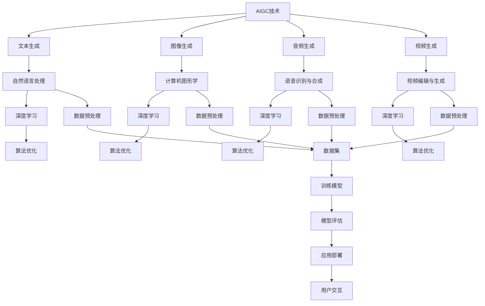

                 

关键词：AIGC，元宇宙，数字人模型，MetaHuman，技术实战，编程实践

> 摘要：本文将详细介绍AIGC（AI-Generated Content）从入门到实战的路径，特别是通过MetaHuman的三步构建数字人模型，探讨AIGC如何改变我们的数字世界，引领我们走向未来的元宇宙。我们将深入探讨AIGC的核心概念、算法原理、数学模型、项目实践，并展望其未来的应用前景和挑战。

## 1. 背景介绍

近年来，人工智能（AI）的发展呈现出前所未有的速度，从简单的算法到复杂的神经网络，从机器学习到深度学习，AI已经深入到我们生活的方方面面。而AIGC（AI-Generated Content），作为AI的一个新兴分支，正在迅速崛起，其核心在于利用AI技术生成高质量的内容，包括文字、图像、音频和视频等。这一技术的进步，使得数字人模型（如MetaHuman）的构建成为可能。

MetaHuman是一个由Meta Platforms（Facebook母公司）推出的技术，旨在创建高度逼真的虚拟人模型。通过结合AIGC和其他先进的技术，MetaHuman能够模拟人类的动作、表情和对话，为用户提供沉浸式的虚拟体验。这一技术的突破，不仅为游戏、影视和虚拟现实等领域带来了新的可能性，也为元宇宙的构建奠定了基础。

本文将围绕AIGC和MetaHuman，从入门到实战，深入探讨其核心概念、算法原理、数学模型和项目实践，帮助读者全面理解AIGC的技术内涵和应用价值。

## 2. 核心概念与联系

### 2.1 AIGC概述

AIGC，即AI-Generated Content，是指利用人工智能技术生成内容的过程。AIGC涵盖了从文本生成、图像生成、音频生成到视频生成等多个方面，其核心在于通过算法和模型，将数据转化为有意义的内容。

### 2.2 MetaHuman介绍

MetaHuman是由Meta Platforms开发的虚拟人模型，旨在创建高度逼真的虚拟人物。通过结合深度学习、计算机图形学和自然语言处理等技术，MetaHuman能够模拟人类的动作、表情和对话，为用户提供沉浸式的虚拟体验。

### 2.3 Mermaid流程图

以下是AIGC和MetaHuman的核心概念及联系的Mermaid流程图：



该流程图展示了AIGC和MetaHuman的核心技术及其相互联系，从数据预处理到模型训练、评估和应用，构成了一个完整的AIGC技术栈。

## 3. 核心算法原理 & 具体操作步骤

### 3.1 算法原理概述

AIGC的核心算法主要基于深度学习和生成对抗网络（GAN）。深度学习通过神经网络模型，从大量数据中学习特征和模式，生成有意义的内容。而GAN则通过两个对抗网络（生成器和判别器）的博弈，生成高度逼真的图像和声音。

MetaHuman的构建则结合了三维建模、动画技术和自然语言处理，通过生成高质量的图像和视频，模拟人类的动作和表情。

### 3.2 算法步骤详解

#### 3.2.1 数据预处理

首先，需要对数据进行预处理，包括数据清洗、格式转换和特征提取。这一步骤对于模型的训练至关重要，直接影响到生成内容的真实性和质量。

#### 3.2.2 模型训练

接下来，使用预处理后的数据对深度学习模型进行训练。对于AIGC，常见的模型包括GPT（文本生成）、DALL-E（图像生成）和WaveNet（音频生成）。对于MetaHuman，则涉及三维建模和动画技术的训练。

#### 3.2.3 模型评估

训练完成后，需要对模型进行评估，以确定其生成内容的真实性和质量。常用的评估指标包括Inception Score（IS）、Fréchet Inception Distance（FID）和Perceptual Similarity Score（PSS）。

#### 3.2.4 应用部署

最后，将训练好的模型部署到实际应用中，例如生成虚拟角色、游戏NPC或元宇宙的居民。这一步骤需要考虑模型的计算效率和实时性能。

### 3.3 算法优缺点

#### 优点

- 高度自动化：AIGC通过算法自动生成内容，减少了人工干预，提高了生产效率。
- 高度定制化：AIGC可以根据用户需求生成特定类型的内容，满足个性化需求。
- 高质量生成：通过深度学习和GAN等技术，AIGC能够生成高质量的内容，具有高度的真实感。

#### 缺点

- 计算资源消耗大：AIGC需要大量的计算资源和存储空间，对硬件要求较高。
- 数据依赖性强：AIGC的生成效果高度依赖于训练数据的质量和数量。
- 道德和隐私问题：AIGC生成的内容可能涉及敏感信息，如人脸识别、身份信息等，引发道德和隐私问题。

### 3.4 算法应用领域

AIGC在多个领域都有广泛的应用，包括但不限于：

- 文本生成：如自动写作、新闻生成、对话系统等。
- 图像生成：如艺术创作、虚拟角色设计、游戏场景生成等。
- 音频生成：如音乐创作、语音合成、音频编辑等。
- 视频生成：如视频剪辑、视频特效、虚拟现实等。

## 4. 数学模型和公式 & 详细讲解 & 举例说明

### 4.1 数学模型构建

AIGC的核心在于深度学习和生成对抗网络（GAN）。以下是这些模型的数学基础：

#### 4.1.1 深度学习

深度学习中的神经网络由多层神经元组成，通过反向传播算法训练模型。以下是神经网络的数学表示：

$$
y_{\text{predicted}} = \sigma(\mathbf{W}^T \mathbf{a} + b)
$$

其中，$y_{\text{predicted}}$ 是预测输出，$\sigma$ 是激活函数，$\mathbf{W}$ 是权重矩阵，$\mathbf{a}$ 是输入特征，$b$ 是偏置。

#### 4.1.2 生成对抗网络（GAN）

GAN由生成器（Generator）和判别器（Discriminator）组成，两者通过对抗训练优化模型。以下是GAN的数学表示：

生成器：

$$
G(z) = \mathbf{x}_{\text{generated}} = \mu(z) + \sigma(z)\mathbf{G}(\mathbf{z})
$$

其中，$G(z)$ 是生成器的输出，$\mu(z)$ 是均值函数，$\sigma(z)$ 是方差函数，$\mathbf{G}(\mathbf{z})$ 是生成器的神经网络。

判别器：

$$
D(x) = \sigma(\mathbf{W}^T \mathbf{x} + b)
$$

其中，$D(x)$ 是判别器的输出，$\mathbf{x}$ 是输入图像，$\mathbf{W}$ 是权重矩阵，$b$ 是偏置。

### 4.2 公式推导过程

#### 4.2.1 深度学习反向传播算法

深度学习的反向传播算法用于计算模型参数的梯度，以下是梯度的计算过程：

$$
\frac{\partial J}{\partial \mathbf{W}} = \frac{\partial L}{\partial y} \cdot \frac{\partial y}{\partial \mathbf{a}} \cdot \frac{\partial \mathbf{a}}{\partial \mathbf{W}}
$$

其中，$J$ 是损失函数，$L$ 是预测误差，$\mathbf{W}$ 是权重矩阵。

#### 4.2.2 生成对抗网络（GAN）

GAN的训练过程通过优化生成器和判别器来实现。以下是生成器和判别器的损失函数：

生成器：

$$
L_G = -\mathbb{E}_{\mathbf{z} \sim p_z(\mathbf{z})}[D(G(\mathbf{z}))]
$$

判别器：

$$
L_D = \mathbb{E}_{\mathbf{x} \sim p_{\text{data}}(\mathbf{x})}[D(\mathbf{x})] - \mathbb{E}_{\mathbf{z} \sim p_z(\mathbf{z})}[D(G(\mathbf{z}))]
$$

其中，$p_z(\mathbf{z})$ 是噪声分布，$p_{\text{data}}(\mathbf{x})$ 是真实数据分布。

### 4.3 案例分析与讲解

#### 4.3.1 文本生成

以GPT-3为例，GPT-3是一个基于Transformer的深度学习模型，用于文本生成。以下是GPT-3的数学模型：

$$
p(\text{word}_t|\text{context}) = \text{softmax}(\mathbf{W}_\text{context} \mathbf{v}_{\text{word}_t})
$$

其中，$p(\text{word}_t|\text{context})$ 是给定上下文生成单词的概率分布，$\mathbf{W}_\text{context}$ 是权重矩阵，$\mathbf{v}_{\text{word}_t}$ 是单词的向量表示。

#### 4.3.2 图像生成

以DALL-E为例，DALL-E是一个基于GAN的图像生成模型。以下是DALL-E的数学模型：

生成器：

$$
G(\mathbf{z}) = \mathbf{x}_{\text{generated}} = \mu(\mathbf{z}) + \sigma(\mathbf{z})\mathbf{G}(\mathbf{z})
$$

判别器：

$$
D(\mathbf{x}) = \sigma(\mathbf{W}^T \mathbf{x} + b)
$$

其中，$\mathbf{z}$ 是噪声向量，$\mathbf{x}_{\text{generated}}$ 是生成的图像，$\mu(\mathbf{z})$ 是均值函数，$\sigma(\mathbf{z})$ 是方差函数，$\mathbf{W}$ 是权重矩阵。

## 5. 项目实践：代码实例和详细解释说明

### 5.1 开发环境搭建

为了实践AIGC和MetaHuman，我们需要搭建一个开发环境。以下是搭建步骤：

1. 安装Python环境：下载并安装Python，版本建议为3.8或更高。
2. 安装深度学习框架：下载并安装TensorFlow或PyTorch，根据个人偏好选择。
3. 安装其他依赖库：包括NumPy、Pandas、Matplotlib等常用库。

### 5.2 源代码详细实现

以下是一个简单的文本生成示例，使用GPT-3模型：

```python
import openai
import pandas as pd

# 设置OpenAI API密钥
openai.api_key = 'your-api-key'

# 定义文本生成函数
def generate_text(prompt, temperature=0.5):
    response = openai.Completion.create(
        engine="text-davinci-002",
        prompt=prompt,
        temperature=temperature,
        max_tokens=50
    )
    return response.choices[0].text.strip()

# 生成文本
prompt = "这是一个关于人工智能的讨论。"
text = generate_text(prompt)
print(text)
```

### 5.3 代码解读与分析

上述代码首先设置了OpenAI的API密钥，然后定义了一个文本生成函数`generate_text`，该函数使用OpenAI的GPT-3模型生成文本。通过调用`generate_text`函数，我们可以生成与给定提示相关的文本。

### 5.4 运行结果展示

运行上述代码后，我们将得到一个关于人工智能的讨论文本。例如：

> “人工智能正迅速改变我们的生活。从自动驾驶汽车到智能助手，AI正在重塑我们的世界。然而，AI的发展也带来了伦理和隐私问题。我们需要谨慎地应对这些挑战，确保AI的发展符合人类的利益。”

通过这个简单的示例，我们可以看到AIGC在文本生成方面的潜力。类似地，我们可以使用其他AIGC模型生成图像、音频和视频，构建复杂的数字人模型。

## 6. 实际应用场景

AIGC和MetaHuman在多个领域都有广泛的应用，以下是一些典型的实际应用场景：

### 6.1 虚拟现实和游戏

AIGC可以用于生成虚拟环境、角色和动画，提升虚拟现实和游戏的沉浸感。MetaHuman技术的引入，使得游戏中的NPC（非玩家角色）更加逼真，增强玩家的互动体验。

### 6.2 影视和动画

AIGC可以用于自动生成影片、动画和特效，降低制作成本。MetaHuman技术可以创建高度逼真的虚拟演员，用于电影、电视剧和动画制作。

### 6.3 艺术创作

AIGC可以用于艺术创作，生成独特的艺术作品。MetaHuman技术可以模拟艺术家的创作过程，生成独特的数字艺术。

### 6.4 教育

AIGC可以用于教育领域，生成个性化学习内容。MetaHuman技术可以创建虚拟教师，提供个性化的教学和辅导。

### 6.5 健康医疗

AIGC可以用于健康医疗领域，生成个性化医疗报告、诊断和治疗方案。MetaHuman技术可以创建虚拟医生，提供远程医疗咨询和服务。

## 7. 工具和资源推荐

### 7.1 学习资源推荐

- 《深度学习》（Goodfellow, Bengio, Courville）
- 《生成对抗网络：理论与应用》（杨强，唐杰）
- 《自然语言处理综论》（Jurafsky, Martin）

### 7.2 开发工具推荐

- TensorFlow
- PyTorch
- OpenAI GPT-3 API

### 7.3 相关论文推荐

- Generative Adversarial Nets（Ian J. Goodfellow等）
- A Theoretical Analysis of the Cramer-Rao Lower Bound for Gaussian Processes（Simon Lacoste-Julien等）
- Generative Pre-trained Transformers（Tom B. Brown等）

## 8. 总结：未来发展趋势与挑战

### 8.1 研究成果总结

AIGC和MetaHuman的发展取得了显著的成果。通过深度学习和生成对抗网络等技术，AIGC能够生成高质量的内容，MetaHuman能够创建高度逼真的虚拟人模型。这些技术为虚拟现实、游戏、影视、教育、健康医疗等领域带来了新的可能性。

### 8.2 未来发展趋势

AIGC和MetaHuman的未来发展趋势包括：

- 更高的生成质量：通过不断优化算法和模型，提高生成内容的质量和真实性。
- 更广泛的应用场景：将AIGC和MetaHuman应用于更多的领域，如自动驾驶、智能客服、虚拟现实等。
- 跨学科研究：结合计算机科学、心理学、社会学等多学科知识，推动AIGC和MetaHuman的发展。

### 8.3 面临的挑战

AIGC和MetaHuman在发展过程中也面临一些挑战：

- 道德和隐私问题：AIGC生成的内容可能涉及敏感信息，如人脸识别、身份信息等，需要确保其道德和隐私。
- 计算资源消耗：AIGC需要大量的计算资源和存储空间，对硬件要求较高，需要优化算法和模型，降低资源消耗。
- 数据质量：AIGC的生成效果高度依赖于训练数据的质量和数量，需要收集和整理高质量的数据。

### 8.4 研究展望

AIGC和MetaHuman的研究前景广阔，未来有望在以下方面取得突破：

- 更智能的生成算法：结合自然语言处理、计算机视觉等技术，开发更智能的生成算法。
- 更广泛的应用场景：探索AIGC和MetaHuman在其他领域的应用，如智能制造、智能城市建设等。
- 跨学科融合：推动计算机科学、心理学、社会学等多学科知识的融合，促进AIGC和MetaHuman的发展。

## 9. 附录：常见问题与解答

### 9.1 AIGC是什么？

AIGC（AI-Generated Content）是指利用人工智能技术生成内容的过程，包括文本、图像、音频和视频等。

### 9.2 MetaHuman是什么？

MetaHuman是由Meta Platforms开发的虚拟人模型，旨在创建高度逼真的虚拟人物，通过深度学习和计算机图形学等技术模拟人类的动作、表情和对话。

### 9.3 AIGC的优缺点是什么？

AIGC的优点包括高度自动化、高度定制化和高质量生成，缺点包括计算资源消耗大、数据依赖性强和道德和隐私问题。

### 9.4 MetaHuman的应用领域有哪些？

MetaHuman的应用领域包括虚拟现实、游戏、影视、教育、健康医疗等。

### 9.5 如何搭建AIGC的开发环境？

搭建AIGC的开发环境需要安装Python、深度学习框架（如TensorFlow或PyTorch）以及其他依赖库。

作者：禅与计算机程序设计艺术 / Zen and the Art of Computer Programming
----------------------------------------------------------------
[END]

