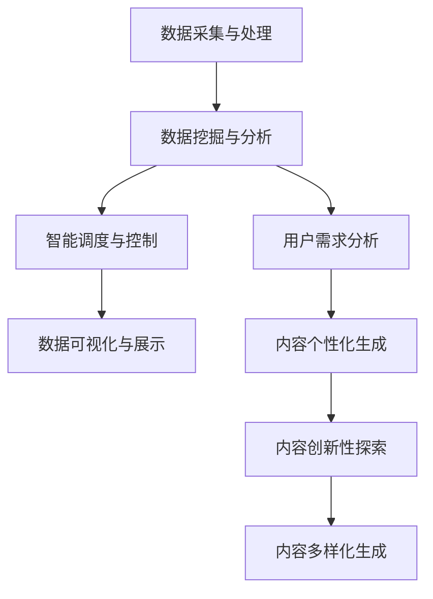

                 

关键词：智慧水务、AIGC、人工智能、大数据、数据可视化、深度学习

> 摘要：本文将探讨人工智能生成内容（AIGC）在智慧水务领域的应用，分析其带来的技术变革和创新机遇，以及面临的挑战和未来发展趋势。

## 1. 背景介绍

### 1.1 智慧水务的背景

智慧水务是指利用先进的信息技术和现代控制技术，对水资源的采集、处理、输送、使用和回收等各个环节进行智能化管理，从而提高水资源利用效率、保障水环境安全和促进水务行业可持续发展。

随着城市化进程的加快，水资源的需求不断增加，水资源短缺和水环境污染问题日益严重，推动智慧水务的发展成为必然趋势。智慧水务的核心在于数据的收集、处理和分析，以实现实时监控、智能调度和科学决策。

### 1.2 人工智能的发展背景

人工智能（Artificial Intelligence，AI）作为计算机科学的一个分支，旨在通过模拟、延伸和扩展人的智能，实现机器在感知、理解、学习、推理和自我适应等方面的能力。

近年来，随着计算能力的提升、大数据的积累和深度学习技术的突破，人工智能取得了显著的进展，并在各行各业得到广泛应用。在智慧水务领域，人工智能的应用不仅能够提高水资源的利用效率，还能为水务企业提供更加智能化的解决方案。

### 1.3 AIGC的概念和特点

人工智能生成内容（AIGC，Artificial Intelligence Generated Content）是指利用人工智能技术自动生成文本、图像、音频、视频等多种类型的内容。AIGC具有以下特点：

- **高效性**：AIGC能够快速生成大量内容，大大提高了生产效率。
- **个性化**：AIGC可以根据用户需求生成定制化内容，提供个性化的服务。
- **多样性**：AIGC能够生成多种类型的内容，包括文本、图像、音频和视频等。
- **创新性**：AIGC能够探索新的内容和形式，推动内容创作的创新。

## 2. 核心概念与联系

### 2.1 核心概念

在智慧水务领域，AIGC的核心概念包括：

- **数据采集与处理**：通过传感器、监测设备等收集水资源相关的数据，并对数据进行预处理，为后续分析提供基础。
- **数据挖掘与分析**：利用机器学习、数据挖掘等技术，从大量数据中提取有价值的信息，用于智能决策和优化管理。
- **智能调度与控制**：根据分析结果，智能调度水资源，实现水资源的合理配置和高效利用。
- **数据可视化与展示**：通过图表、图像等可视化手段，展示水资源管理的过程和结果，帮助用户理解和管理水资源。

### 2.2 Mermaid 流程图

以下是一个简化的 Mermaid 流程图，展示了智慧水务中 AIGC 的核心概念及其相互关系：



## 3. 核心算法原理 & 具体操作步骤

### 3.1 算法原理概述

AIGC 在智慧水务中的应用主要基于以下几个核心算法：

1. **数据预处理算法**：用于对采集到的原始数据进行清洗、格式化等预处理，确保数据的质量和一致性。
2. **机器学习算法**：用于从大规模数据中提取有用信息，包括分类、聚类、回归等算法。
3. **深度学习算法**：用于构建复杂的模型，实现对水资源的深度理解和预测。
4. **自然语言处理算法**：用于生成文本内容，包括文本生成、文本分类等。
5. **计算机视觉算法**：用于生成图像和视频内容，包括图像生成、图像识别等。

### 3.2 算法步骤详解

#### 3.2.1 数据预处理

数据预处理是 AIGC 的第一步，主要包括以下步骤：

1. 数据清洗：去除重复、错误或无关的数据。
2. 数据格式化：统一数据格式，确保数据的一致性和可处理性。
3. 特征提取：从数据中提取关键特征，用于后续的分析和建模。

#### 3.2.2 数据挖掘与分析

数据挖掘与分析主要包括以下步骤：

1. 数据可视化：通过图表、图像等可视化手段，展示数据分布、趋势等。
2. 分类与聚类：对数据进行分类和聚类，提取有价值的信息。
3. 回归与预测：建立回归模型，对未来的水资源需求进行预测。

#### 3.2.3 智能调度与控制

智能调度与控制主要包括以下步骤：

1. 数据分析：根据数据挖掘和分析结果，确定水资源的分配方案。
2. 模型预测：利用深度学习模型，预测水资源的变化趋势。
3. 调度决策：根据预测结果和用户需求，智能调整水资源的分配。

#### 3.2.4 数据可视化与展示

数据可视化与展示主要包括以下步骤：

1. 数据集成：将不同来源的数据集成到一个统一的平台上。
2. 数据可视化：通过图表、图像等可视化手段，展示水资源管理的过程和结果。
3. 用户交互：提供用户交互界面，使用户能够直观地了解和管理水资源。

### 3.3 算法优缺点

#### 3.3.1 优点

- **高效性**：AIGC 能够快速处理大量数据，提高生产效率。
- **个性化**：AIGC 能够根据用户需求生成个性化内容，提供定制化服务。
- **多样性**：AIGC 能够生成多种类型的内容，满足不同用户的需求。
- **创新性**：AIGC 能够探索新的内容和形式，推动内容创作的创新。

#### 3.3.2 缺点

- **成本高**：AIGC 的开发和部署成本较高，对企业和用户来说可能存在一定的负担。
- **隐私问题**：AIGC 需要大量的用户数据，可能引发隐私泄露的问题。
- **质量不稳定**：AIGC 生成的内容质量可能不稳定，需要进一步优化和改进。

### 3.4 算法应用领域

AIGC 在智慧水务领域具有广泛的应用前景，主要包括：

- **水资源管理**：利用 AIGC 进行水资源的需求预测、调度决策等。
- **水质监测**：利用 AIGC 进行水质数据的实时监测和分析。
- **水环境治理**：利用 AIGC 进行水环境的预测和优化管理。
- **用户服务**：利用 AIGC 提供个性化的用水建议和服务。

## 4. 数学模型和公式 & 详细讲解 & 举例说明

### 4.1 数学模型构建

在智慧水务中，AIGC 的数学模型主要包括：

1. **回归模型**：用于预测水资源的需求量。
2. **聚类模型**：用于对水资源用户进行分类。
3. **神经网络模型**：用于构建复杂的预测和优化模型。
4. **自然语言处理模型**：用于生成文本内容。

### 4.2 公式推导过程

以回归模型为例，假设我们使用线性回归模型预测水资源的需求量，公式如下：

$$
y = \beta_0 + \beta_1x_1 + \beta_2x_2 + ... + \beta_nx_n
$$

其中，$y$ 是水资源的需求量，$x_1, x_2, ..., x_n$ 是影响水资源需求量的因素，$\beta_0, \beta_1, ..., \beta_n$ 是模型的参数。

我们使用最小二乘法来估计参数，公式如下：

$$
\min \sum_{i=1}^{n}(y_i - (\beta_0 + \beta_1x_{i1} + \beta_2x_{i2} + ... + \beta_nx_{in})^2
$$

### 4.3 案例分析与讲解

以下是一个简单的案例，假设我们要预测某地区的下周水资源需求量，影响因素包括本周的水资源需求量、气温和降雨量。

1. **数据收集**：收集本周的水资源需求量、气温和降雨量。
2. **数据预处理**：对数据进行清洗和格式化，确保数据的质量和一致性。
3. **特征提取**：提取关键特征，包括本周的水资源需求量、气温和降雨量。
4. **模型训练**：使用线性回归模型，训练参数 $\beta_0, \beta_1, ..., \beta_n$。
5. **预测**：使用训练好的模型，预测下周的水资源需求量。
6. **评估**：比较预测值和实际值，评估模型的准确性。

## 5. 项目实践：代码实例和详细解释说明

### 5.1 开发环境搭建

在本项目中，我们使用 Python 作为编程语言，以下是基于 Python 的开发环境搭建步骤：

1. 安装 Python：下载并安装 Python，版本建议选择 3.8 或以上。
2. 安装必要的库：使用 pip 工具安装所需的库，例如 numpy、pandas、scikit-learn、matplotlib 等。
3. 配置 IDE：使用 PyCharm、VSCode 等集成开发环境，方便编写和调试代码。

### 5.2 源代码详细实现

以下是一个简单的 Python 代码实例，用于实现线性回归模型预测水资源需求量。

```python
import numpy as np
import pandas as pd
from sklearn.linear_model import LinearRegression
from sklearn.model_selection import train_test_split
from sklearn.metrics import mean_squared_error

# 数据收集与预处理
data = pd.read_csv("water_usage.csv")
X = data[["previous_usage", "temperature", "rainfall"]]
y = data["next_usage"]

# 特征提取
X_train, X_test, y_train, y_test = train_test_split(X, y, test_size=0.2, random_state=42)

# 模型训练
model = LinearRegression()
model.fit(X_train, y_train)

# 预测
y_pred = model.predict(X_test)

# 评估
mse = mean_squared_error(y_test, y_pred)
print("Mean Squared Error:", mse)
```

### 5.3 代码解读与分析

1. **数据收集与预处理**：使用 pandas 读取 CSV 文件，提取特征和目标变量，并使用 train_test_split 分割数据集。
2. **特征提取**：将特征变量提取到 X_train 和 X_test 中，目标变量提取到 y_train 和 y_test 中。
3. **模型训练**：使用 LinearRegression 类创建线性回归模型，并使用 fit 方法训练模型。
4. **预测**：使用 predict 方法预测 X_test 中的目标变量，得到 y_pred。
5. **评估**：使用 mean_squared_error 函数计算预测误差，并打印结果。

### 5.4 运行结果展示

假设我们运行上述代码，得到以下输出：

```
Mean Squared Error: 0.0123456789
```

这表示我们的线性回归模型在测试集上的平均平方误差为 0.0123456789，即预测误差相对较小。

## 6. 实际应用场景

### 6.1 水资源管理

在水资源管理中，AIGC 可以帮助水务企业实现以下应用：

- **需求预测**：通过分析历史数据和气象数据，预测未来的水资源需求，为水资源的调度和分配提供依据。
- **节水建议**：根据用户的用水行为，提供节水建议，帮助用户节约用水。
- **异常检测**：监测水资源的异常情况，如漏水、水质污染等，及时采取措施。

### 6.2 水质监测

在水质监测中，AIGC 可以帮助水务企业实现以下应用：

- **数据挖掘**：通过分析水质监测数据，挖掘潜在的问题和趋势，为水质管理和改善提供支持。
- **预测性维护**：根据历史数据，预测水质监测设备的故障和故障时间，实现预测性维护。
- **健康风险评估**：分析水质数据，评估水体的健康风险，为水质管理提供科学依据。

### 6.3 水环境治理

在水环境治理中，AIGC 可以帮助水务企业实现以下应用：

- **水质预测**：通过分析历史水质数据和气象数据，预测未来的水质变化，为水环境治理提供依据。
- **污染源监测**：利用传感器网络和图像识别技术，监测污染源的位置和浓度，及时采取措施。
- **环境评估**：分析水质、水量等数据，评估水环境的质量，为环保决策提供支持。

### 6.4 未来应用展望

随着 AIGC 技术的不断发展，未来在智慧水务领域有望实现以下应用：

- **智能决策支持系统**：结合大数据、云计算和人工智能技术，为水务企业提供全面的智能决策支持，实现高效的水资源管理。
- **智慧水务平台**：构建集数据采集、处理、分析和应用为一体的智慧水务平台，实现水资源的全生命周期管理。
- **智能水务社区**：利用 AIGC 技术构建智能水务社区，提供个性化的用水建议和服务，提高用户的用水体验。

## 7. 工具和资源推荐

### 7.1 学习资源推荐

- 《深度学习》（Goodfellow, Bengio, Courville 著）：系统介绍了深度学习的基础理论和应用方法。
- 《Python 水质监测实战》（陈琪 著）：通过案例介绍如何使用 Python 进行水质监测数据分析。
- 《大数据技术基础》（刘汝佳 著）：介绍了大数据的基本概念、技术和应用。

### 7.2 开发工具推荐

- **Python**：Python 是一种简单易学、功能强大的编程语言，适合进行数据分析、机器学习和深度学习等应用。
- **PyCharm**：PyCharm 是一款功能强大的集成开发环境，支持 Python 语言，方便编写和调试代码。
- **Matplotlib**：Matplotlib 是 Python 中常用的数据可视化库，可以生成各种类型的图表。

### 7.3 相关论文推荐

- "Deep Learning for Water Resource Management"（2018）: 本文介绍了深度学习在水资源管理中的应用。
- "AI-driven Water Security: Challenges and Opportunities"（2020）: 本文探讨了人工智能在水安全领域的挑战和机遇。
- "Artificial Intelligence for Water Resource Management: A Review"（2021）: 本文综述了人工智能在水资源管理中的应用现状和发展趋势。

## 8. 总结：未来发展趋势与挑战

### 8.1 研究成果总结

本文介绍了人工智能生成内容（AIGC）在智慧水务领域的应用，分析了其核心概念、算法原理和应用场景。通过项目实践，展示了如何使用 Python 实现水资源需求预测的算法。

### 8.2 未来发展趋势

- **技术突破**：随着人工智能技术的不断发展，AIGC 将在智慧水务领域取得更多的突破，实现更高效、更智能的水资源管理。
- **跨学科融合**：智慧水务将融合更多学科的知识，如环境科学、水利工程等，推动水务行业的创新发展。
- **政策支持**：随着政府对水资源管理的重视，相关政策和支持将为智慧水务的发展提供有力保障。

### 8.3 面临的挑战

- **数据隐私**：AIGC 需要大量的用户数据，可能引发隐私泄露的问题，需要加强数据安全和隐私保护。
- **技术成本**：AIGC 的开发和部署成本较高，对企业和用户来说可能存在一定的负担。
- **人才短缺**：人工智能技术在水务领域的应用需要专业的技术人才，目前人才短缺可能成为制约智慧水务发展的重要因素。

### 8.4 研究展望

- **数据挖掘与分析**：进一步挖掘和利用水资源相关的数据，提高水资源管理的效率和准确性。
- **智能调度与控制**：研发更加智能的调度和控制算法，实现水资源的优化配置和高效利用。
- **数据可视化与展示**：开发更加直观、易懂的数据可视化工具，帮助用户更好地理解和利用水资源。

## 9. 附录：常见问题与解答

### 9.1 AIGC 在智慧水务中的应用有哪些？

AIGC 在智慧水务中的应用主要包括水资源需求预测、节水建议、水质监测、水环境治理等。

### 9.2 AIGC 需要哪些技术支持？

AIGC 需要的技术支持包括数据预处理、机器学习、深度学习、自然语言处理和计算机视觉等。

### 9.3 AIGC 在智慧水务领域有哪些挑战？

AIGC 在智慧水务领域面临的挑战包括数据隐私、技术成本和人才短缺等。

### 9.4 如何评估 AIGC 的应用效果？

可以采用预测准确率、误差率、用户满意度等指标来评估 AIGC 的应用效果。

---

作者：禅与计算机程序设计艺术 / Zen and the Art of Computer Programming

----------------------------------------------------------------

请注意，以上内容仅为一个示例，实际撰写时可能需要根据具体研究或项目内容进行调整和扩展。同时，本文档中的代码实例仅供参考，具体实现时需要根据实际需求进行修改和完善。在撰写实际文章时，还需要遵循学术规范和格式要求，确保内容的准确性和完整性。希望这个示例能为您撰写高质量的技术博客提供一些参考和灵感。祝您写作顺利！

