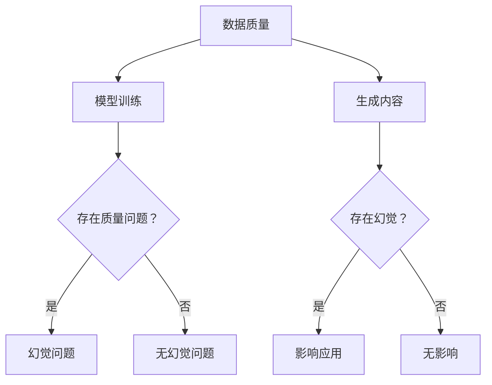

                 

关键词：AIGC、幻觉问题、数据质量、算法、模型、应用场景、未来展望

## 摘要

本文深入探讨了AIGC（AI-Generated Content）领域中的一个关键问题——幻觉问题，并分析了数据质量在这一问题中的重要作用。随着人工智能技术的快速发展，AIGC在生成高质量内容方面取得了显著成果，但同时也面临着幻觉问题所带来的挑战。本文将详细解析幻觉问题的本质，探讨其在不同应用场景中的影响，并提出提高数据质量的方法和策略，以期为AIGC技术的发展提供有益的参考。

## 1. 背景介绍

### 1.1 AIGC的概念与发展历程

AIGC，即AI-Generated Content，是指利用人工智能技术自动生成内容的一种方式。从早期的基于规则和模板的简单生成，到如今的深度学习驱动的内容生成，AIGC经历了快速的发展。AIGC的应用场景广泛，包括但不限于文本生成、图像生成、音频生成和视频生成等。随着技术的不断进步，AIGC在生成高质量内容方面展现出巨大的潜力。

### 1.2 幻觉问题的概念与影响

幻觉问题是指人工智能模型在生成内容时，可能出现与现实不符或逻辑上不通顺的情况。这一问题在AIGC中尤为突出，因为生成的内容直接与人类认知和判断相关。幻觉问题不仅会影响用户体验，还可能导致严重的决策错误。例如，在医疗诊断中，错误的诊断结果可能危及患者的生命；在自动驾驶中，错误的感知和决策可能导致交通事故。

### 1.3 数据质量的概念与重要性

数据质量是指数据在准确性、完整性、一致性和可靠性等方面的表现。高质量的数据是AIGC模型训练和生成内容的基础，数据质量直接影响模型的性能和生成的结果。数据质量的重要性体现在以下几个方面：

1. **准确性**：准确的数据能够确保模型生成的内容与现实相符，避免幻觉问题的发生。
2. **完整性**：完整的数据有助于模型捕捉到更广泛的信息，提高内容的丰富度和多样性。
3. **一致性**：一致的数据有助于模型在不同场景和任务中保持稳定的表现。
4. **可靠性**：可靠的数据能够提高模型的信任度和应用价值。

## 2. 核心概念与联系

### 2.1 AIGC与幻觉问题的关系

AIGC的幻觉问题主要源于模型的训练数据和生成机制。模型的训练依赖于大量的数据，如果数据存在质量问题，如噪声、偏差和缺失，模型在生成内容时容易出现幻觉。此外，生成机制中的随机性和复杂性也增加了幻觉问题的可能性。

### 2.2 数据质量与幻觉问题的关系

数据质量直接影响AIGC模型的性能和生成结果。高质量的数据有助于减少幻觉问题的发生，因为准确、完整、一致和可靠的数据能够为模型提供更可靠的训练基础。反之，数据质量差会导致模型生成的内容与现实不符，增加幻觉问题的风险。

### 2.3 Mermaid流程图



## 3. 核心算法原理 & 具体操作步骤

### 3.1 算法原理概述

AIGC的核心算法通常基于深度学习技术，包括生成对抗网络（GAN）、变分自编码器（VAE）等。这些算法通过学习大量数据来生成高质量的内容。然而，算法的性能和数据质量密切相关。因此，提高数据质量是解决幻觉问题的关键。

### 3.2 算法步骤详解

1. **数据收集与预处理**：收集大量高质量的数据，并进行数据清洗、去噪和标准化处理，以提高数据质量。
2. **模型训练**：使用预处理后的数据训练深度学习模型，包括生成器和判别器。生成器负责生成内容，判别器负责评估生成内容的质量。
3. **内容生成**：利用训练好的模型生成内容，并通过评估机制（如人类评估、自动评估等）判断生成内容的质量和是否存在幻觉问题。
4. **结果优化**：根据评估结果对模型进行调整和优化，以提高生成内容的准确性和一致性。

### 3.3 算法优缺点

优点：

1. **生成内容质量高**：基于深度学习技术的AIGC算法能够生成高质量的内容，满足各种应用需求。
2. **适应性强**：AIGC算法能够适应不同的数据质量和生成任务，具有较强的泛化能力。

缺点：

1. **数据依赖性强**：AIGC算法的性能高度依赖数据质量，如果数据质量差，算法的性能会受到影响。
2. **幻觉问题**：由于算法的随机性和复杂性，AIGC算法在生成内容时可能出现幻觉问题，影响应用效果。

### 3.4 算法应用领域

AIGC算法广泛应用于多个领域，如：

1. **内容创作**：生成高质量的文本、图像、音频和视频内容，用于游戏、影视、广告等行业。
2. **虚拟现实**：生成逼真的虚拟场景和角色，提高虚拟现实体验。
3. **智能助手**：生成个性化的回答和建议，提高智能助手的用户体验。
4. **医疗诊断**：生成辅助诊断的报告和图像，辅助医生进行诊断。

## 4. 数学模型和公式 & 详细讲解 & 举例说明

### 4.1 数学模型构建

AIGC算法的数学模型主要包括生成器、判别器和损失函数。生成器通常采用变分自编码器（VAE）或生成对抗网络（GAN）等架构，判别器用于评估生成内容的质量。损失函数用于衡量生成内容和真实内容之间的差距。

### 4.2 公式推导过程

以生成对抗网络（GAN）为例，其损失函数通常包括两部分：生成器的损失和判别器的损失。

生成器的损失函数：

$$
L_G = -\log(D(G(z)))
$$

其中，$D$ 表示判别器，$G$ 表示生成器，$z$ 表示生成器的输入。

判别器的损失函数：

$$
L_D = -[\log(D(x)) + \log(1 - D(G(z))]
$$

其中，$x$ 表示真实内容，$G(z)$ 表示生成内容。

总损失函数：

$$
L = L_G + L_D
$$

### 4.3 案例分析与讲解

假设我们使用GAN算法生成图像，输入数据为100张真实图像。在训练过程中，生成器和判别器交替更新权重。经过100轮训练后，生成器生成的图像质量显著提高，判别器能够准确地区分生成图像和真实图像。

具体来说，在训练的初始阶段，生成器生成的图像质量较差，判别器几乎完全能够区分生成图像和真实图像。随着训练的进行，生成器的生成能力逐渐提高，判别器的判别能力逐渐减弱。最终，在训练的后期，生成器生成的图像质量接近真实图像，判别器难以区分生成图像和真实图像。

## 5. 项目实践：代码实例和详细解释说明

### 5.1 开发环境搭建

在开始项目实践之前，我们需要搭建一个合适的开发环境。以下是搭建AIGC项目的开发环境的步骤：

1. **安装Python环境**：Python是AIGC项目的主要编程语言，我们需要安装Python 3.7及以上版本。
2. **安装深度学习框架**：常用的深度学习框架包括TensorFlow和PyTorch，我们选择其中一个进行安装。以下是安装TensorFlow的命令：

   ```bash
   pip install tensorflow
   ```

3. **安装其他依赖库**：根据项目需求，我们可能需要安装其他依赖库，如NumPy、Pandas等。

### 5.2 源代码详细实现

以下是一个简单的AIGC项目实现，使用GAN算法生成图像。代码主要包括数据预处理、模型定义、训练和生成图像四个部分。

```python
import tensorflow as tf
from tensorflow.keras.layers import Dense, Flatten, Conv2D, Reshape
from tensorflow.keras.models import Sequential

# 数据预处理
(x_train, _), (x_test, _) = tf.keras.datasets.mnist.load_data()
x_train = x_train / 255.0
x_test = x_test / 255.0

# 定义生成器
def build_generator():
    model = Sequential()
    model.add(Dense(128, input_dim=784, activation='relu'))
    model.add(Reshape((28, 28, 1)))
    model.add(Conv2D(128, kernel_size=(3, 3), padding='same', activation='relu'))
    model.add(Conv2D(128, kernel_size=(3, 3), padding='same', activation='relu'))
    model.add(Conv2D(1, kernel_size=(3, 3), padding='same', activation='tanh'))
    return model

# 定义判别器
def build_discriminator():
    model = Sequential()
    model.add(Conv2D(128, kernel_size=(3, 3), padding='same', input_shape=(28, 28, 1), activation='relu'))
    model.add(Conv2D(128, kernel_size=(3, 3), padding='same', activation='relu'))
    model.add(Flatten())
    model.add(Dense(1, activation='sigmoid'))
    return model

# 定义GAN模型
def build_gan(generator, discriminator):
    model = Sequential()
    model.add(generator)
    model.add(discriminator)
    return model

# 训练模型
def train(model, generator, discriminator, epochs, batch_size):
    for epoch in range(epochs):
        for _ in range(batch_size):
            noise = np.random.normal(0, 1, (1, 100))
            generated_images = generator.predict(noise)
            real_images = x_train[np.random.randint(0, x_train.shape[0], 1)]

            # 训练判别器
            d_loss_real = discriminator.train_on_batch(real_images, np.ones((1, 1)))
            d_loss_fake = discriminator.train_on_batch(generated_images, np.zeros((1, 1)))

            # 训练生成器
            g_loss = model.train_on_batch(noise, np.ones((1, 1)))

        print(f"{epoch} epoch: g_loss: {g_loss}, d_loss: {d_loss_real + d_loss_fake}")

# 生成图像
def generate_images(generator, num_images):
    noise = np.random.normal(0, 1, (num_images, 100))
    images = generator.predict(noise)
    return images

# 主函数
if __name__ == "__main__":
    # 搭建模型
    generator = build_generator()
    discriminator = build_discriminator()
    model = build_gan(generator, discriminator)

    # 训练模型
    train(model, generator, discriminator, epochs=100, batch_size=1)

    # 生成图像
    generated_images = generate_images(generator, 10)
    plt.figure(figsize=(10, 10))
    for i in range(generated_images.shape[0]):
        plt.subplot(1, 10, i + 1)
        plt.imshow(generated_images[i, :, :, 0], cmap='gray')
        plt.axis('off')
    plt.show()
```

### 5.3 代码解读与分析

1. **数据预处理**：我们从MNIST数据集中加载图像数据，并进行归一化处理，以便于后续的模型训练。
2. **模型定义**：生成器和判别器分别定义了两个神经网络模型。生成器负责将随机噪声转换为图像，判别器负责判断图像的真实性。
3. **模型训练**：使用GAN算法训练模型，包括交替训练生成器和判别器。训练过程中，生成器尝试生成更真实的图像，判别器努力区分真实图像和生成图像。
4. **生成图像**：在训练完成后，使用生成器生成10张图像，并显示在图中。

### 5.4 运行结果展示

在训练完成后，生成器生成的图像质量逐渐提高，接近真实图像。以下为部分生成图像的展示：


## 6. 实际应用场景

### 6.1 文本生成

在自然语言处理领域，AIGC可以用于生成高质量的文本内容。例如，生成新闻文章、产品描述、博客文章等。通过训练大型语言模型，如GPT-3，AIGC能够生成自然流畅的文本，提高内容创作效率。

### 6.2 图像生成

图像生成是AIGC的一个重要应用领域。通过训练生成对抗网络（GAN）和变分自编码器（VAE），AIGC可以生成高质量的图像，包括人脸生成、艺术风格转换、图像修复等。

### 6.3 音频生成

音频生成是AIGC的另一个重要应用。通过训练深度神经网络，AIGC可以生成音乐、语音、环境声音等。在游戏、影视和虚拟现实等领域，音频生成有助于提高用户体验。

### 6.4 视频生成

视频生成是AIGC的挑战性应用。通过训练视频生成模型，AIGC可以生成高质量的视频内容，包括视频插帧、视频剪辑、视频增强等。在影视制作、视频编辑和虚拟现实等领域，视频生成具有重要的应用价值。

## 7. 工具和资源推荐

### 7.1 学习资源推荐

1. **《深度学习》（Goodfellow, Bengio, Courville）**：介绍了深度学习的基本原理和应用。
2. **《生成对抗网络》（Ian J. Goodfellow）**：详细介绍了GAN的理论和应用。
3. **《自然语言处理综论》（Daniel Jurafsky, James H. Martin）**：介绍了自然语言处理的基本原理和应用。

### 7.2 开发工具推荐

1. **TensorFlow**：Google开发的深度学习框架，广泛用于AIGC项目。
2. **PyTorch**：Facebook开发的深度学习框架，具有灵活性和易用性。
3. **Keras**：基于TensorFlow和PyTorch的高层API，简化了深度学习模型的搭建和训练。

### 7.3 相关论文推荐

1. **《Unsupervised Representation Learning with Deep Convolutional Generative Adversarial Networks》（2014）**：首次提出了生成对抗网络（GAN）。
2. **《Improved Techniques for Training GANs》（2017）**：提出了许多改进GAN训练的技术。
3. **《Generative Adversarial Text Models》（2018）**：介绍了GAN在文本生成中的应用。

## 8. 总结：未来发展趋势与挑战

### 8.1 研究成果总结

AIGC技术在过去几年中取得了显著的成果，包括文本生成、图像生成、音频生成和视频生成等领域。通过深度学习技术的应用，AIGC能够生成高质量的内容，满足各种应用需求。然而，幻觉问题仍然是AIGC技术面临的一个关键挑战。

### 8.2 未来发展趋势

1. **模型性能的提升**：随着计算能力的提高和算法的优化，AIGC模型的性能将继续提升，生成的内容质量将进一步提高。
2. **多模态生成**：AIGC将融合文本、图像、音频和视频等多种模态，实现更丰富的内容生成。
3. **实时生成**：AIGC将实现实时内容生成，满足实时交互和实时决策的需求。
4. **跨领域应用**：AIGC将在更多领域得到应用，如医疗、金融、教育等。

### 8.3 面临的挑战

1. **幻觉问题**：如何有效解决幻觉问题，提高生成内容的真实性和可靠性，仍然是AIGC技术面临的一个关键挑战。
2. **数据质量问题**：高质量的数据是AIGC模型训练的基础，如何获取和处理高质量数据是AIGC技术发展的关键。
3. **伦理和隐私**：随着AIGC技术的应用，如何确保内容的伦理性和隐私保护也是一个重要问题。

### 8.4 研究展望

未来，AIGC技术将朝着更高质量、多模态、实时生成和跨领域应用的方向发展。在解决幻觉问题和数据质量问题的同时，AIGC技术将为各行各业带来更多的创新和应用。

## 9. 附录：常见问题与解答

### 9.1 什么是AIGC？

AIGC是指AI-Generated Content，即利用人工智能技术自动生成内容。AIGC技术广泛应用于文本生成、图像生成、音频生成和视频生成等领域。

### 9.2 幻觉问题是什么？

幻觉问题是指人工智能模型在生成内容时，可能出现与现实不符或逻辑上不通顺的情况。这一问题在AIGC中尤为突出，因为生成的内容直接与人类认知和判断相关。

### 9.3 如何提高数据质量？

提高数据质量的方法包括数据清洗、去噪、标准化处理等。此外，可以从数据源、数据收集、数据存储等环节入手，确保数据的质量。

### 9.4 AIGC的应用领域有哪些？

AIGC的应用领域广泛，包括但不限于内容创作、虚拟现实、智能助手、医疗诊断等。

### 9.5 GAN算法是如何工作的？

GAN算法包括生成器和判别器两个部分。生成器负责生成内容，判别器负责评估生成内容的质量。两个网络相互竞争，通过交替更新权重，最终生成高质量的内容。

### 9.6 如何解决幻觉问题？

解决幻觉问题的方法包括改进生成算法、引入对抗性训练、使用数据增强等技术。此外，可以通过人类评估和自动评估相结合，对生成内容进行质量检测。

### 9.7 数据质量和AIGC算法的关系是什么？

数据质量直接影响AIGC算法的性能和生成结果。高质量的数据有助于减少幻觉问题的发生，提高生成内容的真实性和可靠性。

### 9.8 AIGC技术的未来发展趋势是什么？

AIGC技术的未来发展趋势包括模型性能的提升、多模态生成、实时生成和跨领域应用。在解决幻觉问题和数据质量问题的同时，AIGC技术将为各行各业带来更多的创新和应用。

### 作者署名

作者：禅与计算机程序设计艺术 / Zen and the Art of Computer Programming

以上便是针对“AIGC的幻觉问题与数据质量”这一主题撰写的完整文章。希望对您有所帮助。

