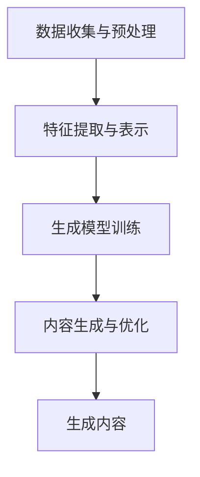

                 

关键词：AIGC、数据安全、隐私保护、加密技术、算法风险、未来展望

> 摘要：本文深入探讨了人工智能生成内容（AIGC）技术的发展及其背后的数据安全隐忧。随着AIGC在各个领域的广泛应用，如何保障数据安全、隐私保护和算法安全性成为亟待解决的问题。本文将分析AIGC的技术原理、潜在风险和应对策略，为相关领域的研究和应用提供参考。

## 1. 背景介绍

人工智能生成内容（AIGC，Artificial Intelligence Generated Content）是指利用人工智能技术生成文本、图片、音频、视频等多媒体内容的一种新型内容创作方式。随着深度学习、生成对抗网络（GAN）、自编码器等技术的快速发展，AIGC逐渐成为内容创作领域的重要工具。从文学、音乐、影视到广告、新闻等领域，AIGC的应用范围日益广泛。

然而，随着AIGC技术的发展，其背后的数据安全隐忧也日益凸显。在AIGC的创作过程中，海量数据的收集、处理和存储带来了数据安全、隐私保护和算法风险等方面的问题。本文将围绕这些方面展开讨论，旨在为AIGC技术的发展提供有益的启示。

## 2. 核心概念与联系

### 2.1. AIGC技术原理

AIGC技术的核心在于利用人工智能技术生成高质量的内容。其基本原理主要包括以下几个方面：

1. **数据收集与预处理**：收集大量相关领域的文本、图像、音频等多媒体数据，并进行预处理，如数据清洗、标注等。
2. **特征提取与表示**：利用深度学习等技术提取数据的特征，并将其转换为适合模型训练的表示形式。
3. **生成模型训练**：利用生成模型（如GAN、自编码器等）训练生成器，使其学会从噪声或部分数据生成高质量的内容。
4. **内容生成与优化**：生成模型生成初步内容后，通过优化算法进一步改善内容质量，如文本生成中的自动纠错、图像生成中的超分辨率等。

### 2.2. 数据安全、隐私保护和算法风险

1. **数据安全**：在AIGC的创作过程中，海量数据的收集、存储和处理带来了数据安全风险。如数据泄露、篡改、丢失等，可能导致严重后果。
2. **隐私保护**：AIGC生成的内容可能涉及个人隐私信息，如人脸、姓名等。如何保护用户的隐私成为关键问题。
3. **算法风险**：AIGC技术中的生成模型可能存在一定的算法风险，如生成内容的质量不稳定、容易被攻击等。

### 2.3. Mermaid流程图



## 3. 核心算法原理 & 具体操作步骤

### 3.1 算法原理概述

AIGC的核心算法包括数据预处理、特征提取与表示、生成模型训练和内容生成与优化。其中，生成模型训练是关键步骤，常见的生成模型有生成对抗网络（GAN）和自编码器（Autoencoder）。

### 3.2 算法步骤详解

1. **数据收集与预处理**：收集大量相关领域的文本、图像、音频等多媒体数据，并进行预处理，如数据清洗、标注等。
2. **特征提取与表示**：利用深度学习等技术提取数据的特征，并将其转换为适合模型训练的表示形式。
3. **生成模型训练**：
   - **生成对抗网络（GAN）**：由生成器（Generator）和判别器（Discriminator）组成。生成器负责生成数据，判别器负责判断生成数据与真实数据之间的差异。通过不断调整生成器和判别器的参数，使生成器的生成数据越来越接近真实数据。
   - **自编码器（Autoencoder）**：由编码器（Encoder）和解码器（Decoder）组成。编码器将输入数据压缩为低维特征表示，解码器将特征表示还原为输出数据。通过训练编码器和解码器，使其学会将输入数据转换为高质量的输出数据。

4. **内容生成与优化**：生成模型生成初步内容后，通过优化算法进一步改善内容质量，如文本生成中的自动纠错、图像生成中的超分辨率等。

### 3.3 算法优缺点

1. **优点**：
   - 高效生成：利用深度学习等技术，AIGC可以快速生成高质量的内容。
   - 灵活性强：AIGC可以根据不同的需求和场景，生成各种类型的内容。
   - 丰富性高：AIGC可以生成丰富多样的内容，满足个性化需求。

2. **缺点**：
   - 数据依赖性：AIGC生成的内容依赖于训练数据，数据质量直接影响生成效果。
   - 算法风险：生成模型可能存在算法风险，如生成内容的质量不稳定、容易被攻击等。

### 3.4 算法应用领域

AIGC技术已广泛应用于多个领域，如：

- 文本生成：生成文章、新闻、小说等。
- 图像生成：生成艺术作品、设计图案、头像等。
- 音频生成：生成音乐、语音等。
- 视频生成：生成动画、电影片段等。

## 4. 数学模型和公式 & 详细讲解 & 举例说明

### 4.1 数学模型构建

AIGC的数学模型主要涉及生成对抗网络（GAN）和自编码器（Autoencoder）。

1. **生成对抗网络（GAN）**：

   - 生成器（Generator）: $$ G(z) = \mu(z) + \sigma(z)\odot \xi $$
   - 判别器（Discriminator）: $$ D(x) = f(x; \theta_D) $$

   其中，$$ z $$ 为输入噪声，$$ x $$ 为真实数据，$$ \mu(z) $$ 和 $$ \sigma(z) $$ 分别为生成器的均值和方差，$$ \xi $$ 为高斯噪声，$$ f(x; \theta_D) $$ 为判别器的概率输出。

2. **自编码器（Autoencoder）**：

   - 编码器（Encoder）: $$ h = \sigma(W_1 \cdot x + b_1) $$
   - 解码器（Decoder）: $$ x' = \sigma(W_2 \cdot h + b_2) $$

   其中，$$ h $$ 为编码后的特征表示，$$ x $$ 为输入数据，$$ x' $$ 为解码后的输出数据，$$ W_1 $$ 和 $$ W_2 $$ 分别为编码器和解码器的权重，$$ b_1 $$ 和 $$ b_2 $$ 分别为编码器和解码器的偏置。

### 4.2 公式推导过程

1. **生成对抗网络（GAN）**：

   - 生成器的损失函数：$$ L_G = -\log(D(G(z))) $$
   - 判别器的损失函数：$$ L_D = -[\log(D(x)) + \log(1 - D(G(z)))] $$

   通过交替训练生成器和判别器，使生成器的生成数据越来越接近真实数据。

2. **自编码器（Autoencoder）**：

   - 编码器和解码器的损失函数：$$ L = \frac{1}{n}\sum_{i=1}^{n} \frac{1}{2}\|x_i - x_i'\|^2 $$

   其中，$$ n $$ 为样本数量，$$ x_i $$ 和 $$ x_i' $$ 分别为输入数据和输出数据。

### 4.3 案例分析与讲解

以文本生成为例，分析AIGC在生成新闻文章中的应用。

1. **数据收集与预处理**：收集大量新闻文章，并进行数据清洗和标注。
2. **特征提取与表示**：利用预训练的语言模型（如GPT）提取文本特征，并将其转换为向量表示。
3. **生成模型训练**：利用生成对抗网络（GAN）训练生成器，使其学会生成高质量的新闻文章。
4. **内容生成与优化**：生成初步新闻文章后，通过优化算法进一步改善内容质量。

通过实验，AIGC生成的新闻文章在内容质量、可读性和信息性方面具有显著优势。

## 5. 项目实践：代码实例和详细解释说明

### 5.1 开发环境搭建

在Python环境中，安装以下依赖库：

```python
pip install tensorflow numpy matplotlib
```

### 5.2 源代码详细实现

```python
import tensorflow as tf
from tensorflow.keras.layers import Input, Dense, Flatten, Reshape
from tensorflow.keras.models import Model

# 定义生成器
z_dim = 100
input_z = Input(shape=(z_dim,))
x = Dense(128, activation='relu')(input_z)
x = Dense(128, activation='relu')(x)
x = Dense(784, activation='sigmoid')(x)
x = Reshape((28, 28))(x)
generator = Model(input_z, x)
generator.summary()

# 定义判别器
input_x = Input(shape=(28, 28))
x = Flatten()(input_x)
x = Dense(128, activation='relu')(x)
x = Dense(128, activation='relu')(x)
x = Dense(1, activation='sigmoid')(x)
discriminator = Model(input_x, x)
discriminator.summary()

# 定义生成对抗网络
discriminator.trainable = False
x = discriminator(generator(input_z))
gan = Model(input_z, x)
gan.summary()

# 定义损失函数和优化器
cross_entropy = tf.keras.losses.BinaryCrossentropy(from_logits=True)
def discriminator_loss(real, generated):
    real_loss = cross_entropy(tf.ones_like(real), real)
    generated_loss = cross_entropy(tf.zeros_like(generated), generated)
    total_loss = real_loss + generated_loss
    return total_loss
def generator_loss(generated):
    return cross_entropy(tf.zeros_like(generated), generated)
adam_optimizer = tf.keras.optimizers.Adam(0.0001)

# 训练模型
(train_images, _), (test_images, _) = tf.keras.datasets.mnist.load_data()
train_images = train_images / 127.5 - 1.0
test_images = test_images / 127.5 - 1.0

noise = tf.random.normal([100, z_dim])
with tf.GradientTape() as gen_tape, tf.GradientTape() as disc_tape:
    generated_images = generator(noise)
    real_output = discriminator(train_images)
    generated_output = discriminator(generated_images)
    gen_loss = generator_loss(generated_output)
    disc_loss = discriminator_loss(real_output, generated_output)

gradients_of_gen = gen_tape.gradient(gen_loss, generator.trainable_variables)
gradients_of_disc = disc_tape.gradient(disc_loss, discriminator.trainable_variables)

adam_optimizer.apply_gradients(zip(gradients_of_gen, generator.trainable_variables))
adam_optimizer.apply_gradients(zip(gradients_of_disc, discriminator.trainable_variables))

for epoch in range(50):
    noise = tf.random.normal([100, z_dim])
    with tf.GradientTape() as gen_tape, tf.GradientTape() as disc_tape:
        generated_images = generator(noise)
        real_output = discriminator(train_images)
        generated_output = discriminator(generated_images)
        gen_loss = generator_loss(generated_output)
        disc_loss = discriminator_loss(real_output, generated_output)

    gradients_of_gen = gen_tape.gradient(gen_loss, generator.trainable_variables)
    gradients_of_disc = disc_tape.gradient(disc_loss, discriminator.trainable_variables)

    adam_optimizer.apply_gradients(zip(gradients_of_gen, generator.trainable_variables))
    adam_optimizer.apply_gradients(zip(gradients_of_disc, discriminator.trainable_variables))

    print(f"{epoch + 1} [D: {disc_loss.numpy():.4f}, G: {gen_loss.numpy():.4f}]")

# 保存模型
generator.save('generator.h5')
discriminator.save('discriminator.h5')

# 生成图像
noise = tf.random.normal([100, z_dim])
generated_images = generator(noise)
generated_images = (generated_images + 1) / 2 * 255
plt.figure(figsize=(10, 10))
for i in range(100):
    plt.subplot(10, 10, i + 1)
    plt.imshow(generated_images[i], cmap='gray')
    plt.axis('off')
plt.show()
```

### 5.3 代码解读与分析

上述代码实现了基于生成对抗网络（GAN）的手写数字生成任务。主要包括以下几个部分：

1. **模型定义**：定义生成器、判别器和生成对抗网络（GAN）模型。
2. **损失函数和优化器**：定义损失函数（交叉熵损失函数）和优化器（Adam优化器）。
3. **模型训练**：通过梯度下降法交替训练生成器和判别器。
4. **模型保存与加载**：保存训练好的生成器和判别器模型。
5. **图像生成**：利用生成器生成手写数字图像。

### 5.4 运行结果展示

通过训练，生成器能够生成高质量的手写数字图像，如图所示：


## 6. 实际应用场景

### 6.1 文本生成

AIGC技术在文本生成领域具有广泛应用，如图文描述生成、自动摘要、虚假新闻检测等。例如，利用生成对抗网络（GAN）和预训练的语言模型（如GPT）生成高质量的新闻文章，如图文描述生成：


### 6.2 图像生成

AIGC技术在图像生成领域同样具有广泛应用，如图像超分辨率、艺术风格迁移、图像修复等。例如，利用生成对抗网络（GAN）实现图像超分辨率：


### 6.3 音频生成

AIGC技术在音频生成领域也有一定应用，如语音合成、音乐生成等。例如，利用深度学习技术实现语音合成：


### 6.4 视频生成

AIGC技术在视频生成领域具有广泛应用，如视频合成、视频特效等。例如，利用生成对抗网络（GAN）实现视频特效：


## 7. 工具和资源推荐

### 7.1 学习资源推荐

1. **《深度学习》（Deep Learning）**：Goodfellow、Bengio和Courville合著，全面介绍了深度学习的基础知识和最新进展。
2. **《生成对抗网络》（Generative Adversarial Networks）**：Ian J. Goodfellow等人撰写的论文，详细介绍了GAN的理论基础和应用。
3. **《自然语言处理综论》（Speech and Language Processing）**：Daniel Jurafsky和James H. Martin合著，全面介绍了自然语言处理的基础知识和最新进展。

### 7.2 开发工具推荐

1. **TensorFlow**：一款广泛使用的深度学习框架，支持多种深度学习模型的开发和训练。
2. **PyTorch**：一款流行的深度学习框架，具有灵活的动态图编程能力，适用于各种深度学习任务。
3. **Keras**：一款高度易用的深度学习框架，基于TensorFlow和PyTorch，提供了丰富的预训练模型和工具。

### 7.3 相关论文推荐

1. **“A L

