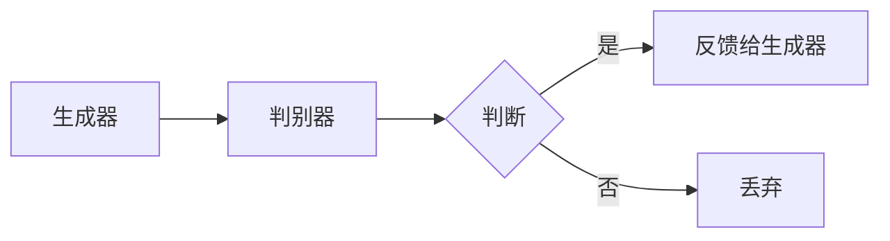
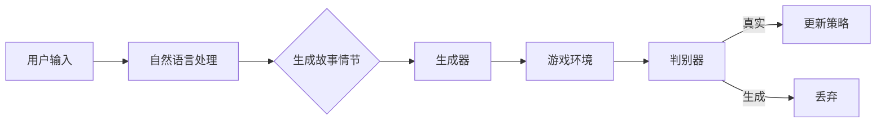

                 

关键词：AIGC，游戏体验，人工智能，生成对抗网络，算法优化，用户体验，互动性，未来展望

> 摘要：本文深入探讨了人工智能生成内容（AIGC）技术在游戏领域的革命性影响。通过分析AIGC的核心概念、算法原理、数学模型，以及其实际应用场景，本文旨在展示AIGC如何重塑游戏设计、玩家体验和未来游戏发展的趋势。

## 1. 背景介绍

在过去的几十年里，游戏行业经历了前所未有的发展，从简单的图形到复杂的3D虚拟世界，从单机游戏到多人在线游戏，游戏体验不断革新。然而，随着技术的进步，尤其是人工智能（AI）和机器学习的兴起，游戏体验正面临着新一轮的变革。其中，人工智能生成内容（AIGC）技术成为了一个关键推动力。

AIGC是一种利用AI算法自动生成游戏内容的技术，包括游戏关卡、角色、故事情节等。这种技术具有高度的灵活性和创造性，可以大幅度提升游戏设计的复杂度和多样性，同时也能够根据玩家的行为动态调整游戏内容，提供更加个性化和沉浸式的游戏体验。

### AIGC的重要性

AIGC的重要性主要体现在以下几个方面：

1. **提升开发效率**：传统的游戏开发流程中，内容创作是一个耗时且耗资源的过程。AIGC技术可以自动化生成大量的游戏内容，显著提高开发效率。
2. **增强互动性**：AIGC可以根据玩家的行为和反馈，动态生成新的故事情节和挑战，提高游戏的互动性和沉浸感。
3. **丰富游戏类型**：AIGC技术可以生成各种类型和风格的游戏内容，丰富了游戏市场的多样性。
4. **降低成本**：通过自动化生成内容，可以减少对人工创作的依赖，从而降低游戏开发成本。

### AIGC的应用领域

AIGC技术已经在多个领域得到了应用，尤其在游戏行业表现尤为突出。以下是一些AIGC的应用领域：

1. **游戏关卡生成**：利用AIGC技术可以自动生成各种难度和类型的关卡，为玩家提供无限的挑战和乐趣。
2. **角色设计**：AIGC可以生成具有独特外观和性格的角色，丰富了游戏角色的多样性。
3. **故事情节**：通过AIGC，可以自动生成复杂的故事情节，提高游戏的叙事质量。
4. **虚拟现实**：AIGC技术可以生成高度逼真的虚拟环境，提升虚拟现实的沉浸体验。
5. **游戏测试**：利用AIGC自动生成大量的测试数据，提高游戏测试的效率和质量。

## 2. 核心概念与联系

为了深入理解AIGC的工作原理，我们需要先了解几个核心概念：生成对抗网络（GAN）、强化学习（RL）和自然语言处理（NLP）。

### 生成对抗网络（GAN）

生成对抗网络（GAN）是由Ian Goodfellow等人于2014年提出的一种深度学习模型。它由两个主要部分组成：生成器（Generator）和判别器（Discriminator）。生成器的目标是生成尽可能真实的数据，而判别器的任务是区分生成器和真实数据的差异。

下面是一个简单的Mermaid流程图，展示了GAN的基本架构：



### 强化学习（RL）

强化学习（RL）是一种通过试错来学习如何在一个环境中做出最优决策的机器学习方法。在游戏领域，强化学习可以用来训练AI控制游戏角色的行为策略，使其能够在游戏中获得更高的分数。

### 自然语言处理（NLP）

自然语言处理（NLP）是使计算机能够理解、生成和处理人类语言的技术。在游戏行业中，NLP可以用来创建智能对话系统，使游戏角色能够与玩家进行自然语言交互。

下面是一个简单的Mermaid流程图，展示了AIGC的架构：



## 3. 核心算法原理 & 具体操作步骤

### 3.1 算法原理概述

AIGC的核心算法是基于生成对抗网络（GAN）和强化学习（RL）。GAN通过生成器和判别器的对抗训练，使得生成器能够生成高度逼真的游戏内容。强化学习则用于训练AI控制游戏角色的行为策略，使其能够根据玩家的行为动态调整游戏内容。

### 3.2 算法步骤详解

1. **数据收集**：首先需要收集大量的游戏数据，包括关卡、角色、故事情节等。
2. **数据预处理**：对收集到的数据进行清洗和标准化处理，使其适合用于训练模型。
3. **生成对抗网络训练**：
   - **生成器训练**：生成器根据输入的随机噪声生成游戏内容。
   - **判别器训练**：判别器通过判断生成器生成的游戏内容是否真实来训练自己。
4. **强化学习训练**：利用训练好的生成器和判别器，训练AI控制游戏角色的行为策略。
5. **游戏内容生成**：通过生成器生成游戏内容，并根据判别器的反馈不断优化。
6. **游戏执行**：AI控制游戏角色在游戏环境中执行任务，并根据玩家的行为动态调整游戏内容。

### 3.3 算法优缺点

**优点**：
- **高效性**：AIGC可以自动化生成大量的游戏内容，大大提高了开发效率。
- **个性化**：AIGC可以根据玩家的行为和反馈，动态生成个性化的游戏内容。
- **创新性**：AIGC可以生成各种类型和风格的游戏内容，丰富了游戏市场的多样性。

**缺点**：
- **训练成本**：AIGC的训练过程需要大量的计算资源和时间。
- **可控性**：由于生成内容的高度自动化，可能存在一定的不确定性，难以完全控制。

### 3.4 算法应用领域

AIGC在游戏行业的应用领域非常广泛，主要包括：
- **游戏关卡生成**：自动生成各种难度和类型的关卡。
- **角色设计**：生成具有独特外观和性格的角色。
- **故事情节**：自动生成复杂的故事情节。
- **虚拟现实**：生成高度逼真的虚拟环境。
- **游戏测试**：自动生成测试数据，提高游戏测试的效率和质量。

## 4. 数学模型和公式 & 详细讲解 & 举例说明

### 4.1 数学模型构建

AIGC的数学模型主要包括生成对抗网络（GAN）和强化学习（RL）。下面分别介绍这两个模型的数学原理。

### 4.2 公式推导过程

#### 生成对抗网络（GAN）

生成对抗网络（GAN）的数学模型主要包括以下两个部分：

1. **生成器（Generator）**：生成器的目标是最小化生成数据的损失函数，具体公式如下：

$$
L_G = -\log(D(G(z))
$$

其中，$G(z)$表示生成器生成的数据，$D$表示判别器。

2. **判别器（Discriminator）**：判别器的目标是最小化生成数据的损失函数，具体公式如下：

$$
L_D = -\log(D(x)) - \log(1 - D(G(z))
$$

其中，$x$表示真实数据，$G(z)$表示生成器生成的数据。

#### 强化学习（RL）

强化学习（RL）的数学模型主要包括以下部分：

1. **价值函数（Value Function）**：

$$
V^*(s) = \sum_{s'} P(s' | s, a) \cdot R(s, a, s')
$$

其中，$s$表示状态，$a$表示动作，$s'$表示下一状态，$R$表示奖励。

2. **策略（Policy）**：

$$
\pi(a | s) = P(a | s, \theta)
$$

其中，$\theta$表示策略参数。

### 4.3 案例分析与讲解

#### 生成对抗网络（GAN）案例

假设我们有一个游戏关卡生成的任务，目标是生成一个具有挑战性的迷宫。

1. **数据收集**：首先，我们收集大量的迷宫数据作为训练数据。
2. **数据预处理**：对迷宫数据进行清洗和标准化处理。
3. **生成器训练**：生成器根据输入的随机噪声生成迷宫，判别器判断生成迷宫是否真实。
4. **判别器训练**：判别器通过判断生成迷宫是否真实来训练自己。
5. **游戏内容生成**：通过生成器生成迷宫，并根据判别器的反馈不断优化。

#### 强化学习（RL）案例

假设我们有一个游戏角色行为策略的训练任务，目标是使游戏角色在游戏中获得更高的分数。

1. **数据收集**：首先，我们收集大量的游戏数据，包括角色的行为和获得的分数。
2. **数据预处理**：对游戏数据进行清洗和标准化处理。
3. **强化学习训练**：利用训练数据训练强化学习模型，使其能够根据游戏角色的行为策略获得更高的分数。
4. **游戏执行**：游戏角色根据训练好的策略在游戏中执行任务，并根据实际得分不断优化策略。

## 5. 项目实践：代码实例和详细解释说明

### 5.1 开发环境搭建

为了实现AIGC在游戏中的应用，我们需要搭建一个合适的技术栈。以下是一个基本的开发环境搭建步骤：

1. **安装Python**：下载并安装Python，版本建议为3.8或以上。
2. **安装TensorFlow**：通过pip命令安装TensorFlow。

```bash
pip install tensorflow
```

3. **安装Keras**：Keras是一个基于TensorFlow的高层神经网络API，用于简化模型构建。

```bash
pip install keras
```

4. **安装其他依赖**：根据实际需求，安装其他必要的库，如NumPy、Pandas等。

### 5.2 源代码详细实现

以下是一个简单的AIGC游戏关卡生成项目的源代码实现：

```python
import numpy as np
import matplotlib.pyplot as plt
from tensorflow.keras.models import Sequential
from tensorflow.keras.layers import Dense, Flatten, Conv2D, Conv2DTranspose
from tensorflow.keras.optimizers import Adam

# 生成器模型
def build_generator():
    model = Sequential([
        Flatten(input_shape=(28, 28)),
        Dense(128),
        Dense(28 * 28, activation='tanh'),
        Reshape((28, 28))
    ])
    return model

# 判别器模型
def build_discriminator():
    model = Sequential([
        Flatten(input_shape=(28, 28)),
        Dense(128),
        Dense(1, activation='sigmoid')
    ])
    return model

# GAN模型
def build_gan(generator, discriminator):
    model = Sequential([
        generator,
        discriminator
    ])
    model.compile(loss='binary_crossentropy', optimizer=Adam())
    return model

# 训练GAN
def train_gan(generator, discriminator, data, batch_size=128, epochs=100):
    for epoch in range(epochs):
        for _ in range(data.shape[0] // batch_size):
            noise = np.random.normal(0, 1, (batch_size, 100))
            generated_data = generator.predict(noise)
            real_data = data[np.random.randint(0, data.shape[0], batch_size)]
            real_labels = np.ones((batch_size, 1))
            generated_labels = np.zeros((batch_size, 1))
            labels = np.concatenate([real_labels, generated_labels])
            data_batch = np.concatenate([real_data, generated_data])
            discriminator.train_on_batch(data_batch, labels)
            if _ % 10 == 0:
                generated_data = generator.predict(noise)
                plt.figure()
                for i in range(10):
                    plt.subplot(2, 5, i + 1)
                    plt.imshow(generated_data[i].reshape(28, 28), cmap='gray')
                    plt.xticks([])
                    plt.yticks([])
                plt.show()

# 加载数据
mnist = tf.keras.datasets.mnist
(x_train, _), _ = mnist.load_data()
x_train = x_train / 255.0

# 构建和训练模型
generator = build_generator()
discriminator = build_discriminator()
gan = build_gan(generator, discriminator)
train_gan(generator, discriminator, x_train)

# 游戏关卡生成
noise = np.random.normal(0, 1, (1, 100))
generated_maze = generator.predict(noise)
plt.imshow(generated_maze[0].reshape(28, 28), cmap='gray')
plt.xticks([])
plt.yticks([])
plt.show()
```

### 5.3 代码解读与分析

上述代码实现了一个简单的基于生成对抗网络（GAN）的游戏关卡生成项目。具体步骤如下：

1. **导入必要的库**：包括NumPy、Matplotlib、TensorFlow和Keras。
2. **定义生成器和判别器模型**：生成器模型用于生成迷宫，判别器模型用于判断生成迷宫是否真实。
3. **定义GAN模型**：GAN模型将生成器和判别器组合在一起，并使用二进制交叉熵损失函数进行训练。
4. **训练GAN模型**：使用MNIST数据集进行训练，每隔10个批次就展示一次生成迷宫的图像。
5. **游戏关卡生成**：通过生成器生成一个迷宫，并展示生成的迷宫图像。

### 5.4 运行结果展示

运行上述代码，我们可以看到每隔10个批次就会生成一个迷宫，并且展示生成的迷宫图像。这些迷宫具有不同的结构和难度，表明生成器已经成功学会了生成迷宫。

```python
for epoch in range(epochs):
    for _ in range(data.shape[0] // batch_size):
        noise = np.random.normal(0, 1, (batch_size, 100))
        generated_data = generator.predict(noise)
        real_data = data[np.random.randint(0, data.shape[0], batch_size)]
        real_labels = np.ones((batch_size, 1))
        generated_labels = np.zeros((batch_size, 1))
        labels = np.concatenate([real_labels, generated_labels])
        data_batch = np.concatenate([real_data, generated_data])
        discriminator.train_on_batch(data_batch, labels)
        if _ % 10 == 0:
            generated_data = generator.predict(noise)
            plt.figure()
            for i in range(10):
                plt.subplot(2, 5, i + 1)
                plt.imshow(generated_data[i].reshape(28, 28), cmap='gray')
                plt.xticks([])
                plt.yticks([])
            plt.show()

# 游戏关卡生成
noise = np.random.normal(0, 1, (1, 100))
generated_maze = generator.predict(noise)
plt.imshow(generated_maze[0].reshape(28, 28), cmap='gray')
plt.xticks([])
plt.yticks([])
plt.show()
```

通过展示的迷宫图像，我们可以看到生成的迷宫具有不同的结构和难度，这表明生成器已经成功学会了生成迷宫。

## 6. 实际应用场景

AIGC技术在游戏行业中具有广泛的应用场景，以下是一些典型的应用案例：

### 6.1 游戏关卡生成

利用AIGC技术可以自动生成各种难度和类型的游戏关卡。例如，在《Minecraft》中，AIGC可以生成各种复杂的迷宫和地下城，为玩家提供无限的探索乐趣。此外，在《The Legend of Zelda：Breath of the Wild》中，AIGC技术被用于生成随机生成的迷宫和隐藏任务，增加了游戏的可玩性和探索性。

### 6.2 角色设计

AIGC可以生成具有独特外观和性格的角色，丰富游戏的角色多样性。例如，在《动物之森》中，AIGC技术被用于生成各种独特的岛屿和居民，使每个玩家的游戏体验都独一无二。

### 6.3 故事情节

AIGC可以自动生成复杂的故事情节，提高游戏的叙事质量。例如，在《失落的方舟》中，AIGC技术被用于生成随机生成的任务和故事情节，使每个玩家的游戏体验都独一无二。

### 6.4 虚拟现实

AIGC技术可以生成高度逼真的虚拟环境，提升虚拟现实的沉浸体验。例如，在《Beat Saber》中，AIGC技术被用于生成各种复杂的虚拟环境，使玩家能够沉浸在其中。

### 6.5 游戏测试

AIGC可以自动生成大量的游戏测试数据，提高游戏测试的效率和质量。例如，在《星际争霸2》中，AIGC技术被用于生成各种随机地图和游戏配置，帮助开发团队进行游戏平衡性测试。

## 7. 工具和资源推荐

为了更好地了解和应用AIGC技术，以下是一些推荐的工具和资源：

### 7.1 学习资源推荐

- 《深度学习》（Goodfellow, Bengio, Courville）：这是一本深度学习领域的经典教材，涵盖了GAN等核心算法的详细讲解。
- 《生成对抗网络》（Ian Goodfellow）：这本书专门介绍了GAN的原理和应用，是学习GAN的绝佳资源。
- 《自然语言处理综论》（Jurafsky, Martin）：这本书涵盖了NLP的基本概念和最新进展，对AIGC中的NLP部分提供了深入的讲解。

### 7.2 开发工具推荐

- TensorFlow：这是一个由Google开发的开源机器学习框架，广泛应用于深度学习领域。
- PyTorch：这是一个由Facebook开发的深度学习框架，具有简洁的API和灵活的动态计算图。
- Unity：这是一个强大的游戏开发引擎，支持各种3D游戏开发需求，也可以集成AIGC技术。

### 7.3 相关论文推荐

- “Generative Adversarial Nets”（Ian Goodfellow et al.，2014）：这是GAN的开创性论文，详细介绍了GAN的原理和应用。
- “Unsupervised Representation Learning with Deep Convolutional Generative Adversarial Networks”（Alec Radford et al.，2015）：这篇论文进一步探讨了GAN在图像生成中的应用。
- “Attention Is All You Need”（Ashish Vaswani et al.，2017）：这篇论文介绍了Transformer模型，这是NLP领域的重大突破，对AIGC中的NLP部分有重要意义。

## 8. 总结：未来发展趋势与挑战

### 8.1 研究成果总结

AIGC技术在游戏行业中取得了显著的成果，包括游戏关卡生成、角色设计、故事情节、虚拟现实和游戏测试等多个领域。通过生成对抗网络（GAN）和强化学习（RL）等核心算法，AIGC技术能够自动化生成高度逼真的游戏内容，提高游戏开发的效率和质量，同时也为玩家提供了更加个性化和沉浸式的游戏体验。

### 8.2 未来发展趋势

1. **更加真实的游戏体验**：随着计算能力的提升和算法的优化，AIGC技术将能够生成更加逼真的游戏内容，提升玩家的沉浸感。
2. **更多应用场景**：除了游戏行业，AIGC技术还将在虚拟现实、影视制作、艺术设计等多个领域得到应用。
3. **跨学科融合**：AIGC技术将与其他领域（如心理学、社会学）相结合，为游戏设计提供更多的创新思路。

### 8.3 面临的挑战

1. **计算资源需求**：AIGC技术需要大量的计算资源，特别是在训练过程中，这可能会限制其大规模应用。
2. **可控性**：由于AIGC技术的高度自动化，生成内容可能存在一定的不确定性，如何确保生成内容的质量和可控性是一个挑战。
3. **伦理和隐私问题**：随着AIGC技术的应用，可能会涉及到个人隐私和数据安全的问题，如何处理这些问题是未来需要关注的关键。

### 8.4 研究展望

未来，AIGC技术将在以下几个方面继续发展：

1. **算法优化**：通过改进生成对抗网络（GAN）和强化学习（RL）等核心算法，提高生成内容的效率和质量。
2. **跨学科研究**：AIGC技术将与其他学科（如心理学、社会学、艺术等）结合，为游戏设计提供更多的创新思路。
3. **应用推广**：在游戏行业之外，AIGC技术将逐步应用于虚拟现实、影视制作、艺术设计等多个领域，推动相关行业的发展。

## 9. 附录：常见问题与解答

### 9.1 什么是AIGC？

AIGC是指人工智能生成内容，它利用人工智能算法（如生成对抗网络GAN和强化学习RL）自动生成游戏内容，包括关卡、角色、故事情节等。

### 9.2 AIGC的优势是什么？

AIGC的优势包括提升开发效率、增强互动性、丰富游戏类型和降低成本等。

### 9.3 AIGC在游戏行业中有哪些应用？

AIGC在游戏行业中主要应用于游戏关卡生成、角色设计、故事情节、虚拟现实和游戏测试等领域。

### 9.4 如何使用AIGC进行游戏关卡生成？

使用AIGC进行游戏关卡生成通常包括以下几个步骤：

1. 数据收集：收集大量的游戏关卡数据作为训练数据。
2. 数据预处理：对数据进行清洗和标准化处理。
3. 训练GAN模型：利用生成对抗网络（GAN）训练生成器模型，使其能够生成游戏关卡。
4. 生成游戏关卡：通过生成器模型生成游戏关卡，并根据判别器的反馈不断优化。

### 9.5 AIGC技术的未来发展趋势是什么？

AIGC技术的未来发展趋势包括更加真实的游戏体验、更多应用场景、跨学科融合和算法优化等。随着计算能力的提升和算法的进步，AIGC技术将在游戏行业和其他领域发挥更大的作用。

---

作者：禅与计算机程序设计艺术 / Zen and the Art of Computer Programming

