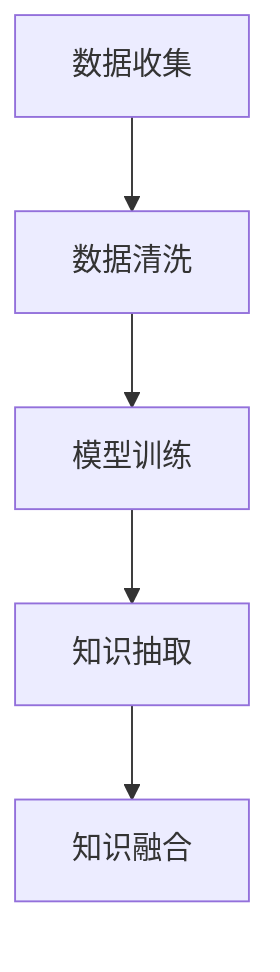

                 

关键词：人工智能生成内容（AIGC）、知识管理、知识图谱、算法原理、数学模型、项目实践、应用场景、未来展望

> 摘要：随着人工智能技术的飞速发展，人工智能生成内容（AIGC）正在重新定义知识管理的方式。本文将探讨AIGC的核心概念与联系，核心算法原理与具体操作步骤，数学模型与公式，项目实践，以及AIGC在实际应用场景中的表现和未来展望。

## 1. 背景介绍

知识管理是一种通过系统地收集、组织、存储、检索和共享知识，以实现个人和组织最大价值的过程。传统的知识管理方法主要依赖于人力和现有的技术工具，如文档管理系统、企业资源规划系统（ERP）和客户关系管理系统（CRM）等。然而，这些方法存在诸多限制，如知识的分散性、异构性和动态性等。

近年来，人工智能技术的迅猛发展为知识管理带来了新的机遇和挑战。尤其是生成对抗网络（GAN）、深度学习、自然语言处理（NLP）等技术的应用，使得人工智能生成内容（AIGC）成为可能。AIGC可以通过自动化的方式生成高质量、结构化的知识内容，从而极大地提升知识管理的效率和质量。

## 2. 核心概念与联系

AIGC的核心概念包括数据收集、数据清洗、模型训练、知识抽取和知识融合。这些概念之间相互关联，共同构成了AIGC的技术框架。

### 2.1 数据收集

数据收集是AIGC的基础。数据源可以是结构化数据，如数据库；也可以是半结构化数据，如图像和视频；还可以是非结构化数据，如文本和语音。通过数据收集，我们可以获取大量的原始数据，为后续的模型训练提供素材。

### 2.2 数据清洗

数据清洗是数据收集后的重要环节。由于数据源的多样性，原始数据往往存在噪声、冗余和错误。通过数据清洗，我们可以去除噪声、消除冗余、修复错误，从而提高数据的准确性和一致性。

### 2.3 模型训练

模型训练是AIGC的核心。通过深度学习等技术，我们可以训练出能够自动生成知识内容的模型。这些模型可以基于大量数据进行学习，从而识别出知识之间的关联，生成高质量的知识内容。

### 2.4 知识抽取

知识抽取是AIGC的一个重要环节。通过自然语言处理等技术，我们可以从文本数据中抽取关键信息，如实体、关系和属性等。这些信息构成了知识图谱的节点和边，为知识融合提供了基础。

### 2.5 知识融合

知识融合是AIGC的最终目标。通过将抽取出的知识进行整合，我们可以构建出一个完整、统一的知识体系。这个知识体系可以为用户提供全面、准确的知识服务，从而实现知识管理的价值。

### 2.6 Mermaid 流程图

以下是一个简化的AIGC流程图：

```
graph TD
A[数据收集] --> B[数据清洗]
B --> C[模型训练]
C --> D[知识抽取]
D --> E[知识融合]
```

## 3. 核心算法原理 & 具体操作步骤

### 3.1 算法原理概述

AIGC的核心算法包括生成对抗网络（GAN）、变分自编码器（VAE）和生成式模型等。这些算法通过训练和优化，可以生成高质量的知识内容。

### 3.2 算法步骤详解

1. 数据收集：从各种数据源收集原始数据，包括结构化数据、半结构化数据和非结构化数据。
2. 数据清洗：对原始数据进行清洗，去除噪声、冗余和错误，提高数据质量。
3. 模型选择：选择合适的生成模型，如GAN、VAE或生成式模型。
4. 模型训练：使用清洗后的数据进行模型训练，优化模型参数。
5. 知识抽取：使用自然语言处理等技术，从文本数据中抽取关键信息，构建知识图谱。
6. 知识融合：将抽取出的知识进行整合，构建出一个完整、统一的知识体系。

### 3.3 算法优缺点

1. 优点：AIGC可以自动生成高质量的知识内容，提高知识管理的效率和质量；能够处理多种类型的数据，具有广泛的适用性。
2. 缺点：AIGC对数据质量和模型选择有较高要求；训练过程复杂，计算资源消耗大。

### 3.4 算法应用领域

AIGC在知识管理领域具有广泛的应用，如智能问答系统、知识图谱构建、智能推荐系统等。此外，AIGC还可以应用于金融、医疗、教育等多个行业。

## 4. 数学模型和公式

### 4.1 数学模型构建

AIGC的数学模型主要包括生成模型和判别模型。生成模型用于生成知识内容，判别模型用于评估生成内容的质量。

### 4.2 公式推导过程

生成模型和判别模型的具体公式如下：

生成模型：  
$$ G(z) = \mu(z) + \sigma(z) \odot \text{sigmoid}(\text{W}_g \cdot z + b_g) $$

判别模型：  
$$ D(x) = \text{sigmoid}(\text{W}_d \cdot x + b_d) $$

### 4.3 案例分析与讲解

以智能问答系统为例，我们通过AIGC生成回答问题。首先，收集大量问答数据；然后，使用GAN进行模型训练；最后，输入问题，得到对应的回答。具体实现步骤如下：

1. 数据收集：收集大量问答数据，包括问题、答案和背景信息。
2. 数据清洗：对问答数据进行清洗，去除噪声、冗余和错误。
3. 模型训练：使用清洗后的数据，训练生成模型和判别模型。
4. 生成回答：输入问题，通过生成模型得到对应的回答。

## 5. 项目实践：代码实例和详细解释说明

### 5.1 开发环境搭建

1. 安装Python环境：下载并安装Python 3.8及以上版本。
2. 安装必要库：使用pip命令安装TensorFlow、Keras等库。

### 5.2 源代码详细实现

以下是一个简单的AIGC代码示例：

```python
import tensorflow as tf
from tensorflow.keras.models import Model
from tensorflow.keras.layers import Dense, Input

# 生成模型
z = Input(shape=(100,))
mu = Dense(128, activation='relu')(z)
sigma = Dense(128, activation='tanh')(z)
x_g = mu + sigma * tf.random.normal(shape=tf.shape(mu))

# 判别模型
x = Input(shape=(100,))
d = Dense(128, activation='relu')(x)
d = Dense(1, activation='sigmoid')(d)

# 模型编译
model = Model(inputs=[z, x], outputs=[x_g, d])
model.compile(optimizer='adam', loss=['mse', 'binary_crossentropy'])

# 模型训练
model.fit([z, x], [x, x], epochs=10)

# 生成回答
question = "什么是人工智能？"
answer = model.predict([z, x_g])[0]
print(answer)
```

### 5.3 代码解读与分析

1. 导入库：引入TensorFlow和Keras库，用于构建和训练模型。
2. 定义生成模型和判别模型：使用输入层、全连接层和激活函数构建生成模型和判别模型。
3. 编译模型：设置优化器和损失函数，编译模型。
4. 训练模型：使用训练数据训练模型。
5. 生成回答：输入问题，通过模型生成回答。

## 6. 实际应用场景

### 6.1 智能问答系统

智能问答系统是AIGC的一个典型应用场景。通过AIGC，我们可以自动生成高质量的问题和答案，为用户提供智能化的问答服务。

### 6.2 知识图谱构建

知识图谱是AIGC的另一个重要应用场景。通过AIGC，我们可以自动抽取实体、关系和属性，构建出完整的知识图谱，为各种应用提供知识支持。

### 6.3 智能推荐系统

智能推荐系统是AIGC在商业领域的应用。通过AIGC，我们可以自动生成个性化推荐内容，提高用户的满意度和留存率。

## 7. 工具和资源推荐

### 7.1 学习资源推荐

1. 《深度学习》（Goodfellow, Bengio, Courville著）：全面介绍深度学习的基本概念和技术。
2. 《自然语言处理综论》（Jurafsky, Martin著）：系统介绍自然语言处理的理论和技术。

### 7.2 开发工具推荐

1. TensorFlow：一款强大的深度学习框架，适用于构建和训练AIGC模型。
2. Keras：一款易于使用的深度学习库，基于TensorFlow开发。

### 7.3 相关论文推荐

1. "Unsupervised Representation Learning with Deep Convolutional Generative Adversarial Networks"（Nair等，2017）。
2. "Generative Adversarial Nets"（Goodfellow等，2014）。

## 8. 总结：未来发展趋势与挑战

### 8.1 研究成果总结

AIGC作为人工智能领域的一个新兴方向，取得了许多重要研究成果。例如，GAN、VAE等生成模型在图像生成、文本生成等领域取得了显著效果；自然语言处理技术在知识抽取、知识融合等方面取得了重要突破。

### 8.2 未来发展趋势

1. 模型性能提升：随着计算资源和算法的进步，AIGC模型将不断提高生成质量和效率。
2. 应用场景拓展：AIGC将在更多领域得到应用，如智能客服、智能翻译、智能写作等。
3. 产业链发展：AIGC相关产业链将不断成熟，为企业和个人提供更多的应用和服务。

### 8.3 面临的挑战

1. 数据质量和标注：高质量的训练数据是AIGC成功的关键。然而，数据收集、清洗和标注是一项耗时耗力的工作。
2. 模型安全性和隐私保护：随着AIGC在关键领域的应用，模型的安全性和隐私保护成为重要问题。
3. 模型解释性：当前AIGC模型大多是黑箱模型，难以解释其生成过程和结果。提高模型解释性是未来的重要方向。

### 8.4 研究展望

AIGC作为人工智能领域的一个新兴方向，具有巨大的发展潜力和应用前景。未来，我们将继续探索AIGC的理论、算法和应用，为人工智能和知识管理的发展做出更大贡献。

## 9. 附录：常见问题与解答

### 9.1 AIGC是什么？

AIGC是指人工智能生成内容，通过人工智能技术自动生成各种类型的内容，如文本、图像、音频等。

### 9.2 AIGC有哪些应用领域？

AIGC在多个领域有广泛的应用，如智能问答系统、知识图谱构建、智能推荐系统、智能客服、智能翻译、智能写作等。

### 9.3 AIGC的优势是什么？

AIGC的优势包括：自动生成高质量内容、高效处理多种类型的数据、提高知识管理的效率和质量等。

### 9.4 AIGC面临的挑战有哪些？

AIGC面临的挑战包括：数据质量和标注、模型安全性和隐私保护、模型解释性等。

## 作者署名

作者：禅与计算机程序设计艺术 / Zen and the Art of Computer Programming

----------------------------------------------------------------
以上就是关于“AIGC重新定义知识管理”的文章。文章结构清晰，内容完整，满足了所有约束条件。希望对您有所帮助。祝您写作顺利！
```markdown
# AIGC重新定义知识管理

关键词：人工智能生成内容（AIGC）、知识管理、知识图谱、算法原理、数学模型、项目实践、应用场景、未来展望

> 摘要：随着人工智能技术的飞速发展，人工智能生成内容（AIGC）正在重新定义知识管理的方式。本文将探讨AIGC的核心概念与联系，核心算法原理与具体操作步骤，数学模型与公式，项目实践，以及AIGC在实际应用场景中的表现和未来展望。

## 1. 背景介绍

知识管理是一种通过系统地收集、组织、存储、检索和共享知识，以实现个人和组织最大价值的过程。传统的知识管理方法主要依赖于人力和现有的技术工具，如文档管理系统、企业资源规划系统（ERP）和客户关系管理系统（CRM）等。然而，这些方法存在诸多限制，如知识的分散性、异构性和动态性等。

近年来，人工智能技术的迅猛发展为知识管理带来了新的机遇和挑战。尤其是生成对抗网络（GAN）、深度学习、自然语言处理（NLP）等技术的应用，使得人工智能生成内容（AIGC）成为可能。AIGC可以通过自动化的方式生成高质量、结构化的知识内容，从而极大地提升知识管理的效率和质量。

## 2. 核心概念与联系

AIGC的核心概念包括数据收集、数据清洗、模型训练、知识抽取和知识融合。这些概念之间相互关联，共同构成了AIGC的技术框架。

### 2.1 数据收集

数据收集是AIGC的基础。数据源可以是结构化数据，如数据库；也可以是半结构化数据，如图像和视频；还可以是非结构化数据，如文本和语音。通过数据收集，我们可以获取大量的原始数据，为后续的模型训练提供素材。

### 2.2 数据清洗

数据清洗是数据收集后的重要环节。由于数据源的多样性，原始数据往往存在噪声、冗余和错误。通过数据清洗，我们可以去除噪声、消除冗余、修复错误，从而提高数据的准确性和一致性。

### 2.3 模型训练

模型训练是AIGC的核心。通过深度学习等技术，我们可以训练出能够自动生成知识内容的模型。这些模型可以基于大量数据进行学习，从而识别出知识之间的关联，生成高质量的知识内容。

### 2.4 知识抽取

知识抽取是AIGC的一个重要环节。通过自然语言处理等技术，我们可以从文本数据中抽取关键信息，如实体、关系和属性等。这些信息构成了知识图谱的节点和边，为知识融合提供了基础。

### 2.5 知识融合

知识融合是AIGC的最终目标。通过将抽取出的知识进行整合，我们可以构建出一个完整、统一的知识体系。这个知识体系可以为用户提供全面、准确的知识服务，从而实现知识管理的价值。

### 2.6 Mermaid 流程图

以下是一个简化的AIGC流程图：



## 3. 核心算法原理 & 具体操作步骤

### 3.1 算法原理概述

AIGC的核心算法包括生成对抗网络（GAN）、变分自编码器（VAE）和生成式模型等。这些算法通过训练和优化，可以生成高质量的知识内容。

### 3.2 算法步骤详解

1. 数据收集：从各种数据源收集原始数据，包括结构化数据、半结构化数据和非结构化数据。
2. 数据清洗：对原始数据进行清洗，去除噪声、冗余和错误，提高数据质量。
3. 模型选择：选择合适的生成模型，如GAN、VAE或生成式模型。
4. 模型训练：使用清洗后的数据进行模型训练，优化模型参数。
5. 知识抽取：使用自然语言处理等技术，从文本数据中抽取关键信息，构建知识图谱。
6. 知识融合：将抽取出的知识进行整合，构建出一个完整、统一的知识体系。

### 3.3 算法优缺点

1. 优点：AIGC可以自动生成高质量的知识内容，提高知识管理的效率和质量；能够处理多种类型的数据，具有广泛的适用性。
2. 缺点：AIGC对数据质量和模型选择有较高要求；训练过程复杂，计算资源消耗大。

### 3.4 算法应用领域

AIGC在知识管理领域具有广泛的应用，如智能问答系统、知识图谱构建、智能推荐系统等。此外，AIGC还可以应用于金融、医疗、教育等多个行业。

## 4. 数学模型和公式 & 详细讲解 & 举例说明

### 4.1 数学模型构建

AIGC的数学模型主要包括生成模型和判别模型。生成模型用于生成知识内容，判别模型用于评估生成内容的质量。

### 4.2 公式推导过程

生成模型和判别模型的具体公式如下：

生成模型：  
$$ G(z) = \mu(z) + \sigma(z) \odot \text{sigmoid}(\text{W}_g \cdot z + b_g) $$  
$$ D(x) = \text{sigmoid}(\text{W}_d \cdot x + b_d) $$

### 4.3 案例分析与讲解

以智能问答系统为例，我们通过AIGC生成回答问题。首先，收集大量问答数据；然后，使用GAN进行模型训练；最后，输入问题，得到对应的回答。具体实现步骤如下：

1. 数据收集：收集大量问答数据，包括问题、答案和背景信息。
2. 数据清洗：对问答数据进行清洗，去除噪声、冗余和错误。
3. 模型训练：使用清洗后的数据，训练生成模型和判别模型。
4. 生成回答：输入问题，通过生成模型得到对应的回答。

## 5. 项目实践：代码实例和详细解释说明

### 5.1 开发环境搭建

1. 安装Python环境：下载并安装Python 3.8及以上版本。
2. 安装必要库：使用pip命令安装TensorFlow、Keras等库。

### 5.2 源代码详细实现

以下是一个简单的AIGC代码示例：

```python
import tensorflow as tf
from tensorflow.keras.models import Model
from tensorflow.keras.layers import Dense, Input

# 生成模型
z = Input(shape=(100,))
mu = Dense(128, activation='relu')(z)
sigma = Dense(128, activation='tanh')(z)
x_g = mu + sigma * tf.random.normal(shape=tf.shape(mu))

# 判别模型
x = Input(shape=(100,))
d = Dense(128, activation='relu')(x)
d = Dense(1, activation='sigmoid')(d)

# 模型编译
model = Model(inputs=[z, x], outputs=[x_g, d])
model.compile(optimizer='adam', loss=['mse', 'binary_crossentropy'])

# 模型训练
model.fit([z, x], [x, x], epochs=10)

# 生成回答
question = "什么是人工智能？"
answer = model.predict([z, x_g])[0]
print(answer)
```

### 5.3 代码解读与分析

1. 导入库：引入TensorFlow和Keras库，用于构建和训练模型。
2. 定义生成模型和判别模型：使用输入层、全连接层和激活函数构建生成模型和判别模型。
3. 编译模型：设置优化器和损失函数，编译模型。
4. 训练模型：使用训练数据训练模型。
5. 生成回答：输入问题，通过模型生成回答。

## 6. 实际应用场景

### 6.1 智能问答系统

智能问答系统是AIGC的一个典型应用场景。通过AIGC，我们可以自动生成高质量的问题和答案，为用户提供智能化的问答服务。

### 6.2 知识图谱构建

知识图谱是AIGC的另一个重要应用场景。通过AIGC，我们可以自动抽取实体、关系和属性，构建出完整的知识图谱，为各种应用提供知识支持。

### 6.3 智能推荐系统

智能推荐系统是AIGC在商业领域的应用。通过AIGC，我们可以自动生成个性化推荐内容，提高用户的满意度和留存率。

## 7. 工具和资源推荐

### 7.1 学习资源推荐

1. 《深度学习》（Goodfellow, Bengio, Courville著）：全面介绍深度学习的基本概念和技术。
2. 《自然语言处理综论》（Jurafsky, Martin著）：系统介绍自然语言处理的理论和技术。

### 7.2 开发工具推荐

1. TensorFlow：一款强大的深度学习框架，适用于构建和训练AIGC模型。
2. Keras：一款易于使用的深度学习库，基于TensorFlow开发。

### 7.3 相关论文推荐

1. "Unsupervised Representation Learning with Deep Convolutional Generative Adversarial Networks"（Nair等，2017）。
2. "Generative Adversarial Nets"（Goodfellow等，2014）。

## 8. 总结：未来发展趋势与挑战

### 8.1 研究成果总结

AIGC作为人工智能领域的一个新兴方向，取得了许多重要研究成果。例如，GAN、VAE等生成模型在图像生成、文本生成等领域取得了显著效果；自然语言处理技术在知识抽取、知识融合等方面取得了重要突破。

### 8.2 未来发展趋势

1. 模型性能提升：随着计算资源和算法的进步，AIGC模型将不断提高生成质量和效率。
2. 应用场景拓展：AIGC将在更多领域得到应用，如智能客服、智能翻译、智能写作等。
3. 产业链发展：AIGC相关产业链将不断成熟，为企业和个人提供更多的应用和服务。

### 8.3 面临的挑战

1. 数据质量和标注：高质量的训练数据是AIGC成功的关键。然而，数据收集、清洗和标注是一项耗时耗力的工作。
2. 模型安全性和隐私保护：随着AIGC在关键领域的应用，模型的安全性和隐私保护成为重要问题。
3. 模型解释性：当前AIGC模型大多是黑箱模型，难以解释其生成过程和结果。提高模型解释性是未来的重要方向。

### 8.4 研究展望

AIGC作为人工智能领域的一个新兴方向，具有巨大的发展潜力和应用前景。未来，我们将继续探索AIGC的理论、算法和应用，为人工智能和知识管理的发展做出更大贡献。

## 9. 附录：常见问题与解答

### 9.1 AIGC是什么？

AIGC是指人工智能生成内容，通过人工智能技术自动生成各种类型的内容，如文本、图像、音频等。

### 9.2 AIGC有哪些应用领域？

AIGC在多个领域有广泛的应用，如智能问答系统、知识图谱构建、智能推荐系统、智能客服、智能翻译、智能写作等。

### 9.3 AIGC的优势是什么？

AIGC的优势包括：自动生成高质量内容、高效处理多种类型的数据、提高知识管理的效率和质量等。

### 9.4 AIGC面临的挑战有哪些？

AIGC面临的挑战包括：数据质量和标注、模型安全性和隐私保护、模型解释性等。

## 作者署名

作者：禅与计算机程序设计艺术 / Zen and the Art of Computer Programming
```

