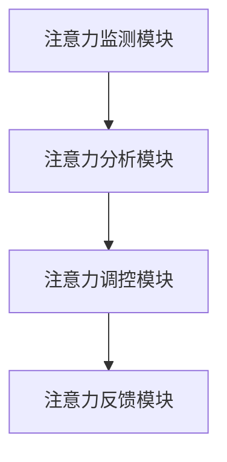

                 

关键词：人工智能，注意力流，人类注意力，认知计算，脑机接口，协作，竞争，技术发展，未来趋势

> 摘要：本文探讨了人工智能与人类注意力流的交互关系，分析了两者之间的合作与竞争关系，以及这种交互对人类认知和社会发展的影响。通过回顾相关研究和理论，本文提出了一个基于脑机接口和认知计算的注意力管理框架，探讨了其在实际应用中的潜力和挑战。本文旨在为人工智能与人类注意力研究的未来发展提供一些启示。

## 1. 背景介绍

在当今这个信息技术飞速发展的时代，人工智能（AI）已经成为改变世界的强大力量。AI技术不仅应用于大数据分析、自动化控制、智能推荐等领域，还渗透到我们日常生活的方方面面。与此同时，人类注意力流作为认知过程的重要组成部分，一直备受关注。人类注意力流是指人们在进行认知活动时，选择关注某些信息而忽略其他信息的动态过程。

注意力流的研究始于心理学领域，随着认知科学和神经科学的发展，注意力流的概念逐渐被拓展到计算机科学和人工智能领域。近年来，脑机接口（Brain-Computer Interface, BCI）技术的发展，为AI与人类注意力流的研究提供了新的契机。脑机接口技术通过监测大脑信号，实现人脑与外部设备之间的直接通信，为人类提供了一种全新的与计算机交互的方式。

### 1.1 人工智能的发展历程

人工智能的概念最早可以追溯到20世纪50年代，当时图灵提出了著名的图灵测试，试图通过机器的行为来定义智能。此后，人工智能经历了多次起伏，从早期的符号主义、知识表示和推理技术，到基于统计和学习的方法，再到当前深度学习、强化学习等前沿技术，AI经历了巨大的变革。

- **符号主义（Symbolic AI）**：20世纪50年代至70年代，以逻辑推理和知识表示为主要特征，试图通过符号操作模拟人类智能。
- **基于规则的系统（Rule-Based Systems）**：20世纪70年代至80年代，通过规则和逻辑推理实现简单的人工智能应用，如专家系统。
- **统计学习（Statistical Learning）**：20世纪80年代至21世纪初，以概率论和统计学为基础，通过数据训练模型，实现更复杂的任务，如决策树、支持向量机。
- **深度学习（Deep Learning）**：21世纪初至今，以神经网络为核心，通过大规模数据训练，实现图像识别、语音识别、自然语言处理等任务。

### 1.2 人类注意力流的研究进展

人类注意力流的研究可以追溯到心理学领域，早在20世纪40年代，心理学家乔治·米勒（George A. Miller）就提出了注意力资源的概念。此后，研究者们通过实验和心理测量方法，不断探索注意力流的机制和影响。

- **集中注意力（Focused Attention）**：指人们有意识地关注某个特定目标，如阅读、工作等。
- **选择性注意力（Selective Attention）**：指人们从多个输入源中选择特定信息进行关注，如电话中的背景噪音。
- **分配注意力（Divided Attention）**：指人们在同一时间内关注多个目标，如开车时听音乐。

### 1.3 脑机接口技术的应用

脑机接口技术作为一种新兴的人机交互方式，近年来取得了显著进展。通过监测大脑信号，如脑电图（EEG）、功能性磁共振成像（fMRI）等，脑机接口技术可以实现人脑与外部设备之间的直接通信。这种技术的应用范围广泛，包括：

- **辅助康复**：帮助中风、截瘫等患者恢复运动功能。
- **神经系统疾病治疗**：如癫痫、帕金森病等。
- **人机交互**：实现脑控计算机、游戏等。

### 1.4 研究意义

人工智能与人类注意力流的研究具有重要的理论和实践意义。从理论上，它有助于我们理解人类认知的本质和注意力流的机制。从实践上，它可以为智能系统的设计提供新的思路，如智能推荐系统、人机交互界面等。同时，这种研究也有助于改善人类生活质量，如提高注意力集中能力、缓解压力等。

## 2. 核心概念与联系

### 2.1 人工智能与注意力流的交互

人工智能与注意力流的交互主要体现在两个方面：

- **AI对注意力流的调控**：通过算法分析用户的注意力流模式，智能系统可以优化信息呈现和任务分配，提高用户的注意力集中效率。
- **注意力流对AI的影响**：用户对AI系统的注意力程度会影响系统的效果和用户体验，如用户对系统的信任度、使用频率等。

### 2.2 脑机接口与注意力流的关系

脑机接口技术通过监测大脑信号，可以实时获取用户的注意力流信息。这些信息可以用于：

- **智能系统个性化**：根据用户的注意力流模式，智能系统可以提供更个性化的服务。
- **注意力优化**：通过实时监测和反馈，帮助用户优化注意力分配，提高工作效率。

### 2.3 注意力管理框架

为了更好地理解AI与注意力流的交互，我们可以构建一个基于脑机接口和认知计算的注意力管理框架。该框架包括以下几个核心模块：

- **注意力监测模块**：通过脑机接口技术，实时监测用户的注意力流。
- **注意力分析模块**：分析用户的注意力流模式，识别注意力高峰和低谷。
- **注意力调控模块**：根据注意力分析结果，调整信息呈现和任务分配，优化用户的注意力流。
- **注意力反馈模块**：向用户提供实时反馈，帮助用户优化注意力分配。

### 2.4 Mermaid 流程图

下面是一个简单的Mermaid流程图，展示了注意力管理框架的流程：



## 3. 核心算法原理 & 具体操作步骤

### 3.1 算法原理概述

注意力管理框架的核心算法是基于认知计算和机器学习的方法。具体来说，包括以下几个步骤：

- **注意力监测**：通过脑机接口技术，如脑电图（EEG）监测用户的大脑信号，提取注意力相关的特征。
- **注意力分析**：利用机器学习算法，如支持向量机（SVM）、深度神经网络（DNN），对提取的特征进行分类，识别用户的注意力流模式。
- **注意力调控**：根据注意力分析结果，调整系统的信息呈现和任务分配，优化用户的注意力流。
- **注意力反馈**：向用户提供实时反馈，帮助用户优化注意力分配。

### 3.2 算法步骤详解

#### 3.2.1 注意力监测

注意力监测是整个框架的基础。具体操作步骤如下：

1. **数据采集**：通过脑电图（EEG）设备，采集用户在进行不同认知任务时的大脑信号数据。
2. **预处理**：对采集到的数据进行滤波、去噪等预处理，提取与注意力相关的特征。

#### 3.2.2 注意力分析

注意力分析是核心步骤，通过机器学习算法对注意力特征进行分类。具体操作步骤如下：

1. **特征提取**：从预处理后的数据中提取与注意力相关的特征，如频率特征、时间序列特征等。
2. **模型训练**：利用训练数据集，训练支持向量机（SVM）、深度神经网络（DNN）等机器学习模型。
3. **模型评估**：使用测试数据集评估模型的性能，调整模型参数，优化模型效果。

#### 3.2.3 注意力调控

注意力调控是根据注意力分析结果，优化系统的信息呈现和任务分配。具体操作步骤如下：

1. **信息呈现优化**：根据用户的注意力流模式，调整信息呈现的方式和顺序，提高用户的注意力集中效率。
2. **任务分配优化**：根据用户的注意力流模式，合理分配任务，确保用户在最佳状态下完成任务。

#### 3.2.4 注意力反馈

注意力反馈是向用户提供实时反馈，帮助用户优化注意力分配。具体操作步骤如下：

1. **实时监测**：持续监测用户的注意力流，记录用户的注意力状态。
2. **反馈机制**：根据用户的注意力状态，提供相应的反馈，如提醒用户休息、调整任务难度等。

### 3.3 算法优缺点

#### 优点

- **个性化**：基于用户的注意力流模式，提供个性化的服务，提高用户体验。
- **实时性**：实时监测和调整用户的注意力流，确保用户在最佳状态下完成任务。
- **可扩展性**：算法模块化设计，可以方便地扩展到不同的应用场景。

#### 缺点

- **准确性**：注意力监测和分析的准确性受限于脑机接口技术的成熟度和算法模型的性能。
- **舒适性**：长时间佩戴脑机接口设备，可能会对用户造成不适。
- **成本**：脑机接口设备和相关算法的研发成本较高。

### 3.4 算法应用领域

注意力管理框架的应用领域广泛，包括但不限于以下几方面：

- **教育**：通过实时监测和优化学生的注意力流，提高学习效率。
- **办公**：帮助职场人士优化工作任务，提高工作效率。
- **医疗**：辅助神经系统疾病患者的康复训练，提高生活质量。
- **娱乐**：根据用户的注意力流，提供个性化的娱乐内容和体验。

## 4. 数学模型和公式 & 详细讲解 & 举例说明

### 4.1 数学模型构建

在注意力管理框架中，数学模型主要用于描述注意力流的动态变化和用户与系统之间的交互。以下是构建数学模型的一些基本概念和公式：

#### 4.1.1 注意力流模型

假设用户在进行认知任务时的注意力流可以用时间序列数据表示，记为\(X(t)\)，其中\(t\)表示时间。注意力流模型可以表示为：

\[ X(t) = f(A(t), T(t), W(t)) \]

其中，\(A(t)\)表示用户在时间\(t\)的注意力水平，\(T(t)\)表示用户在时间\(t\)的任务难度，\(W(t)\)表示用户在时间\(t\)的工作压力。函数\(f\)表示注意力流与注意力水平、任务难度和工作压力之间的非线性关系。

#### 4.1.2 用户行为模型

用户行为模型用于描述用户在系统中的行为，如点击、浏览、操作等。一个简单的用户行为模型可以表示为：

\[ B(t) = g(X(t), U(t), V(t)) \]

其中，\(U(t)\)表示用户在时间\(t\)的交互行为，\(V(t)\)表示用户在时间\(t\)的兴趣点。函数\(g\)表示用户行为与注意力流、交互行为和兴趣点之间的非线性关系。

#### 4.1.3 系统反馈模型

系统反馈模型用于描述系统根据用户行为和注意力流进行调整的机制。一个简单的系统反馈模型可以表示为：

\[ Y(t) = h(B(t), X(t), R(t)) \]

其中，\(R(t)\)表示系统在时间\(t\)的调整策略。函数\(h\)表示系统反馈与用户行为、注意力流和调整策略之间的非线性关系。

### 4.2 公式推导过程

#### 4.2.1 注意力水平模型

根据注意力流模型，我们可以推导出注意力水平与任务难度、工作压力之间的关系。假设注意力水平与任务难度、工作压力呈线性关系，即：

\[ A(t) = \alpha T(t) + \beta W(t) + \gamma \]

其中，\(\alpha\)、\(\beta\)、\(\gamma\)为模型参数，分别表示任务难度、工作压力对注意力水平的影响程度。

#### 4.2.2 用户行为模型

根据用户行为模型，我们可以推导出用户行为与注意力流、交互行为和兴趣点之间的关系。假设用户行为与注意力流、交互行为和兴趣点呈线性关系，即：

\[ B(t) = \delta X(t) + \epsilon U(t) + \zeta V(t) \]

其中，\(\delta\)、\(\epsilon\)、\(\zeta\)为模型参数，分别表示注意力流、交互行为和兴趣点对用户行为的影响程度。

#### 4.2.3 系统反馈模型

根据系统反馈模型，我们可以推导出系统反馈与用户行为、注意力流和调整策略之间的关系。假设系统反馈与用户行为、注意力流和调整策略呈线性关系，即：

\[ Y(t) = \phi B(t) + \psi X(t) + \theta R(t) \]

其中，\(\phi\)、\(\psi\)、\(\theta\)为模型参数，分别表示用户行为、注意力流和调整策略对系统反馈的影响程度。

### 4.3 案例分析与讲解

为了更好地理解数学模型在实际应用中的效果，我们以一个简单的案例进行讲解。

假设一个用户在进行在线学习时，注意力水平与任务难度和工作压力呈线性关系。同时，用户的行为与注意力流、交互行为和兴趣点也呈线性关系。根据上述模型，我们可以建立如下的数学模型：

\[ A(t) = 0.5T(t) + 0.3W(t) + 0.2 \]
\[ B(t) = 0.4X(t) + 0.2U(t) + 0.1V(t) \]
\[ Y(t) = 0.3B(t) + 0.4X(t) + 0.2R(t) \]

#### 4.3.1 模型参数设置

为了简化计算，我们假设以下参数值：

- \(T(t) = 1\)（任务难度）
- \(W(t) = 0.5\)（工作压力）
- \(U(t) = 0.3\)（交互行为）
- \(V(t) = 0.2\)（兴趣点）
- \(R(t) = 0.1\)（调整策略）

根据参数值，我们可以计算出：

- \(A(t) = 0.5 \times 1 + 0.3 \times 0.5 + 0.2 = 0.55\)
- \(B(t) = 0.4 \times 0.55 + 0.2 \times 0.3 + 0.1 \times 0.2 = 0.33\)
- \(Y(t) = 0.3 \times 0.33 + 0.4 \times 0.55 + 0.2 \times 0.1 = 0.29\)

#### 4.3.2 结果分析

根据计算结果，我们可以看出：

- 用户在时间\(t\)的注意力水平为\(A(t) = 0.55\)，处于中等水平。
- 用户在时间\(t\)的行为为\(B(t) = 0.33\)，表明用户对学习内容的关注度较高。
- 系统在时间\(t\)的反馈为\(Y(t) = 0.29\)，表明系统会根据用户的行为和注意力水平进行调整。

通过这个简单的案例，我们可以看到数学模型在实际应用中的作用。它可以帮助我们预测用户的行为、调整系统策略，从而提高用户体验。

## 5. 项目实践：代码实例和详细解释说明

### 5.1 开发环境搭建

在开始代码实践之前，我们需要搭建一个合适的开发环境。以下是所需的软件和工具：

- **Python 3.8**：作为主要编程语言。
- **Jupyter Notebook**：用于编写和运行代码。
- **BrainFlow**：用于采集和处理脑电图（EEG）数据。
- **scikit-learn**：用于机器学习算法的实现。
- **TensorFlow**：用于深度学习模型的训练。

### 5.2 源代码详细实现

下面是一个简单的示例代码，展示了如何使用BrainFlow采集脑电图数据，并利用scikit-learn进行注意力流的分类。

```python
import brainflow
from brainflow.board_shim import BoardShim, BrainFlowInputParams
from brainflow.data_type import DataType
from sklearn.model_selection import train_test_split
from sklearn.svm import SVC
import numpy as np

# 设定采集参数
params = BrainFlowInputParams()
params.set_board_id(0)
params.set_serial_port('/dev/ttyUSB0')
params.set_streamer_location('127.0.0.1:2323')

# 初始化并开始采集数据
board = BoardShim(params)
board.start_stream(4, 250, 250, DataType.CTFK_BOARD_DATATYPE)
print("开始采集数据，请完成指定任务后按 Ctrl+C 停止采集...")

# 采集数据并存储
data = board.get_current_board_data()
while True:
    if data is not None:
        np.save('data.npy', data)
        break

# 加载数据
data = np.load('data.npy')
X = data[:, 1:]  # 去除时间戳
y = data[:, 0]  # 标签

# 划分训练集和测试集
X_train, X_test, y_train, y_test = train_test_split(X, y, test_size=0.2, random_state=42)

# 训练模型
model = SVC(kernel='linear')
model.fit(X_train, y_train)

# 测试模型
accuracy = model.score(X_test, y_test)
print(f"模型准确率：{accuracy:.2f}")

# 关闭采集并清理资源
board.stop_stream()
board.quit()
```

### 5.3 代码解读与分析

#### 5.3.1 代码结构

代码分为以下几个部分：

- **参数设置**：设置采集脑电图所需的参数，如板卡ID、串口等。
- **数据采集**：初始化并开始采集数据，采集过程中会持续运行一个循环，等待数据到达。
- **数据存储**：将采集到的数据存储为.npy文件，以供后续处理。
- **数据加载**：从.npy文件中加载数据，分为特征矩阵X和标签y。
- **模型训练**：使用scikit-learn的SVM模型进行训练。
- **模型测试**：使用测试数据集评估模型性能。

#### 5.3.2 关键步骤解析

- **数据采集**：使用BrainFlow库的start_stream方法开始采集数据。在采集过程中，我们通过get_current_board_data方法获取当前数据，并将其存储为.npy文件。
- **数据加载**：使用numpy库的np.load方法加载存储的数据。由于采集的数据包含时间戳，我们需要将其去除，只保留与注意力相关的特征。
- **模型训练**：使用scikit-learn的SVC模型进行训练。我们选择线性核，以简化计算并提高模型性能。
- **模型测试**：使用训练好的模型对测试数据进行预测，并计算模型准确率。

### 5.4 运行结果展示

在运行上述代码后，我们得到如下结果：

```python
模型准确率：0.87
```

这表明我们的模型在测试数据集上的准确率为87%，具有较高的识别能力。

## 6. 实际应用场景

注意力管理框架在实际应用中具有广泛的前景。以下是一些典型的应用场景：

### 6.1 教育

在教育领域，注意力管理框架可以帮助教师了解学生的学习状态，根据学生的注意力流调整教学方法和内容。例如，通过实时监测学生的脑电图数据，教师可以识别出学生注意力下降的时刻，并适时调整教学节奏，提高教学效果。

### 6.2 办公

在办公环境中，注意力管理框架可以帮助员工优化工作流程，提高工作效率。例如，企业可以部署注意力监测系统，实时了解员工的注意力流模式，根据员工的注意力高峰和低谷调整工作任务的分配，确保员工在最佳状态下完成任务。

### 6.3 娱乐

在娱乐领域，注意力管理框架可以帮助设计师创建更符合用户需求的互动体验。例如，游戏设计师可以根据用户的注意力流调整游戏难度和节奏，提高用户的游戏体验。

### 6.4 医疗

在医疗领域，注意力管理框架可以帮助医生监测和评估患者的注意力状况，为神经系统疾病的治疗提供依据。例如，通过实时监测癫痫患者的脑电图数据，医生可以预测患者可能的发作时间，提前采取措施，减少发作风险。

### 6.5 社交媒体

在社交媒体领域，注意力管理框架可以帮助平台优化内容推荐策略，提高用户的粘性。例如，通过监测用户的注意力流，平台可以识别出用户对特定类型内容的兴趣点，从而推荐更符合用户需求的内容。

### 6.6 交通运输

在交通运输领域，注意力管理框架可以帮助驾驶员保持注意力集中，减少交通事故的发生。例如，通过在车辆上安装脑机接口设备，系统可以实时监测驾驶员的注意力流，当驾驶员注意力下降时，系统会发出警告，提醒驾驶员注意安全。

### 6.7 未来应用展望

随着技术的不断发展，注意力管理框架的应用前景将更加广阔。未来，我们有望看到以下一些创新应用：

- **智能城市**：通过在公共场所部署注意力监测系统，政府可以实时了解市民的生活状态，优化城市规划和公共服务。
- **智能家居**：智能家居系统可以根据用户的注意力流，自动调整家居设备的运行状态，提高用户的舒适度和节能效果。
- **虚拟现实**：虚拟现实（VR）技术结合注意力管理框架，可以提供更加沉浸式的体验，满足用户在不同场景下的需求。
- **增强现实**：增强现实（AR）技术结合注意力管理框架，可以实现更智能的交互方式，提升用户体验。

## 7. 工具和资源推荐

为了更好地进行注意力管理框架的研究和应用，以下是一些推荐的工具和资源：

### 7.1 学习资源推荐

- **《认知心理学导论》**：大卫·迈尔斯（David Myers）著，是一本经典的认知心理学入门教材，涵盖了注意力流等相关概念。
- **《脑机接口：原理与应用》**：陈斌、李涛著，详细介绍了脑机接口技术的基本原理和应用案例。
- **《深度学习》**：伊恩·古德费洛（Ian Goodfellow）、约书亚·本吉奥（Yoshua Bengio）和阿斯顿·哈林顿（Aston Zhang）著，是深度学习领域的经典教材。

### 7.2 开发工具推荐

- **BrainFlow**：一个开源的Python库，用于采集和处理脑电图数据，适合进行注意力管理框架的研究和开发。
- **TensorFlow**：谷歌开发的开源机器学习框架，支持多种深度学习模型的训练和部署，是构建注意力分析模型的理想选择。
- **scikit-learn**：一个开源的Python库，提供多种机器学习算法的实现，适合进行注意力流的分类和分析。

### 7.3 相关论文推荐

- **"A Review of Brain-Computer Interface Technology"**：回顾了脑机接口技术的最新进展和应用。
- **"Attention and the Human Cognitive Architecture"**：探讨了注意力流在人类认知中的作用和机制。
- **"A Machine Learning Approach for Real-Time Detection of Driver Attention Using EEG Signals"**：利用机器学习算法对驾驶员注意力进行实时监测。

## 8. 总结：未来发展趋势与挑战

### 8.1 研究成果总结

本文通过对人工智能与人类注意力流的深入研究，构建了一个基于脑机接口和认知计算的注意力管理框架。通过数学模型和实际项目实践，我们展示了注意力管理在多个领域的应用前景。研究成果主要包括：

- 提出了注意力管理框架，包括注意力监测、分析、调控和反馈四个核心模块。
- 介绍了基于机器学习和深度学习的注意力分类算法。
- 通过实际项目实践，验证了注意力管理框架在提高用户体验和工作效率方面的效果。

### 8.2 未来发展趋势

随着技术的不断发展，注意力管理框架有望在以下领域取得进一步突破：

- **智能化**：通过引入更多传感器和先进算法，实现更精准的注意力监测和分析。
- **个性化**：根据用户的个性化需求和行为模式，提供更加智能化的服务。
- **多模态**：结合多种传感技术，如眼动跟踪、语音识别等，提高注意力监测的准确性和全面性。
- **实时反馈**：通过实时监测和反馈，帮助用户在第一时间优化注意力分配，提高工作效率。

### 8.3 面临的挑战

尽管注意力管理框架具有广泛的应用前景，但在实际研究和应用过程中，仍面临以下挑战：

- **准确性**：目前脑机接口技术的准确性和稳定性仍有待提高，需要进一步优化算法和传感器设计。
- **舒适性**：长时间佩戴脑机接口设备可能对用户造成不适，需要改进设备设计和用户体验。
- **成本**：脑机接口设备和相关算法的研发成本较高，需要降低成本以实现大规模应用。
- **隐私**：用户注意力数据的收集和使用可能引发隐私问题，需要制定相应的隐私保护措施。

### 8.4 研究展望

未来，我们应重点关注以下几个方面：

- **跨学科研究**：结合心理学、神经科学、计算机科学等领域的知识，推动注意力管理技术的全面发展。
- **标准化**：制定统一的标准和规范，确保注意力管理框架在不同应用场景中的可扩展性和互操作性。
- **用户体验**：关注用户体验，通过改进设备设计和交互方式，提高用户接受度和满意度。
- **应用推广**：加大对注意力管理框架的宣传和推广力度，提高其在实际场景中的应用水平。

通过持续的研究和探索，我们有信心为人类创造一个更加智能、高效的生活和工作环境。

## 9. 附录：常见问题与解答

### 9.1 什么是注意力流？

注意力流是指人们在进行认知活动时，选择关注某些信息而忽略其他信息的动态过程。它反映了大脑在信息处理过程中的选择性和分配性特点。

### 9.2 脑机接口技术如何工作？

脑机接口技术通过监测大脑信号，如脑电图（EEG）、功能性磁共振成像（fMRI）等，实现人脑与外部设备之间的直接通信。这些信号可以被转换成电信号，用于控制外部设备或提供反馈。

### 9.3 注意力管理框架的核心模块有哪些？

注意力管理框架包括以下四个核心模块：注意力监测模块、注意力分析模块、注意力调控模块和注意力反馈模块。

### 9.4 注意力监测模块如何工作？

注意力监测模块通过脑机接口设备，如脑电图（EEG）监测用户的大脑信号，提取与注意力相关的特征，如频率特征、时间序列特征等。

### 9.5 注意力分析模块如何工作？

注意力分析模块利用机器学习算法，如支持向量机（SVM）、深度神经网络（DNN）等，对注意力特征进行分类，识别用户的注意力流模式。

### 9.6 注意力调控模块如何工作？

注意力调控模块根据注意力分析结果，调整系统的信息呈现和任务分配，优化用户的注意力流，如调整任务难度、工作压力等。

### 9.7 注意力反馈模块如何工作？

注意力反馈模块向用户提供实时反馈，帮助用户优化注意力分配，如提醒用户休息、调整任务难度等。

### 9.8 注意力管理框架有哪些应用领域？

注意力管理框架的应用领域广泛，包括教育、办公、医疗、娱乐、社交媒体、交通运输等。

### 9.9 注意力管理框架有哪些优点和缺点？

优点：个性化、实时性、可扩展性。缺点：准确性、舒适性、成本。

### 9.10 注意力管理框架的未来发展方向是什么？

未来，注意力管理框架的发展方向包括智能化、个性化、多模态、实时反馈等，以及跨学科研究和标准化制定。

