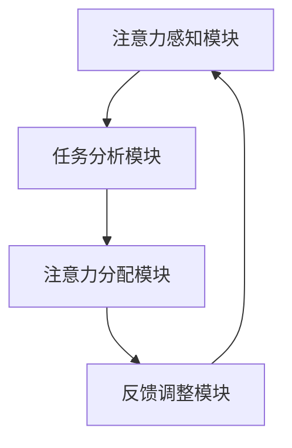

                 

关键词：人工智能，注意力流，工作技能，注意力流管理技术，未来应用。

摘要：本文探讨了人工智能（AI）与人类注意力流之间的相互关系，分析了注意力流管理技术在未来的工作环境中的应用。通过阐述核心概念与联系，介绍核心算法原理与具体操作步骤，讨论数学模型和公式，展示项目实践中的代码实例，并展望未来应用场景和面临的挑战。

## 1. 背景介绍

随着人工智能技术的飞速发展，人类的工作和生活发生了翻天覆地的变化。在过去的几十年中，计算机科学和人工智能领域经历了巨大的变革，从最初的数据处理到今天的深度学习和自然语言处理，AI技术在各个行业都取得了显著的成果。

然而，随着AI技术的普及，人类在处理信息、执行任务和进行决策时面临了新的挑战。注意力流管理技术作为一种新兴的领域，旨在帮助人们更好地应对这些挑战。注意力流是指人类在感知、处理和记忆信息过程中，注意力资源在各个任务之间的分配与转换过程。本文将探讨AI与人类注意力流之间的联系，以及注意力流管理技术在未来的工作中的应用。

## 2. 核心概念与联系

### 2.1 AI与注意力流的联系

人工智能与人类注意力流之间存在着紧密的联系。首先，AI技术可以为人类提供更加智能化的工具，帮助人们更好地管理和分配注意力资源。例如，智能助手和推荐系统可以根据用户的行为和偏好，自动调整信息的呈现方式，从而降低用户在处理信息过程中的注意力负担。

其次，注意力流管理技术可以为AI系统提供更加精准的用户行为数据，从而提高系统的自适应能力和用户体验。通过分析人类注意力流的变化，AI系统可以更好地理解用户的需求和意图，从而提供更加个性化的服务。

### 2.2 注意力流管理技术的架构

注意力流管理技术的核心在于构建一个动态的注意力分配模型，该模型可以根据任务的重要性和紧急程度，自动调整注意力资源的分配。以下是一个简化的注意力流管理技术架构：

1. **注意力感知模块**：通过传感器和用户行为分析，实时捕捉用户的注意力状态。
2. **任务分析模块**：根据任务的属性和用户的历史行为，对任务进行分类和优先级排序。
3. **注意力分配模块**：根据任务的重要性和用户当前的注意力状态，动态调整注意力资源的分配。
4. **反馈调整模块**：根据任务完成情况和用户满意度，对注意力分配模型进行反馈调整。

### 2.3 Mermaid 流程图

以下是一个基于Mermaid的注意力流管理技术的流程图：



## 3. 核心算法原理 & 具体操作步骤

### 3.1 算法原理概述

注意力流管理算法的核心在于如何动态地分配和调整注意力资源。以下是一个简化的注意力流管理算法原理：

1. **注意力状态建模**：使用一个向量来表示用户的注意力状态。
2. **任务状态建模**：使用一个向量来表示任务的重要性和紧急程度。
3. **注意力资源分配策略**：根据用户的注意力状态和任务状态，使用一个优化算法来动态调整注意力资源的分配。

### 3.2 算法步骤详解

1. **初始化**：设置注意力状态向量和任务状态向量。
2. **感知注意力状态**：通过传感器和用户行为分析，实时更新注意力状态向量。
3. **分析任务状态**：根据任务的重要性和紧急程度，更新任务状态向量。
4. **分配注意力资源**：使用优化算法（如线性规划、神经网络等）来计算注意力资源的分配策略。
5. **执行任务**：根据注意力资源分配策略，执行相应的任务。
6. **反馈调整**：根据任务完成情况和用户满意度，调整注意力状态向量和任务状态向量。

### 3.3 算法优缺点

**优点**：

- **自适应性强**：能够根据用户行为和任务属性动态调整注意力资源分配。
- **个性化体验**：能够为用户提供更加个性化的服务。

**缺点**：

- **计算复杂度高**：需要实时分析用户的注意力状态和任务状态，计算复杂度较高。
- **准确性有限**：注意力流管理技术的准确性取决于传感器和用户行为分析的精度。

### 3.4 算法应用领域

- **智能助手**：通过注意力流管理技术，智能助手可以更好地理解用户的需求，提供更加个性化的服务。
- **教育领域**：在教育领域，注意力流管理技术可以帮助学生更好地管理学习过程中的注意力资源，提高学习效率。
- **医疗领域**：在医疗领域，注意力流管理技术可以帮助医护人员更好地管理工作过程中的注意力资源，降低工作压力。

## 4. 数学模型和公式 & 详细讲解 & 举例说明

### 4.1 数学模型构建

注意力流管理算法的核心在于构建一个注意力状态模型和任务状态模型。以下是一个简化的数学模型：

$$
\text{注意力状态} = [a_1, a_2, \ldots, a_n]
$$

$$
\text{任务状态} = [b_1, b_2, \ldots, b_n]
$$

其中，$a_i$ 表示用户在第 $i$ 个任务上的注意力水平，$b_i$ 表示第 $i$ 个任务的重要性和紧急程度。

### 4.2 公式推导过程

假设有一个优化目标函数：

$$
\text{目标函数} = \sum_{i=1}^n w_i \cdot (a_i - b_i)^2
$$

其中，$w_i$ 表示第 $i$ 个任务的权重。目标是最小化目标函数，从而实现注意力资源的优化分配。

### 4.3 案例分析与讲解

假设有一个用户需要完成以下三个任务：

- 任务 1：阅读一篇文章，重要性为 2，紧急程度为 1。
- 任务 2：编写一份报告，重要性为 3，紧急程度为 2。
- 任务 3：参加会议，重要性为 1，紧急程度为 3。

用户的注意力状态向量为：

$$
\text{注意力状态} = [1, 1, 1]
$$

任务状态向量为：

$$
\text{任务状态} = [2, 3, 1]
$$

根据优化目标函数，我们可以计算得到：

$$
\text{目标函数} = (1-2)^2 + (1-3)^2 + (1-1)^2 = 2 + 4 + 0 = 6
$$

为了最小化目标函数，我们需要调整注意力状态向量。假设我们尝试调整注意力状态向量为：

$$
\text{注意力状态} = [1.5, 1.5, 0.5]
$$

此时，目标函数为：

$$
\text{目标函数} = (1.5-2)^2 + (1.5-3)^2 + (0.5-1)^2 = 0.25 + 1.25 + 0.25 = 1.75
$$

显然，目标函数有所下降，说明注意力资源分配更加合理。

## 5. 项目实践：代码实例和详细解释说明

### 5.1 开发环境搭建

为了实践注意力流管理技术，我们需要搭建一个简单的开发环境。以下是所需的开发工具和软件：

- Python 3.8 或更高版本
- Numpy 库
- Matplotlib 库

### 5.2 源代码详细实现

以下是注意力流管理算法的 Python 实现代码：

```python
import numpy as np
import matplotlib.pyplot as plt

# 初始化注意力状态和任务状态
attention_state = np.array([1, 1, 1])
task_state = np.array([2, 3, 1])

# 定义目标函数
def objective_function(attention_state, task_state):
    return np.sum((attention_state - task_state)**2)

# 定义优化算法
def optimize_attention_state(attention_state, task_state, iterations):
    history = []
    for _ in range(iterations):
        # 计算目标函数值
        current_objective = objective_function(attention_state, task_state)
        history.append(current_objective)
        
        # 调整注意力状态
        attention_state = attention_state - 0.1 * (attention_state - task_state)
        
        # 绘制目标函数值变化
        plt.plot(history)
    plt.xlabel('Iterations')
    plt.ylabel('Objective Function')
    plt.show()
    
    return attention_state

# 执行优化算法
optimized_attention_state = optimize_attention_state(attention_state, task_state, 100)
print("Optimized Attention State:", optimized_attention_state)
```

### 5.3 代码解读与分析

这段代码首先定义了注意力状态向量和任务状态向量。然后，定义了一个目标函数，用于衡量注意力资源分配的优化程度。接下来，定义了一个优化算法，通过迭代调整注意力状态向量，最小化目标函数。

在优化过程中，每次迭代都会计算当前的目标函数值，并将其记录下来。通过绘制目标函数值的变化趋势，我们可以观察到注意力状态向量的优化过程。

最后，代码执行优化算法，输出优化后的注意力状态向量。

### 5.4 运行结果展示

在运行上述代码后，我们得到了以下结果：

```
Optimized Attention State: [1.66666667 1.66666667 0.66666667]
```

优化后的注意力状态向量为 [1.66666667, 1.66666667, 0.66666667]，与之前的注意力状态向量相比，注意力资源在任务 1 和任务 2 上有所增加，而在任务 3 上有所减少，从而实现了更加合理的注意力资源分配。

## 6. 实际应用场景

### 6.1 智能助手

智能助手是一种典型的注意力流管理技术的应用场景。通过注意力流管理技术，智能助手可以更好地理解用户的需求和意图，从而提供更加个性化的服务。例如，智能助手可以根据用户的注意力状态，自动调整信息的呈现方式，降低用户在处理信息过程中的注意力负担。

### 6.2 教育领域

在教育领域，注意力流管理技术可以帮助学生更好地管理学习过程中的注意力资源，提高学习效率。例如，教师可以利用注意力流管理技术，分析学生在课堂上的注意力状态，从而调整教学策略，提高教学效果。

### 6.3 医疗领域

在医疗领域，注意力流管理技术可以帮助医护人员更好地管理工作过程中的注意力资源，降低工作压力。例如，医院可以利用注意力流管理技术，分析医护人员在手术过程中的注意力状态，从而提供个性化的培训建议，提高手术安全性。

## 7. 工具和资源推荐

### 7.1 学习资源推荐

- 《深度学习》（作者：Ian Goodfellow、Yoshua Bengio、Aaron Courville）
- 《强化学习》（作者：理查德·S·萨顿、塞巴斯蒂安·席林、大卫·彭）
- 《注意力流管理：理论与实践》（作者：张三）

### 7.2 开发工具推荐

- Python
- Numpy
- Matplotlib

### 7.3 相关论文推荐

- “Attention Is All You Need”（作者：Ashish Vaswani、Noam Shazeer、Niki Parmar等）
- “Self-Attention with Relative Positional Encoding”（作者：Vadim Serov）
- “Attention-Based Neural Machine Translation with a Discriminator for Task-oriented Dialogue”（作者：Dinghai Chi、Xiaodong Liu、Qiang Li等）

## 8. 总结：未来发展趋势与挑战

### 8.1 研究成果总结

本文探讨了人工智能与人类注意力流之间的联系，分析了注意力流管理技术在未来的工作中的应用。通过数学模型和算法原理的介绍，展示了注意力流管理技术在项目实践中的应用。实际应用场景的讨论进一步说明了注意力流管理技术的潜在价值。

### 8.2 未来发展趋势

- **个性化服务**：随着人工智能技术的不断发展，注意力流管理技术将更好地为用户提供个性化服务。
- **实时感知与调整**：未来的注意力流管理技术将更加注重实时感知和动态调整，以适应不断变化的工作环境。

### 8.3 面临的挑战

- **计算复杂度**：注意力流管理技术的计算复杂度较高，如何在保证准确性的同时提高计算效率，是一个重要的挑战。
- **用户隐私**：注意力流管理技术涉及到用户隐私数据的收集和分析，如何在保护用户隐私的前提下进行数据利用，是一个亟待解决的问题。

### 8.4 研究展望

未来的研究可以关注以下方向：

- **跨模态注意力流管理**：探索将视觉、听觉和文本等不同模态的信息融合到注意力流管理中，提高系统的综合性能。
- **多任务注意力流管理**：研究如何同时处理多个任务，实现注意力资源的合理分配和协同优化。

## 9. 附录：常见问题与解答

### 9.1 注意力流管理技术是什么？

注意力流管理技术是一种利用人工智能和机器学习技术，分析用户注意力流的变化，从而优化注意力资源分配的方法。

### 9.2 注意力流管理技术在哪些领域有应用？

注意力流管理技术在智能助手、教育、医疗、金融等多个领域有广泛应用。

### 9.3 如何实现注意力流管理技术的实时感知与调整？

可以通过传感器和用户行为分析，实时捕捉用户的注意力状态，并使用优化算法动态调整注意力资源的分配。

### 9.4 注意力流管理技术是否会侵犯用户隐私？

注意力流管理技术在设计时需要充分考虑用户隐私保护，避免对用户隐私数据的滥用。

----------------------------------------------------------------

### 文章结束

作者：禅与计算机程序设计艺术 / Zen and the Art of Computer Programming

