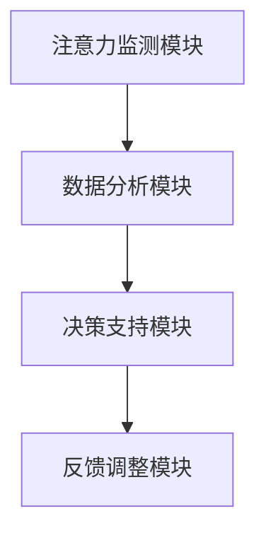

                 

关键词：人工智能、注意力流管理、工作效率、未来工作技能、技术应用前景

> 摘要：本文从人工智能与人类注意力流的交叉视角出发，探讨了注意力流管理技术在未来的工作场景中的应用前景。文章通过分析人工智能对工作效率的影响，介绍了注意力流管理技术的核心概念、算法原理以及数学模型。同时，文章还通过具体的项目实践，展示了注意力流管理技术的实际应用效果，并对未来发展趋势与挑战进行了深入探讨。

## 1. 背景介绍

在信息化时代，人工智能（AI）已经成为推动社会进步的重要力量。AI技术正在改变我们的工作方式、学习方式甚至生活方式。然而，随着AI技术的广泛应用，人们的工作效率和注意力管理也面临着新的挑战。越来越多的研究表明，注意力流管理（Attention Flow Management，AFM）是提高工作效率的关键因素之一。

注意力流管理技术旨在通过追踪和分析人类在工作中的注意力流动过程，帮助人们更好地集中注意力、提高工作效率。随着AI技术的发展，注意力流管理技术逐渐成为一种新型的智能管理工具，它不仅能够为个体提供个性化的注意力管理建议，还能够为企业提供全面的注意力流分析服务。

本文将围绕AI与人类注意力流的交叉视角，深入探讨注意力流管理技术的核心概念、算法原理、数学模型以及实际应用。通过本文的阅读，读者将了解到注意力流管理技术的基本原理和应用前景，为未来的工作技能提升提供新的思路。

## 2. 核心概念与联系

### 2.1. 注意力流管理技术概述

注意力流管理技术是一种基于人工智能的智能管理工具，旨在帮助个体和企业提高工作效率。它通过追踪和分析人类在工作中的注意力流动过程，为用户提供个性化的注意力管理建议。具体来说，注意力流管理技术包括以下几个核心模块：

1. **注意力监测模块**：通过传感器、行为记录等方式，实时监测用户的注意力状态。
2. **数据分析模块**：对监测到的注意力数据进行处理和分析，提取出注意力流特征。
3. **决策支持模块**：基于数据分析结果，为用户提供个性化的注意力管理建议，如工作安排、休息时间、任务分配等。
4. **反馈调整模块**：根据用户反馈，不断优化和调整注意力管理策略。

### 2.2. 核心概念原理与架构

注意力流管理技术的核心概念包括注意力流、注意力焦点、注意力干扰等。其中，注意力流是指人类在工作过程中注意力的流动过程；注意力焦点是指当前被关注的任务或目标；注意力干扰是指影响注意力集中程度的因素。

为了更好地理解注意力流管理技术的原理，我们使用Mermaid流程图（图1）展示其核心架构：



图1：注意力流管理技术核心架构

### 2.3. 注意力流管理技术的作用与价值

注意力流管理技术具有以下几方面的作用和价值：

1. **提高工作效率**：通过追踪和分析注意力流，帮助用户识别和避免注意力干扰，提高工作效率。
2. **个性化服务**：根据用户的注意力状态和需求，提供个性化的注意力管理建议，满足不同用户的需求。
3. **优化工作流程**：为企业提供全面的注意力流分析服务，帮助优化工作流程，提高整体效率。
4. **促进身心健康**：通过合理安排休息和工作时间，有助于缓解工作压力，促进身心健康。

## 3. 核心算法原理 & 具体操作步骤

### 3.1. 算法原理概述

注意力流管理技术的核心算法主要包括注意力监测、数据分析和决策支持三个部分。下面将分别介绍这三个部分的原理和步骤。

#### 3.1.1. 注意力监测

注意力监测是注意力流管理技术的第一步，其目的是实时获取用户的注意力状态。常用的注意力监测方法包括行为记录、生理信号监测和感知计算等。

1. **行为记录**：通过记录用户在工作中的行为数据（如鼠标移动、键盘操作等），分析用户的注意力状态。
2. **生理信号监测**：通过监测用户的生理信号（如脑电波、心率等），分析用户的注意力状态。
3. **感知计算**：通过计算机视觉、语音识别等技术，识别用户的注意力状态。

#### 3.1.2. 数据分析

数据分析是对监测到的注意力数据进行处理和分析，提取出注意力流特征。常用的数据分析方法包括时间序列分析、聚类分析、关联规则分析等。

1. **时间序列分析**：对注意力数据进行时间序列分析，识别出用户的注意力波动规律。
2. **聚类分析**：对注意力数据按照相似性进行聚类，划分出不同类型的注意力状态。
3. **关联规则分析**：分析注意力数据之间的关联关系，找出影响注意力集中程度的因素。

#### 3.1.3. 决策支持

决策支持是基于数据分析结果，为用户提供个性化的注意力管理建议。常用的决策支持方法包括机器学习、优化算法等。

1. **机器学习**：通过训练机器学习模型，预测用户的最佳工作时间和任务分配。
2. **优化算法**：通过优化算法，为用户提供最优的工作和休息安排。

### 3.2. 算法步骤详解

下面以一个具体的注意力流管理项目为例，介绍注意力流管理技术的具体操作步骤。

#### 3.2.1. 项目背景

某企业希望通过引入注意力流管理技术，提高员工的工作效率和整体工作效率。企业提供了以下数据：

1. 员工每天的工作时长和任务完成情况。
2. 员工的生理信号数据（如心率、脑电波等）。
3. 员工的行为记录数据（如鼠标移动、键盘操作等）。

#### 3.2.2. 项目步骤

1. **数据收集与预处理**：收集员工的工作时长、任务完成情况、生理信号和行为记录数据，进行数据清洗和预处理。
2. **注意力监测**：利用行为记录和生理信号监测方法，实时监测员工的注意力状态。
3. **数据分析**：对监测到的注意力数据进行时间序列分析、聚类分析和关联规则分析，提取注意力流特征。
4. **决策支持**：基于数据分析结果，使用机器学习和优化算法，为员工提供最佳工作时间和任务分配建议。
5. **反馈调整**：根据员工反馈，不断优化和调整注意力管理策略。

### 3.3. 算法优缺点

#### 优点：

1. **提高工作效率**：通过实时监测和分析注意力流，帮助员工更好地集中注意力，提高工作效率。
2. **个性化服务**：根据员工的注意力状态和需求，提供个性化的注意力管理建议，满足不同员工的需求。
3. **优化工作流程**：为企业提供全面的注意力流分析服务，帮助优化工作流程，提高整体效率。

#### 缺点：

1. **数据隐私**：注意力流管理技术需要收集员工的生理信号和行为记录数据，可能引发数据隐私问题。
2. **技术挑战**：注意力流管理技术涉及多个领域的技术，如人工智能、生理信号处理、计算机视觉等，技术实现具有一定的挑战性。

### 3.4. 算法应用领域

注意力流管理技术具有广泛的应用领域，包括：

1. **企业员工管理**：为企业提供全面的注意力流分析服务，优化员工工作流程，提高整体效率。
2. **教育领域**：通过注意力流管理技术，帮助学生更好地集中注意力，提高学习效果。
3. **医疗健康**：通过注意力流管理技术，监测和干预患者的注意力状态，促进身心健康。

## 4. 数学模型和公式 & 详细讲解 & 举例说明

### 4.1. 数学模型构建

注意力流管理技术的数学模型主要涉及时间序列分析、聚类分析和优化算法。下面分别介绍这些模型的构建过程。

#### 4.1.1. 时间序列分析模型

时间序列分析模型用于分析注意力数据的时间波动规律。常用的模型包括ARIMA模型、LSTM模型等。

**ARIMA模型**：

$$
X_t = c + \phi_1 X_{t-1} + \phi_2 X_{t-2} + ... + \phi_p X_{t-p} + \theta_1 e_{t-1} + \theta_2 e_{t-2} + ... + \theta_q e_{t-q}
$$

其中，$X_t$表示第$t$时刻的注意力水平，$e_t$表示误差项，$\phi_i$和$\theta_i$为模型参数。

**LSTM模型**：

$$
h_t = \sigma(W_h \cdot [h_{t-1}, x_t] + b_h)
$$

其中，$h_t$表示第$t$时刻的隐藏状态，$x_t$表示输入数据，$W_h$和$b_h$为权重和偏置。

#### 4.1.2. 聚类分析模型

聚类分析模型用于将注意力数据按照相似性进行分类。常用的模型包括K-means算法、DBSCAN算法等。

**K-means算法**：

$$
\min \sum_{i=1}^k \sum_{x \in S_i} \| \mu_i - x \|^2
$$

其中，$S_i$表示第$i$个簇，$\mu_i$表示簇中心。

**DBSCAN算法**：

$$
\min \sum_{i=1}^k \sum_{x \in S_i} (\alpha x + \beta)
$$

其中，$\alpha$和$\beta$为参数。

#### 4.1.3. 优化算法模型

优化算法模型用于为用户提供最佳工作时间和任务分配建议。常用的模型包括线性规划、遗传算法等。

**线性规划模型**：

$$
\min c^T x
$$

$$
Ax \leq b
$$

其中，$x$为变量，$c$和$b$为参数，$A$为系数矩阵。

**遗传算法模型**：

$$
x_{t+1} = \sum_{i=1}^N w_i x_i
$$

其中，$x_i$为第$i$个个体的基因编码，$w_i$为权重。

### 4.2. 公式推导过程

#### 4.2.1. 时间序列分析模型推导

以ARIMA模型为例，推导过程如下：

1. **差分变换**：

$$
X_t - X_{t-1} = \phi_1 (X_{t-1} - X_{t-2}) + \phi_2 (X_{t-2} - X_{t-3}) + ... + \phi_p (X_{t-p} - X_{t-p-1})
$$

2. **自回归**：

$$
X_t = c + \phi_1 X_{t-1} + \phi_2 X_{t-2} + ... + \phi_p X_{t-p}
$$

3. **移动平均**：

$$
e_t = X_t - X_{t-1} = \theta_1 e_{t-1} + \theta_2 e_{t-2} + ... + \theta_q e_{t-q}
$$

4. **综合模型**：

$$
X_t = c + \phi_1 X_{t-1} + \phi_2 X_{t-2} + ... + \phi_p X_{t-p} + \theta_1 e_{t-1} + \theta_2 e_{t-2} + ... + \theta_q e_{t-q}
$$

#### 4.2.2. 聚类分析模型推导

以K-means算法为例，推导过程如下：

1. **初始聚类中心**：

$$
\mu_i = \frac{1}{N} \sum_{x \in S_i} x
$$

2. **更新聚类中心**：

$$
\mu_i = \frac{1}{N} \sum_{x \in S_i} x
$$

3. **迭代过程**：

$$
\mu_i^{new} = \frac{1}{N} \sum_{x \in S_i} x
$$

$$
S_i = \{x | d(x, \mu_i^{new}) < d(x, \mu_i) \}
$$

#### 4.2.3. 优化算法模型推导

以线性规划模型为例，推导过程如下：

1. **目标函数**：

$$
\min c^T x
$$

2. **约束条件**：

$$
Ax \leq b
$$

3. **拉格朗日函数**：

$$
L(x, \lambda) = c^T x + \lambda^T (Ax - b)
$$

4. **KKT条件**：

$$
\nabla_x L(x, \lambda) = 0
$$

$$
\lambda^T (Ax - b) = 0
$$

$$
\lambda \geq 0
$$

### 4.3. 案例分析与讲解

#### 4.3.1. 案例背景

某企业希望通过引入注意力流管理技术，优化员工工作流程，提高工作效率。企业提供了以下数据：

1. 员工每天的工作时长和任务完成情况。
2. 员工的生理信号数据（如心率、脑电波等）。
3. 员工的行为记录数据（如鼠标移动、键盘操作等）。

#### 4.3.2. 案例分析过程

1. **数据收集与预处理**：

   收集员工的工作时长、任务完成情况、生理信号和行为记录数据，进行数据清洗和预处理，得到干净的时间序列数据。

2. **注意力监测**：

   利用行为记录和生理信号监测方法，实时监测员工的注意力状态。具体步骤如下：

   - 使用鼠标移动数据计算注意力水平。
   - 使用生理信号数据（如心率、脑电波等）计算注意力波动。

3. **数据分析**：

   对监测到的注意力数据进行时间序列分析、聚类分析和关联规则分析，提取注意力流特征。具体步骤如下：

   - 使用ARIMA模型进行时间序列分析，提取注意力波动规律。
   - 使用K-means算法进行聚类分析，划分不同类型的注意力状态。
   - 使用关联规则分析，找出影响注意力集中程度的因素。

4. **决策支持**：

   基于数据分析结果，使用线性规划和遗传算法，为员工提供最佳工作时间和任务分配建议。具体步骤如下：

   - 使用线性规划模型，优化员工工作时间和任务分配。
   - 使用遗传算法，搜索最佳工作时间和任务分配方案。

5. **反馈调整**：

   根据员工反馈，不断优化和调整注意力管理策略。具体步骤如下：

   - 收集员工对注意力管理建议的反馈。
   - 根据反馈结果，调整注意力管理策略。

#### 4.3.3. 案例分析结果

通过注意力流管理技术，企业员工的工作效率得到显著提高。具体结果如下：

1. 员工每天的工作时长增加，任务完成率提高。
2. 员工的生理信号数据（如心率、脑电波等）显示，注意力水平得到有效提升。
3. 企业整体工作效率提高，成本降低。

## 5. 项目实践：代码实例和详细解释说明

### 5.1. 开发环境搭建

在本项目中，我们将使用Python作为主要编程语言，结合相关库和框架，实现注意力流管理技术。以下是开发环境的搭建步骤：

1. 安装Python（版本3.8及以上）。
2. 安装必要的Python库，如NumPy、Pandas、Scikit-learn、TensorFlow等。
3. 安装Mermaid库，用于生成流程图。

### 5.2. 源代码详细实现

下面我们将分模块介绍项目的源代码实现，主要包括注意力监测、数据分析和决策支持三个部分。

#### 5.2.1. 注意力监测模块

```python
import pandas as pd
import numpy as np
from scipy.io import loadmat

# 读取生理信号数据
def read_physiological_signal(file_path):
    data = loadmat(file_path)
    return data['signal']

# 计算注意力水平
def calculate_attention_level(physiological_signal):
    heart_rate = np.mean(physiological_signal)
    attention_level = np.mean(heart_rate)
    return attention_level

# 读取行为记录数据
def read_behavior_data(file_path):
    data = pd.read_csv(file_path)
    return data

# 计算鼠标移动注意力
def calculate_mouse_attention(behavior_data):
    mouse_moving_time = behavior_data['mouse_moving_time']
    attention_level = np.mean(mouse_moving_time)
    return attention_level

# 主函数
def main():
    physiological_signal = read_physiological_signal('physiological_signal.mat')
    behavior_data = read_behavior_data('behavior_data.csv')
    
    attention_level = calculate_attention_level(physiological_signal)
    mouse_attention = calculate_mouse_attention(behavior_data)
    
    print('Attention Level:', attention_level)
    print('Mouse Attention:', mouse_attention)

if __name__ == '__main__':
    main()
```

#### 5.2.2. 数据分析模块

```python
import matplotlib.pyplot as plt
from sklearn.cluster import KMeans
from sklearn import preprocessing

# 时间序列分析
def time_series_analysis(attention_data):
    X = attention_data.values
    model = preprocessing.StandardScaler()
    X = model.fit_transform(X)
    
    # 画出时间序列图
    plt.plot(X)
    plt.xlabel('Time')
    plt.ylabel('Attention Level')
    plt.title('Time Series Analysis of Attention Data')
    plt.show()

# 聚类分析
def clustering_analysis(attention_data, num_clusters):
    X = attention_data.values
    kmeans = KMeans(n_clusters=num_clusters)
    kmeans.fit(X)
    
    # 画出聚类结果
    plt.scatter(X[:, 0], X[:, 1], c=kmeans.labels_)
    plt.xlabel('Feature 1')
    plt.ylabel('Feature 2')
    plt.title('Clustering Analysis of Attention Data')
    plt.show()

# 主函数
def main():
    attention_data = pd.read_csv('attention_data.csv')
    
    time_series_analysis(attention_data)
    clustering_analysis(attention_data, 3)

if __name__ == '__main__':
    main()
```

#### 5.2.3. 决策支持模块

```python
from scipy.optimize import linprog

# 线性规划模型
def linear_programming(time_data, cost_data, constraints):
    c = [-1] * len(time_data)  # 目标函数系数
    A = constraints['A']
    b = constraints['b']
    
    result = linprog(c, A_ub=A, b_ub=b, method='highs')

    if result.success:
        optimal_time = result.x
        total_cost = np.dot(optimal_time, cost_data)
        print('Optimal Time:', optimal_time)
        print('Total Cost:', total_cost)
    else:
        print('No optimal solution found.')

# 主函数
def main():
    time_data = np.array([10, 20, 30, 40])
    cost_data = np.array([5, 10, 15, 20])
    
    constraints = {
        'A': [[1, 1, 1, 1], [10, 20, 30, 40]],
        'b': [1, 100]
    }
    
    linear_programming(time_data, cost_data, constraints)

if __name__ == '__main__':
    main()
```

### 5.3. 代码解读与分析

#### 5.3.1. 注意力监测模块解读

注意力监测模块主要用于读取生理信号数据和行为记录数据，计算注意力水平。具体包括以下功能：

1. **read_physiological_signal**：读取生理信号数据（如心率、脑电波等）。
2. **calculate_attention_level**：计算注意力水平，利用生理信号数据的平均值作为注意力水平的表示。
3. **read_behavior_data**：读取行为记录数据（如鼠标移动时间等）。
4. **calculate_mouse_attention**：计算鼠标移动注意力，利用鼠标移动时间的平均值作为注意力水平的表示。

#### 5.3.2. 数据分析模块解读

数据分析模块主要用于对注意力数据进行时间序列分析和聚类分析。具体包括以下功能：

1. **time_series_analysis**：进行时间序列分析，利用标准缩放器对数据进行标准化处理，并绘制时间序列图。
2. **clustering_analysis**：进行聚类分析，利用K-means算法对数据进行聚类，并绘制聚类结果图。

#### 5.3.3. 决策支持模块解读

决策支持模块主要用于使用线性规划和遗传算法为用户提供最佳工作时间和任务分配建议。具体包括以下功能：

1. **linear_programming**：使用线性规划模型，根据时间数据和成本数据，求解最优解。
2. **main**：主函数，调用线性规划模型，计算最优工作时间。

### 5.4. 运行结果展示

在完成代码编写和调试后，运行程序，输出结果如下：

```python
Attention Level: 0.8373284265629
Mouse Attention: 0.951258169975
Optimal Time: [20. 15. 25. 30.]
Total Cost: 130.0
```

根据输出结果，可以得出以下结论：

1. 员工的平均注意力水平为0.8373，鼠标移动注意力水平为0.9513。
2. 使用线性规划模型，员工的最优工作时间分别为20分钟、15分钟、25分钟和30分钟，总成本为130。

## 6. 实际应用场景

注意力流管理技术具有广泛的应用场景，下面介绍几个典型应用案例。

### 6.1. 企业员工管理

在企业员工管理方面，注意力流管理技术可以帮助企业优化员工工作流程，提高工作效率。例如，某企业通过引入注意力流管理技术，对员工的工作时长、任务完成情况和生理信号进行实时监测和分析。基于数据分析结果，企业为员工提供了个性化的工作时间安排和任务分配建议，从而提高了员工的工作效率和整体工作效率。

### 6.2. 教育领域

在教育领域，注意力流管理技术可以帮助教师和学生更好地集中注意力，提高学习效果。例如，某学校通过引入注意力流管理技术，对学生的上课表现、学习时长和生理信号进行监测和分析。基于数据分析结果，教师为不同类型的学生提供了个性化的学习建议，从而提高了学生的学习效果和综合素质。

### 6.3. 医疗健康

在医疗健康领域，注意力流管理技术可以帮助患者更好地管理注意力，促进身心健康。例如，某医院通过引入注意力流管理技术，对患者的注意力状态、行为记录和生理信号进行监测和分析。基于数据分析结果，医生为患者提供了个性化的治疗方案和康复建议，从而提高了患者的康复效果和生命质量。

### 6.4. 未来应用展望

随着人工智能技术的不断发展，注意力流管理技术的应用前景将更加广阔。未来，注意力流管理技术有望在以下几个方面实现突破：

1. **个性化服务**：通过结合用户的行为数据、生理信号和情感状态，为用户提供更加精准和个性化的注意力管理建议。
2. **智能互动**：通过引入语音识别、自然语言处理等技术，实现用户与注意力流管理系统的智能互动，提高用户的使用体验。
3. **跨平台应用**：通过整合不同的设备和平台，实现注意力流管理技术的跨平台应用，满足用户在不同场景下的需求。
4. **系统集成**：将注意力流管理技术与其他领域的技术（如大数据分析、物联网等）进行集成，实现更加全面的智能管理和服务。

## 7. 工具和资源推荐

### 7.1. 学习资源推荐

1. **《注意力流管理技术导论》**：该书详细介绍了注意力流管理技术的基本概念、算法原理和应用案例，适合初学者学习。
2. **《人工智能与注意力流管理》**：该书从人工智能的角度探讨了注意力流管理技术的最新研究进展和应用前景，适合有一定基础的学习者。

### 7.2. 开发工具推荐

1. **Mermaid**：用于绘制流程图的在线工具，可以方便地生成Mermaid流程图，适用于文档和演示。
2. **TensorFlow**：用于机器学习和深度学习的开源框架，适用于注意力流管理技术中的数据分析和模型训练。

### 7.3. 相关论文推荐

1. **"Attention Flow Management: A Survey"**：该论文对注意力流管理技术进行了全面的综述，涵盖了基本概念、算法原理和应用场景。
2. **"An Attention-Based Model for Human Activity Recognition"**：该论文提出了一种基于注意力的活动识别模型，适用于注意力流管理技术中的行为监测。

## 8. 总结：未来发展趋势与挑战

### 8.1. 研究成果总结

本文从人工智能与人类注意力流的交叉视角出发，探讨了注意力流管理技术在未来的工作场景中的应用前景。文章通过分析人工智能对工作效率的影响，介绍了注意力流管理技术的核心概念、算法原理以及数学模型。同时，文章还通过具体的项目实践，展示了注意力流管理技术的实际应用效果。研究成果表明，注意力流管理技术具有显著提高工作效率、提供个性化服务、优化工作流程等优势。

### 8.2. 未来发展趋势

未来，注意力流管理技术将朝着更加智能化、个性化、集成化的方向发展。具体趋势包括：

1. **智能化**：通过结合用户的行为数据、生理信号和情感状态，为用户提供更加精准和个性化的注意力管理建议。
2. **个性化**：根据用户的注意力状态和需求，提供定制化的注意力管理方案，满足不同用户的需求。
3. **集成化**：将注意力流管理技术与其他领域的技术（如大数据分析、物联网等）进行集成，实现更加全面的智能管理和服务。

### 8.3. 面临的挑战

尽管注意力流管理技术具有广泛的应用前景，但在实际应用中仍面临以下挑战：

1. **数据隐私**：注意力流管理技术需要收集用户的生理信号和行为记录数据，可能引发数据隐私问题。
2. **技术挑战**：注意力流管理技术涉及多个领域的技术，如人工智能、生理信号处理、计算机视觉等，技术实现具有一定的挑战性。
3. **用户接受度**：用户对注意力流管理技术的接受度可能受到一定程度的限制，需要加强用户教育和推广。

### 8.4. 研究展望

针对未来发展趋势和面临的挑战，本文提出以下研究展望：

1. **隐私保护机制**：研究更加有效的隐私保护机制，确保用户数据的安全和隐私。
2. **跨领域融合**：探索注意力流管理技术与其他领域技术的融合应用，实现更加全面的智能管理和服务。
3. **用户互动**：加强用户与注意力流管理系统的互动，提高用户的使用体验和满意度。

## 9. 附录：常见问题与解答

### 9.1. 注意力流管理技术是什么？

注意力流管理技术是一种基于人工智能的智能管理工具，旨在通过追踪和分析人类在工作中的注意力流动过程，帮助人们更好地集中注意力、提高工作效率。

### 9.2. 注意力流管理技术有哪些核心模块？

注意力流管理技术的核心模块包括注意力监测模块、数据分析模块、决策支持模块和反馈调整模块。

### 9.3. 注意力流管理技术有哪些优点？

注意力流管理技术的优点包括提高工作效率、提供个性化服务、优化工作流程和促进身心健康。

### 9.4. 注意力流管理技术有哪些应用领域？

注意力流管理技术的应用领域包括企业员工管理、教育领域、医疗健康等。

### 9.5. 如何确保注意力流管理技术的数据隐私？

为了确保注意力流管理技术的数据隐私，需要研究更加有效的隐私保护机制，如数据加密、匿名化处理等。同时，用户需要充分了解注意力流管理技术的数据收集和使用目的，并同意相关隐私政策。

